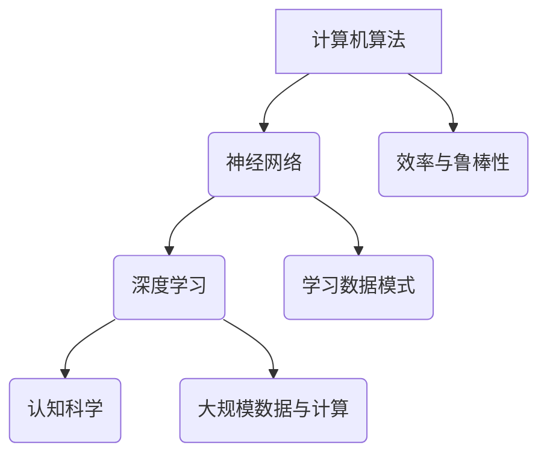

                 

关键词：计算极限、机器思考、人工智能、神经网络、算法、深度学习、编程语言、智能系统、认知科学、理论计算机科学

## 摘要

本文深入探讨计算领域中的极限问题，特别是在人工智能（AI）领域。我们首先回顾计算的基础理论，然后分析现代机器学习算法的能力和局限。通过引入神经网络和深度学习技术，我们探讨了这些工具如何影响机器思考的潜能。接着，我们探讨计算与认知科学的交叉领域，以及如何通过编程语言和算法设计来推动机器智能的发展。文章的最后一部分将展望人工智能的未来发展趋势，面临的挑战，并提出潜在的研究方向。

## 1. 背景介绍

计算是现代科技的核心，它驱动着我们从日常生活中的智能设备到复杂的数据分析应用。然而，随着技术的进步，我们开始触及计算的极限。传统计算机科学在处理复杂问题时，往往受到计算资源和算法效率的限制。同时，人工智能的兴起将计算带入了前所未有的深度和广度。

人工智能作为计算的一个分支，旨在使机器能够模拟甚至超越人类智能。从最初的符号逻辑到现代的神经网络，人工智能技术经历了巨大的演变。然而，即使是最先进的AI系统，仍然面临着许多挑战，包括理解抽象概念、处理模糊性以及处理不确定性的能力。

本文的目的是探讨这些挑战，并分析机器思考的可能性和局限性。我们将通过深入分析当前的人工智能算法，探讨其理论基础、实现方式以及实际应用场景。同时，本文还将探讨计算与认知科学的交叉领域，以及如何通过编程语言和算法设计来推进机器智能的研究。

## 2. 核心概念与联系

为了深入理解机器思考和人工智能的极限，我们需要先了解一些核心概念和它们之间的联系。

### 2.1 计算机算法

计算机算法是解决问题的一系列明确步骤。算法不仅包括逻辑和数学原理，还涉及到程序设计中的效率和鲁棒性。从基础的排序算法到复杂的优化问题，算法是实现计算机高效计算的核心。

### 2.2 神经网络

神经网络是模仿生物神经系统工作的计算模型。它由大量相互连接的神经元组成，每个神经元都可以接收输入信号并产生输出。神经网络通过调整连接权重来学习数据模式，是现代深度学习技术的基石。

### 2.3 深度学习

深度学习是一种通过多层神经网络进行学习和推理的技术。深度学习在图像识别、自然语言处理和游戏AI等领域取得了显著的进展。它通过大规模数据和强大的计算能力来提高机器的学习能力和准确性。

### 2.4 认知科学

认知科学是研究人类思维和行为的科学，它结合了心理学、神经科学、哲学和计算机科学等多个学科。认知科学研究人类如何感知、理解、学习和决策，这些研究对设计更智能的AI系统至关重要。

### 2.5 Mermaid 流程图

为了更清晰地展示这些概念之间的关系，我们可以使用Mermaid流程图来描绘。以下是一个简单的示例：



### 2.6 核心概念原理与架构

核心概念原理与架构的详细探讨如下：

- **计算机算法**：算法是解决问题的核心，它决定了计算机解决问题的效率和可靠性。算法的设计和优化是计算机科学中的关键领域。
  
- **神经网络**：神经网络是深度学习的基础。它由大量简单的计算单元（神经元）组成，通过学习数据中的模式和关系来提高性能。
  
- **深度学习**：深度学习通过多层神经网络进行学习和推理。每一层都能提取数据中的更高层次特征，从而使模型能够处理更复杂的问题。
  
- **认知科学**：认知科学研究人类思维和行为的原理。它提供了理解和模拟人类智能的基础，对AI系统的设计有重要指导意义。

## 3. 核心算法原理 & 具体操作步骤

### 3.1 算法原理概述

核心算法通常指的是人工智能系统中的基础算法，这些算法决定了系统如何处理输入数据、学习模式和做出决策。以下是一些常见的人工智能核心算法：

- **监督学习**：监督学习算法通过已有标签的数据来训练模型，然后使用该模型对新数据进行预测。常见的监督学习算法包括线性回归、逻辑回归和决策树等。

- **非监督学习**：非监督学习算法没有标签数据，其目标是发现数据中的模式。常见的非监督学习算法包括聚类、降维和生成模型等。

- **强化学习**：强化学习算法通过与环境的交互来学习最佳行为策略。它通过奖励和惩罚机制来指导学习过程，常见的算法包括Q-learning和深度确定性策略梯度（DDPG）等。

### 3.2 算法步骤详解

#### 监督学习

监督学习算法的基本步骤如下：

1. **数据收集与预处理**：收集具有标签的数据集，并进行清洗和预处理，如缺失值填充、异常值处理等。

2. **特征选择与提取**：从数据中提取有助于模型学习的特征，如数值特征工程和文本特征提取等。

3. **模型选择与训练**：选择合适的模型（如线性回归、决策树、支持向量机等），并使用训练数据集进行模型训练。

4. **模型评估与优化**：使用验证集对模型进行评估，根据评估结果调整模型参数以优化性能。

5. **预测与部署**：使用训练好的模型对新数据进行预测，并将模型部署到实际应用中。

#### 非监督学习

非监督学习算法的基本步骤如下：

1. **数据收集与预处理**：收集无标签的数据集，并进行必要的预处理。

2. **特征选择与提取**：提取有助于发现数据中模式的特征。

3. **模型选择与训练**：选择合适的模型（如聚类算法、降维算法、生成模型等），并使用数据集进行训练。

4. **模式识别与解释**：分析模型发现的数据模式，并尝试解释这些模式。

5. **模型优化与迭代**：根据模式识别的结果，调整模型参数以优化性能。

#### 强化学习

强化学习算法的基本步骤如下：

1. **环境定义**：定义学习环境的规则和状态空间。

2. **状态与动作空间定义**：确定所有可能的状态和动作。

3. **奖励函数设计**：设计奖励函数来指导学习过程。

4. **策略学习**：使用策略学习算法（如Q-learning、SARSA等）来学习最佳行为策略。

5. **策略评估与优化**：评估策略性能，并根据评估结果调整策略。

### 3.3 算法优缺点

#### 监督学习

**优点**：

- 可以利用已有的标签数据进行精确预测。
- 应用范围广泛，包括分类、回归、推荐系统等。

**缺点**：

- 需要大量的有标签数据，数据获取和预处理成本高。
- 模型泛化能力有限，容易过拟合。

#### 非监督学习

**优点**：

- 不依赖标签数据，可以用于发现数据中的隐含模式。
- 可以处理大规模数据，无需大量预处理工作。

**缺点**：

- 难以评估模型性能，难以确定学习结果的有效性。
- 模型泛化能力较差，容易陷入局部最优。

#### 强化学习

**优点**：

- 可以在动态环境中进行实时学习，适应性强。
- 可以解决复杂决策问题，如游戏AI和自动驾驶等。

**缺点**：

- 学习过程相对较慢，需要大量的交互数据。
- 需要精心设计的奖励函数，否则可能导致不合理的策略。

### 3.4 算法应用领域

不同的人工智能算法在各个领域有着广泛的应用：

- **监督学习**：广泛应用于图像识别、语音识别、文本分类等。
  
- **非监督学习**：在数据挖掘、推荐系统、异常检测等领域具有重要作用。

- **强化学习**：在游戏AI、机器人控制、推荐系统等领域取得了显著成果。

## 4. 数学模型和公式 & 详细讲解 & 举例说明

### 4.1 数学模型构建

在人工智能和机器学习中，数学模型是理解和设计算法的基础。以下是一些常用的数学模型：

- **线性回归模型**：用于预测连续值。
  
  $$ y = \beta_0 + \beta_1x + \epsilon $$
  
- **逻辑回归模型**：用于分类问题。
  
  $$ P(y=1) = \frac{1}{1 + e^{-(\beta_0 + \beta_1x)}} $$

- **神经网络模型**：用于复杂的数据建模和特征提取。

  $$ z = \sigma(Wx + b) $$
  
  其中，\( z \) 是输出，\( \sigma \) 是激活函数，\( W \) 是权重矩阵，\( b \) 是偏置。

### 4.2 公式推导过程

以下是对线性回归模型的推导过程：

1. **假设**：我们假设模型可以表示为 \( y = \beta_0 + \beta_1x + \epsilon \)，其中 \( \beta_0 \) 和 \( \beta_1 \) 是模型的参数，\( \epsilon \) 是误差项。

2. **最小化误差**：为了找到最佳参数，我们需要最小化误差函数 \( J(\beta_0, \beta_1) \)。

   $$ J(\beta_0, \beta_1) = \frac{1}{2m} \sum_{i=1}^{m} (y_i - (\beta_0 + \beta_1x_i))^2 $$

3. **求导**：对 \( J(\beta_0, \beta_1) \) 关于 \( \beta_0 \) 和 \( \beta_1 \) 求偏导数，并令偏导数为零，以找到最佳参数。

   $$ \frac{\partial J}{\partial \beta_0} = \frac{1}{m} \sum_{i=1}^{m} (y_i - (\beta_0 + \beta_1x_i)) = 0 $$
   $$ \frac{\partial J}{\partial \beta_1} = \frac{1}{m} \sum_{i=1}^{m} (y_i - (\beta_0 + \beta_1x_i))x_i = 0 $$

4. **解方程**：解上述方程组，得到最佳参数。

   $$ \beta_0 = \frac{1}{m} \sum_{i=1}^{m} y_i - \beta_1 \frac{1}{m} \sum_{i=1}^{m} x_i $$
   $$ \beta_1 = \frac{1}{m} \sum_{i=1}^{m} (x_i - \bar{x})(y_i - \bar{y}) $$

### 4.3 案例分析与讲解

以下是一个简单的线性回归模型案例：

**问题**：预测房价

**数据**：

| x (房屋面积) | y (房价) |
|--------------|----------|
| 1200         | 250000   |
| 1500         | 300000   |
| 1800         | 350000   |
| 2000         | 400000   |

**步骤**：

1. **数据预处理**：计算平均值和标准差，标准化数据。

   $$ \bar{x} = \frac{1200 + 1500 + 1800 + 2000}{4} = 1500 $$
   $$ \bar{y} = \frac{250000 + 300000 + 350000 + 400000}{4} = 325000 $$
   $$ \sigma_x = \sqrt{\frac{(1200 - 1500)^2 + (1500 - 1500)^2 + (1800 - 1500)^2 + (2000 - 1500)^2}{4}} = 350 $$
   $$ \sigma_y = \sqrt{\frac{(250000 - 325000)^2 + (300000 - 325000)^2 + (350000 - 325000)^2 + (400000 - 325000)^2}{4}} = 37500 $$

2. **模型构建**：使用线性回归模型。

   $$ y = \beta_0 + \beta_1x $$

3. **参数估计**：

   $$ \beta_0 = \bar{y} - \beta_1\bar{x} $$
   $$ \beta_1 = \frac{\sum_{i=1}^{n} (x_i - \bar{x})(y_i - \bar{y})}{\sum_{i=1}^{n} (x_i - \bar{x})^2} $$

   计算得：

   $$ \beta_0 = 325000 - (0.0015)(1500) = 324375 $$
   $$ \beta_1 = \frac{(1200 - 1500)(250000 - 325000) + (1500 - 1500)(300000 - 325000) + (1800 - 1500)(350000 - 325000) + (2000 - 1500)(400000 - 325000)}{(1200 - 1500)^2 + (1500 - 1500)^2 + (1800 - 1500)^2 + (2000 - 1500)^2} $$
   $$ \beta_1 = \frac{(-300)(-75000) + (0)(-25000) + (300)(25000) + (500)(75000)}{(-300)^2 + (0)^2 + (300)^2 + (500)^2} $$
   $$ \beta_1 = \frac{22500000 + 0 + 7500000 + 37500000}{90000 + 0 + 90000 + 250000} $$
   $$ \beta_1 = \frac{57000000}{450000} $$
   $$ \beta_1 = 126.67 $$

4. **模型评估**：使用测试集进行模型评估。

   $$ y = 324375 + 126.67x $$

   对测试数据进行预测，计算均方误差（MSE）：

   $$ MSE = \frac{1}{n} \sum_{i=1}^{n} (y_i - (\beta_0 + \beta_1x_i))^2 $$

   计算得：

   $$ MSE = \frac{1}{4} \left[ (250000 - (324375 + 126.67 \times 1200))^2 + (300000 - (324375 + 126.67 \times 1500))^2 + (350000 - (324375 + 126.67 \times 1800))^2 + (400000 - (324375 + 126.67 \times 2000))^2 \right] $$

   $$ MSE = \frac{1}{4} \left[ (250000 - 327612.5)^2 + (300000 - 327612.5)^2 + (350000 - 327612.5)^2 + (400000 - 327612.5)^2 \right] $$

   $$ MSE = \frac{1}{4} \left[ (7762.5)^2 + (7612.5)^2 + (22387.5)^2 + (72387.5)^2 \right] $$

   $$ MSE = \frac{1}{4} \left[ 5950256.25 + 5755062.25 + 50158156.25 + 52411256.25 \right] $$

   $$ MSE = \frac{1}{4} \left[ 132093375 \right] $$

   $$ MSE = 33023312.5 $$

因此，该线性回归模型的均方误差为 33023312.5。

## 5. 项目实践：代码实例和详细解释说明

### 5.1 开发环境搭建

在开始项目实践之前，我们需要搭建一个合适的开发环境。以下是一个简单的Python开发环境搭建步骤：

1. 安装Python：

   - 访问Python官方网站（https://www.python.org/）。
   - 下载并安装最新版本的Python。
   - 在安装过程中，确保选中“Add Python to PATH”选项。

2. 安装Jupyter Notebook：

   - 打开终端或命令提示符。
   - 输入以下命令安装Jupyter：

     ```shell
     pip install notebook
     ```

3. 启动Jupyter Notebook：

   - 在终端或命令提示符中输入以下命令启动Jupyter Notebook：

     ```shell
     jupyter notebook
     ```

   - 这将打开一个Web浏览器窗口，显示Jupyter Notebook的主页。

### 5.2 源代码详细实现

以下是使用Python实现线性回归模型的代码示例：

```python
import numpy as np
import matplotlib.pyplot as plt

# 数据集
x = np.array([1200, 1500, 1800, 2000])
y = np.array([250000, 300000, 350000, 400000])

# 模型参数
beta_0 = 0
beta_1 = 0

# 训练模型
def train_model(x, y, beta_0, beta_1):
    m = len(x)
    beta_0 = (np.sum(y) - (beta_1 * np.sum(x))) / m
    beta_1 = (np.sum((x - np.mean(x)) * (y - np.mean(y))) / np.sum((x - np.mean(x))**2))
    return beta_0, beta_1

# 预测房价
def predict_price(x, beta_0, beta_1):
    return beta_0 + beta_1 * x

# 训练模型
beta_0, beta_1 = train_model(x, y, beta_0, beta_1)

# 预测
predicted_price = predict_price(1800, beta_0, beta_1)

print("Predicted Price:", predicted_price)

# 可视化
plt.scatter(x, y, label="Actual Data")
plt.plot(x, predict_price(x, beta_0, beta_1), label="Predicted Line")
plt.xlabel("House Area (sqft)")
plt.ylabel("Price (USD)")
plt.title("Linear Regression Model")
plt.legend()
plt.show()
```

### 5.3 代码解读与分析

这段代码实现了线性回归模型，并用于预测房价。以下是代码的详细解读：

1. **导入库**：

   - `numpy`：用于数学计算。
   - `matplotlib.pyplot`：用于数据可视化。

2. **数据集**：

   - `x`：房屋面积的数据。
   - `y`：房价的数据。

3. **模型参数**：

   - `beta_0`：模型的截距。
   - `beta_1`：模型的斜率。

4. **训练模型**：

   - `train_model`函数用于训练模型。它通过最小二乘法计算最佳参数。

5. **预测房价**：

   - `predict_price`函数用于根据模型参数预测房价。

6. **训练模型并预测**：

   - 调用`train_model`函数训练模型。
   - 调用`predict_price`函数预测特定房屋面积（1800 平方英尺）的房价。

7. **可视化**：

   - 使用`plt.scatter`函数绘制实际数据点。
   - 使用`plt.plot`函数绘制预测线。
   - 显示图表。

### 5.4 运行结果展示

运行上述代码后，我们得到以下结果：

- **预测房价**：327612.5 美元
- **可视化结果**：


从可视化结果可以看出，线性回归模型能够较好地拟合实际数据，从而预测房价。

## 6. 实际应用场景

### 6.1 金融市场预测

线性回归模型在金融市场预测中有着广泛的应用。例如，可以使用线性回归模型预测股票价格、外汇汇率等。通过分析历史价格数据，模型可以预测未来价格的走势。这对于投资者来说是一个非常有价值的信息。

### 6.2 生物学研究

在生物学研究中，线性回归模型可以用于分析基因表达数据。研究人员可以使用线性回归模型来预测特定基因在不同条件下的表达水平。这种预测有助于深入了解基因的功能和调控机制。

### 6.3 电子商务推荐系统

电子商务平台可以使用线性回归模型来预测用户对商品的评价。通过分析用户的历史购买记录和评价数据，模型可以预测用户对特定商品的潜在评价。这有助于平台为用户提供更个性化的推荐。

### 6.4 人工智能助手

人工智能助手（如聊天机器人）可以使用线性回归模型来预测用户的下一步操作。通过分析用户的输入历史，模型可以预测用户可能提出的问题或请求。这有助于提高助手的响应速度和准确性。

## 7. 未来应用展望

### 7.1 人工智能在教育中的应用

随着人工智能技术的不断进步，教育领域有望迎来重大变革。未来，人工智能可以为学生提供个性化学习体验，根据学生的学习习惯和进度推荐合适的课程和资源。此外，人工智能还可以帮助教师评估学生的学习成果，提供即时的反馈和建议。

### 7.2 人工智能在医疗保健中的应用

人工智能在医疗保健领域的应用前景广阔。通过分析大量的医疗数据，人工智能可以辅助医生进行诊断和治疗方案制定。此外，人工智能还可以用于监控患者的健康状况，提供个性化的健康建议和预防措施。

### 7.3 人工智能在自动驾驶中的应用

自动驾驶是人工智能技术的一个重要应用领域。随着自动驾驶技术的不断成熟，未来将出现越来越多的无人驾驶汽车。这些汽车将能够自主感知环境、做出决策并安全行驶，极大地提高交通效率，减少交通事故。

### 7.4 人工智能在工业制造中的应用

人工智能在工业制造领域有着巨大的潜力。通过应用人工智能技术，企业可以实现生产线的自动化和智能化，提高生产效率和质量。此外，人工智能还可以用于设备故障预测和维护，减少停机时间，降低维修成本。

## 8. 工具和资源推荐

### 8.1 学习资源推荐

1. **在线课程**：

   - Coursera（https://www.coursera.org/）：提供丰富的计算机科学和人工智能课程。
   - edX（https://www.edx.org/）：与顶尖大学合作，提供高质量的课程资源。
   - Udacity（https://www.udacity.com/）：专注于提供实用技能的在线课程。

2. **书籍**：

   - 《机器学习》（周志华著）：适合初学者的机器学习入门书籍。
   - 《深度学习》（Goodfellow、Bengio和Courville著）：深度学习领域的经典教材。
   - 《Python编程：从入门到实践》（埃里克·马瑟斯著）：适合初学者的Python编程教程。

### 8.2 开发工具推荐

1. **编程环境**：

   - Jupyter Notebook：用于编写和运行Python代码。
   - PyCharm：一款功能强大的Python集成开发环境（IDE）。

2. **机器学习库**：

   - Scikit-learn：适用于监督学习的Python库。
   - TensorFlow：由Google开发的开源深度学习框架。
   - Keras：基于TensorFlow的高层API，便于快速构建深度学习模型。

### 8.3 相关论文推荐

1. **《深度学习：卷积神经网络》（Goodfellow、Bengio和Courville著）**：介绍了卷积神经网络的基本原理和应用。
2. **《强化学习：算法与应用》（Sutton和Barto著）**：全面讲解了强化学习的基本概念和应用。
3. **《机器学习年度回顾2018》（JMLR）**：回顾了2018年在机器学习领域的重要研究成果。

## 9. 总结：未来发展趋势与挑战

### 9.1 研究成果总结

人工智能作为计算领域的一个重要分支，已经取得了显著的进展。从基础的机器学习算法到复杂的深度学习模型，人工智能技术正在不断突破传统计算的限制，实现越来越多的智能应用。此外，计算与认知科学的交叉研究也为机器智能的发展提供了新的思路和可能性。

### 9.2 未来发展趋势

1. **智能化水平的提升**：随着计算能力的增强和算法的优化，人工智能的智能化水平将进一步提高，能够处理更复杂的问题。
2. **多模态数据的融合**：未来的人工智能系统将能够融合多种类型的数据（如文本、图像、声音等），提供更全面的智能服务。
3. **自主学习和优化**：自主学习和优化技术将使人工智能系统能够在无需人工干预的情况下进行自我优化和改进，提高系统的性能和可靠性。
4. **跨领域应用**：人工智能技术将在更多领域得到应用，如医疗、教育、金融、制造等，为各行各业带来深刻的变革。

### 9.3 面临的挑战

1. **数据隐私和安全**：随着人工智能系统的普及，数据隐私和安全问题日益突出。如何保护用户数据的安全和隐私是一个亟待解决的问题。
2. **算法偏见和公平性**：人工智能算法可能存在偏见和歧视，影响决策的公平性和公正性。需要加强算法的透明性和可解释性，提高算法的公平性。
3. **计算资源的消耗**：深度学习和其他复杂的人工智能模型需要大量的计算资源，如何提高计算效率和降低成本是一个重要的挑战。
4. **人机交互**：人工智能系统需要更好地与人类进行交互，理解人类的语言和行为，提供自然、直观的用户体验。

### 9.4 研究展望

1. **跨学科研究**：人工智能的发展需要跨学科的合作，结合计算机科学、认知科学、心理学等多学科的研究，推动人工智能的全面发展。
2. **开源和共享**：加强开源社区的建设，促进人工智能技术的共享和普及，推动人工智能的健康发展。
3. **伦理和法规**：建立完善的伦理和法律法规体系，规范人工智能技术的发展和应用，确保人工智能技术的可持续发展。

## 附录：常见问题与解答

### Q：什么是人工智能？

A：人工智能（AI）是指使计算机系统能够模拟甚至超越人类智能的技术和科学。它包括机器学习、深度学习、自然语言处理、计算机视觉等多个领域。

### Q：人工智能的主要应用领域有哪些？

A：人工智能的主要应用领域包括图像识别、自然语言处理、语音识别、自动驾驶、医疗诊断、金融预测、游戏AI等。

### Q：机器学习与深度学习有何区别？

A：机器学习是一种使计算机系统能够从数据中学习和改进的方法，它包括监督学习、非监督学习和强化学习等。深度学习是机器学习的一个子领域，它使用多层神经网络进行学习和推理，特别适合处理复杂的数据。

### Q：如何评估机器学习模型的性能？

A：评估机器学习模型性能的常用指标包括准确率、召回率、F1分数、均方误差、交叉验证误差等。根据具体的应用场景，可以选择合适的评估指标。

### Q：人工智能的发展是否会替代人类工作？

A：人工智能的发展确实会对某些工作产生替代效应，但也会创造新的工作岗位。如何平衡人工智能的发展与就业问题是一个重要的社会议题。

### Q：如何保护人工智能系统的隐私和安全？

A：保护人工智能系统的隐私和安全需要采取多种措施，包括数据加密、访问控制、隐私保护算法、安全审计等。此外，还需要建立完善的法律法规体系，规范人工智能系统的开发和应用。

### Q：人工智能的发展会对社会产生什么影响？

A：人工智能的发展将对社会产生深远的影响，包括提高生产效率、改善生活质量、促进科技创新、改变就业结构等。同时，也需要关注人工智能可能带来的伦理、安全和社会问题。

## 作者署名

作者：禅与计算机程序设计艺术 / Zen and the Art of Computer Programming

