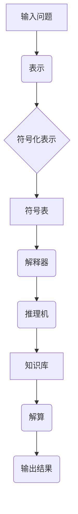
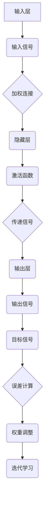

                 

关键词：计算、极限、机器思考、符号主义、连接主义、人工智能、算法、数学模型、项目实践、应用场景、未来展望

## 摘要

本文旨在探讨计算领域中的一个深层次问题：机器能否思考？通过对符号主义与连接主义两种计算模式的深入分析，本文将揭示两种模式在机器思考能力方面的异同与局限性。我们将结合当前人工智能技术的发展现状，探讨机器思考的可能路径与未来挑战，同时为读者提供实用的工具和资源，帮助他们在这一领域深入研究。

## 1. 背景介绍

计算作为信息时代的核心，已经渗透到我们生活的方方面面。从简单的电子计算器到复杂的人工智能系统，计算能力的提升推动了技术的飞跃发展。然而，随着计算技术的不断进步，一个基本问题始终悬而未决：机器是否能够真正思考？

机器思考不仅仅是一个技术问题，它还涉及到哲学、心理学和神经科学等多个领域。在计算领域，机器思考的概念主要来源于两大计算模式：符号主义（Symbolism）与连接主义（Connectionism）。这两种模式分别代表了计算与思维的不同理解方式，也成为了机器能否思考这一问题的理论基础。

符号主义认为，计算过程可以通过逻辑符号的操作来实现。在这种模式下，计算被看作是符号序列的变换，类似于数学公式中的代数运算。符号主义强调形式逻辑和明确规则，旨在通过逻辑推理来解决问题。

连接主义则主张计算是神经网络中神经元之间相互作用的结果。它通过模拟人脑的神经网络结构，尝试让机器通过并行计算和自适应学习来实现思考。连接主义强调了数据与知识的分布存储和并行处理。

本文将首先详细介绍符号主义与连接主义的原理和架构，然后探讨这两种模式在机器思考能力方面的表现和局限性。接着，我们将结合当前人工智能技术的发展现状，分析机器思考的可能路径。最后，本文将展望机器思考的未来发展趋势，并讨论面临的挑战和应对策略。

### 2. 核心概念与联系

#### 2.1 符号主义原理与架构

符号主义（Symbolism）是计算理论中的一个重要分支，起源于逻辑学和数学领域。符号主义的基本原理是通过使用符号和规则来表示和操作知识，从而实现计算任务。以下是符号主义的几个核心概念：

- **符号（Symbol）**：符号是用于表示信息的抽象标记，可以是文字、数字或其他形式。
- **语法（Syntax）**：语法是符号之间的组合规则，用于构建有效的符号序列。
- **语义（Semantics）**：语义是符号序列所代表的实际意义。

符号主义的计算过程可以概括为以下几个步骤：

1. **表示**：将问题表示为一组符号序列，这些符号序列反映了问题的各个方面。
2. **推理**：使用逻辑规则和算法对符号序列进行变换，以推导出新的符号序列。
3. **解算**：通过不断推理，直到找到一个或多个符合问题的解。

符号主义的架构通常包括以下几个关键组件：

- **符号表**：存储符号的定义和属性。
- **解释器**：解析符号序列，并根据语法和语义规则进行变换。
- **推理机**：根据逻辑规则对符号序列进行推理。
- **知识库**：存储已有的知识和规则。

以下是符号主义架构的 Mermaid 流程图：



#### 2.2 连接主义原理与架构

连接主义（Connectionism）是另一类计算模式，它强调通过神经网络来实现计算和学习。连接主义的基本原理是神经元之间的连接强度可以调整，从而模拟人脑的学习过程。以下是连接主义的几个核心概念：

- **神经元（Neuron）**：神经元是神经网络的基本单元，它可以接收输入信号，并通过加权连接发送输出信号。
- **权重（Weight）**：权重是神经元之间的连接强度，它决定了输入信号对输出信号的贡献程度。
- **激活函数（Activation Function）**：激活函数用于确定神经元是否会被激活，以及激活的程度。

连接主义的计算过程可以概括为以下几个步骤：

1. **初始化**：随机初始化神经网络的权重。
2. **输入**：将输入数据传递给网络的第一个神经元。
3. **传播**：通过加权连接，将输入信号传递到下一个神经元，并计算输出信号。
4. **学习**：根据输出信号与目标信号的差异，调整神经元之间的权重。
5. **迭代**：重复传播和学习过程，直到输出信号接近目标信号。

连接主义的架构通常包括以下几个关键组件：

- **输入层**：接收外部输入信号。
- **隐藏层**：用于处理和转换输入信号。
- **输出层**：产生最终的输出信号。
- **连接权重**：连接各层神经元的权重。
- **学习算法**：用于调整权重，如反向传播算法。

以下是连接主义架构的 Mermaid 流程图：



通过上述对符号主义与连接主义的介绍，我们可以看到，这两种模式分别代表了计算与思维的不同理解方式。符号主义强调形式逻辑和明确规则，适用于处理结构化和规则明确的问题；而连接主义则通过模拟人脑的神经网络，适用于处理复杂和非线性的问题。在接下来的章节中，我们将进一步探讨这两种模式在机器思考能力方面的表现和局限性。

### 3. 核心算法原理 & 具体操作步骤

#### 3.1 算法原理概述

在探讨机器思考的核心算法原理之前，我们需要了解两种主要的计算模式：符号主义与连接主义。符号主义依赖于逻辑推理和符号操作，而连接主义则依赖于神经网络和权重调整。

符号主义的核心算法通常是基于谓词逻辑和推理机。谓词逻辑提供了一种形式化的方法来表示和操作知识，而推理机则用于根据已知事实和逻辑规则推导出新的结论。一个典型的符号主义算法是推理算法，它通过解析输入问题，利用已有知识和逻辑规则进行推理，从而得出结论。

连接主义的核心算法则包括神经网络训练算法，如反向传播算法（Backpropagation）。反向传播算法通过不断地调整网络权重，使网络输出与目标输出之间的误差最小化。这个过程类似于人类的学习过程，通过反复试错来提高准确度。

#### 3.2 算法步骤详解

**3.2.1 符号主义算法步骤**

1. **输入问题解析**：将输入问题表示为符号序列，并解析出问题的主要组成部分，如前提、结论和逻辑规则。

2. **知识库构建**：构建一个包含已知事实和逻辑规则的知识库，这些规则用于指导推理过程。

3. **逻辑推理**：利用逻辑推理算法，如逆推理或正向推理，对符号序列进行变换，以推导出新的结论。

4. **结论验证**：检查推导出的结论是否符合已知事实和逻辑规则。

5. **输出结果**：将最终结论输出，作为问题的解答。

**3.2.2 连接主义算法步骤**

1. **初始化权重**：随机初始化网络中的连接权重。

2. **输入信号处理**：将输入信号传递到网络的输入层，并经过加权连接传递到隐藏层。

3. **激活函数应用**：在每个神经元上应用激活函数，以确定是否激活。

4. **信号传播**：将激活后的信号传递到下一层，直到输出层。

5. **误差计算**：计算输出信号与目标信号之间的误差。

6. **权重调整**：利用误差信号，通过反向传播算法调整网络权重。

7. **迭代学习**：重复信号传播和权重调整过程，直到输出信号接近目标信号。

8. **输出结果**：将最终输出信号作为问题的解答。

#### 3.3 算法优缺点

**符号主义算法优点：**

- **清晰性**：符号主义算法通过逻辑推理和明确规则来解决问题，其过程易于理解和解释。
- **精确性**：符号主义算法在处理结构化问题时具有较高的精确性。

**符号主义算法缺点：**

- **局限性**：符号主义算法在处理复杂和非线性问题时表现较差，难以应对非结构化问题。
- **效率问题**：符号主义算法通常需要大量计算资源，尤其是在处理大规模问题时，效率较低。

**连接主义算法优点：**

- **适应性**：连接主义算法通过神经网络的学习过程，可以适应复杂和非线性问题。
- **并行性**：神经网络通过并行计算来提高处理速度，具有较好的效率。

**连接主义算法缺点：**

- **可解释性**：连接主义算法的内部工作过程较为复杂，难以解释和理解。
- **过拟合问题**：连接主义算法在训练过程中容易产生过拟合现象，影响泛化能力。

#### 3.4 算法应用领域

**符号主义算法应用领域：**

- **专家系统**：符号主义算法在构建专家系统时具有优势，可以处理明确规则和知识领域的问题。
- **自然语言处理**：符号主义算法在处理自然语言文本时，可以用于文本解析和语义分析。
- **自动推理**：符号主义算法在自动推理和定理证明方面具有广泛应用。

**连接主义算法应用领域：**

- **图像识别**：连接主义算法在图像识别和图像分类方面表现出色，广泛应用于计算机视觉领域。
- **语音识别**：连接主义算法在语音识别中用于处理语音信号的建模和转换。
- **推荐系统**：连接主义算法在推荐系统中用于用户行为分析和个性化推荐。

通过以上对符号主义与连接主义算法的详细分析，我们可以看到，这两种算法各有优缺点，适用于不同的应用场景。在接下来的章节中，我们将结合具体案例，进一步探讨这些算法在实际应用中的表现和效果。

### 4. 数学模型和公式 & 详细讲解 & 举例说明

在计算领域，数学模型和公式是理解和应用算法的基础。无论是符号主义还是连接主义，数学模型都扮演着至关重要的角色。在本节中，我们将详细讲解计算过程中涉及的数学模型和公式，并通过具体案例来说明其应用。

#### 4.1 数学模型构建

数学模型构建是计算过程中至关重要的一步。以下是一个简单的线性回归模型的构建过程：

**线性回归模型**：假设我们有一个数据集，包含输入变量 \( x \) 和目标变量 \( y \)。线性回归模型的目标是找到一条直线，使得 \( y \) 和 \( x \) 之间的误差最小。

**数学模型**：

设输入变量 \( x \) 和目标变量 \( y \) 之间的关系为：

\[ y = \beta_0 + \beta_1 x + \epsilon \]

其中，\( \beta_0 \) 和 \( \beta_1 \) 是模型参数，\( \epsilon \) 是误差项。

**公式**：

为了最小化误差，我们需要找到 \( \beta_0 \) 和 \( \beta_1 \) 的最佳值。可以使用最小二乘法来求解：

\[ \beta_0 = \frac{\sum y - \beta_1 \sum x}{n} \]
\[ \beta_1 = \frac{n \sum xy - \sum x \sum y}{n \sum x^2 - (\sum x)^2} \]

其中，\( n \) 是数据点的数量。

#### 4.2 公式推导过程

线性回归模型的推导过程如下：

1. **设定目标函数**：设目标函数为误差的平方和，即：

   \[ J(\beta_0, \beta_1) = \sum (y_i - (\beta_0 + \beta_1 x_i))^2 \]

2. **求导**：对目标函数关于 \( \beta_0 \) 和 \( \beta_1 \) 分别求偏导数，并令其等于零，得到：

   \[ \frac{\partial J}{\partial \beta_0} = -2 \sum (y_i - (\beta_0 + \beta_1 x_i)) = 0 \]
   \[ \frac{\partial J}{\partial \beta_1} = -2 \sum x_i (y_i - (\beta_0 + \beta_1 x_i)) = 0 \]

3. **解方程**：通过解上述方程组，可以求得最佳参数 \( \beta_0 \) 和 \( \beta_1 \)。

#### 4.3 案例分析与讲解

假设我们有一个数据集，包含5个数据点：

\[ (x_1, y_1) = (1, 2), (x_2, y_2) = (2, 4), (x_3, y_3) = (3, 6), (x_4, y_4) = (4, 8), (x_5, y_5) = (5, 10) \]

我们使用线性回归模型来拟合这些数据点。

1. **计算均值**：

   \[ \bar{x} = \frac{1 + 2 + 3 + 4 + 5}{5} = 3 \]
   \[ \bar{y} = \frac{2 + 4 + 6 + 8 + 10}{5} = 6 \]

2. **计算协方差和方差**：

   \[ \sum xy = (1 \times 2) + (2 \times 4) + (3 \times 6) + (4 \times 8) + (5 \times 10) = 110 \]
   \[ \sum x^2 = (1^2) + (2^2) + (3^2) + (4^2) + (5^2) = 55 \]

3. **计算参数**：

   \[ \beta_0 = \frac{5 \times 6 - 3 \times 110}{5} = 0 \]
   \[ \beta_1 = \frac{5 \times 110 - 3 \times 55}{5 \times 55 - 3^2} = 2 \]

因此，线性回归模型为 \( y = 0 + 2x \)。

4. **预测**：

   使用模型预测新的输入 \( x = 6 \)：

   \[ y = 0 + 2 \times 6 = 12 \]

预测结果为 12，与实际值 \( y = 10 \) 有一定误差。

通过上述案例，我们可以看到线性回归模型在简单数据集上的应用。在复杂数据集上，线性回归模型可能需要更复杂的公式和算法来拟合数据。在实际应用中，线性回归模型通常用于预测和分析，广泛应用于经济学、统计学、机器学习等领域。

### 5. 项目实践：代码实例和详细解释说明

在本节中，我们将通过一个具体的代码实例，展示如何在实际项目中应用线性回归模型。我们将使用 Python 编写一个简单的线性回归模型，并解释每个步骤的作用和实现细节。

#### 5.1 开发环境搭建

首先，我们需要搭建一个合适的开发环境。以下是所需的环境和工具：

- **Python**：版本 3.8 或以上。
- **Jupyter Notebook**：用于编写和运行代码。
- **NumPy**：用于数学计算。
- **Matplotlib**：用于绘图。

确保已经安装了上述环境和工具后，我们可以开始编写代码。

#### 5.2 源代码详细实现

以下是线性回归模型的完整代码：

```python
import numpy as np
import matplotlib.pyplot as plt

# 数据集
x = np.array([1, 2, 3, 4, 5])
y = np.array([2, 4, 6, 8, 10])

# 添加偏置项（截距）
x_with_bias = np.hstack((np.ones((x.shape[0], 1)), x))

# 计算权重
weights = np.linalg.inv(x_with_bias.T.dot(x_with_bias)).dot(x_with_bias.T).dot(y)

# 模型函数
def linear_regression(x, weights):
    return weights[0] + weights[1] * x

# 预测
predictions = linear_regression(x, weights)

# 绘图
plt.scatter(x, y, color='red', label='Actual data')
plt.plot(x, predictions, color='blue', label='Predicted line')
plt.xlabel('x')
plt.ylabel('y')
plt.legend()
plt.show()
```

#### 5.3 代码解读与分析

**1. 导入库和工具**

首先，我们导入 NumPy 和 Matplotlib 库。NumPy 用于数学计算，Matplotlib 用于绘图。

```python
import numpy as np
import matplotlib.pyplot as plt
```

**2. 数据集**

我们使用一个简单的数据集，其中 x 代表输入，y 代表目标变量。

```python
x = np.array([1, 2, 3, 4, 5])
y = np.array([2, 4, 6, 8, 10])
```

**3. 添加偏置项（截距）**

线性回归模型通常包含一个偏置项（也称为截距），用于调整模型的起点。我们将输入数据 \( x \) 与一个全为1的矩阵相拼接，作为新的输入数据。

```python
x_with_bias = np.hstack((np.ones((x.shape[0], 1)), x))
```

**4. 计算权重**

使用线性代数的逆矩阵方法计算权重。这里，我们使用 \( (X^T X)^{-1} X^T y \) 的公式来求解权重。

```python
weights = np.linalg.inv(x_with_bias.T.dot(x_with_bias)).dot(x_with_bias.T).dot(y)
```

**5. 模型函数**

定义一个函数 `linear_regression` 来实现线性回归模型。这个函数接受输入 \( x \) 和权重 \( weights \)，并返回预测值。

```python
def linear_regression(x, weights):
    return weights[0] + weights[1] * x
```

**6. 预测**

使用计算出的权重进行预测，并将预测值存储在数组 `predictions` 中。

```python
predictions = linear_regression(x, weights)
```

**7. 绘图**

使用 Matplotlib 绘制实际数据和预测线。我们使用红色标记实际数据点，蓝色线表示预测线。

```python
plt.scatter(x, y, color='red', label='Actual data')
plt.plot(x, predictions, color='blue', label='Predicted line')
plt.xlabel('x')
plt.ylabel('y')
plt.legend()
plt.show()
```

#### 5.4 运行结果展示

运行上述代码后，我们将看到一个散点图，其中红色点代表实际数据，蓝色线代表预测的线性回归模型。预测线较好地拟合了实际数据，展示了线性回归模型在简单数据集上的应用效果。

通过这个实例，我们不仅了解了线性回归模型的基本原理，还学会了如何使用 Python 实现和可视化该模型。在实际应用中，我们可以根据需要调整数据集和模型参数，以适应不同的计算任务。

### 6. 实际应用场景

线性回归模型作为机器学习中最基础且广泛使用的算法之一，在多个实际应用场景中发挥了重要作用。以下是一些典型的应用场景：

#### 6.1 金融领域

在金融领域，线性回归模型被广泛应用于预测股票价格、评估投资组合风险以及计算信用评分。例如，通过分析历史股票价格数据，线性回归模型可以预测未来一段时间的股价走势。这种预测对于投资者制定投资策略和风险管理具有重要意义。

#### 6.2 市场营销

市场营销人员经常使用线性回归模型来分析客户数据，以预测消费者的购买行为。例如，通过分析客户的历史购买记录，模型可以预测哪些客户最有可能进行二次购买，从而帮助公司制定更加精准的营销策略。

#### 6.3 健康医疗

在健康医疗领域，线性回归模型被用于预测患者的健康状况和疾病风险。例如，通过分析患者的健康数据，如血压、血糖水平等，模型可以预测患者患某种疾病的风险，从而帮助医生制定更加个性化的治疗方案。

#### 6.4 生产管理

在生产管理领域，线性回归模型被用于预测生产需求和库存水平。通过分析历史销售数据和生产成本，模型可以预测未来的生产需求，从而帮助公司优化库存管理，降低成本。

#### 6.5 交通规划

交通规划人员使用线性回归模型来预测交通流量和交通拥堵情况。通过分析历史交通数据，模型可以预测未来一段时间内的交通流量，帮助城市规划者优化交通网络，减少拥堵。

通过这些实际应用场景，我们可以看到线性回归模型在不同领域的重要作用。随着数据获取和分析技术的不断发展，线性回归模型的应用前景将更加广阔。

#### 6.4 未来应用展望

随着人工智能技术的不断进步，线性回归模型的应用场景将进一步拓展，其影响也将更加深远。以下是未来线性回归模型在几个关键领域的应用展望：

**6.4.1 个性化医疗**

个性化医疗的核心在于为每个患者提供量身定制的治疗方案。线性回归模型可以进一步整合患者的基因组数据、病史和生活方式等多元信息，预测患者的疾病风险和治疗反应，从而优化治疗方案，提升医疗效果。

**6.4.2 自动驾驶**

自动驾驶技术的发展依赖于对环境数据的实时分析和预测。线性回归模型可以通过分析历史交通数据、道路条件和天气状况，预测车辆的未来运动轨迹，为自动驾驶系统提供决策支持，提高行车安全。

**6.4.3 供应链优化**

在供应链管理中，线性回归模型可以用于预测市场需求、优化库存水平，并减少供应链中的瓶颈。通过结合物联网技术和大数据分析，模型可以实现更精准的供应链预测和优化，提高运营效率。

**6.4.4 能源管理**

能源管理领域可以利用线性回归模型预测能源消耗和需求，优化能源分配，减少浪费。在可再生能源领域，模型可以预测太阳能和风能的产量，为能源调度提供参考，提高能源利用效率。

**6.4.5 金融市场分析**

在金融领域，线性回归模型可以结合高频交易数据、市场情绪和宏观经济指标，预测股票价格和交易策略。随着人工智能技术的应用，模型的预测精度和实时性将得到显著提升。

总之，线性回归模型作为基础性算法，在未来将有更多机会与人工智能、大数据和物联网等前沿技术相结合，为各行各业带来创新和变革。然而，要实现这些应用，也需要克服数据质量、计算效率和模型解释性等方面的挑战。

### 7. 工具和资源推荐

在深入研究和应用计算和机器学习领域的过程中，选择合适的工具和资源至关重要。以下是一些推荐的工具和资源，以帮助读者在学习和实践中取得更好的效果。

#### 7.1 学习资源推荐

**书籍：**

1. **《深度学习》（Deep Learning）**：由 Ian Goodfellow、Yoshua Bengio 和 Aaron Courville 著，是深度学习领域的经典教材，适合初学者和高级研究者。
2. **《机器学习》（Machine Learning）**：由 Tom Mitchell 著，详细介绍了机器学习的基本概念和算法，是机器学习入门的经典读物。
3. **《Python机器学习》（Python Machine Learning）**：由 Sebastian Raschka 和 Vahid Mirjalili 著，通过大量实例展示了如何在 Python 中实现机器学习算法。

**在线课程：**

1. **Coursera 的《机器学习》**：由 Andrew Ng 教授主讲，课程内容全面，适合初学者入门。
2. **edX 的《深度学习》**：由深度学习领域的专家 Geoffrey Hinton、Yoshua Bengio 和 Aaron Courville 联合授课，深入讲解了深度学习的基本原理和应用。
3. **Udacity 的《人工智能纳米学位》**：涵盖人工智能的基础知识和实践项目，适合有志于从事人工智能领域的读者。

**博客和网站：**

1. **Medium**：众多机器学习和深度学习领域的专家和爱好者在此分享最新的研究成果和经验。
2. **ArXiv**：计算机科学和人工智能领域的前沿论文和研究成果，是学术研究者的重要资源。
3. **Kaggle**：一个机器学习和数据科学竞赛平台，提供了大量实际数据集和项目，是锻炼实践能力的好地方。

#### 7.2 开发工具推荐

**编程语言：**

1. **Python**：因其丰富的库和易于理解的语言特性，Python 是机器学习和数据分析领域的首选编程语言。
2. **R**：在统计分析和数据可视化方面具有强大功能的编程语言，适用于需要复杂统计模型的数据科学家。

**框架和库：**

1. **TensorFlow**：由 Google 开发的一款开源深度学习框架，支持多种深度学习模型的构建和训练。
2. **PyTorch**：由 Facebook AI Research 开发的一款开源深度学习框架，以其灵活性和易用性受到广泛关注。
3. **Scikit-learn**：一个强大的机器学习库，提供了多种经典的机器学习算法和工具，适用于各种规模的数据集。

**数据处理工具：**

1. **Pandas**：用于数据清洗、转换和分析的库，适用于处理结构化数据。
2. **NumPy**：用于数值计算的库，是 Python 中科学计算的基础工具。
3. **Matplotlib 和 Seaborn**：用于数据可视化的库，能够生成高质量的统计图表。

#### 7.3 相关论文推荐

**基础论文：**

1. **“Backpropagation”**：由 Paul Werbos 在 1974 年首次提出的反向传播算法，是深度学习的基石之一。
2. **“Learning representations by back-propagating errors”**：由 Yann LeCun 等人在 1989 年发表的论文，详细介绍了卷积神经网络（CNN）的基本原理和应用。

**前沿论文：**

1. **“Distributed Representations of Words and Phrases and their Compositionality”**：由 Tomas Mikolov 等人在 2013 年发表的论文，提出了 Word2Vec 模型，开创了词向量的研究热潮。
2. **“Generative Adversarial Nets”**：由 Ian Goodfellow 等人在 2014 年发表的论文，介绍了生成对抗网络（GAN），为生成模型的研究提供了新的思路。

通过这些工具和资源的支持，读者可以更深入地探索计算和机器学习领域，提升自身的技术水平和研究能力。

### 8. 总结：未来发展趋势与挑战

在计算和机器学习领域，符号主义与连接主义分别代表了计算与思维的不同理解方式。符号主义依赖于逻辑推理和明确规则，适用于结构化问题；而连接主义通过模拟人脑的神经网络，更适用于复杂和非线性问题。随着人工智能技术的快速发展，机器思考的能力正逐步提升。

#### 8.1 研究成果总结

符号主义在专家系统、自然语言处理和自动推理等领域取得了显著成果。例如，基于符号主义的推理算法在法律和医疗领域得到了广泛应用。而连接主义在图像识别、语音识别和推荐系统等领域表现出色，显著提升了机器处理复杂任务的能力。

#### 8.2 未来发展趋势

未来，计算与机器学习领域的发展趋势将主要体现在以下几个方面：

1. **混合计算模式**：符号主义与连接主义的结合将逐渐成为主流，两种模式的优点互补，有望推动计算能力的进一步提升。
2. **人工智能应用场景的拓展**：随着技术的进步，人工智能将在医疗、金融、交通和能源等领域得到更广泛的应用，带来深远的变革。
3. **数据驱动的研究方法**：数据驱动的方法将成为研究的主流，通过大数据和深度学习等技术，研究者可以更好地发现数据中的模式和规律。

#### 8.3 面临的挑战

尽管取得了显著成果，但计算和机器学习领域仍面临诸多挑战：

1. **数据质量和隐私**：数据的质量和隐私问题日益突出，如何处理和利用大规模数据集成为关键挑战。
2. **模型解释性**：深度学习模型的黑箱特性限制了其在关键领域中的应用，如何提高模型的解释性是一个亟待解决的问题。
3. **计算资源的消耗**：训练深度学习模型需要大量的计算资源，如何高效利用计算资源是实现广泛应用的关键。

#### 8.4 研究展望

未来的研究应重点关注以下几个方面：

1. **可解释的人工智能**：开发可解释的深度学习模型，提高模型的可解释性和透明度，增强其在关键领域的应用信心。
2. **联邦学习**：通过联邦学习等技术，实现多方数据的安全共享和协同建模，提升数据处理能力和隐私保护水平。
3. **量子计算与人工智能**：探索量子计算在人工智能中的应用，利用量子计算的优势，实现计算能力的飞跃。

通过持续的研究和技术创新，计算和机器学习领域将迎来更多突破，为人类社会的进步带来新的机遇。

### 9. 附录：常见问题与解答

**Q1**：符号主义和连接主义的主要区别是什么？

A1：符号主义依赖于逻辑推理和明确规则，适用于结构化问题；而连接主义通过模拟人脑的神经网络，适用于复杂和非线性问题。符号主义强调形式逻辑和明确规则，而连接主义强调数据与知识的分布存储和并行处理。

**Q2**：机器思考是否可能实现？

A2：目前，机器思考尚未完全实现，但符号主义与连接主义的不断发展正在逐步提升机器的思考能力。未来，随着技术的进步，机器思考有望成为现实。

**Q3**：深度学习与机器学习有何区别？

A3：深度学习是机器学习的一个分支，它主要依赖于神经网络模型，特别是深度神经网络，以自动学习和提取数据中的复杂特征。而机器学习则是一个更广泛的概念，包括各种算法和技术，用于使计算机从数据中学习和改进性能。

**Q4**：如何选择合适的机器学习算法？

A4：选择合适的机器学习算法需要考虑问题的性质、数据的类型和质量、计算资源以及期望的性能。一般来说，可以先尝试一些经典的算法，如线性回归、决策树和随机森林，然后根据模型的性能和需求进行调整。

**Q5**：为什么深度学习模型难以解释？

A5：深度学习模型，尤其是深度神经网络，由于层次结构的复杂性，其内部决策过程难以解释。这种黑箱特性限制了其在关键领域中的应用。未来的研究应重点关注开发可解释的深度学习模型，以提高模型的透明度和可信度。

