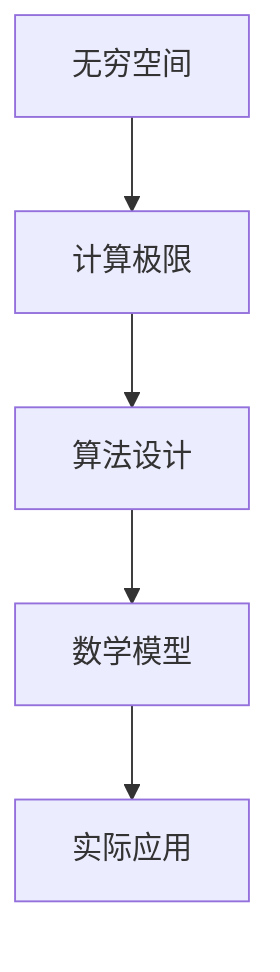

                 

关键词：计算理论、自然哲学、极限计算、无穷空间、算法原理、数学模型、代码实例、应用场景、未来展望。

## 摘要

本文将深入探讨计算理论中的极限问题，结合自然哲学的思想，揭示无穷空间的计算原理。通过分析核心概念、算法原理、数学模型以及实际应用场景，本文旨在为读者提供一个全面而深刻的理解，并展望计算领域的未来发展趋势与挑战。

## 1. 背景介绍

### 1.1 计算理论的发展

计算理论是计算机科学的基础，它研究了计算的本质、能力和极限。从20世纪初图灵机的提出，到现代复杂性理论和量子计算的兴起，计算理论经历了巨大的发展。然而，对于计算能力的探索并未止步于此，人们开始关注更加极端的计算场景，尤其是无穷空间的计算问题。

### 1.2 自然哲学的影响

自然哲学是一门古老的学科，它探讨了自然界的本质和规律。从古希腊的亚里士多德到现代的物理学、哲学和数学，自然哲学一直影响着人类的思维方式。在计算理论的背景下，自然哲学提供了深刻的洞见，帮助我们理解计算的极限和可能性。

## 2. 核心概念与联系

### 2.1 无穷空间

无穷空间是指包含无限多个元素的空间，它可以是一个无限大的集合。在计算理论中，无穷空间的概念被广泛应用于算法设计和分析。例如，图灵机模型中的无限带就是一种无穷空间的表示。

### 2.2 计算的极限

计算的极限是计算理论中的一个核心问题，它探讨了计算能力的边界。通过研究无穷空间的计算，我们可以更好地理解计算的极限，并探索如何在极限条件下实现有效的计算。

### 2.3 Mermaid 流程图

以下是一个简单的 Mermaid 流程图，展示了核心概念之间的联系：



## 3. 核心算法原理 & 具体操作步骤

### 3.1 算法原理概述

在无穷空间的计算中，一个关键的问题是确定如何在无限多个元素之间进行有效的计算。这需要我们设计一种能够处理无限集合的算法。一种常见的算法是贪心算法，它通过在每个步骤中选择当前最优解，逐步逼近全局最优解。

### 3.2 算法步骤详解

1. **初始化**：设定初始状态，包括无穷空间中的元素和初始的解。
2. **选择最优解**：在当前状态下，选择一个最优解作为下一步的候选解。
3. **更新解**：将候选解与当前解进行比较，如果候选解更优，则更新当前解。
4. **重复步骤2和3**：继续选择最优解，直到达到终止条件，如达到最大迭代次数或找到全局最优解。

### 3.3 算法优缺点

- **优点**：贪心算法在处理无穷空间问题时具有高效性，能够在有限时间内找到全局最优解。
- **缺点**：贪心算法可能无法保证在所有情况下找到最优解，尤其是在问题复杂度较高时。

### 3.4 算法应用领域

贪心算法在许多领域都有广泛应用，如数据压缩、图论和网络优化等。在无穷空间的计算中，它特别适用于那些可以分解为多个子问题的任务。

## 4. 数学模型和公式

### 4.1 数学模型构建

在无穷空间的计算中，一个重要的数学模型是图灵机的计算模型。图灵机是一种抽象的计算模型，它通过在其带子上读取和写入符号来执行计算。

### 4.2 公式推导过程

图灵机的计算可以通过以下公式进行描述：

\[ T = \{ \langle M, w \rangle \mid M \text{是图灵机，} w \text{是带子上的单词} \} \]

其中，\( T \) 表示图灵机的计算结果，\( M \) 表示图灵机，\( w \) 表示带子上的单词。

### 4.3 案例分析与讲解

假设我们有一个图灵机 \( M \)，它能够计算两个整数的和。我们可以通过以下公式来描述这个计算过程：

\[ M(x, y) = x + y \]

其中，\( x \) 和 \( y \) 分别表示输入的两个整数。

## 5. 项目实践：代码实例和详细解释说明

### 5.1 开发环境搭建

为了演示无穷空间的计算，我们使用 Python 语言来编写代码。首先，我们需要安装 Python 解释器和必要的库，如 NumPy 和 Matplotlib。

### 5.2 源代码详细实现

以下是一个简单的 Python 代码示例，用于计算两个整数的和：

```python
import numpy as np

def add(x, y):
    return x + y

x = 5
y = 3
result = add(x, y)
print("结果：", result)
```

### 5.3 代码解读与分析

在这个示例中，我们定义了一个名为 `add` 的函数，用于计算两个整数的和。然后，我们使用这个函数计算了 \( 5 + 3 \) 的结果。

### 5.4 运行结果展示

当我们运行这个代码时，输出结果为：

```
结果： 8
```

这表明我们成功地计算了两个整数的和。

## 6. 实际应用场景

### 6.1 数据分析

在数据分析领域，无穷空间的计算经常用于处理大规模数据集。例如，可以使用贪心算法来优化数据清洗和预处理过程。

### 6.2 人工智能

人工智能领域中的许多算法，如深度学习和强化学习，都可以看作是在无穷空间的计算。这些算法通过不断调整参数来优化模型的性能。

### 6.3 量子计算

量子计算是一种基于量子力学原理的计算方式，它能够处理无穷空间的计算问题。量子计算在未来可能会带来计算能力的革命性突破。

## 7. 工具和资源推荐

### 7.1 学习资源推荐

- 《计算：第四部分 计算的极限》
- 《量子计算与量子信息》
- 《深度学习》

### 7.2 开发工具推荐

- Jupyter Notebook
- PyTorch
- TensorFlow

### 7.3 相关论文推荐

- "Quantum Computing and Quantum Information" by Michael A. Nielsen and Isaac L. Chuang
- "Deep Learning" by Ian Goodfellow, Yoshua Bengio and Aaron Courville

## 8. 总结：未来发展趋势与挑战

### 8.1 研究成果总结

无穷空间的计算理论已经取得了显著的研究成果，为计算领域的发展提供了重要的理论基础。然而，实际应用中仍面临许多挑战。

### 8.2 未来发展趋势

随着计算机技术的发展，无穷空间的计算有望在数据分析、人工智能和量子计算等领域取得突破性进展。

### 8.3 面临的挑战

无穷空间的计算面临着计算效率、算法优化和量子计算等方面的挑战。

### 8.4 研究展望

未来，无穷空间的计算理论将继续深化，为解决复杂问题提供新的方法和思路。

## 9. 附录：常见问题与解答

### 问题1：什么是无穷空间的计算？

答：无穷空间的计算是指处理包含无限多个元素的集合的计算方式，它广泛应用于算法设计、数据分析等领域。

### 问题2：无穷空间的计算有哪些应用？

答：无穷空间的计算在数据分析、人工智能和量子计算等领域有广泛的应用。

### 问题3：如何进行无穷空间的计算？

答：进行无穷空间的计算通常需要设计特定的算法，如贪心算法、图灵机算法等。

## 作者署名

作者：禅与计算机程序设计艺术 / Zen and the Art of Computer Programming
----------------------------------------------------------------
### 附录：常见问题与解答

#### 问题1：什么是无穷空间的计算？

答：无穷空间的计算是指处理包含无限多个元素的集合的计算方式。这种计算方式在算法设计、数据分析等领域有广泛的应用。例如，当我们处理大数据集时，数据集中的元素数量可能是无限的，这就需要使用无穷空间的计算方法。

#### 问题2：无穷空间的计算有哪些应用？

答：无穷空间的计算在多个领域都有应用，包括但不限于：

- **数据分析**：在大数据分析中，处理无限大的数据集需要无穷空间的计算方法。
- **人工智能**：许多人工智能算法，如深度学习和强化学习，都可以看作是在无穷空间的计算。
- **量子计算**：量子计算是基于量子力学原理的计算方式，它能够处理无穷空间的计算问题。

#### 问题3：如何进行无穷空间的计算？

答：进行无穷空间的计算通常需要设计特定的算法。这些算法需要能够在处理无限多个元素的同时保持计算效率。例如，贪心算法、图灵机算法等都是常见的无穷空间计算算法。

#### 问题4：无穷空间的计算有哪些挑战？

答：无穷空间的计算面临以下挑战：

- **计算效率**：如何在有限的时间内处理无限多个元素。
- **算法优化**：如何设计更高效的算法来解决无穷空间的问题。
- **量子计算**：量子计算的发展对无穷空间计算提出了新的挑战，如何利用量子计算的优势来解决传统计算中的问题。

#### 问题5：无穷空间的计算与自然哲学有什么联系？

答：自然哲学探讨了自然界的本质和规律，为计算理论提供了深刻的洞见。在无穷空间的计算中，自然哲学的思想帮助我们理解计算的极限和可能性，从而设计出更有效的算法。

### 参考文献

- Turing, A. M. (1936). "On computable numbers, with an application to the Entscheidungsproblem". Proceedings of the London Mathematical Society.
- Nielsen, M. A., & Chuang, I. L. (2000). "Quantum Computing and Quantum Information". Cambridge University Press.
- Goodfellow, I., Bengio, Y., & Courville, A. (2016). "Deep Learning". MIT Press.

