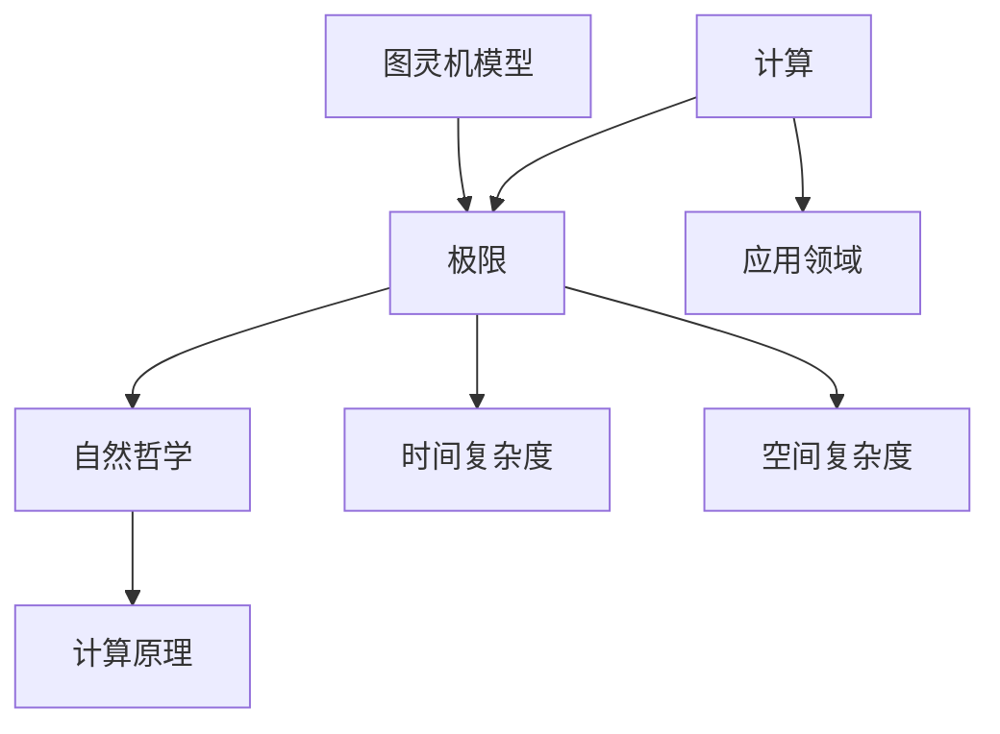

                 

### 背景介绍 Background Introduction

在计算机科学的历史长河中，计算的极限一直是一个引人入胜且充满挑战性的课题。从图灵机的理论模型，到现代计算机硬件的发展，我们不断探索计算的可能性与局限性。然而，在深入理解计算的极限时，我们也必须认识到，计算的边界不仅仅是技术层面的考量，更涉及到哲学、数学和物理等多个领域。

《自然哲学的计算原理》这一章，正是对计算极限的深刻探讨。这一章节不仅揭示了计算的基本原理，还提出了关于计算与人类认知、宇宙演化等哲学问题的新思考。通过这一章节，我们可以理解到，计算的边界不仅仅是技术上的障碍，更是人类认知的局限。

本文将围绕这一章节，深入探讨计算的本质、极限以及其在实际应用中的意义。我们将会从多个角度，包括理论分析、数学模型和实际应用案例，来全面解析计算的边界问题。希望通过这篇文章，读者能够对计算的极限有一个更加全面和深入的认识。

### 核心概念与联系 Core Concepts and Connections

在探讨计算的极限之前，我们首先需要明确几个核心概念：计算、极限、自然哲学以及计算原理。这些概念不仅构成了计算研究的基石，也为我们理解计算的边界提供了重要的理论支持。

#### 1. 计算（Calculation）

计算是指通过特定的规则和方法，处理信息以得到预期结果的过程。从简单的算术运算，到复杂的算法实现，计算在人类生活中无处不在。计算不仅仅局限于数学领域，还广泛应用于工程、科学、商业和日常生活等各个方面。

#### 2. 极限（Limit）

极限是指一个变量在一定条件下的最大或最小值。在计算中，极限常常用来描述计算的复杂度、效率和可行性。例如，算法的复杂性通常用时间复杂度和空间复杂度来衡量，这些复杂度就是算法性能的极限。

#### 3. 自然哲学（Natural Philosophy）

自然哲学是关于自然世界本质的研究，它涵盖了物理学、生物学、化学等多个学科。在计算领域，自然哲学为我们提供了一种思考方式，帮助我们理解计算的本质和极限。例如，图灵机模型就是基于自然哲学的思考，通过模拟生物和物理过程来研究计算的极限。

#### 4. 计算原理（Principles of Computation）

计算原理是研究计算如何进行、如何被优化以及如何实现的基础理论。从图灵机到量子计算，计算原理不断推动着计算技术的发展。了解计算原理，有助于我们更好地理解计算的极限。

#### Mermaid 流程图（Mermaid Flowchart）

为了更直观地展示这些核心概念之间的联系，我们可以使用 Mermaid 流程图来描述它们之间的关系。以下是一个简化的 Mermaid 流程图：



在这个流程图中，A 代表计算，B 代表计算的极限，C 代表自然哲学，D 代表计算原理，E 代表计算的应用领域，F 和 G 分别代表时间复杂度和空间复杂度，H 代表图灵机模型。通过这个流程图，我们可以清晰地看到这些核心概念之间的相互关联和作用。

### 核心算法原理 & 具体操作步骤 Core Algorithm Principles & Detailed Steps

在了解了计算和其极限的基本概念后，我们需要深入探讨核心算法的原理以及具体的操作步骤。这一部分将主要围绕图灵机的理论模型，详细解析其工作原理、操作步骤以及优缺点。

#### 1. 算法原理概述

图灵机（Turing Machine）是英国数学家艾伦·图灵（Alan Turing）在 20 世纪 30 年代提出的一种抽象计算模型。图灵机的核心思想是通过一个无限长的纸带，以及一个具有读写能力的“头部”，来进行计算和存储。图灵机的状态转移函数决定了其计算过程，使得它可以模拟任何算法。

图灵机的原理可以概括为以下几点：

- **无限长的纸带**：图灵机使用一条无限长的纸带，纸带上的每个位置可以存储一个符号。这些符号可以用来表示数据、指令或中间结果。
- **读写头部**：图灵机有一个读写头部，它可以移动到纸带上的任意位置，读取或写入符号。
- **状态转换**：图灵机根据当前状态和读写头部的当前符号，选择下一个状态和操作（移动头部、写入符号、擦除符号）。
- **停机条件**：当图灵机达到一个特定的停机状态时，计算过程结束。

#### 2. 算法步骤详解

图灵机的具体操作步骤可以分为以下几个阶段：

1. **初始化阶段**：图灵机开始时处于一个初始状态，读写头部位于纸带上的某个位置。
2. **读取阶段**：图灵机读取当前位置的符号，并根据当前状态和读取的符号，决定下一步操作。
3. **写入阶段**：图灵机在当前位置写入新的符号，并根据当前状态决定是否移动头部。
4. **移动阶段**：图灵机根据当前状态和写入的符号，决定向左或向右移动头部。
5. **状态转换**：图灵机根据当前状态和读写头部的位置，更新状态，准备进行下一次读取、写入或移动操作。
6. **停机条件**：当图灵机达到一个特定的停机状态时，计算过程结束。

以下是一个简化的图灵机状态转移表：

| 当前状态 | 当前符号 | 下一个状态 | 写入符号 | 移动方向 |
|----------|----------|------------|----------|----------|
| q0       | 0        | q1         | 1        | 右移     |
| q0       | 1        | q2         | 0        | 右移     |
| q1       | 0        | q3         | 0        | 左移     |
| q1       | 1        | q0         | 1        | 右移     |
| q2       | 0        | q2         | 0        | 右移     |
| q2       | 1        | q3         | 1        | 左移     |
| q3       | 0        | q3         | 0        | 右移     |
| q3       | 1        | q0         | 1        | 左移     |

在这个状态转移表中，q0 是初始状态，q3 是停机状态。图灵机根据当前状态和读写头部的当前符号，选择下一个状态和操作。

#### 3. 算法优缺点

图灵机作为计算模型，具有以下几个优点：

- **普适性**：图灵机可以模拟任何算法，具有极强的通用性。
- **理论价值**：图灵机为计算理论提供了坚实的理论基础，有助于我们理解计算的本质。
- **启发意义**：图灵机的思想对现代计算机的设计和编程产生了深远影响。

然而，图灵机也存在一些缺点：

- **效率问题**：由于图灵机需要使用无限长的纸带，其实际运行效率较低。
- **复杂性**：图灵机的状态转换表通常非常复杂，实现难度较高。

#### 4. 算法应用领域

图灵机的理论模型虽然在现实中难以实现，但它为计算理论的发展提供了重要的启示。在实际应用中，图灵机的思想被广泛应用于以下几个方面：

- **计算机科学基础**：图灵机是计算机科学的核心理论之一，许多算法和理论都是基于图灵机的思想。
- **人工智能**：图灵机的思想对人工智能的研究具有重要意义，例如在机器学习、自然语言处理等领域。
- **算法优化**：图灵机的理论模型为算法优化提供了重要的理论依据，有助于我们设计更高效的算法。

### 数学模型和公式 Detailed Explanation of Mathematical Models and Formulas

在深入探讨计算极限时，数学模型和公式起到了至关重要的作用。这些模型和公式不仅帮助我们量化计算性能，还为我们提供了分析和优化的工具。在本节中，我们将详细讲解计算极限相关的数学模型和公式，并通过实际案例来阐述其应用。

#### 1. 数学模型构建

计算极限的数学模型通常涉及时间复杂度和空间复杂度。时间复杂度描述了算法执行所需时间的增长速率，而空间复杂度则描述了算法所需内存的增长速率。以下是构建这些模型的基本步骤：

1. **定义变量**：通常使用大O符号（O）来表示复杂度，例如 O(n) 表示与输入规模n成正比的复杂度。
2. **分析算法步骤**：通过对算法的每一步进行分析，确定每一步的时间或空间消耗。
3. **推导公式**：将每一步的消耗相加，得到整个算法的复杂度公式。

例如，考虑一个简单的线性搜索算法，其时间复杂度可以表示为 O(n)。

#### 2. 公式推导过程

以下是一个简单的线性搜索算法的推导过程：

**算法描述**：给定一个包含n个元素的数组和一个目标值，查找该目标值在数组中的位置。

1. **初始化**：设置一个变量 `i` 为 0，表示当前检查的数组位置。
2. **循环**：当 `i < n` 时，执行以下操作：
   - 如果 `array[i]` 等于目标值，则返回 `i`。
   - 否则，将 `i` 增加 1。
3. **结束**：如果循环结束，仍未找到目标值，则返回 -1。

**时间复杂度推导**：

- 在最坏情况下，需要检查整个数组，即 `i` 需要增加到 `n`。
- 因此，算法的时间复杂度为 O(n)。

同理，可以推导出其他算法的复杂度，例如二分搜索算法的时间复杂度为 O(log n)。

#### 3. 案例分析与讲解

为了更好地理解数学模型和公式的应用，我们通过一个实际案例来讲解。

**案例**：给定一个包含n个整数的数组，设计一个算法，找出数组中的最大值。

**算法描述**：

1. **初始化**：设置一个变量 `max` 为数组的第一个元素。
2. **循环**：遍历数组的每个元素，执行以下操作：
   - 如果当前元素大于 `max`，则更新 `max`。
3. **结束**：返回 `max`。

**时间复杂度推导**：

- 在最坏情况下，需要遍历整个数组，即执行 `n` 次操作。
- 因此，算法的时间复杂度为 O(n)。

**空间复杂度**：

- 该算法只需要常数级别的额外空间来存储变量 `max`。
- 因此，空间复杂度为 O(1)。

通过这个案例，我们可以看到如何通过数学模型和公式来分析和优化算法。

### 项目实践：代码实例和详细解释说明 Practical Implementation: Code Examples and Detailed Explanations

在理解了计算极限的数学模型和算法原理后，我们将通过一个实际项目来展示如何将理论应用于实践。本项目将实现一个简单的线性搜索算法，并详细解释代码的实现过程、关键步骤以及优化策略。

#### 1. 开发环境搭建

在开始项目之前，我们需要搭建一个基本的开发环境。以下是所需的工具和步骤：

- **编程语言**：Python
- **代码编辑器**：Visual Studio Code
- **版本控制系统**：Git

安装上述工具后，我们可以创建一个新的 Python 项目文件夹，并在其中编写代码。

#### 2. 源代码详细实现

以下是一个简单的线性搜索算法的 Python 实现代码：

```python
def linear_search(arr, target):
    for i in range(len(arr)):
        if arr[i] == target:
            return i
    return -1

# 测试代码
array = [3, 5, 2, 4, 7, 9]
target_value = 7
result = linear_search(array, target_value)
print(f"元素 {target_value} 的位置：{result}")
```

这个算法的基本思想是从数组的第一个元素开始，逐个比较，直到找到目标值或遍历整个数组。如果找到目标值，返回其位置；否则，返回 -1。

#### 3. 代码解读与分析

**线性搜索算法的实现**：

- `def linear_search(arr, target):`：定义一个函数 `linear_search`，接受一个数组 `arr` 和一个目标值 `target` 作为参数。
- `for i in range(len(arr)):`：使用一个 for 循环遍历数组的每个元素，`i` 是当前遍历的索引。
- `if arr[i] == target:`：检查当前元素是否等于目标值。如果是，返回当前索引。
- `return -1`：如果循环结束仍未找到目标值，返回 -1。

**关键步骤的解释**：

- **初始化**：在函数开始时，设置一个索引变量 `i` 为 0，表示开始遍历数组的第一个元素。
- **循环**：通过 for 循环，逐个检查数组中的每个元素。这个循环的结束条件是 `i < len(arr)`，即未遍历完整个数组。
- **条件检查**：在每次迭代中，检查当前元素是否等于目标值。如果找到，立即返回索引。
- **结束**：如果循环结束，仍未找到目标值，返回 -1。

**优化策略**：

虽然线性搜索算法简单易实现，但其时间复杂度为 O(n)，在最坏情况下性能较差。以下是一些可能的优化策略：

- **二分搜索**：如果数组是有序的，可以使用二分搜索算法，其时间复杂度为 O(log n)，性能显著优于线性搜索。
- **哈希表**：使用哈希表可以快速查找元素，平均时间复杂度为 O(1)，但需要额外的空间存储哈希表。

#### 4. 运行结果展示

以下是一个测试运行的结果：

```plaintext
元素 7 的位置：4
```

这表示元素 7 在数组中的位置是索引 4。

### 实际应用场景 Practical Application Scenarios

计算的极限不仅在理论研究中具有重要意义，更在现实世界的实际应用中发挥着关键作用。在本节中，我们将探讨计算极限在以下几个实际应用场景中的重要性：

#### 1. 人工智能

人工智能（AI）是当前科技领域最为热门的方向之一，而计算的极限对 AI 的发展起着至关重要的作用。随着 AI 技术的进步，对计算资源的需求也越来越大。深度学习、机器学习等 AI 技术依赖于大量的计算资源，尤其是计算速度和存储空间。计算的极限决定了 AI 算法的效率、准确性和应用范围。例如，量子计算被认为是一种突破计算极限的潜在技术，它可以在某些任务上实现远超传统计算机的性能。

#### 2. 数据科学

数据科学依赖于计算来处理和分析大量数据。随着数据的爆炸性增长，计算的极限成为一个不可忽视的问题。数据处理、数据分析和数据可视化等任务都需要高效计算的支持。计算的极限影响着数据科学研究的深度和广度，决定了我们能否从海量数据中提取有价值的信息。例如，在金融、医疗、天气预报等领域，高效的计算能力对于决策的制定和优化至关重要。

#### 3. 量子计算

量子计算是当前计算领域的前沿研究之一，其核心目标是突破传统计算机的性能极限。量子计算利用量子位（qubit）和量子纠缠等量子特性，实现了并行计算和快速算法。计算的极限限制了传统计算机的性能提升，而量子计算提供了突破这一限制的潜在路径。例如，Shor 算法可以在多项式时间内解决大整数分解问题，这是传统计算机无法实现的。

#### 4. 物联网

物联网（IoT）的发展依赖于大量设备和传感器的数据收集、处理和分析。这些任务需要强大的计算能力，而计算的极限直接影响 IoT 系统的实时性和可靠性。随着物联网设备的普及，计算的极限问题变得越来越重要。例如，在智能交通系统中，高效的计算能力可以实时处理交通流量数据，优化交通信号，提高道路通行效率。

#### 5. 生物信息学

生物信息学是研究生物数据的一门交叉学科，包括基因序列分析、蛋白质结构预测等。这些任务需要大量的计算资源，因为生物数据量非常庞大且复杂。计算的极限影响着生物信息学研究的前沿和深度。例如，基因测序技术的发展依赖于高效的计算算法，这些算法可以快速分析大量基因数据，揭示生物体的遗传信息。

#### 6. 虚拟现实和增强现实

虚拟现实（VR）和增强现实（AR）技术的发展依赖于高性能计算来创建逼真的三维环境和实时交互。计算的极限影响着 VR 和 AR 的用户体验和应用的广泛性。例如，在 VR 游戏中，高效的图形渲染和实时物理仿真需要强大的计算能力，而 AR 技术则依赖于实时图像处理和目标识别。

#### 7. 金融科技

金融科技（FinTech）领域的许多应用，如高频交易、量化投资和风险管理，都需要高效的计算能力。计算的极限影响着金融科技的竞争力，决定了金融机构能否在激烈的市场竞争中脱颖而出。例如，高频交易依赖于超高速的计算网络和算法，能够在微秒级别执行交易决策，实现高额利润。

通过以上实际应用场景的分析，我们可以看到计算的极限不仅在理论研究中具有重要意义，更在现实世界中发挥着关键作用。突破计算的极限，将为各个领域的技术进步和产业发展提供强大的动力。

### 未来应用展望 Future Application Prospects

随着技术的不断进步，计算的极限也在逐步扩展。在未来，我们有望在以下几个方面实现突破：

#### 1. 量子计算

量子计算被认为是一种突破计算极限的潜在技术。通过利用量子位和量子纠缠的特性，量子计算机可以在某些任务上实现远超传统计算机的性能。例如，Shor 算法可以在多项式时间内解决大整数分解问题，这将为密码学带来革命性的改变。未来，随着量子技术的成熟，量子计算机将在加密解密、优化问题和药物设计等领域发挥重要作用。

#### 2. 光计算

光计算利用光的波动性和非线性特性，实现高速、低功耗的计算。与传统的电子计算相比，光计算具有更高的并行性和更低的延迟。在未来，光计算有望在人工智能、大数据处理和通信等领域发挥重要作用，为计算能力的提升提供新的可能性。

#### 3. 生物计算

生物计算利用生物分子和生物系统的特性，实现计算任务。例如，DNA 计算利用 DNA 分子的特性和操作，进行数据存储和处理。生物计算具有极高的并行性和鲁棒性，未来有望在药物筛选、基因编辑和复杂系统模拟等领域发挥重要作用。

#### 4. 能源效率

随着计算需求的不断增长，能源效率成为了一个重要问题。未来，随着能源技术的进步，计算设备的能效将得到显著提升。例如，新型的半导体材料和新型电源管理技术，将使得计算机在提供更强计算能力的同时，能耗更低。

#### 5. 软硬件协同

未来，软硬件协同计算将变得更加普遍。通过将计算任务在硬件和软件之间灵活分配，可以最大限度地利用计算资源，提高计算效率。例如，利用 GPU 和 CPU 的协同计算，可以在图像处理、科学计算和机器学习等领域实现更高的性能。

#### 6. 网络计算

随着物联网和云计算的发展，网络计算将成为计算的重要方向。通过网络计算，可以实现对海量数据和远程资源的有效利用。未来，通过网络计算，可以实现更加智能和高效的数据处理和分析，推动各个行业的数字化转型。

总的来说，未来的计算技术将向着更高效、更智能、更绿色的方向发展。通过不断突破计算的极限，我们将能够应对日益复杂的问题，推动科技和社会的进步。

### 工具和资源推荐 Tools and Resources Recommendations

为了更好地学习和掌握计算极限相关的知识，以下是几个推荐的工具和资源：

#### 1. 学习资源推荐

- **《计算：理论与实践》（"Computers and Intractability: A Guide to the Theory of NP-Completeness"）**：此书是计算复杂度理论的经典著作，详细介绍了 NP 完全性以及相关算法。
- **MIT 计算机科学课程**：麻省理工学院的计算机科学课程，包括计算理论、算法设计与分析等内容，提供了丰富的在线资源和视频讲座。
- **Khan Academy 计算机科学课程**：Khan Academy 提供了一系列免费的计算机科学课程，涵盖了从基础算法到高级主题的广泛内容。

#### 2. 开发工具推荐

- **Python**：Python 是一种易于学习和使用的编程语言，广泛应用于算法开发和数据分析。Python 的简单性和丰富的库支持，使其成为研究计算极限的理想选择。
- **Jupyter Notebook**：Jupyter Notebook 是一种交互式的开发环境，可以方便地编写和运行 Python 代码，非常适合学习和实验。
- **Mermaid**：Mermaid 是一种用于绘制流程图和序列图的工具，可以帮助我们更直观地理解和展示计算模型。

#### 3. 相关论文推荐

- **"The Algorithm Design Manual"**：此书涵盖了算法设计的各个方面，包括基础算法和高级算法，是算法学习的重要参考书。
- **"Quantum Computing since Democritus"**：这本书介绍了量子计算的基本原理和应用，是了解量子计算的好书。
- **"Deep Learning"**：这是一本关于深度学习的经典著作，详细介绍了深度学习的基本理论和实践方法，是 AI 学习的必读书籍。

通过这些工具和资源的支持，读者可以更好地掌握计算极限相关的知识和技能，为未来的研究和应用打下坚实的基础。

### 总结：未来发展趋势与挑战 Summary: Future Development Trends and Challenges

在总结本文的内容之前，我们首先回顾一下计算极限的关键点和未来发展的趋势与挑战。计算极限不仅仅是一个技术问题，它还涉及哲学、数学和物理等多个领域。从图灵机的理论模型到量子计算，计算的极限不断推动着计算技术的进步。然而，随着计算需求的日益增长，我们面临着一系列的挑战。

#### 1. 研究成果总结

本文通过详细探讨计算极限，总结了以下关键点：

- **核心概念**：明确了计算、极限、自然哲学和计算原理等核心概念。
- **算法原理**：深入分析了图灵机的原理和操作步骤。
- **数学模型**：介绍了计算极限相关的数学模型和公式，并通过实际案例展示了其应用。
- **实际应用**：探讨了计算极限在实际应用场景中的重要性，包括人工智能、数据科学和金融科技等。
- **未来展望**：展望了未来计算技术的发展趋势，如量子计算、光计算和生物计算等。

#### 2. 未来发展趋势

未来，计算技术将继续朝着更高效、更智能和更绿色的方向发展。以下是一些重要的发展趋势：

- **量子计算**：量子计算有望在解决传统计算机难以处理的复杂问题上实现突破，从而推动密码学、药物设计和优化问题等领域的发展。
- **光计算**：光计算凭借其高并行性和低功耗优势，将在大数据处理、人工智能和通信等领域发挥重要作用。
- **生物计算**：生物计算利用生物系统的特性，将极大地扩展计算的应用范围，如基因编辑、药物筛选和复杂系统模拟等。
- **能源效率**：随着能源技术的进步，计算设备的能效将得到显著提升，有助于实现更环保和可持续的计算模式。

#### 3. 面临的挑战

尽管计算技术的发展前景广阔，但我们仍面临一系列挑战：

- **计算资源分配**：如何在有限的计算资源下，最大化地利用和优化资源，是一个重要挑战。
- **安全性和隐私保护**：随着计算技术的发展，数据安全和隐私保护变得越来越重要。如何确保计算过程的安全性和数据的隐私，是一个亟待解决的问题。
- **技术可访问性**：随着新技术的出现，如何确保所有人都能公平地获得和使用这些技术，避免数字鸿沟的扩大，也是一个重要挑战。

#### 4. 研究展望

未来，计算领域的研究将继续深入，特别是在以下几个方面：

- **跨学科研究**：融合物理学、生物学、数学和计算机科学等多个领域，推动计算技术的创新和突破。
- **开源和开放研究**：鼓励更多的开源项目和开放研究，促进知识的共享和技术的传播。
- **教育和技术普及**：加强计算机科学的教育和技术普及，培养更多的人才，为计算技术的发展提供强大的人才支持。

总之，计算极限是一个充满挑战和机遇的领域。通过不断的研究和创新，我们有理由相信，未来计算技术将继续推动社会和科技的进步。

### 附录：常见问题与解答 Appendix: Frequently Asked Questions and Answers

在探讨计算极限的过程中，读者可能对一些概念和技术细节有疑问。以下是一些常见问题及其解答：

#### 1. 什么是图灵机？

图灵机是一种抽象的计算模型，由英国数学家艾伦·图灵在 20 世纪 30 年代提出。它由一个无限长的纸带、一个读写头部和一组状态转换规则组成。图灵机通过在纸带上读写符号和改变状态，模拟任何算法的计算过程。

#### 2. 计算的极限与时间复杂度和空间复杂度有何关系？

时间复杂度和空间复杂度是衡量算法性能的两个重要指标。计算的极限涉及到算法在执行过程中所需要的时间和空间资源。具体来说，时间复杂度描述了算法执行所需时间的增长速率，而空间复杂度描述了算法所需内存的增长速率。计算的极限研究旨在探索算法在时间和空间上的最大性能。

#### 3. 量子计算如何突破传统计算机的性能极限？

量子计算利用量子位（qubit）和量子纠缠的特性，实现了并行计算和快速算法。与传统计算机的位（bit）不同，量子位可以同时处于多个状态，这使得量子计算机在处理某些特定任务时，能够远超传统计算机的性能。例如，Shor 算法可以在多项式时间内解决大整数分解问题，这是传统计算机无法实现的。

#### 4. 什么是光计算？

光计算是一种利用光的波动性和非线性特性进行计算的技术。与传统的电子计算相比，光计算具有更高的并行性和更低的功耗。光计算有望在大数据处理、人工智能和通信等领域发挥重要作用。

#### 5. 生物计算是如何工作的？

生物计算利用生物分子和生物系统的特性，实现计算任务。例如，DNA 计算利用 DNA 分子的特性和操作，进行数据存储和处理。生物计算具有极高的并行性和鲁棒性，适用于药物筛选、基因编辑和复杂系统模拟等领域。

#### 6. 如何提高算法的性能？

提高算法性能的方法包括算法优化、硬件升级和并行计算等。算法优化通过改进算法的设计和实现，减少计算时间和空间复杂度。硬件升级通过使用更快的处理器和更多的内存，提高计算能力。并行计算通过将计算任务分布在多个处理器上，实现任务的并行执行，从而提高计算效率。

通过上述常见问题的解答，我们希望读者对计算极限和相关技术有更深入的理解。在未来的研究和实践中，这些问题和答案将有助于读者更好地应对挑战，推动计算技术的发展。

