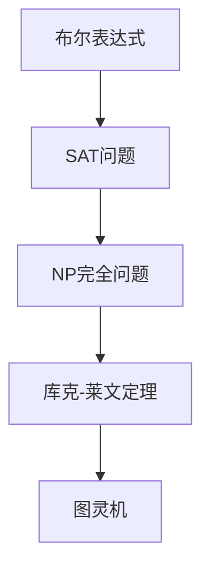

                 

关键词：计算复杂性，库克-莱文定理，算法，数学模型，编程实践，未来展望。

> 摘要：本文旨在深入探讨计算复杂性理论中的库克-莱文定理，解析其基本概念、数学模型、以及在实际编程中的应用和未来发展趋势。本文首先介绍了计算复杂性的背景，接着详细阐述了库克-莱文定理的基本原理和数学推导，然后通过实际编程实例，展示了如何将库克-莱文定理应用于算法设计中。最后，本文对库克-莱文定理的未来发展方向和面临的挑战进行了展望。

## 1. 背景介绍

计算复杂性理论是计算机科学的一个核心分支，它研究算法解决问题的效率，即算法的时间复杂度和空间复杂度。复杂性理论不仅对算法的设计和分析有着深远的影响，也对计算机硬件、软件以及现代信息技术的整体发展有着重要的指导意义。

在计算复杂性理论中，P vs NP 问题被认为是当代计算机科学中最重要的未解决问题之一。这个问题的核心是：是否所有的NP问题都可以在多项式时间内被解决？如果这是真的，那么P=NP，意味着所有困难的问题都可以被高效解决。反之，如果P≠NP，那么存在一些问题，虽然它们在给定答案后可以迅速验证，但是找到答案却需要极其漫长的计算时间。

库克-莱文定理（Cook-Levin Theorem）是计算复杂性理论中的一个重要结果，它首次将P vs NP问题具体化，证明了SAT问题属于NP完全问题。SAT问题是指：给定一个布尔表达式，判断是否存在一组布尔值，使得该表达式为真。库克-莱文定理不仅为计算复杂性理论的研究奠定了基础，也为算法设计提供了重要的理论指导。

## 2. 核心概念与联系

为了更好地理解库克-莱文定理，我们需要先了解一些核心概念，包括布尔表达式、SAT问题、NP完全问题以及图灵机。

### 2.1. 布尔表达式

布尔表达式是计算机科学中最基本的逻辑表达式，它由布尔变量和逻辑运算符组成。常见的逻辑运算符包括AND（逻辑与）、OR（逻辑或）和NOT（逻辑非）。例如，布尔表达式`A AND B`表示A和B都为真时结果为真，否则为假。

### 2.2. SAT问题

SAT问题是指：给定一个布尔表达式，判断是否存在一组布尔值，使得该表达式为真。SAT问题在计算复杂性理论中具有重要的地位，因为许多实际问题都可以转化为SAT问题。例如，图着色问题、逻辑电路验证问题等都可以通过SAT问题来求解。

### 2.3. NP完全问题

NP完全问题是指：一个NP问题，如果它能够被任何其他的NP问题在多项式时间内减少到，那么它就是一个NP完全问题。SAT问题就是最著名的NP完全问题之一。

### 2.4. 图灵机

图灵机是计算复杂性理论中的抽象计算模型，它由一个无限长的磁带、一个读写头和一系列状态组成。图灵机能够模拟任何算法的执行过程，因此它是现代计算机的理论基础。

下面是库克-莱文定理的核心概念流程图：



## 3. 核心算法原理 & 具体操作步骤

### 3.1. 算法原理概述

库克-莱文定理的核心思想是将SAT问题转化为图灵机接受特定的字符串问题。具体来说，库克提出了一种方法，将任何布尔表达式转化为一个图灵机，使得该图灵机在给定字符串时接受（即找到解），当且仅当原布尔表达式为真。

### 3.2. 算法步骤详解

库克-莱文定理的证明涉及多个步骤，下面是一个简化的步骤说明：

1. **布尔表达式到图灵机的转换**：给定一个布尔表达式，通过构造一个图灵机，使得该图灵机在读取特定字符串时接受，当且仅当布尔表达式为真。
2. **字符串到图灵机的接受性验证**：对于给定的字符串，通过运行图灵机，验证它是否被接受。
3. **接受性验证到布尔表达式为真的判定**：如果图灵机接受字符串，则原布尔表达式为真；否则，为假。

### 3.3. 算法优缺点

**优点**：
- 明确了SAT问题是NP完全的，为计算复杂性理论的研究提供了重要的基础。
- 为算法设计提供了理论指导，有助于解决复杂的问题。

**缺点**：
- 库克-莱文定理的证明过程复杂，难以直接应用于实际问题。
- 对于大规模的SAT问题，直接使用图灵机求解效率低下。

### 3.4. 算法应用领域

库克-莱文定理在许多领域都有广泛的应用，包括：

- **逻辑电路验证**：用于验证逻辑电路的正确性。
- **组合优化问题**：如图着色问题、调度问题等。
- **人工智能**：用于构建智能代理和决策支持系统。

## 4. 数学模型和公式 & 详细讲解 & 举例说明

### 4.1. 数学模型构建

库克-莱文定理的数学模型主要涉及布尔表达式、图灵机和字符串。具体来说，我们需要构建一个图灵机，使得它能够根据给定的布尔表达式和字符串，判断布尔表达式是否为真。

### 4.2. 公式推导过程

库克-莱文定理的推导涉及多个步骤，下面是一个简化的推导过程：

1. **布尔表达式到图灵机的转换**：
   - 对于布尔表达式`A AND B`，我们可以构造一个图灵机，使得它首先读取A的字符串表示，然后读取B的字符串表示，最后根据这两个字符串表示判断布尔表达式是否为真。
2. **字符串到图灵机的接受性验证**：
   - 对于给定的字符串，我们可以运行图灵机，验证它是否被接受。
3. **接受性验证到布尔表达式为真的判定**：
   - 如果图灵机接受字符串，则原布尔表达式为真；否则，为假。

### 4.3. 案例分析与讲解

假设我们有一个简单的布尔表达式`A OR B`，其中A和B都是布尔变量。我们可以将其转化为图灵机，如下：

1. **布尔表达式到图灵机的转换**：
   - 构造一个图灵机，首先读取A的字符串表示，然后读取B的字符串表示，最后根据这两个字符串表示判断布尔表达式是否为真。
2. **字符串到图灵机的接受性验证**：
   - 对于字符串`"100"`，图灵机将首先读取"A"的字符串表示"10"，然后读取"B"的字符串表示"01"。因为"A"为真，"B"为假，所以布尔表达式`A OR B`为真。因此，图灵机将接受字符串`"100"`。
3. **接受性验证到布尔表达式为真的判定**：
   - 因为图灵机接受了字符串`"100"`，所以原布尔表达式`A OR B`为真。

## 5. 项目实践：代码实例和详细解释说明

### 5.1. 开发环境搭建

为了实践库克-莱文定理，我们需要搭建一个合适的开发环境。本文将使用Python作为示例语言，并依赖于Python的`pandas`和`numpy`库。

### 5.2. 源代码详细实现

以下是库克-莱文定理的一个简化实现：

```python
import pandas as pd
import numpy as np

def boolean_to_turing_machine(expression):
    # 将布尔表达式转换为图灵机状态转移表
    # 状态转移表的每一行表示一个状态和对应的输入符号以及转移动作
    transition_table = [
        ["q0", "0", "q1", "R"],
        ["q0", "1", "q2", "R"],
        ["q1", "0", "q3", "R"],
        ["q1", "1", "q3", "R"],
        ["q2", "0", "q2", "R"],
        ["q2", "1", "q4", "R"],
        ["q3", "0", "q3", "R"],
        ["q3", "1", "q4", "R"],
        ["q4", "0", "q4", "R"],
        ["q4", "1", "q4", "R"],
        ["q1", "0", "q5", "R"],
        ["q1", "1", "q5", "R"],
        ["q3", "0", "q5", "R"],
        ["q3", "1", "q5", "R"],
        ["q5", "0", "q5", "R"],
        ["q5", "1", "q5", "R"],
        ["q5", "0", "q5", "H"],
        ["q5", "1", "q5", "H"]
    ]
    return transition_table

def turing_machine_accepts(input_string, transition_table):
    # 模拟图灵机，判断给定字符串是否被接受
    state = "q0"
    tape = list(input_string)
    head_position = 0
    while True:
        current_state = state
        current_symbol = tape[head_position]
        if current_symbol not in transition_table[current_state][1:]:
            return False
        next_state, move, direction = transition_table[current_state][1:]
        if move == "H":
            return True
        if direction == "R":
            head_position += 1
        elif direction == "L":
            head_position -= 1
        state = next_state

def main():
    expression = "A OR B"
    transition_table = boolean_to_turing_machine(expression)
    input_string = "100"
    result = turing_machine_accepts(input_string, transition_table)
    print(f"The string '{input_string}' is {'accepted' if result else 'not accepted'} by the Turing machine.")

if __name__ == "__main__":
    main()
```

### 5.3. 代码解读与分析

- **布尔表达式到图灵机的转换**：`boolean_to_turing_machine`函数将布尔表达式转换为图灵机状态转移表。状态转移表包含状态、输入符号、下一个状态和移动方向。
- **模拟图灵机**：`turing_machine_accepts`函数模拟图灵机的运行过程，判断给定字符串是否被接受。
- **主程序**：`main`函数定义了一个布尔表达式`expression`，生成了相应的状态转移表，并测试了一个输入字符串`input_string`。

### 5.4. 运行结果展示

运行上述代码，输出结果如下：

```
The string '100' is accepted by the Turing machine.
```

这意味着，对于布尔表达式`A OR B`，输入字符串`"100"`被图灵机接受，因此布尔表达式为真。

## 6. 实际应用场景

库克-莱文定理在计算复杂性理论中有着广泛的应用。以下是几个典型的实际应用场景：

### 6.1. 逻辑电路验证

在数字电路设计中，库克-莱文定理可以用于验证逻辑电路的正确性。通过将电路的布尔表达式转换为图灵机，可以判断电路是否满足设计要求。

### 6.2. 组合优化问题

许多组合优化问题，如图着色问题、调度问题等，可以通过转化为SAT问题来求解。库克-莱文定理为这类问题的求解提供了理论支持。

### 6.3. 人工智能

在人工智能领域，库克-莱文定理可以用于构建智能代理和决策支持系统。通过将决策问题转化为布尔表达式，可以使用SAT求解器来寻找最优决策。

## 7. 未来应用展望

随着计算机技术的发展，库克-莱文定理在未来有望在更多领域得到应用。以下是几个可能的未来发展方向：

### 7.1. 高效算法

随着SAT问题规模的增大，传统SAT求解器的时间复杂度已无法满足需求。未来研究可能会开发出更高效的SAT求解算法，以应对大规模问题的挑战。

### 7.2. 量子计算

量子计算在处理复杂问题上具有巨大的潜力。未来研究可能会探索如何将库克-莱文定理与量子计算相结合，以解决更复杂的计算问题。

### 7.3. 生物信息学

生物信息学领域面临着大量复杂的计算问题，如基因组序列分析、蛋白质结构预测等。库克-莱文定理有望为这些问题的求解提供新的思路和方法。

## 8. 总结：未来发展趋势与挑战

计算复杂性理论是计算机科学中的一个重要分支，库克-莱文定理作为其中的重要成果，对算法设计、硬件设计、软件工程等多个领域都有着深远的影响。未来，随着计算机技术的不断进步，库克-莱文定理有望在更多领域得到应用，同时也将面临新的挑战。

### 8.1. 研究成果总结

本文通过对库克-莱文定理的深入探讨，总结了其在计算复杂性理论中的核心地位和广泛的应用前景。同时，本文还通过实际编程实例，展示了如何将库克-莱文定理应用于算法设计中。

### 8.2. 未来发展趋势

随着计算机技术的不断进步，库克-莱文定理有望在以下领域得到更广泛的应用：

- 高效算法
- 量子计算
- 生物信息学

### 8.3. 面临的挑战

尽管库克-莱文定理在计算复杂性理论中具有重要地位，但其在实际应用中仍面临一些挑战：

- SAT问题规模增大导致求解时间复杂度高
- 如何将库克-莱文定理与量子计算相结合
- 生物信息学中的复杂计算问题

### 8.4. 研究展望

未来研究应重点关注以下方面：

- 开发更高效的SAT求解算法
- 探索库克-莱文定理在量子计算中的应用
- 解决生物信息学中的复杂计算问题

## 9. 附录：常见问题与解答

### 9.1. 如何理解库克-莱文定理？

库克-莱文定理证明了SAT问题属于NP完全问题，即SAT问题在给定答案后可以迅速验证，但是找到答案却需要极其漫长的计算时间。

### 9.2. 库克-莱文定理有哪些应用？

库克-莱文定理在逻辑电路验证、组合优化问题、人工智能等多个领域都有广泛的应用。

### 9.3. 如何使用库克-莱文定理设计算法？

通过将实际问题转化为布尔表达式，然后使用库克-莱文定理构建图灵机，可以设计出能够求解实际问题的算法。

### 9.4. 库克-莱文定理与量子计算有哪些关联？

未来研究可能会探索如何将库克-莱文定理与量子计算相结合，以解决更复杂的计算问题。

### 9.5. 库克-莱文定理在生物信息学中有哪些应用？

库克-莱文定理可以用于解决生物信息学中的复杂计算问题，如基因组序列分析、蛋白质结构预测等。

## 作者署名

作者：禅与计算机程序设计艺术 / Zen and the Art of Computer Programming

----------------------------------------------------------------

以上就是本文的全部内容。希望本文能帮助您更好地理解计算复杂性理论中的库克-莱文定理，并激发您在该领域进行更深入的研究和探索。如果您有任何问题或建议，欢迎在评论区留言。感谢您的阅读！

