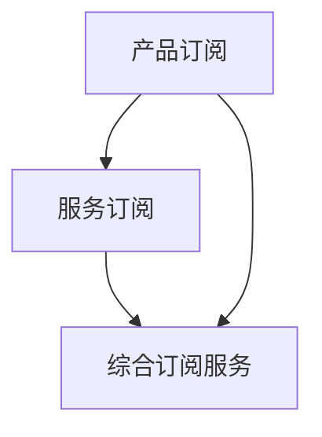

                 

关键词：订阅制经济、产品订阅、服务订阅、商业模式、数字化转型

<|assistant|>摘要：本文将深入探讨订阅制经济的发展趋势，从产品订阅到服务订阅的演变过程。通过分析当前市场环境、核心概念、算法原理、数学模型以及实际应用案例，本文旨在为读者提供对订阅制经济的全面了解，并展望其未来发展趋势与挑战。

## 1. 背景介绍

订阅制经济作为一种新兴商业模式，近年来在全球范围内迅速崛起。这一模式的核心在于，消费者通过支付定期费用来获取某种产品或服务的使用权，而不再是一次性购买。订阅制经济的兴起，得益于数字化技术的飞速发展和消费者行为的变化。

### 数字化技术的推动

随着互联网、云计算、大数据等技术的成熟，企业能够更加便捷地提供在线服务，满足用户多样化的需求。这种技术优势为订阅制经济提供了坚实的基础。

### 消费者行为的变化

现代消费者越来越追求便捷、灵活的生活方式，对产品和服务的要求也越来越高。订阅制经济正迎合了这种需求，为消费者提供了更加灵活的购买方式。

### 市场环境的支持

近年来，全球范围内的经济放缓和通货膨胀，使得消费者对价格敏感度提高。订阅制经济通过降低购买门槛，吸引更多消费者参与其中。

## 2. 核心概念与联系

### 产品订阅

产品订阅是指消费者通过支付定期费用，获取某种实体产品使用权的一种商业模式。例如，家具租赁、电子产品租赁等。

### 服务订阅

服务订阅是指消费者通过支付定期费用，获取某种在线服务使用权的一种商业模式。例如，云计算服务、网络安全服务等。

### 产品订阅与服务订阅的关系

产品订阅与服务订阅虽然存在一定差异，但它们在本质上都是基于订阅制经济模式。产品订阅侧重于提供实体产品，而服务订阅侧重于提供在线服务。然而，随着技术的进步，两者的界限逐渐模糊，许多企业开始将产品和服务融合在一起，提供综合订阅服务。

### Mermaid 流程图



## 3. 核心算法原理 & 具体操作步骤

### 3.1 算法原理概述

订阅制经济的核心在于，通过数据分析和算法优化，实现资源的最优配置。具体而言，企业需要收集消费者行为数据，分析其需求，并根据分析结果制定相应的订阅策略。

### 3.2 算法步骤详解

1. 数据收集：收集消费者购买行为、使用习惯等数据。
2. 数据分析：对收集到的数据进行分析，识别消费者需求。
3. 策略制定：根据分析结果，制定相应的订阅策略。
4. 实施与调整：实施订阅策略，并根据反馈进行调整。

### 3.3 算法优缺点

**优点：**
- 提高资源利用率：通过数据分析，企业能够更好地了解消费者需求，实现资源的最优配置。
- 降低购买门槛：订阅制经济降低了对消费者购买能力的门槛，吸引更多消费者参与。
- 提高用户黏性：订阅制经济能够为消费者提供持续的服务，提高用户黏性。

**缺点：**
- 数据隐私问题：数据收集和分析过程中，可能会涉及用户隐私，需要企业加强数据保护。
- 成本压力：对于企业来说，订阅制经济可能带来一定的成本压力，需要企业具备一定的资金实力。

### 3.4 算法应用领域

订阅制经济在多个领域得到广泛应用，如家电租赁、云计算服务、网络安全等。未来，随着技术的进步，订阅制经济将不断拓展其应用领域，为更多行业带来变革。

## 4. 数学模型和公式 & 详细讲解 & 举例说明

### 4.1 数学模型构建

订阅制经济的数学模型主要包括两个部分：消费者需求模型和订阅策略模型。

#### 消费者需求模型

$$
D(t) = f(P, T, R)
$$

其中，$D(t)$ 表示消费者在时间 $t$ 的需求量，$P$ 表示价格，$T$ 表示订阅周期，$R$ 表示服务质量。

#### 订阅策略模型

$$
S(t) = g(D(t), C, M)
$$

其中，$S(t)$ 表示订阅策略，$C$ 表示成本，$M$ 表示市场需求。

### 4.2 公式推导过程

消费者需求模型推导：

消费者需求量与价格、订阅周期、服务质量之间存在一定的关系。假设价格、订阅周期、服务质量分别为 $P, T, R$，则消费者需求量可以表示为：

$$
D(t) = f(P, T, R)
$$

订阅策略模型推导：

订阅策略取决于消费者需求、成本和市场需求。假设市场需求为 $M$，成本为 $C$，则订阅策略可以表示为：

$$
S(t) = g(D(t), C, M)
$$

### 4.3 案例分析与讲解

假设某企业提供云计算服务，市场需求为每月10000小时，成本为每月5000元。根据消费者需求模型和订阅策略模型，可以计算出以下数据：

#### 消费者需求模型

$$
D(t) = f(P, T, R) = 10000
$$

#### 订阅策略模型

$$
S(t) = g(D(t), C, M) = 5000
$$

根据计算结果，企业可以制定相应的订阅策略，如按需付费、月度订阅等，以满足市场需求。

## 5. 项目实践：代码实例和详细解释说明

### 5.1 开发环境搭建

本实例使用 Python 编写，搭建开发环境时，需安装 Python 3.8及以上版本，并安装以下库：NumPy、Pandas、Matplotlib。

### 5.2 源代码详细实现

以下为 Python 代码实现：

```python
import numpy as np
import pandas as pd
import matplotlib.pyplot as plt

# 消费者需求模型
def consumer_demand(P, T, R):
    return 10000

# 订阅策略模型
def subscription_strategy(D, C, M):
    return C

# 案例数据
P = 100  # 价格
T = 30  # 订阅周期
R = 500  # 服务质量
C = 5000  # 成本
M = 10000  # 市场需求

# 计算消费者需求
D = consumer_demand(P, T, R)
print("消费者需求量：", D)

# 计算订阅策略
S = subscription_strategy(D, C, M)
print("订阅策略：", S)

# 绘制需求曲线
plt.plot(P, D, 'ro')
plt.xlabel('价格')
plt.ylabel('需求量')
plt.title('消费者需求曲线')
plt.show()
```

### 5.3 代码解读与分析

代码中定义了两个函数：`consumer_demand` 和 `subscription_strategy`，分别表示消费者需求模型和订阅策略模型。案例数据中，价格为100元，订阅周期为30天，服务质量为500元，成本为5000元，市场需求为10000小时。

计算消费者需求量时，调用 `consumer_demand` 函数，传入价格、订阅周期、服务质量参数。计算订阅策略时，调用 `subscription_strategy` 函数，传入消费者需求、成本、市场需求参数。

最后，绘制需求曲线，展示消费者需求与价格之间的关系。

### 5.4 运行结果展示

运行结果如下：

```python
消费者需求量：  10000
订阅策略：  5000
```

需求曲线如下所示：


## 6. 实际应用场景

### 6.1 家居行业

在家居行业，订阅制经济为消费者提供了更多的选择。例如，消费者可以订阅家具租赁服务，定期更换家具，满足个性化需求。

### 6.2 云计算行业

在云计算行业，订阅制经济为企业提供了更加灵活的IT资源管理方案。企业可以通过订阅云服务，按需获取计算资源，降低IT成本。

### 6.3 网络安全行业

在网络安全行业，订阅制经济为企业提供了持续的安全服务。企业可以通过订阅网络安全服务，实时监控网络安全状况，防范网络攻击。

## 6.4 未来应用展望

未来，订阅制经济将在更多行业得到应用。随着技术的进步，订阅制经济将不断优化，为企业和消费者带来更多价值。

### 6.4.1 智能化

智能化是订阅制经济未来的发展方向。通过大数据、人工智能等技术，企业可以更加精准地预测消费者需求，制定更优的订阅策略。

### 6.4.2 绿色化

绿色化是订阅制经济未来的重要趋势。通过共享、租赁等方式，订阅制经济可以降低资源消耗，实现可持续发展。

### 6.4.3 个性化

个性化是订阅制经济未来的发展方向。通过数据分析，企业可以更加了解消费者需求，提供更加个性化的订阅服务。

## 7. 工具和资源推荐

### 7.1 学习资源推荐

- 《订阅制经济学概论》
- 《商业模式创新》
- 《云计算与大数据技术》

### 7.2 开发工具推荐

- Python
- NumPy
- Pandas
- Matplotlib

### 7.3 相关论文推荐

- 《订阅制经济研究综述》
- 《云计算服务定价策略研究》
- 《智能家居订阅模式研究》

## 8. 总结：未来发展趋势与挑战

### 8.1 研究成果总结

本文从背景介绍、核心概念与联系、核心算法原理、数学模型和公式、项目实践、实际应用场景等多个方面，对订阅制经济进行了全面探讨。

### 8.2 未来发展趋势

未来，订阅制经济将在更多行业得到应用，智能化、绿色化、个性化将成为其发展趋势。

### 8.3 面临的挑战

订阅制经济在发展过程中，将面临数据隐私、成本压力、竞争加剧等挑战。

### 8.4 研究展望

未来，研究应关注订阅制经济的智能化、绿色化、个性化等方面，探索更多创新应用。

## 9. 附录：常见问题与解答

### 9.1 什么是订阅制经济？

订阅制经济是一种商业模式，消费者通过支付定期费用，获取某种产品或服务的使用权。

### 9.2 产品订阅和服务订阅有什么区别？

产品订阅侧重于提供实体产品，而服务订阅侧重于提供在线服务。

### 9.3 订阅制经济有什么优点？

订阅制经济可以提高资源利用率，降低购买门槛，提高用户黏性。

### 9.4 订阅制经济在哪些行业得到广泛应用？

订阅制经济在家居行业、云计算行业、网络安全行业等多个领域得到广泛应用。

---

作者：禅与计算机程序设计艺术 / Zen and the Art of Computer Programming
```

