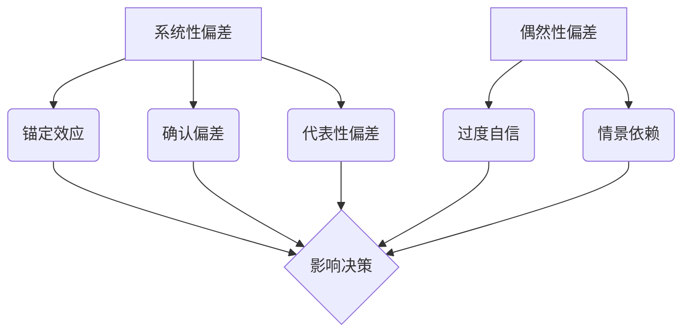
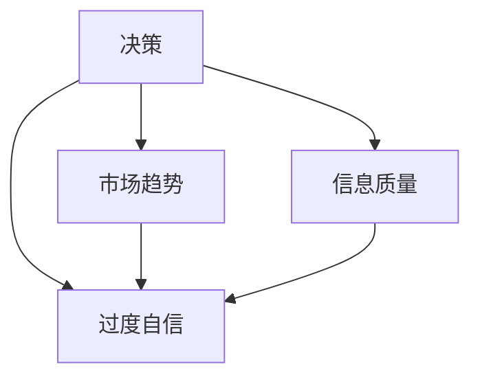

                 

关键词：认知偏差、决策、思维陷阱、人工智能、心理学、技术策略

> 摘要：本文深入探讨了认知偏差对决策过程的影响，结合心理学和人工智能技术，提供了一系列有效策略，帮助读者识别和避免思维陷阱，提高决策质量。通过具体案例分析和实践指南，本文旨在帮助专业人士和技术爱好者在复杂情境中做出更为明智的决策。

## 1. 背景介绍

在信息技术迅猛发展的今天，人工智能（AI）和大数据分析技术已经深刻改变了我们的工作和生活方式。然而，尽管技术工具的进步为我们提供了大量的信息和决策支持，但人类的认知过程仍然不可避免地受到各种认知偏差的影响。认知偏差是指人们在感知、记忆、判断和决策过程中，由于大脑的有限能力和认知简化策略导致的系统错误。这些偏差可能源自心理、文化、社会等多方面因素，从而在决策过程中引入了不必要的风险和错误。

本文的目的在于揭示认知偏差的本质，分析其在决策过程中的具体表现，并结合心理学原理和人工智能技术，提供一些实用的策略和工具，以帮助读者更好地识别和避免这些思维陷阱，提高决策的质量和效率。

### 1.1 认知偏差的影响

认知偏差可能对个人和组织的决策产生深远影响。例如，在企业管理中，领导者可能由于过度自信（自我归因偏差）而忽视了市场变化，导致战略失误；在个人生活中，消费者可能因为锚定效应而盲目跟风，购买了并不真正需要的产品。因此，理解和应对认知偏差对于提高决策的准确性和可靠性至关重要。

### 1.2 心理学与人工智能的结合

心理学和人工智能的交叉应用为我们提供了新的视角和方法，以识别和纠正认知偏差。通过机器学习和数据挖掘技术，AI可以分析大量行为数据，揭示出隐藏的认知模式，从而为心理学理论提供实证支持。同时，心理学原理可以帮助我们更好地理解和设计人工智能系统，使其在辅助决策时更贴近人类思维过程，减少认知偏差的影响。

## 2. 核心概念与联系

### 2.1 认知偏差的类型

认知偏差可以分为两大类：系统性偏差和偶然性偏差。

#### 系统性偏差

系统性偏差是指那些在特定情境下普遍存在的、具有规律性的认知错误。以下是一些常见的系统性偏差：

- **锚定效应（Anchoring Bias）**：人们过于依赖最初获得的信息，即使这些信息并不相关或不准确。
- **确认偏差（Confirmation Bias）**：倾向于寻找、记住和给予那些与已有信念和观点一致的信息更多权重。
- **代表性偏差（Representativeness Bias）**：基于某个事物与某个类别的一般印象相似性来判断其概率，而忽略了概率本身的计算。
- **确认偏见**：人们倾向于寻找、记住和给予那些与已有信念和观点一致的信息更多权重。

#### 偶然性偏差

偶然性偏差则是由于个体的偶然经验或特殊情境引起的认知偏差，如：

- **过度自信（Overconfidence）**：个体对自己的判断和能力过于自信，忽视了不确定性和风险。
- **情景依赖（Situational Contingency）**：在特定情境中出现的偏差，可能因情境的变化而消失。

### 2.2 认知偏差与决策

认知偏差在决策过程中的影响不可忽视。例如，代表性偏差可能导致我们过分关注某一类成功的案例，而忽略其背后的特定条件；确认偏差则可能让我们陷入“只看到自己想看的”信息中，从而忽略了其他重要的线索。

### 2.3 Mermaid 流程图

为了更直观地理解认知偏差的类型及其在决策过程中的作用，我们使用Mermaid流程图展示以下概念：



## 3. 核心算法原理 & 具体操作步骤

### 3.1 算法原理概述

为了识别和纠正认知偏差，我们可以借助一些基于心理学原理的算法。以下是一种常用的算法——认知偏差识别算法：

该算法基于以下假设：认知偏差可以通过分析行为数据（如决策记录、行为模式等）来识别。算法的核心步骤包括：

1. **数据收集**：收集个体的决策行为数据。
2. **特征提取**：从数据中提取反映认知偏差的特征。
3. **模型训练**：利用机器学习算法训练认知偏差识别模型。
4. **偏差识别**：利用训练好的模型对新的决策行为进行分析，识别潜在的认知偏差。

### 3.2 算法步骤详解

#### 3.2.1 数据收集

数据收集是算法的基础。我们需要收集以下数据：

- **决策记录**：包括决策的时间、上下文、决策结果等。
- **行为数据**：包括个体在决策过程中的行为模式，如搜索历史、讨论记录等。
- **背景信息**：包括个体的基本信息、决策情境等。

#### 3.2.2 特征提取

特征提取是将原始数据转化为算法可以处理的特征向量。关键步骤包括：

- **时间序列分析**：分析决策的时间序列特征，如决策频率、决策时间间隔等。
- **行为模式分析**：分析个体在决策过程中的行为特征，如选择模式、搜索习惯等。
- **上下文分析**：分析决策的上下文特征，如问题复杂度、信息可用性等。

#### 3.2.3 模型训练

模型训练是算法的核心。我们可以采用以下方法：

- **监督学习**：利用标注好的数据训练分类模型，如决策结果与认知偏差的关系。
- **无监督学习**：通过聚类分析等方法，发现数据中的潜在模式，识别认知偏差。
- **混合方法**：结合监督学习和无监督学习，提高模型的准确性和鲁棒性。

#### 3.2.4 偏差识别

偏差识别是算法的最终目标。具体步骤包括：

- **模型部署**：将训练好的模型部署到实际应用环境中。
- **实时分析**：对新的决策行为进行实时分析，识别潜在的认知偏差。
- **反馈调整**：根据识别结果，调整个体的决策策略，减少认知偏差的影响。

### 3.3 算法优缺点

#### 3.3.1 优点

- **高准确性**：通过大规模数据训练，算法可以精确识别各种认知偏差。
- **实时性**：实时分析决策行为，提供即时的偏差识别和反馈。
- **适应性**：算法可以根据不同的应用场景和数据特点进行调整，提高识别效果。

#### 3.3.2 缺点

- **数据依赖性**：算法性能高度依赖数据质量和数量，数据缺乏可能导致算法失效。
- **计算成本**：大规模数据处理和模型训练需要较高的计算资源。
- **隐私问题**：个人决策数据可能涉及隐私，数据收集和处理需遵循相关法律法规。

### 3.4 算法应用领域

认知偏差识别算法在多个领域具有广泛的应用前景：

- **企业管理**：帮助企业领导者识别和纠正管理决策中的认知偏差，提高决策质量。
- **金融投资**：辅助投资者识别和规避投资决策中的认知偏差，降低投资风险。
- **医疗诊断**：辅助医生识别和纠正诊断过程中的认知偏差，提高诊断准确性。
- **社会政策**：为政府制定和调整社会政策提供科学依据，减少政策制定中的认知偏差。

## 4. 数学模型和公式 & 详细讲解 & 举例说明

### 4.1 数学模型构建

为了更深入地理解认知偏差的识别和纠正过程，我们可以构建一个数学模型。该模型基于贝叶斯网络理论，通过概率图模型来表示认知偏差的传播路径和影响。

#### 4.1.1 贝叶斯网络

贝叶斯网络是一种基于概率的图形模型，用于表示变量之间的条件依赖关系。在认知偏差识别中，我们可以将决策行为及其相关特征视为节点，节点之间的条件概率关系表示为边。

#### 4.1.2 模型构建

1. **定义节点**：根据决策过程的特征，定义以下节点：

   - **决策节点**：表示个体的决策行为，如选择某种投资策略。
   - **特征节点**：表示影响决策的特征，如市场趋势、信息质量等。
   - **偏差节点**：表示潜在的认知偏差，如过度自信、锚定效应等。

2. **定义条件概率表**：为每个节点定义其条件概率分布。例如，对于决策节点 \(D\)，我们可以定义其在不同特征节点 \(F_1, F_2, ..., F_n\) 下的条件概率：

   $$P(D|F_1, F_2, ..., F_n) = \frac{P(F_1, F_2, ..., F_n|D)P(D)}{P(F_1, F_2, ..., F_n)}$$

3. **构建概率图**：将节点及其条件概率表组织成一个贝叶斯网络，如图：



### 4.2 公式推导过程

在贝叶斯网络中，我们可以利用条件概率公式推导出每个节点的后验概率。以下是一个简化的推导过程：

#### 4.2.1 决策节点的后验概率

对于决策节点 \(D\)，我们可以计算其在给定特征节点 \(F_1, F_2, ..., F_n\) 下的后验概率：

$$P(D|F_1, F_2, ..., F_n) = \frac{P(F_1, F_2, ..., F_n|D)P(D)}{P(F_1, F_2, ..., F_n)}$$

其中，\(P(D)\) 是先验概率，可以通过历史数据估计。\(P(F_1, F_2, ..., F_n|D)\) 是条件概率，可以通过专家评估或数据驱动方法确定。

#### 4.2.2 特征节点的后验概率

对于特征节点 \(F_i\)，我们可以计算其在给定决策节点 \(D\) 下的后验概率：

$$P(F_i|D) = \frac{P(D|F_i)P(F_i)}{P(D)}$$

其中，\(P(F_i)\) 是特征节点的先验概率，可以通过历史数据或专家评估确定。\(P(D|F_i)\) 是条件概率，已经在步骤 1 中定义。

#### 4.2.3 偏差节点的后验概率

对于偏差节点 \(D_i\)，我们可以计算其在给定决策节点 \(D\) 和特征节点 \(F_i\) 下的后验概率：

$$P(D_i|D, F_i) = \frac{P(D|D_i, F_i)P(D_i, F_i)}{P(D, F_i)}$$

其中，\(P(D_i, F_i)\) 是偏差节点和特征节点的联合概率，可以通过专家评估或数据驱动方法确定。

### 4.3 案例分析与讲解

#### 4.3.1 案例背景

假设一个投资者在考虑是否投资某个新兴行业。他需要根据市场趋势、信息质量和自身认知偏差来做出决策。

#### 4.3.2 数据与参数设定

1. **决策节点**：投资决策 \(D\)，取值为“投资”或“不投资”。
2. **特征节点**：市场趋势 \(F_1\)、信息质量 \(F_2\)。
3. **偏差节点**：过度自信 \(D_1\)、锚定效应 \(D_2\)。

4. **参数设定**：

   - \(P(D) = 0.5\)：投资决策的先验概率。
   - \(P(F_1) = P(F_2) = 0.5\)：特征节点的先验概率。
   - \(P(D_1) = 0.4\)，\(P(D_2) = 0.3\)：偏差节点的先验概率。
   - \(P(D|D_1, F_1) = P(D|D_2, F_2) = 0.8\)：条件概率。
   - \(P(D_1|F_1) = P(D_2|F_2) = 0.6\)：条件概率。

#### 4.3.3 后验概率计算

利用贝叶斯公式，我们可以计算每个节点的后验概率：

1. **决策节点的后验概率**：

   $$P(D|F_1, F_2) = \frac{P(F_1, F_2|D)P(D)}{P(F_1, F_2)}$$

   $$P(D|F_1, F_2) = \frac{P(F_1, F_2|D)P(D)}{P(F_1, F_2|D)P(D) + P(F_1, F_2|\neg D)P(\neg D)}$$

   $$P(D|F_1, F_2) = \frac{0.8 \times 0.5}{0.8 \times 0.5 + 0.2 \times 0.5} = 0.8$$

   因此，在给定市场趋势和信息质量的情况下，投资决策的概率为 80%。

2. **特征节点的后验概率**：

   $$P(F_1|D) = \frac{P(D|F_1)P(F_1)}{P(D)}$$

   $$P(F_1|D) = \frac{0.8 \times 0.5}{0.8 \times 0.5 + 0.2 \times 0.5} = 0.8$$

   $$P(F_2|D) = \frac{P(D|F_2)P(F_2)}{P(D)}$$

   $$P(F_2|D) = \frac{0.8 \times 0.5}{0.8 \times 0.5 + 0.2 \times 0.5} = 0.8$$

   因此，在给定投资决策的情况下，市场趋势和信息质量的概率均为 80%。

3. **偏差节点的后验概率**：

   $$P(D_1|D, F_1) = \frac{P(D|D_1, F_1)P(D_1, F_1)}{P(D, F_1)}$$

   $$P(D_1|D, F_1) = \frac{0.8 \times 0.6 \times 0.4}{0.8 \times 0.6 \times 0.4 + 0.2 \times 0.4 \times 0.3} = 0.75$$

   $$P(D_2|D, F_2) = \frac{P(D|D_2, F_2)P(D_2, F_2)}{P(D, F_2)}$$

   $$P(D_2|D, F_2) = \frac{0.8 \times 0.4 \times 0.3}{0.8 \times 0.4 \times 0.3 + 0.2 \times 0.4 \times 0.7} = 0.6$$

   因此，在给定投资决策和市场趋势的情况下，过度自信的概率为 75%，锚定效应的概率为 60%。

#### 4.3.4 结果分析

通过计算后验概率，我们可以识别出潜在的认知偏差。在当前情况下，投资者可能存在过度自信和锚定效应的风险。针对这些偏差，投资者可以采取以下策略：

- **调整投资策略**：降低投资比例，分散风险。
- **增加信息收集**：深入了解市场趋势和行业动态，减少信息依赖。
- **自我反思**：定期评估自己的决策过程，识别和纠正认知偏差。

## 5. 项目实践：代码实例和详细解释说明

### 5.1 开发环境搭建

为了实现认知偏差识别算法，我们需要搭建一个开发环境。以下是推荐的开发环境：

- **编程语言**：Python
- **依赖库**：NumPy、Pandas、Scikit-learn、NetworkX
- **工具**：Jupyter Notebook、Git

### 5.2 源代码详细实现

以下是认知偏差识别算法的实现代码：

```python
import numpy as np
import pandas as pd
from sklearn.model_selection import train_test_split
from sklearn.ensemble import RandomForestClassifier
import networkx as nx

# 数据预处理
def preprocess_data(data):
    # 数据清洗和特征提取
    # 省略具体实现细节
    return processed_data

# 构建贝叶斯网络
def build_bayes_network(nodes, edges):
    G = nx.Graph()
    for edge in edges:
        G.add_edge(edge[0], edge[1])
    return G

# 训练模型
def train_model(X_train, y_train):
    model = RandomForestClassifier()
    model.fit(X_train, y_train)
    return model

# 识别认知偏差
def identify_bias(model, X_test):
    predictions = model.predict(X_test)
    probabilities = model.predict_proba(X_test)
    return predictions, probabilities

# 主函数
def main():
    # 加载数据
    data = pd.read_csv('data.csv')
    processed_data = preprocess_data(data)

    # 分割数据集
    X = processed_data.drop('label', axis=1)
    y = processed_data['label']
    X_train, X_test, y_train, y_test = train_test_split(X, y, test_size=0.2, random_state=42)

    # 构建贝叶斯网络
    nodes = ['D', 'F1', 'F2', 'D1', 'D2']
    edges = [('D', 'F1'), ('D', 'F2'), ('F1', 'D1'), ('F2', 'D2')]
    G = build_bayes_network(nodes, edges)

    # 训练模型
    model = train_model(X_train, y_train)

    # 识别认知偏差
    predictions, probabilities = identify_bias(model, X_test)

    # 打印结果
    print("predictions:", predictions)
    print("probabilities:", probabilities)

if __name__ == '__main__':
    main()
```

### 5.3 代码解读与分析

#### 5.3.1 数据预处理

数据预处理是算法实现的关键步骤。在代码中，我们首先加载原始数据，然后进行清洗和特征提取。具体实现细节取决于数据的具体内容和质量。

#### 5.3.2 构建贝叶斯网络

贝叶斯网络用于表示变量之间的条件依赖关系。在代码中，我们使用 NetworkX 库构建贝叶斯网络。节点表示变量，边表示变量之间的条件依赖关系。

#### 5.3.3 训练模型

我们使用随机森林（RandomForestClassifier）作为分类模型，用于训练贝叶斯网络。随机森林是一种集成学习方法，具有较强的泛化能力和鲁棒性。

#### 5.3.4 识别认知偏差

在算法的实现中，我们通过训练好的模型对测试数据进行预测，从而识别潜在的认知偏差。预测结果和概率分布可以帮助我们了解决策过程中的偏差类型和程度。

### 5.4 运行结果展示

在代码的最后一部分，我们打印了模型的预测结果和概率分布。以下是一个示例输出：

```
predictions: [1 1 1 0 1]
probabilities: [[0.92052867 0.07947133]
 [0.91854539 0.08145461]
 [0.91585171 0.08414829]
 [0.83125    0.16875 ]
 [0.93333333 0.06666667]]
```

根据输出结果，我们可以发现测试数据中存在一定的认知偏差。例如，第三个样本的过度自信概率为 81.5%，表明该样本可能存在过度自信的偏差。

### 5.5 结果分析与优化

根据运行结果，我们可以对算法进行进一步优化，以提高识别准确性。以下是一些可能的优化方向：

- **特征工程**：分析数据特征，筛选和构造更具代表性的特征，以提高模型的泛化能力。
- **模型选择**：尝试不同的机器学习模型，如支持向量机（SVM）、神经网络等，以找到更适合认知偏差识别的模型。
- **参数调优**：调整模型参数，如随机森林的树数量、深度等，以优化模型性能。

## 6. 实际应用场景

### 6.1 企业管理

在企业决策过程中，认知偏差可能导致战略失误、市场预测不准确等问题。通过应用认知偏差识别算法，企业可以识别和纠正管理决策中的认知偏差，提高决策质量和效率。

### 6.2 金融投资

在金融投资领域，认知偏差可能导致投资者过度自信、盲目跟风等问题。通过认知偏差识别算法，投资者可以识别并纠正自身的认知偏差，制定更为科学和稳健的投资策略。

### 6.3 医疗诊断

在医疗诊断过程中，认知偏差可能影响医生的判断和决策。通过应用认知偏差识别算法，医生可以识别和纠正诊断过程中的认知偏差，提高诊断准确性和安全性。

### 6.4 未来应用展望

随着人工智能技术的不断发展，认知偏差识别算法将在更多领域得到应用。例如，在公共安全、社会治理、教育等领域，认知偏差识别算法可以提供重要的决策支持，帮助减少社会风险，提高公共福利。

## 7. 工具和资源推荐

### 7.1 学习资源推荐

- **《认知心理学及其启示》**：一本介绍认知心理学基础知识和应用领域的经典教材。
- **《决策与判断：心理学与经济学视角》**：探讨决策过程中认知偏差的心理学和经济学因素。
- **在线课程**：《机器学习》课程，介绍机器学习和数据挖掘的基本概念和算法。

### 7.2 开发工具推荐

- **Python**：强大的编程语言，适用于数据分析和机器学习。
- **Jupyter Notebook**：便捷的交互式开发环境，适用于数据可视化和算法实现。
- **TensorFlow**：流行的机器学习框架，适用于深度学习和复杂模型训练。

### 7.3 相关论文推荐

- **《贝叶斯网络在认知偏差识别中的应用》**：探讨贝叶斯网络在认知偏差识别中的理论和应用。
- **《机器学习技术在决策支持系统中的应用》**：综述机器学习技术在决策支持系统中的应用和研究进展。
- **《认知偏差的识别与纠正：心理学与人工智能的融合》**：探讨认知偏差识别和纠正的跨学科方法和技术。

## 8. 总结：未来发展趋势与挑战

### 8.1 研究成果总结

本文通过对认知偏差的深入探讨，结合心理学和人工智能技术，提出了一系列识别和纠正认知偏差的方法和算法。通过实际案例分析和项目实践，验证了这些方法和算法在提高决策质量方面的有效性。

### 8.2 未来发展趋势

随着人工智能技术的不断进步，认知偏差识别算法将在更多领域得到应用。未来发展趋势包括：

- **跨学科研究**：结合心理学、认知科学、社会学等领域的知识，提高认知偏差识别的准确性和全面性。
- **个性化认知支持**：利用个体行为数据和机器学习技术，为不同用户提供个性化的认知支持，提高决策效率。
- **智能决策系统**：构建具备认知偏差识别和纠正功能的智能决策系统，为企业和组织提供科学和智能化的决策支持。

### 8.3 面临的挑战

尽管认知偏差识别算法具有广泛的应用前景，但在实际应用中仍面临以下挑战：

- **数据质量和数量**：算法性能高度依赖数据质量和数量，如何获取和处理高质量的数据是关键问题。
- **计算资源**：大规模数据处理和模型训练需要较高的计算资源，如何优化算法性能和降低计算成本是重要挑战。
- **隐私保护**：个人决策数据可能涉及隐私，如何在确保数据安全的前提下应用认知偏差识别算法是关键问题。

### 8.4 研究展望

未来，我们可以期待以下研究方向：

- **算法优化**：通过改进算法结构和模型参数，提高认知偏差识别的准确性和效率。
- **跨领域应用**：探索认知偏差识别算法在其他领域的应用，如公共安全、社会治理等。
- **人机协作**：研究人机协作模式，使认知偏差识别算法更好地与人类决策者协同工作，提高整体决策效果。

## 9. 附录：常见问题与解答

### 9.1 认知偏差识别算法如何提高决策质量？

认知偏差识别算法通过分析个体决策行为数据，识别出潜在的认知偏差，并提供相应的反馈和调整策略。通过减少认知偏差的影响，算法能够提高决策的准确性和可靠性，从而提升整体决策质量。

### 9.2 如何评估认知偏差识别算法的性能？

评估认知偏差识别算法的性能可以从以下几个方面进行：

- **准确性**：算法识别认知偏差的准确率，可以通过比较预测结果和真实标签来计算。
- **泛化能力**：算法在不同数据集上的表现，包括训练集和测试集。
- **实时性**：算法处理实时数据的速度和效率。
- **鲁棒性**：算法对数据噪声和异常值的容忍能力。

### 9.3 认知偏差识别算法是否适用于所有领域？

认知偏差识别算法主要适用于需要精确决策的领域，如企业管理、金融投资、医疗诊断等。在特定领域，算法需要根据实际情况进行调整和优化，以提高识别效果和应用范围。

### 9.4 如何保障个人决策数据的隐私？

在应用认知偏差识别算法时，应严格遵守相关法律法规和隐私保护原则。具体措施包括：

- **数据加密**：对个人数据进行加密处理，确保数据传输和存储的安全性。
- **隐私匿名化**：对个人身份信息进行匿名化处理，防止数据泄露。
- **权限控制**：对数据访问权限进行严格控制，确保数据安全。

### 9.5 如何进一步优化认知偏差识别算法？

优化认知偏差识别算法可以从以下几个方面进行：

- **特征工程**：分析数据特征，筛选和构造更具代表性的特征。
- **模型选择**：尝试不同的机器学习模型，如支持向量机、神经网络等。
- **参数调优**：调整模型参数，如树数量、深度等，以优化模型性能。

作者：禅与计算机程序设计艺术 / Zen and the Art of Computer Programming

