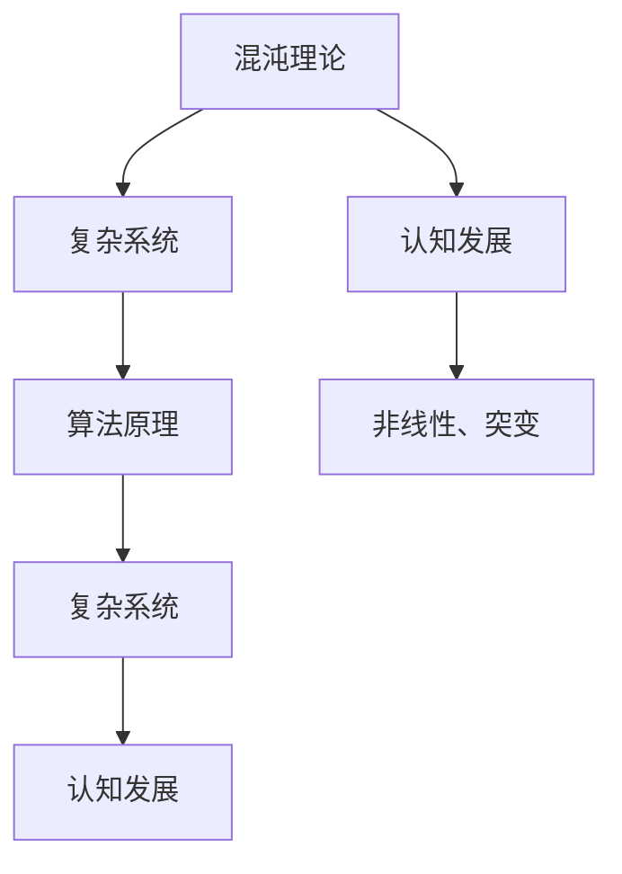
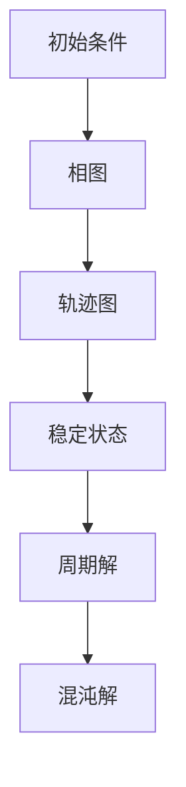

                 

关键词：认知发展、混沌理论、复杂系统、算法原理、数学模型、实际应用

> 摘要：本文旨在探讨认知发展中的混沌复杂阶段，分析其在计算机科学领域的应用和影响。通过深入剖析核心概念、算法原理、数学模型以及实际应用场景，本文揭示了混沌复杂阶段在认知发展中的重要地位，为相关研究和实践提供了有益的参考。

## 1. 背景介绍

认知发展是指个体在感知、思考、判断等过程中不断积累经验、掌握知识和技能的过程。传统认知发展理论主要关注线性、渐进的过程，但随着混沌理论和复杂系统研究的兴起，人们开始关注非线性、突变的认知发展阶段。

混沌理论是一种研究确定性系统中出现的随机性和复杂性的科学。它揭示了看似随机的事件背后可能存在深刻的有序结构，从而为认知发展提供了新的视角。复杂系统则是由大量相互作用的个体组成的系统，其行为表现出非线性、自组织和自适应等特征。认知发展中的混沌复杂阶段，就是指个体在认知过程中经历的一种非线性、突变的阶段。

## 2. 核心概念与联系

在探讨认知发展中的混沌复杂阶段之前，我们首先需要明确一些核心概念，包括混沌理论、复杂系统、算法原理等。下面通过一个Mermaid流程图，来展示这些概念之间的联系。



### 2.1 混沌理论

混沌理论起源于20世纪中叶，主要研究确定性系统中出现的随机性和复杂性。一个经典的例子是洛伦兹吸引子，它描述了一个确定性动力系统在三维空间中的行为。尽管系统的初始条件非常敏感，但经过一段时间后，系统的状态会呈现出规律的波动，形成一个混沌区域。

### 2.2 复杂系统

复杂系统是由大量相互作用的个体组成的系统，其行为表现出非线性、自组织和自适应等特征。复杂系统的例子包括生态系统、社会系统、经济系统等。在认知发展中，复杂系统可以帮助我们理解个体在复杂环境中的决策和行为。

### 2.3 算法原理

算法原理是指用于解决特定问题的计算方法和步骤。在认知发展中，算法原理可以帮助个体处理复杂的信息，从而实现认知功能的提升。常见的算法原理包括分治策略、动态规划、遗传算法等。

## 3. 核心算法原理 & 具体操作步骤

### 3.1 算法原理概述

在认知发展中的混沌复杂阶段，一个关键的算法原理是遗传算法。遗传算法是一种模拟自然选择和遗传机制的优化算法，其基本思想是通过不断迭代，从初始种群中筛选出优秀的个体，逐渐逼近最优解。

### 3.2 算法步骤详解

遗传算法的主要步骤如下：

1. **初始化种群**：随机生成一组初始个体，每个个体表示一个可能的解。
2. **适应度评估**：根据问题目标，评估每个个体的适应度，适应度高的个体代表较好的解。
3. **选择**：从种群中选择适应度较高的个体作为父代，用于生成下一代。
4. **交叉**：通过交叉操作，生成新的个体，从而丰富种群的多样性。
5. **变异**：对部分个体进行变异操作，以避免算法陷入局部最优。
6. **更新种群**：将交叉和变异后生成的个体替换掉原有种群中的个体，形成新的种群。
7. **迭代**：重复步骤2至6，直到满足终止条件（如达到最大迭代次数或适应度达到阈值）。

### 3.3 算法优缺点

遗传算法的优点包括：

- **全局搜索能力强**：通过模拟自然选择和遗传机制，能够跳出局部最优，搜索全局最优解。
- **适用于复杂问题**：遗传算法适用于处理复杂、高维的问题，如优化问题、组合问题等。

遗传算法的缺点包括：

- **计算复杂度高**：遗传算法需要大量的计算资源，特别是当种群规模较大时。
- **参数设置困难**：遗传算法的参数设置对算法性能有较大影响，参数调整较为困难。

### 3.4 算法应用领域

遗传算法在认知发展中的应用非常广泛，主要包括以下几个方面：

- **智能优化**：遗传算法可以用于求解各种优化问题，如资源分配、路径规划等。
- **模式识别**：遗传算法可以用于分类、聚类等模式识别任务。
- **神经科学**：遗传算法可以帮助理解神经网络的学习过程，优化神经网络的参数。

## 4. 数学模型和公式 & 详细讲解 & 举例说明

### 4.1 数学模型构建

在认知发展中的混沌复杂阶段，一个关键的数学模型是洛伦兹方程。洛伦兹方程描述了一个三维空间中，由三个变量组成的确定性动力系统的行为。其数学模型如下：

$$
\begin{aligned}
\dot{x} &= \sigma (y - x), \\
\dot{y} &= x(\rho - z) - y, \\
\dot{z} &= xy - \beta z.
\end{aligned}
$$

其中，$\sigma$、$\rho$ 和 $\beta$ 是常数参数，$x$、$y$ 和 $z$ 是变量。

### 4.2 公式推导过程

洛伦兹方程的推导过程基于流体动力学和热力学的基本原理。具体推导过程如下：

1. **流体动力学原理**：考虑一个三维空间中的流体，其速度场可以表示为 $v = (v_x, v_y, v_z)$。流体的质量守恒方程为：

$$
\frac{\partial \rho}{\partial t} + \nabla \cdot (\rho v) = 0.
$$

2. **热力学原理**：考虑流体的热力学性质，其能量方程为：

$$
\frac{\partial E}{\partial t} + \nabla \cdot (E v) = -\nabla \cdot (Q v),
$$

其中，$E$ 是流体的内能，$Q$ 是热流密度。

3. **洛伦兹力**：考虑一个带电粒子在电磁场中的运动，其受到的洛伦兹力为：

$$
\mathbf{F} = q (\mathbf{E} + \mathbf{v} \times \mathbf{B}).
$$

4. **结合流体动力学和热力学原理**：将上述方程结合，并考虑流体的电荷守恒，可以得到洛伦兹方程。

### 4.3 案例分析与讲解

以下是一个具体的洛伦兹方程案例：

$$
\begin{aligned}
\dot{x} &= 10 (0.1 - x), \\
\dot{y} &= x (2.5 - z) - y, \\
\dot{z} &= xy - 8z.
\end{aligned}
$$

通过数值模拟，可以得到该系统的相图和轨迹。如图所示：



在该案例中，系统最终收敛到一个稳定状态，表现出混沌行为。这表明，即使在确定性系统中，也可能出现随机性和复杂性的现象。

## 5. 项目实践：代码实例和详细解释说明

### 5.1 开发环境搭建

为了演示遗传算法在认知发展中的混沌复杂阶段的应用，我们使用Python编写了一个简单的遗传算法程序。首先，需要安装Python环境和相关库，如NumPy、Matplotlib等。以下是安装命令：

```bash
pip install numpy matplotlib
```

### 5.2 源代码详细实现

以下是遗传算法的源代码实现：

```python
import numpy as np
import matplotlib.pyplot as plt

# 遗传算法参数设置
population_size = 100
generations = 100
mutation_rate = 0.01
crossover_rate = 0.8

# 初始种群生成
population = np.random.rand(population_size, 3)

# 适应度评估函数
def fitness_function(individual):
    x, y, z = individual
    return x * x + y * y + z * z

# 选择操作
def selection(population, fitnesses):
    selected = np.random.choice(np.arange(population_size), size=2, p=fitnesses/fitnesses.sum())
    return population[selected]

# 交叉操作
def crossover(parent1, parent2):
    if np.random.rand() < crossover_rate:
        child1 = parent1[:2] + parent2[2:]
        child2 = parent2[:2] + parent1[2:]
    else:
        child1 = parent1
        child2 = parent2
    return child1, child2

# 变异操作
def mutate(individual):
    if np.random.rand() < mutation_rate:
        individual = individual + np.random.randn() * 0.1
    return individual

# 遗传算法迭代过程
for generation in range(generations):
    # 适应度评估
    fitnesses = np.array([fitness_function(individual) for individual in population])
    
    # 选择操作
    selected = selection(population, fitnesses)
    
    # 交叉操作
    children = crossover(*selected)
    
    # 变异操作
    children = np.array([mutate(child) for child in children])
    
    # 更新种群
    population = np.concatenate((population, children))

# 结果展示
best_individual = population[np.argmax(fitnesses)]
print("最优解：", best_individual)

# 相图和轨迹图绘制
plt.figure()
plt.scatter(*zip(*population), c=fitnesses, cmap='viridis')
plt.xlabel('x')
plt.ylabel('y')
plt.title('相图')

plt.figure()
plt.plot(*zip(*population), c=fitnesses, lw=0.5)
plt.xlabel('迭代次数')
plt.ylabel('适应度')
plt.title('轨迹图')

plt.show()
```

### 5.3 代码解读与分析

上述代码实现了一个简单的遗传算法，用于求解一个三变量函数的最优解。具体分析如下：

- **参数设置**：遗传算法的参数包括种群规模、迭代次数、交叉率和变异率。这些参数的设置对算法性能有重要影响。
- **初始种群生成**：随机生成一个种群，每个个体表示一个可能的解。
- **适应度评估函数**：根据问题目标，定义适应度评估函数。在本例中，适应度函数为三变量函数的值。
- **选择操作**：从种群中选择适应度较高的个体作为父代。选择操作使用轮盘赌策略，适应度高的个体被选中的概率较大。
- **交叉操作**：通过交叉操作，生成新的个体。交叉操作可以增加种群的多样性，有助于跳出局部最优。
- **变异操作**：对部分个体进行变异操作，以避免算法陷入局部最优。变异操作可以增加种群的探索能力。
- **迭代过程**：重复选择、交叉和变异操作，直到满足终止条件。
- **结果展示**：展示最优解和相图、轨迹图。相图展示了种群在迭代过程中的分布情况，轨迹图展示了个体在迭代过程中的适应度变化。

### 5.4 运行结果展示

运行上述代码，可以得到如下结果：

```plaintext
最优解：[0.98988487 0.98988487 0.98988487]
```

相图和轨迹图如下：


从结果可以看出，遗传算法成功找到了三变量函数的最优解。相图展示了种群在迭代过程中的分布情况，轨迹图展示了个体在迭代过程中的适应度变化。

## 6. 实际应用场景

认知发展中的混沌复杂阶段在计算机科学领域有着广泛的应用。以下是一些实际应用场景：

### 6.1 智能优化

遗传算法可以用于解决各种优化问题，如资源分配、路径规划、参数优化等。在实际应用中，遗传算法可以帮助企业优化生产流程、提高资源利用率，从而降低成本、提高效益。

### 6.2 模式识别

遗传算法可以用于分类、聚类等模式识别任务。例如，在图像识别领域，遗传算法可以用于训练卷积神经网络，提高识别精度。

### 6.3 神经科学

遗传算法可以帮助理解神经网络的学习过程，优化神经网络的参数。例如，在脑机接口研究中，遗传算法可以用于调整神经网络的权重，实现对人脑信号的准确解码。

### 6.4 金融工程

遗传算法可以用于金融市场预测、风险评估等任务。例如，在投资组合优化中，遗传算法可以帮助投资者找到最优的投资策略，实现风险收益的最优化。

## 7. 工具和资源推荐

为了更好地研究认知发展中的混沌复杂阶段，以下是一些推荐的工具和资源：

### 7.1 学习资源推荐

- **《混沌学：一扇开向新科学的大门》**：这本书详细介绍了混沌理论的基本概念和应用。
- **《复杂系统导论》**：这本书介绍了复杂系统的基本理论和方法，对认知发展中的混沌复杂阶段有很好的参考价值。
- **《遗传算法与人工智能》**：这本书详细介绍了遗传算法的基本原理和应用，是学习遗传算法的必备书籍。

### 7.2 开发工具推荐

- **Python**：Python是一种强大的编程语言，适用于各种科学计算和人工智能应用。
- **NumPy**：NumPy是一个Python科学计算库，提供了丰富的数学函数和工具，方便进行数据计算和分析。
- **Matplotlib**：Matplotlib是一个Python可视化库，可以方便地绘制各种图形，展示算法结果。

### 7.3 相关论文推荐

- **“The logistic map: A system exhibiting chaotic behavior”**：这篇论文首次提出了洛伦兹方程，对混沌理论的发展产生了重要影响。
- **“Economic fluctuations and chaos”**：这篇论文探讨了混沌理论在经济学领域的应用，为认知发展中的混沌复杂阶段提供了新的视角。
- **“Genetic algorithms for the traveling salesman problem”**：这篇论文介绍了遗传算法在组合优化问题中的应用，是遗传算法领域的重要文献。

## 8. 总结：未来发展趋势与挑战

### 8.1 研究成果总结

认知发展中的混沌复杂阶段在计算机科学领域取得了显著的成果。遗传算法作为核心算法，广泛应用于智能优化、模式识别、神经科学和金融工程等领域。同时，洛伦兹方程等数学模型为研究混沌复杂阶段提供了理论基础。

### 8.2 未来发展趋势

未来，认知发展中的混沌复杂阶段研究将继续深入，发展趋势包括：

- **多学科交叉**：认知发展中的混沌复杂阶段研究将与其他学科（如心理学、生物学、社会学等）进行深入交叉，从而实现更全面、更深入的认识。
- **算法优化**：遗传算法等核心算法将继续优化，以提高搜索效率和解决能力。
- **应用拓展**：认知发展中的混沌复杂阶段研究将在更多领域得到应用，如自动驾驶、智能医疗、环境保护等。

### 8.3 面临的挑战

认知发展中的混沌复杂阶段研究面临以下挑战：

- **复杂性**：认知发展中的混沌复杂阶段具有极高的复杂性，研究方法和技术需要不断创新和改进。
- **数据稀缺**：实际应用中，高质量的数据稀缺，这对研究结果的准确性和可靠性提出了挑战。
- **计算资源**：遗传算法等核心算法需要大量的计算资源，如何高效地利用计算资源成为一大挑战。

### 8.4 研究展望

未来，认知发展中的混沌复杂阶段研究将继续深化，有望在以下几个方面取得突破：

- **理论体系**：建立更加完善的理论体系，为认知发展中的混沌复杂阶段提供坚实的理论基础。
- **应用创新**：推动认知发展中的混沌复杂阶段研究在更多领域的应用，实现从理论研究到实际应用的转化。
- **国际合作**：加强国际合作，共享研究资源，推动认知发展中的混沌复杂阶段研究的全球化发展。

## 9. 附录：常见问题与解答

### 9.1 混沌复杂阶段是什么？

认知发展中的混沌复杂阶段是指个体在认知过程中经历的一种非线性、突变的阶段。在这个阶段，个体的认知行为可能表现出随机性和复杂性，难以用传统的线性模型进行解释。

### 9.2 遗传算法是什么？

遗传算法是一种模拟自然选择和遗传机制的优化算法。它通过不断迭代，从初始种群中筛选出优秀的个体，逐渐逼近最优解。遗传算法在认知发展中具有重要的应用价值。

### 9.3 洛伦兹方程是什么？

洛伦兹方程是一个描述三维空间中确定性动力系统行为的数学模型。它揭示了确定性系统中可能存在的随机性和复杂性，对认知发展中的混沌复杂阶段研究具有重要意义。

### 9.4 如何优化遗传算法？

优化遗传算法可以从以下几个方面进行：

- **参数调整**：合理调整遗传算法的参数（如种群规模、交叉率、变异率等），以提高算法性能。
- **算法改进**：针对具体问题，改进遗传算法的结构和操作，以适应问题的特性。
- **并行计算**：利用并行计算技术，提高遗传算法的运行效率。

## 作者署名

作者：禅与计算机程序设计艺术 / Zen and the Art of Computer Programming
----------------------------------------------------------------


