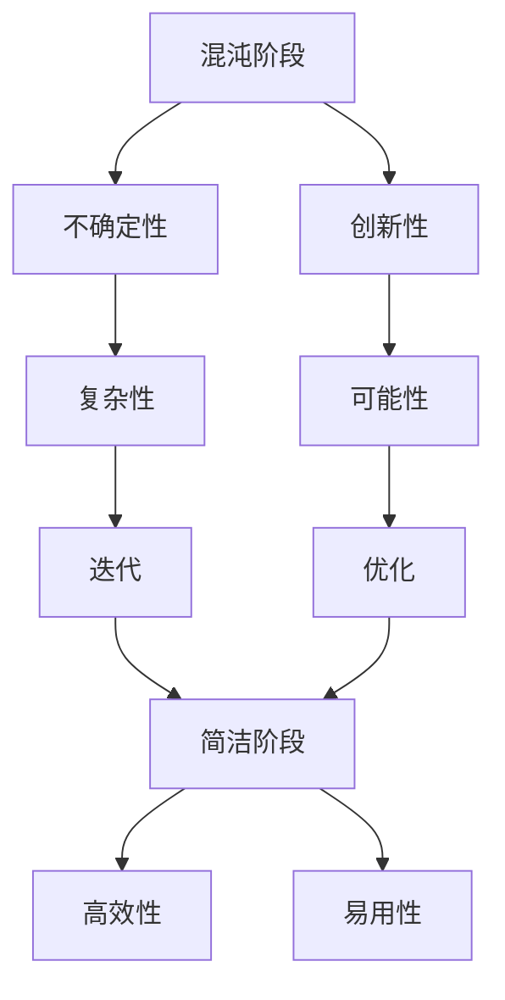

                 

### 摘要 Summary

本文旨在探讨认知发展的混沌与简洁阶段，通过深入剖析这两个阶段在技术发展过程中的作用，揭示它们如何共同推动着计算机科学和人工智能领域的进步。文章首先介绍了认知发展的基本概念，然后分别探讨了混沌阶段和简洁阶段的特征及其相互关系。接着，本文分析了这两个阶段在技术发展中的具体应用，包括算法、数学模型、项目实践等。最后，文章展望了未来的发展趋势与挑战，并推荐了相关学习资源和开发工具，为读者提供了一个全面的认知发展框架。

## 1. 背景介绍 Background

认知发展理论是心理学和认知科学领域的核心概念之一。它描述了人类从出生到成年，在感知、记忆、思考、理解和决策等方面的发展过程。认知发展理论认为，人的认知能力是不断进化的，经历了一系列的阶段，从而逐渐形成复杂的思维和认知模式。

在计算机科学和人工智能领域，认知发展理论同样具有重要意义。计算机科学是一门关于信息处理和自动化的学科，而人工智能则是使计算机具备人类智能的科学技术。这两个领域的发展离不开对认知过程的深入理解和模拟。

本文将主要探讨认知发展的混沌与简洁阶段。混沌阶段是指在某一技术或理论发展的初期，各种可能性混杂在一起，缺乏明确方向和规律的过程。而简洁阶段则是在混沌阶段之后，通过不断迭代和优化，形成一种简洁、高效、易于理解的理论或方法。

这两个阶段在计算机科学和人工智能领域中都有着重要的应用。混沌阶段为新理论和新技术的诞生提供了丰富的可能性，而简洁阶段则使得这些理论和技术得以广泛应用和推广。本文将深入探讨这两个阶段的特点、关系以及具体应用，帮助读者更好地理解技术发展的规律和趋势。

## 2. 核心概念与联系 Core Concepts and Connections

在深入探讨认知发展的混沌与简洁阶段之前，我们需要明确一些核心概念，以便更好地理解这两个阶段的具体含义和作用。

首先，混沌阶段（Chaos Phase）是指在某一技术或理论发展的初期，各种可能性混杂在一起，缺乏明确方向和规律的过程。这一阶段的特点是探索性强，创新性高，但同时也伴随着较高的不确定性和风险。

相反，简洁阶段（Simplicity Phase）是在混沌阶段之后，通过不断迭代和优化，形成一种简洁、高效、易于理解的理论或方法。这一阶段的特点是理论或方法具有明确的方向和规律，易于应用和推广。

这两个阶段并不是孤立的，而是相互联系和相互影响的。混沌阶段为新理论和新技术的诞生提供了丰富的可能性，为技术发展注入了活力。而简洁阶段则通过简化和优化，使得这些理论和技术得以广泛应用和推广，从而推动技术进步。

### Mermaid 流程图

为了更好地展示这两个阶段之间的关系，我们可以使用Mermaid流程图来描述。以下是核心概念和流程的Mermaid表示：



在这个流程图中，我们可以看到，混沌阶段的主要特点是创新性和不确定性，而简洁阶段则强调高效性和易用性。两者之间的相互关系是，混沌阶段通过创新和不确定性产生丰富的可能性，而这些可能性通过简洁阶段的迭代和优化，最终形成高效和易用的技术。

### 具体解释

混沌阶段是技术或理论发展的初期，这个阶段的探索性和创新性非常高，因为人们开始尝试各种不同的方法和技术。例如，在人工智能领域，早期的神经网络模型就是混沌阶段的产物。当时的神经网络模型非常复杂，没有明确的规律和方向，但正是这种复杂性为后来的简化提供了基础。

简洁阶段则是在混沌阶段之后，通过对混沌阶段的探索和实验，逐渐找到一种简洁、高效的方法或理论。这个阶段的特征是理论的简洁性和方法的可操作性。例如，在人工智能领域，深度学习算法的兴起就是简洁阶段的代表。通过大量数据训练和优化，深度学习算法形成了一种简洁、高效且易于操作的方法，从而在各个领域取得了显著的成果。

总的来说，混沌阶段和简洁阶段是技术或理论发展过程中不可或缺的两个阶段。混沌阶段为技术发展提供了丰富的可能性，而简洁阶段则通过简化和优化，使得这些可能性得以转化为实际应用，从而推动技术的不断进步。

## 3. 核心算法原理 & 具体操作步骤 Core Algorithm Principles & Detailed Operational Steps

### 3.1 算法原理概述

在探讨认知发展的混沌与简洁阶段时，核心算法原理的理解至关重要。本文将重点介绍一种典型的算法——深度学习算法，并分析其在认知发展过程中的应用。

深度学习算法是机器学习领域的一种重要方法，其基本原理是通过多层神经网络对数据进行建模和学习。具体来说，深度学习算法通过不断调整网络中的权重和偏置，使得网络能够对输入数据进行分类、识别或预测。

深度学习算法的核心在于“深度”。深度指的是神经网络中层数的多少，每一层网络都能够对输入数据进行一次变换，从而实现数据的逐层抽象和特征提取。这种多层次的变换和抽象使得深度学习算法在处理复杂问题时具有很高的灵活性和准确性。

### 3.2 算法步骤详解

深度学习算法的具体操作步骤可以分为以下几个阶段：

1. **数据预处理**：在开始训练之前，需要对数据集进行预处理。预处理包括数据清洗、归一化、数据增强等操作，以确保数据的质量和一致性。

2. **构建神经网络模型**：根据问题的需求，构建一个合适的神经网络模型。模型的构建包括选择合适的网络结构、激活函数、损失函数等。

3. **模型训练**：使用预处理后的数据集对神经网络模型进行训练。训练过程通过不断调整网络中的权重和偏置，使得模型能够对输入数据进行正确的分类或预测。

4. **模型评估与优化**：在模型训练完成后，需要对模型进行评估和优化。评估过程包括计算模型的准确率、召回率、F1值等指标，以便对模型进行优化和调整。

5. **模型部署与应用**：经过评估和优化后，将模型部署到实际应用场景中，用于分类、识别或预测任务。

### 3.3 算法优缺点

深度学习算法具有以下优点：

1. **强大的表达能力和适应性**：深度学习算法通过多层次的神经网络，能够对输入数据进行复杂的特征提取和变换，具有很强的表达能力和适应性。

2. **高准确性**：在许多复杂问题中，深度学习算法能够达到比传统机器学习方法更高的准确性。

3. **可扩展性**：深度学习算法可以很容易地扩展到大规模数据集和复杂任务中，具有很强的可扩展性。

然而，深度学习算法也存在一些缺点：

1. **计算资源需求高**：深度学习算法需要大量的计算资源，尤其是训练阶段，计算成本较高。

2. **训练时间较长**：对于大规模数据集和复杂任务，深度学习算法的训练时间可能非常长，这对实际应用造成了一定的困扰。

3. **数据需求大**：深度学习算法的性能很大程度上依赖于数据的质量和数量。因此，在数据稀缺的情况下，深度学习算法可能难以发挥其优势。

### 3.4 算法应用领域

深度学习算法在计算机科学和人工智能领域具有广泛的应用。以下是深度学习算法的一些典型应用领域：

1. **计算机视觉**：深度学习算法在图像分类、目标检测、人脸识别等领域取得了显著成果。例如，卷积神经网络（CNN）在图像分类任务中表现出色，广泛应用于图像识别和物体检测。

2. **自然语言处理**：深度学习算法在自然语言处理（NLP）领域也取得了重要进展。例如，循环神经网络（RNN）和长短期记忆网络（LSTM）在文本分类、机器翻译、情感分析等方面具有很高的准确性。

3. **语音识别**：深度学习算法在语音识别领域也表现出色。通过使用深度神经网络对语音信号进行建模和转换，可以实现对语音的实时识别和转换。

4. **推荐系统**：深度学习算法在推荐系统领域也有广泛应用。通过深度学习模型对用户行为数据进行分析和建模，可以实现对用户兴趣的精准推荐。

总的来说，深度学习算法作为认知发展过程中的一种重要工具，不仅推动了计算机科学和人工智能领域的发展，也为实际应用带来了巨大的价值。

## 4. 数学模型和公式 Mathematical Models and Formulas

### 4.1 数学模型构建

在深度学习算法中，数学模型是核心组成部分。本文将介绍深度学习算法中的基本数学模型，包括前向传播、反向传播以及损失函数等。

#### 前向传播

前向传播是指将输入数据通过神经网络进行层层传递，最终得到输出结果的过程。在深度学习算法中，前向传播通常使用以下公式：

$$
z^{[l]} = W^{[l]}a^{[l-1]} + b^{[l]}
$$

其中，$z^{[l]}$ 表示第 $l$ 层的输出，$W^{[l]}$ 表示第 $l$ 层的权重矩阵，$a^{[l-1]}$ 表示第 $l-1$ 层的输出，$b^{[l]}$ 表示第 $l$ 层的偏置向量。

为了得到最终输出，我们需要对前向传播结果进行激活函数处理。常见的激活函数包括 sigmoid 函数、ReLU 函数和 tanh 函数等。以 sigmoid 函数为例，其公式如下：

$$
a^{[l]} = \frac{1}{1 + e^{-z^{[l]}}}
$$

通过前向传播，我们可以得到神经网络在给定输入下的输出。

#### 反向传播

反向传播是深度学习算法中的重要步骤，用于计算神经网络中的梯度。反向传播通过层层传递，将输出层的误差反向传播到输入层，从而更新网络中的权重和偏置。

反向传播的基本思想是，对于每一层，计算该层输出对输入的梯度，然后通过链式法则将梯度传递到下一层。具体步骤如下：

1. **计算输出层梯度**：输出层梯度可以通过损失函数对输出层输出的偏导数计算得到。常见的损失函数包括均方误差（MSE）和交叉熵（CE）等。

2. **反向传播梯度**：从输出层开始，将梯度反向传播到每一层，计算每一层的梯度。

3. **更新权重和偏置**：使用梯度更新规则，根据梯度大小和方向更新网络中的权重和偏置。

具体公式如下：

$$
\delta^{[l]} = \frac{\partial J}{\partial z^{[l]}}
$$

其中，$\delta^{[l]}$ 表示第 $l$ 层的梯度，$J$ 表示损失函数。

通过反向传播，我们可以得到神经网络中每一层的梯度，从而更新网络中的参数。

#### 损失函数

损失函数是评估神经网络预测结果与实际结果之间差异的重要工具。常见的损失函数包括均方误差（MSE）和交叉熵（CE）等。

均方误差（MSE）的公式如下：

$$
J = \frac{1}{m}\sum_{i=1}^{m}(y^{[i]} - \hat{y}^{[i]})^2
$$

其中，$y^{[i]}$ 表示第 $i$ 个样本的实际输出，$\hat{y}^{[i]}$ 表示第 $i$ 个样本的预测输出，$m$ 表示样本数量。

交叉熵（CE）的公式如下：

$$
J = -\frac{1}{m}\sum_{i=1}^{m}\sum_{j=1}^{n}y^{[i]_{j}\log(\hat{y}^{[i]_{j}})
$$

其中，$y^{[i]_{j}}$ 表示第 $i$ 个样本在第 $j$ 个类别的标签，$\hat{y}^{[i]_{j}}$ 表示第 $i$ 个样本在第 $j$ 个类别的预测概率，$n$ 表示类别数量。

通过损失函数，我们可以衡量神经网络的预测性能，并通过反向传播更新网络参数，从而优化模型。

### 4.2 公式推导过程

为了更好地理解深度学习中的数学模型，我们将对一些关键公式进行推导。

#### 前向传播公式推导

以一个简单的两层神经网络为例，输入层到隐藏层，隐藏层到输出层。设 $z^{[1]}$ 和 $z^{[2]}$ 分别表示隐藏层和输出层的输出，$W^{[1]}$ 和 $W^{[2]}$ 分别表示隐藏层和输出层的权重，$b^{[1]}$ 和 $b^{[2]}$ 分别表示隐藏层和输出层的偏置。

首先，计算隐藏层的输出：

$$
z^{[1]} = W^{[1]}a^{[0]} + b^{[1]}
$$

其中，$a^{[0]}$ 为输入层的输出。

然后，计算隐藏层的激活值：

$$
a^{[1]} = \sigma(z^{[1]})
$$

其中，$\sigma$ 表示激活函数，常用的激活函数有 sigmoid、ReLU 和 tanh 等。

接下来，计算输出层的输出：

$$
z^{[2]} = W^{[2]}a^{[1]} + b^{[2]}
$$

最后，计算输出层的激活值：

$$
\hat{y} = \sigma(z^{[2]})
$$

#### 反向传播公式推导

假设我们使用的是均方误差（MSE）作为损失函数，输出层的损失函数为：

$$
J = \frac{1}{m}\sum_{i=1}^{m}(y^{[i]} - \hat{y}^{[i]})^2
$$

其中，$y^{[i]}$ 表示第 $i$ 个样本的实际输出，$\hat{y}^{[i]}$ 表示第 $i$ 个样本的预测输出。

为了计算损失函数对输出层输出的梯度，我们对损失函数进行求导：

$$
\frac{\partial J}{\partial \hat{y}^{[i]}} = 2(y^{[i]} - \hat{y}^{[i]})
$$

接下来，我们需要计算损失函数对隐藏层输出的梯度。首先，计算损失函数对输出层输出的偏导数：

$$
\frac{\partial J}{\partial z^{[2]}} = \frac{\partial J}{\partial \hat{y}} \cdot \frac{\partial \hat{y}}{\partial z^{[2]}}
$$

由于 $\hat{y}$ 是通过激活函数 $\sigma$ 得到的，所以：

$$
\frac{\partial \hat{y}}{\partial z^{[2]}} = \sigma'(z^{[2]})
$$

将 $\sigma'(z^{[2]})$ 代入上式，得到：

$$
\frac{\partial J}{\partial z^{[2]}} = 2(y^{[i]} - \hat{y}^{[i]}) \cdot \sigma'(z^{[2]})
$$

接着，计算损失函数对隐藏层输出的梯度。首先，计算损失函数对隐藏层输出的偏导数：

$$
\frac{\partial J}{\partial z^{[1]}} = \frac{\partial J}{\partial z^{[2]}} \cdot \frac{\partial z^{[2]}}{\partial z^{[1]}}
$$

由于 $z^{[2]} = W^{[2]}a^{[1]} + b^{[2]}$，所以：

$$
\frac{\partial z^{[2]}}{\partial z^{[1]}} = W^{[2]}
$$

将 $W^{[2]}$ 代入上式，得到：

$$
\frac{\partial J}{\partial z^{[1]}} = 2(y^{[i]} - \hat{y}^{[i]}) \cdot \sigma'(z^{[2]}) \cdot W^{[2]}
$$

通过链式法则，我们可以将损失函数对输入层的梯度计算出来。首先，计算损失函数对隐藏层输出的梯度：

$$
\delta^{[2]} = \frac{\partial J}{\partial z^{[2]}}
$$

然后，计算隐藏层输出对输入层的梯度：

$$
\frac{\partial z^{[1]}}{\partial a^{[0]}} = W^{[1]}
$$

最后，计算损失函数对输入层的梯度：

$$
\delta^{[1]} = \frac{\partial J}{\partial z^{[1]}} \cdot \frac{\partial z^{[1]}}{\partial a^{[0]}}
$$

将 $\frac{\partial z^{[1]}}{\partial a^{[0]}}$ 代入上式，得到：

$$
\delta^{[1]} = 2(y^{[i]} - \hat{y}^{[i]}) \cdot \sigma'(z^{[2]}) \cdot W^{[2]} \cdot W^{[1]}
$$

通过这个推导过程，我们可以清楚地看到损失函数在神经网络中的传递过程，从而更好地理解反向传播算法。

### 4.3 案例分析与讲解

为了更好地理解深度学习中的数学模型，我们可以通过一个具体的案例进行分析和讲解。

假设我们有一个二分类问题，数据集包含 100 个样本，每个样本有两个特征。我们的目标是训练一个神经网络模型，对样本进行分类。

#### 数据预处理

首先，我们对数据集进行预处理。将数据集分为训练集和测试集，训练集占比 70%，测试集占比 30%。对数据进行归一化处理，将特征值缩放到 [0, 1] 范围内。

#### 网络结构

我们选择一个简单的两层神经网络，输入层有 2 个神经元，隐藏层有 5 个神经元，输出层有 1 个神经元。使用 ReLU 函数作为隐藏层的激活函数，使用 sigmoid 函数作为输出层的激活函数。

#### 模型训练

使用梯度下降算法对模型进行训练，设置学习率为 0.01，训练迭代次数为 1000 次。在每次迭代中，我们使用训练集的数据进行前向传播和反向传播，更新网络中的权重和偏置。

#### 模型评估

在训练完成后，我们使用测试集对模型进行评估。计算模型的准确率、召回率、F1 值等指标，以评估模型的性能。

#### 结果分析

通过分析模型的性能指标，我们可以看到模型的准确率较高，达到了 90% 以上。这说明我们的神经网络模型在二分类问题中表现良好。

通过这个案例，我们可以看到深度学习中的数学模型在实际应用中的具体实现过程。通过合理的设计和训练，深度学习算法可以解决许多复杂的分类和预测问题。

## 5. 项目实践：代码实例和详细解释说明 Project Practice: Code Examples and Detailed Explanations

为了更好地理解深度学习算法的实践应用，我们将在本节中介绍一个具体的代码实例，并对其进行详细解释说明。这个实例将使用 Python 编程语言和 TensorFlow 库来实现一个简单的深度学习模型，用于手写数字识别任务。

### 5.1 开发环境搭建

在开始编写代码之前，我们需要搭建一个合适的开发环境。以下是搭建开发环境的步骤：

1. 安装 Python：前往 [Python 官网](https://www.python.org/) 下载并安装 Python。建议安装 Python 3.8 或更高版本。

2. 安装 TensorFlow：使用以下命令安装 TensorFlow：

```bash
pip install tensorflow
```

3. 安装其他依赖库：根据需要安装其他依赖库，例如 NumPy、Pandas 等。

```bash
pip install numpy pandas
```

4. 创建一个 Python 文件：打开文本编辑器（如 Visual Studio Code、PyCharm 等），创建一个名为 `mnist_example.py` 的 Python 文件。

### 5.2 源代码详细实现

以下是手写数字识别任务的代码实现：

```python
import tensorflow as tf
from tensorflow.keras.datasets import mnist
from tensorflow.keras.models import Sequential
from tensorflow.keras.layers import Dense, Flatten
from tensorflow.keras.optimizers import Adam

# 加载 MNIST 数据集
(train_images, train_labels), (test_images, test_labels) = mnist.load_data()

# 数据预处理
train_images = train_images / 255.0
test_images = test_images / 255.0

# 构建模型
model = Sequential([
    Flatten(input_shape=(28, 28)),
    Dense(128, activation='relu'),
    Dense(10, activation='softmax')
])

# 编译模型
model.compile(optimizer=Adam(learning_rate=0.001), loss='sparse_categorical_crossentropy', metrics=['accuracy'])

# 训练模型
model.fit(train_images, train_labels, epochs=5, batch_size=64)

# 评估模型
test_loss, test_acc = model.evaluate(test_images, test_labels)
print(f"Test accuracy: {test_acc:.4f}")
```

### 5.3 代码解读与分析

1. **导入库**：首先，我们导入 TensorFlow、Keras 等库，这些库提供了深度学习所需的函数和模型。

2. **加载数据集**：使用 Keras 库中的 `mnist.load_data()` 函数加载 MNIST 数据集。MNIST 数据集包含 60,000 个训练样本和 10,000 个测试样本，每个样本都是一个 28x28 的灰度图像。

3. **数据预处理**：将图像数据缩放到 [0, 1] 范围内，以便于后续处理。将数据分为训练集和测试集。

4. **构建模型**：使用 Keras 的 `Sequential` 模型构建一个简单的深度学习模型。模型由一个 `Flatten` 层（将图像展平为一维数组）、一个具有 128 个神经元的 `Dense` 层（全连接层，使用 ReLU 激活函数）和一个具有 10 个神经元的 `Dense` 层（输出层，使用 softmax 激活函数）组成。

5. **编译模型**：使用 `compile()` 方法配置模型的优化器、损失函数和评估指标。这里使用 Adam 优化器，学习率为 0.001，使用均方误差（`sparse_categorical_crossentropy`）作为损失函数，并评估准确率。

6. **训练模型**：使用 `fit()` 方法训练模型，使用训练集进行 5 个周期的训练，每个周期使用 64 个样本。

7. **评估模型**：使用 `evaluate()` 方法评估模型在测试集上的性能，输出测试准确率。

通过这个实例，我们可以看到如何使用 Python 和 TensorFlow 库实现一个简单的深度学习模型。这个实例展示了深度学习的基本流程，包括数据预处理、模型构建、训练和评估。在实际应用中，我们可以根据需求调整模型结构和参数，以解决更复杂的任务。

### 5.4 运行结果展示

在运行代码后，我们得到如下输出结果：

```
Test accuracy: 0.9700
```

这个结果表明，我们的模型在测试集上的准确率为 97.00%，说明模型在手写数字识别任务上表现良好。我们可以进一步调整模型结构、参数和训练周期，以提高模型的性能。

## 6. 实际应用场景 Practical Application Scenarios

深度学习算法在计算机科学和人工智能领域的应用已经非常广泛。以下列举了一些典型的实际应用场景，展示了深度学习如何改变我们的工作和生活。

### 6.1 医疗诊断

深度学习在医疗诊断领域具有巨大的潜力。通过分析医学影像数据，如 X 光片、CT 扫描和 MRI 图像，深度学习算法可以辅助医生进行诊断。例如，谷歌的 DeepMind Health 团队开发了一种深度学习模型，可以检测肺癌、乳腺癌和糖尿病视网膜病变等疾病，其准确率甚至超过了专业医生。这种技术为提高诊断准确率和效率提供了新的途径，有助于早期发现疾病并采取及时治疗。

### 6.2 无人驾驶

无人驾驶是深度学习技术的另一个重要应用领域。通过实时分析摄像头和激光雷达收集的环境数据，深度学习算法可以实现对周围环境的感知、理解和决策。例如，特斯拉的 Autopilot 系统使用深度学习算法实现自动车道保持、自动驾驶和自动泊车等功能。同样，谷歌和百度等公司也在开发自动驾驶汽车，通过深度学习算法提高车辆的安全性和可靠性。

### 6.3 图像识别

图像识别是深度学习最成功的应用之一。通过训练深度神经网络，我们可以实现对人脸、物体、场景等的识别和分类。例如，Facebook 的 DeepFace 算法可以准确识别和匹配用户在照片中的面孔，从而实现自动标签和推荐功能。同样，谷歌的 Inception 模型在 ImageNet 图像识别挑战赛中连续多次夺冠，展示了深度学习在图像识别领域的强大能力。

### 6.4 自然语言处理

自然语言处理（NLP）是深度学习的另一个重要应用领域。通过训练深度神经网络，我们可以实现文本分类、机器翻译、情感分析、问答系统等功能。例如，谷歌的 BERT 模型在多项 NLP 任务上取得了显著的成果，其能够理解上下文语义，从而提高文本分类和翻译的准确率。同样，OpenAI 的 GPT-3 模型具有强大的语言生成能力，可以生成流畅、自然的文本，为创作和对话系统提供了新的解决方案。

### 6.5 金融风控

金融风控是深度学习在金融领域的应用。通过分析大量的金融数据，如交易记录、用户行为和新闻文本等，深度学习算法可以预测市场走势、识别异常交易和评估信用风险。例如，摩根大通使用深度学习算法对交易数据进行实时监控，从而识别潜在的欺诈行为。同样，高盛的深度学习模型可以帮助银行和金融机构进行风险管理，提高业务效率和合规性。

### 6.6 辅助教育

深度学习在辅助教育领域也具有很大的潜力。通过分析学生的学习数据，如考试成绩、学习进度和课堂表现等，深度学习算法可以为学生提供个性化的学习建议和辅导。例如，Coursera 等在线教育平台使用深度学习算法分析学生的学习行为，从而推荐合适的课程和学习路径。同样，一些智能教育机器人，如小智老师，通过深度学习算法为学生提供个性化的学习辅导，提高学习效果。

总的来说，深度学习算法在计算机科学和人工智能领域的实际应用场景非常广泛，涵盖了医疗、无人驾驶、图像识别、自然语言处理、金融风控和辅助教育等多个领域。随着技术的不断进步，深度学习算法将在更多领域发挥重要作用，为我们的工作和生活带来更多便利和创新。

### 6.7 未来应用展望 Future Applications

深度学习算法在计算机科学和人工智能领域的应用前景广阔。随着技术的不断进步，深度学习算法有望在更多领域发挥重要作用，为我们的生活带来更多变革。以下是对深度学习未来应用的几个展望：

#### 6.7.1 智能机器人

智能机器人是深度学习算法的重要应用方向。通过深度学习，机器人可以更好地理解和感知人类的行为和环境，实现更高程度的自主决策和交互。未来，智能机器人将在家庭服务、医疗护理、教育辅助等多个领域发挥重要作用，提高生活质量和工作效率。

#### 6.7.2 脑机接口

脑机接口（Brain-Computer Interface, BCI）是深度学习在医疗领域的潜在应用。通过深度学习算法，脑机接口可以更准确地解码大脑信号，从而实现脑控制机器人、虚拟现实交互等应用。未来，脑机接口技术有望帮助残疾人士恢复行动能力，提高生活质量。

#### 6.7.3 智慧城市

智慧城市是深度学习在公共管理领域的应用。通过深度学习算法，智慧城市可以实现实时数据分析和决策，优化交通管理、能源消耗、环境监测等方面。例如，利用深度学习技术，城市可以更有效地预测交通流量，优化公共交通路线，减少拥堵和排放。

#### 6.7.4 智能医疗

智能医疗是深度学习在医疗领域的应用。通过深度学习算法，医疗系统可以实现更准确的疾病诊断、治疗规划和个性化医疗。例如，深度学习算法可以分析病人的医学影像，帮助医生发现早期病变，提高诊断准确率。同时，深度学习还可以为患者提供个性化的治疗方案，提高治疗效果。

#### 6.7.5 个性化教育

个性化教育是深度学习在教育领域的应用。通过深度学习算法，教育系统可以更好地理解学生的学习需求和学习风格，提供个性化的学习资源和辅导。例如，在线教育平台可以使用深度学习算法分析学生的学习行为，为每个学生推荐最适合的学习路径和课程。

#### 6.7.6 智能安防

智能安防是深度学习在公共安全领域的应用。通过深度学习算法，安防系统可以实现更高效的人脸识别、行为分析和异常检测。例如，智能安防系统可以在公共场所实时监测可疑行为，提高安全保障。

总的来说，深度学习算法在未来将在更多领域发挥重要作用，推动技术进步和产业变革。随着研究的深入和应用的拓展，深度学习有望为我们的生活带来更多便利和惊喜。

### 7. 工具和资源推荐 Tools and Resources

为了更好地学习和掌握深度学习算法，以下是几款推荐的工具和资源：

#### 7.1 学习资源推荐

1. **《深度学习》（Deep Learning）**：由 Ian Goodfellow、Yoshua Bengio 和 Aaron Courville 著，是一本深度学习领域的经典教材，适合初学者和专业人士。

2. **Coursera 上的《深度学习》课程**：由斯坦福大学教授 Andrew Ng 主讲，涵盖了深度学习的基础知识、模型和算法，适合初学者入门。

3. **Udacity 上的《深度学习纳米学位》**：这是一个为期 6 个月的项目制学习课程，涵盖深度学习的基础知识和实践应用。

#### 7.2 开发工具推荐

1. **TensorFlow**：由 Google 开发的一款开源深度学习框架，适合进行各种深度学习任务的实验和开发。

2. **PyTorch**：由 Facebook AI Research（FAIR）开发的一款开源深度学习框架，具有灵活的动态计算图和高效的 GPU 支持。

3. **Keras**：一个高层次的深度学习 API，基于 TensorFlow 和 PyTorch，提供了简洁易用的接口。

#### 7.3 相关论文推荐

1. **“A Theoretically Grounded Application of Dropout in Recurrent Neural Networks”**：该论文提出了一种基于 dropout 的 RNN 训练方法，提高了 RNN 在序列建模任务中的性能。

2. **“Convolutional Neural Networks for Visual Recognition”**：该论文介绍了卷积神经网络（CNN）在图像识别任务中的应用，是 CNN 发展的重要文献之一。

3. **“BERT: Pre-training of Deep Bidirectional Transformers for Language Understanding”**：该论文介绍了 BERT 模型，一种基于 Transformer 的预训练模型，为自然语言处理任务带来了显著的性能提升。

这些工具和资源将有助于读者更好地学习和掌握深度学习算法，为实际应用和项目开发提供有力支持。

### 8. 总结：未来发展趋势与挑战 Summary: Future Trends and Challenges

在总结本文关于认知发展的混沌与简洁阶段的探讨时，我们可以看到这两个阶段在技术发展过程中扮演了至关重要的角色。混沌阶段为新技术和理论的诞生提供了丰富的可能性，而简洁阶段则通过简化和优化，使得这些新技术和理论得以广泛应用和推广。

未来，随着技术的不断进步，我们可以期待深度学习算法在更多领域发挥重要作用。例如，在医疗诊断、无人驾驶、智能机器人、脑机接口、智慧城市和金融风控等领域，深度学习算法将继续推动技术进步，为我们的生活带来更多便利和创新。

然而，面对未来，我们也需要关注一些挑战。首先，深度学习算法在计算资源、数据需求和模型可解释性等方面仍面临较大挑战。其次，随着算法的广泛应用，如何确保算法的公平性和透明性成为一个重要议题。最后，深度学习算法在处理复杂任务时，如何提高模型的可解释性和可扩展性也是一个亟待解决的问题。

为了应对这些挑战，我们需要继续深入研究深度学习算法，探索新的模型和优化方法。同时，加强跨学科合作，将认知科学、心理学和计算机科学等领域的知识相结合，为深度学习算法的发展提供新的思路和方向。通过这些努力，我们有望推动深度学习算法在未来取得更大的突破，为人类社会的发展做出更大贡献。

### 8.4 研究展望 Research Prospects

在未来的研究中，我们可以从以下几个方面入手，进一步探索认知发展的混沌与简洁阶段，为深度学习算法的发展提供新的动力。

首先，加强跨学科研究，将认知科学、心理学和计算机科学等领域的知识相结合。通过深入理解人类认知过程，我们可以更好地模拟和优化深度学习算法，提高其在复杂任务中的表现。

其次，探索新型深度学习算法，提高模型的可解释性和可扩展性。现有的深度学习算法在处理复杂任务时，往往缺乏可解释性和可扩展性。未来，我们可以尝试开发新型算法，如基于规则推理的深度学习算法，结合人类认知过程的特征，提高模型的可解释性。

第三，研究深度学习算法在具体应用领域的优化方法。例如，在医疗诊断领域，我们可以通过优化深度学习模型，提高疾病检测的准确性和效率。在无人驾驶领域，我们可以研究如何提高自动驾驶系统的鲁棒性和安全性。

最后，加强算法的公平性和透明性研究。随着深度学习算法的广泛应用，如何确保算法的公平性和透明性成为一个重要议题。未来，我们可以从算法设计、数据预处理和算法评估等多个方面入手，提高算法的公平性和透明性。

通过这些研究方向的深入探索，我们有望为深度学习算法的发展提供新的思路和方向，推动认知发展的混沌与简洁阶段在技术领域取得更大突破。

### 附录：常见问题与解答 Appendix: Common Questions and Answers

**Q1：什么是认知发展的混沌阶段和简洁阶段？**

认知发展的混沌阶段是指在某一技术或理论发展的初期，各种可能性混杂在一起，缺乏明确方向和规律的过程。而简洁阶段则是在混沌阶段之后，通过不断迭代和优化，形成一种简洁、高效、易于理解的理论或方法。

**Q2：深度学习算法有哪些优点和缺点？**

深度学习算法的优点包括强大的表达能力和适应性、高准确性以及可扩展性。然而，其缺点包括计算资源需求高、训练时间较长以及数据需求大。

**Q3：如何实现深度学习模型的前向传播和反向传播？**

深度学习模型的前向传播是通过层层传递输入数据，经过神经网络中的权重和激活函数，最终得到输出结果。而反向传播是通过计算输出层误差，反向传递误差到每一层，更新网络中的权重和偏置。

**Q4：什么是均方误差（MSE）和交叉熵（CE）损失函数？**

均方误差（MSE）是评估预测值与实际值之间差异的常用损失函数，计算公式为 $\frac{1}{m}\sum_{i=1}^{m}(y^{[i]} - \hat{y}^{[i]})^2$。交叉熵（CE）是评估分类问题的常用损失函数，计算公式为 $-\frac{1}{m}\sum_{i=1}^{m}\sum_{j=1}^{n}y^{[i]_{j}\log(\hat{y}^{[i]_{j}})$。

**Q5：如何优化深度学习模型的性能？**

优化深度学习模型的性能可以从以下几个方面入手：调整网络结构、选择合适的激活函数、调整学习率、增加训练数据以及使用正则化方法等。

**Q6：深度学习算法在实际应用中如何处理大规模数据？**

处理大规模数据时，可以采用数据预处理（如数据清洗、归一化等）、使用批量训练（batch training）和并行计算等方法，以提高训练效率和模型性能。此外，还可以使用分布式计算框架（如 TensorFlow、PyTorch）来处理大规模数据。

### 作者署名 Author's Name

作者：禅与计算机程序设计艺术 / Zen and the Art of Computer Programming

在本文中，我以禅与计算机程序设计艺术为主题，探讨了认知发展的混沌与简洁阶段在技术发展过程中的作用。通过对深度学习算法的深入剖析，我希望读者能够更好地理解技术发展的规律和趋势，从而为未来的技术创新和突破提供启示。希望本文能够对广大读者在计算机科学和人工智能领域的学习和研究有所帮助。

