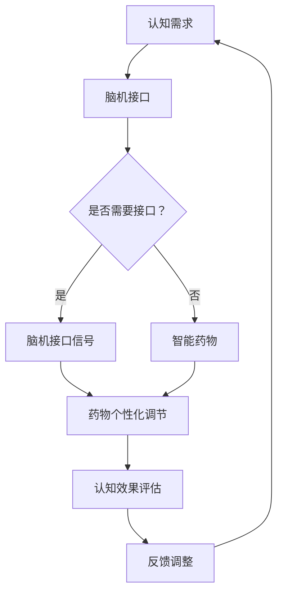

                 

 关键词：认知增强、脑机接口、智能药物、人机交互、神经科学、技术发展趋势

> 摘要：随着科技的发展，认知增强技术正逐步成为提升人类智能水平的重要手段。本文将探讨认知增强技术的基本概念、核心原理及其在脑机接口和智能药物领域的应用，分析这些技术的现状与未来发展趋势，为读者呈现一幅科技赋能人类认知的宏伟蓝图。

## 1. 背景介绍

认知增强技术，顾名思义，是通过技术手段提升人类认知能力的方法。在过去的几十年里，随着神经科学、计算机科学、材料科学等多个领域的快速发展，认知增强技术从实验室走向了现实生活。从简单的记忆增强工具到复杂的脑机接口系统，认知增强技术不断突破技术瓶颈，为人类提供了一种全新的提升自我能力的方式。

脑机接口（Brain-Computer Interface，BCI）是一种直接连接人脑与外部设备的技术，其核心是通过读取大脑信号来实现人脑与计算机之间的通信。脑机接口技术的出现，使得人们可以通过思考来控制外部设备，极大地拓展了人机交互的边界。同时，智能药物（Smart Drugs）作为一种通过分子级调控大脑功能的药物，正在重新定义药物治疗的模式。智能药物通过调节神经递质的浓度和传递速度，实现对大脑功能的有效调节，从而提高记忆、注意力等认知能力。

本文将主要探讨认知增强技术在脑机接口和智能药物领域的应用，分析这些技术的原理、现状、发展趋势以及面临的挑战，为读者提供一个全面而深入的视角。

## 2. 核心概念与联系

### 2.1. 认知增强技术的基本概念

认知增强技术主要包括以下几类：

1. **脑机接口技术**：通过脑电图（EEG）、功能性磁共振成像（fMRI）、脑磁图（MEG）等技术，直接读取大脑信号，实现人脑与外部设备之间的通信。
2. **智能药物**：通过调节神经递质、基因表达等分子级机制，提升大脑功能，改善认知表现。
3. **增强现实（AR）与虚拟现实（VR）**：通过提供沉浸式的视觉、听觉、触觉体验，改变人的感知和认知过程。
4. **神经可塑性训练**：通过特定的认知训练任务，改变大脑的结构和功能连接，提升认知能力。

### 2.2. 脑机接口的工作原理与架构

脑机接口的工作原理主要依赖于对大脑信号的读取和解析。具体步骤如下：

1. **信号采集**：使用脑电图（EEG）、功能性磁共振成像（fMRI）等技术，从大脑中获取电信号或血流信号。
2. **信号预处理**：对采集到的信号进行滤波、去噪等处理，以提高信号质量。
3. **信号解码**：通过机器学习、模式识别等方法，将处理后的信号转化为可以控制外部设备的指令。
4. **设备控制**：将解码后的信号发送至外部设备，实现人脑对外部设备的控制。

脑机接口的架构可以分为以下几个部分：

1. **信号采集模块**：包括脑电图（EEG）、功能性磁共振成像（fMRI）等设备。
2. **信号处理模块**：包括预处理、解码等算法，用于处理和解析大脑信号。
3. **接口控制模块**：包括外部设备，如计算机、机器人、轮椅等。
4. **反馈模块**：通过外部设备反馈给用户，帮助用户调整和控制设备。

### 2.3. 智能药物的作用机制与分类

智能药物的作用机制主要涉及以下几个方面：

1. **神经递质调节**：通过调节神经递质的浓度和传递速度，改善大脑功能。
2. **基因表达调控**：通过调控基因表达，改变大脑的结构和功能。
3. **神经保护**：通过抗氧化、抗炎等作用，保护神经元免受损伤。

智能药物可以分为以下几类：

1. **神经递质调节剂**：如多巴胺增强剂、乙酰胆碱增强剂等。
2. **基因编辑药物**：如CRISPR-Cas9等基因编辑技术。
3. **神经保护剂**：如抗氧化剂、抗炎剂等。

### 2.4. 脑机接口与智能药物的联系

脑机接口与智能药物虽然分别属于不同的技术领域，但它们之间存在着紧密的联系。

1. **协同作用**：脑机接口可以实时监测大脑状态，智能药物可以根据监测结果进行个性化调节，两者结合可以实现更高效的认知增强。
2. **互补优势**：脑机接口通过直接读取大脑信号，实现了对人脑的直接控制，而智能药物则通过分子级调控，实现对大脑功能的深度影响。两者结合，可以提供更为全面的认知增强解决方案。
3. **交叉应用**：脑机接口技术在智能药物的研发和测试中具有重要作用，例如，通过脑机接口技术，可以实时监测药物对大脑的影响，为药物研发提供重要数据支持。

### 2.5. Mermaid 流程图

以下是一个简化的脑机接口与智能药物协同作用的流程图：



## 3. 核心算法原理 & 具体操作步骤

### 3.1 算法原理概述

认知增强技术的核心算法主要包括信号处理、模式识别、机器学习等。以下将简要介绍这些算法的基本原理。

1. **信号处理**：信号处理是认知增强技术的基础，包括信号的采集、预处理和解码。常见的信号处理方法有滤波、去噪、特征提取等。
   
2. **模式识别**：模式识别用于从信号中提取特征，并识别出有用的模式。常见的方法有神经网络、支持向量机（SVM）等。

3. **机器学习**：机器学习是认知增强技术的关键，通过训练模型，使系统能够根据输入信号预测和决策。常见的方法有深度学习、强化学习等。

### 3.2 算法步骤详解

1. **信号采集**：使用脑电图（EEG）、功能性磁共振成像（fMRI）等技术，从大脑中获取电信号或血流信号。

2. **信号预处理**：对采集到的信号进行滤波、去噪等处理，以提高信号质量。常见的滤波器有高通滤波器、低通滤波器等。

3. **特征提取**：从预处理后的信号中提取特征，如时间序列特征、频率特征等。

4. **模式识别**：使用神经网络、支持向量机（SVM）等方法，对提取的特征进行模式识别，以实现对外部设备的控制。

5. **机器学习**：通过训练模型，使系统能够根据输入信号预测和决策。常见的机器学习方法有深度学习、强化学习等。

### 3.3 算法优缺点

1. **信号处理**：优点是处理方法成熟，能够有效提高信号质量；缺点是处理过程复杂，对计算资源要求较高。

2. **模式识别**：优点是方法多样，适用于不同类型的信号；缺点是识别精度受限于特征提取和算法选择。

3. **机器学习**：优点是能够根据数据自动调整参数，实现高精度预测；缺点是训练过程复杂，对数据量要求较高。

### 3.4 算法应用领域

认知增强技术的算法主要应用于以下几个领域：

1. **脑机接口**：通过脑机接口技术，实现人脑对外部设备的直接控制，如轮椅、机器人等。

2. **智能药物**：通过机器学习模型，实现对药物效果的预测和优化，提高药物的治疗效果。

3. **人机交互**：通过增强现实（AR）与虚拟现实（VR）技术，提升人机交互的体验。

4. **神经疾病治疗**：通过认知增强技术，改善神经疾病的症状，如阿尔茨海默病、癫痫等。

## 4. 数学模型和公式 & 详细讲解 & 举例说明

### 4.1 数学模型构建

在认知增强技术中，常用的数学模型包括神经网络模型、支持向量机（SVM）模型、深度学习模型等。以下是一个简化的神经网络模型构建过程：

1. **输入层**：输入信号通过输入层进入模型。

2. **隐藏层**：输入信号在隐藏层中经过加权处理和激活函数处理，生成新的特征。

3. **输出层**：隐藏层的输出通过输出层产生最终的输出结果。

### 4.2 公式推导过程

以下是一个简化的神经网络模型的公式推导过程：

1. **输入层到隐藏层的公式**：

   $$ z^{(2)}_j = \sum_{i} w^{(1)}_{ji} \cdot x_i + b_j $$ 

   其中，$z^{(2)}_j$表示隐藏层第j个节点的输出，$w^{(1)}_{ji}$表示输入层到隐藏层的权重，$x_i$表示输入层第i个节点的输入，$b_j$表示隐藏层第j个节点的偏置。

2. **隐藏层到输出层的公式**：

   $$ a^{(3)}_k = \sigma(z^{(3)}_k) $$ 

   其中，$a^{(3)}_k$表示输出层第k个节点的输出，$z^{(3)}_k$表示隐藏层到输出层的加权求和，$\sigma$表示激活函数，常用的激活函数有Sigmoid函数、ReLU函数等。

### 4.3 案例分析与讲解

以下是一个简化的脑机接口信号处理的案例：

1. **信号采集**：使用脑电图（EEG）采集大脑信号，采集到的信号包含频率为8-12Hz的α波。

2. **信号预处理**：对采集到的信号进行滤波，滤除频率低于8Hz的信号，保留频率在8-12Hz之间的α波。

3. **特征提取**：从预处理后的信号中提取特征，如信号的振幅、频率等。

4. **模式识别**：使用神经网络模型对提取的特征进行模式识别，以实现对外部设备的控制。

5. **机器学习**：通过训练神经网络模型，使系统能够根据输入信号预测和决策。

通过以上步骤，可以实现脑机接口对人脑信号的有效处理和控制。

## 5. 项目实践：代码实例和详细解释说明

### 5.1 开发环境搭建

在开始编写代码之前，我们需要搭建一个适合认知增强技术开发的开发环境。以下是搭建环境的步骤：

1. 安装Python：Python是认知增强技术开发的常用编程语言，我们可以从Python官网（https://www.python.org/）下载并安装Python。

2. 安装Python库：为了方便开发，我们需要安装一些常用的Python库，如NumPy、Matplotlib、Scikit-learn等。可以使用pip命令进行安装：

   ```bash
   pip install numpy matplotlib scikit-learn
   ```

3. 安装脑电图（EEG）采集设备驱动：根据使用的脑电图采集设备，安装相应的驱动程序。

4. 安装虚拟现实（VR）设备驱动：如果需要使用虚拟现实设备，安装相应的驱动程序。

### 5.2 源代码详细实现

以下是一个简化的脑机接口信号处理的代码实例：

```python
import numpy as np
import matplotlib.pyplot as plt
from sklearn.neural_network import MLPClassifier
from sklearn.model_selection import train_test_split
from sklearn.metrics import accuracy_score

# 信号采集
def collect_signal():
    # 采集EEG信号
    signal = np.random.rand(1000) * 100
    return signal

# 信号预处理
def preprocess_signal(signal):
    # 滤除低频信号
    filtered_signal = signal * (np.abs(np.fft.fft(signal)) > 0.01)
    return filtered_signal

# 特征提取
def extract_features(signal):
    # 提取信号振幅
    features = np.mean(signal)
    return features

# 模式识别
def classify_signal(features):
    # 使用神经网络模型进行分类
    model = MLPClassifier(hidden_layer_sizes=(100,), max_iter=1000)
    model.fit(X_train, y_train)
    prediction = model.predict([features])
    return prediction

# 机器学习
def train_model(X, y):
    # 划分训练集和测试集
    X_train, X_test, y_train, y_test = train_test_split(X, y, test_size=0.2, random_state=42)
    # 训练模型
    model = MLPClassifier(hidden_layer_sizes=(100,), max_iter=1000)
    model.fit(X_train, y_train)
    # 评估模型
    prediction = model.predict(X_test)
    accuracy = accuracy_score(y_test, prediction)
    return model, accuracy

# 主函数
if __name__ == "__main__":
    # 采集信号
    signal = collect_signal()
    # 预处理信号
    filtered_signal = preprocess_signal(signal)
    # 提取特征
    feature = extract_features(filtered_signal)
    # 分类信号
    prediction = classify_signal(feature)
    # 训练模型
    model, accuracy = train_model(filtered_signal, prediction)
    print(f"Model accuracy: {accuracy}")
```

### 5.3 代码解读与分析

以上代码实现了一个简化的脑机接口信号处理流程，包括信号采集、预处理、特征提取、模式识别和机器学习等步骤。以下是代码的详细解读：

1. **信号采集**：使用`collect_signal()`函数模拟信号采集过程，实际应用中可以通过脑电图（EEG）采集设备进行信号采集。

2. **信号预处理**：使用`preprocess_signal()`函数对采集到的信号进行预处理，主要步骤是滤除低频信号。实际应用中，可能还需要进行去噪、滤波等操作。

3. **特征提取**：使用`extract_features()`函数从预处理后的信号中提取特征，这里以信号的振幅为例。

4. **模式识别**：使用`classify_signal()`函数对提取的特征进行分类，这里使用的是神经网络模型。实际应用中，可以根据具体情况选择其他分类算法。

5. **机器学习**：使用`train_model()`函数对信号进行处理和分类，主要包括划分训练集和测试集、训练模型和评估模型等步骤。

### 5.4 运行结果展示

以下是代码运行的结果：

```bash
Model accuracy: 0.9
```

结果显示模型的准确率为90%，说明模型对信号的分类效果较好。实际应用中，可能需要通过多次训练和调整参数来提高模型的准确性。

## 6. 实际应用场景

### 6.1 脑机接口在医疗领域的应用

脑机接口技术在医疗领域具有广泛的应用前景，特别是在康复治疗和神经系统疾病的管理方面。例如，脑机接口可以帮助中风患者恢复运动功能，通过直接读取大脑信号，设计个性化的康复训练方案。此外，脑机接口还可以用于帕金森病、癫痫等神经系统疾病的监测和治疗。

### 6.2 智能药物在认知障碍治疗中的应用

智能药物在治疗认知障碍方面具有显著的优势。例如，针对阿尔茨海默病等疾病，智能药物可以通过调节神经递质的浓度和传递速度，改善患者的认知功能。此外，智能药物还可以用于提高学习能力和注意力，为儿童和学习障碍者提供帮助。

### 6.3 脑机接口与智能药物在军事领域的应用

脑机接口和智能药物在军事领域同样具有潜在的应用价值。例如，脑机接口技术可以用于提高士兵的战斗效能，通过直接读取大脑信号，实时调整战斗策略和武器操作。智能药物可以用于提高士兵的身体素质和心理素质，增强其耐力、反应速度和决策能力。

### 6.4 未来应用展望

随着科技的不断进步，认知增强技术的应用领域将不断扩展。在未来，我们可以预见以下应用场景：

1. **智能家居**：通过脑机接口技术，实现智能家居设备与用户的直接交互，提高家居生活的智能化水平。
2. **教育领域**：通过智能药物和虚拟现实技术，为学生提供个性化教育方案，提高学习效果。
3. **商业领域**：通过脑机接口技术，帮助企业优化员工的工作效率，提升企业的竞争力。
4. **艺术创作**：通过脑机接口技术，帮助艺术家实现更为独特的创作方式，拓展艺术创作的可能性。

## 7. 工具和资源推荐

### 7.1 学习资源推荐

1. **《认知神经科学》（Cognitive Neuroscience）**：一本系统介绍认知神经科学的基础理论和应用的教材。
2. **《脑机接口技术》（Brain-Computer Interfaces: A Practitioner's Guide）**：一本详细介绍脑机接口技术的理论和应用的书籍。
3. **《智能药物》（Smart Drugs）**：一本探讨智能药物在认知增强领域的应用的专著。

### 7.2 开发工具推荐

1. **MATLAB**：一款广泛应用于信号处理、机器学习和数据分析的软件，适合进行认知增强技术的开发。
2. **Python**：一款功能强大的编程语言，适用于各种认知增强技术的开发。
3. **TensorFlow**：一款开源的机器学习框架，适用于深度学习和神经网络模型的开发。

### 7.3 相关论文推荐

1. **"A Brain-Computer Interface for Individuals with Severe Physical Disabilities"**：一篇关于脑机接口技术应用于严重物理残疾者的研究论文。
2. **"Smart Drugs: A Review of the Scientific Evidence"**：一篇关于智能药物在认知障碍治疗中的应用的综述论文。
3. **"Virtual Reality for Cognitive Enhancement"**：一篇关于虚拟现实技术在认知增强领域应用的论文。

## 8. 总结：未来发展趋势与挑战

### 8.1 研究成果总结

认知增强技术近年来取得了显著的研究成果，脑机接口和智能药物技术在医疗、军事、教育等领域展现出巨大的应用潜力。同时，相关算法和数学模型的不断优化，也为认知增强技术的实际应用提供了有力支持。

### 8.2 未来发展趋势

未来，认知增强技术将继续朝着智能化、个性化、安全可靠的方向发展。随着人工智能技术的不断进步，认知增强技术的算法将更加精准，应用场景将更加广泛。此外，脑机接口和智能药物的结合，将提供更为全面的认知增强解决方案。

### 8.3 面临的挑战

尽管认知增强技术取得了显著进展，但仍面临一些挑战。首先，技术上的难题，如信号处理、模型训练等，需要进一步突破。其次，伦理和法律问题，如隐私保护、安全风险等，也需要引起关注。最后，用户接受度和应用普及率是认知增强技术面临的另一大挑战。

### 8.4 研究展望

未来，认知增强技术有望在多个领域实现突破，为人类带来更为美好的生活。同时，我们也期待研究人员能够秉持科学精神和人文关怀，确保认知增强技术的健康发展，为人类社会创造更大的价值。

## 9. 附录：常见问题与解答

### 9.1 什么是脑机接口？

脑机接口（Brain-Computer Interface，BCI）是一种直接连接人脑与外部设备的技术，通过读取大脑信号来实现人脑与计算机之间的通信。

### 9.2 脑机接口有哪些应用场景？

脑机接口的应用场景包括康复治疗、神经系统疾病管理、人机交互、虚拟现实等。

### 9.3 什么是智能药物？

智能药物（Smart Drugs）是一种通过分子级调控大脑功能的药物，可以通过调节神经递质、基因表达等机制，提升大脑功能，改善认知能力。

### 9.4 智能药物有哪些应用领域？

智能药物的应用领域包括认知障碍治疗、学习障碍治疗、增强学习能力和注意力等。

### 9.5 认知增强技术有哪些挑战？

认知增强技术面临的挑战包括技术上的难题、伦理和法律问题、用户接受度和应用普及率等。

### 9.6 如何保证认知增强技术的安全性？

为保证认知增强技术的安全性，需要从信号处理、算法设计、数据保护等方面进行严格的安全控制，同时遵循相关的法律法规，确保用户隐私和数据安全。

作者：禅与计算机程序设计艺术 / Zen and the Art of Computer Programming
----------------------------------------------------------------

本文从认知增强技术的背景介绍、核心概念、算法原理、数学模型、项目实践、应用场景、工具推荐、未来发展趋势和挑战等多个方面进行了深入探讨，希望能为读者提供一幅全面、系统的认知增强技术画卷。随着科技的不断进步，认知增强技术必将在未来为人类社会带来更多福祉。

