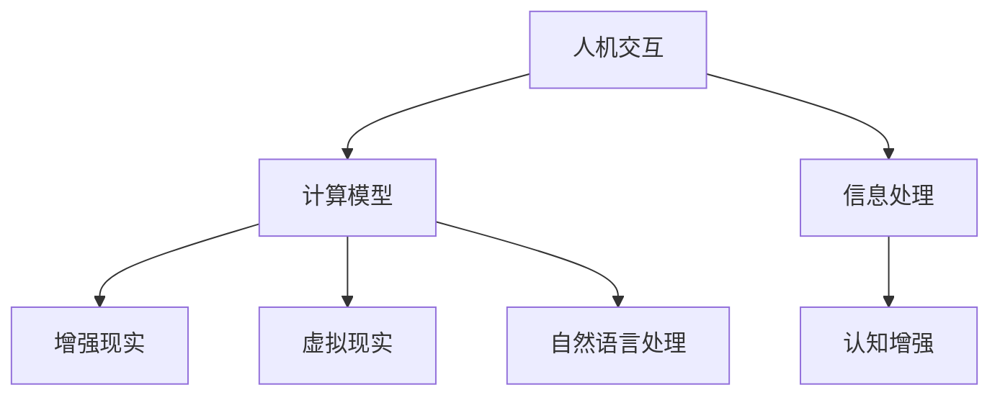

                 

关键词：认知增强、人工智能、人机交互、神经科学、计算模型、增强现实、虚拟现实、自然语言处理

> 摘要：随着人工智能技术的飞速发展，认知增强技术逐渐成为拓展人类智能的新前沿。本文将探讨认知增强技术的核心概念、原理、算法、数学模型以及其实际应用，旨在为读者提供一个全面的理解和应用指南。

## 1. 背景介绍

### 1.1 认知增强技术的起源

认知增强技术起源于对人类认知能力的深入研究。自20世纪80年代以来，神经科学和认知心理学领域取得了显著进展，使得我们对大脑和认知机制的理解更加深入。这一时期，研究者开始思考如何通过技术手段来增强人类的认知能力。

### 1.2 人工智能的发展与应用

随着人工智能技术的快速发展，特别是深度学习和神经网络的应用，我们开始能够实现一些以前难以想象的认知增强功能。人工智能不仅帮助人类处理复杂的数据和分析问题，还能通过模拟和扩展人类思维过程来提高认知能力。

### 1.3 认知增强技术的需求

在当今信息爆炸的时代，人类面临着巨大的认知负担。信息过载、决策困难、记忆负担等问题日益突出。因此，认知增强技术成为解决这些问题的重要手段。通过技术手段来增强人类的认知能力，可以提高工作效率、提升决策质量、减轻心理压力。

## 2. 核心概念与联系

### 2.1 认知增强技术的核心概念

认知增强技术涉及多个领域，包括神经科学、人工智能、计算机科学和心理学。其核心概念包括：

- **人机交互**：研究如何设计用户界面，使得人类与计算机系统能够自然、高效地进行交互。
- **计算模型**：构建数学模型来模拟人类的认知过程，如记忆、学习、推理等。
- **增强现实（AR）与虚拟现实（VR）**：利用计算机技术创建虚拟环境，增强人类的感知体验和认知能力。
- **自然语言处理（NLP）**：研究如何使计算机理解和生成人类语言，以实现人机对话和智能搜索。

### 2.2 核心概念原理和架构的 Mermaid 流程图



## 3. 核心算法原理 & 具体操作步骤

### 3.1 算法原理概述

认知增强技术依赖于多种算法原理，包括：

- **神经网络**：模拟大脑神经元的工作方式，用于图像识别、语音识别等。
- **机器学习**：通过训练数据集，使计算机系统学会特定任务，如分类、预测等。
- **深度学习**：一种复杂的神经网络架构，可以处理大量数据并提取特征。

### 3.2 算法步骤详解

认知增强技术的基本步骤包括：

1. **数据采集**：收集与特定认知任务相关的数据。
2. **预处理**：对采集到的数据进行清洗、标准化和特征提取。
3. **模型训练**：使用预处理后的数据训练认知增强模型。
4. **模型评估**：通过测试数据集评估模型的性能。
5. **部署与应用**：将训练好的模型部署到实际应用中，如增强现实眼镜、智能助手等。

### 3.3 算法优缺点

- **优点**：能够显著提高人类的认知能力，减轻认知负担，提高工作效率。
- **缺点**：依赖于大量数据和计算资源，存在隐私和安全问题。

### 3.4 算法应用领域

认知增强技术广泛应用于以下领域：

- **医疗健康**：辅助医生进行诊断、治疗和康复。
- **教育**：个性化教学、智能评估和辅助学习。
- **工业制造**：智能监控、自动化操作和远程维护。
- **军事**：情报分析、决策支持和作战模拟。

## 4. 数学模型和公式 & 详细讲解 & 举例说明

### 4.1 数学模型构建

认知增强技术的数学模型通常包括：

- **线性模型**：用于简单数据拟合和预测。
- **非线性模型**：如神经网络，用于复杂特征提取和分类。

### 4.2 公式推导过程

以神经网络为例，其基本公式包括：

- **激活函数**：$f(x) = \sigma(x) = \frac{1}{1 + e^{-x}}$
- **权重更新**：$w_{new} = w_{old} - \alpha \cdot \nabla W$

### 4.3 案例分析与讲解

### 4.3.1 图像识别案例

使用卷积神经网络（CNN）进行图像识别的案例：

1. **数据采集**：收集大量带标签的图像数据。
2. **预处理**：对图像进行缩放、裁剪和归一化。
3. **模型训练**：使用预处理后的数据训练CNN模型。
4. **模型评估**：通过测试数据集评估模型的性能。

## 5. 项目实践：代码实例和详细解释说明

### 5.1 开发环境搭建

搭建一个用于图像识别的CNN模型所需的环境包括：

- **Python**：编程语言
- **TensorFlow**：深度学习框架
- **Keras**：高级神经网络API

### 5.2 源代码详细实现

以下是一个简单的CNN模型实现示例：

```python
import tensorflow as tf
from tensorflow.keras import layers

model = tf.keras.Sequential([
    layers.Conv2D(32, (3, 3), activation='relu', input_shape=(28, 28, 1)),
    layers.MaxPooling2D((2, 2)),
    layers.Conv2D(64, (3, 3), activation='relu'),
    layers.MaxPooling2D((2, 2)),
    layers.Conv2D(64, (3, 3), activation='relu'),
    layers.Flatten(),
    layers.Dense(64, activation='relu'),
    layers.Dense(10, activation='softmax')
])

model.compile(optimizer='adam',
              loss='categorical_crossentropy',
              metrics=['accuracy'])

model.fit(x_train, y_train, epochs=10, validation_data=(x_test, y_test))
```

### 5.3 代码解读与分析

上述代码实现了一个简单的CNN模型，用于MNIST手写数字识别任务。其中：

- **Conv2D**：用于卷积操作，提取图像特征。
- **MaxPooling2D**：用于池化操作，降低模型复杂度。
- **Flatten**：用于将多维数据展平为一维。
- **Dense**：用于全连接层，进行分类预测。

### 5.4 运行结果展示

训练完成后，可以使用测试数据集评估模型的性能：

```python
test_loss, test_acc = model.evaluate(x_test,  y_test, verbose=2)
print('\nTest accuracy:', test_acc)
```

## 6. 实际应用场景

### 6.1 医疗健康

认知增强技术在医疗健康领域的应用包括：

- **诊断支持**：利用深度学习模型辅助医生进行疾病诊断。
- **康复训练**：通过虚拟现实技术进行康复训练，如运动康复、认知康复等。

### 6.2 教育

在教育领域，认知增强技术可以提供：

- **个性化学习**：根据学生的学习情况，提供个性化的教学建议。
- **智能评测**：通过自然语言处理技术，对学生的作业进行智能评测。

### 6.3 工业制造

在工业制造领域，认知增强技术可以用于：

- **智能监控**：实时监控生产线，预测潜在故障。
- **远程维护**：利用增强现实技术，实现远程技术支持和维修。

### 6.4 未来应用展望

未来，认知增强技术将在更多领域得到应用，如：

- **智能家居**：通过人机交互，实现智能家居的智能控制。
- **城市规划**：利用虚拟现实技术，进行城市规划与模拟。

## 7. 工具和资源推荐

### 7.1 学习资源推荐

- **书籍**：《深度学习》、《神经网络与深度学习》
- **在线课程**：Coursera、edX上的相关课程
- **论文**：检索顶级会议和期刊的相关论文

### 7.2 开发工具推荐

- **深度学习框架**：TensorFlow、PyTorch、Keras
- **版本控制**：Git、GitHub
- **编程语言**：Python、R

### 7.3 相关论文推荐

- **《A Theoretical Analysis of the Causal Uncertainty Principle》**
- **《Deep Learning for Causal Discovery》**
- **《A Framework for Compositional Generalization》**

## 8. 总结：未来发展趋势与挑战

### 8.1 研究成果总结

认知增强技术在过去几年取得了显著进展，特别是在图像识别、语音识别和自然语言处理等领域。未来，随着计算能力的提升和算法的优化，认知增强技术将在更多领域得到应用。

### 8.2 未来发展趋势

- **跨学科融合**：认知增强技术将与其他领域（如神经科学、心理学）深度融合。
- **个性化应用**：根据用户需求，提供定制化的认知增强解决方案。

### 8.3 面临的挑战

- **隐私与安全**：如何确保用户隐私和数据安全。
- **计算资源**：如何高效利用有限的计算资源。

### 8.4 研究展望

未来，认知增强技术将在以下几个方面展开研究：

- **认知神经科学**：深入研究人类认知过程，为认知增强技术提供理论支持。
- **跨学科应用**：探索认知增强技术在教育、医疗、工业等领域的应用。

## 9. 附录：常见问题与解答

### 9.1 什么是认知增强技术？

认知增强技术是指利用计算机技术和算法，提高人类认知能力的技术。

### 9.2 认知增强技术有哪些应用领域？

认知增强技术广泛应用于医疗健康、教育、工业制造、智能家居等领域。

### 9.3 认知增强技术有哪些挑战？

认知增强技术面临的挑战包括隐私与安全、计算资源等方面。

## 作者署名

作者：禅与计算机程序设计艺术 / Zen and the Art of Computer Programming
```markdown
# 认知增强技术：扩展人类智能的新前沿

## 关键词
认知增强、人工智能、人机交互、神经科学、计算模型、增强现实、虚拟现实、自然语言处理

## 摘要
随着人工智能技术的飞速发展，认知增强技术逐渐成为拓展人类智能的新前沿。本文将探讨认知增强技术的核心概念、原理、算法、数学模型以及其实际应用，旨在为读者提供一个全面的理解和应用指南。

## 1. 背景介绍

### 1.1 认知增强技术的起源
认知增强技术起源于对人类认知能力的深入研究。自20世纪80年代以来，神经科学和认知心理学领域取得了显著进展，使得我们对大脑和认知机制的理解更加深入。这一时期，研究者开始思考如何通过技术手段来增强人类的认知能力。

### 1.2 人工智能的发展与应用
随着人工智能技术的快速发展，特别是深度学习和神经网络的应用，我们开始能够实现一些以前难以想象的认知增强功能。人工智能不仅帮助人类处理复杂的数据和分析问题，还能通过模拟和扩展人类思维过程来提高认知能力。

### 1.3 认知增强技术的需求
在当今信息爆炸的时代，人类面临着巨大的认知负担。信息过载、决策困难、记忆负担等问题日益突出。因此，认知增强技术成为解决这些问题的重要手段。通过技术手段来增强人类的认知能力，可以提高工作效率、提升决策质量、减轻心理压力。

## 2. 核心概念与联系

### 2.1 认知增强技术的核心概念
认知增强技术涉及多个领域，包括神经科学、人工智能、计算机科学和心理学。其核心概念包括：
- **人机交互**：研究如何设计用户界面，使得人类与计算机系统能够自然、高效地进行交互。
- **计算模型**：构建数学模型来模拟人类的认知过程，如记忆、学习、推理等。
- **增强现实（AR）与虚拟现实（VR）**：利用计算机技术创建虚拟环境，增强人类的感知体验和认知能力。
- **自然语言处理（NLP）**：研究如何使计算机理解和生成人类语言，以实现人机对话和智能搜索。

### 2.2 核心概念原理和架构的 Mermaid 流程图


## 3. 核心算法原理 & 具体操作步骤

### 3.1 算法原理概述
认知增强技术依赖于多种算法原理，包括：
- **神经网络**：模拟大脑神经元的工作方式，用于图像识别、语音识别等。
- **机器学习**：通过训练数据集，使计算机系统学会特定任务，如分类、预测等。
- **深度学习**：一种复杂的神经网络架构，可以处理大量数据并提取特征。

### 3.2 算法步骤详解
认知增强技术的基本步骤包括：
1. **数据采集**：收集与特定认知任务相关的数据。
2. **预处理**：对采集到的数据进行清洗、标准化和特征提取。
3. **模型训练**：使用预处理后的数据训练认知增强模型。
4. **模型评估**：通过测试数据集评估模型的性能。
5. **部署与应用**：将训练好的模型部署到实际应用中，如增强现实眼镜、智能助手等。

### 3.3 算法优缺点
- **优点**：能够显著提高人类的认知能力，减轻认知负担，提高工作效率。
- **缺点**：依赖于大量数据和计算资源，存在隐私和安全问题。

### 3.4 算法应用领域
认知增强技术广泛应用于以下领域：
- **医疗健康**：辅助医生进行诊断、治疗和康复。
- **教育**：个性化教学、智能评估和辅助学习。
- **工业制造**：智能监控、自动化操作和远程维护。
- **军事**：情报分析、决策支持和作战模拟。

## 4. 数学模型和公式 & 详细讲解 & 举例说明

### 4.1 数学模型构建
认知增强技术的数学模型通常包括：
- **线性模型**：用于简单数据拟合和预测。
- **非线性模型**：如神经网络，用于复杂特征提取和分类。

### 4.2 公式推导过程
以神经网络为例，其基本公式包括：
- **激活函数**：\( f(x) = \sigma(x) = \frac{1}{1 + e^{-x}} \)
- **权重更新**：\( w_{new} = w_{old} - \alpha \cdot \nabla W \)

### 4.3 案例分析与讲解
### 4.3.1 图像识别案例
使用卷积神经网络（CNN）进行图像识别的案例：
1. **数据采集**：收集大量带标签的图像数据。
2. **预处理**：对图像进行缩放、裁剪和归一化。
3. **模型训练**：使用预处理后的数据训练CNN模型。
4. **模型评估**：通过测试数据集评估模型的性能。

## 5. 项目实践：代码实例和详细解释说明

### 5.1 开发环境搭建
搭建一个用于图像识别的CNN模型所需的环境包括：
- **Python**：编程语言
- **TensorFlow**：深度学习框架
- **Keras**：高级神经网络API

### 5.2 源代码详细实现
以下是一个简单的CNN模型实现示例：

```python
import tensorflow as tf
from tensorflow.keras import layers

model = tf.keras.Sequential([
    layers.Conv2D(32, (3, 3), activation='relu', input_shape=(28, 28, 1)),
    layers.MaxPooling2D((2, 2)),
    layers.Conv2D(64, (3, 3), activation='relu'),
    layers.MaxPooling2D((2, 2)),
    layers.Conv2D(64, (3, 3), activation='relu'),
    layers.Flatten(),
    layers.Dense(64, activation='relu'),
    layers.Dense(10, activation='softmax')
])

model.compile(optimizer='adam',
              loss='categorical_crossentropy',
              metrics=['accuracy'])

model.fit(x_train, y_train, epochs=10, validation_data=(x_test, y_test))
```

### 5.3 代码解读与分析
上述代码实现了一个简单的CNN模型，用于MNIST手写数字识别任务。其中：
- **Conv2D**：用于卷积操作，提取图像特征。
- **MaxPooling2D**：用于池化操作，降低模型复杂度。
- **Flatten**：用于将多维数据展平为一维。
- **Dense**：用于全连接层，进行分类预测。

### 5.4 运行结果展示
训练完成后，可以使用测试数据集评估模型的性能：

```python
test_loss, test_acc = model.evaluate(x_test,  y_test, verbose=2)
print('\nTest accuracy:', test_acc)
```

## 6. 实际应用场景

### 6.1 医疗健康
认知增强技术在医疗健康领域的应用包括：
- **诊断支持**：利用深度学习模型辅助医生进行疾病诊断。
- **康复训练**：通过虚拟现实技术进行康复训练，如运动康复、认知康复等。

### 6.2 教育
在教育领域，认知增强技术可以提供：
- **个性化学习**：根据学生的学习情况，提供个性化的教学建议。
- **智能评测**：通过自然语言处理技术，对学生的作业进行智能评测。

### 6.3 工业制造
在工业制造领域，认知增强技术可以用于：
- **智能监控**：实时监控生产线，预测潜在故障。
- **远程维护**：利用增强现实技术，实现远程技术支持和维修。

### 6.4 未来应用展望
未来，认知增强技术将在更多领域得到应用，如：
- **智能家居**：通过人机交互，实现智能家居的智能控制。
- **城市规划**：利用虚拟现实技术，进行城市规划与模拟。

## 7. 工具和资源推荐

### 7.1 学习资源推荐
- **书籍**：《深度学习》、《神经网络与深度学习》
- **在线课程**：Coursera、edX上的相关课程
- **论文**：检索顶级会议和期刊的相关论文

### 7.2 开发工具推荐
- **深度学习框架**：TensorFlow、PyTorch、Keras
- **版本控制**：Git、GitHub
- **编程语言**：Python、R

### 7.3 相关论文推荐
- **《A Theoretical Analysis of the Causal Uncertainty Principle》**
- **《Deep Learning for Causal Discovery》**
- **《A Framework for Compositional Generalization》**

## 8. 总结：未来发展趋势与挑战

### 8.1 研究成果总结
认知增强技术在过去几年取得了显著进展，特别是在图像识别、语音识别和自然语言处理等领域。未来，随着计算能力的提升和算法的优化，认知增强技术将在更多领域得到应用。

### 8.2 未来发展趋势
- **跨学科融合**：认知增强技术将与其他领域（如神经科学、心理学）深度融合。
- **个性化应用**：根据用户需求，提供定制化的认知增强解决方案。

### 8.3 面临的挑战
- **隐私与安全**：如何确保用户隐私和数据安全。
- **计算资源**：如何高效利用有限的计算资源。

### 8.4 研究展望
未来，认知增强技术将在以下几个方面展开研究：
- **认知神经科学**：深入研究人类认知过程，为认知增强技术提供理论支持。
- **跨学科应用**：探索认知增强技术在教育、医疗、工业等领域的应用。

## 9. 附录：常见问题与解答

### 9.1 什么是认知增强技术？
认知增强技术是指利用计算机技术和算法，提高人类认知能力的技术。

### 9.2 认知增强技术有哪些应用领域？
认知增强技术广泛应用于医疗健康、教育、工业制造、智能家居等领域。

### 9.3 认知增强技术有哪些挑战？
认知增强技术面临的挑战包括隐私与安全、计算资源等方面。

## 作者署名
作者：禅与计算机程序设计艺术 / Zen and the Art of Computer Programming
```

