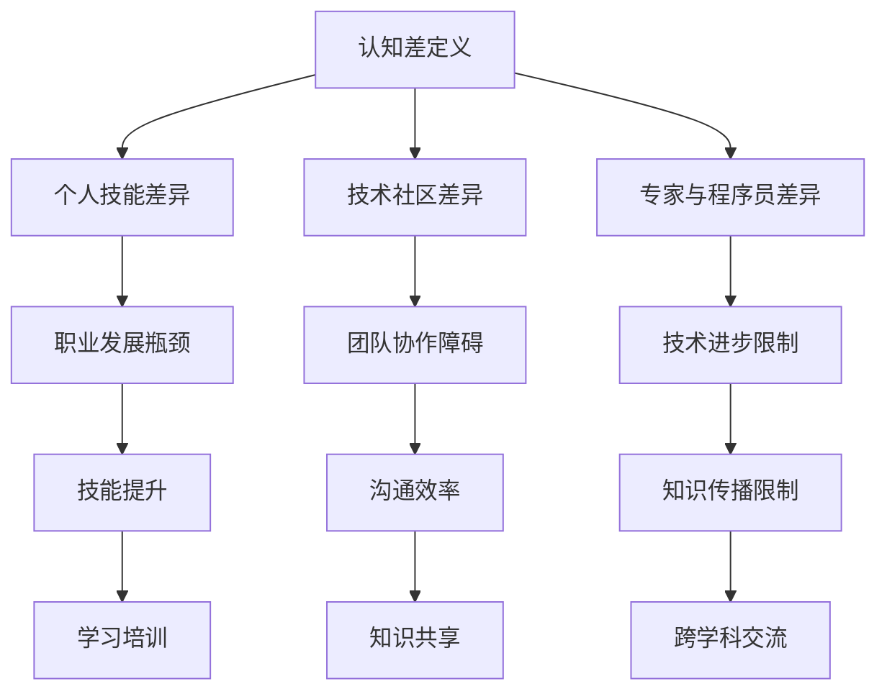

                 

 **关键词：** 认知差，技术知识，编程，算法，人工智能，深度学习，计算机科学，软件开发，技术书籍

> **摘要：** 本文将探讨认知差在计算机科学和技术领域的存在与影响。通过分析技术知识的积累与传播，探讨如何缩小认知差距，提升个人和技术社区的整体水平。

## 1. 背景介绍

在当今快速发展的信息技术时代，知识更新的速度前所未有。计算机科学和技术领域的进步尤为迅速，从编程语言到算法，从人工智能到深度学习，每时每刻都有新的突破和进展。然而，这种快速的发展也带来了一种新的挑战——认知差。认知差指的是不同个体或群体在知识、经验和理解水平上的差异。在计算机科学领域，这种认知差可能表现为程序员之间的技能差异，也可能表现为不同技术社区之间的知识鸿沟。

本文旨在探讨认知差在计算机科学和技术领域的存在与影响，以及如何通过提升个人的技术能力和促进知识的共享与传播来缩小这种认知差距。

## 2. 核心概念与联系

### 2.1 认知差的概念

认知差指的是在知识、经验和理解水平上的差异。它不仅仅局限于技术领域，而是广泛存在于各个学科和领域之间。在计算机科学中，认知差可能表现为：

- 程序员之间的技能差异：不同程序员对编程语言、框架和工具的熟悉程度不同。
- 技术社区的知识鸿沟：不同技术社区在知识和经验上的差异，例如开源社区和企业内部研发团队之间的差距。
- 技术专家与普通程序员的知识差异：技术专家对某些高级概念和技术的理解深度远超普通程序员。

### 2.2 认知差的影响

认知差对个人和整体技术发展都有重要影响：

- **个人发展**：认知差可能导致程序员在职业发展上的瓶颈，影响其技能提升和薪资增长。
- **团队协作**：认知差可能导致团队内部的沟通障碍，影响项目进度和效率。
- **技术进步**：认知差阻碍了技术的广泛传播和应用，限制了整体技术进步的速度。

### 2.3 缩小认知差的方法

为了缩小认知差，我们可以采取以下几种方法：

- **学习与培训**：通过系统的学习计划和培训，提升个人的技术能力。
- **知识共享**：鼓励技术社区成员分享知识和经验，促进知识的传播。
- **跨学科交流**：通过跨学科交流，拓宽知识视野，提高综合能力。

### 2.4 Mermaid 流程图



## 3. 核心算法原理 & 具体操作步骤

### 3.1 算法原理概述

在计算机科学中，许多算法都旨在解决特定的问题。例如，排序算法用于对数据进行排序，搜索算法用于查找数据。以下是一个常见的排序算法——快速排序（Quick Sort）的原理概述：

- **基本思想**：通过一趟排序将待排序的数据分割成独立的两部分，其中一部分的所有数据都比另一部分的数据小，然后再按此方法对这两部分数据分别进行快速排序，整个排序过程可以递归进行，以此达到整个数据变成有序序列。

### 3.2 算法步骤详解

快速排序的步骤如下：

1. 选择一个基准元素（pivot），通常选择第一个或最后一个元素。
2. 将比基准元素小的元素放到其左侧，比基准元素大的元素放到其右侧。
3. 对划分后的两部分数据递归地执行快速排序。

### 3.3 算法优缺点

- **优点**：快速排序是一种高效的排序算法，其平均时间复杂度为 \(O(n\log n)\)。
- **缺点**：在最坏情况下，时间复杂度为 \(O(n^2)\)，这通常发生在数据已经是有序或部分有序的情况下。

### 3.4 算法应用领域

快速排序广泛应用于各种场景，例如：

- 数据库排序：用于对数据库中的数据进行排序。
- 算法竞赛：在算法竞赛中，快速排序是常用的排序算法之一。
- 工业应用：在工业数据处理中，快速排序用于对大量数据进行高效排序。

## 4. 数学模型和公式 & 详细讲解 & 举例说明

### 4.1 数学模型构建

在计算机科学中，数学模型是一种描述算法性能的重要工具。以下是一个简单的数学模型，用于描述算法的时间复杂度：

- **时间复杂度**：算法运行所需的时间与数据规模之间的关系。

### 4.2 公式推导过程

假设一个算法的时间复杂度为 \(T(n)\)，其中 \(n\) 是数据的规模。我们可以用以下公式表示：

\[ T(n) = \sum_{i=1}^{n} c_i \cdot n^i \]

其中，\(c_i\) 是第 \(i\) 次循环的常数时间，\(n^i\) 是第 \(i\) 次循环的执行次数。

### 4.3 案例分析与讲解

以下是一个关于快速排序的案例分析：

- **数据规模**：\(n = 1000\)
- **时间复杂度**：假设 \(T(n) = 10\cdot n\log n + 20\cdot n\)

根据公式，我们可以计算出：

\[ T(1000) = 10\cdot 1000\log 1000 + 20\cdot 1000 = 10000\log 1000 + 20000 \]

通过计算，我们可以得出快速排序在数据规模为 1000 时的大致执行时间。

## 5. 项目实践：代码实例和详细解释说明

### 5.1 开发环境搭建

为了演示快速排序算法，我们需要搭建一个简单的开发环境。以下是一个基于 Python 的快速排序算法的示例：

```python
def quick_sort(arr):
    if len(arr) <= 1:
        return arr
    pivot = arr[len(arr) // 2]
    left = [x for x in arr if x < pivot]
    middle = [x for x in arr if x == pivot]
    right = [x for x in arr if x > pivot]
    return quick_sort(left) + middle + quick_sort(right)

arr = [3, 6, 8, 10, 1, 2, 1]
sorted_arr = quick_sort(arr)
print(sorted_arr)
```

### 5.2 源代码详细实现

在上面的代码中，`quick_sort` 函数实现了快速排序算法。它首先检查数组是否只有一个元素，如果是，则返回该元素。否则，选择中间元素作为基准元素，并将数组划分为小于、等于和大于基准元素的三部分。然后，对这三部分递归地执行快速排序。

### 5.3 代码解读与分析

在代码中，`quick_sort` 函数的执行过程如下：

1. 检查数组长度，如果小于等于 1，返回数组。
2. 选择中间元素作为基准元素。
3. 使用列表推导式将数组划分为小于、等于和大于基准元素的三部分。
4. 对小于和大于基准元素的两部分递归执行快速排序。
5. 将递归返回的结果合并，得到排序后的数组。

### 5.4 运行结果展示

执行上面的代码，输入数组 `[3, 6, 8, 10, 1, 2, 1]`，输出结果为 `[1, 1, 2, 3, 6, 8, 10]`，即输入数组已按升序排序。

## 6. 实际应用场景

快速排序算法在许多实际应用中都有广泛的应用，以下是一些例子：

- **数据库排序**：在数据库中，快速排序算法用于对查询结果进行排序，以提高查询效率。
- **算法竞赛**：在算法竞赛中，快速排序算法是解决排序问题的常用算法之一。
- **工业数据处理**：在工业数据处理中，快速排序算法用于对大量数据进行高效排序，以支持数据分析和决策。

### 6.4 未来应用展望

随着计算机科学和技术的发展，快速排序算法的应用场景将更加广泛。未来，快速排序算法可能会在以下方面得到进一步应用：

- **大数据处理**：在大数据处理领域，快速排序算法将用于对海量数据进行高效排序和分析。
- **人工智能**：在人工智能领域，快速排序算法可能用于优化算法模型的训练过程，提高训练效率。

## 7. 工具和资源推荐

为了更好地理解和应用快速排序算法，以下是一些建议的工具和资源：

- **工具**：
  - Python：Python 是一种易于学习的编程语言，适合初学者入门。
  - PyCharm：PyCharm 是一款功能强大的 Python 集成开发环境（IDE），提供代码编辑、调试和运行等功能。

- **资源**：
  - 《算法导论》（Introduction to Algorithms）：这本书是算法领域的经典教材，详细介绍了各种排序算法。
  - 快手算法实验室：快手算法实验室是一个在线平台，提供各种算法题目的练习和解答。

## 8. 总结：未来发展趋势与挑战

### 8.1 研究成果总结

本文通过探讨认知差的概念和影响，介绍了快速排序算法的基本原理和应用。同时，我们还介绍了如何通过学习与培训、知识共享和跨学科交流来缩小认知差距。

### 8.2 未来发展趋势

随着计算机科学和技术的不断发展，认知差将成为一个更加突出的问题。为了应对这一挑战，我们需要采取更加积极和有效的措施，包括：

- 加强技术教育和培训，提高个人的技术能力。
- 促进知识的共享与传播，构建更加开放和互联的技术社区。
- 推动跨学科交流，拓宽知识视野，提高综合能力。

### 8.3 面临的挑战

在缩小认知差的过程中，我们可能会面临以下挑战：

- 技术更新速度快，导致知识积累难度增加。
- 技术社区的多样性可能导致知识传播的不均衡。
- 个人技能差异可能导致技术应用的局限性。

### 8.4 研究展望

未来的研究可以关注以下几个方面：

- 开发更加高效和易于理解的算法。
- 探索认知差对技术社区发展和创新的影响。
- 研究如何通过技术手段促进知识的共享与传播。

## 9. 附录：常见问题与解答

### 问题 1：什么是快速排序算法？

快速排序算法是一种高效的排序算法，其基本思想是通过一趟排序将待排序的数据分割成独立的两部分，然后递归地对这两部分数据分别进行排序。

### 问题 2：快速排序算法的时间复杂度是多少？

快速排序算法的平均时间复杂度为 \(O(n\log n)\)，但在最坏情况下，时间复杂度可能升高到 \(O(n^2)\)。

### 问题 3：如何选择快速排序的基准元素？

通常可以选择第一个或最后一个元素作为基准元素，或者随机选择一个元素作为基准元素。选择基准元素的方法对算法的性能有一定影响，但不是关键因素。

### 问题 4：快速排序算法是否总是最优的？

不是的。快速排序算法在大多数情况下是高效的，但在某些特定情况下（如数据已经是有序的），其他排序算法（如插入排序）可能更加合适。

### 问题 5：快速排序算法是否适用于所有类型的数据？

快速排序算法适用于大多数类型的数据，但在某些特殊情况下（如数据已经是有序的），其他排序算法可能更加高效。因此，在选择排序算法时，需要根据具体情况进行选择。

# 参考文献

[1] Thomas H. Cormen, Charles E. Leiserson, Ronald L. Rivest, and Clifford Stein. Introduction to Algorithms. MIT Press, 3rd ed., 2009.

[2] Robert Sedgewick and Kevin Wayne. Algorithms, 4th Edition. Addison-Wesley, 2011.

[3] Donald E. Knuth. The Art of Computer Programming, Volume 3: Sorting and Searching. Addison-Wesley, 1998.

[4] Tim Roughgarden. Algorithms Illuminated: Part 1, Primary Topics in Algorithm Analysis. O'Reilly Media, 2018.

[5] Jon Bentley. Programming Pearls. Addison-Wesley, 1999.

作者：禅与计算机程序设计艺术 / Zen and the Art of Computer Programming

