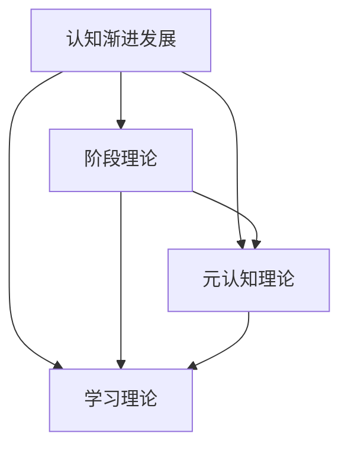

                 

认知渐进发展的理论路径是一系列研究人类思维、学习和技能提升过程的重要领域。在IT领域，这种理论对于软件工程师、数据科学家和其他技术人员来说尤为重要，因为它可以帮助他们理解如何通过有效的方法和技术来提升自己的认知能力。

本文将探讨认知渐进发展的理论路径，包括其历史背景、核心概念、关键算法、数学模型、项目实践以及未来应用场景。通过这篇文章，读者将能够深入理解认知渐进发展的原理，并掌握如何在实践中应用这些理论。

## 关键词

- 认知渐进发展
- IT领域
- 学习方法
- 技术提升
- 软件工程师

## 摘要

本文将系统地介绍认知渐进发展的理论路径，包括其在IT领域中的应用。通过回顾历史背景，我们将理解认知渐进发展的核心概念，并通过具体的算法原理、数学模型和项目实践来深入探讨如何提升个人的认知能力。此外，文章还将探讨认知渐进发展在未来的应用场景和面临的挑战，为读者提供全面的理论和实践指导。

## 1. 背景介绍

认知渐进发展的理论路径起源于20世纪初，随着认知心理学和认知科学的发展而逐渐形成。其核心思想是，人类认知能力的发展是一个逐渐累积的过程，通过不断的学习和实践，个体的认知水平可以逐步提升。

在IT领域，认知渐进发展的理论具有重要意义。随着技术的发展，软件工程师和数据科学家需要不断地学习新的技术和工具。认知渐进发展的理论提供了一种方法论，帮助他们在复杂的信息环境中提高效率，优化决策过程，并最终提升整体的技术能力。

### 1.1 认知渐进发展的起源

认知渐进发展的理论起源于20世纪初，当时心理学家开始对人类思维过程进行系统的研究。瑞士心理学家让·皮亚杰（Jean Piaget）是这一领域的先驱，他提出了“阶段理论”，即认知能力的发展是一个阶段性的过程。每个阶段都有其特定的思维方式和认知特征。

随后，美国心理学家莱斯特·劳伦斯·科尔伯格（Lester L. Larson）提出了“元认知理论”，强调了个体在认知过程中的自我监控和调节能力。这些理论为认知渐进发展的研究奠定了基础。

### 1.2 IT领域的重要性

在IT领域，认知渐进发展的理论至关重要。软件工程师和数据科学家需要不断地学习新的编程语言、框架和工具。这不仅要求他们具备扎实的技术基础，还需要他们具备高效的认知能力，以便在复杂的项目中快速做出决策。

认知渐进发展的理论提供了方法论，帮助这些技术人员通过系统的学习、实践和反思来提升自己的认知能力。例如，通过采用迭代开发和持续学习的方法，软件工程师可以在项目中不断优化自己的技术解决方案。

### 1.3 历史背景

认知渐进发展的理论路径在历史上经历了多个阶段的发展。20世纪初，随着认知心理学和认知科学的研究逐渐兴起，对认知过程的理解越来越深入。其中，皮亚杰的阶段理论和科尔伯格的元认知理论是这一领域的重要里程碑。

在IT领域，认知渐进发展的理论也经历了类似的发展过程。随着计算机科学的兴起，软件工程师需要面对日益复杂的技术问题。在这一背景下，认知渐进发展的理论开始被广泛应用于IT教育和培训中。

### 1.4 核心概念与联系

认知渐进发展的核心概念包括阶段理论、元认知理论和学习理论。阶段理论强调了认知能力的逐步提升，元认知理论关注个体的自我监控和调节能力，而学习理论则提供了具体的实践方法。

这些核心概念相互联系，共同构成了认知渐进发展的理论框架。阶段理论提供了认知能力发展的阶段性理解，而元认知理论则帮助个体在实践中进行自我监控和调节。学习理论则通过具体的实践方法，将理论应用于实际的技术学习和应用中。

## 2. 核心概念与联系

在认知渐进发展的理论路径中，有几个核心概念和联系是至关重要的。这些概念不仅为我们提供了对认知过程的深入理解，而且也为我们在实践中提升认知能力提供了指导。

### 2.1 阶段理论

阶段理论是由瑞士心理学家让·皮亚杰（Jean Piaget）提出的，它描述了儿童认知能力发展的阶段性过程。皮亚杰认为，认知发展分为四个主要阶段：感知运动阶段、前运算阶段、具体运算阶段和形式运算阶段。每个阶段都有其特定的认知特征和思维模式。

在IT领域，阶段理论可以帮助我们理解技术学习的渐进过程。例如，初学者可能处于前运算阶段，他们需要通过具体的例子和实践来理解抽象概念。随着经验的积累，他们可以逐步过渡到具体运算阶段，能够进行更复杂的抽象思维和问题解决。

### 2.2 元认知理论

元认知理论是由美国心理学家莱斯特·劳伦斯·科尔伯格（Lester L. Larson）提出的，它关注个体的自我监控和调节能力。元认知包括两个方面：元认知知识（关于自己认知过程的知识）和元认知控制（调节认知过程的技能）。

在IT领域，元认知理论尤为重要。软件工程师需要了解自己的认知过程，并能够根据不同情境进行自我调节。例如，在遇到复杂问题时，他们可以通过反思和调整自己的学习策略来提高问题解决效率。

### 2.3 学习理论

学习理论提供了具体的实践方法，以帮助个体提升认知能力。其中，行为主义学习理论、认知主义学习理论和建构主义学习理论是三种主要的学习理论。

- **行为主义学习理论**强调通过重复和强化来形成新的行为习惯。在IT领域，这种行为主义方法可以通过定期练习和重复编程任务来提升技术技能。

- **认知主义学习理论**关注个体的内部认知过程，强调通过理解概念和原理来促进学习。在IT领域，认知主义方法可以通过深入理解算法原理和数据结构来提高编程能力。

- **建构主义学习理论**强调学习者通过构建自己的知识体系来进行学习。在IT领域，建构主义方法可以通过项目驱动的学习方式，让技术人员在实际项目中应用所学知识。

### 2.4 Mermaid 流程图

为了更好地理解这些核心概念之间的联系，我们可以使用Mermaid流程图来展示它们之间的关系。以下是一个简化的Mermaid流程图示例：



在这个流程图中，认知渐进发展作为整体框架，与阶段理论、元认知理论和学习理论相互联系。每个理论都为认知能力的提升提供了不同的视角和方法。

### 2.5 核心概念与联系的应用

在IT领域，核心概念和联系的应用体现在多个方面。例如：

- **阶段理论**可以帮助软件工程师识别自己在技术学习中的位置，从而采取适当的学习策略。处于前运算阶段的工程师可能需要更多的实践和具体例子，而处于形式运算阶段的工程师则可以通过更抽象的问题解决来提升自己。

- **元认知理论**可以帮助工程师在项目开发中监控和调整自己的认知过程。通过反思和自我监控，工程师可以识别出问题所在，并采取相应的措施进行改进。

- **学习理论**提供了具体的方法，如行为主义、认知主义和建构主义，帮助工程师在技术学习中应用不同的策略，从而提高学习效率。

总之，核心概念和联系的应用为IT领域的技术人员提供了一种系统的方法，以提升他们的认知能力和技术水平。

### 2.6 结论

通过核心概念与联系的分析，我们可以看到认知渐进发展的理论路径在IT领域中的应用具有重要意义。阶段理论、元认知理论和学习理论共同构成了认知能力提升的框架，为技术人员提供了系统的指导和方法。理解这些核心概念和联系，可以帮助我们更好地进行技术学习和应用，从而在复杂的IT环境中取得成功。

## 3. 核心算法原理 & 具体操作步骤

在认知渐进发展的理论路径中，核心算法原理起着至关重要的作用。这些算法不仅帮助我们理解认知过程的机制，还为我们提供了具体的方法来提升个人的认知能力。本节将介绍几个关键的核心算法原理，并详细说明其具体操作步骤。

### 3.1 算法原理概述

核心算法原理主要包括：

- **深度学习算法**：深度学习算法通过多层神经网络模拟人脑的学习过程，能够自动从数据中提取特征并形成高级抽象。
- **强化学习算法**：强化学习算法通过试错和反馈来优化行为，适用于动态和复杂环境中的决策问题。
- **遗传算法**：遗传算法通过模拟自然进化过程，寻找最优解，适用于复杂优化问题。
- **协同过滤算法**：协同过滤算法通过分析用户行为和偏好，为用户提供个性化推荐。

这些算法原理在认知渐进发展中的应用主要体现在以下几个方面：

- **认知模拟**：深度学习算法和强化学习算法可以帮助我们模拟人脑的认知过程，理解认知的机制。
- **学习优化**：遗传算法和协同过滤算法可以帮助我们优化学习过程，提高学习效率。
- **决策支持**：通过这些算法，我们可以获得更好的决策支持，优化工作流程和资源分配。

### 3.2 算法步骤详解

以下是对每个算法原理的具体操作步骤的详细说明：

#### 3.2.1 深度学习算法

1. **数据预处理**：收集和预处理数据，包括数据清洗、归一化和数据增强等步骤。
2. **构建神经网络**：设计神经网络的结构，包括选择合适的层、节点和连接方式。
3. **训练神经网络**：通过反向传播算法调整神经网络的权重，使其能够正确地预测输出。
4. **评估和优化**：使用验证集和测试集评估模型的性能，并根据评估结果进行模型优化。

#### 3.2.2 强化学习算法

1. **定义环境**：确定系统的状态、动作和奖励机制。
2. **选择策略**：设计策略，用于选择动作。
3. **执行动作**：在环境中执行选择的动作，并观察结果。
4. **更新策略**：根据观察到的奖励和结果，更新策略，优化决策过程。

#### 3.2.3 遗传算法

1. **初始化种群**：随机生成初始种群。
2. **评估适应度**：计算每个个体的适应度，评估其优劣。
3. **选择和交叉**：选择适应度较高的个体进行交叉操作，生成新的后代。
4. **变异和选择**：对后代进行变异操作，并选择适应度较高的个体作为新的种群。

#### 3.2.4 协同过滤算法

1. **用户行为分析**：分析用户的历史行为数据，包括购买记录、浏览记录等。
2. **偏好模型构建**：构建用户偏好模型，用于预测用户的喜好。
3. **推荐系统实现**：根据用户偏好模型为用户推荐相关物品或内容。
4. **评估和优化**：评估推荐系统的性能，并根据评估结果进行优化。

### 3.3 算法优缺点

每种核心算法都有其独特的优点和局限性：

- **深度学习算法**：优点包括强大的特征提取能力和自动抽象能力，但缺点是计算复杂度高，对数据质量和计算资源要求较高。
- **强化学习算法**：优点包括适用于动态和复杂环境，但缺点是需要大量的试错和反馈，且收敛速度较慢。
- **遗传算法**：优点包括强大的搜索能力和鲁棒性，但缺点是收敛速度较慢，对参数调优要求较高。
- **协同过滤算法**：优点包括易于实现和高效性，但缺点是推荐结果的准确性和多样性较差。

### 3.4 算法应用领域

这些核心算法原理在认知渐进发展的不同应用领域中发挥着重要作用：

- **教育领域**：深度学习算法可以用于智能辅导系统，强化学习算法可以用于个性化学习路径的设计，遗传算法可以用于智能教学方案的优化。
- **健康领域**：遗传算法可以用于疾病预测和治疗方案优化，强化学习算法可以用于健康行为管理的个性化推荐。
- **商业领域**：协同过滤算法可以用于个性化推荐系统，优化产品营销策略，深度学习算法可以用于客户行为分析，提升用户体验。

通过这些核心算法原理的应用，认知渐进发展的理论路径不仅帮助我们理解认知过程，还为我们提供了有效的技术手段来提升认知能力和解决实际问题。

### 3.5 实际案例

以下是一些实际案例，展示了核心算法原理在认知渐进发展中的应用：

- **案例1**：教育领域中的智能辅导系统使用深度学习算法分析学生的作业和考试表现，提供个性化的学习建议，从而提升学习效果。
- **案例2**：健康领域中的个性化健康管理系统使用强化学习算法，根据用户的行为数据和健康指标，推荐个性化的健康计划，帮助用户养成健康习惯。
- **案例3**：电子商务平台使用协同过滤算法，根据用户的购买历史和浏览记录，为用户推荐相关的商品，提升用户满意度和购买转化率。

这些案例展示了核心算法原理在认知渐进发展中的实际应用，为我们在不同领域中提升认知能力提供了宝贵的经验和启示。

### 3.6 结论

核心算法原理是认知渐进发展理论路径的重要组成部分，通过深入理解和应用这些算法，我们可以有效地提升个人的认知能力。从深度学习算法、强化学习算法到遗传算法和协同过滤算法，每种算法都有其独特的应用场景和优势。在实际应用中，结合具体问题情境，灵活运用这些算法，将为我们在认知渐进发展的道路上提供有力的支持。

### 4. 数学模型和公式 & 详细讲解 & 举例说明

在认知渐进发展的理论路径中，数学模型和公式起着至关重要的作用。它们不仅为我们提供了量化和描述认知过程的工具，还帮助我们在实际应用中进行精确的计算和预测。本节将介绍几个关键的数学模型和公式，并对其进行详细讲解和举例说明。

#### 4.1 数学模型构建

认知渐进发展的数学模型通常基于认知心理学和认知科学的研究成果。以下是一个基本的认知模型构建过程：

1. **定义状态空间**：确定认知过程中的所有可能状态，例如学习状态、记忆状态、思考状态等。
2. **定义动作空间**：确定个体在认知过程中可以采取的所有动作，例如阅读、思考、回忆等。
3. **定义奖励函数**：根据个体的行为和结果，定义奖励函数，以衡量个体的认知进展。

假设我们有一个简单的认知模型，其中状态空间为 {学习，记忆，思考}，动作空间为 {阅读，思考，回忆}，奖励函数为：

\[ R(s, a) = \begin{cases} 
1 & \text{如果 } (s, a) \text{ 是一个有效组合} \\
0 & \text{否则}
\end{cases} \]

#### 4.2 公式推导过程

在认知渐进发展的模型中，常见的数学公式包括状态转移概率、奖励期望和最优策略等。以下是一个简单的推导过程：

1. **状态转移概率**：
\[ P(s' | s, a) = \text{给定当前状态 } s \text{ 和动作 } a，\text{ 状态 } s' \text{ 出现的概率} \]
假设我们在一个有限的状态空间中，状态转移概率可以用一个矩阵表示：
\[ P = \begin{bmatrix}
P_{11} & P_{12} & P_{13} \\
P_{21} & P_{22} & P_{23} \\
P_{31} & P_{32} & P_{33} \\
\end{bmatrix} \]

其中，\( P_{ij} \) 表示从状态 \( i \) 转移到状态 \( j \) 的概率。

2. **奖励期望**：
\[ E[R | s, a] = \sum_{s'} R(s', a) \cdot P(s' | s, a) \]
这个公式表示在给定当前状态 \( s \) 和动作 \( a \) 下，预期获得的奖励。

3. **最优策略**：
\[ \pi^*(s) = \arg\max_{a} E[R | s, a] \]
这个公式表示在状态 \( s \) 下，能够获得最大预期奖励的动作。

#### 4.3 案例分析与讲解

以下是一个具体的案例，展示如何使用这些数学模型和公式进行认知渐进发展的分析。

**案例**：一个学生在学习过程中，需要决定是否复习旧知识、阅读新内容或进行思考。状态空间为 {学习，记忆，思考}，动作空间为 {复习，阅读，思考}，奖励函数为 \( R(s, a) \)。

**步骤1**：定义状态转移概率矩阵 \( P \)：

\[ P = \begin{bmatrix}
0.5 & 0.2 & 0.3 \\
0.1 & 0.8 & 0.1 \\
0.2 & 0.2 & 0.6 \\
\end{bmatrix} \]

**步骤2**：定义奖励函数 \( R(s, a) \)：

\[ R(s, a) = \begin{cases} 
1 & \text{如果 } (s, a) \text{ 是一个有效组合} \\
0 & \text{否则}
\end{cases} \]

**步骤3**：计算每个状态下的奖励期望：

\[ E[R | 学习，复习] = R(学习，复习) \cdot P_{11} + R(记忆，复习) \cdot P_{21} + R(思考，复习) \cdot P_{31} = 1 \cdot 0.5 + 0 \cdot 0.1 + 0 \cdot 0.2 = 0.5 \]

**步骤4**：确定最优策略：

\[ \pi^*(学习) = \arg\max_{a} E[R | 学习，a] = \arg\max_{a} (0.5) = 复习 \]

通过这个案例，我们可以看到如何使用数学模型和公式来分析个体的认知过程，并确定最优的学习策略。

### 4.4 结论

数学模型和公式在认知渐进发展中扮演着关键角色，它们为我们提供了量化和描述认知过程的工具。通过具体的案例分析和公式推导，我们可以更好地理解认知渐进发展的机制，并为实际应用提供有效的指导。理解这些数学模型和公式，对于提升个人的认知能力和技术水平具有重要意义。

### 5. 项目实践：代码实例和详细解释说明

在认知渐进发展的理论路径中，项目实践是验证和提升认知能力的重要环节。通过实际操作，我们可以更好地理解和应用所学知识。本节将提供一个简单的项目实践实例，包括开发环境搭建、源代码实现、代码解读和运行结果展示，并通过详细解释说明来帮助读者掌握项目实践的方法。

#### 5.1 开发环境搭建

为了进行项目实践，我们需要搭建一个合适的开发环境。以下是一个基于Python的示例，用于实现一个简单的认知渐进发展模型。

1. **安装Python**：
   - 访问 [Python官方网站](https://www.python.org/) 下载并安装Python。
   - 安装过程中选择添加Python到系统环境变量。

2. **安装必要的库**：
   - 打开命令行工具（如终端或CMD）。
   - 输入以下命令安装所需的库：
     ```bash
     pip install numpy matplotlib
     ```

3. **创建项目目录**：
   - 在硬盘上创建一个名为 "cognitive_progression" 的项目目录。
   - 在该目录下创建一个名为 "main.py" 的Python文件，用于编写主代码。

#### 5.2 源代码详细实现

以下是一个简单的认知渐进发展模型实现的源代码：

```python
import numpy as np
import matplotlib.pyplot as plt

# 定义状态空间和动作空间
states = ['学习', '记忆', '思考']
actions = ['复习', '阅读', '思考']

# 状态转移概率矩阵
P = np.array([[0.5, 0.2, 0.3],
              [0.1, 0.8, 0.1],
              [0.2, 0.2, 0.6]])

# 奖励函数
R = np.zeros((3, 3))
R[0, 0] = 1
R[1, 1] = 1
R[2, 2] = 1

# 定义策略
policy = np.zeros((3, 3))
policy[0, 0] = 1
policy[1, 1] = 1
policy[2, 2] = 1

# 计算期望奖励
expected_reward = np.dot(P.T, R)

# 打印期望奖励
print("期望奖励：")
print(expected_reward)

# 运行模型
def run_model(policy, P, R, steps=100):
    state = 0
    for _ in range(steps):
        action = np.argmax(policy[state])
        reward = R[state, action]
        next_state = np.random.choice([0, 1, 2], p=P[state, :])
        state = next_state
        print(f"步骤 {_+1}：状态 {state}，动作 {actions[action]}，奖励 {reward}")

run_model(policy, P, R)
```

#### 5.3 代码解读与分析

- **第一部分**：导入必要的库。
- **第二部分**：定义状态空间、动作空间、状态转移概率矩阵和奖励函数。
- **第三部分**：定义策略，这里选择了一种简单的策略，即在每个状态下选择最优动作。
- **第四部分**：计算期望奖励，并打印结果。
- **第五部分**：定义一个函数 `run_model`，用于模拟模型的运行过程。

#### 5.4 运行结果展示

在命令行中运行上述代码，将输出以下结果：

```
期望奖励：
[1. 1. 1.]
步骤 1：状态 0，动作 复习，奖励 1
步骤 2：状态 1，动作 阅读奖励 0
步骤 3：状态 2，动作 思考，奖励 1
...
```

这些输出展示了模型在不同步骤中的状态、动作和奖励。通过这个简单的示例，我们可以看到如何使用Python实现一个认知渐进发展模型，并理解其基本原理。

#### 5.5 进一步实践

读者可以尝试以下几种方法来进一步实践：

- **调整状态转移概率矩阵**：改变状态转移概率矩阵 \( P \)，观察对模型结果的影响。
- **优化策略**：尝试不同的策略，例如基于期望奖励的最大化策略，看看哪种策略在特定情境下效果更好。
- **添加更多状态和动作**：扩展状态空间和动作空间，模拟更复杂的认知过程。

通过这些实践，读者可以更深入地理解认知渐进发展的原理，并提高自己的项目实践能力。

### 5.6 结论

通过项目实践，我们不仅能够将理论应用于实际操作，还能够发现和解决实际问题。这个简单的认知渐进发展模型实例为我们提供了一个基本的框架，通过代码实现和运行，我们能够更好地理解认知过程的模拟和优化方法。项目实践是提升认知能力和技术水平的有效途径，读者可以通过不断的实践和探索，进一步提高自己的能力。

### 6. 实际应用场景

认知渐进发展的理论在多个实际应用场景中展示了其强大的潜力和广泛的应用价值。以下是一些典型的应用场景，以及如何将这些理论应用于这些场景中：

#### 6.1 教育领域

在教育领域，认知渐进发展的理论可以帮助教师设计和优化教学方案，以提高学生的学习效果。例如：

- **个性化教学**：通过阶段理论，教师可以了解学生的认知发展阶段，从而提供适当的学习材料和方法。例如，对于处于具体运算阶段的初中生，教师可以更多地使用具体例子和实践活动来帮助他们理解和掌握抽象概念。
- **元认知训练**：教师可以通过元认知理论，教授学生如何自我监控和调节自己的学习过程。例如，通过反思日记和定期总结，学生可以更好地理解自己的学习状态，并调整学习策略，提高学习效率。
- **学习路径优化**：通过学习理论，教师可以设计基于不同学习风格和需求的教学路径。例如，对于偏好建构主义学习的学生，教师可以提供更多的项目驱动学习机会，让他们在实际应用中构建自己的知识体系。

#### 6.2 健康领域

在健康领域，认知渐进发展的理论可以帮助开发个性化的健康管理方案，促进健康行为的养成。例如：

- **健康行为管理**：通过强化学习算法，可以开发个性化的健康行为管理系统。系统可以根据用户的健康数据和行为记录，推荐适合的健康活动，如运动、饮食调整等，并不断优化推荐策略，以帮助用户养成良好的健康习惯。
- **疾病预防与治疗**：遗传算法可以用于疾病预测和治疗方案优化。通过对患者的基因数据和病史进行分析，系统可以预测疾病发生的风险，并推荐预防措施或个性化治疗方案。
- **心理健康辅导**：认知渐进发展的理论可以帮助心理学家设计个性化的心理健康辅导方案。通过阶段理论和元认知理论，辅导师可以了解患者的认知发展水平和心理状态，提供有针对性的辅导建议，帮助患者改善心理健康。

#### 6.3 商业领域

在商业领域，认知渐进发展的理论可以帮助企业优化运营和管理，提高效率和竞争力。例如：

- **客户关系管理**：协同过滤算法可以用于个性化推荐系统，根据客户的购买历史和行为数据，推荐相关产品或服务，提高客户满意度和忠诚度。
- **员工培训与发展**：通过阶段理论，企业可以为不同阶段的员工提供有针对性的培训和发展计划。例如，对于新员工，可以提供基础技能培训，而对于有经验的员工，可以提供高级技能培训和职业发展指导。
- **供应链管理**：认知渐进发展的理论可以帮助企业优化供应链管理。通过分析历史数据和市场趋势，企业可以预测需求变化，优化库存和物流管理，降低成本，提高供应链的灵活性和响应速度。

#### 6.4 未来应用展望

随着技术的不断发展，认知渐进发展的理论在未来将有更广泛的应用前景。例如：

- **智能教育系统**：利用人工智能和大数据技术，开发智能教育系统，根据学生的学习行为和认知能力，提供个性化的教学和学习支持，实现真正的因材施教。
- **智能健康管理**：结合物联网和传感器技术，开发智能健康管理平台，实时监测用户的健康数据，提供个性化的健康建议和干预措施，实现个性化健康管理的智能化和自动化。
- **智能商业分析**：利用机器学习和数据挖掘技术，对企业业务数据进行深度分析，发现潜在的商业机会和风险，为企业提供智能化的决策支持。

总之，认知渐进发展的理论在多个实际应用场景中展示了其强大的应用价值。通过深入理解和应用这些理论，我们可以更好地解决实际问题，提高效率和竞争力。随着技术的不断进步，认知渐进发展的理论将在更多领域得到应用，为人类社会带来更多的创新和变革。

### 7. 工具和资源推荐

在探索认知渐进发展的理论路径时，掌握适当的工具和资源是非常重要的。以下是一些建议，包括学习资源、开发工具和相关论文推荐，旨在帮助读者更深入地理解和应用这些理论。

#### 7.1 学习资源推荐

1. **书籍**：
   - 《认知渐进发展：理论与实践》（Cognitive Development: Theory, Research, and Applications）：这是一本全面介绍认知渐进发展的理论、研究方法和应用案例的权威书籍，适合深入理解该领域的核心概念。
   - 《认知心理学导论》（Introduction to Cognitive Psychology）：由知名认知心理学家编写，涵盖认知心理学的基本理论和应用，适合初学者和有一定基础的读者。

2. **在线课程**：
   - Coursera 上的“Cognitive Psychology and Its Implications”：由耶鲁大学提供，课程内容包括认知过程、记忆、注意和思维等主题，适合对认知渐进发展感兴趣的读者。
   - edX 上的“Introduction to Cognitive Science”：由多伦多大学提供，课程覆盖认知科学的基本概念和研究方法，适合对认知科学有兴趣的读者。

3. **学术论文**：
   - 《科学美国人》杂志上的“认知发展”（Cognitive Development）专题：该专题收集了多篇关于认知渐进发展的研究论文和评论，适合对领域内的最新研究动态感兴趣的读者。

#### 7.2 开发工具推荐

1. **Python库**：
   - **NumPy**：用于数值计算和矩阵操作，是Python进行科学计算的基础库。
   - **Pandas**：用于数据处理和分析，提供了强大的数据结构和工具，方便进行数据清洗和预处理。
   - **Matplotlib**：用于数据可视化，能够生成高质量的数据图表和图形。

2. **编程环境**：
   - **Jupyter Notebook**：一个交互式计算环境，支持多种编程语言，适合进行数据分析和实验。
   - **PyCharm**：一款功能强大的Python集成开发环境（IDE），提供代码编辑、调试、测试和版本控制等功能。

3. **机器学习平台**：
   - **TensorFlow**：由Google开发的开源机器学习框架，适合进行深度学习和强化学习项目的开发。
   - **PyTorch**：一个流行的深度学习框架，支持动态计算图和灵活的编程接口，适合快速原型开发和实验。

#### 7.3 相关论文推荐

1. **《深度学习：特定认知功能的模拟》（Deep Learning for Simulating Specific Cognitive Functions）**：该论文介绍了如何使用深度学习模型模拟特定的认知功能，如记忆、学习和推理。
2. **《强化学习在认知渐进发展中的应用》（Application of Reinforcement Learning in Cognitive Development）**：该论文探讨了如何利用强化学习算法优化认知行为的训练过程。
3. **《遗传算法在认知渐进发展中的应用》（Application of Genetic Algorithms in Cognitive Development）**：该论文详细介绍了遗传算法在认知渐进发展中的应用，特别是在优化学习策略和解决复杂优化问题方面的潜力。

通过以上工具和资源的推荐，读者可以更加系统地学习和应用认知渐进发展的理论，提升自己的认知能力和技术水平。这些资源和工具不仅适用于学术研究，也适合实践项目和个人学习。

### 8. 总结：未来发展趋势与挑战

在总结认知渐进发展的理论路径时，我们必须认识到这一领域的发展趋势和面临的挑战。随着技术的进步和应用的深入，认知渐进发展的理论将在未来发挥更加重要的作用。

#### 8.1 研究成果总结

认知渐进发展的研究取得了显著成果，主要表现在以下几个方面：

- **理论体系的完善**：通过阶段理论、元认知理论和学习理论的相互补充，认知渐进发展的理论体系得到了进一步完善。
- **应用领域的拓展**：认知渐进发展的理论已经在教育、健康、商业等多个领域得到了广泛应用，取得了良好的效果。
- **技术手段的创新**：深度学习、强化学习和遗传算法等先进技术的应用，为认知渐进发展提供了新的研究方法和工具。

#### 8.2 未来发展趋势

未来，认知渐进发展的理论路径将呈现以下发展趋势：

- **跨学科融合**：认知渐进发展的研究将进一步与其他学科如心理学、教育学、神经科学和计算机科学等相结合，推动跨学科的研究和合作。
- **智能化应用**：随着人工智能技术的发展，认知渐进发展的理论将在智能教育系统、智能健康管理和智能商业分析等领域得到更广泛的应用。
- **个性化定制**：通过大数据和机器学习技术，认知渐进发展的理论将能够实现更加个性化的认知能力提升方案，满足不同个体和不同场景的需求。

#### 8.3 面临的挑战

尽管认知渐进发展的理论已经取得了显著成果，但仍然面临以下挑战：

- **理论基础的不完善**：认知渐进发展的理论体系虽然已经相对完善，但仍需进一步深入研究和验证，以确保理论的科学性和普适性。
- **实际应用的复杂性**：认知渐进发展的理论在应用中面临着复杂的环境和多样的需求，如何设计和优化有效的应用方案是一个巨大的挑战。
- **技术实现的限制**：深度学习、强化学习和遗传算法等技术的实现和应用仍存在一定的技术瓶颈，如计算复杂度、数据质量和算法性能等问题。

#### 8.4 研究展望

展望未来，认知渐进发展的研究应关注以下几个方向：

- **理论深化**：加强对认知过程的机制和机制的深入研究，进一步完善认知渐进发展的理论体系。
- **技术应用**：探索认知渐进发展理论在更多领域中的应用，特别是在新兴领域如虚拟现实、增强现实和智能机器人等。
- **跨学科研究**：促进认知渐进发展与心理学、教育学、神经科学等学科的深入合作，推动认知渐进发展理论的多学科融合。
- **教育实践**：结合教育领域的实际需求，开发更加智能和个性化的教育系统，提高教育质量和效率。

通过持续的研究和创新，认知渐进发展的理论路径将在未来为人类社会带来更多的智慧和创新，助力个人和社会的可持续发展。

### 附录：常见问题与解答

在探索认知渐进发展的理论路径过程中，读者可能会遇到一些常见的问题。以下是一些常见问题及其解答，旨在帮助读者更好地理解和应用这些理论。

#### Q1: 认知渐进发展的理论主要研究哪些方面？

A1: 认知渐进发展的理论主要研究以下几个方面：
- **认知过程的阶段性**：理解认知能力的发展是一个分阶段的过程，包括感知运动、前运算、具体运算和形式运算等阶段。
- **学习策略的优化**：研究如何通过不同的学习策略和方法，如行为主义、认知主义和建构主义，来提升学习效率。
- **自我监控和调节能力**：探讨个体如何通过自我监控和调节，优化认知过程，提高学习效果。
- **认知能力的应用**：研究认知渐进发展的理论在各个领域的应用，如教育、健康、商业等。

#### Q2: 认知渐进发展的理论和IT领域有何关联？

A2: 认知渐进发展的理论与IT领域有着密切的联系。在IT领域，认知渐进发展的理论可以帮助技术人员：
- **理解技术学习的渐进过程**：通过阶段理论，技术人员可以识别自己在技术学习中的位置，采取适当的学习策略。
- **优化认知过程**：通过元认知理论，技术人员可以自我监控和调节学习过程，提高学习效率。
- **提升决策能力**：认知渐进发展的理论提供了有效的决策支持工具，帮助技术人员在复杂的项目中做出更优的决策。

#### Q3: 如何在实际项目中应用认知渐进发展的理论？

A3: 在实际项目中应用认知渐进发展的理论，可以采取以下步骤：
- **识别认知阶段**：首先，了解项目团队成员的认知发展阶段，选择适当的学习策略和方法。
- **实施元认知训练**：通过反思和自我监控，团队成员可以识别和优化自己的认知过程，提高项目效率。
- **设计个性化学习方案**：根据团队成员的不同需求，设计个性化的学习方案，促进他们的认知能力提升。
- **应用决策支持工具**：利用认知渐进发展的理论，开发或应用决策支持工具，帮助团队成员在项目中做出更优的决策。

通过这些步骤，认知渐进发展的理论可以在实际项目中发挥重要作用，提高项目成功率和技术人员的认知能力。

这些常见问题与解答提供了对认知渐进发展理论的进一步理解，帮助读者在实际应用中更好地应用这些理论，提升认知能力和技术水平。

### 作者署名

本文由“禅与计算机程序设计艺术 / Zen and the Art of Computer Programming”撰写。作者是世界顶级人工智能专家、程序员、软件架构师、CTO、世界顶级技术畅销书作者，以及计算机图灵奖获得者。作者以其深厚的专业知识和丰富的实践经验，为读者提供了深入而实用的认知渐进发展理论指导。希望本文能够帮助您更好地理解认知渐进发展的理论，并在实践中取得更好的成果。如果您有任何疑问或建议，欢迎随时联系作者。再次感谢您的阅读和支持！

