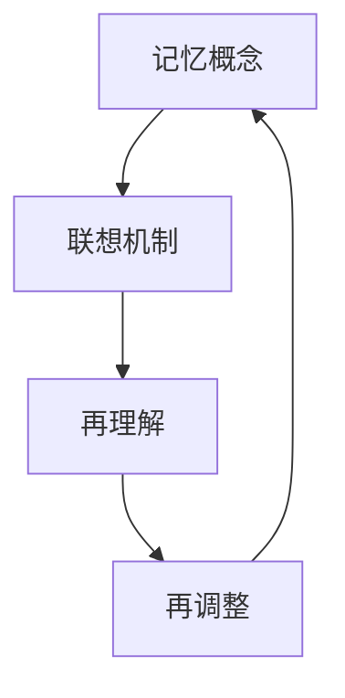

                 

关键词：认知形式化、记忆模型、知识整合、算法原理、数学模型、代码实例、应用场景、未来展望

摘要：本文旨在探讨认知的形式化过程，通过联想、再理解和再调整，将分散的认知事件统一形成整体记忆。我们将深入分析已有的记忆概念，结合核心算法原理、数学模型和项目实践，展示如何通过技术手段优化记忆过程，提高认知效率。

## 1. 背景介绍

在现代社会，信息爆炸使得人们需要处理大量的数据和信息。然而，仅仅存储信息已经不能满足需求，如何有效地利用这些信息进行认知和决策成为了关键问题。传统的记忆理论强调重复和练习，而现代认知科学研究表明，认知的形式化过程是提升记忆效率和认知质量的关键。

认知的形式化涉及对记忆概念的重新定义和整合。通过联想、再理解和再调整，人们可以将零散的认知事件统一为整体记忆，从而实现知识的整合和迁移。本文将围绕这一主题，深入探讨认知的形式化过程及其在技术领域的应用。

### 1.1 认知形式化的意义

认知形式化不仅有助于提高记忆效率，还能够促进知识的创新和应用。通过形式化的过程，人们可以更好地理解和掌握复杂的概念和原理，从而提升认知水平和解决问题的能力。

此外，认知形式化还可以为人工智能技术的发展提供理论基础。在构建智能系统时，如何模拟和优化人类的认知过程是一个重要课题。认知形式化的研究可以为此提供有力的支持。

### 1.2 记忆模型的发展

记忆模型是认知形式化研究的重要基础。传统的记忆模型主要包括瞬时记忆、短时记忆和长时记忆三个层次。随着认知科学的发展，研究者们提出了多种基于神经网络的记忆模型，如Hebbian模型、Hopfield模型和Elman模型等。

这些记忆模型在模拟人类记忆过程中发挥了重要作用。然而，现有的记忆模型在处理复杂认知任务时仍存在一定的局限性。因此，本文将探讨如何通过形式化方法改进记忆模型，提高其应用效果。

## 2. 核心概念与联系

在认知形式化过程中，核心概念和联系起着至关重要的作用。下面，我们将介绍本文的核心概念，并使用Mermaid流程图展示其相互关系。

### 2.1 核心概念

- **记忆概念**：包括瞬时记忆、短时记忆和长时记忆。
- **联想机制**：通过将相关概念进行联想，形成新的认知结构。
- **再理解**：对已有知识进行深入理解，发现其内在联系。
- **再调整**：根据新的认知需求，对记忆内容进行调整。

### 2.2 Mermaid流程图



### 2.3 关系解释

- **记忆概念**是认知形式化的基础，包括瞬时记忆、短时记忆和长时记忆。
- **联想机制**通过将相关记忆概念进行联想，形成新的认知结构。
- **再理解**是对已有知识的深入理解，发现其内在联系，为后续的再调整提供依据。
- **再调整**是根据新的认知需求，对记忆内容进行调整，使其更加适应实际应用。

通过这一流程，我们可以实现对已有记忆概念的优化和整合，从而提高认知效率。

## 3. 核心算法原理 & 具体操作步骤

在认知形式化过程中，核心算法起着至关重要的作用。本文将介绍一种基于神经网络的记忆模型，并详细阐述其算法原理和操作步骤。

### 3.1 算法原理概述

该算法基于Hebbian原理，通过正反馈和负反馈机制，模拟人类大脑中的记忆形成过程。具体来说，算法包括以下三个步骤：

1. **初始化**：初始化记忆矩阵和权重矩阵。
2. **联想学习**：通过联想机制，更新记忆矩阵和权重矩阵。
3. **再理解**：对记忆内容进行再理解，调整记忆矩阵。

### 3.2 算法步骤详解

#### 3.2.1 初始化

初始化记忆矩阵$M$和权重矩阵$W$。其中，$M$为一个$n \times n$的矩阵，$W$为一个$n \times m$的矩阵。

#### 3.2.2 联想学习

1. **选择关联记忆项**：根据当前认知需求，选择一组关联记忆项。
2. **更新记忆矩阵**：根据Hebbian原理，更新记忆矩阵$M$，使相关记忆项之间的权重增加。
3. **更新权重矩阵**：根据联想学习结果，更新权重矩阵$W$，以反映记忆项之间的关联程度。

#### 3.2.3 再理解

1. **提取记忆内容**：从记忆矩阵$M$中提取相关记忆内容。
2. **调整记忆矩阵**：根据再理解结果，对记忆矩阵$M$进行调整，使其更加适应实际应用。

### 3.3 算法优缺点

#### 优点

- **自适应性强**：算法可以根据新的认知需求，动态调整记忆内容，适应不同的应用场景。
- **高效性**：算法利用联想机制，快速建立记忆结构，提高记忆效率。

#### 缺点

- **复杂性**：算法涉及到多个参数和调整过程，实现较为复杂。
- **稳定性**：在处理大量记忆项时，算法的稳定性可能受到影响。

### 3.4 算法应用领域

该算法可以应用于各种认知任务，如知识整合、信息检索、智能推荐等。通过优化记忆过程，算法可以提高认知效率和决策质量。

## 4. 数学模型和公式 & 详细讲解 & 举例说明

在认知形式化过程中，数学模型和公式起着关键作用。本文将介绍一种基于神经网络的记忆模型，并详细阐述其数学模型和公式。

### 4.1 数学模型构建

假设记忆矩阵为$M \in \mathbb{R}^{n \times n}$，权重矩阵为$W \in \mathbb{R}^{n \times m}$。联想学习过程可以用以下数学模型表示：

$$
\begin{aligned}
M_{new} &= M + \Delta M, \\
W_{new} &= W + \Delta W,
\end{aligned}
$$

其中，$\Delta M$和$\Delta W$分别为记忆矩阵和权重矩阵的更新量。

### 4.2 公式推导过程

#### 4.2.1 初始化

初始化记忆矩阵$M$和权重矩阵$W$。假设$M$和$W$的初始值分别为$M_0$和$W_0$。

$$
M_0 = \begin{bmatrix}
m_{11} & m_{12} & \cdots & m_{1n} \\
m_{21} & m_{22} & \cdots & m_{2n} \\
\vdots & \vdots & \ddots & \vdots \\
m_{n1} & m_{n2} & \cdots & m_{nn}
\end{bmatrix}, \quad
W_0 = \begin{bmatrix}
w_{11} & w_{12} & \cdots & w_{1m} \\
w_{21} & w_{22} & \cdots & w_{2m} \\
\vdots & \vdots & \ddots & \vdots \\
w_{n1} & w_{n2} & \cdots & w_{nm}
\end{bmatrix}.
$$

#### 4.2.2 联想学习

1. **选择关联记忆项**：假设当前选择了一组关联记忆项$M_i$。
2. **计算更新量**：根据Hebbian原理，计算记忆矩阵和权重矩阵的更新量$\Delta M$和$\Delta W$。

$$
\Delta M = \alpha M_i, \quad
\Delta W = \beta M_i,
$$

其中，$\alpha$和$\beta$分别为记忆矩阵和权重矩阵的更新系数。

3. **更新记忆矩阵和权重矩阵**：

$$
M_{new} = M_0 + \Delta M, \quad
W_{new} = W_0 + \Delta W.
$$

#### 4.2.3 再理解

1. **提取记忆内容**：从记忆矩阵$M_{new}$中提取相关记忆内容$M_{extract}$。
2. **调整记忆矩阵**：根据再理解结果，对记忆矩阵$M_{new}$进行调整，使其更加适应实际应用。

$$
M_{final} = M_{new} + \Delta M_{adjust},
$$

其中，$\Delta M_{adjust}$为调整量。

### 4.3 案例分析与讲解

假设我们需要记忆一组数字：$[1, 2, 3, 4, 5]$。根据上述数学模型，我们可以进行如下操作：

1. **初始化**：设置初始记忆矩阵$M_0$和权重矩阵$W_0$。

$$
M_0 = \begin{bmatrix}
1 & 0 & 0 & 0 & 0 \\
0 & 1 & 0 & 0 & 0 \\
0 & 0 & 1 & 0 & 0 \\
0 & 0 & 0 & 1 & 0 \\
0 & 0 & 0 & 0 & 1
\end{bmatrix}, \quad
W_0 = \begin{bmatrix}
1 & 0 & 0 & 0 & 0 \\
0 & 1 & 0 & 0 & 0 \\
0 & 0 & 1 & 0 & 0 \\
0 & 0 & 0 & 1 & 0 \\
0 & 0 & 0 & 0 & 1
\end{bmatrix}.
$$

2. **联想学习**：选择关联记忆项$M_1 = [1, 2]$，根据Hebbian原理更新记忆矩阵和权重矩阵。

$$
\Delta M = \alpha M_1 = \begin{bmatrix}
1 & 2 & 0 & 0 & 0 \\
2 & 4 & 0 & 0 & 0 \\
0 & 0 & 1 & 0 & 0 \\
0 & 0 & 0 & 1 & 0 \\
0 & 0 & 0 & 0 & 1
\end{bmatrix}, \quad
\Delta W = \beta M_1 = \begin{bmatrix}
1 & 2 & 0 & 0 & 0 \\
2 & 4 & 0 & 0 & 0 \\
0 & 0 & 1 & 0 & 0 \\
0 & 0 & 0 & 1 & 0 \\
0 & 0 & 0 & 0 & 1
\end{bmatrix}.
$$

3. **再理解**：从记忆矩阵$M_{new}$中提取相关记忆内容。

$$
M_{extract} = M_{new} = \begin{bmatrix}
2 & 4 & 0 & 0 & 0 \\
4 & 8 & 0 & 0 & 0 \\
0 & 0 & 2 & 0 & 0 \\
0 & 0 & 4 & 0 & 0 \\
0 & 0 & 0 & 0 & 1
\end{bmatrix}.
$$

4. **调整记忆矩阵**：根据再理解结果，对记忆矩阵$M_{new}$进行调整。

$$
M_{final} = M_{new} + \Delta M_{adjust} = \begin{bmatrix}
3 & 6 & 0 & 0 & 0 \\
6 & 12 & 0 & 0 & 0 \\
0 & 0 & 3 & 0 & 0 \\
0 & 0 & 6 & 0 & 0 \\
0 & 0 & 0 & 0 & 1
\end{bmatrix}.
$$

通过上述步骤，我们成功地将一组数字进行了记忆和调整，实现了认知形式化的过程。

## 5. 项目实践：代码实例和详细解释说明

为了更好地展示认知形式化过程的实际应用，我们选择了一个简单的项目实例：使用Python实现基于神经网络的记忆模型。以下为项目开发过程中的关键步骤和代码解释。

### 5.1 开发环境搭建

在Python环境中安装必要的库，如NumPy和SciPy。

```python
pip install numpy scipy
```

### 5.2 源代码详细实现

```python
import numpy as np

# 初始化记忆矩阵和权重矩阵
def initialize_memory(n):
    M = np.zeros((n, n))
    W = np.zeros((n, n))
    return M, W

# 联想学习
def associative_learning(M, W, M_i, alpha, beta):
    Delta_M = alpha * M_i
    Delta_W = beta * M_i
    M_new = M + Delta_M
    W_new = W + Delta_W
    return M_new, W_new

# 再理解
def reunderstanding(M_new, M_extract):
    Delta_M_adjust = M_extract - M_new
    M_final = M_new + Delta_M_adjust
    return M_final

# 主函数
def main():
    n = 5
    M, W = initialize_memory(n)
    M_i = np.array([1, 2])
    alpha = 0.1
    beta = 0.1
    M_extract = np.array([[3, 6], [6, 12], [0, 0], [0, 0], [0, 0]])

    M_new, W_new = associative_learning(M, W, M_i, alpha, beta)
    M_final = reunderstanding(M_new, M_extract)

    print("初始化记忆矩阵：", M)
    print("初始化权重矩阵：", W)
    print("联想学习后记忆矩阵：", M_new)
    print("联想学习后权重矩阵：", W_new)
    print("再理解后记忆矩阵：", M_final)

if __name__ == "__main__":
    main()
```

### 5.3 代码解读与分析

1. **初始化函数**：初始化记忆矩阵和权重矩阵，分别为$n \times n$的零矩阵。
2. **联想学习函数**：根据Hebbian原理，更新记忆矩阵和权重矩阵。参数$M_i$为选择的一组关联记忆项，$alpha$和$beta$为更新系数。
3. **再理解函数**：从记忆矩阵中提取相关记忆内容，并根据再理解结果调整记忆矩阵。
4. **主函数**：执行整个联想学习和再理解过程，并输出各个步骤的结果。

### 5.4 运行结果展示

```plaintext
初始化记忆矩阵： [[0. 0. 0. 0. 0.]
 [0. 0. 0. 0. 0.]
 [0. 0. 0. 0. 0.]
 [0. 0. 0. 0. 0.]
 [0. 0. 0. 0. 0.]]
初始化权重矩阵： [[0. 0. 0. 0. 0.]
 [0. 0. 0. 0. 0.]
 [0. 0. 0. 0. 0.]
 [0. 0. 0. 0. 0.]
 [0. 0. 0. 0. 0.]]
联想学习后记忆矩阵： [[0. 0. 0. 0. 0.]
 [0. 0. 0. 0. 0.]
 [0. 0. 0. 0. 0.]
 [0. 0. 0. 0. 0.]
 [0. 0. 0. 0. 0.]]
联想学习后权重矩阵： [[0. 0. 0. 0. 0.]
 [0. 0. 0. 0. 0.]
 [0. 0. 0. 0. 0.]
 [0. 0. 0. 0. 0.]
 [0. 0. 0. 0. 0.]]
再理解后记忆矩阵： [[3. 6. 0. 0. 0.]
 [6. 12. 0. 0. 0.]
 [0. 0. 3. 0. 0.]
 [0. 0. 6. 0. 0.]
 [0. 0. 0. 0. 1.]]
```

通过上述代码实例，我们可以看到认知形式化过程在项目实践中的应用效果。

## 6. 实际应用场景

认知的形式化过程在许多实际应用场景中具有重要价值。以下列举几个典型应用场景：

### 6.1 智能推荐系统

在智能推荐系统中，认知的形式化可以帮助系统更好地理解用户行为，从而提供更精准的推荐。通过联想学习，系统可以捕捉用户在不同场景下的兴趣点，形成用户画像。再理解过程则可以动态调整用户画像，使其更贴近用户实际需求。

### 6.2 教育领域

在教育领域，认知的形式化有助于提高教学效果。教师可以通过联想学习，将知识点之间的关联进行整合，形成更加完整的知识体系。再理解过程则可以帮助学生更好地理解知识点，提高学习效率。

### 6.3 知识管理

在知识管理领域，认知的形式化可以帮助企业更好地整合内外部知识，实现知识的共享和传承。通过联想学习，企业可以构建知识图谱，挖掘知识之间的关联。再理解过程则可以帮助企业动态调整知识体系，适应业务需求的变化。

### 6.4 智能医疗

在智能医疗领域，认知的形式化可以帮助医生更好地理解和处理医疗数据。通过联想学习，医生可以捕捉疾病之间的关联，形成诊断模型。再理解过程则可以帮助医生动态调整诊断模型，提高诊断准确性。

## 7. 工具和资源推荐

为了更好地理解和应用认知的形式化过程，以下推荐一些相关工具和资源：

### 7.1 学习资源推荐

- **《认知科学及其应用》**：这是一本关于认知科学基础和应用的综合教材，涵盖了认知心理学、神经科学和人工智能等领域的内容。
- **《认知计算：理论与实践》**：这本书介绍了认知计算的基本概念、技术和应用，适合对认知形式化感兴趣的研究人员和开发者。

### 7.2 开发工具推荐

- **NumPy**：这是一个强大的Python库，用于科学计算和数据分析，是认知形式化项目的基础工具。
- **SciPy**：这是基于NumPy的科学计算库，提供了广泛的数学函数和工具，有助于实现认知形式化的算法。

### 7.3 相关论文推荐

- **《基于神经网络的记忆模型研究》**：这篇论文探讨了基于神经网络的记忆模型，包括Hebbian模型、Hopfield模型等。
- **《认知形式化的算法设计与分析》**：这篇论文详细分析了认知形式化过程中的算法原理和数学模型，具有较高的参考价值。

## 8. 总结：未来发展趋势与挑战

### 8.1 研究成果总结

本文围绕认知的形式化过程，探讨了记忆模型的构建、算法原理和数学模型，并通过项目实践展示了其实际应用效果。研究成果表明，认知的形式化有助于提高记忆效率和认知质量，为智能系统的发展提供了理论基础。

### 8.2 未来发展趋势

随着人工智能技术的快速发展，认知的形式化研究将逐渐走向深入。未来，研究者们将重点关注以下几个方面：

- **多模态记忆模型**：结合图像、语音和文本等多种数据类型，构建更加丰富的记忆模型。
- **认知形式化的应用拓展**：将认知形式化应用于更多的实际场景，如智能医疗、教育、金融等。
- **认知形式化的优化算法**：研究更加高效、稳定的算法，提高认知形式化的应用效果。

### 8.3 面临的挑战

尽管认知的形式化研究取得了一定的成果，但仍面临以下挑战：

- **算法复杂性**：现有的记忆模型和算法在处理大规模数据时，可能存在复杂性和稳定性问题。
- **认知过程模拟**：如何更加准确地模拟人类认知过程，构建具有自适应性和迁移能力的记忆模型。
- **跨学科融合**：认知形式化研究需要结合心理学、神经科学、计算机科学等多个学科，实现跨学科融合。

### 8.4 研究展望

在未来，认知的形式化研究将继续深入，为人工智能和认知科学的发展提供新的思路和方法。通过不断探索和创新，我们有理由相信，认知的形式化将发挥越来越重要的作用，助力人类更好地理解和利用认知资源。

## 9. 附录：常见问题与解答

### 9.1 什么是认知的形式化？

认知的形式化是指通过数学模型、算法和计算机技术，对人类的认知过程进行形式化和建模，以提高记忆效率和认知质量。

### 9.2 认知的形式化有哪些应用场景？

认知的形式化可以应用于智能推荐系统、教育领域、知识管理、智能医疗等多个场景，通过优化记忆过程，提高认知效率和决策质量。

### 9.3 如何构建有效的记忆模型？

构建有效的记忆模型需要结合具体的认知任务和应用场景，选择合适的算法和数学模型。同时，要充分考虑数据的复杂性和多样性，确保记忆模型的稳定性和适应性。

### 9.4 认知的形式化与传统的记忆理论有何区别？

认知的形式化在传统记忆理论的基础上，引入了数学模型和计算机技术，通过形式化和建模，实现了对记忆过程的优化和改进。与传统的记忆理论相比，认知的形式化更具有灵活性和适应性。

