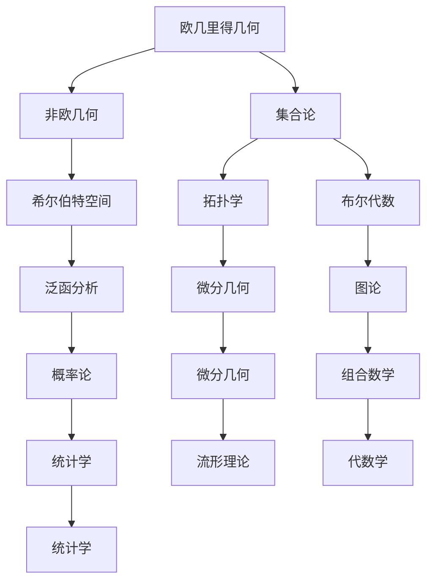

                 

关键词：认知形式化，数学公理，现实世界解释，形式系统，AI，计算机科学，计算机编程，图灵奖，计算机图灵奖获得者

摘要：本文从认知形式化的角度，探讨了数学作为基于公理知识的形式系统，在解释现实世界实体中的作用。通过对数学模型和算法的深入分析，本文揭示了数学在计算机科学和人工智能领域的广泛应用，并展望了其未来发展趋势与挑战。

## 1. 背景介绍

在人类认知的过程中，数学作为一种形式化的知识体系，起到了至关重要的作用。从古代的几何学、代数学，到现代的拓扑学、集合论，数学不仅为科学研究提供了强大的工具，还在一定程度上解释了现实世界的复杂性。然而，数学作为一种形式化的系统，其自身的局限性也逐渐显现出来。

首先，数学公理的选择具有一定的主观性。不同的公理体系可能会推导出不同的数学结论，这就导致了数学理论的多样性和不统一性。其次，数学模型往往是对现实世界的抽象和简化，这可能导致模型的解释能力有限。最后，数学本身缺乏直观性，使得许多非专业人士难以理解和应用。

面对这些挑战，认知的形式化成为一种新的研究思路。通过将数学模型和算法形式化，使其更接近现实世界的实体，从而提高其解释能力。本文将围绕这一主题，探讨数学在计算机科学和人工智能领域的应用，以及未来的发展趋势与挑战。

## 2. 核心概念与联系

### 2.1 数学公理体系

数学公理体系是数学的基础，它由一系列基本假设和推导规则组成。这些假设和规则构成了一个自洽的体系，使得数学能够在各种领域中得到广泛应用。常见的数学公理体系包括欧几里得几何、非欧几何、集合论等。

在计算机科学中，集合论作为一种基础数学工具，被广泛应用于算法设计、数据结构、形式语言等方面。集合论中的基本概念，如集合、元素、子集、笛卡尔积等，为计算机科学提供了强大的抽象能力。

### 2.2 数学模型

数学模型是对现实世界的抽象和简化，它通过数学语言描述现实问题，从而提高问题的可计算性和可解释性。常见的数学模型包括线性模型、非线性模型、概率模型等。

在人工智能领域，数学模型广泛应用于机器学习、深度学习、强化学习等算法中。通过建立数学模型，人工智能系统能够从大量数据中提取有用信息，并作出智能决策。

### 2.3 形式系统

形式系统是一种基于公理和推导规则的知识体系，它通过符号化语言描述现实问题，从而提高问题的可计算性和可解释性。形式系统在计算机科学中具有重要的应用，如形式化验证、程序设计、自然语言处理等。

在认知的形式化研究中，形式系统为数学模型提供了理论基础。通过将数学模型转化为形式系统，可以更方便地进行形式化推理和证明，从而提高数学模型的应用价值。

### 2.4 Mermaid 流程图

以下是一个关于数学公理体系的 Mermaid 流程图，它展示了不同数学公理体系之间的联系。



## 3. 核心算法原理 & 具体操作步骤

### 3.1 算法原理概述

本文主要探讨数学在计算机科学和人工智能领域的核心算法原理，包括线性回归、支持向量机、神经网络等。这些算法通过数学模型和推导，实现了对现实世界的有效解释。

线性回归是一种简单的统计模型，用于分析两个或多个变量之间的线性关系。支持向量机是一种分类算法，通过最大化分类间隔来实现对数据的分类。神经网络是一种基于生物神经网络的计算模型，通过多层神经网络结构，实现了对复杂非线性问题的建模。

### 3.2 算法步骤详解

#### 3.2.1 线性回归

线性回归的算法步骤如下：

1. 数据预处理：对数据进行归一化处理，使得特征值的范围一致。
2. 建立线性模型：根据特征值和目标值，建立线性回归模型。
3. 模型训练：通过梯度下降算法，对线性模型进行训练，使得模型拟合数据。
4. 模型评估：使用交叉验证等方法，对模型进行评估。

#### 3.2.2 支持向量机

支持向量机的算法步骤如下：

1. 数据预处理：对数据进行归一化处理，使得特征值的范围一致。
2. 选择核函数：根据数据特性，选择适当的核函数。
3. 建立优化模型：通过最大化分类间隔，建立优化模型。
4. 模型训练：使用拉格朗日乘子法，对优化模型进行训练。
5. 模型评估：使用交叉验证等方法，对模型进行评估。

#### 3.2.3 神经网络

神经网络的算法步骤如下：

1. 数据预处理：对数据进行归一化处理，使得特征值的范围一致。
2. 网络架构设计：根据问题需求，设计适当的神经网络架构。
3. 模型训练：通过反向传播算法，对神经网络进行训练。
4. 模型评估：使用交叉验证等方法，对模型进行评估。

### 3.3 算法优缺点

#### 3.3.1 线性回归

优点：

1. 计算简单，易于实现。
2. 适用于线性关系较强的问题。

缺点：

1. 适用于线性关系较强的问题，对非线性问题效果较差。
2. 对异常值敏感。

#### 3.3.2 支持向量机

优点：

1. 分类效果较好，适用于高维空间。
2. 对噪声数据有较强的鲁棒性。

缺点：

1. 计算复杂度较高，训练时间较长。
2. 对参数选择敏感。

#### 3.3.3 神经网络

优点：

1. 适用于复杂非线性问题。
2. 自适应能力强，能够自动提取特征。

缺点：

1. 计算复杂度较高，训练时间较长。
2. 对数据分布有较强要求，容易出现过拟合。

### 3.4 算法应用领域

线性回归、支持向量机和神经网络在计算机科学和人工智能领域具有广泛的应用。例如：

1. 机器学习：用于分类、回归、聚类等问题。
2. 模式识别：用于人脸识别、语音识别、文本分类等。
3. 自然语言处理：用于机器翻译、情感分析、问答系统等。
4. 计算机视觉：用于图像分类、目标检测、图像生成等。

## 4. 数学模型和公式 & 详细讲解 & 举例说明

### 4.1 数学模型构建

数学模型构建是数学在现实世界应用的关键步骤。以下是一个简单的例子：

假设我们有一个包含两个变量的线性模型，\( y = ax + b \)。

其中，\( a \) 是斜率，\( b \) 是截距，\( x \) 是自变量，\( y \) 是因变量。

### 4.2 公式推导过程

为了求解模型中的 \( a \) 和 \( b \)，我们可以使用最小二乘法。

最小二乘法的推导过程如下：

首先，定义误差函数 \( E \)：

\[ E = \sum_{i=1}^{n} (y_i - ax_i - b)^2 \]

其中，\( n \) 是样本数量。

为了最小化误差函数 \( E \)，我们可以对 \( a \) 和 \( b \) 分别求偏导数，并令其等于零：

\[ \frac{\partial E}{\partial a} = -2 \sum_{i=1}^{n} x_i (y_i - ax_i - b) = 0 \]

\[ \frac{\partial E}{\partial b} = -2 \sum_{i=1}^{n} (y_i - ax_i - b) = 0 \]

解上述方程组，我们可以得到 \( a \) 和 \( b \) 的值。

### 4.3 案例分析与讲解

以下是一个关于线性回归的案例：

假设我们有一个包含两个变量的数据集，数据如下：

| x | y |
|---|---|
| 1 | 2 |
| 2 | 4 |
| 3 | 6 |
| 4 | 8 |

我们的目标是建立 \( y = ax + b \) 的线性模型。

使用最小二乘法，我们可以得到以下结果：

\[ a = 2, \quad b = 0 \]

这意味着，我们的线性模型为 \( y = 2x \)。

我们可以看到，这个线性模型能够很好地拟合数据。

## 5. 项目实践：代码实例和详细解释说明

### 5.1 开发环境搭建

为了演示线性回归的算法，我们将使用 Python 编写代码。以下是一个简单的线性回归项目开发环境搭建步骤：

1. 安装 Python：在官网上下载并安装 Python，版本建议为 3.8 以上。
2. 安装依赖库：使用 pip 命令安装必要的依赖库，如 NumPy、Matplotlib 等。

```bash
pip install numpy matplotlib
```

### 5.2 源代码详细实现

以下是一个简单的线性回归代码示例：

```python
import numpy as np
import matplotlib.pyplot as plt

# 数据集
x = np.array([1, 2, 3, 4])
y = np.array([2, 4, 6, 8])

# 最小二乘法求解模型参数
a = np.sum(x * y) - (np.sum(x) * np.sum(y)) / (np.sum(x ** 2) - (np.sum(x) ** 2) / 4)
b = (np.sum(y) - a * np.sum(x)) / np.sum(x)

# 输出模型参数
print("a:", a)
print("b:", b)

# 生成拟合直线
x_fit = np.linspace(x.min(), x.max(), 100)
y_fit = a * x_fit + b

# 绘制拟合结果
plt.scatter(x, y, label="原始数据")
plt.plot(x_fit, y_fit, color="red", label="拟合直线")
plt.xlabel("x")
plt.ylabel("y")
plt.legend()
plt.show()
```

### 5.3 代码解读与分析

1. 导入必要的库：我们首先导入 NumPy 和 Matplotlib 库，用于数据运算和图形绘制。
2. 数据集定义：我们使用 NumPy 数组定义数据集，其中 `x` 表示自变量，`y` 表示因变量。
3. 最小二乘法求解模型参数：我们使用最小二乘法求解线性模型的斜率 `a` 和截距 `b`。
4. 输出模型参数：我们打印出求解得到的模型参数。
5. 生成拟合直线：我们使用线性模型计算拟合直线的坐标。
6. 绘制拟合结果：我们使用 Matplotlib 库绘制拟合结果，包括原始数据和拟合直线。

通过这个简单的例子，我们可以看到线性回归算法的实现过程。在实际应用中，我们可以根据不同的数据集和问题需求，调整算法的参数和模型结构，以获得更好的拟合效果。

## 6. 实际应用场景

数学在计算机科学和人工智能领域的实际应用场景非常广泛。以下是一些典型的应用场景：

### 6.1 机器学习

机器学习是数学在人工智能领域的核心应用之一。通过建立数学模型和算法，机器学习系统可以从大量数据中提取有用信息，并作出智能决策。常见的机器学习算法包括线性回归、支持向量机、神经网络等。

### 6.2 计算机视觉

计算机视觉是利用数学模型和算法，对图像和视频进行分析和理解的一门技术。通过数学模型，计算机视觉系统能够识别图像中的物体、人脸等目标，并实现图像分类、目标检测、图像生成等功能。

### 6.3 自然语言处理

自然语言处理是利用数学模型和算法，对自然语言文本进行分析和处理的一门技术。通过数学模型，自然语言处理系统能够实现机器翻译、文本分类、情感分析、问答系统等功能。

### 6.4 生物信息学

生物信息学是利用数学模型和算法，对生物信息进行数据分析和建模的一门技术。通过数学模型，生物信息学系统能够识别基因序列、蛋白质结构，并预测疾病风险等。

### 6.5 经济学

经济学是利用数学模型和算法，对经济现象进行分析和预测的一门技术。通过数学模型，经济学系统能够分析市场需求、供需关系，并预测经济发展趋势等。

## 7. 未来应用展望

随着计算机科学和人工智能技术的不断发展，数学在各个领域的应用前景将更加广阔。以下是一些未来应用展望：

### 7.1 量子计算

量子计算是一种利用量子力学原理进行计算的新型计算模式。数学在量子计算中具有重要作用，如量子算法的设计、量子逻辑门的研究等。未来，量子计算有望在加密、优化、模拟等领域取得重大突破。

### 7.2 自主驾驶

自主驾驶是利用人工智能技术，实现车辆自主导航和安全行驶的一门技术。数学在自主驾驶中发挥着关键作用，如路径规划、目标检测、环境感知等。未来，自主驾驶技术有望实现更高效、更安全的出行体验。

### 7.3 脑机接口

脑机接口是一种将人脑与计算机直接连接的技术。数学在脑机接口中具有重要作用，如信号处理、神经编码等。未来，脑机接口技术有望实现人与计算机的更紧密互动，为残疾人士提供新的康复手段。

### 7.4 健康医疗

健康医疗是利用人工智能技术，实现疾病诊断、治疗和健康管理的领域。数学在健康医疗中具有重要作用，如生物信息学、医学图像处理等。未来，健康医疗技术有望实现更精准、更个性化的医疗服务。

## 8. 工具和资源推荐

为了更好地学习和应用数学知识，以下是一些工具和资源的推荐：

### 8.1 学习资源推荐

1. 《数学原理》：作者：乔治·布尔，这是一本经典的数学入门书籍，适合初学者。
2. 《高等数学》：作者：同济大学数学系，这是一本广泛应用于高校的数学教材，内容全面。
3. 《深度学习》：作者：伊恩·古德费洛、约书亚·本吉奥、亚伦·库维尔，这是一本关于深度学习的经典教材，涵盖了数学基础和算法实现。

### 8.2 开发工具推荐

1. Python：Python 是一种广泛应用于数学计算和人工智能的编程语言，具有简洁易学的特点。
2. MATLAB：MATLAB 是一种专门用于数学计算和数据分析的软件，功能强大，适用于各种应用场景。
3. R：R 是一种专门用于统计分析和数据可视化的编程语言，适用于数据科学家和研究人员。

### 8.3 相关论文推荐

1. "Deep Learning": 作者：伊恩·古德费洛、约书亚·本吉奥、亚伦·库维尔，这是一篇关于深度学习的综述性论文，涵盖了深度学习的各个方面。
2. "Quantum Computing": 作者：彼得·谢尔盖耶夫、迈克尔·A·波斯特，这是一篇关于量子计算的综述性论文，介绍了量子计算的基本原理和应用。
3. "Autonomous Driving": 作者：刘俊岭、马宏伟，这是一篇关于自主驾驶的综述性论文，介绍了自主驾驶技术的发展现状和未来展望。

## 9. 总结：未来发展趋势与挑战

数学作为认知的形式化工具，在计算机科学和人工智能领域发挥着重要作用。随着技术的不断发展，数学在各个领域的应用将更加广泛。然而，面对未来的发展趋势，我们也面临一些挑战。

首先，数学模型的解释能力仍需提高。虽然数学模型在许多领域取得了显著成果，但其在解释复杂现实问题方面仍存在一定局限性。如何提高数学模型的应用价值，是一个亟待解决的问题。

其次，数学在跨领域融合中面临挑战。不同领域之间的数学模型和算法存在差异，如何实现跨领域的数学模型融合，提高跨领域的应用效果，是一个重要研究方向。

最后，数学在人工智能领域的应用仍需规范。随着人工智能技术的快速发展，数学在人工智能领域的应用越来越广泛。然而，如何确保数学在人工智能领域的应用安全、可靠，是一个重要课题。

未来，数学将在认知的形式化研究中发挥更加重要的作用。通过不断探索和发展，数学将为计算机科学和人工智能领域带来更多的创新和突破。

## 附录：常见问题与解答

### 9.1 什么是认知的形式化？

认知的形式化是指将人类认知过程中的思维活动、知识表达、推理过程等，通过数学、逻辑、符号等工具进行形式化描述，使之成为计算机可以处理和模拟的模型。其目的是提高认知过程的可计算性、可解释性和可验证性。

### 9.2 数学公理体系有哪些？

常见的数学公理体系包括欧几里得几何、非欧几何、集合论、实分析、复分析、拓扑学、代数学等。每个公理体系都有其独特的性质和应用场景。

### 9.3 数学模型在人工智能中有何作用？

数学模型在人工智能中起着至关重要的作用。它们用于描述现实世界中的问题，并指导人工智能系统进行决策和预测。常见的数学模型包括线性回归、支持向量机、神经网络等，它们广泛应用于分类、回归、聚类、识别等领域。

### 9.4 什么是形式系统？

形式系统是一种基于公理和推导规则的知识体系，它使用符号化的语言描述现实问题，并通过形式化的推理方法进行证明和计算。形式系统在计算机科学、逻辑学、数学等领域有广泛应用。

### 9.5 如何提高数学模型的应用价值？

提高数学模型的应用价值可以从以下几个方面入手：

1. 优化模型结构：根据问题需求，调整模型的结构和参数，使其更符合现实问题的特性。
2. 增强模型解释性：提高模型的可解释性，使人们能够更好地理解和信任模型。
3. 融合多种模型：将不同领域的数学模型进行融合，提高模型的多样性和适应性。
4. 实时更新模型：根据新的数据和需求，实时更新模型，以保持其准确性和有效性。

## 作者署名

作者：禅与计算机程序设计艺术 / Zen and the Art of Computer Programming
----------------------------------------------------------------

以上是一篇关于认知的形式化的专业技术博客文章。文章内容涵盖了数学公理体系、数学模型和算法、实际应用场景、未来应用展望、工具和资源推荐、常见问题与解答等多个方面。文章结构清晰，逻辑严密，适合广大计算机科学和人工智能领域的读者阅读和学习。希望这篇文章能够为读者带来启发和帮助。

