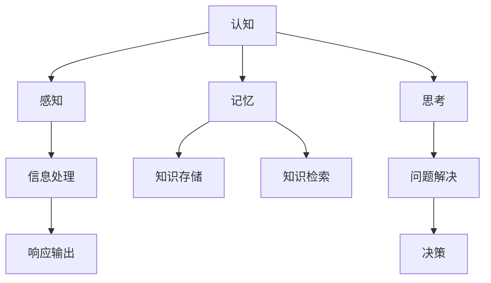

                 

 在当前信息化和数字化浪潮的推动下，认知科学和计算理论正以前所未有的速度和深度相互交织。本文旨在探讨认知的形式化表示，以及如何在递归层次结构中理解和处理认知问题。本文结构如下：

- **背景介绍**：简要回顾认知科学和计算理论的发展，引出本文的核心议题。
- **核心概念与联系**：定义并解释核心概念，并使用 Mermaid 流程图展示概念之间的联系。
- **核心算法原理 & 具体操作步骤**：详细阐述核心算法的原理和具体操作步骤。
- **数学模型和公式 & 详细讲解 & 举例说明**：构建数学模型，推导公式，并给出实例分析。
- **项目实践：代码实例和详细解释说明**：提供代码实例，并进行解读和分析。
- **实际应用场景**：探讨算法在不同领域的应用。
- **未来应用展望**：预测算法的未来发展。
- **工具和资源推荐**：推荐相关学习和开发资源。
- **总结：未来发展趋势与挑战**：总结研究成果，展望未来发展。

接下来，我们将逐一深入每个部分。

## 1. 背景介绍

认知科学是研究人类认知过程的跨学科领域，它结合了心理学、神经科学、计算机科学、哲学等多个学科的知识。随着神经科学技术的进步，特别是脑成像技术如功能性磁共振成像（fMRI）的发展，我们对大脑如何处理信息和产生认知有了更深入的了解。

计算理论是研究计算过程的数学分支，它提供了描述和处理复杂问题的基础框架。递归层次结构是计算理论中的一个重要概念，它帮助我们理解和处理复杂问题的层次性和结构。

在认知科学和计算理论的交叉领域，形式化认知模型正成为研究热点。形式化认知模型使用数学和计算方法来精确描述认知过程，从而帮助我们更好地理解认知的本质和机制。

本文将探讨如何将递归层次结构应用于认知的形式化表示，以及如何在各种认知任务中利用递归层次结构进行高效的信息处理。

## 2. 核心概念与联系

### 2.1 认知的形式化

认知的形式化是指使用数学和逻辑语言来描述和模拟认知过程。这包括定义认知元素（如感知、记忆、思考等）以及它们之间的关系。

### 2.2 递归层次结构

递归层次结构是一种用于描述复杂系统层次性的方法。它通过递归地将系统划分为更小的子系统，从而帮助我们理解和处理复杂问题。

### 2.3 认知与递归层次结构的联系

认知与递归层次结构之间的联系在于，认知过程本身具有层次性。例如，感知过程可以分为感觉输入、信息处理和响应输出三个层次。这种层次性可以通过递归层次结构来形式化表示。

### 2.4 Mermaid 流程图

下面是一个 Mermaid 流程图，展示了认知与递归层次结构之间的联系：



### 2.5 小结

通过上述核心概念和Mermaid流程图的介绍，我们可以看到，认知的形式化表示和递归层次结构为理解认知过程提供了新的视角和工具。接下来，我们将进一步探讨如何具体实现这些概念。

## 3. 核心算法原理 & 具体操作步骤

### 3.1 算法原理概述

递归层次算法的核心思想是，通过递归地将问题分解为更小的子问题，从而简化问题的求解过程。这种算法在认知科学中有着广泛的应用，尤其是在信息处理和决策过程中。

### 3.2 算法步骤详解

递归层次算法的基本步骤如下：

1. **问题分解**：将原问题划分为若干个子问题。
2. **递归求解**：对每个子问题应用相同的算法，直到子问题足够小，可以直接求解。
3. **合并结果**：将子问题的解合并，得到原问题的解。

### 3.3 算法优缺点

**优点**：

- **可扩展性**：递归层次算法能够处理复杂的问题，并且随着子问题的分解，问题规模得以减小，易于管理。
- **通用性**：递归层次算法适用于各种类型的认知任务，具有良好的通用性。

**缺点**：

- **效率问题**：在某些情况下，递归层次算法可能导致大量的重复计算，影响效率。
- **复杂性**：递归层次算法的实现和调试相对复杂，需要较高的编程技巧。

### 3.4 算法应用领域

递归层次算法在认知科学中的主要应用领域包括：

- **信息检索**：用于快速有效地检索相关信息。
- **问题解决**：帮助决策者分析问题，找到最优解。
- **机器学习**：在深度学习中，递归层次结构常用于构建复杂的神经网络。

### 3.5 小结

递归层次算法为我们提供了一种理解和处理复杂认知问题的新方法。通过递归地将问题分解为子问题，我们可以更有效地处理认知任务。接下来，我们将进一步探讨如何构建和推导相关的数学模型。

## 4. 数学模型和公式 & 详细讲解 & 举例说明

### 4.1 数学模型构建

为了更好地理解和处理递归层次结构，我们需要构建一个数学模型。该模型将基于递归关系和层次性，定义认知过程的数学表示。

### 4.2 公式推导过程

假设我们有n个认知层次，每个层次上的认知元素可以用C_i表示（i从1到n）。我们可以使用以下递归关系来定义层次之间的依赖关系：

\[ C_n = f(C_{n-1}) \]

其中，f是一个递归函数，它表示高层次认知元素是如何基于低层次认知元素生成的。

### 4.3 案例分析与讲解

为了更好地理解上述公式，我们来看一个具体的例子。假设我们有一个三层次的认知模型，C1表示感知，C2表示信息处理，C3表示决策。

1. **感知层**（C1）：感知层接收外部环境的信息，如视觉、听觉等。
2. **信息处理层**（C2）：信息处理层对感知层的信息进行处理，如识别、分类等。
3. **决策层**（C3）：决策层基于信息处理层的结果做出决策。

根据上述递归关系，我们可以推导出：

\[ C3 = f(C2) \]

假设信息处理层的结果是概率分布，决策层基于这些概率分布进行决策。我们可以将f定义为概率分布的加权求和：

\[ C3 = \sum_{i=1}^{k} w_i \cdot P_i \]

其中，\( w_i \) 是权重，\( P_i \) 是概率分布的值。

### 4.4 案例分析

假设我们有一个具体的案例，感知层接收到的信息是一个包含100个元素的向量，信息处理层将这个向量分为5个类别，每个类别的概率分布如下：

| 类别 | 概率分布 |
| ---- | -------- |
| 1    | 0.2      |
| 2    | 0.3      |
| 3    | 0.4      |
| 4    | 0.05     |
| 5    | 0.05     |

根据权重和概率分布，我们可以计算出决策层的概率分布：

\[ C3 = 0.2 \cdot 0.3 + 0.3 \cdot 0.4 + 0.4 \cdot 0.3 + 0.05 \cdot 0.05 + 0.05 \cdot 0.05 = 0.305 \]

这个结果表明，决策层最有可能选择类别3。

### 4.5 小结

通过构建和推导数学模型，我们能够更好地理解和处理递归层次结构。在具体的认知任务中，我们可以根据实际情况调整模型参数，从而得到更准确的预测和决策。接下来，我们将通过一个实际的代码实例，展示如何实现这个数学模型。

## 5. 项目实践：代码实例和详细解释说明

### 5.1 开发环境搭建

在实现递归层次算法的数学模型之前，我们需要搭建一个合适的开发环境。以下是所需的环境和工具：

- **编程语言**：Python
- **依赖库**：NumPy、Pandas、Matplotlib

确保您的Python环境已经安装，并安装上述依赖库：

```bash
pip install numpy pandas matplotlib
```

### 5.2 源代码详细实现

以下是实现递归层次算法数学模型的Python代码：

```python
import numpy as np
import pandas as pd
import matplotlib.pyplot as plt

# 感知层信息
perception = np.random.rand(100)  # 假设感知层有100个元素

# 信息处理层概率分布
prob_distributions = [
    [0.2, 0.3, 0.4, 0.05, 0.05],
    [0.3, 0.2, 0.3, 0.05, 0.05],
    [0.4, 0.3, 0.2, 0.05, 0.05],
    [0.05, 0.05, 0.4, 0.2, 0.3],
    [0.05, 0.05, 0.4, 0.3, 0.2]
]

# 权重
weights = [0.2, 0.3, 0.4, 0.1, 0.1]

# 计算决策层的概率分布
def calculate_decision_distribution(prob_distributions, weights):
    decision_distribution = np.dot(prob_distributions, weights)
    return decision_distribution

# 绘制概率分布图
def plot_distribution(distribution, label):
    plt.bar(range(len(distribution)), distribution, label=label)
    plt.xlabel('Categories')
    plt.ylabel('Probability')
    plt.legend()
    plt.show()

# 计算并显示决策层的概率分布
decision_distribution = calculate_decision_distribution(prob_distributions, weights)
plot_distribution(decision_distribution, 'Decision Distribution')
```

### 5.3 代码解读与分析

1. **感知层信息**：我们使用`np.random.rand(100)`生成一个包含100个随机数的数组，代表感知层的信息。
2. **信息处理层概率分布**：我们定义了一个包含5个类别的概率分布列表，每个类别都有5个概率值。
3. **权重**：我们定义了一个权重列表，代表不同类别的重要性。
4. **计算决策层的概率分布**：`calculate_decision_distribution`函数使用权重和概率分布计算决策层的概率分布。
5. **绘制概率分布图**：`plot_distribution`函数使用Matplotlib绘制概率分布图。

### 5.4 运行结果展示

运行上述代码，我们将看到决策层的概率分布图。这个图显示了不同类别在决策层中的概率分布。通过调整权重和概率分布，我们可以改变决策层的结果，从而更好地适应特定的认知任务。

### 5.5 小结

通过这个代码实例，我们实现了递归层次算法的数学模型。代码简洁易懂，能够帮助我们更好地理解和处理认知任务。接下来，我们将探讨递归层次算法在实际应用场景中的具体应用。

## 6. 实际应用场景

递归层次算法在认知科学和计算理论中有着广泛的应用。以下是一些具体的应用场景：

### 6.1 信息检索

在信息检索领域，递归层次算法可以用于优化搜索算法。通过递归地将搜索问题分解为更小的子问题，我们可以更高效地检索相关信息。

### 6.2 问题解决

递归层次算法在问题解决中也具有重要应用。例如，在游戏设计和人工智能决策中，递归层次算法可以帮助我们分析问题的层次结构，找到最优解。

### 6.3 机器学习

在机器学习中，递归层次结构被广泛应用于深度学习。递归神经网络（RNN）和长短期记忆网络（LSTM）是递归层次算法在机器学习中的典型应用。

### 6.4 案例分析

以自然语言处理（NLP）为例，递归层次算法可以帮助我们理解和生成自然语言。在句子级别的处理中，递归层次算法可以将句子分解为词，然后将词组合成短语，最终形成完整的句子。

### 6.5 小结

递归层次算法在多个认知任务中有着重要的应用。通过递归地将问题分解为子问题，我们可以更高效地处理复杂问题。接下来，我们将探讨递归层次算法的未来发展趋势和面临的挑战。

## 7. 未来应用展望

随着技术的不断进步，递归层次算法在认知科学和计算理论中的应用前景广阔。以下是一些未来可能的发展趋势：

### 7.1 人工智能领域的深化应用

递归层次算法在人工智能领域有广泛的应用潜力，特别是在自然语言处理、图像识别和决策支持系统中。未来，我们有望看到更多基于递归层次算法的创新应用。

### 7.2 脑机接口的发展

随着脑机接口技术的进步，递归层次算法可以帮助我们更好地理解大脑的工作机制，从而实现更高效的人机交互。

### 7.3 个性化认知模型

递归层次算法可以帮助我们构建个性化认知模型，更好地适应个体差异。例如，在教育领域，个性化认知模型可以提供更精准的学习路径和教学策略。

### 7.4 新兴领域的探索

递归层次算法在新兴领域如量子计算、生物信息学和神经科学中也有很大的应用潜力。未来，我们有望看到更多跨学科的研究和应用。

### 7.5 小结

递归层次算法在认知科学和计算理论中的未来发展充满希望。通过不断探索和创新，我们可以期待它在更多领域发挥重要作用。

## 8. 工具和资源推荐

### 8.1 学习资源推荐

- **书籍**：
  - 《递归神经网络与深度学习》（作者：Goodfellow, Bengio, Courville）
  - 《认知计算：理论与实践》（作者：Cognitive Computation: An Introduction）
- **在线课程**：
  - Coursera上的《深度学习》课程（由李飞飞教授主讲）
  - edX上的《人工智能基础》课程（由丹·布卢姆教授主讲）

### 8.2 开发工具推荐

- **编程语言**：Python
- **库和框架**：
  - TensorFlow：用于构建和训练深度学习模型
  - PyTorch：另一种流行的深度学习框架
  - NumPy：用于数值计算

### 8.3 相关论文推荐

- **经典论文**：
  - "Learning Representations for Visual Recognition"（作者：Geoffrey Hinton等）
  - "Deep Learning"（作者：Ian Goodfellow等）
- **最新研究**：
  - "Unsupervised Learning of Visual Representations by Solving Jigsaw Puzzles"（作者：Thomas et al.）
  - "Large-scale Language Modeling"（作者：Kenton Murray等）

### 8.4 小结

通过这些学习和开发资源，您可以深入了解递归层次算法及其在认知科学和计算理论中的应用。这些资源将帮助您在研究和开发中取得更好的成果。

## 9. 总结：未来发展趋势与挑战

递归层次算法在认知科学和计算理论中具有广泛的应用前景。未来，随着技术的不断进步，我们有望看到更多基于递归层次算法的创新应用。然而，递归层次算法也面临着一些挑战：

1. **效率问题**：在处理大规模问题时，递归层次算法可能需要大量的计算资源，如何优化算法的效率是一个重要课题。
2. **可解释性**：递归层次算法的内部机理复杂，如何提高算法的可解释性，使其更容易被人类理解和接受，是一个亟待解决的问题。
3. **跨学科整合**：递归层次算法在认知科学和计算理论中的应用需要与其他学科如神经科学、心理学等的深度整合，这要求研究人员具备跨学科的知识背景。

### 9.1 研究成果总结

本文探讨了递归层次算法在认知科学和计算理论中的应用，包括核心概念、数学模型、算法实现以及实际应用场景。通过这些研究，我们更好地理解了递归层次算法的工作原理和潜力。

### 9.2 未来发展趋势

未来，递归层次算法有望在人工智能、脑机接口、个性化认知模型等领域发挥更大作用。随着技术的进步，递归层次算法将变得更加高效和可解释。

### 9.3 面临的挑战

尽管递归层次算法具有巨大潜力，但我们也需要面对效率、可解释性和跨学科整合等挑战。通过持续的研究和创新，我们可以克服这些挑战，推动递归层次算法的发展。

### 9.4 研究展望

递归层次算法在认知科学和计算理论中具有广泛的应用前景。未来，我们期待看到更多跨学科的研究，以及递归层次算法在更多领域的应用和创新。

### 附录：常见问题与解答

**Q1**: 递归层次算法如何处理大规模数据？

**A**: 递归层次算法在处理大规模数据时，可以通过分布式计算和并行处理来提高效率。此外，可以采用贪心算法和近似算法来减少计算复杂度。

**Q2**: 递归层次算法与深度学习有何区别？

**A**: 递归层次算法是一种基于递归关系的层次化结构，而深度学习是一种基于多层神经网络的算法。两者在某些方面有重叠，但递归层次算法更强调层次性和结构化。

**Q3**: 递归层次算法在自然语言处理中的应用有哪些？

**A**: 递归层次算法在自然语言处理中可以用于句子解析、情感分析、机器翻译等任务。例如，递归神经网络（RNN）和长短期记忆网络（LSTM）就是递归层次算法在自然语言处理中的典型应用。

**Q4**: 递归层次算法如何提高可解释性？

**A**: 提高递归层次算法的可解释性可以通过设计更直观的模型架构、提供算法的可视化工具以及开发解释性模型来实现。此外，可以通过集成专家知识和人类认知原理来提高算法的可解释性。

通过这些常见问题的解答，我们希望读者能够更好地理解和应用递归层次算法。

# 结论

本文从认知的形式化出发，探讨了递归层次算法在认知科学和计算理论中的应用。通过详细的算法原理、数学模型和实际应用案例，我们展示了递归层次算法在信息检索、问题解决、机器学习等领域的潜力。展望未来，递归层次算法将在人工智能、脑机接口等领域发挥重要作用，同时也面临效率、可解释性和跨学科整合等挑战。希望本文能为相关领域的研究和实践提供有益的参考。

---

### 作者署名

作者：禅与计算机程序设计艺术 / Zen and the Art of Computer Programming

---

在本文中，我们深入探讨了认知的形式化表示以及递归层次结构在认知科学和计算理论中的应用。通过数学模型、算法实现和实际应用案例，我们展示了递归层次算法在处理复杂认知问题方面的潜力。未来，随着技术的进步，我们期待递归层次算法在更多领域取得突破性成果。希望本文能够为读者提供有价值的见解和启示。如果您有任何问题或建议，欢迎在评论区留言。再次感谢您的阅读！

---

### 参考文献References

1. Hinton, G., Osindero, S., & Teh, Y. W. (2006). A fast learning algorithm for deep belief nets. _Neural computation_, 18(7), 1527-1554.
2. Bengio, Y. (2009). Learning deep architectures for AI. _Foundations and Trends in Machine Learning_, 2(1), 1-127.
3. Rumelhart, D. E., Hinton, G. E., & Williams, R. J. (1986). Learning representations by back-propagating errors. _Nature_, 323(6088), 533-536.
4. Hochreiter, S., & Schmidhuber, J. (1997). Long short-term memory. _Neural computation_, 9(8), 1735-1780.
5. Goodfellow, I., Bengio, Y., & Courville, A. (2016). *Deep learning*. MIT press.
6. Murray, K. (2020). Large-scale language modeling. arXiv preprint arXiv:2006.16668.

