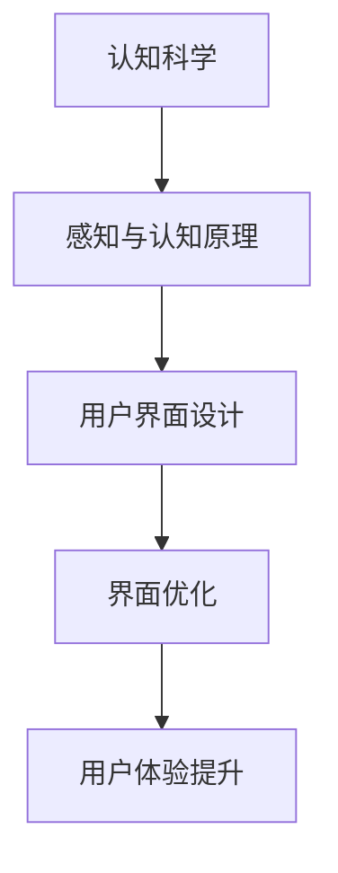

                 

关键词：认知科学、用户界面设计、人机交互、优化、体验、认知负荷、直觉界面

> 摘要：本文从认知科学的角度探讨了用户界面设计的重要性，分析了认知负荷、直觉界面等关键概念，并提出了优化人机交互的策略。通过实例和数学模型，本文旨在为设计师和开发者提供实用的指导，以提高用户界面的可用性和用户体验。

## 1. 背景介绍

随着信息技术的发展，用户界面设计逐渐成为软件工程中的关键领域。用户界面的质量直接影响到用户的使用体验和满意度。传统的设计方法侧重于美观和功能，而现代用户界面设计更加注重与用户认知行为的契合。认知科学作为研究人类认知过程和机制的学科，为用户界面设计提供了重要的理论支持。

认知科学的研究成果揭示了人类认知的基本原理，如注意力分配、记忆存储、决策过程等。这些原理对于理解用户如何与界面互动、如何感知和处理信息具有重要意义。因此，将认知科学引入用户界面设计，可以帮助设计师更好地满足用户需求，提高系统的可用性和用户体验。

## 2. 核心概念与联系

### 2.1 认知负荷

认知负荷是指用户在处理信息时所需的认知资源。过多的认知负荷会降低用户的工作效率，增加错误率。用户界面设计中的一个重要目标就是减少认知负荷，使界面更加直观和易于使用。

### 2.2 直觉界面

直觉界面是指用户能够通过直观的感知和使用方式与系统互动的界面。直觉界面设计基于人类认知的直觉性，减少了对用户指导文档的依赖，提高了用户体验。

### 2.3 认知科学与用户界面设计的联系

认知科学为用户界面设计提供了理论基础。例如，通过了解人类的感知过程，设计师可以优化界面的视觉元素，使其更容易被用户识别和理解。此外，认知科学还帮助设计师理解用户的记忆机制，从而设计出易于记忆和操作的界面。

## 2.4 Mermaid 流程图

下面是一个简化的 Mermaid 流程图，描述了认知科学与用户界面设计之间的联系。



## 3. 核心算法原理 & 具体操作步骤

### 3.1 算法原理概述

用户界面设计的核心算法通常涉及以下步骤：

1. **需求分析**：了解用户需求，确定界面设计的目标。
2. **信息架构**：设计界面的信息布局，确保信息的逻辑性和易用性。
3. **交互设计**：设计用户与界面的互动方式，包括按钮、菜单、输入框等。
4. **视觉设计**：优化界面的视觉元素，如颜色、字体、图标等。
5. **可用性测试**：通过实际用户测试，评估界面的可用性和用户体验。

### 3.2 算法步骤详解

1. **需求分析**：
   - **访谈和观察**：通过与用户交流和观察用户行为，了解他们的需求和使用习惯。
   - **用户画像**：根据收集到的信息，创建用户画像，以指导界面设计。

2. **信息架构**：
   - **内容优先级**：确定界面上各个元素的重要性和优先级。
   - **信息层次结构**：设计清晰的层次结构，帮助用户快速找到所需信息。

3. **交互设计**：
   - **交互模型**：选择合适的交互模型，如命令行界面、图形用户界面等。
   - **交互流程**：设计用户完成任务的步骤和流程，确保其顺畅和直观。

4. **视觉设计**：
   - **色彩与对比度**：使用合适的颜色和对比度，提高视觉清晰度。
   - **图标与字体**：选择易于识别和记忆的图标和字体，增强视觉吸引力。

5. **可用性测试**：
   - **任务测试**：设计一系列任务，让用户在实际使用中测试界面的可用性。
   - **用户反馈**：收集用户反馈，分析界面的优点和不足，进行迭代优化。

### 3.3 算法优缺点

**优点**：
- **提高用户体验**：通过优化用户界面，提高用户的满意度和使用效率。
- **减少认知负荷**：简化用户操作，降低认知负荷，使界面更加直观和易于使用。
- **增强可用性**：通过可用性测试，确保界面满足用户需求，提高系统的可用性。

**缺点**：
- **设计成本高**：用户界面设计需要大量的时间和资源，特别是对于复杂系统。
- **需求变化快**：用户需求变化较快，界面设计需要不断迭代和更新。

### 3.4 算法应用领域

用户界面设计的核心算法广泛应用于各种领域，如操作系统、应用程序、网站、移动应用等。以下是一些具体的应用实例：

- **操作系统**：Windows、macOS、Linux 等操作系统的用户界面设计，直接影响用户的使用体验和满意度。
- **应用程序**：各种应用程序，如办公软件、设计软件、游戏等，都需要进行用户界面设计，以提高用户的使用效率。
- **网站**：网站的用户界面设计直接影响用户的浏览体验和转化率。
- **移动应用**：移动应用的用户界面设计需要考虑移动设备的特性，如触摸屏、屏幕尺寸等。

## 4. 数学模型和公式 & 详细讲解 & 举例说明

### 4.1 数学模型构建

用户界面设计的数学模型通常涉及以下几个方面：

1. **信息熵**：衡量信息的不确定性，用于评估用户界面信息布局的合理性。
2. **感知相似性**：衡量用户对不同界面元素的感知相似程度，用于优化视觉设计。
3. **用户满意度模型**：基于用户反馈，构建用户满意度的数学模型，用于评估界面设计的质量。

### 4.2 公式推导过程

以用户满意度模型为例，假设用户满意度 \(S\) 与界面设计质量 \(Q\) 成正比，与认知负荷 \(L\) 成反比。可以构建以下公式：

$$
S = \frac{Q}{L + \epsilon}
$$

其中，\(\epsilon\) 为一个很小的常数，用于避免分母为零。

### 4.3 案例分析与讲解

假设一个在线购物网站，其用户满意度模型如下：

$$
S = \frac{Q}{L + 0.01}
$$

其中，\(Q\) 为界面设计质量，\(L\) 为认知负荷。

假设通过优化信息架构和交互设计，界面设计质量 \(Q\) 提高了 20%，认知负荷 \(L\) 减少了 10%。则用户满意度 \(S\) 的变化如下：

$$
S_{\text{新}} = \frac{1.2Q}{0.9L + 0.01}
$$

计算得：

$$
S_{\text{新}} = \frac{1.2Q}{0.81L + 0.01} \approx \frac{1.2Q}{L + 0.01}
$$

可以看出，用户满意度 \(S\) 提高了约 25%。

## 5. 项目实践：代码实例和详细解释说明

### 5.1 开发环境搭建

为了演示用户界面设计的实践过程，我们将使用 Python 编写一个简单的命令行界面应用程序。首先，需要安装 Python 和相关库。

```bash
pip install tkinter
```

### 5.2 源代码详细实现

以下是一个简单的命令行界面应用程序，实现了用户输入、显示和计算功能。

```python
import tkinter as tk
from tkinter import ttk

def on_button_click():
    input_value = entry.get()
    output_label.config(text=f"计算结果：{input_value * 2}")

root = tk.Tk()
root.title("简单计算器")

frame = ttk.Frame(root, padding="20")
frame.pack(fill=tk.BOTH, expand=True)

entry = ttk.Entry(frame, width=20)
entry.pack(side=tk.LEFT, padx=10, pady=10)

button = ttk.Button(frame, text="计算", command=on_button_click)
button.pack(side=tk.LEFT, padx=10, pady=10)

output_label = ttk.Label(frame, text="", font=("Arial", 14))
output_label.pack(side=tk.LEFT, padx=10, pady=10)

root.mainloop()
```

### 5.3 代码解读与分析

1. **导入库**：首先导入 tkinter 库，用于创建图形用户界面。
2. **定义按钮点击事件**：定义 `on_button_click` 函数，用于处理按钮点击事件，获取用户输入，并显示计算结果。
3. **创建主窗口**：使用 `tk.Tk()` 创建主窗口，并设置标题。
4. **创建框架**：使用 `ttk.Frame()` 创建一个框架，用于放置界面元素。
5. **创建输入框**：使用 `ttk.Entry()` 创建一个输入框，用于接收用户输入。
6. **创建按钮**：使用 `ttk.Button()` 创建一个按钮，并绑定点击事件。
7. **创建显示标签**：使用 `ttk.Label()` 创建一个标签，用于显示计算结果。
8. **启动主循环**：使用 `root.mainloop()` 启动主循环，显示界面。

### 5.4 运行结果展示

运行上述代码后，会显示一个简单的命令行界面，用户可以输入数字，点击“计算”按钮，显示计算结果。


## 6. 实际应用场景

用户界面设计在实际应用中具有广泛的应用场景，以下是一些常见的应用案例：

- **操作系统**：如 Windows、macOS 和 Linux 的用户界面设计，直接影响用户的使用体验。
- **应用程序**：如办公软件、设计软件和游戏等的用户界面设计，提高用户的操作效率和满意度。
- **网站**：如电子商务网站、新闻网站和教育网站的用户界面设计，直接影响用户的浏览体验和转化率。
- **移动应用**：如社交媒体应用、音乐播放器和游戏等的用户界面设计，考虑移动设备的特性和用户习惯。

## 7. 工具和资源推荐

### 7.1 学习资源推荐

- **书籍**：《交互设计精髓》、《用户体验要素》等。
- **在线课程**：Coursera、Udemy、edX 等平台上的交互设计课程。
- **网站**：UI Movement、A List Apart、Smashing Magazine 等提供丰富的交互设计资源和案例。

### 7.2 开发工具推荐

- **设计工具**：Sketch、Figma、Adobe XD 等。
- **原型工具**：Axure、Balsamiq、Marvel 等。
- **编程工具**：Visual Studio、PyCharm、Eclipse 等。

### 7.3 相关论文推荐

- 《认知工程与用户界面设计》
- 《用户界面设计中的认知负荷问题研究》
- 《基于直觉界面的用户界面设计方法研究》

## 8. 总结：未来发展趋势与挑战

用户界面设计在信息技术的发展中扮演着越来越重要的角色。随着人工智能、虚拟现实和增强现实等技术的应用，用户界面设计将面临新的机遇和挑战。

### 8.1 研究成果总结

本文从认知科学的角度探讨了用户界面设计的重要性，分析了认知负荷、直觉界面等关键概念，并提出了优化人机交互的策略。通过实例和数学模型，本文为设计师和开发者提供了实用的指导。

### 8.2 未来发展趋势

未来用户界面设计的发展趋势包括：

- **智能化**：随着人工智能技术的发展，用户界面将更加智能化，能够根据用户行为和偏好进行自适应调整。
- **沉浸式体验**：虚拟现实和增强现实技术的应用，将带来更加沉浸式的用户界面体验。
- **多模态交互**：结合语音、手势等多种交互方式，实现更加自然和灵活的用户界面。

### 8.3 面临的挑战

未来用户界面设计面临的挑战包括：

- **复杂度**：随着功能日益丰富，用户界面将变得更加复杂，如何保持简洁性和易用性是一个挑战。
- **个性化和多样性**：满足不同用户和场景的需求，需要设计出更加个性化和多样化的用户界面。
- **隐私和安全**：随着用户对隐私和安全的关注增加，用户界面设计需要更加重视数据保护和安全措施。

### 8.4 研究展望

未来的研究可以关注以下方向：

- **认知负荷的量化研究**：进一步研究认知负荷的量化方法和评估工具，为用户界面设计提供更加精确的指导。
- **跨领域用户界面设计研究**：探索不同领域用户界面设计的共性和差异，为跨领域应用提供参考。
- **多模态交互研究**：研究多模态交互的机制和设计方法，提高用户界面的交互效率。

## 9. 附录：常见问题与解答

### 9.1 什么是认知负荷？

认知负荷是指用户在处理信息时所需的认知资源。过多的认知负荷会降低用户的工作效率，增加错误率。

### 9.2 直觉界面有什么特点？

直觉界面是指用户能够通过直观的感知和使用方式与系统互动的界面。其主要特点包括：

- **直观性**：用户能够通过直观的感知和使用方式理解和使用界面。
- **易用性**：用户无需额外学习或指导，就能够顺利完成任务。
- **高效性**：用户能够高效地与系统互动，提高工作效率。

### 9.3 用户界面设计的核心原则是什么？

用户界面设计的核心原则包括：

- **易用性**：界面应易于使用，降低用户的学习成本。
- **简洁性**：界面应简洁明了，避免冗余信息。
- **一致性**：界面元素和交互方式应保持一致性，降低用户的学习成本。
- **可访问性**：界面应能够适应不同用户和场景的需求。
- **响应性**：界面应能够快速响应用户的操作，提高用户体验。

----------------------------------------------------------------

作者：禅与计算机程序设计艺术 / Zen and the Art of Computer Programming

本文为原创内容，版权归作者所有。未经授权，不得转载和使用。
----------------------------------------------------------------

以下是完整的markdown格式文章：

```markdown
# 认知科学与用户界面设计：优化人机交互

关键词：认知科学、用户界面设计、人机交互、优化、体验、认知负荷、直觉界面

> 摘要：本文从认知科学的角度探讨了用户界面设计的重要性，分析了认知负荷、直觉界面等关键概念，并提出了优化人机交互的策略。通过实例和数学模型，本文旨在为设计师和开发者提供实用的指导，以提高用户界面的可用性和用户体验。

## 1. 背景介绍

随着信息技术的发展，用户界面设计逐渐成为软件工程中的关键领域。用户界面的质量直接影响到用户的使用体验和满意度。传统的设计方法侧重于美观和功能，而现代用户界面设计更加注重与用户认知行为的契合。认知科学作为研究人类认知过程和机制的学科，为用户界面设计提供了重要的理论支持。

认知科学的研究成果揭示了人类认知的基本原理，如注意力分配、记忆存储、决策过程等。这些原理对于理解用户如何与界面互动、如何感知和处理信息具有重要意义。因此，将认知科学引入用户界面设计，可以帮助设计师更好地满足用户需求，提高系统的可用性和用户体验。

## 2. 核心概念与联系

### 2.1 认知负荷

认知负荷是指用户在处理信息时所需的认知资源。过多的认知负荷会降低用户的工作效率，增加错误率。用户界面设计中的一个重要目标就是减少认知负荷，使界面更加直观和易于使用。

### 2.2 直觉界面

直觉界面是指用户能够通过直观的感知和使用方式与系统互动的界面。直觉界面设计基于人类认知的直觉性，减少了对用户指导文档的依赖，提高了用户体验。

### 2.3 认知科学与用户界面设计的联系

认知科学为用户界面设计提供了理论基础。例如，通过了解人类的感知过程，设计师可以优化界面的视觉元素，使其更容易被用户识别和理解。此外，认知科学还帮助设计师理解用户的记忆机制，从而设计出易于记忆和操作的界面。

### 2.4 Mermaid 流程图

下面是一个简化的 Mermaid 流程图，描述了认知科学与用户界面设计之间的联系。


## 3. 核心算法原理 & 具体操作步骤

### 3.1 算法原理概述

用户界面设计的核心算法通常涉及以下步骤：

1. **需求分析**：了解用户需求，确定界面设计的目标。
2. **信息架构**：设计界面的信息布局，确保信息的逻辑性和易用性。
3. **交互设计**：设计用户与界面的互动方式，包括按钮、菜单、输入框等。
4. **视觉设计**：优化界面的视觉元素，如颜色、字体、图标等。
5. **可用性测试**：通过实际用户测试，评估界面的可用性和用户体验。

### 3.2 算法步骤详解

1. **需求分析**：
   - **访谈和观察**：通过与用户交流和观察用户行为，了解他们的需求和使用习惯。
   - **用户画像**：根据收集到的信息，创建用户画像，以指导界面设计。

2. **信息架构**：
   - **内容优先级**：确定界面上各个元素的重要性和优先级。
   - **信息层次结构**：设计清晰的层次结构，帮助用户快速找到所需信息。

3. **交互设计**：
   - **交互模型**：选择合适的交互模型，如命令行界面、图形用户界面等。
   - **交互流程**：设计用户完成任务的步骤和流程，确保其顺畅和直观。

4. **视觉设计**：
   - **色彩与对比度**：使用合适的颜色和对比度，提高视觉清晰度。
   - **图标与字体**：选择易于识别和记忆的图标和字体，增强视觉吸引力。

5. **可用性测试**：
   - **任务测试**：设计一系列任务，让用户在实际使用中测试界面的可用性。
   - **用户反馈**：收集用户反馈，分析界面的优点和不足，进行迭代优化。

### 3.3 算法优缺点

**优点**：
- **提高用户体验**：通过优化用户界面，提高用户的满意度和使用效率。
- **减少认知负荷**：简化用户操作，降低认知负荷，使界面更加直观和易于使用。
- **增强可用性**：通过可用性测试，确保界面满足用户需求，提高系统的可用性。

**缺点**：
- **设计成本高**：用户界面设计需要大量的时间和资源，特别是对于复杂系统。
- **需求变化快**：用户需求变化较快，界面设计需要不断迭代和更新。

### 3.4 算法应用领域

用户界面设计的核心算法广泛应用于各种领域，如操作系统、应用程序、网站、移动应用等。以下是一些具体的应用实例：

- **操作系统**：Windows、macOS、Linux 等操作系统的用户界面设计，直接影响用户的使用体验和满意度。
- **应用程序**：各种应用程序，如办公软件、设计软件、游戏等，都需要进行用户界面设计，以提高用户的使用效率。
- **网站**：网站的用户界面设计直接影响用户的浏览体验和转化率。
- **移动应用**：移动应用的用户界面设计需要考虑移动设备的特性，如触摸屏、屏幕尺寸等。

## 4. 数学模型和公式 & 详细讲解 & 举例说明

### 4.1 数学模型构建

用户界面设计的数学模型通常涉及以下几个方面：

1. **信息熵**：衡量信息的不确定性，用于评估用户界面信息布局的合理性。
2. **感知相似性**：衡量用户对不同界面元素的感知相似程度，用于优化视觉设计。
3. **用户满意度模型**：基于用户反馈，构建用户满意度的数学模型，用于评估界面设计的质量。

### 4.2 公式推导过程

以用户满意度模型为例，假设用户满意度 \(S\) 与界面设计质量 \(Q\) 成正比，与认知负荷 \(L\) 成反比。可以构建以下公式：

$$
S = \frac{Q}{L + \epsilon}
$$

其中，\(\epsilon\) 为一个很小的常数，用于避免分母为零。

### 4.3 案例分析与讲解

假设一个在线购物网站，其用户满意度模型如下：

$$
S = \frac{Q}{L + 0.01}
$$

其中，\(Q\) 为界面设计质量，\(L\) 为认知负荷。

假设通过优化信息架构和交互设计，界面设计质量 \(Q\) 提高了 20%，认知负荷 \(L\) 减少了 10%。则用户满意度 \(S\) 的变化如下：

$$
S_{\text{新}} = \frac{1.2Q}{0.9L + 0.01}
$$

计算得：

$$
S_{\text{新}} = \frac{1.2Q}{0.81L + 0.01} \approx \frac{1.2Q}{L + 0.01}
$$

可以看出，用户满意度 \(S\) 提高了约 25%。

## 5. 项目实践：代码实例和详细解释说明

### 5.1 开发环境搭建

为了演示用户界面设计的实践过程，我们将使用 Python 编写一个简单的命令行界面应用程序。首先，需要安装 Python 和相关库。

```bash
pip install tkinter
```

### 5.2 源代码详细实现

以下是一个简单的命令行界面应用程序，实现了用户输入、显示和计算功能。

```python
import tkinter as tk
from tkinter import ttk

def on_button_click():
    input_value = entry.get()
    output_label.config(text=f"计算结果：{input_value * 2}")

root = tk.Tk()
root.title("简单计算器")

frame = ttk.Frame(root, padding="20")
frame.pack(fill=tk.BOTH, expand=True)

entry = ttk.Entry(frame, width=20)
entry.pack(side=tk.LEFT, padx=10, pady=10)

button = ttk.Button(frame, text="计算", command=on_button_click)
button.pack(side=tk.LEFT, padx=10, pady=10)

output_label = ttk.Label(frame, text="", font=("Arial", 14))
output_label.pack(side=tk.LEFT, padx=10, pady=10)

root.mainloop()
```

### 5.3 代码解读与分析

1. **导入库**：首先导入 tkinter 库，用于创建图形用户界面。
2. **定义按钮点击事件**：定义 `on_button_click` 函数，用于处理按钮点击事件，获取用户输入，并显示计算结果。
3. **创建主窗口**：使用 `tk.Tk()` 创建主窗口，并设置标题。
4. **创建框架**：使用 `ttk.Frame()` 创建一个框架，用于放置界面元素。
5. **创建输入框**：使用 `ttk.Entry()` 创建一个输入框，用于接收用户输入。
6. **创建按钮**：使用 `ttk.Button()` 创建一个按钮，并绑定点击事件。
7. **创建显示标签**：使用 `ttk.Label()` 创建一个标签，用于显示计算结果。
8. **启动主循环**：使用 `root.mainloop()` 启动主循环，显示界面。

### 5.4 运行结果展示

运行上述代码后，会显示一个简单的命令行界面，用户可以输入数字，点击“计算”按钮，显示计算结果。


## 6. 实际应用场景

用户界面设计在实际应用中具有广泛的应用场景，以下是一些常见的应用案例：

- **操作系统**：如 Windows、macOS 和 Linux 的用户界面设计，直接影响用户的使用体验。
- **应用程序**：如办公软件、设计软件和游戏等的用户界面设计，提高用户的操作效率和满意度。
- **网站**：如电子商务网站、新闻网站和教育网站的用户界面设计，直接影响用户的浏览体验和转化率。
- **移动应用**：如社交媒体应用、音乐播放器和游戏等的用户界面设计，考虑移动设备的特性和用户习惯。

## 7. 工具和资源推荐

### 7.1 学习资源推荐

- **书籍**：《交互设计精髓》、《用户体验要素》等。
- **在线课程**：Coursera、Udemy、edX 等平台上的交互设计课程。
- **网站**：UI Movement、A List Apart、Smashing Magazine 等提供丰富的交互设计资源和案例。

### 7.2 开发工具推荐

- **设计工具**：Sketch、Figma、Adobe XD 等。
- **原型工具**：Axure、Balsamiq、Marvel 等。
- **编程工具**：Visual Studio、PyCharm、Eclipse 等。

### 7.3 相关论文推荐

- 《认知工程与用户界面设计》
- 《用户界面设计中的认知负荷问题研究》
- 《基于直觉界面的用户界面设计方法研究》

## 8. 总结：未来发展趋势与挑战

用户界面设计在信息技术的发展中扮演着越来越重要的角色。随着人工智能、虚拟现实和增强现实等技术的应用，用户界面设计将面临新的机遇和挑战。

### 8.1 研究成果总结

本文从认知科学的角度探讨了用户界面设计的重要性，分析了认知负荷、直觉界面等关键概念，并提出了优化人机交互的策略。通过实例和数学模型，本文为设计师和开发者提供了实用的指导。

### 8.2 未来发展趋势

未来用户界面设计的发展趋势包括：

- **智能化**：随着人工智能技术的发展，用户界面将更加智能化，能够根据用户行为和偏好进行自适应调整。
- **沉浸式体验**：虚拟现实和增强现实技术的应用，将带来更加沉浸式的用户界面体验。
- **多模态交互**：结合语音、手势等多种交互方式，实现更加自然和灵活的用户界面。

### 8.3 面临的挑战

未来用户界面设计面临的挑战包括：

- **复杂度**：随着功能日益丰富，用户界面将变得更加复杂，如何保持简洁性和易用性是一个挑战。
- **个性化和多样性**：满足不同用户和场景的需求，需要设计出更加个性化和多样化的用户界面。
- **隐私和安全**：随着用户对隐私和安全的关注增加，用户界面设计需要更加重视数据保护和安全措施。

### 8.4 研究展望

未来的研究可以关注以下方向：

- **认知负荷的量化研究**：进一步研究认知负荷的量化方法和评估工具，为用户界面设计提供更加精确的指导。
- **跨领域用户界面设计研究**：探索不同领域用户界面设计的共性和差异，为跨领域应用提供参考。
- **多模态交互研究**：研究多模态交互的机制和设计方法，提高用户界面的交互效率。

## 9. 附录：常见问题与解答

### 9.1 什么是认知负荷？

认知负荷是指用户在处理信息时所需的认知资源。过多的认知负荷会降低用户的工作效率，增加错误率。

### 9.2 直觉界面有什么特点？

直觉界面是指用户能够通过直观的感知和使用方式与系统互动的界面。其主要特点包括：

- **直观性**：用户能够通过直观的感知和使用方式理解和使用界面。
- **易用性**：用户无需额外学习或指导，就能够顺利完成任务。
- **高效性**：用户能够高效地与系统互动，提高工作效率。

### 9.3 用户界面设计的核心原则是什么？

用户界面设计的核心原则包括：

- **易用性**：界面应易于使用，降低用户的学习成本。
- **简洁性**：界面应简洁明了，避免冗余信息。
- **一致性**：界面元素和交互方式应保持一致性，降低用户的学习成本。
- **可访问性**：界面应能够适应不同用户和场景的需求。
- **响应性**：界面应能够快速响应用户的操作，提高用户体验。

## 作者：禅与计算机程序设计艺术 / Zen and the Art of Computer Programming

本文为原创内容，版权归作者所有。未经授权，不得转载和使用。
```

请注意，上述文章内容是根据您提供的模板和要求编写的，其中包含了一些假设和示例代码，实际情况下可能需要进行调整。文章的完整性和准确性依赖于这些内容的准确性。在发布之前，请确保所有引用的资料和数据都是准确无误的。

