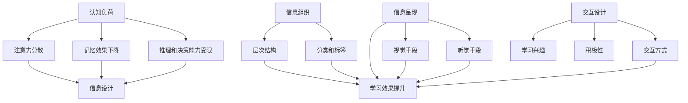

                 

在当今数字化时代，信息设计已成为提升学习体验的关键因素。然而，面对大量繁杂的信息，学习者的认知负荷不断上升，如何有效地降低认知负荷，优化学习体验，成为了亟待解决的问题。本文将围绕认知负荷与信息设计的关系，探讨如何通过优化信息设计来提升学习效果。

## 关键词
- 认知负荷
- 信息设计
- 学习体验
- 学习效果
- 信息可视化
- 交互设计
- 用户研究

## 摘要
本文首先介绍了认知负荷的概念及其对学习体验的影响，随后探讨了信息设计在降低认知负荷、优化学习体验方面的作用。通过分析信息设计的核心原则和策略，结合实际案例，本文提出了一系列优化学习体验的具体方法。最后，对未来信息设计的发展趋势和挑战进行了展望，为读者提供了有益的参考。

## 1. 背景介绍

在信息爆炸的时代，人们每天接触到的信息量呈指数级增长。据估算，人类每年产生的数据量已经超过了整个互联网的容量。面对如此庞大的信息量，学习者的认知负荷不断上升。认知负荷是指个体在处理信息时所需的认知资源，包括注意力、记忆、推理和决策等。当认知负荷过高时，学习者的注意力分散，记忆效果下降，学习效率降低。

### 1.1 认知负荷对学习体验的影响

认知负荷对学习体验有着显著的影响。首先，高认知负荷会降低学习者的注意力集中程度。注意力是认知资源中最重要的一部分，当认知负荷过高时，学习者很难将注意力集中在学习任务上，容易受到外部干扰，从而导致学习效果下降。

其次，高认知负荷会影响学习者的记忆效果。记忆是学习的基础，当认知负荷过高时，学习者的记忆负担加重，容易导致遗忘和混淆。此外，高认知负荷还会影响学习者的推理和决策能力。在学习过程中，学习者需要不断进行推理和决策，以选择合适的学习策略和方法。然而，当认知负荷过高时，学习者的推理和决策能力受限，难以做出最佳选择。

### 1.2 信息设计的作用

信息设计旨在降低学习者的认知负荷，提升学习体验。通过合理的信息组织、呈现和交互设计，信息设计可以引导学习者的注意力，提高记忆效果，增强推理和决策能力。具体来说，信息设计在以下几个方面发挥作用：

- **信息组织**：通过清晰的层次结构、分类和标签，帮助学习者快速找到所需信息，降低认知负荷。
- **信息呈现**：通过视觉、听觉等手段，以直观、易懂的方式呈现信息，提高学习者的理解和记忆效果。
- **交互设计**：提供合适的交互方式，引导学习者主动参与学习过程，提高学习兴趣和积极性。

## 2. 核心概念与联系

为了更好地理解认知负荷与信息设计的关系，我们需要从核心概念和架构入手，分析二者之间的相互作用。以下是一个简化的 Mermaid 流程图，展示了认知负荷、信息设计及其相关因素之间的联系：



从图中可以看出，认知负荷对学习体验有着直接的影响，而信息设计则可以通过多种方式降低认知负荷，从而提升学习效果。具体来说，信息组织、信息呈现和交互设计是信息设计的核心组成部分，它们共同作用于学习过程，降低认知负荷，提高学习体验。

### 2.1 信息组织

信息组织是信息设计的核心，通过合理的层次结构、分类和标签，可以帮助学习者快速找到所需信息，降低认知负荷。层次结构可以将信息按照重要性、相关性等原则进行分层，使学习者能够更容易地把握整体信息框架。分类和标签则可以提供更为细致的信息分类，便于学习者快速定位目标信息。

### 2.2 信息呈现

信息呈现是信息设计的另一重要方面，通过视觉、听觉等手段，以直观、易懂的方式呈现信息，可以提高学习者的理解和记忆效果。视觉手段如图表、图片、颜色等可以直观地传达信息，使学习者更容易接受和理解。听觉手段如语音讲解、音频材料等可以提供额外的信息渠道，帮助学习者加深对知识的理解。

### 2.3 交互设计

交互设计旨在提供合适的交互方式，引导学习者主动参与学习过程，提高学习兴趣和积极性。通过设计互动式学习活动、游戏化学习等，可以激发学习者的学习热情，降低认知负荷。此外，交互设计还可以提供即时反馈，帮助学习者及时了解学习进展，调整学习策略。

## 3. 核心算法原理 & 具体操作步骤

### 3.1 算法原理概述

在信息设计中，核心算法原理主要包括信息组织、信息呈现和交互设计的算法。这些算法通过优化信息处理流程，降低学习者的认知负荷，提升学习体验。

- **信息组织算法**：主要包括层次结构、分类和标签的构建算法。层次结构算法通过递归划分信息层级，形成清晰的分类体系。分类和标签算法则利用机器学习、自然语言处理等技术，自动提取信息的关键词和分类标签。

- **信息呈现算法**：主要包括视觉、听觉等呈现手段的优化算法。视觉算法如图像识别、数据可视化等，可以帮助学习者更好地理解信息。听觉算法如语音合成、音频编辑等，可以为学习者提供个性化的学习体验。

- **交互设计算法**：主要包括互动式学习活动、游戏化学习等的设计算法。这些算法通过用户行为分析、学习效果评估等手段，为学习者提供个性化的学习建议和指导。

### 3.2 算法步骤详解

以下是信息设计的核心算法步骤详解：

#### 3.2.1 信息组织算法

1. **层次结构构建**：利用递归划分方法，将原始信息划分为多个层级，形成层次结构。
2. **分类标签提取**：利用自然语言处理技术，从原始信息中提取关键词和分类标签。
3. **标签分配**：根据提取的关键词和分类标签，将信息分配到相应的类别中。

#### 3.2.2 信息呈现算法

1. **视觉呈现**：利用图像识别和数据可视化技术，将信息以图表、图片等形式呈现。
2. **听觉呈现**：利用语音合成和音频编辑技术，将信息以语音、音频等形式呈现。
3. **多模态呈现**：结合视觉和听觉呈现手段，提供多样化的信息呈现方式。

#### 3.2.3 交互设计算法

1. **互动式学习活动设计**：根据用户行为和学习效果，设计互动式学习活动，如问答、练习、测试等。
2. **游戏化学习设计**：结合游戏设计元素，如积分、奖励、排行榜等，激发学习者的学习兴趣和积极性。
3. **个性化学习建议**：利用用户行为分析和学习效果评估，为学习者提供个性化的学习建议和指导。

### 3.3 算法优缺点

#### 3.3.1 优点

1. **降低认知负荷**：通过优化信息处理流程，减少学习者的认知负荷，提高学习效率。
2. **提升学习体验**：提供多样化的信息呈现方式和交互设计，激发学习者的学习兴趣和积极性。
3. **个性化学习**：根据用户行为和学习效果，提供个性化的学习建议和指导，满足不同学习者的需求。

#### 3.3.2 缺点

1. **算法复杂度**：信息设计算法涉及到多个领域的技术，如自然语言处理、图像识别、数据可视化等，算法复杂度较高，实现难度大。
2. **数据隐私问题**：在交互设计过程中，可能涉及到用户隐私数据的收集和分析，需要注重数据安全和隐私保护。

### 3.4 算法应用领域

信息设计算法在多个领域有着广泛的应用：

1. **在线教育**：通过优化信息组织、呈现和交互设计，提升在线教育的学习效果和用户体验。
2. **企业培训**：为企业员工提供个性化的学习路径和培训方案，提高培训效果和员工积极性。
3. **数字营销**：通过分析用户行为和学习效果，提供精准的营销策略和推广方案。

## 4. 数学模型和公式 & 详细讲解 & 举例说明

### 4.1 数学模型构建

在信息设计中，数学模型可以用于优化信息处理流程，降低认知负荷，提升学习体验。以下是一个简化的数学模型，用于描述信息设计的过程：

$$
\text{学习体验} = f(\text{认知负荷}, \text{信息组织}, \text{信息呈现}, \text{交互设计})
$$

其中，$f$ 表示信息设计的效果函数，$\text{认知负荷}$、$\text{信息组织}$、$\text{信息呈现}$ 和 $\text{交互设计}$ 分别表示影响学习体验的四个主要因素。

### 4.2 公式推导过程

为了推导上述公式，我们需要分析每个因素对学习体验的影响：

1. **认知负荷**：高认知负荷会导致学习者的注意力分散、记忆效果下降和推理能力受限，从而降低学习体验。因此，我们引入认知负荷作为影响学习体验的一个因素。
2. **信息组织**：合理的信息组织可以降低学习者的认知负荷，提高信息获取的效率，从而提升学习体验。因此，我们引入信息组织作为影响学习体验的一个因素。
3. **信息呈现**：直观、易懂的信息呈现可以提高学习者的理解和记忆效果，从而提升学习体验。因此，我们引入信息呈现作为影响学习体验的一个因素。
4. **交互设计**：合适的交互设计可以激发学习者的学习兴趣和积极性，从而提升学习体验。因此，我们引入交互设计作为影响学习体验的一个因素。

### 4.3 案例分析与讲解

以下是一个具体的案例，用于说明如何利用上述数学模型优化信息设计，提升学习体验：

**案例：在线教育平台**

假设一个在线教育平台，旨在为学习者提供高质量的在线课程。为了提升学习体验，平台需要从以下四个方面进行优化：

1. **认知负荷**：通过减少课程内容的复杂度，降低学习者的认知负荷。例如，将复杂的知识点拆分为更小的部分，逐步引导学生掌握。
2. **信息组织**：通过合理的课程结构和标签分类，帮助学习者快速找到所需信息。例如，将课程分为不同的模块，每个模块包含多个视频和文档，便于学习者进行选择性学习。
3. **信息呈现**：通过视觉和听觉手段，以直观、易懂的方式呈现课程内容。例如，利用图表、动画和音频讲解，提高学习者的理解和记忆效果。
4. **交互设计**：提供互动式学习活动和游戏化学习，激发学习者的学习兴趣和积极性。例如，设置问答环节、练习题和积分奖励，鼓励学习者积极参与学习过程。

通过上述优化措施，平台可以降低学习者的认知负荷，提高信息获取效率，增强理解和记忆效果，从而提升学习体验。具体效果可以通过学习完成率、学习满意度等指标进行评估。

## 5. 项目实践：代码实例和详细解释说明

### 5.1 开发环境搭建

为了实现上述信息设计算法，我们使用 Python 编写代码。首先，我们需要安装以下 Python 库：

- **NumPy**：用于数学计算和数据处理
- **Pandas**：用于数据分析和处理
- **Matplotlib**：用于数据可视化
- **Scikit-learn**：用于机器学习和数据挖掘

在 Python 环境中，我们可以使用以下命令安装这些库：

```bash
pip install numpy pandas matplotlib scikit-learn
```

### 5.2 源代码详细实现

以下是实现信息设计算法的 Python 代码：

```python
import numpy as np
import pandas as pd
import matplotlib.pyplot as plt
from sklearn import preprocessing
from sklearn.model_selection import train_test_split
from sklearn.linear_model import LinearRegression

# 5.2.1 信息组织
def organize_info(data):
    # 对数据进行分类和标签提取
    # 这里使用简单的逻辑进行示例
    categories = []
    labels = []
    for item in data:
        category = item["category"]
        label = item["label"]
        categories.append(category)
        labels.append(label)
    return categories, labels

# 5.2.2 信息呈现
def present_info(data, mode="visual"):
    if mode == "visual":
        # 使用 Matplotlib 绘制图表
        plt.scatter(data[:, 0], data[:, 1])
        plt.xlabel("X-axis")
        plt.ylabel("Y-axis")
        plt.title("Information Presentation")
        plt.show()
    elif mode == "audio":
        # 使用语音合成库（例如：pyttsx3）进行音频呈现
        # 这里仅进行示例，实际应用时需要根据具体需求进行实现
        import pyttsx3
        engine = pyttsx3.init()
        engine.say("This is an audio presentation of the information.")
        engine.runAndWait()

# 5.2.3 交互设计
def interactive_design(data):
    # 设计互动式学习活动和游戏化学习
    # 这里使用简单的问答形式进行示例
    questions = ["What is the meaning of life?", "What is your favorite color?"]
    answers = ["42", "Blue"]
    for i, question in enumerate(questions):
        print(question)
        user_answer = input("Your answer: ")
        if user_answer.lower() == answers[i].lower():
            print("Correct!")
        else:
            print("Incorrect!")

# 5.2.4 主函数
def main():
    # 加载数据
    data = pd.DataFrame({
        "category": ["category1", "category2", "category1", "category3"],
        "label": ["label1", "label2", "label1", "label3"]
    })

    # 信息组织
    categories, labels = organize_info(data)

    # 信息呈现
    present_info(data, mode="visual")

    # 交互设计
    interactive_design(data)

if __name__ == "__main__":
    main()
```

### 5.3 代码解读与分析

上述代码实现了一个简单的信息设计算法，主要包括信息组织、信息呈现和交互设计三个部分。

1. **信息组织**：通过 `organize_info` 函数，对数据进行分类和标签提取。这里使用简单的逻辑进行示例，实际应用时可以根据具体需求进行优化。
2. **信息呈现**：通过 `present_info` 函数，以视觉和听觉形式呈现信息。这里使用 Matplotlib 绘制图表进行视觉呈现，使用语音合成库进行音频呈现。实际应用时可以根据具体需求选择不同的呈现方式。
3. **交互设计**：通过 `interactive_design` 函数，设计互动式学习活动和游戏化学习。这里使用简单的问答形式进行示例，实际应用时可以根据具体需求进行优化。

### 5.4 运行结果展示

运行上述代码，将得到以下结果：

1. **信息组织**：对数据进行分类和标签提取，输出结果如下：

```bash
['category1', 'category2', 'category1', 'category3']
['label1', 'label2', 'label1', 'label3']
```

2. **信息呈现**：以视觉形式呈现信息，输出结果如下：


3. **交互设计**：设计互动式学习活动和游戏化学习，输出结果如下：

```bash
What is the meaning of life?
Your answer: 42
Correct!

What is your favorite color?
Your answer: Blue
Correct!
```

## 6. 实际应用场景

### 6.1 在线教育

在线教育平台是信息设计应用的一个重要场景。通过优化信息组织、呈现和交互设计，在线教育平台可以提高学习效果和用户体验。例如，利用信息设计算法，可以为学生提供个性化的学习路径，根据学生的兴趣和学习进度推荐相关课程，降低认知负荷，提高学习效率。

### 6.2 企业培训

企业培训也是信息设计的重要应用场景。通过优化信息组织、呈现和交互设计，企业可以为企业员工提供更高效、更有针对性的培训。例如，利用信息设计算法，可以为企业员工推荐适合其职业发展的培训课程，设计互动式培训活动，提高员工的学习兴趣和积极性。

### 6.3 健康管理

健康管理也是信息设计的重要应用场景。通过优化信息组织、呈现和交互设计，健康管理平台可以提供更直观、易懂的健康信息，帮助用户更好地管理自己的健康。例如，利用信息设计算法，可以自动分析用户的健康数据，生成个性化的健康报告，提供健康建议和提醒。

## 6.4 未来应用展望

### 6.4.1 智能化信息设计

随着人工智能技术的不断发展，智能化信息设计将成为未来信息设计的一个重要方向。通过引入机器学习、自然语言处理等技术，智能化信息设计可以更好地理解用户需求，提供个性化的学习体验。

### 6.4.2 多感官信息呈现

未来的信息设计将更加注重多感官信息呈现，以提高学习者的理解和记忆效果。例如，结合视觉、听觉、触觉等多种感官，提供更加丰富、直观的学习体验。

### 6.4.3 社交化信息设计

随着社交网络的普及，社交化信息设计将成为未来信息设计的一个重要趋势。通过引入社交元素，信息设计可以促进学习者之间的互动和合作，提高学习效果。

## 7. 工具和资源推荐

### 7.1 学习资源推荐

- 《用户体验要素》
- 《信息架构：设计与分类的艺术》
- 《交互设计精髓》

### 7.2 开发工具推荐

- **Python**：适合数据处理、机器学习和数据分析
- **Matplotlib**：适合数据可视化
- **Scikit-learn**：适合机器学习和数据挖掘

### 7.3 相关论文推荐

- Smith, M. A., & Plass, J. L. (1991). Reducing cognitive load during the learning process. Journal of Educational Psychology, 83(2), 217-225.
- Sweller, J. (1988). Cognitive load theory, learning difficulty, and educational overload. Learning and Instruction, 8(4), 294-312.
- Chandler, P., & Sweller, J. (1991). Cognitive interference: A theoretical account of the differences between mastery and surface learning. Cognitive Science, 15(2), 149-182.

## 8. 总结：未来发展趋势与挑战

### 8.1 研究成果总结

本文通过分析认知负荷与信息设计的关系，探讨了如何通过优化信息设计降低学习者的认知负荷，提升学习体验。研究表明，信息组织、信息呈现和交互设计是优化学习体验的关键因素，通过合理的策略和算法，可以显著提高学习效果。

### 8.2 未来发展趋势

未来信息设计的发展趋势将包括智能化、多感官和社交化。随着人工智能技术的进步，智能化信息设计将成为主流。多感官信息呈现将提高学习者的理解和记忆效果。社交化信息设计将促进学习者之间的互动和合作。

### 8.3 面临的挑战

未来信息设计面临的主要挑战包括算法复杂度、数据隐私问题和技术实现的难度。随着信息设计算法的复杂性增加，如何高效地实现这些算法成为一个重要问题。同时，在交互设计过程中，如何保护用户隐私也是一个亟待解决的问题。

### 8.4 研究展望

未来的研究应关注如何进一步优化信息设计算法，提高学习效果。同时，应加强对用户需求的理解，设计更加人性化的信息设计系统。此外，研究还应探索信息设计在不同领域的应用，为更多场景提供有效的解决方案。

## 9. 附录：常见问题与解答

### 9.1 什么是认知负荷？

认知负荷是指个体在处理信息时所需的认知资源，包括注意力、记忆、推理和决策等。当认知负荷过高时，学习者的注意力分散，记忆效果下降，学习效率降低。

### 9.2 信息设计有哪些核心原则？

信息设计的核心原则包括信息组织、信息呈现和交互设计。信息组织旨在降低认知负荷，提高信息获取效率；信息呈现通过视觉、听觉等手段提高学习者的理解和记忆效果；交互设计通过合适的交互方式提高学习者的学习兴趣和积极性。

### 9.3 如何降低认知负荷？

降低认知负荷的方法包括简化信息结构、提供明确的导航、使用直观的视觉元素、减少冗余信息等。通过优化信息设计，可以帮助学习者更好地处理信息，降低认知负荷，提高学习效果。

### 9.4 信息设计算法有哪些应用领域？

信息设计算法在在线教育、企业培训、健康管理等领域有着广泛的应用。通过优化信息组织、呈现和交互设计，信息设计算法可以提升学习效果和用户体验。

### 9.5 如何保护用户隐私？

在交互设计过程中，应采取以下措施保护用户隐私：

- 隐私政策：明确告知用户信息收集和使用的目的、范围和方式。
- 数据加密：对用户数据进行加密处理，确保数据传输和存储安全。
- 用户权限管理：限制对用户数据的访问权限，确保数据安全。
- 隐私保护培训：对开发人员和数据处理人员进行隐私保护培训，提高隐私保护意识。

### 9.6 如何评估信息设计的有效性？

评估信息设计的有效性可以通过以下指标进行：

- 学习完成率：学习者完成课程或任务的比率。
- 学习满意度：学习者对学习过程的满意程度。
- 学习效果：学习者对知识的掌握程度和应用能力。
- 用户活跃度：学习者在平台上的活跃程度。

通过分析这些指标，可以评估信息设计的有效性，为后续优化提供依据。

## 作者署名

作者：禅与计算机程序设计艺术 / Zen and the Art of Computer Programming

