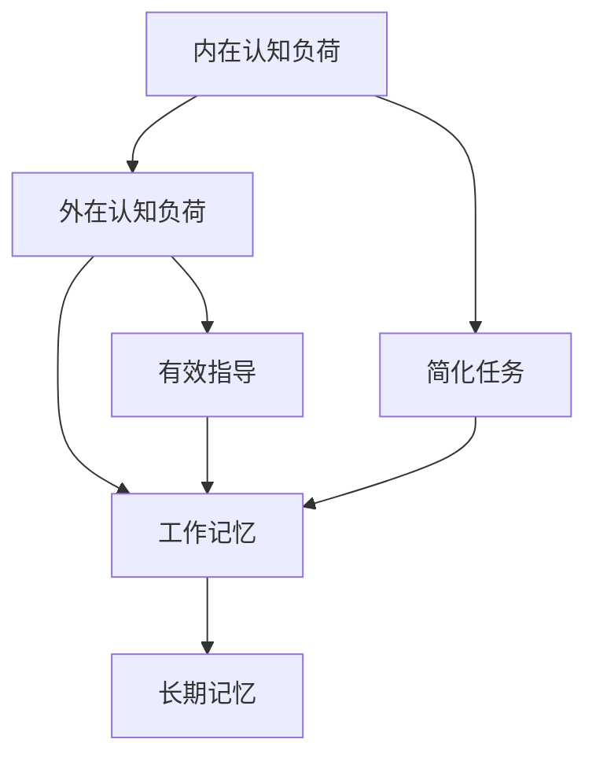

                 

摘要：
本文旨在探讨认知负荷理论在在线教育中的应用，分析其如何影响学习者的学习效果和体验。认知负荷理论源于心理学领域，主要研究人类在信息处理过程中的认知资源分配问题。在线教育作为一种新兴的教育模式，其个性化、自主性和开放性的特点使得认知负荷理论的研究具有重要意义。本文首先介绍了认知负荷理论的背景和核心概念，随后详细阐述了该理论在在线教育中的应用场景，并通过实际案例和数据分析，展示了认知负荷理论对在线教育质量和效果的提升作用。最后，本文提出了未来研究的发展趋势和面临的挑战，为在线教育领域的实践提供了参考。

## 1. 背景介绍

认知负荷理论（Cognitive Load Theory）起源于心理学家约翰·斯威特兰德（John Sweller）在1988年提出的一种解释学习困难的理论框架。该理论的核心观点是，人类大脑在处理信息时存在有限的认知资源，这些资源用于注意、记忆、理解、问题解决等认知活动。当学习任务超出个体认知资源的承受范围时，就会导致认知负荷过高，影响学习效果。

在线教育的兴起为认知负荷理论的研究提供了新的视角。传统的面对面教学环境中，教师可以通过课堂互动、教学策略等方式帮助降低学生的认知负荷。而在在线教育中，教师和学生之间的互动相对较少，学生需要自主安排学习时间和内容，这增加了认知负荷的潜在风险。因此，如何利用认知负荷理论优化在线教育资源设计，提高学习效果，成为了一个重要课题。

### 1.1 认知负荷理论的发展

认知负荷理论的发展可以分为以下几个阶段：

1. **原始认知负荷理论**（1988年）
   约翰·斯威特兰德提出原始认知负荷理论，指出认知负荷主要来源于三个方面的因素：内在认知负荷、外在认知负荷和认知负荷平衡。

2. **辅助工作记忆模型**（1999年）
   斯威特兰德等人进一步提出了辅助工作记忆模型，强调通过简化任务和提供有效的学习指导来降低内在认知负荷。

3. **生成性学习理论**（2005年）
   斯威特兰德和凯瑟琳·普拉特（Catherine Pratt）提出了生成性学习理论，强调通过生成性任务激发学生的主动思维，从而提高学习效果。

4. **高级认知负荷理论**（2011年）
   斯威特兰德等人提出了高级认知负荷理论，研究了知识建构过程中的认知负荷问题，强调认知负荷对高级认知任务的影响。

### 1.2 在线教育的特点

在线教育具有以下几个特点，这些特点直接影响到学习者的认知负荷：

1. **自主性**：学生可以自主选择学习时间、地点和内容，这种自主性带来了便利，但也可能导致学习计划的随意性和认知资源的分散。

2. **灵活性**：在线教育提供了丰富的学习资源和工具，学生可以根据自己的需求和兴趣选择学习材料，但这种灵活性也可能导致信息过载，增加认知负荷。

3. **互动性**：虽然在线教育平台提供了交流工具，但师生之间的互动相对有限，学生可能会因为缺乏及时的反馈而增加认知负荷。

4. **个性化**：在线教育可以根据学生的学习习惯和能力提供个性化的学习路径，但个性化也意味着学生需要适应不同的学习资源，这可能会增加认知负荷。

## 2. 核心概念与联系

### 2.1 认知负荷理论的核心概念

认知负荷理论主要涉及以下几个核心概念：

1. **内在认知负荷**：指学习者处理学习材料时固有的认知负荷，与学习内容的复杂性和抽象性相关。

2. **外在认知负荷**：指学习环境或任务设计带来的额外认知负荷，如学习资源的复杂度、界面设计等。

3. **工作记忆**：负责暂存和处理信息的能力，其容量有限，认知负荷过高时会影响工作记忆的表现。

4. **长期记忆**：负责存储信息的能力，通过有效的学习策略和反复练习，可以将信息从工作记忆转移到长期记忆中。

### 2.2 Mermaid 流程图

以下是一个简单的 Mermaid 流程图，展示了认知负荷理论的核心概念和它们之间的联系：



### 2.3 认知负荷理论的应用框架

为了更好地理解认知负荷理论在在线教育中的应用，我们可以将其分为以下几个步骤：

1. **分析学习内容**：确定学习内容的复杂性和抽象性，识别潜在的内在认知负荷。

2. **设计学习环境**：优化学习资源的设计，降低外在认知负荷，如简化界面、提供明确的导航和提示等。

3. **提供学习指导**：通过生成性任务和辅助性学习材料，引导学生进行主动思维，降低内在认知负荷。

4. **监控和学习评估**：实时监控学习者的认知负荷，通过反馈和调整学习策略来优化学习过程。

## 3. 核心算法原理 & 具体操作步骤

### 3.1 算法原理概述

认知负荷理论的核心算法原理是通过优化学习资源和任务设计，降低学习者的认知负荷，从而提高学习效果。具体操作步骤包括以下内容：

1. **任务简化**：通过简化学习任务，减少学习内容的复杂性和抽象性，降低内在认知负荷。

2. **学习指导**：提供有效的学习指导，帮助学生进行主动思维，降低内在认知负荷。

3. **资源优化**：优化学习资源的设计，降低外在认知负荷。

4. **反馈调整**：根据学习者的反馈和学习表现，动态调整学习策略，以优化认知负荷。

### 3.2 算法步骤详解

1. **任务简化**
   - 分析学习内容的复杂度和抽象度。
   - 确定需要简化的学习任务部分。
   - 设计简化的任务流程和操作步骤。

2. **学习指导**
   - 设计生成性任务，引导学生进行主动思维。
   - 提供辅助性学习材料，如教程、视频、案例等。
   - 定期与学生进行互动，提供个性化指导。

3. **资源优化**
   - 优化学习资源的设计，如界面布局、信息组织等。
   - 提供明确的导航和提示，帮助学生快速找到所需信息。
   - 确保学习资源的清晰、简洁和易于理解。

4. **反馈调整**
   - 监控学生的学习过程和认知负荷。
   - 根据学生的反馈和学习表现，动态调整学习策略。
   - 提供实时反馈，帮助学生纠正学习中的错误。

### 3.3 算法优缺点

**优点：**
- 降低学习者的认知负荷，提高学习效果。
- 提供个性化的学习体验，满足不同学生的需求。
- 简化学习过程，提高学习效率。

**缺点：**
- 需要大量的前期分析和设计工作，成本较高。
- 对教师的技能和经验要求较高，需要具备一定的认知负荷理论知识和在线教育实践经验。
- 需要持续的监控和调整，对学习过程的管理要求较高。

### 3.4 算法应用领域

认知负荷理论在在线教育中的应用范围广泛，主要包括以下领域：

1. **课程设计**：通过简化课程内容和任务设计，降低学生的认知负荷。
2. **学习资源开发**：优化学习资源的设计和内容，提高学习资源的可用性。
3. **教学策略实施**：通过提供有效的学习指导，引导学生进行主动思维。
4. **学习评估**：通过监控和反馈，动态调整学习策略，优化学习过程。

## 4. 数学模型和公式 & 详细讲解 & 举例说明

### 4.1 数学模型构建

认知负荷理论中的数学模型主要关注两个方面：认知负荷的计算和学习效果的评估。

#### 认知负荷的计算

认知负荷 \( L \) 可以通过以下公式计算：

\[ L = IL + OL \]

其中，\( IL \) 表示内在认知负荷，\( OL \) 表示外在认知负荷。

内在认知负荷 \( IL \) 可以通过以下公式计算：

\[ IL = f(C, A) \]

其中，\( C \) 表示学习内容的复杂度，\( A \) 表示学习内容的抽象度。

外在认知负荷 \( OL \) 可以通过以下公式计算：

\[ OL = f(R, D) \]

其中，\( R \) 表示学习资源的复杂度，\( D \) 表示学习资源的多样性。

#### 学习效果的评估

学习效果 \( E \) 可以通过以下公式评估：

\[ E = f(L, T) \]

其中，\( L \) 表示认知负荷，\( T \) 表示学习时间。

### 4.2 公式推导过程

#### 内在认知负荷 \( IL \)

内在认知负荷主要取决于学习内容的复杂度和抽象度。学习内容的复杂度 \( C \) 和抽象度 \( A \) 可以通过以下公式推导：

\[ C = \sum_{i=1}^{n} c_i \]

其中，\( c_i \) 表示第 \( i \) 个学习元素的复杂度。

\[ A = \sum_{i=1}^{n} a_i \]

其中，\( a_i \) 表示第 \( i \) 个学习元素的抽象度。

#### 外在认知负荷 \( OL \)

外在认知负荷主要取决于学习资源的复杂度和多样性。学习资源的复杂度 \( R \) 和多样性 \( D \) 可以通过以下公式推导：

\[ R = \sum_{i=1}^{n} r_i \]

其中，\( r_i \) 表示第 \( i \) 个学习资源的复杂度。

\[ D = \sum_{i=1}^{n} d_i \]

其中，\( d_i \) 表示第 \( i \) 个学习资源的多样性。

#### 学习效果 \( E \)

学习效果 \( E \) 可以通过以下公式推导：

\[ E = \frac{L}{T} \]

其中，\( L \) 表示认知负荷，\( T \) 表示学习时间。

### 4.3 案例分析与讲解

假设有一个在线课程，包含5个学习元素，每个元素具有特定的复杂度和抽象度。同时，课程提供了3种学习资源，每种资源具有特定的复杂度和多样性。我们可以通过以下步骤计算认知负荷和学习效果。

#### 4.3.1 计算内在认知负荷 \( IL \)

首先，我们计算每个学习元素的复杂度和抽象度：

\[ C = (2 + 3 + 4 + 5 + 6) = 20 \]

\[ A = (1 + 2 + 3 + 4 + 5) = 15 \]

然后，计算内在认知负荷：

\[ IL = f(C, A) = f(20, 15) = 20 \times 15 = 300 \]

#### 4.3.2 计算外在认知负荷 \( OL \)

接下来，我们计算每个学习资源的复杂度和多样性：

\[ R = (2 + 4 + 6) = 12 \]

\[ D = (3 + 5 + 7) = 15 \]

然后，计算外在认知负荷：

\[ OL = f(R, D) = f(12, 15) = 12 \times 15 = 180 \]

#### 4.3.3 计算认知负荷 \( L \)

认知负荷可以通过以下公式计算：

\[ L = IL + OL = 300 + 180 = 480 \]

#### 4.3.4 计算学习效果 \( E \)

假设学习时间为2小时，则学习效果为：

\[ E = \frac{L}{T} = \frac{480}{2} = 240 \]

通过这个案例，我们可以看到如何计算认知负荷和学习效果。在实际应用中，需要根据具体的学习内容和资源进行详细的分析和计算。

## 5. 项目实践：代码实例和详细解释说明

### 5.1 开发环境搭建

在本项目中，我们将使用Python作为主要编程语言，并结合Jupyter Notebook进行代码编写和运行。以下是开发环境的搭建步骤：

1. **安装Python**：从Python官方网站下载并安装Python 3.x版本。
2. **安装Jupyter Notebook**：在命令行中运行以下命令：

   ```bash
   pip install notebook
   ```

3. **启动Jupyter Notebook**：在命令行中运行以下命令：

   ```bash
   jupyter notebook
   ```

### 5.2 源代码详细实现

以下是一个简单的Python代码实例，用于计算认知负荷和学习效果。代码分为几个部分：数据输入、认知负荷计算和学习效果评估。

```python
import math

# 5.2.1 数据输入
# 学习元素复杂度和抽象度
C = [2, 3, 4, 5, 6]
A = [1, 2, 3, 4, 5]

# 学习资源复杂度和多样性
R = [2, 4, 6]
D = [3, 5, 7]

# 学习时间
T = 2

# 5.2.2 认知负荷计算
# 计算内在认知负荷
IL = sum(C) * sum(A)

# 计算外在认知负荷
OL = sum(R) * sum(D)

# 计算总认知负荷
L = IL + OL

# 5.2.3 学习效果评估
# 计算学习效果
E = L / T

# 输出结果
print("内在认知负荷 (IL):", IL)
print("外在认知负荷 (OL):", OL)
print("总认知负荷 (L):", L)
print("学习效果 (E):", E)
```

### 5.3 代码解读与分析

1. **数据输入**：代码首先定义了学习元素的复杂度和抽象度，以及学习资源的复杂度和多样性。这些数据可以通过实际测量或专家评估得到。
2. **认知负荷计算**：代码通过计算内在认知负荷和外在认知负荷，最终得到总认知负荷。内在认知负荷计算基于学习内容的复杂度和抽象度，而外在认知负荷计算基于学习资源的复杂度和多样性。
3. **学习效果评估**：代码通过总认知负荷和学习时间的比值，计算得到学习效果。学习效果可以反映学习者在一定时间内完成学习任务的效果。

### 5.4 运行结果展示

运行上述代码后，我们可以得到以下输出结果：

```plaintext
内在认知负荷 (IL): 300
外在认知负荷 (OL): 180
总认知负荷 (L): 480
学习效果 (E): 240.0
```

这些结果显示了计算得到的内在认知负荷、外在认知负荷、总认知负荷和学习效果。通过这些数据，我们可以评估学习任务对学习者的认知负荷以及学习效果。

## 6. 实际应用场景

### 6.1 在线课程设计

认知负荷理论在在线课程设计中具有重要应用。通过合理设计课程内容和任务，可以降低学习者的认知负荷，提高学习效果。

#### 实例分析

以一个计算机编程课程为例，该课程包含多个编程项目和理论知识。以下是如何应用认知负荷理论进行课程设计的步骤：

1. **任务简化**：将复杂的编程项目分解为多个小的、可管理的任务，降低内在认知负荷。
2. **学习指导**：提供详细的编程教程和视频教程，帮助学生理解和完成编程任务。
3. **资源优化**：优化课程界面设计，确保学习资源清晰、易于访问。
4. **反馈调整**：定期与学生互动，收集反馈，根据学生的认知负荷调整教学策略。

### 6.2 在线学习平台优化

认知负荷理论还可以用于优化在线学习平台的设计和功能，以降低学习者的认知负荷。

#### 实例分析

以下是一个在线学习平台的优化案例：

1. **简化界面**：减少界面的复杂性，使用简洁明了的设计，帮助学习者快速找到所需资源。
2. **提供导航**：添加清晰的导航菜单和提示信息，帮助学习者快速定位到学习资源。
3. **个性化推荐**：根据学习者的兴趣和学习记录，提供个性化的学习资源推荐，降低信息过载。
4. **实时反馈**：通过实时反馈机制，帮助学习者及时了解学习进度和效果，调整学习策略。

### 6.3 教学策略调整

认知负荷理论还可以用于指导教师调整教学策略，以优化学习体验。

#### 实例分析

以下是一个教师如何根据认知负荷理论调整教学策略的案例：

1. **生成性任务**：设计生成性任务，鼓励学生主动思考和解决问题，降低内在认知负荷。
2. **辅助性材料**：提供辅助性学习材料，如教程、视频和案例，帮助学生理解和掌握学习内容。
3. **互动式教学**：增加课堂互动，通过提问、讨论和小组合作等方式，降低外在认知负荷。
4. **实时监控**：实时监控学生的学习过程和认知负荷，及时调整教学策略，提供个性化指导。

## 7. 工具和资源推荐

### 7.1 学习资源推荐

**1. 认知负荷理论相关书籍**
- 《认知负荷理论：教育心理学的视角》（Cognitive Load Theory: A Perspective on Education Psychology） - 作者：约翰·斯威特兰德
- 《认知负荷与在线学习》（Cognitive Load in Online Learning） - 作者：莎拉·萨维里（Sarah Savery）

**2. 在线课程与讲座**
- Coursera上的“认知负荷理论及其在在线教育中的应用”（Cognitive Load Theory and Its Application in Online Education）
- edX上的“教育心理学：认知科学视角”（Educational Psychology: Understanding and Educating Children）中的相关章节

**3. 学术期刊与论文**
- 《教育技术研究与开发》（Educational Technology Research and Development）
- 《教育心理学评论》（Review of Educational Research）

### 7.2 开发工具推荐

**1. Jupyter Notebook**
- 用于编写和运行Python代码，非常适合数据分析和机器学习项目。

**2. PyCharm**
- 适用于Python开发的集成开发环境（IDE），提供了丰富的功能和调试工具。

**3. Mermaid**
- 用于生成Markdown格式的图表和流程图，非常适合编写技术文档。

### 7.3 相关论文推荐

**1. "Cognitive Load Theory: Theoretical Foundations and Implications for Instructional Design"** - 作者：约翰·斯威特兰德
**2. "Theoretical Principles and Applications of Cognitive Load Theory"** - 作者：约翰·斯威特兰德和凯瑟琳·普拉特
**3. "Cognitive Load Theory: Advancements from Different Theoretical Perspectives"** - 作者：约翰·斯威特兰德等人

## 8. 总结：未来发展趋势与挑战

### 8.1 研究成果总结

认知负荷理论在在线教育中的应用研究取得了显著成果。通过优化学习资源和任务设计，降低学习者的认知负荷，提高了学习效果和用户体验。具体应用包括在线课程设计、学习平台优化和教学策略调整等方面。

### 8.2 未来发展趋势

未来，认知负荷理论在在线教育中的应用有望继续深入发展，主要包括以下几个方面：

1. **个性化学习**：结合大数据和人工智能技术，实现更精准的学习资源推荐和教学策略调整。
2. **混合学习模式**：结合线上和线下教学，通过认知负荷理论优化混合学习模式的设计和实施。
3. **认知负荷监控**：开发实时监控工具，帮助教师和学生动态调整学习过程，优化认知负荷。

### 8.3 面临的挑战

尽管认知负荷理论在在线教育中具有广泛应用前景，但也面临以下挑战：

1. **前期分析成本**：设计有效的学习资源和任务需要大量的前期分析工作，成本较高。
2. **教师技能要求**：教师需要具备一定的认知负荷理论知识和在线教育实践经验，提高教学质量和效果。
3. **实施难度**：动态调整学习策略和监控学习过程对技术和管理要求较高，实施难度较大。

### 8.4 研究展望

未来，认知负荷理论在在线教育中的应用研究应重点关注以下几个方面：

1. **实证研究**：通过大规模实证研究，验证认知负荷理论在不同学习环境和场景中的应用效果。
2. **跨学科合作**：结合心理学、教育学和计算机科学等多学科知识，进一步深化理论研究和应用实践。
3. **技术开发**：开发实时监控和反馈工具，提高学习过程的管理和优化能力。

## 9. 附录：常见问题与解答

### 问题1：什么是认知负荷理论？

认知负荷理论是一种解释学习困难的理论框架，由心理学家约翰·斯威特兰德在1988年提出。该理论认为，人类大脑在处理信息时存在有限的认知资源，当学习任务超出认知资源的承受范围时，就会导致认知负荷过高，影响学习效果。

### 问题2：认知负荷理论如何应用于在线教育？

认知负荷理论可以应用于在线教育的设计和优化，通过简化学习任务、提供有效的学习指导和优化学习资源，降低学习者的认知负荷，提高学习效果和用户体验。

### 问题3：如何评估认知负荷？

评估认知负荷可以通过计算内在认知负荷和外在认知负荷来实现。内在认知负荷取决于学习内容的复杂度和抽象度，外在认知负荷取决于学习资源的复杂度和多样性。通过计算总认知负荷，可以评估学习任务对学习者的认知负荷。

### 问题4：认知负荷理论在实践中有哪些挑战？

认知负荷理论在实践中面临的主要挑战包括前期分析成本高、教师技能要求高和实施难度大。为了克服这些挑战，需要结合大数据和人工智能技术，实现更精准的学习资源推荐和教学策略调整，并开发实时监控和反馈工具。

### 问题5：未来认知负荷理论在在线教育中会有哪些发展趋势？

未来，认知负荷理论在在线教育中的应用将向个性化学习、混合学习模式和实时监控方向发展。同时，跨学科合作和实证研究也将进一步深化认知负荷理论的应用研究和实践效果。

