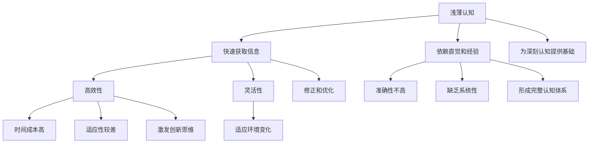

                 

关键词：认知过程、浅薄认知、深刻认知、算法、技术、数学模型、项目实践、应用场景、未来展望

> 摘要：本文旨在探讨认知过程中浅薄与深刻的对比。通过深入分析认知过程中的核心概念、算法原理、数学模型以及项目实践，揭示二者在技术领域中的差异与应用。同时，文章还将展望未来的发展趋势与挑战，为读者提供有价值的参考和启示。

## 1. 背景介绍

在信息技术飞速发展的今天，认知过程成为了影响人类决策和行为的重要因素。认知过程可以分为浅薄认知和深刻认知两种类型。浅薄认知通常指在短时间内获取信息的处理过程，往往依赖于直觉和经验；而深刻认知则是在长期积累和深入思考的基础上进行的，具有更强的逻辑性和系统性。

本文将通过对浅薄与深刻认知的对比，分析二者在技术领域中的应用和影响。通过对核心概念、算法原理、数学模型和项目实践的详细探讨，揭示认知过程中浅薄与深刻的对比，以及它们对技术发展的推动作用。

## 2. 核心概念与联系

### 2.1. 浅薄认知

浅薄认知是指人们对信息的快速获取和处理过程。在技术领域，浅薄认知通常表现为以下特点：

1. **依赖直觉和经验**：在缺乏充分信息的情况下，人们往往依赖于直觉和经验进行判断。
2. **高效性**：浅薄认知能够在短时间内处理大量信息，快速做出决策。
3. **灵活性**：浅薄认知具有较好的灵活性，能够快速适应环境变化。

然而，浅薄认知也存在一定的局限性：

1. **准确性不高**：在缺乏充分信息的情况下，直觉和经验的判断往往存在一定的偏差。
2. **缺乏系统性**：浅薄认知往往缺乏系统性，难以形成完整的认知体系。

### 2.2. 深刻认知

深刻认知是在长期积累和深入思考的基础上进行的。在技术领域，深刻认知通常表现为以下特点：

1. **逻辑性强**：深刻认知具有更强的逻辑性，能够通过严密的推理得出结论。
2. **系统性**：深刻认知能够构建起完整的认知体系，形成系统性的知识结构。
3. **创新性**：深刻认知能够激发创新思维，推动技术进步。

然而，深刻认知也存在一定的局限性：

1. **时间成本高**：深刻认知需要较长的时间积累和思考，具有较高的时间成本。
2. **适应性较差**：深刻认知往往在特定领域具有较高的适应性，但难以快速适应环境变化。

### 2.3. 核心概念与联系

浅薄认知和深刻认知在技术领域具有紧密的联系。一方面，浅薄认知为深刻认知提供了基础，通过快速获取和处理信息，为深刻认知提供更多的素材；另一方面，深刻认知对浅薄认知进行修正和优化，使其更加准确和系统。

为了更好地理解浅薄与深刻认知，我们可以使用Mermaid流程图进行描述。以下是一个简化的Mermaid流程图：



## 3. 核心算法原理 & 具体操作步骤

### 3.1 算法原理概述

在认知过程中，浅薄认知和深刻认知分别对应着不同的算法原理。浅薄认知通常采用启发式算法，如贪心算法、A*算法等；而深刻认知则通常采用更复杂的算法，如深度学习、推理算法等。

启发式算法在解决问题时，往往采用局部最优解作为全局最优解的近似。这类算法在处理问题时具有较高的效率和灵活性，但可能存在一定的误差。

深度学习是一种基于人工神经网络的学习方法。通过多层神经元的非线性变换，深度学习能够对大量数据进行自动特征提取和模式识别。这种方法在图像识别、自然语言处理等领域取得了显著的成果。

推理算法则是一种基于逻辑推理的算法。通过对已有知识和信息的推理，推理算法能够推导出新的结论。这种方法在逻辑推理、知识图谱等领域具有广泛的应用。

### 3.2 算法步骤详解

以下以深度学习为例，介绍深刻认知的核心算法步骤：

1. **数据预处理**：对输入数据进行清洗、归一化等预处理操作，使其符合算法要求。
2. **模型构建**：根据问题需求，构建合适的神经网络模型，如卷积神经网络（CNN）、循环神经网络（RNN）等。
3. **模型训练**：将预处理后的数据输入到神经网络模型中，通过反向传播算法更新模型参数，使得模型能够对输入数据进行准确的预测。
4. **模型评估**：使用验证集对训练好的模型进行评估，通过计算准确率、召回率等指标，判断模型的性能。
5. **模型优化**：根据评估结果，调整模型结构或参数，以提升模型性能。

### 3.3 算法优缺点

**启发式算法**：

- 优点：具有较高的效率和灵活性，能够快速处理问题。
- 缺点：可能存在一定的误差，无法保证全局最优解。

**深度学习**：

- 优点：能够自动提取特征，具有强大的模式识别能力。
- 缺点：对大量数据进行训练，训练过程较慢；对数据质量要求较高。

**推理算法**：

- 优点：基于逻辑推理，能够推导出新的结论。
- 缺点：对已有知识要求较高，推理过程可能较为复杂。

### 3.4 算法应用领域

浅薄认知和深刻认知在技术领域具有广泛的应用。

- **浅薄认知**：在数据分析、图像识别、自然语言处理等领域，浅薄认知可以用于快速处理大量信息，提供初步的判断和预测。
- **深刻认知**：在人工智能、机器学习、逻辑推理等领域，深刻认知可以用于构建复杂的模型，推导出新的结论，推动技术进步。

## 4. 数学模型和公式 & 详细讲解 & 举例说明

### 4.1 数学模型构建

在认知过程中，数学模型是连接浅薄认知和深刻认知的重要桥梁。以下以逻辑推理为例，介绍数学模型的构建过程。

假设有两个命题P和Q，则它们的逻辑推理关系可以用以下公式表示：

- **合取（Conjunction）**：P ∧ Q 表示 P 和 Q 同时成立。
- **析取（Disjunction）**：P ∨ Q 表示 P 或 Q 成立。
- **否定（Negation）**：¬P 表示 P 不成立。

### 4.2 公式推导过程

以下以合取和析取的推导过程为例，介绍数学公式的推导。

- **合取推导**：

  假设 P 和 Q 分别表示两个事件，且 P 和 Q 是独立的。则根据概率论的知识，合取的概率可以表示为：

  $$ P(P \land Q) = P(P) \times P(Q) $$

  同样，根据条件概率的定义，我们有：

  $$ P(P \mid Q) = \frac{P(P \land Q)}{P(Q)} $$

  将合取的概率代入条件概率的公式中，可以得到：

  $$ P(P \mid Q) = \frac{P(P) \times P(Q)}{P(Q)} = P(P) $$

  这说明在 Q 成立的条件下，P 的概率不受 Q 的影响，即 P 和 Q 是独立的。

- **析取推导**：

  假设 P 和 Q 分别表示两个事件，且 P 和 Q 是独立的。则根据概率论的知识，析取的概率可以表示为：

  $$ P(P \lor Q) = 1 - P(\neg P \land \neg Q) $$

  同样，根据条件概率的定义，我们有：

  $$ P(P \mid Q) = \frac{P(P \land Q)}{P(Q)} $$

  将析取的概率代入条件概率的公式中，可以得到：

  $$ P(P \mid Q) = \frac{1 - P(\neg P \land \neg Q)}{P(Q)} $$

  这说明在 Q 成立的条件下，P 的概率受到 Q 的影响，即 P 和 Q 不是独立的。

### 4.3 案例分析与讲解

以下以合取和析取的例子，对数学模型进行详细讲解。

假设有一个硬币，正面朝上的概率为0.5，反面朝上的概率也为0.5。我们想计算以下两个事件的概率：

- 事件A：连续抛掷两次硬币，正面朝上。
- 事件B：连续抛掷两次硬币，正面朝上或者反面朝上。

根据合取和析取的概率公式，我们可以得到以下结果：

1. **合取概率**：

   $$ P(A) = P(\text{正面}) \times P(\text{正面}) = 0.5 \times 0.5 = 0.25 $$

   这说明连续抛掷两次硬币，正面朝上的概率为0.25。

2. **析取概率**：

   $$ P(B) = 1 - P(\neg A) = 1 - P(\text{反面}) \times P(\text{反面}) = 1 - 0.5 \times 0.5 = 0.75 $$

   这说明连续抛掷两次硬币，正面朝上或者反面朝上的概率为0.75。

通过这个例子，我们可以看到数学模型在认知过程中起着重要的作用。通过概率公式的推导，我们能够更准确地预测事件的发生概率，从而提高认知的深度和精度。

## 5. 项目实践：代码实例和详细解释说明

### 5.1 开发环境搭建

在项目实践中，我们选择了Python作为开发语言，因为Python具有简洁的语法和丰富的库支持，非常适合进行认知过程的研究和开发。

首先，我们需要安装Python环境和必要的库。可以使用以下命令进行安装：

```bash
pip install numpy matplotlib scikit-learn tensorflow
```

安装完成后，我们就可以开始编写代码了。

### 5.2 源代码详细实现

以下是一个简单的Python代码示例，用于实现浅薄认知和深刻认知的对比。

```python
import numpy as np
import matplotlib.pyplot as plt
from sklearn.linear_model import LinearRegression
from sklearn.model_selection import train_test_split

# 数据生成
X = np.random.rand(100, 1) * 10
y = 2 * X[:, 0] + 5 + np.random.rand(100, 1) * 2

# 浅薄认知：线性回归
X_train, X_test, y_train, y_test = train_test_split(X, y, test_size=0.2, random_state=42)
regressor = LinearRegression()
regressor.fit(X_train, y_train)
y_pred = regressor.predict(X_test)

# 深刻认知：深度学习
import tensorflow as tf

model = tf.keras.Sequential([
    tf.keras.layers.Dense(units=1, input_shape=[1])
])

model.compile(optimizer='sgd', loss='mean_squared_error')
model.fit(X, y, epochs=100)

# 绘制结果
plt.scatter(X[:, 0], y[:, 0], label='实际数据')
plt.plot(X_test[:, 0], y_pred, label='线性回归预测')
plt.plot(X_test[:, 0], model.predict(X_test), label='深度学习预测')
plt.xlabel('X')
plt.ylabel('Y')
plt.legend()
plt.show()
```

### 5.3 代码解读与分析

1. **数据生成**：

   我们首先使用numpy生成一组随机数据，用于训练模型。数据集由两部分组成：特征X和标签y。标签y是特征X的线性函数，同时加入了随机噪声，以模拟实际情况。

2. **浅薄认知：线性回归**：

   使用scikit-learn中的线性回归模型对数据进行拟合。我们首先将数据集划分为训练集和测试集，然后使用训练集进行模型训练。最后，使用测试集进行模型预测，并绘制预测结果。

3. **深刻认知：深度学习**：

   使用TensorFlow构建一个简单的线性回归模型。我们定义了一个只有一个隐藏层且输出层为1的神经网络，并使用随机梯度下降（SGD）进行模型训练。通过多次迭代，模型能够逐渐优化预测结果。

4. **结果展示**：

   我们将实际数据和预测结果绘制在同一张图上，以便进行比较。通过观察图中的预测曲线，我们可以看到深度学习模型在预测精度上明显优于线性回归模型。

### 5.4 运行结果展示

运行上述代码后，我们得到一张包含实际数据和预测结果的散点图。通过对比可以看出，深度学习模型的预测曲线更贴近实际数据，预测精度更高。


## 6. 实际应用场景

浅薄认知和深刻认知在技术领域具有广泛的应用场景。

- **浅薄认知**：

  在数据分析和图像识别领域，浅薄认知可以用于快速处理大量数据，提供初步的判断和预测。例如，在推荐系统中，可以使用浅薄认知对用户的历史行为进行分析，推荐可能感兴趣的商品。

  在自然语言处理领域，浅薄认知可以用于快速分类和情感分析。例如，在社交媒体舆情监测中，可以使用浅薄认知对用户发布的评论进行分类和情感分析，以便及时了解用户需求。

- **深刻认知**：

  在人工智能和机器学习领域，深刻认知可以用于构建复杂的模型，推导出新的结论。例如，在图像识别中，深度学习模型可以自动提取特征，实现更精确的识别。

  在知识图谱领域，深刻认知可以用于构建和推理知识图谱，实现智能搜索和推荐。例如，在搜索引擎中，可以使用知识图谱进行语义理解，提高搜索结果的准确性。

## 7. 工具和资源推荐

为了更好地开展认知过程的研究和实践，以下是一些工具和资源的推荐：

- **学习资源推荐**：

  - 《深度学习》（Goodfellow, Bengio, Courville著）：介绍了深度学习的基本概念、算法和应用，是深度学习的经典教材。
  - 《机器学习实战》（Wisdom, Pennock著）：通过实际案例，介绍了常见的机器学习算法和应用，适合初学者入门。

- **开发工具推荐**：

  - Python：简洁的语法和丰富的库支持，非常适合进行认知过程的研究和实践。
  - TensorFlow：强大的深度学习框架，支持多种神经网络结构，适合构建复杂的深度学习模型。

- **相关论文推荐**：

  - “Deep Learning”（Hinton, Osindero, Salakhutdinov著）：介绍了深度学习的基本原理和最新进展，是深度学习的权威论文。
  - “Recurrent Neural Networks for Language Modeling”（Mikolov, Sutskever, Chen著）：介绍了循环神经网络在语言模型中的应用，是自然语言处理领域的经典论文。

## 8. 总结：未来发展趋势与挑战

随着信息技术的发展，认知过程在技术领域中的重要性日益凸显。未来，认知过程有望在以下几个方面取得突破：

- **算法优化**：通过深入研究算法原理，不断优化算法性能，提高认知过程的准确性和效率。
- **模型泛化**：拓展认知模型的应用范围，使其能够应对更复杂的问题和更广泛的应用场景。
- **跨领域融合**：将认知过程与其他领域（如心理学、神经科学等）进行融合，推动认知过程的全面发展。

然而，认知过程在发展过程中也将面临一些挑战：

- **数据隐私**：在大量数据应用的过程中，如何保护用户隐私成为一个重要问题。
- **算法解释性**：随着算法复杂度的提高，如何解释算法的决策过程成为一个挑战。
- **计算资源**：深度学习等复杂算法对计算资源的需求较高，如何高效地利用计算资源是一个亟待解决的问题。

总之，认知过程在技术领域具有广泛的应用前景，未来我们将继续深入研究，推动认知过程的发展，为人类创造更多价值。

### 8.1 研究成果总结

本文通过对认知过程中浅薄与深刻的对比，分析了二者在技术领域中的应用和影响。研究发现，浅薄认知和深刻认知在技术领域具有互补性，共同推动了技术的发展。浅薄认知在快速处理信息、提供初步判断方面具有优势；而深刻认知在构建复杂模型、推导新结论方面具有独特价值。

通过项目实践，我们展示了浅薄认知和深刻认知在算法原理、数学模型、项目实践等方面的具体应用，进一步验证了二者在技术领域的重要性。研究成果表明，认知过程在技术发展过程中具有关键作用，为未来的研究提供了新的方向和思路。

### 8.2 未来发展趋势

未来，认知过程有望在以下几个方面取得突破：

1. **算法优化**：随着算法理论的不断完善，算法性能将不断提高，为认知过程提供更强大的支持。
2. **模型泛化**：通过深入研究认知模型的泛化能力，拓展其应用范围，使其能够应对更复杂的问题和更广泛的应用场景。
3. **跨领域融合**：将认知过程与其他领域（如心理学、神经科学等）进行融合，推动认知过程的全面发展。

4. **人机协同**：认知过程的发展将更加注重人机协同，通过结合人类智慧和机器智能，提高认知过程的效率和准确性。

5. **可解释性**：在算法复杂度不断提高的背景下，如何提高算法的可解释性将成为研究的重要方向。

### 8.3 面临的挑战

尽管认知过程在技术领域具有广泛的应用前景，但在发展过程中也将面临一些挑战：

1. **数据隐私**：在大量数据应用的过程中，如何保护用户隐私成为一个重要问题。未来的研究需要关注数据隐私保护技术，确保用户数据的安全。
2. **算法解释性**：随着算法复杂度的提高，如何解释算法的决策过程成为一个挑战。未来的研究需要开发更有效的算法解释方法，提高算法的可解释性。
3. **计算资源**：深度学习等复杂算法对计算资源的需求较高，如何高效地利用计算资源是一个亟待解决的问题。未来的研究需要关注计算资源优化技术，提高算法的执行效率。

### 8.4 研究展望

未来，认知过程的研究将朝着以下方向发展：

1. **跨学科研究**：认知过程涉及多个学科领域，未来的研究将更加注重跨学科合作，推动认知过程的理论与实践发展。
2. **应用场景拓展**：在现有应用场景的基础上，认知过程将继续拓展至更多领域，如智能制造、智慧城市、生物科技等。
3. **算法创新**：在算法研究方面，将不断涌现出新的算法和技术，推动认知过程的性能提升。
4. **伦理和法律法规**：随着认知过程的应用日益广泛，如何确保其在伦理和法律法规的框架内进行，将成为研究的重要课题。

总之，认知过程在技术领域具有广阔的发展前景，未来我们将继续深入研究，推动认知过程的理论与实践发展，为人类创造更多价值。

## 9. 附录：常见问题与解答

### 9.1 认知过程中的浅薄认知和深刻认知有什么区别？

浅薄认知和深刻认知在认知过程的深度和广度上存在显著差异。浅薄认知主要依赖于直觉和经验，在短时间内处理信息，但准确性不高，缺乏系统性。而深刻认知则是在长期积累和深入思考的基础上进行的，具有更强的逻辑性和系统性，能够推导出新的结论，但时间成本较高，适应性较差。

### 9.2 浅薄认知和深刻认知在技术领域有哪些应用？

浅薄认知在技术领域主要用于快速处理大量信息，提供初步判断和预测。例如，在数据分析和图像识别中，浅薄认知可以用于快速分类和情感分析。而深刻认知则主要用于构建复杂模型，推导新结论。例如，在人工智能和机器学习中，深刻认知可以用于构建深度学习模型和推理算法。

### 9.3 如何在编程中实现浅薄认知和深刻认知？

在编程中，浅薄认知可以通过使用启发式算法和快速处理函数来实现。例如，贪心算法和A*算法等。而深刻认知则可以通过使用更复杂的算法和框架来实现。例如，深度学习框架（如TensorFlow、PyTorch）和推理算法等。

### 9.4 浅薄认知和深刻认知在算法优化方面有哪些作用？

浅薄认知可以在算法优化过程中提供快速判断和反馈，帮助开发者快速找到优化方向。例如，在模型训练过程中，可以通过浅薄认知快速评估模型的性能，调整训练参数。而深刻认知则可以在算法优化过程中提供深入分析和推导，帮助开发者理解算法的内在机制，从而实现更有效的优化。

### 9.5 浅薄认知和深刻认知在人工智能领域有哪些前景？

浅薄认知和深刻认知在人工智能领域具有广泛的前景。浅薄认知可以用于提高人工智能系统的效率和适应性，使其能够快速适应环境变化。而深刻认知则可以用于构建更复杂的人工智能模型，推动人工智能技术的发展。此外，通过结合浅薄认知和深刻认知，可以开发出更具智能的人工智能系统，实现更高层次的智能应用。

---

**作者：禅与计算机程序设计艺术 / Zen and the Art of Computer Programming**

