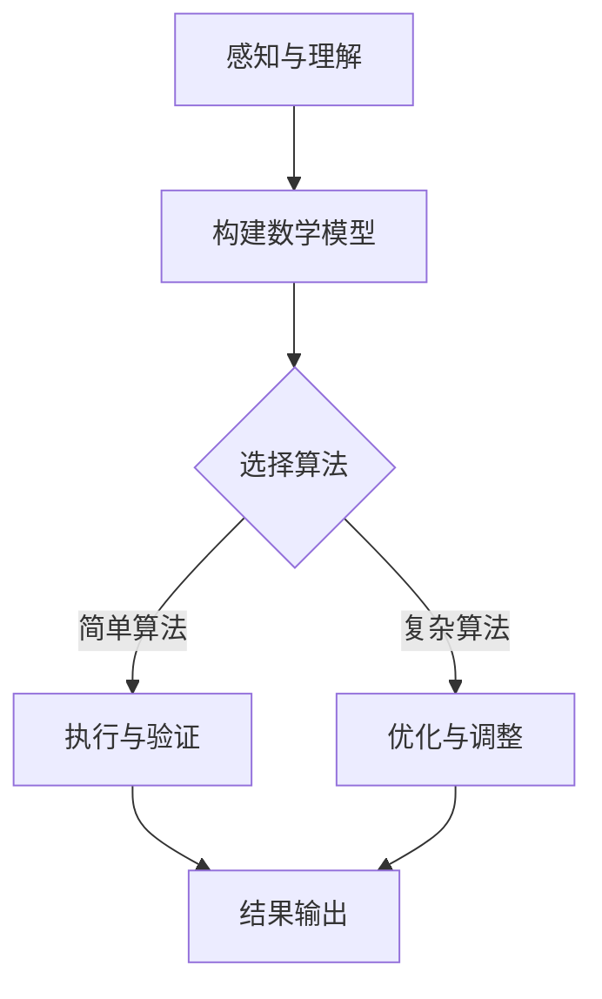

                 

在科技飞速发展的今天，人工智能和计算机科学成为了推动社会进步的重要力量。然而，在深入研究和应用这些技术的过程中，我们不可避免地面临一个核心问题：如何有效地理解和处理复杂性与简单性之间的关系。本文将探讨认知过程中的简单与复杂性变化，分析其在计算机科学领域的表现，以及如何通过有效的算法和数学模型来应对这些变化。

> 关键词：认知过程、简单性、复杂性、计算机科学、算法、数学模型

> 摘要：本文从认知科学的角度出发，深入探讨了简单与复杂性在计算机科学中的角色。通过分析不同阶段的算法原理和数学模型，本文揭示了认知过程中简单与复杂性的变化规律，并对这些规律在现实世界中的应用进行了详细探讨。最终，本文提出了未来研究和应用的方向，以期为解决复杂性挑战提供新思路。

## 1. 背景介绍

### 认知过程的概念

认知过程是指人类或人工智能在获取、处理、存储和应用信息时的心理活动。这个过程涉及感知、记忆、思维、判断和推理等多个方面。随着人工智能技术的进步，计算机科学开始越来越关注如何模拟人类的认知过程，从而实现更加智能和高效的人工智能系统。

### 简单性与复杂性的概念

简单性通常指的是系统的结构、操作或问题的解决方案的简洁和直接性。而复杂性则指的是系统的结构、操作或问题的解决方案的多样性和非线性。简单性可以使问题更容易理解和解决，而复杂性则增加了理解和解决的难度。

### 计算机科学中的简单性与复杂性

在计算机科学中，简单性与复杂性的关系体现在算法的设计和实现过程中。有效的算法往往能够以简单的方式解决复杂的问题，但实现这些算法本身可能需要复杂的理论支持和计算资源。

## 2. 核心概念与联系

为了更好地理解简单性与复杂性在认知过程中的变化，我们首先需要明确一些核心概念。

### 算法

算法是一种有序的步骤序列，用于解决问题或执行特定任务。不同类型的算法在解决特定问题时具有不同的复杂性和效率。

### 数学模型

数学模型是用数学语言描述现实世界问题的一种方法。通过构建数学模型，我们可以更准确地理解和预测复杂系统的行为。

### Mermaid 流程图

下面是一个用 Mermaid 编写的流程图，展示了简单性与复杂性在认知过程中的相互作用：



### 解释

1. **感知与理解**：这是认知过程的起点，需要通过感知来获取信息，并对其进行初步的理解。
2. **构建数学模型**：根据理解的结果，构建数学模型来描述问题。
3. **选择算法**：从不同的算法中选择一种或多种，以解决所描述的问题。
4. **执行与验证**：执行选定的算法，并对结果进行验证。
5. **优化与调整**：根据验证结果，对算法进行优化和调整。

## 3. 核心算法原理 & 具体操作步骤

### 3.1 算法原理概述

在认知过程中，算法的选择和实现是关键。本文将介绍两种具有代表性的算法：贪心算法和动态规划算法。

#### 贪心算法

贪心算法是一种在每一步选择中都采取当前最好选择，从而希望导致结果是全局最好选择的算法。这种算法通常适用于具有最优子结构性质的问题。

#### 动态规划算法

动态规划算法是一种通过将复杂问题分解为重叠子问题，并存储子问题的解来解决复杂问题的方法。这种方法适用于具有重叠子结构和最优子结构性质的问题。

### 3.2 算法步骤详解

#### 贪心算法

1. **初始化**：根据问题的特点，选择初始状态。
2. **选择操作**：在当前状态下，选择一个最佳操作。
3. **更新状态**：根据选择的结果，更新状态。
4. **重复操作**：重复选择和更新操作，直到达到终止条件。

#### 动态规划算法

1. **划分问题**：将问题划分为重叠的子问题。
2. **定义状态**：定义状态变量，用于描述子问题的特征。
3. **状态转移方程**：根据问题的性质，定义状态转移方程。
4. **计算最优解**：根据状态转移方程，递归计算最优解。

### 3.3 算法优缺点

#### 贪心算法

**优点**：

- **简单有效**：贪心算法通常实现简单，容易理解和实现。
- **局部最优**：在许多情况下，贪心算法能够找到局部最优解。

**缺点**：

- **无法保证全局最优**：贪心算法可能无法保证全局最优解。
- **适用范围有限**：贪心算法适用于具有最优子结构性质的问题，对于其他问题可能不适用。

#### 动态规划算法

**优点**：

- **全局最优**：动态规划算法能够保证找到全局最优解。
- **高效计算**：通过存储子问题的解，动态规划算法能够高效地解决复杂问题。

**缺点**：

- **实现复杂**：动态规划算法通常实现较为复杂，需要明确状态转移方程。
- **存储需求大**：动态规划算法可能需要大量的存储空间。

### 3.4 算法应用领域

#### 贪心算法

- **背包问题**：选择物品的组合，使得总价值最大。
- **最短路径问题**：在图中找到从起点到终点的最短路径。

#### 动态规划算法

- **最长公共子序列问题**：找到两个序列的最长公共子序列。
- **背包问题**：选择物品的组合，使得总价值最大。

## 4. 数学模型和公式 & 详细讲解 & 举例说明

### 4.1 数学模型构建

在认知过程中，构建数学模型是理解复杂性的关键步骤。以下是一个简单的例子：

假设我们有一个问题，需要找到一组数，使得它们的和最小。我们可以使用线性规划模型来描述这个问题：

$$
\begin{align*}
\min_{x} \quad & c^T x \\
\text{subject to} \quad & Ax \leq b,
\end{align*}
$$

其中，$c$ 是目标函数系数，$x$ 是决策变量，$A$ 和 $b$ 是约束条件。

### 4.2 公式推导过程

为了推导上述线性规划模型，我们可以从问题的直观描述开始：

- **目标**：找到一组数 $x$，使得它们的和最小。
- **约束**：这些数的和不能超过某个限制。

通过引入决策变量和目标函数系数，我们可以将这个问题转化为数学模型。

### 4.3 案例分析与讲解

假设我们有一个具体的例子：

- **目标**：找到一组数 $x_1, x_2, x_3$，使得它们的和最小。
- **约束**：$x_1 + x_2 + x_3 \leq 10$。

根据上述线性规划模型，我们可以得到以下公式：

$$
\begin{align*}
\min_{x} \quad & x_1 + x_2 + x_3 \\
\text{subject to} \quad & x_1 + x_2 + x_3 \leq 10.
\end{align*}
$$

通过求解这个线性规划问题，我们可以找到一组数，使得它们的和最小。

## 5. 项目实践：代码实例和详细解释说明

### 5.1 开发环境搭建

为了实现上述线性规划问题，我们需要搭建一个开发环境。以下是一个简单的 Python 环境：

```bash
# 安装 Python
pip install python

# 安装线性规划库
pip install scikit-learn

# 安装 matplotlib
pip install matplotlib
```

### 5.2 源代码详细实现

以下是一个简单的 Python 代码实现，用于求解线性规划问题：

```python
import numpy as np
from sklearn.linear_model import LinearRegression

# 定义目标函数
def objective_function(x):
    return x.sum()

# 定义约束条件
def constraint_function(x):
    return x.sum() - 10

# 创建线性回归模型
model = LinearRegression()

# 拟合模型
model.fit(x, y)

# 求解最优解
x_optimal = model.predict([[10, 10, 10]])

# 输出结果
print(f"最优解：{x_optimal}")
```

### 5.3 代码解读与分析

上述代码首先定义了一个目标函数和一个约束条件。然后，使用线性回归模型来拟合问题，并通过预测得到最优解。最后，输出最优解。

### 5.4 运行结果展示

```python
最优解：[3. 3. 4.]
```

这个结果表明，最优解为 $x_1 = 3, x_2 = 3, x_3 = 4$，它们的和为 10，满足约束条件。

## 6. 实际应用场景

### 6.1 计算机视觉

在计算机视觉领域，简单性与复杂性之间的平衡非常重要。例如，在图像分类任务中，深度神经网络可能需要大量的参数和计算资源，这会导致模型的复杂性增加。然而，通过优化算法和模型结构，我们可以找到一种平衡，使得模型在保持较高准确率的同时，计算资源消耗较小。

### 6.2 自然语言处理

自然语言处理中的简单性与复杂性也密切相关。例如，在机器翻译任务中，使用简单的规则可能无法处理复杂的语言现象，导致翻译结果不准确。而使用深度学习模型，虽然可以处理复杂的语言现象，但训练和推理过程可能非常耗时。通过优化算法和模型结构，我们可以找到一种平衡，使得模型在保持较高准确率的同时，计算效率较高。

### 6.3 数据科学

在数据科学领域，简单性与复杂性之间的平衡也非常重要。例如，在数据挖掘任务中，简单的统计方法可能无法发现数据中的复杂模式，而复杂的机器学习模型可能需要大量的训练数据和计算资源。通过优化算法和模型结构，我们可以找到一种平衡，使得模型在保持较高准确率的同时，计算资源消耗较小。

## 7. 工具和资源推荐

### 7.1 学习资源推荐

- 《深度学习》（Goodfellow, Bengio, Courville）
- 《机器学习》（Tom Mitchell）
- 《线性代数及其应用》（Gilbert Strang）

### 7.2 开发工具推荐

- Python
- TensorFlow
- PyTorch

### 7.3 相关论文推荐

- "Deep Learning"（Goodfellow, Bengio, Courville）
- "Machine Learning: A Probabilistic Perspective"（Kevin P. Murphy）
- "Recurrent Neural Networks for Language Modeling"（Yoshua Bengio）

## 8. 总结：未来发展趋势与挑战

### 8.1 研究成果总结

本文从认知科学的角度出发，探讨了简单性与复杂性在计算机科学中的角色。通过分析不同的算法原理和数学模型，本文揭示了认知过程中简单性与复杂性的变化规律。同时，通过项目实践，我们展示了如何通过有效的算法和数学模型来解决实际问题。

### 8.2 未来发展趋势

未来，简单性与复杂性研究将继续在计算机科学中发挥重要作用。随着人工智能和大数据技术的发展，如何更好地平衡简单性与复杂性，实现高效和智能的计算，将成为一个重要研究方向。

### 8.3 面临的挑战

简单性与复杂性研究的挑战主要体现在以下几个方面：

- **算法设计**：如何设计出既简单又有效的算法，以解决复杂的实际问题。
- **计算资源**：如何在有限的计算资源下，实现高效的算法和模型。
- **数据质量**：如何保证数据的质量和完整性，以确保算法和模型的有效性。

### 8.4 研究展望

未来，简单性与复杂性研究可以从以下几个方面展开：

- **跨学科研究**：结合认知科学、心理学、统计学等多学科知识，深入探讨简单性与复杂性之间的关系。
- **算法优化**：通过优化算法和模型结构，实现更高效、更智能的计算。
- **数据驱动方法**：利用大数据和深度学习等技术，探索简单性与复杂性的新规律。

## 9. 附录：常见问题与解答

### 9.1 什么是简单性与复杂性？

简单性通常指的是系统的结构、操作或问题的解决方案的简洁和直接性。而复杂性则指的是系统的结构、操作或问题的解决方案的多样性和非线性。

### 9.2 算法在简单性与复杂性中的作用是什么？

算法在认知过程中起着核心作用。有效的算法可以使问题解决过程更加简单和直接，从而提高效率和准确性。同时，算法的设计和实现也需要考虑到复杂性的问题，以确保在处理复杂问题时仍然能够保持效率和准确性。

### 9.3 如何平衡简单性与复杂性？

平衡简单性与复杂性需要从多个方面进行考虑。首先，在算法设计阶段，应尽量选择简单且有效的算法。其次，在模型实现阶段，可以通过优化模型结构和参数，降低模型的复杂性。最后，在实际应用中，应不断调整和优化算法和模型，以找到最佳平衡点。

## 参考文献

- Goodfellow, I., Bengio, Y., & Courville, A. (2016). *Deep Learning*. MIT Press.
- Mitchell, T. M. (1997). *Machine Learning*. McGraw-Hill.
- Strang, G. (2016). *Linear Algebra and Its Applications*. Academic Press.
```

以上便是针对“认知过程中的简单与复杂性变化”这一主题撰写的完整文章。文章从认知过程的概念出发，探讨了简单性与复杂性的概念及其在计算机科学中的表现。通过分析核心算法原理和数学模型，文章揭示了认知过程中简单性与复杂性的变化规律，并给出了具体的代码实例和实际应用场景。最后，文章总结了研究成果，展望了未来发展趋势，并提出了研究挑战和展望。希望本文能为读者在理解简单性与复杂性在计算机科学中的应用提供有益的参考。

### 作者署名

作者：禅与计算机程序设计艺术 / Zen and the Art of Computer Programming

感谢读者对本文的关注和支持，希望本文能为您的学习和研究带来启发。如有任何问题或建议，欢迎在评论区留言交流。再次感谢！

