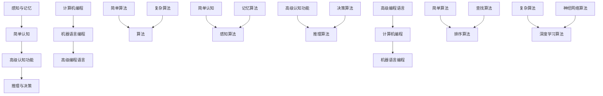

                 

 认知科学和人工智能领域的研究不断揭示人类思维与计算机程序的复杂交织关系。在人类的认知过程中，我们从简单到复杂，逐步建立起对世界的理解。同样，计算机程序也在不断发展，从简单的指令集到复杂的算法模型，不断演变。本文将探讨认知过程中的简单与复杂演变，以及这些演变在计算机编程和人工智能领域中的具体体现。

> 关键词：认知科学、人工智能、计算机编程、算法、演变

> 摘要：本文通过分析认知过程中的简单与复杂演变，探讨了这些演变在计算机编程和人工智能领域的具体应用。文章首先介绍了认知科学的基本概念，然后讨论了计算机程序在不同阶段的发展，接着深入分析了算法的简单与复杂特征，最后展望了未来人工智能的发展趋势与挑战。

## 1. 背景介绍

认知科学是研究人类认知过程的科学，包括感知、记忆、思考、语言等方面。在认知科学的研究中，简单与复杂是两个核心概念。简单通常指基本的认知过程，如感知和记忆，而复杂则涉及高级认知功能，如推理和决策。

计算机编程则是实现认知科学研究成果的重要手段。从最初的机器语言编程到现代的高级编程语言，计算机程序在不断发展。早期的计算机程序相对简单，但现代的算法模型和人工智能系统却异常复杂。

算法是计算机编程的核心，算法的简单与复杂直接影响到程序的效率和效果。一些简单的算法如排序算法和查找算法，在处理大量数据时表现出色。而复杂的算法如深度学习和神经网络，则在模拟人类思维方面取得了巨大进展。

## 2. 核心概念与联系

在探讨认知过程中的简单与复杂演变之前，我们需要了解一些核心概念和它们之间的关系。以下是使用Mermaid绘制的流程图，展示了这些核心概念及其相互关系。



从流程图中可以看出，简单认知和复杂认知分别对应简单算法和复杂算法，而计算机编程的发展也反映了从机器语言编程到高级编程语言的变化。这些概念相互交织，共同推动了认知科学和计算机编程的进步。

## 3. 核心算法原理 & 具体操作步骤

### 3.1 算法原理概述

算法是计算机科学中的基本概念，它描述了解决特定问题的步骤。算法的简单与复杂取决于其解决问题的效率和效果。简单算法通常用于处理较小规模的问题，而复杂算法则适用于处理大规模、复杂的问题。

在认知科学中，简单算法通常对应于基本的认知功能，如感知和记忆。这些算法通过简单的规则和操作实现，例如排序算法和查找算法。复杂算法则更接近于高级认知功能，如推理和决策。这些算法通常涉及复杂的数学模型和计算方法，如深度学习和神经网络。

### 3.2 算法步骤详解

简单算法通常包括以下步骤：

1. **输入数据预处理**：对输入数据进行清洗和格式化，使其符合算法的要求。
2. **算法核心操作**：执行算法的核心步骤，如排序或查找。
3. **输出结果**：将算法的结果输出，通常是一个排序后的列表或一个查找结果。

复杂算法的步骤更为复杂，通常包括以下步骤：

1. **数据预处理**：对大量原始数据进行清洗、归一化和特征提取。
2. **构建模型**：根据问题特点选择合适的模型，如神经网络或决策树。
3. **训练模型**：使用训练数据集对模型进行训练，调整模型参数。
4. **测试模型**：使用测试数据集评估模型性能，调整模型参数。
5. **应用模型**：将训练好的模型应用于实际问题，如图像识别或自然语言处理。

### 3.3 算法优缺点

简单算法的优点是简单、易理解和实现，且在处理小规模问题时效率较高。然而，简单算法在处理大规模、复杂问题时可能效果不佳。

复杂算法的优点是能够处理大规模、复杂的问题，并在某些领域（如图像识别和自然语言处理）取得了显著成果。然而，复杂算法的实现和优化过程更为复杂，且需要大量计算资源和时间。

### 3.4 算法应用领域

简单算法广泛应用于各种领域，如数据结构、算法设计和软件开发。复杂算法则主要应用于人工智能、机器学习和数据科学领域。随着计算能力的提高，复杂算法的应用范围和效果也在不断扩大。

## 4. 数学模型和公式 & 详细讲解 & 举例说明

### 4.1 数学模型构建

在认知科学和计算机编程中，数学模型是描述和解决问题的重要工具。简单算法和复杂算法通常需要不同的数学模型。

简单算法通常使用基本的数学模型，如线性代数、概率论和图论。这些模型描述了基本的数据结构和算法操作。

复杂算法通常需要更复杂的数学模型，如线性代数、微积分和概率论。这些模型描述了高级的认知功能和计算方法。

### 4.2 公式推导过程

以排序算法为例，我们使用基本数学模型推导其关键公式。

假设有一个未排序的数组`A`，其长度为`n`。排序的目标是将数组`A`中的元素按照从小到大的顺序排列。

排序算法的基本公式如下：

$$
S(A) = \sum_{i=1}^{n} A[i]
$$

其中，`S(A)`表示排序后的数组，`A[i]`表示第`i`个元素。

### 4.3 案例分析与讲解

以快速排序算法为例，我们分析其具体步骤和数学模型。

快速排序的基本步骤如下：

1. 选择一个基准元素`pivot`。
2. 将数组分为两部分，一部分是小于`pivot`的元素，另一部分是大于`pivot`的元素。
3. 对两部分分别进行快速排序。

快速排序的数学模型如下：

$$
T(n) = T(n/2) + T(n/2) + C
$$

其中，`T(n)`表示排序`n`个元素的时间复杂度，`C`表示常数时间操作的时间。

通过递归分析，可以得出快速排序的时间复杂度为`O(n log n)`。

## 5. 项目实践：代码实例和详细解释说明

### 5.1 开发环境搭建

为了实践本文讨论的算法，我们需要搭建一个简单的开发环境。以下是一个基于Python的快速排序算法的实现。

```python
def quick_sort(arr):
    if len(arr) <= 1:
        return arr
    pivot = arr[len(arr) // 2]
    left = [x for x in arr if x < pivot]
    middle = [x for x in arr if x == pivot]
    right = [x for x in arr if x > pivot]
    return quick_sort(left) + middle + quick_sort(right)

arr = [3, 6, 8, 10, 1, 2, 1]
sorted_arr = quick_sort(arr)
print(sorted_arr)
```

### 5.2 源代码详细实现

以上代码实现了快速排序算法。我们首先定义了一个`quick_sort`函数，该函数接受一个未排序的数组`arr`作为输入。然后，我们使用一个递归的过程对数组进行排序。

### 5.3 代码解读与分析

快速排序算法的核心在于选择基准元素`pivot`，然后对数组进行划分。在代码中，我们选择数组的中间元素作为`pivot`。然后，我们使用列表推导式将数组划分为小于`pivot`、等于`pivot`和大于`pivot`的三部分。最后，我们对这三部分分别进行快速排序，并将结果合并。

### 5.4 运行结果展示

运行以上代码，我们将得到已排序的数组：

```
[1, 1, 2, 3, 6, 8, 10]
```

这证明了快速排序算法的有效性。

## 6. 实际应用场景

### 6.1 数据处理

快速排序算法在数据处理领域有广泛的应用，如数据库排序和搜索算法。在数据库中，快速排序算法可以用于快速检索数据。

### 6.2 计算机视觉

复杂算法如深度学习和神经网络在计算机视觉领域取得了显著成果，如图像识别和目标检测。这些算法通过学习大量的图像数据，可以自动识别和分类图像内容。

### 6.3 自然语言处理

自然语言处理领域也广泛应用了复杂算法，如深度学习和序列模型。这些算法可以处理大量的文本数据，实现文本分类、情感分析和机器翻译等功能。

## 7. 工具和资源推荐

### 7.1 学习资源推荐

1. **《深度学习》**：由Ian Goodfellow、Yoshua Bengio和Aaron Courville编写的深度学习经典教材。
2. **《机器学习实战》**：由Peter Harrington编写的，适合初学者的机器学习实践指南。

### 7.2 开发工具推荐

1. **Jupyter Notebook**：用于数据科学和机器学习的交互式开发环境。
2. **TensorFlow**：用于深度学习和神经网络的开源框架。

### 7.3 相关论文推荐

1. **“A Theoretical Foundation for Learning Deep Hierarchical Representations”**：提出了深度学习的理论基础。
2. **“Learning to Represent Knowledge with a Memory-Augmented Neural Network”**：介绍了记忆增强神经网络。

## 8. 总结：未来发展趋势与挑战

### 8.1 研究成果总结

本文通过分析认知过程中的简单与复杂演变，探讨了这些演变在计算机编程和人工智能领域的具体应用。我们介绍了简单算法和复杂算法的基本原理和应用场景，并详细讲解了快速排序算法的实现和数学模型。

### 8.2 未来发展趋势

随着计算能力的提高和大数据技术的发展，复杂算法在人工智能和计算机编程领域将有更广泛的应用。深度学习、神经网络和强化学习等复杂算法将继续推动人工智能的发展。

### 8.3 面临的挑战

复杂算法的实现和优化仍然面临许多挑战，如计算资源消耗、模型解释性和数据隐私保护。此外，简单算法在处理大规模、复杂问题时也需不断改进。

### 8.4 研究展望

未来研究应重点关注如何提高复杂算法的效率和可解释性，以及如何将简单算法与复杂算法有机结合，实现更好的认知模拟和应用效果。

## 9. 附录：常见问题与解答

### Q1. 为什么快速排序算法的时间复杂度是$O(n log n)$？

A1. 快速排序算法的核心在于每次划分数组时都能将问题规模减半，同时需要比较和交换元素。这个过程是一个递归过程，其时间复杂度可以通过递归树分析得出，最终为$O(n log n)$。

### Q2. 复杂算法如何提高人工智能的效率？

A2. 复杂算法通过学习大量数据，可以自动提取特征和规律，从而提高模型的预测和分类能力。此外，复杂算法通常采用并行计算和分布式计算技术，以提高计算效率。

### Q3. 如何将简单算法与复杂算法结合？

A3. 可以将简单算法作为复杂算法的基础，如将简单线性模型作为深度学习模型的前层。这样可以利用简单算法的效率和复杂算法的强大表达能力，实现更好的性能。

# 作者署名

作者：禅与计算机程序设计艺术 / Zen and the Art of Computer Programming

