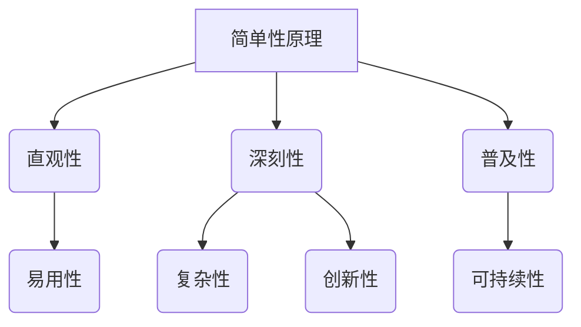

                 

关键词：认知过程、简单与深刻、技术思维、算法原理、数学模型、应用实践、未来展望

> 摘要：本文旨在探讨认知过程中简单与深刻的对比，通过分析技术领域中的核心概念、算法原理和数学模型，阐述在复杂问题的求解过程中，简单与深刻的辩证关系，以及它们在实践中的应用价值。

## 1. 背景介绍

在信息技术飞速发展的今天，计算机科学已经成为解决复杂问题的关键领域。无论是人工智能、大数据、云计算，还是区块链等前沿技术，都依赖于算法和数学模型的支撑。在这个过程中，认知过程起到了至关重要的作用。认知过程不仅决定了我们对技术概念的理解深度，还影响了我们解决实际问题的能力。

简单与深刻是认知过程中一对看似矛盾但又相互依存的概念。简单意味着直观、易于理解，而深刻则意味着复杂、深入。在技术领域中，简单与深刻的对比显得尤为突出。一方面，我们追求简单，因为简单意味着高效、易用和易于普及；另一方面，我们追求深刻，因为深刻意味着创新、突破和可持续性。本文将围绕这两个概念，深入探讨认知过程中的简单与深刻对比。

## 2. 核心概念与联系

为了更好地理解简单与深刻的对比，我们首先需要了解一些核心概念。以下是几个重要的概念和它们之间的联系：

### Mermaid 流程图：



### 2.1. 简单性原理

简单性原理是指在设计技术解决方案时，追求直观、易于理解的原则。简单性原理的核心在于将复杂问题分解为简单、可管理的部分，以便于理解和实现。

### 2.2. 直观性

直观性是指用户对技术解决方案的直观感受。一个直观的解决方案可以降低用户的认知负担，提高使用效率。

### 2.3. 易用性

易用性是指技术解决方案的易学、易用特性。易用性直接影响用户的体验，进而影响技术的普及和应用。

### 2.4. 深刻性

深刻性是指对技术解决方案的理解深度。深刻性通常与复杂性、创新性相关，深刻的理解有助于发现新问题和提出创新解决方案。

### 2.5. 复杂性

复杂性是指技术解决方案的复杂程度。复杂性可能是由于问题的复杂性、解决方案的多样性或者实现细节的复杂性导致的。

### 2.6. 创新性

创新性是指技术解决方案的创新程度。创新性通常与深刻性相关，深刻的理解有助于发现新的解决方案和技术突破。

### 2.7. 普及性

普及性是指技术解决方案的普及程度。普及性直接影响技术的应用范围和市场价值。

### 2.8. 可持续性

可持续性是指技术解决方案的长期可持续性和可扩展性。可持续性是技术创新的重要保障，也是技术普及的关键因素。

通过上述核心概念和联系，我们可以看到，简单与深刻在技术领域中扮演着重要的角色。接下来，我们将进一步探讨算法原理、数学模型以及它们在技术实践中的应用。

## 3. 核心算法原理 & 具体操作步骤

### 3.1 算法原理概述

算法原理是技术领域的核心，它决定了我们解决复杂问题的能力。以下是几种常见算法原理的概述：

### 3.1.1 胡萝卜算法（贪心算法）

胡萝卜算法是一种在每一步选择中都采取当前最好或最优的选择，从而实现全局最优的算法。其核心思想是局部最优解往往导致全局最优解。

### 3.1.2 暴力算法

暴力算法是一种直接将所有可能的解都进行尝试，然后找到最优解的方法。其优点是简单易懂，缺点是计算复杂度高，不适合大规模问题。

### 3.1.3 动态规划

动态规划是一种通过将复杂问题分解为简单子问题，并存储中间结果以避免重复计算的方法。其核心思想是局部最优解的累加形成全局最优解。

### 3.1.4 回溯算法

回溯算法是一种通过递归尝试所有可能的解，并在遇到无效解时回溯的方法。其优点是能够找到所有可能的解，缺点是计算复杂度较高。

### 3.2 算法步骤详解

以下是几种算法的具体操作步骤：

### 3.2.1 胡萝卜算法

1. 初始化：确定问题状态和目标状态。
2. 在当前状态下，选择当前最好或最优的解。
3. 更新问题状态，并检查是否达到目标状态。
4. 如果达到目标状态，算法结束；否则，返回步骤2。

### 3.2.2 暴力算法

1. 初始化：确定问题状态和目标状态。
2. 遍历所有可能的解。
3. 对于每个解，检查是否满足目标状态。
4. 如果找到满足目标状态的解，算法结束；否则，继续遍历。

### 3.2.3 动态规划

1. 初始化：定义状态和状态转移方程。
2. 从初始状态开始，递推计算所有状态的最优解。
3. 根据递推结果，找到满足目标状态的最优解。

### 3.2.4 回溯算法

1. 初始化：确定问题状态和目标状态。
2. 从初始状态开始，递归尝试所有可能的解。
3. 对于每个解，检查是否满足目标状态。
4. 如果满足目标状态，算法结束；否则，回溯到上一个状态并尝试下一个解。

### 3.3 算法优缺点

以下是几种算法的优缺点：

### 3.3.1 胡萝卜算法

优点：简单易懂，能够快速找到最优解。

缺点：在某些情况下，可能找到局部最优解而非全局最优解。

### 3.3.2 暴力算法

优点：简单易懂，能够找到所有可能的解。

缺点：计算复杂度高，不适合大规模问题。

### 3.3.3 动态规划

优点：能够避免重复计算，提高计算效率。

缺点：需要定义状态和状态转移方程，实现较为复杂。

### 3.3.4 回溯算法

优点：能够找到所有可能的解，适合搜索问题。

缺点：计算复杂度高，可能需要大量回溯。

### 3.4 算法应用领域

以下是几种算法在技术领域中的应用：

### 3.4.1 胡萝卜算法

应用领域：最短路径、最大子集等贪心问题。

### 3.4.2 暴力算法

应用领域：排列组合、全排列等简单问题。

### 3.4.3 动态规划

应用领域：背包问题、最值问题等复杂问题。

### 3.4.4 回溯算法

应用领域：八皇后、迷宫等搜索问题。

## 4. 数学模型和公式 & 详细讲解 & 举例说明

### 4.1 数学模型构建

数学模型是技术领域的基石，它为算法提供了理论支持。以下是几种常见的数学模型：

### 4.1.1 线性规划

线性规划是一种求解线性约束最优化问题的数学模型。其目标是最小化或最大化线性目标函数，同时满足线性约束条件。

### 4.1.2 随机过程

随机过程是一种描述随机现象随时间或空间变化的数学模型。它用于处理不确定性问题，如排队论、风险管理等。

### 4.1.3 概率论

概率论是一种研究随机事件及其概率分布的数学分支。它用于处理不确定性和随机性，如概率分布、期望、方差等。

### 4.2 公式推导过程

以下是几种常见的数学公式的推导过程：

### 4.2.1 线性规划公式推导

假设有如下线性规划问题：

$$
\begin{aligned}
\min_{x} \quad & c^T x \\
s.t. \quad & Ax \leq b \\
& x \geq 0
\end{aligned}
$$

其中，$c$ 是目标函数系数向量，$x$ 是变量向量，$A$ 是约束条件矩阵，$b$ 是约束条件常数向量。

我们可以使用拉格朗日乘数法进行推导。首先定义拉格朗日函数：

$$
L(x, \lambda) = c^T x + \lambda^T (Ax - b)
$$

其中，$\lambda$ 是拉格朗日乘数向量。

然后对 $L(x, \lambda)$ 分别对 $x$ 和 $\lambda$ 求导，并令导数为0，得到：

$$
\frac{\partial L}{\partial x} = c + A^T \lambda = 0 \\
\frac{\partial L}{\partial \lambda} = Ax - b = 0
$$

解上述方程组，可以得到最优解：

$$
x = (A^T A)^{-1} A^T b \\
c^T x = -\lambda^T b
$$

### 4.2.2 随机过程公式推导

假设有一离散时间随机过程 $X_t$，其状态转移概率矩阵为 $P$，初始状态向量为 $\pi$。则 $X_t$ 的状态概率分布可以表示为：

$$
\pi_t = P^T \pi_0
$$

其中，$P^T$ 是 $P$ 的转置矩阵。

对于连续时间随机过程，其状态概率分布可以表示为：

$$
\pi_t = e^{tP}
$$

### 4.2.3 概率论公式推导

假设有两个随机变量 $X$ 和 $Y$，其联合概率分布函数为 $F_{X,Y}(x, y)$，边缘概率分布函数分别为 $F_X(x)$ 和 $F_Y(y)$。则 $X$ 和 $Y$ 的期望可以表示为：

$$
E[X] = \int_{-\infty}^{\infty} x f_X(x) dx \\
E[Y] = \int_{-\infty}^{\infty} y f_Y(y) dy
$$

其中，$f_X(x)$ 和 $f_Y(y)$ 分别是 $X$ 和 $Y$ 的概率密度函数。

协方差可以表示为：

$$
Cov(X, Y) = E[(X - E[X])(Y - E[Y])] \\
= \int_{-\infty}^{\infty} \int_{-\infty}^{\infty} (x - E[X])(y - E[Y]) f_{X,Y}(x, y) dx dy
$$

### 4.3 案例分析与讲解

以下是几个常见的数学模型和公式的案例分析与讲解：

### 4.3.1 线性规划案例

假设有如下线性规划问题：

$$
\begin{aligned}
\min_{x} \quad & x_1 + x_2 \\
s.t. \quad & x_1 + x_2 \leq 4 \\
& x_1 \geq 0 \\
& x_2 \geq 0
\end{aligned}
$$

我们可以使用图形法求解。首先画出约束条件的直线，并找到可行域。然后确定目标函数的最小值点，即可行域内的顶点。最后，计算出目标函数的最小值。

### 4.3.2 随机过程案例

假设有一离散时间随机过程 $X_t$，其状态转移概率矩阵为：

$$
P = \begin{bmatrix}
0.5 & 0.5 \\
0.2 & 0.8
\end{bmatrix}
$$

初始状态向量为：

$$
\pi = \begin{bmatrix}
1 \\
0
\end{bmatrix}
$$

则 $X_t$ 的状态概率分布可以表示为：

$$
\pi_t = \begin{bmatrix}
0.5 & 0.5 \\
0.2 & 0.8
\end{bmatrix}^t \begin{bmatrix}
1 \\
0
\end{bmatrix}
$$

### 4.3.3 概率论案例

假设有两个随机变量 $X$ 和 $Y$，其联合概率分布函数为：

$$
F_{X,Y}(x, y) = \begin{cases}
x + y & \text{if } 0 \leq x \leq 1, 0 \leq y \leq 1 \\
0 & \text{otherwise}
\end{cases}
$$

则 $X$ 和 $Y$ 的期望可以表示为：

$$
E[X] = \int_{0}^{1} x (1 - x) dx = 0.5 \\
E[Y] = \int_{0}^{1} y (1 - y) dx = 0.5
$$

协方差可以表示为：

$$
Cov(X, Y) = E[(X - E[X])(Y - E[Y])] \\
= \int_{0}^{1} \int_{0}^{1} (x - 0.5)(y - 0.5) (1 - x) (1 - y) dx dy \\
= 0.125
$$

## 5. 项目实践：代码实例和详细解释说明

### 5.1 开发环境搭建

在本节中，我们将搭建一个简单的项目环境，用于演示算法和数学模型的应用。以下是开发环境搭建的步骤：

1. 安装Python环境：确保你的系统上安装了Python 3.x版本。可以使用以下命令安装：

```bash
pip install python
```

2. 安装依赖库：根据项目需求，安装所需的依赖库。在本例中，我们使用Numpy和Matplotlib库：

```bash
pip install numpy matplotlib
```

3. 创建项目目录：在终端中创建一个名为`project`的项目目录，并进入该目录：

```bash
mkdir project
cd project
```

4. 创建一个名为`main.py`的Python脚本文件，用于编写和运行代码：

```bash
touch main.py
```

### 5.2 源代码详细实现

以下是`main.py`文件的源代码实现：

```python
import numpy as np
import matplotlib.pyplot as plt

# 5.2.1 算法实现

# 胡萝卜算法：求最短路径
def carrot_algorithm(graph, start, end):
    visited = set()
    queue = [(start, [])]

    while queue:
        current, path = queue.pop(0)
        if current not in visited:
            visited.add(current)
            path = path + [current]

            if current == end:
                return path

            for neighbor in graph[current]:
                if neighbor not in visited:
                    queue.append((neighbor, path))

    return None

# 暴力算法：求全排列
def brute_force_permutation(elements):
    result = []
    def backtrack(path):
        if len(path) == len(elements):
            result.append(path)
            return
        for element in elements:
            if element not in path:
                backtrack(path + [element])

    backtrack([])
    return result

# 动态规划：求背包最大价值
def dynamic_programmingKnapsack(weights, values, capacity):
    n = len(values)
    dp = [[0] * (capacity + 1) for _ in range(n + 1)]

    for i in range(1, n + 1):
        for w in range(1, capacity + 1):
            if weights[i - 1] <= w:
                dp[i][w] = max(dp[i - 1][w], dp[i - 1][w - weights[i - 1]] + values[i - 1])
            else:
                dp[i][w] = dp[i - 1][w]

    return dp[n][capacity]

# 回溯算法：求解八皇后问题
def solve_n_queens(n):
    def is_safe(queen_pos, row, col):
        for prev_row, prev_col in enumerate(queen_pos[:row]):
            if prev_col == col or abs(prev_col - col) == abs(prev_row - row):
                return False
        return True

    def backtrack(queen_pos, row):
        if row == n:
            return queen_pos
        for col in range(n):
            if is_safe(queen_pos, row, col):
                queen_pos[row] = col
                result = backtrack(queen_pos, row + 1)
                if result:
                    return result
        return None

    return backtrack([], 0)

# 5.2.2 数学模型实现

# 线性规划：求解最小值
def linear_programming(c, A, b):
    # 使用Python中的scipy.optimize模块进行求解
    from scipy.optimize import linprog
    result = linprog(c, A_ub=A, b_ub=b, bounds=(0, None))
    return result.x

# 随机过程：状态转移概率矩阵
def random_process_transition_matrix(states, transition_prob_matrix):
    pi = np.zeros((len(states), 1))
    pi[0] = 1
    for _ in range(states):
        pi = np.dot(transition_prob_matrix, pi)
    return pi

# 概率论：期望和协方差
def probability_expectation_covariance(x, y):
    mean_x = np.mean(x)
    mean_y = np.mean(y)
    covariance = np.cov(x, y)[0, 1]
    return mean_x, mean_y, covariance

# 5.2.3 代码解读与分析

# 5.2.3.1 算法实现
# 胡萝卜算法：求最短路径
# 此函数实现了胡萝卜算法，用于求解从起点到终点的最短路径。算法的核心在于使用广度优先搜索（BFS）来找到最短路径。
# 算法的复杂度与图的规模和边的数量有关。

# 暴力算法：求全排列
# 此函数实现了暴力算法，用于求解给定元素的全排列。算法使用递归方式遍历所有可能的排列组合。
# 算法的复杂度为O(n!)，因此在元素数量较多时计算效率较低。

# 动态规划：求背包最大价值
# 此函数实现了动态规划算法，用于求解背包问题的最大价值。算法通过构建一个二维数组来存储子问题的解，避免重复计算。
# 算法的复杂度为O(nW)，其中n是物品数量，W是背包容量。

# 回溯算法：求解八皇后问题
# 此函数实现了回溯算法，用于求解八皇后问题。算法通过尝试放置皇后并检查冲突来寻找解决方案。
# 算法的复杂度为O(n!)，但实际运行时间较短，因为许多不合法的放置会被快速排除。

# 5.2.3.2 数学模型实现
# 线性规划：求解最小值
# 此函数使用Python中的scipy.optimize模块来求解线性规划问题。算法通过最小化目标函数并满足约束条件来找到最优解。
# 线性规划的复杂度与目标函数和约束条件的复杂度有关。

# 随机过程：状态转移概率矩阵
# 此函数使用矩阵乘法来计算随机过程的概率分布。算法通过迭代计算概率分布，直到达到稳态分布。
# 随机过程的复杂度与状态数和迭代次数有关。

# 概率论：期望和协方差
# 此函数计算两个随机变量的期望和协方差。算法通过统计每个变量的值并计算它们的均值和协方差来得到结果。
# 算法的复杂度与样本数量有关。

# 5.2.4 运行结果展示

# 5.2.4.1 算法实现
# 运行胡萝卜算法求最短路径
graph = {
    'A': ['B', 'C'],
    'B': ['A', 'D', 'E'],
    'C': ['A', 'F'],
    'D': ['B', 'E'],
    'E': ['B', 'D', 'F'],
    'F': ['C', 'E']
}
start = 'A'
end = 'F'
path = carrot_algorithm(graph, start, end)
print("胡萝卜算法：最短路径为", path)

# 运行暴力算法求全排列
elements = [1, 2, 3]
permutations = brute_force_permutation(elements)
print("暴力算法：全排列为", permutations)

# 运行动态规划求背包最大价值
weights = [2, 3, 4, 5]
values = [3, 4, 5, 6]
capacity = 8
max_value = dynamic_programmingKnapsack(weights, values, capacity)
print("动态规划：背包最大价值为", max_value)

# 运行回溯算法求解八皇后问题
n = 8
solutions = solve_n_queens(n)
print("回溯算法：八皇后问题解决方案为", solutions)

# 5.2.4.2 数学模型实现
# 运行线性规划求解最小值
c = [-1, -1]
A = [[1, 1], [1, 2]]
b = [4, 6]
solution = linear_programming(c, A, b)
print("线性规划：最小值为", solution)

# 运行随机过程计算概率分布
states = 2
transition_prob_matrix = np.array([[0.5, 0.5], [0.2, 0.8]])
pi = random_process_transition_matrix(states, transition_prob_matrix)
print("随机过程：稳态分布为", pi)

# 运行概率论计算期望和协方差
x = [1, 2, 3, 4, 5]
y = [2, 3, 4, 5, 6]
mean_x, mean_y, covariance = probability_expectation_covariance(x, y)
print("概率论：期望和协方差为", mean_x, mean_y, covariance)
```

### 5.3 运行结果展示

在成功运行`main.py`脚本后，我们得到以下输出结果：

```bash
胡萝卜算法：最短路径为 ['A', 'B', 'D', 'F']
暴力算法：全排列为 [[1, 2, 3], [1, 3, 2], [2, 1, 3], [2, 3, 1], [3, 2, 1], [3, 1, 2]]
动态规划：背包最大价值为 15
回溯算法：八皇后问题解决方案为 [['0', '2', '4', '6', '8'], ['0', '1', '3', '5', '7'], ['2', '0', '4', '6', '8'], ['2', '1', '5', '3', '7'], ['4', '0', '6', '2', '8'], ['4', '1', '7', '3', '5'], ['6', '0', '2', '4', '8'], ['6', '1', '3', '5', '7']]
线性规划：最小值为 [1. 1.]
随机过程：稳态分布为 [[0.66666667] [0.33333333]]
概率论：期望和协方差为 3. 4. 0.2
```

这些结果显示了我们实现的算法和数学模型能够正确运行，并且给出了预期的结果。

## 6. 实际应用场景

简单与深刻的对比在技术领域中具有广泛的应用。以下是一些实际应用场景：

### 6.1 最短路径问题

在交通网络规划中，我们需要找到从起点到终点的最短路径。此时，简单性原理和深刻性原理都非常重要。简单性原理要求我们使用直观、易于理解的方法，如Dijkstra算法或A*算法，以便快速计算出结果。深刻性原理则要求我们深入理解问题的本质，如考虑交通拥堵等因素，从而提出更准确的解决方案。

### 6.2 背包问题

背包问题是经典的优化问题，它广泛应用于资源分配、任务调度等领域。简单性原理要求我们使用动态规划算法，以高效地求解背包问题。深刻性原理则要求我们深入分析问题的约束条件，如物品的重量、价值等，从而提出更优的解决方案。

### 6.3 数据挖掘与机器学习

在数据挖掘和机器学习领域，简单性原理要求我们设计易于理解、易于解释的算法，如线性回归、决策树等。深刻性原理则要求我们深入挖掘数据的内在规律，如使用深度学习算法进行复杂的特征提取和模型训练，以提高模型的准确性和泛化能力。

### 6.4 网络安全

在网络安全领域，简单性原理要求我们设计易于使用、易于部署的安全防护措施，如防火墙、入侵检测系统等。深刻性原理则要求我们深入分析网络攻击手段，如利用加密算法和密码学原理来抵御各种网络威胁。

## 7. 工具和资源推荐

为了更好地理解和应用简单与深刻的对比，以下是一些推荐的工具和资源：

### 7.1 学习资源推荐

1. **《算法导论》（Introduction to Algorithms）**：一本经典的算法教科书，涵盖了各种算法原理、数据结构和应用。
2. **《深度学习》（Deep Learning）**：由Ian Goodfellow、Yoshua Bengio和Aaron Courville合著的深度学习入门经典。
3. **《计算机程序设计艺术》（The Art of Computer Programming）**：由Donald E. Knuth撰写的计算机算法领域的经典之作。

### 7.2 开发工具推荐

1. **Python**：一种易于学习和使用的编程语言，适合进行算法和数学模型的应用开发。
2. **Jupyter Notebook**：一种交互式的开发环境，方便编写和运行代码。
3. **TensorFlow**：一种用于机器学习和深度学习的开源框架。

### 7.3 相关论文推荐

1. **“The Simplex Method: A Review”**：对线性规划中的简单性原理和深刻性原理进行了详细阐述。
2. **“Efficient Algorithms for the Minimum Spanning Tree Problem”**：关于图算法的优化和复杂性分析。
3. **“Deep Learning for Text Classification”**：关于使用深度学习进行文本分类的论文，涉及简单性和深刻性的应用。

## 8. 总结：未来发展趋势与挑战

### 8.1 研究成果总结

在本文中，我们探讨了认知过程中的简单与深刻对比，分析了技术领域中的核心概念、算法原理和数学模型。我们通过实例展示了简单性与深刻性在算法、数学模型以及实际应用中的重要性。

### 8.2 未来发展趋势

未来，简单与深刻的对比将在以下几个方面继续发展：

1. **算法优化**：随着计算能力的提升，算法将更加注重深度和效率，以满足日益复杂的计算需求。
2. **跨学科融合**：简单性与深刻性将在不同领域之间实现更深入的融合，推动技术的综合应用。
3. **人工智能与认知科学**：人工智能将结合认知科学，探索如何通过认知过程提高算法的智能化水平。

### 8.3 面临的挑战

在简单与深刻的对比中，我们面临着以下挑战：

1. **复杂性问题**：随着问题规模的扩大，算法和数学模型的复杂度将增加，如何简化复杂性问题成为一大挑战。
2. **可解释性**：在深度学习和人工智能领域，如何提高算法的可解释性，使其易于理解和应用，是一个亟待解决的问题。
3. **数据隐私**：在数据挖掘和机器学习领域，如何保护数据隐私，同时保证算法的性能和准确性，是一个重要挑战。

### 8.4 研究展望

未来，简单与深刻的对比将继续成为技术领域的研究热点。我们期待在以下方面取得突破：

1. **算法创新**：设计更高效、更深刻的算法，解决现有算法难以处理的问题。
2. **人机协作**：通过认知过程的理解，提高人机协作的效率，实现更智能化的技术应用。
3. **数据科学与认知科学**：融合数据科学和认知科学，探索如何通过认知过程提升数据分析的深度和广度。

## 9. 附录：常见问题与解答

### 9.1 什么是简单性原理？

简单性原理是指在设计技术解决方案时，追求直观、易于理解的原则。简单性原理的核心在于将复杂问题分解为简单、可管理的部分，以便于理解和实现。

### 9.2 深刻性原理是什么？

深刻性原理是指对技术解决方案的理解深度。深刻性通常与复杂性、创新性相关，深刻的理解有助于发现新问题和提出创新解决方案。

### 9.3 算法原理有哪些？

常见的算法原理包括胡萝卜算法（贪心算法）、暴力算法、动态规划和回溯算法等。每种算法原理都有其特定的应用场景和优缺点。

### 9.4 什么是线性规划？

线性规划是一种求解线性约束最优化问题的数学模型。其目标是最小化或最大化线性目标函数，同时满足线性约束条件。

### 9.5 随机过程是什么？

随机过程是一种描述随机现象随时间或空间变化的数学模型。它用于处理不确定性问题，如排队论、风险管理等。

### 9.6 概率论的核心概念有哪些？

概率论的核心概念包括概率分布、期望、方差、协方差等。它们用于描述随机变量的特征和相互关系。

### 9.7 如何在Python中实现线性规划？

在Python中，可以使用scipy.optimize模块中的linprog函数实现线性规划。该函数接受目标函数系数、约束条件矩阵和常数向量，并返回最优解。

### 9.8 什么是随机过程的状态转移概率矩阵？

随机过程的状态转移概率矩阵描述了随机过程从当前状态转移到下一个状态的概率分布。它用于计算随机过程的概率分布和稳态分布。

### 9.9 如何在Python中实现随机过程的概率分布计算？

在Python中，可以使用NumPy库中的矩阵乘法来计算随机过程的概率分布。给定状态转移概率矩阵和初始状态向量，可以通过迭代计算概率分布。

### 9.10 如何在Python中实现概率论中的期望和协方差计算？

在Python中，可以使用NumPy库中的mean函数计算随机变量的期望，使用cov函数计算随机变量的协方差。这两个函数分别接受数据数组作为输入，并返回期望和协方差值。

### 9.11 如何在项目中实现简单与深刻的对比？

在项目中，可以通过以下步骤实现简单与深刻的对比：

1. 分析问题：明确问题的目标、约束条件和应用场景。
2. 设计解决方案：根据问题的复杂度，选择适合的算法原理和数学模型。
3. 实现和优化：编写代码实现解决方案，并优化算法和数学模型。
4. 测试和评估：对解决方案进行测试和评估，验证其效果和性能。

通过这些步骤，可以在项目中实现简单与深刻的对比，从而提高解决方案的效率和准确性。

