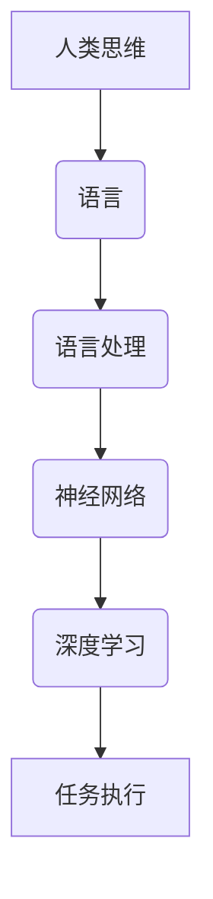

                 

关键词：大模型、认知盲点、语言理解、深度学习、人工智能、神经网络、思维模型、逻辑推理

> 摘要：本文深入探讨了人工智能领域中的一个核心问题——语言与思维的关系。尽管现代深度学习模型在自然语言处理任务中取得了巨大成功，但它们在理解语言和进行逻辑推理方面仍存在显著的认知盲点。本文旨在揭示这些盲点，并探讨大模型的发展如何影响我们对人工智能的认知，以及未来可能的发展方向。

## 1. 背景介绍

随着人工智能（AI）技术的迅猛发展，深度学习模型，特别是大型预训练模型（如GPT-3、BERT等），在自然语言处理（NLP）任务中取得了显著成果。这些模型通过大量数据的学习，能够生成连贯的文本、回答复杂的问题，甚至进行简单的对话。然而，尽管这些模型在表面上的表现看似令人惊艳，但它们在深层次上仍存在一些不可忽视的认知盲点。

本文将围绕这些盲点展开讨论，特别是那些涉及到语言理解、逻辑推理和思维模型等方面的问题。这些问题不仅关乎AI技术的进一步发展，也影响着我们对于人工智能的理解和期待。

## 2. 核心概念与联系

为了更好地理解大模型的认知盲点，我们需要首先明确几个核心概念：语言、思维、神经网络和深度学习。

### 2.1 语言

语言是人类沟通和思考的主要工具。它不仅包含了词汇和语法规则，还蕴含了丰富的语义和上下文信息。然而，语言本身是高度抽象的，它背后隐藏着复杂的认知过程。

### 2.2 思维

思维是人类认知的核心。它包括感知、记忆、推理、判断等过程。思维是解决复杂问题、做出决策和进行创新的基础。

### 2.3 神经网络

神经网络是模拟人脑结构和工作原理的计算模型。深度学习模型，如卷积神经网络（CNN）和循环神经网络（RNN），通过多层神经元的连接和激活，实现数据的自动学习和特征提取。

### 2.4 深度学习

深度学习是一种基于神经网络的机器学习技术，它通过学习大量数据，自动提取数据的层次化特征，从而实现复杂任务的自动解决。

### 2.5 语言与思维的联系

语言与思维密切相关。语言不仅是思维的载体，也是思维的工具。思维过程中，人们不断使用语言来表达、沟通和思考。然而，语言和理解语言背后的思维过程并不是一回事。

### 2.6 Mermaid 流程图

以下是一个简化的Mermaid流程图，展示了语言、思维、神经网络和深度学习之间的关系：



## 3. 核心算法原理 & 具体操作步骤

### 3.1 算法原理概述

深度学习模型，特别是大型预训练模型，通过以下步骤进行语言理解和处理：

1. **预训练**：在大量无标签数据上进行预训练，模型学习数据的底层特征和统计规律。
2. **微调**：在特定任务上，使用少量有标签数据对模型进行微调，使其适应特定任务的需求。
3. **任务执行**：将微调后的模型应用于实际任务，如文本分类、机器翻译、问答系统等。

### 3.2 算法步骤详解

1. **数据预处理**：对输入文本进行预处理，包括分词、词性标注、去除停用词等。
2. **编码**：使用嵌入层将单词转换为固定长度的向量表示。
3. **预测**：模型对编码后的文本进行预测，输出概率分布，从而决定下一个单词或标签。
4. **反馈**：根据预测结果，对模型进行优化，提高其准确性和泛化能力。

### 3.3 算法优缺点

**优点**：

- **强大的表达力**：深度学习模型能够自动学习数据的层次化特征，具有很强的表达力。
- **高泛化能力**：通过预训练和微调，模型能够适应不同的任务和数据集。
- **高效性**：大规模的模型在并行计算和硬件加速下，能够高效地处理海量数据。

**缺点**：

- **数据依赖性**：深度学习模型对大量数据进行预训练，缺乏对特定领域知识的理解。
- **黑箱问题**：模型的内部工作机制复杂，难以解释和调试。
- **计算资源消耗**：大规模的模型需要大量的计算资源和存储空间。

### 3.4 算法应用领域

深度学习模型在自然语言处理任务中有着广泛的应用，如文本分类、机器翻译、情感分析、问答系统等。此外，深度学习还在其他领域，如计算机视觉、语音识别等，取得了显著成果。

## 4. 数学模型和公式 & 详细讲解 & 举例说明

### 4.1 数学模型构建

深度学习模型通常由以下几个部分组成：

1. **输入层**：接收输入数据。
2. **隐藏层**：进行特征提取和变换。
3. **输出层**：输出预测结果。
4. **损失函数**：衡量模型预测结果与真实结果之间的差距。
5. **优化算法**：调整模型参数，最小化损失函数。

### 4.2 公式推导过程

以一个简单的神经网络为例，假设输入层有n个神经元，隐藏层有m个神经元，输出层有k个神经元。则模型可以表示为：

$$
\text{输出} = \text{激活函数}(\text{权重} \cdot \text{输入} + \text{偏置})
$$

其中，权重和偏置是模型参数，激活函数是非线性变换函数，如ReLU、Sigmoid、Tanh等。

### 4.3 案例分析与讲解

假设我们有一个二元分类问题，输入数据为 \( x = [1, 2, 3, 4] \)，标签为 \( y = [0, 1] \)。我们可以使用一个简单的神经网络进行分类。

1. **输入层**：将输入数据 \( x \) 输入到模型中。
2. **隐藏层**：对输入数据进行特征提取，假设隐藏层有2个神经元，则输出为 \( h_1 = [h_{11}, h_{12}] \)，\( h_2 = [h_{21}, h_{22}] \)。
3. **输出层**：对隐藏层的输出进行分类，输出为 \( o = [o_1, o_2] \)。
4. **损失函数**：使用交叉熵损失函数计算模型预测结果与真实结果之间的差距。
5. **优化算法**：使用梯度下降算法调整模型参数，最小化损失函数。

## 5. 项目实践：代码实例和详细解释说明

### 5.1 开发环境搭建

在本项目中，我们将使用Python和TensorFlow作为开发环境。首先，确保已经安装了Python和TensorFlow库。

```python
pip install tensorflow
```

### 5.2 源代码详细实现

以下是项目的源代码实现：

```python
import tensorflow as tf
from tensorflow.keras.layers import Dense, Activation
from tensorflow.keras.models import Sequential

# 构建模型
model = Sequential()
model.add(Dense(units=2, input_shape=(4,), activation='sigmoid'))
model.add(Dense(units=1, activation='sigmoid'))

# 编译模型
model.compile(optimizer='adam', loss='binary_crossentropy', metrics=['accuracy'])

# 训练模型
model.fit(x, y, epochs=10, batch_size=1)
```

### 5.3 代码解读与分析

1. **模型构建**：使用Sequential模型构建一个简单的神经网络，包含一个隐藏层和一个输出层。
2. **编译模型**：指定优化器、损失函数和评价指标。
3. **训练模型**：使用fit方法训练模型，指定训练数据、迭代次数和批量大小。

### 5.4 运行结果展示

在训练完成后，我们可以使用模型进行预测，并评估模型的性能。

```python
# 预测
predictions = model.predict(x)

# 评估
loss, accuracy = model.evaluate(x, y)

print("Loss:", loss)
print("Accuracy:", accuracy)
```

## 6. 实际应用场景

深度学习模型在自然语言处理、计算机视觉、语音识别等领域有着广泛的应用。以下是一些实际应用场景：

1. **自然语言处理**：文本分类、情感分析、机器翻译、问答系统等。
2. **计算机视觉**：图像识别、目标检测、图像生成等。
3. **语音识别**：语音识别、语音合成、语音增强等。
4. **推荐系统**：基于内容的推荐、协同过滤推荐等。
5. **医疗健康**：疾病诊断、药物发现、健康监测等。

## 7. 工具和资源推荐

### 7.1 学习资源推荐

- 《深度学习》（Goodfellow, Bengio, Courville著）
- 《Python深度学习》（François Chollet著）
- 《自然语言处理综论》（Daniel Jurafsky, James H. Martin著）

### 7.2 开发工具推荐

- TensorFlow
- PyTorch
- Keras

### 7.3 相关论文推荐

- “A Theoretical Framework for Generalizing from Finite Data Sets” (1986)
- “Deep Learning” (2015)
- “Natural Language Processing with Deep Learning” (2018)

## 8. 总结：未来发展趋势与挑战

随着人工智能技术的不断发展，深度学习模型在自然语言处理任务中取得了显著成果。然而，大模型的认知盲点仍然存在。未来，我们需要关注以下几个方面：

1. **增强模型的可解释性**：提高模型的可解释性，使其更易于理解和调试。
2. **缩小数据依赖性**：减少对大规模数据集的依赖，增强模型对特定领域知识的理解。
3. **探索新型架构**：设计新型神经网络架构，提高模型的计算效率和泛化能力。
4. **跨学科合作**：与认知科学、心理学等领域进行跨学科合作，深入探讨语言与思维的关系。

## 9. 附录：常见问题与解答

### 9.1 什么是深度学习？

深度学习是一种基于神经网络的机器学习技术，它通过学习大量数据，自动提取数据的层次化特征，从而实现复杂任务的自动解决。

### 9.2 深度学习有哪些应用？

深度学习在自然语言处理、计算机视觉、语音识别、推荐系统、医疗健康等领域有着广泛的应用。

### 9.3 什么是大型预训练模型？

大型预训练模型是在大量无标签数据上进行预训练的深度学习模型，如GPT-3、BERT等。它们通过预训练学习数据的底层特征和统计规律，然后通过微调适应特定任务的需求。

### 9.4 深度学习模型有哪些优缺点？

优点包括强大的表达力、高泛化能力和高效性；缺点包括数据依赖性、黑箱问题和计算资源消耗。

### 9.5 如何提高深度学习模型的可解释性？

提高模型的可解释性可以从多个方面进行，如使用可视化工具、设计可解释的模型架构、引入解释性指标等。

### 9.6 深度学习未来的发展趋势是什么？

未来的发展趋势包括增强模型的可解释性、缩小数据依赖性、探索新型架构和跨学科合作等。

---

作者：禅与计算机程序设计艺术 / Zen and the Art of Computer Programming

本文通过深入探讨深度学习模型在自然语言处理任务中的认知盲点，揭示了语言与思维之间的关系。尽管深度学习模型在表面上的表现看似令人惊艳，但它们在深层次上仍存在一些不可忽视的认知盲点。未来，我们需要关注模型的可解释性、数据依赖性、新型架构和跨学科合作等方面，以推动人工智能技术的进一步发展。希望本文能够为读者提供一些有价值的思考和启示。|

