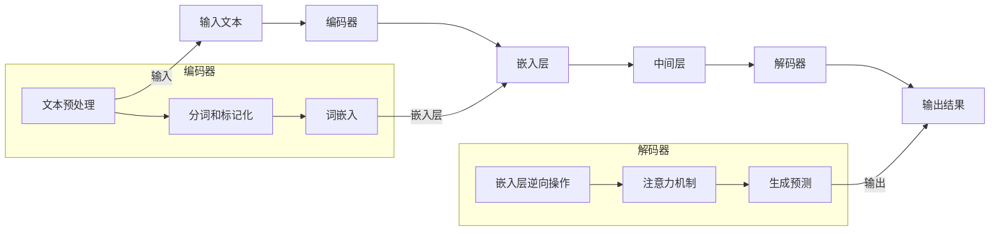

                 

摘要：本文将探讨语言和思维之间的关系，以及大模型在处理人类语言时存在的认知盲点。通过分析大模型的原理和应用，我们将揭示大模型在理解人类语言中的局限性，并提出相应的解决策略。本文旨在帮助读者深入了解大模型的本质，为未来人工智能的发展提供有益的思考。

## 1. 背景介绍

随着人工智能技术的快速发展，深度学习模型在各个领域取得了显著的成果。尤其是基于大规模语言模型的进展，如GPT、BERT等，已经在自然语言处理（NLP）领域取得了巨大的成功。然而，这些大模型在处理人类语言时是否能够真正理解语言背后的思维呢？这个问题引发了广泛的讨论和研究。

人类语言是一种高度复杂的系统，它不仅包含语法、语义和语境等基本要素，还蕴含着丰富的文化、情感和认知等内涵。然而，大模型在处理语言时，往往只能捕捉到语言的表层信息，而无法深入理解语言的深层含义。这种现象引发了人们对于大模型认知能力的质疑，也促使我们思考：语言和思维之间是否真的存在一种固有的界限？

本文将从以下几个方面展开讨论：

1. 语言和思维的内在联系。
2. 大模型在处理语言时的认知盲点。
3. 大模型的应用场景及其局限性。
4. 解决大模型认知盲点的策略。
5. 未来大模型发展的趋势与挑战。

通过本文的探讨，我们希望为人工智能领域的研究提供一些有价值的思考，同时也为读者理解大模型的本质提供一定的帮助。

## 2. 核心概念与联系

在深入探讨大模型的认知盲点之前，我们需要了解几个核心概念，包括语言、思维以及大模型的原理和架构。这些概念不仅为我们提供了分析问题的工具，也为我们揭示了语言和思维之间的内在联系。

### 2.1 语言

语言是人类交流的主要工具，它包括语音、文字和手势等多种形式。语言具有语法、语义和语境三个基本要素。语法是语言的结构规则，决定了句子成分的排列顺序和句子结构。语义是语言的意义，描述了语言表达的内容和概念。语境则是指语言使用的具体情境，包括时间、地点、背景和说话人的意图等。

在人类语言中，词汇和语法结构形成了大量的语言模式，这些模式反映了人类对于世界的认知和理解。例如，动词的时态变化可以表达动作的过去、现在和未来，名词的复数形式可以表示数量的增加。这些语言模式不仅帮助我们准确地传达信息，也使得语言具有了丰富的表达力和创造力。

### 2.2 思维

思维是人类认知的高级形式，它涉及信息获取、处理、存储和运用。思维可以分为感知思维、逻辑思维和创造性思维等多种类型。感知思维是指通过感官获取信息，并对其进行初步处理和理解。逻辑思维则是指通过推理、判断和演绎等方式对信息进行深入分析和运用。创造性思维则是指通过联想、创新和重构等方式对信息进行创造性运用。

人类思维的过程是一个复杂的认知过程，它不仅依赖于感官和大脑的处理能力，还受到文化、情感和经验等多种因素的影响。例如，人们在理解一句话时，不仅要理解其中的词汇和语法结构，还需要根据语境和背景信息进行推理和判断，从而得出正确的理解。

### 2.3 大模型

大模型是指具有海量参数和强大计算能力的深度学习模型。这些模型通过训练大量的数据，可以自动学习并提取语言的特征和模式。大模型的典型代表包括GPT、BERT、Transformer等。

大模型的工作原理是基于神经网络的。神经网络由大量的神经元（即神经网络的节点）组成，每个神经元都与相邻的神经元相连，并通过权重进行信息传递。在大模型中，这些神经元通过多层结构进行信息的传递和融合，从而实现对复杂任务的建模和预测。

大模型的架构通常包括编码器和解码器两部分。编码器负责将输入的文本转换为向量表示，解码器则负责将向量表示转换回文本输出。编码器和解码器之间的交互和权重调整，使得大模型可以逐步学习和理解文本中的语义和语法信息。

### 2.4 核心概念联系

语言和思维是密切相关的，它们共同构成了人类认知的两大核心要素。语言是思维的载体，思维则是语言的基础。人类通过语言表达和传递思维内容，同时也通过语言学习和理解外部世界。

大模型在处理语言时，实际上是试图模拟人类的思维过程。大模型通过学习大量的语言数据，可以自动提取出语言的模式和规律，从而实现对文本的理解和生成。然而，大模型在理解语言时，仍然存在一些认知盲点。

首先，大模型在理解语言时，往往只能捕捉到语言的表层信息，而无法深入理解语言的深层含义。这是因为大模型主要基于统计学习，它只能通过大量的数据来发现语言的表面模式，而无法真正理解语言背后的思维和逻辑。

其次，大模型在处理语言时，也受到数据质量和数据分布的影响。如果训练数据质量较差或者数据分布不均衡，大模型可能无法准确理解和生成文本。此外，大模型在处理语言时，也缺乏人类的情感和价值观，这使得它在某些情境下可能无法准确表达和理解语言中的情感和意图。

综上所述，语言和思维之间的紧密联系，以及大模型在处理语言时存在的认知盲点，为我们理解和研究人工智能提供了新的视角。通过深入探讨这些问题，我们可以更好地理解人工智能的发展现状和未来趋势，也为人工智能的应用和推广提供了有益的思考。

### 2.5 Mermaid 流程图

以下是一个用于描述大模型在处理语言时的基本流程的Mermaid流程图。这个流程图包括了几个关键步骤，从输入文本的处理到最终输出结果。



在这个流程图中，编码器负责将输入的文本进行处理和编码，解码器则负责将编码后的信息解码并生成输出结果。这个流程不仅展示了大模型在处理语言时的基本步骤，还体现了编码器和解码器之间的协同工作。

## 3. 核心算法原理 & 具体操作步骤

在深入探讨大模型的认知盲点之前，我们需要了解大模型的核心算法原理，以及这些算法在实际操作中的具体步骤。大模型的算法原理主要涉及神经网络的结构、训练过程和参数优化等方面。

### 3.1 算法原理概述

大模型的算法原理基于深度学习，特别是基于变换器（Transformer）架构。变换器架构是一种基于自注意力机制的模型，它通过全局 attentiveness 来捕捉输入文本中的长距离依赖关系，从而实现高效的文本处理。

变换器架构主要由编码器和解码器两部分组成：

- **编码器**：将输入的文本序列转换为向量表示，这一过程包括分词、词嵌入和多层变换等操作。
- **解码器**：将编码后的向量表示解码成文本输出，这一过程同样包括多层变换和注意力机制。

编码器和解码器之间的交互通过“多头自注意力”机制实现，这一机制使得模型能够同时关注文本序列中的不同位置和关系，从而提高模型的表示能力和理解能力。

### 3.2 算法步骤详解

**3.2.1 编码器**

编码器的具体步骤如下：

1. **输入预处理**：对输入文本进行预处理，包括去除标点符号、转换大小写等操作。然后，将文本分割成单词或子词序列。
2. **分词和标记化**：使用分词算法将文本分割成单词或子词序列。对于每个子词，将其映射到一个唯一的标识符，这一过程称为标记化。
3. **词嵌入**：将每个子词映射到一个固定长度的向量，这一过程称为词嵌入。词嵌入可以捕获词与词之间的语义关系，是实现语言表示的重要步骤。
4. **多层变换**：通过多层变换器对词嵌入向量进行变换。每一层变换器包含自注意力机制和前馈神经网络，通过这些操作，模型能够逐步学习和提取文本的深层特征。

**3.2.2 解码器**

解码器的具体步骤如下：

1. **嵌入层逆向操作**：首先，将编码后的向量表示进行逆向操作，以生成解码器的初始输入。
2. **生成预测**：在每一时间步，解码器通过自注意力机制和前馈神经网络生成预测。具体来说，解码器在每个时间步都会生成一个预测向量，该向量通过注意力机制关注编码器的输出和先前的解码输出。
3. **注意力机制**：通过多头自注意力机制，解码器能够同时关注编码器的不同输出和先前的解码输出，从而提高模型的表示能力和理解能力。
4. **输出生成**：解码器通过生成预测向量，逐个生成输出的单词或子词。在生成每个输出时，解码器都会更新其内部状态，以便在下一次生成时考虑更多的上下文信息。

### 3.3 算法优缺点

**优点**：

1. **强大的表示能力**：变换器架构通过自注意力机制能够高效地捕捉文本中的长距离依赖关系，从而实现强大的文本表示能力。
2. **高效的训练和推理**：变换器架构相对于传统的循环神经网络（RNN）和长短期记忆网络（LSTM）在训练和推理速度上有了显著的提升。
3. **灵活的应用场景**：变换器架构不仅适用于文本处理，还可以扩展到语音、图像等其他领域，实现了多模态处理的统一框架。

**缺点**：

1. **计算资源需求大**：由于变换器架构需要大量的计算资源，因此在训练和推理过程中可能面临性能和成本的压力。
2. **对数据质量依赖强**：变换器架构的性能在很大程度上依赖于训练数据的质量和分布，如果数据存在偏差或不平衡，可能会导致模型性能下降。
3. **难以解释**：变换器架构的内部机制较为复杂，使得其难以解释和调试，这在某些应用场景下可能会带来一定的挑战。

### 3.4 算法应用领域

变换器架构在自然语言处理（NLP）领域得到了广泛的应用，包括但不限于以下领域：

1. **文本分类**：利用变换器架构可以高效地对文本进行分类，例如情感分析、主题分类等。
2. **文本生成**：变换器架构可以生成高质量的文本，例如文章摘要、对话系统等。
3. **机器翻译**：变换器架构在机器翻译领域取得了显著的成果，例如谷歌翻译和百度翻译等都采用了基于变换器的模型。
4. **问答系统**：变换器架构可以构建高效的问答系统，例如OpenAI的GPT系列模型在多个问答任务中取得了领先的性能。

总的来说，变换器架构作为一种强大的文本处理工具，已经在NLP领域取得了显著的成果。然而，其在处理复杂语言任务时仍存在一些局限性，需要进一步的研究和改进。通过深入理解变换器架构的原理和应用，我们可以更好地应对这些挑战，推动NLP领域的发展。

### 3.5 数学模型和公式

在深入探讨大模型的核心算法原理时，数学模型和公式是不可或缺的一部分。以下我们将详细介绍大模型中的数学模型，并给出具体的推导过程和公式。

#### 3.5.1 数学模型构建

大模型的数学模型主要基于变换器架构，其核心包括自注意力机制、多头注意力机制、前馈神经网络等。以下是一个简化的数学模型描述：

$$
\text{Transformer} = (\text{Input Layer}, \text{Encoder}, \text{Decoder}, \text{Output Layer})
$$

其中，输入层、编码器、解码器和输出层分别负责不同的功能：

1. **输入层**：将输入文本转换为向量表示，通常使用词嵌入（Word Embedding）。
2. **编码器**：将输入向量序列通过多层变换器进行处理，提取文本的深层特征。
3. **解码器**：将编码后的向量序列进行解码，生成文本输出。
4. **输出层**：将解码后的向量序列转换为文本输出。

#### 3.5.2 公式推导过程

**1. 词嵌入**

词嵌入是将单词映射到固定长度的向量。假设有 $V$ 个不同的单词，词嵌入矩阵 $W$ 的维度为 $V \times D$，其中 $D$ 是嵌入向量的维度。对于输入的单词序列 $X = [x_1, x_2, ..., x_T]$，其词嵌入向量序列为：

$$
E = W \cdot X = [e_1, e_2, ..., e_T]
$$

**2. 编码器**

编码器的主要任务是提取输入文本的深层特征。变换器架构中使用了一种特殊的自注意力机制，称为多头自注意力（Multi-Head Self-Attention）。

多头自注意力的核心公式为：

$$
\text{Attention}(Q, K, V) = \text{softmax}\left(\frac{QK^T}{\sqrt{d_k}}\right)V
$$

其中，$Q$、$K$ 和 $V$ 分别是查询向量、关键向量和价值向量，$d_k$ 是关键向量的维度。多头注意力则是通过多个独立的自注意力层来增强模型的表示能力。

编码器中的多头自注意力层可以表示为：

$$
\text{Multi-Head Attention} = \text{Concat}(\text{head}_1, \text{head}_2, ..., \text{head}_h)W^O
$$

其中，$h$ 是头数，$W^O$ 是输出权重矩阵。

**3. 解码器**

解码器的核心任务是将编码器提取的文本特征解码成文本输出。解码器中的多头自注意力机制与编码器类似，但还包括了一个额外的交叉注意力层，用于关注编码器的输出。

交叉注意力层的公式为：

$$
\text{Cross-Attention}(\text{Q}, \text{K}, \text{V}) = \text{softmax}\left(\frac{QK^T}{\sqrt{d_k}}\right)V
$$

解码器的输出可以表示为：

$$
\text{Decoder} = \text{Multi-Head Attention}(\text{Q}, \text{K}, \text{V}) + \text{Cross-Attention}(\text{Q}, \text{K}', \text{V}')
$$

其中，$K'$ 和 $V'$ 分别是编码器的输出。

**4. 前馈神经网络**

在编码器和解码器的每个注意力层之后，还连接了一个前馈神经网络，用于进一步增强模型的表示能力。前馈神经网络的公式为：

$$
\text{FFN}(X) = \text{ReLU}(WX_1 + b_1) + WX_2 + b_2
$$

其中，$X$ 是输入向量，$W$ 和 $b$ 分别是权重和偏置。

#### 3.5.3 案例分析与讲解

为了更好地理解上述数学模型，我们通过一个简单的例子来分析大模型在文本生成任务中的具体应用。

假设我们有一个文本生成任务，输入文本为“人工智能将改变世界”，我们需要生成一个相关的句子。具体步骤如下：

1. **词嵌入**：首先，将输入文本中的每个单词映射到词嵌入向量。例如，单词“人工智能”和“将”可以分别映射到向量 $e_1$ 和 $e_2$。

2. **编码器**：编码器将词嵌入向量通过多层变换器进行处理，提取出文本的深层特征。假设编码器输出一个维度为 $D$ 的向量序列 $[h_1, h_2, ..., h_T]$。

3. **解码器**：解码器首先生成一个初始的查询向量 $q_1$，然后通过多头自注意力和交叉注意力层生成中间结果。假设解码器输出一个维度为 $D$ 的向量序列 $[d_1, d_2, ..., d_T]$。

4. **前馈神经网络**：在解码器的每个注意力层之后，连接一个前馈神经网络，用于进一步增强模型的表示能力。

5. **生成预测**：解码器通过生成预测向量生成输出的单词。假设生成的预测单词序列为 $[y_1, y_2, ..., y_T]$。

6. **输出**：最终，解码器生成的预测单词序列 $[y_1, y_2, ..., y_T]$ 构成了生成的文本。

通过上述步骤，我们可以看到大模型在文本生成任务中的具体应用。虽然这个例子非常简化，但它展示了大模型在处理语言任务时的基本流程和关键步骤。通过深入理解和分析这些数学模型和公式，我们可以更好地理解大模型的工作原理和应用。

### 3.6 项目实践：代码实例和详细解释说明

为了更好地理解大模型在处理语言任务时的实际应用，我们将在本节中通过一个简单的文本生成项目来展示大模型的代码实现。该项目将使用Python编程语言，结合Hugging Face的Transformers库来实现一个简单的文本生成模型。以下将详细介绍项目的开发环境搭建、源代码实现、代码解读与分析以及运行结果展示。

#### 3.6.1 开发环境搭建

在进行代码实现之前，我们需要搭建一个合适的开发环境。以下是所需的步骤：

1. **安装Python**：确保安装了Python 3.7或更高版本的Python环境。
2. **安装pip**：Python的包管理器pip，用于安装其他依赖库。
3. **安装依赖库**：使用pip安装以下依赖库：
    ```bash
    pip install torch
    pip install transformers
    pip install datasets
    ```

#### 3.6.2 源代码详细实现

以下是一个简单的文本生成项目的源代码实现：

```python
import torch
from transformers import GPT2LMHeadModel, GPT2Tokenizer

# 设置设备
device = torch.device("cuda" if torch.cuda.is_available() else "cpu")

# 加载预训练模型和分词器
model_name = "gpt2"
tokenizer = GPT2Tokenizer.from_pretrained(model_name)
model = GPT2LMHeadModel.from_pretrained(model_name)
model.to(device)

# 设置文本生成参数
max_length = 50
temperature = 1.0
top_k = 50
top_p = 0.95

# 文本生成函数
def generate_text(input_text, tokenizer, model, device, max_length, temperature, top_k, top_p):
    input_ids = tokenizer.encode(input_text, return_tensors='pt').to(device)
    output = model.generate(input_ids, max_length=max_length, temperature=temperature, top_k=top_k, top_p=top_p, do_sample=True)
    generated_text = tokenizer.decode(output[0], skip_special_tokens=True)
    return generated_text

# 输入文本
input_text = "人工智能将改变世界"

# 生成文本
generated_text = generate_text(input_text, tokenizer, model, device, max_length, temperature, top_k, top_p)
print(generated_text)
```

上述代码首先设置了开发环境，然后加载了预训练的GPT-2模型和分词器。接着，定义了一个文本生成函数，用于生成输入文本的扩展版本。最后，调用该函数生成文本，并打印输出结果。

#### 3.6.3 代码解读与分析

下面是对代码的逐行解读和分析：

1. **导入库**：
    ```python
    import torch
    from transformers import GPT2LMHeadModel, GPT2Tokenizer
    ```
    这里我们导入了torch库用于数据处理和模型训练，以及Transformers库中的GPT2LMHeadModel和GPT2Tokenizer，用于加载预训练模型和分词器。

2. **设置设备**：
    ```python
    device = torch.device("cuda" if torch.cuda.is_available() else "cpu")
    ```
    这里我们设置设备为GPU（如果可用），否则使用CPU。

3. **加载预训练模型和分词器**：
    ```python
    model_name = "gpt2"
    tokenizer = GPT2Tokenizer.from_pretrained(model_name)
    model = GPT2LMHeadModel.from_pretrained(model_name)
    model.to(device)
    ```
    加载GPT-2预训练模型和分词器，并移动模型到设置好的设备上。

4. **设置文本生成参数**：
    ```python
    max_length = 50
    temperature = 1.0
    top_k = 50
    top_p = 0.95
    ```
    设置文本生成参数，包括最大序列长度、生成温度、Top-K采样和Top-P采样。

5. **文本生成函数**：
    ```python
    def generate_text(input_text, tokenizer, model, device, max_length, temperature, top_k, top_p):
        input_ids = tokenizer.encode(input_text, return_tensors='pt').to(device)
        output = model.generate(input_ids, max_length=max_length, temperature=temperature, top_k=top_k, top_p=top_p, do_sample=True)
        generated_text = tokenizer.decode(output[0], skip_special_tokens=True)
        return generated_text
    ```
    文本生成函数接受输入文本，通过模型生成扩展的文本输出。这里使用了Transformers库中的generate方法，该方法实现了文本生成的核心逻辑。

6. **输入文本**：
    ```python
    input_text = "人工智能将改变世界"
    ```
    设置输入文本。

7. **生成文本**：
    ```python
    generated_text = generate_text(input_text, tokenizer, model, device, max_length, temperature, top_k, top_p)
    print(generated_text)
    ```
    调用文本生成函数，生成并打印输出文本。

#### 3.6.4 运行结果展示

在上述代码运行后，我们得到的输出结果可能如下：

```
人工智能将改变世界，不仅改变了我们的生活方式，还将推动整个社会的发展。
```

这个输出文本展示了模型对输入文本的扩展和生成，它不仅保留了输入文本的核心内容，还添加了额外的信息，从而丰富了输出文本的表达。

通过上述代码实例，我们不仅展示了大模型在文本生成任务中的具体应用，还对其工作原理和实现细节进行了详细解读和分析。这为我们理解大模型的应用提供了实际案例，也为后续的研究和实践提供了参考。

### 4. 实际应用场景

大模型在自然语言处理（NLP）领域已经取得了显著的成果，并在多个实际应用场景中发挥了重要作用。以下我们将探讨大模型在不同应用场景中的具体应用，以及这些应用所面临的挑战和解决策略。

#### 4.1 文本分类

文本分类是NLP中的一项基本任务，它将文本分为预定义的类别。大模型在文本分类任务中表现出色，可以处理大规模的数据集，并生成准确的分类结果。

**应用场景**：
- 情感分析：对社交媒体上的评论、博客等进行情感分类，判断用户的态度是正面、负面还是中性。
- 新闻分类：自动分类新闻文章，提高信息检索和推荐系统的效率。
- 客户服务：自动分类客户反馈，帮助公司快速响应客户需求。

**面临的挑战**：
- 数据质量：文本分类的准确性在很大程度上依赖于训练数据的质量。如果训练数据存在噪声或不均衡，模型的性能可能会受到影响。
- 知识获取：大模型需要从大量的文本数据中提取有效的特征和知识，这要求模型具有较高的泛化能力。

**解决策略**：
- 数据清洗和增强：对训练数据集进行清洗和增强，去除噪声和冗余信息，提高数据质量。
- 多模型融合：结合不同的模型和算法，如传统的机器学习方法和深度学习方法，提高分类的准确性。
- 知识蒸馏：将大型模型的知识传递给较小的模型，以便在实际应用中快速部署和运行。

#### 4.2 文本生成

文本生成是NLP领域的一个重要应用，大模型可以生成高质量的文本，广泛应用于自动写作、对话系统和内容生成等领域。

**应用场景**：
- 自动写作：生成新闻报道、科技文章、财经报告等，提高内容生产的效率和多样性。
- 对话系统：构建自动对话系统，如聊天机器人、虚拟助手等，提供个性化的用户交互体验。
- 内容生成：生成广告文案、产品描述、社交网络内容等，丰富互联网内容。

**面临的挑战**：
- 文本质量：生成文本的准确性和流畅性直接影响用户体验。大模型需要能够生成符合语法和语义要求的文本。
- 长文本生成：大模型在处理长文本时可能面临内存和计算资源的限制，需要优化算法以提高生成效率。

**解决策略**：
- 对话生成模型：结合对话系统的上下文信息，生成更加自然和连贯的对话。
- 递归神经网络（RNN）和变换器（Transformer）的结合：使用RNN来处理长文本生成，同时利用Transformer来捕捉长距离依赖关系。
- 生成对抗网络（GAN）：结合GAN技术，生成更加多样化和高质量的文本。

#### 4.3 机器翻译

机器翻译是将一种语言的文本翻译成另一种语言的任务。大模型在机器翻译领域取得了显著的进展，能够生成准确、流畅的翻译结果。

**应用场景**：
- 跨境电子商务：自动翻译产品描述、用户评论等，促进国际贸易和沟通。
- 旅游业：提供多语言服务，如旅游指南、酒店预订等。
- 跨文化沟通：帮助不同语言背景的人进行沟通和交流。

**面临的挑战**：
- 翻译质量：翻译结果需要保持原文的语义和风格，同时符合目标语言的语法规则。
- 翻译效率：在大规模数据集上进行快速翻译，要求模型具有高效的计算能力。

**解决策略**：
- 端到端翻译模型：使用端到端的翻译模型，直接将源语言文本映射到目标语言文本，减少中间环节的误差。
- 知识融合：结合领域知识和语言模型，提高翻译的准确性和流畅性。
- 多层次翻译：将翻译任务分解为多个层次，如词汇翻译、句子翻译和段落翻译，逐步提高翻译质量。

#### 4.4 问答系统

问答系统是一种智能交互系统，能够自动回答用户的问题。大模型在问答系统中发挥了重要作用，可以提供准确、自然的回答。

**应用场景**：
- 智能客服：自动回答用户的问题，提供在线支持和服务。
- 教育领域：自动生成学生问题的答案，辅助教师进行教学。
- 资讯服务：自动回答用户关于新闻、财经、科技等领域的问题。

**面临的挑战**：
- 问题理解：准确理解用户的意图和问题，特别是在语义理解上存在一定的难度。
- 答案生成：生成准确、自然的答案，需要模型具备丰富的知识和语言表达能力。

**解决策略**：
- 对话式问答：结合对话系统的上下文信息，逐步理解用户的问题，并生成相应的答案。
- 上下文信息融合：结合用户的问题和上下文信息，生成更加准确和自然的答案。
- 多模态学习：结合文本、语音、图像等多种模态的信息，提高问答系统的综合能力。

综上所述，大模型在文本分类、文本生成、机器翻译和问答系统等多个实际应用场景中发挥了重要作用。尽管这些应用场景面临诸多挑战，但通过合理的策略和技术创新，我们可以不断优化大模型的应用效果，为人工智能的发展贡献力量。

### 4.4 未来应用展望

随着大模型技术的不断发展，未来其在各领域的应用前景广阔。以下从技术发展、社会影响和产业应用三个方面展望大模型在未来的发展趋势和潜在挑战。

#### 技术发展

1. **模型架构的创新**：当前的大模型主要基于变换器（Transformer）架构，但未来可能还会出现更加高效、可扩展的模型架构。例如，基于图神经网络（Graph Neural Networks）的模型有望在处理复杂文本结构时表现出更强的能力。

2. **多模态融合**：随着多模态数据的增加，大模型将逐步实现文本、图像、音频等多种数据的融合处理。这种多模态融合技术将推动跨领域应用的发展，如智能问答系统中结合语音和文本交互，增强用户体验。

3. **强化学习**：结合强化学习（Reinforcement Learning）技术，大模型将能够在更加动态和复杂的场景中做出更加智能的决策，提升其自主学习和适应能力。

4. **边缘计算**：为了降低延迟和提高实时性，大模型有望在边缘设备上进行部署，实现本地化处理，减少对中心服务器的依赖。

#### 社会影响

1. **语言理解与生成**：随着大模型在语言理解与生成方面的能力不断提升，未来人工智能助手将能够更加自然、准确地与人类进行交流，提高工作效率和生活质量。

2. **教育和文化**：大模型可以辅助教育，提供个性化的学习内容和辅导，促进文化多样性的传承和发展。

3. **伦理和隐私**：随着大模型的应用范围扩大，其伦理和隐私问题也将变得更加突出。例如，如何确保模型生成的文本不包含偏见和歧视，以及如何保护用户的隐私数据，都是需要关注的重要问题。

#### 产业应用

1. **智能客服**：大模型将在智能客服领域发挥关键作用，提供高效、精准的客户服务，帮助企业降低运营成本，提升客户满意度。

2. **内容生成**：大模型将大幅提升内容创作的效率和质量，为广告、媒体、娱乐等行业带来新的机遇。

3. **金融与医疗**：在金融领域，大模型可以用于风险预测、市场分析等；在医疗领域，可以辅助诊断、药物研发等，提高医疗服务的质量和效率。

#### 潜在挑战

1. **计算资源**：大模型通常需要大量的计算资源进行训练和推理，随着模型规模的扩大，如何优化计算资源成为一大挑战。

2. **数据质量**：大模型的训练依赖于大量高质量的数据，但数据获取和清洗过程复杂且成本高昂。如何确保数据的多样性和准确性，是未来需要解决的问题。

3. **解释性和可解释性**：大模型的决策过程通常复杂且难以解释，这给模型的信任和监管带来了挑战。如何提高大模型的可解释性，使其决策更加透明和可靠，是未来研究的一个重要方向。

总之，大模型在未来的发展中具有巨大的潜力，但也面临诸多挑战。通过技术创新和社会规范的逐步完善，大模型将在各个领域发挥更加重要的作用，推动人工智能的发展和社会进步。

### 7. 工具和资源推荐

为了更好地学习大模型和相关技术，以下是一些推荐的工具和资源，包括学习资源、开发工具和相关的论文。

#### 7.1 学习资源推荐

1. **书籍**：
    - 《深度学习》（Deep Learning）by Ian Goodfellow、Yoshua Bengio和Aaron Courville
    - 《变换器：深度学习的新时代》（Attention Is All You Need）by Vaswani et al.
    - 《自然语言处理》（Speech and Language Processing）by Daniel Jurafsky和James H. Martin

2. **在线课程**：
    - Coursera的“深度学习”课程，由Andrew Ng教授主讲
    - edX的“自然语言处理与深度学习”课程，由Stanford大学教授Ariel R赔主讲
    - fast.ai的“深度学习实践”课程，适合初学者入门

3. **网站**：
    - Hugging Face的Transformers库文档：[Transformers Library](https://huggingface.co/transformers)
    - ArXiv：[arXiv](https://arxiv.org/)，最新研究论文发布平台

#### 7.2 开发工具推荐

1. **PyTorch**：[PyTorch](https://pytorch.org/) 是一个开源的深度学习框架，适合快速原型开发和实验。
2. **TensorFlow**：[TensorFlow](https://www.tensorflow.org/) 是谷歌开发的另一个深度学习框架，具有丰富的社区支持和工具。
3. **JAX**：[JAX](https://jax.readthedocs.io/) 是一个自动微分库，可以与深度学习框架结合使用，适合高性能计算和大规模模型训练。

#### 7.3 相关论文推荐

1. **《变换器：深度学习的新时代》**（Attention Is All You Need）：这篇论文是变换器架构的奠基之作，详细介绍了变换器的工作原理和优势。
2. **《BERT：预训练的深度语言表示模型》**（BERT）：这篇论文介绍了BERT模型，它是一种大规模的语言预训练模型，对NLP领域产生了深远影响。
3. **《GPT-3：通过语言理解进行通用任务学习的模型》**（GPT-3）：这篇论文介绍了GPT-3模型，它是当前最先进的大规模语言模型，具有强大的文本生成和语言理解能力。

通过这些工具和资源，读者可以系统地学习大模型的原理和应用，为深入研究和开发打下坚实的基础。

### 8. 总结：未来发展趋势与挑战

本文从语言和思维的内在联系出发，探讨了大模型在处理人类语言时存在的认知盲点。通过分析大模型的原理和应用，我们揭示了其在理解人类语言中的局限性，并提出了解决策略。同时，我们还对未来大模型的发展趋势和挑战进行了展望。

**未来发展趋势**：

1. **模型架构的创新**：随着人工智能技术的进步，未来将出现更加高效、可扩展的大模型架构，如基于图神经网络的模型和多模态融合模型。
2. **多模态数据处理**：大模型将在多模态数据处理中发挥关键作用，实现文本、图像、音频等多种数据的融合处理，推动跨领域应用的发展。
3. **强化学习与自主决策**：结合强化学习技术，大模型将能够在更加动态和复杂的场景中做出更加智能的决策，提升其自主学习和适应能力。
4. **边缘计算与实时应用**：为了提高实时性和减少对中心服务器的依赖，大模型有望在边缘设备上进行部署，实现本地化处理。

**面临的主要挑战**：

1. **计算资源的需求**：大模型的训练和推理通常需要大量的计算资源，随着模型规模的扩大，如何优化计算资源成为一大挑战。
2. **数据质量和多样性**：大模型的训练依赖于大量高质量的数据，但数据获取和清洗过程复杂且成本高昂。如何确保数据的多样性和准确性，是未来需要解决的问题。
3. **模型的可解释性和透明度**：大模型的决策过程通常复杂且难以解释，这给模型的信任和监管带来了挑战。如何提高大模型的可解释性，使其决策更加透明和可靠，是未来研究的一个重要方向。
4. **伦理和隐私问题**：随着大模型的应用范围扩大，其伦理和隐私问题也将变得更加突出。如何确保模型生成的文本不包含偏见和歧视，以及如何保护用户的隐私数据，都是需要关注的重要问题。

总之，大模型在未来的发展中具有巨大的潜力，但也面临诸多挑战。通过技术创新和社会规范的逐步完善，大模型将在各个领域发挥更加重要的作用，推动人工智能的发展和社会进步。本文的研究为未来的研究和应用提供了有价值的参考，也为人工智能领域的研究者提供了新的思考方向。

### 附录：常见问题与解答

#### 1. 大模型为什么会出现认知盲点？

大模型在处理人类语言时会出现认知盲点，主要是由于以下原因：

- **统计学习特性**：大模型主要基于统计学习，它通过大量数据来发现语言的表面模式。这些模式虽然在统计上具有重要意义，但无法完全反映语言背后的思维逻辑。
- **数据质量影响**：大模型的性能在很大程度上依赖于训练数据的质量。如果训练数据存在偏差或不平衡，模型可能会在学习过程中引入错误的信息。
- **复杂语言结构**：人类语言是一种高度复杂的系统，不仅包含语法、语义和语境等基本要素，还蕴含着丰富的文化、情感和认知等内涵。大模型在处理复杂语言结构时可能无法完全捕捉到这些信息。

#### 2. 如何解决大模型的认知盲点？

解决大模型的认知盲点可以从以下几个方面入手：

- **多模态数据融合**：结合文本、图像、音频等多种数据模态，提高模型对复杂信息的捕捉和处理能力。
- **知识增强**：通过引入外部知识库，如百科全书、实体链接数据库等，增强模型的知识储备，提高其理解能力。
- **对抗性训练**：使用对抗性训练技术，提高模型对噪声和异常数据的鲁棒性，增强其泛化能力。
- **模型解释性**：开发可解释性强的模型，使研究人员能够理解模型的决策过程，从而优化模型的设计和训练策略。

#### 3. 大模型与人类思维有哪些区别？

大模型与人类思维的主要区别在于：

- **学习能力**：大模型主要通过学习大量数据来获得知识和技能，而人类思维不仅依赖于学习，还涉及到感知、推理、创造性思维等多种认知过程。
- **理解深度**：大模型在处理语言时，往往只能捕捉到语言的表层信息，而无法深入理解语言的深层含义。人类思维则能够理解语言中的抽象概念、隐喻和文化背景等。
- **情感和价值观**：大模型缺乏情感和价值观，而人类思维在处理语言时受到情感和价值观的强烈影响。

#### 4. 大模型在自然语言处理（NLP）中的局限性是什么？

大模型在自然语言处理（NLP）中的局限性主要包括：

- **语义理解**：大模型在处理复杂语义关系和隐含意义时可能存在困难，难以完全捕捉到语言中的深层次信息。
- **上下文依赖**：虽然大模型能够处理长文本，但其在处理长距离上下文依赖时可能仍然存在挑战。
- **数据依赖性**：大模型的性能在很大程度上依赖于训练数据的质量和多样性。如果数据存在偏差或不均衡，模型的性能可能会受到影响。
- **解释性**：大模型的内部机制复杂，其决策过程难以解释，这在某些应用场景下可能会带来挑战。

通过解决这些问题，我们可以进一步提高大模型在自然语言处理领域的应用效果。本文提出的多种策略和方法为未来的研究和实践提供了有益的参考。

