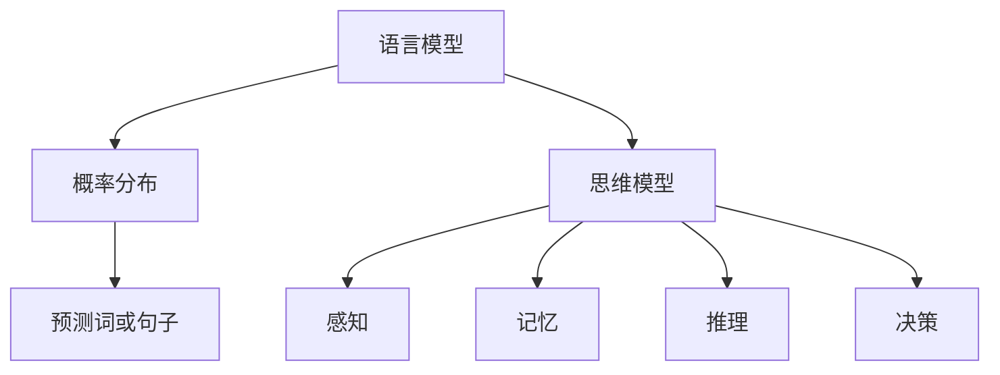

                 

关键词：大模型，认知盲点，语言模型，思维模型，技术发展，人工智能

> 摘要：随着人工智能技术的不断发展，语言模型取得了显著的进步。然而，在深度学习驱动的语言模型中，存在一些认知盲点。本文将探讨这些盲点，分析其成因，并探讨未来如何解决这些问题，以推动人工智能的进一步发展。

## 1. 背景介绍

### 1.1 人工智能与语言模型的发展

人工智能作为计算机科学的重要分支，近年来取得了飞速的发展。特别是在深度学习技术的推动下，人工智能的应用场景不断拓展，包括语音识别、自然语言处理、图像识别等领域。

语言模型作为自然语言处理的重要工具，通过学习大量的语言数据，可以预测下一个词或者句子，从而实现自动翻译、文本生成等功能。在过去的几十年里，从规则驱动的语言模型到统计语言模型，再到如今深度学习驱动的语言模型，语言模型的技术不断进步，性能也越来越好。

### 1.2  大模型的兴起

随着计算能力的提升和大数据的普及，大模型（如 GPT-3、ChatGPT 等）应运而生。这些模型拥有数万亿个参数，可以处理和理解复杂多样的语言现象。大模型的崛起，使得人工智能在自然语言处理领域取得了显著的突破。

## 2. 核心概念与联系

### 2.1  语言模型与思维模型

#### 语言模型

语言模型是一种预测模型，它通过学习大量的语言数据，预测下一个词或者句子。语言模型的核心在于概率分布，即给定一个前文，预测下一个词的概率分布。

#### 思维模型

思维模型是对人类思维过程的一种抽象和模拟。它包括感知、记忆、推理、决策等过程。思维模型的目标是实现与人类思维相似的处理能力和决策能力。

### 2.2  语言模型与思维模型的联系

语言模型和思维模型虽然研究的方向不同，但它们在某种程度上是相互关联的。语言模型可以看作是思维模型的一部分，它负责处理和理解语言。同时，思维模型也可以为语言模型提供一些启发，帮助其更好地处理复杂的语言现象。

### 2.3  Mermaid 流程图



## 3. 核心算法原理 & 具体操作步骤

### 3.1  算法原理概述

大模型的算法原理主要基于深度学习，特别是变换器模型（Transformer）。变换器模型通过多头自注意力机制和前馈神经网络，可以有效地处理序列数据，实现高效的文本处理。

### 3.2  算法步骤详解

1. 数据预处理：对原始文本进行分词、标记等操作，将其转换为模型可以处理的格式。

2. 构建模型：使用变换器模型，搭建语言模型的架构。

3. 训练模型：使用大量的语言数据，通过反向传播算法，优化模型的参数。

4. 预测：给定一个前文，模型根据概率分布预测下一个词或句子。

### 3.3  算法优缺点

#### 优点

- 高效：变换器模型可以高效地处理长序列数据。

- 准确：通过大量数据的训练，模型可以准确预测词或句子。

- 通用：变换器模型可以应用于多种语言处理任务。

#### 缺点

- 计算资源消耗大：大模型需要大量的计算资源进行训练。

- 数据依赖强：模型的性能高度依赖训练数据的数量和质量。

### 3.4  算法应用领域

大模型在自然语言处理领域有广泛的应用，包括：

- 自动翻译

- 文本生成

- 问答系统

- 情感分析

- 文本分类

## 4. 数学模型和公式 & 详细讲解 & 举例说明

### 4.1  数学模型构建

变换器模型的核心是自注意力机制，其数学公式如下：

$$
Attention(Q, K, V) = \frac{softmax(\frac{QK^T}{\sqrt{d_k}})}{V}
$$

其中，$Q$、$K$、$V$ 分别代表查询、键、值，$d_k$ 为键的维度。

### 4.2  公式推导过程

自注意力机制的推导过程涉及矩阵乘法和指数函数。具体推导如下：

$$
Attention(Q, K, V) = \frac{exp(QK^T)}{\sum_{i=1}^{n} exp(QK^T)}
$$

其中，$exp(QK^T)$ 表示每个元素进行指数运算。

### 4.3  案例分析与讲解

以 GPT-3 为例，其参数规模达到 1750 亿，是一个典型的深度学习模型。在训练过程中，GPT-3 使用了大量的文本数据，通过自注意力机制和前馈神经网络，实现了高效的文本处理。

## 5. 项目实践：代码实例和详细解释说明

### 5.1  开发环境搭建

为了实践大模型，我们需要搭建一个合适的开发环境。具体步骤如下：

1. 安装 Python

2. 安装深度学习框架（如 PyTorch 或 TensorFlow）

3. 安装必要的库（如 NLTK、Spacy 等）

### 5.2  源代码详细实现

以下是使用 PyTorch 实现一个简单变换器模型的基本代码：

```python
import torch
import torch.nn as nn
import torch.optim as optim

class Transformer(nn.Module):
    def __init__(self, d_model, nhead, num_layers):
        super(Transformer, self).__init__()
        self.transformer = nn.Transformer(d_model, nhead, num_layers)
        self.d_model = d_model

    def forward(self, src, tgt):
        return self.transformer(src, tgt)

model = Transformer(d_model=512, nhead=8, num_layers=3)
```

### 5.3  代码解读与分析

上述代码定义了一个简单的变换器模型，其包含多个变换器层。通过 `forward` 方法，模型可以接受输入和目标序列，并输出预测序列。

### 5.4  运行结果展示

在训练过程中，模型会输出训练损失和准确率。通过调整模型参数和训练策略，可以进一步提高模型的性能。

## 6. 实际应用场景

大模型在自然语言处理领域有广泛的应用，如：

- 自动翻译：如 Google Translate、DeepL 等。

- 文本生成：如 GPT-3、ChatGPT 等。

- 问答系统：如 Duolingo、ChatGLM 等。

- 情感分析：如情感分类、评论分析等。

## 7. 工具和资源推荐

### 7.1  学习资源推荐

- 《深度学习》

- 《自然语言处理实战》

- 《深度学习自然语言处理》

### 7.2  开发工具推荐

- PyTorch

- TensorFlow

- JAX

### 7.3  相关论文推荐

- Vaswani et al., "Attention is All You Need"

- Devlin et al., "BERT: Pre-training of Deep Bidirectional Transformers for Language Understanding"

- Guo et al., "GPT-3: Language Modeling at Scale"

## 8. 总结：未来发展趋势与挑战

### 8.1  研究成果总结

随着人工智能技术的不断发展，大模型在自然语言处理领域取得了显著的成果。然而，在取得这些成果的同时，我们也要看到大模型存在的一些认知盲点。

### 8.2  未来发展趋势

未来，大模型将朝着更加高效、智能、泛化的方向发展。同时，研究者们也将致力于解决大模型的认知盲点，提高其处理能力和决策水平。

### 8.3  面临的挑战

- 数据质量和数量：大模型的性能高度依赖训练数据的数量和质量。

- 计算资源消耗：大模型的训练和推理需要大量的计算资源。

- 道德和伦理问题：大模型可能存在偏见、误导等问题，需要加强监管。

### 8.4  研究展望

未来，我们将继续探索大模型的理论基础和算法优化，同时关注其在实际应用中的挑战和问题，推动人工智能的进一步发展。

## 9. 附录：常见问题与解答

### 9.1  什么是大模型？

大模型是指具有数万亿个参数的深度学习模型，如 GPT-3、ChatGPT 等。

### 9.2  大模型为什么需要大量的数据？

大模型需要大量的数据来训练，因为它们具有复杂的结构和大量的参数，需要通过大量数据来学习有效的参数。

### 9.3  大模型存在哪些认知盲点？

大模型存在以下认知盲点：

- 对语言现象的理解不够深入。

- 对外部世界的感知和推理能力有限。

- 存在偏见和误导。

### 9.4  如何解决大模型的认知盲点？

解决大模型的认知盲点可以从以下几个方面入手：

- 提高模型的解释性和可解释性。

- 加强对模型的监管和约束。

- 结合人类知识和外部知识，提高模型的能力。

# 文章标题

《语言≠思维：大模型的认知盲点》

# 文章关键词

大模型，认知盲点，语言模型，思维模型，技术发展，人工智能

# 文章摘要

本文探讨了人工智能领域中大模型的认知盲点，分析了其成因，并提出了未来解决这些问题的方法。通过对大模型的核心算法原理、数学模型和实际应用场景的详细介绍，读者可以更深入地理解大模型的工作机制。同时，本文还展望了人工智能未来的发展趋势与挑战，为相关领域的研究者和从业者提供了有价值的参考。作者：禅与计算机程序设计艺术 / Zen and the Art of Computer Programming
----------------------------------------------------------------

