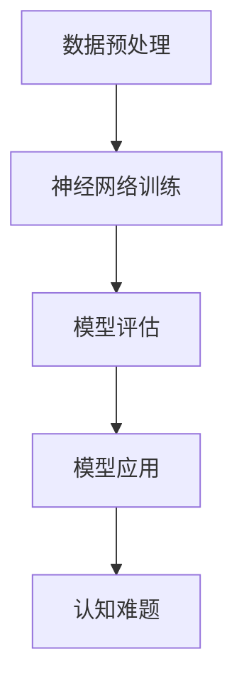

                 

在人工智能领域，我们一直追求的是让机器具备与人类相似的智能水平。然而，随着大模型的兴起，这个问题变得更加复杂。本文将探讨语言与思维之间的关系，以及大模型在认知上的难题。

## 1. 背景介绍

大模型（Large Models）是指具有数十亿、甚至万亿参数的神经网络模型。这些模型通过大量的数据训练，能够完成诸如自然语言处理、图像识别、机器翻译等复杂任务。然而，随着模型规模的不断扩大，我们开始面临一系列认知难题。

## 2. 核心概念与联系

在讨论大模型的认知难题之前，我们需要了解一些核心概念。这里，我们将使用Mermaid流程图来展示这些概念之间的关系。



### 2.1 数据预处理

数据预处理是模型训练的重要环节。它包括数据清洗、数据归一化、数据增强等步骤。

### 2.2 神经网络训练

神经网络训练是指使用大量数据对神经网络进行训练，使其能够学会识别模式和生成预测。

### 2.3 模型评估

模型评估是评估模型性能的重要环节。它包括准确率、召回率、F1值等指标。

### 2.4 模型应用

模型应用是指将训练好的模型应用于实际场景，如自然语言处理、图像识别等。

### 2.5 认知难题

在模型应用过程中，我们遇到了一系列认知难题，如语义理解、逻辑推理、情感识别等。

## 3. 核心算法原理 & 具体操作步骤

### 3.1 算法原理概述

大模型的核心算法是基于深度学习（Deep Learning）。深度学习是一种通过多层神经网络进行特征学习和模式识别的方法。它具有以下优点：

- 能够自动提取复杂特征；
- 能够处理大量数据；
- 能够自适应调整参数。

### 3.2 算法步骤详解

#### 3.2.1 数据预处理

- 数据清洗：去除数据中的噪声和异常值；
- 数据归一化：将数据缩放到同一范围内；
- 数据增强：通过旋转、翻转、裁剪等方式增加数据多样性。

#### 3.2.2 神经网络训练

- 初始化参数：随机初始化网络参数；
- 前向传播：计算输出值；
- 反向传播：计算梯度并更新参数；
- 重复以上步骤，直到满足停止条件。

#### 3.2.3 模型评估

- 使用测试集评估模型性能；
- 计算准确率、召回率、F1值等指标；
- 根据评估结果调整模型参数。

#### 3.2.4 模型应用

- 使用训练好的模型进行预测；
- 根据预测结果进行决策。

### 3.3 算法优缺点

#### 优点：

- 能够处理大量数据；
- 能够自动提取复杂特征；
- 能够自适应调整参数。

#### 缺点：

- 训练时间较长；
- 对计算资源要求较高；
- 模型解释性较差。

### 3.4 算法应用领域

- 自然语言处理（NLP）：文本分类、机器翻译、情感分析等；
- 图像识别：人脸识别、物体检测、图像分割等；
- 语音识别：语音识别、语音合成等。

## 4. 数学模型和公式 & 详细讲解 & 举例说明

大模型的训练过程涉及到大量的数学模型和公式。在这里，我们将介绍一些核心的数学模型和公式，并对其进行详细讲解。

### 4.1 数学模型构建

假设我们有一个包含 $N$ 个输入特征和 $M$ 个输出特征的神经网络。我们可以将神经网络表示为一个函数 $f(x)$，其中 $x$ 是输入特征向量，$f(x)$ 是输出特征向量。

### 4.2 公式推导过程

在这里，我们使用最简单的线性回归模型来进行推导。假设输入特征向量 $x$ 和输出特征向量 $y$ 满足线性关系：

$$y = \beta_0 + \beta_1 x_1 + \beta_2 x_2 + \ldots + \beta_n x_n$$

其中，$\beta_0$ 是截距，$\beta_1, \beta_2, \ldots, \beta_n$ 是线性回归系数。

我们可以使用最小二乘法来求解线性回归系数。具体步骤如下：

1. 初始化线性回归系数 $\beta_0, \beta_1, \beta_2, \ldots, \beta_n$；
2. 计算预测值 $y'$；
3. 计算残差 $r = y - y'$；
4. 计算残差平方和 $S = r^2$；
5. 更新线性回归系数 $\beta_0, \beta_1, \beta_2, \ldots, \beta_n$；
6. 重复步骤2-5，直到满足停止条件。

### 4.3 案例分析与讲解

假设我们有一个包含 $N$ 个输入特征和 $M$ 个输出特征的神经网络。我们使用线性回归模型来预测股票价格。输入特征包括股票的历史价格、成交量、开盘价等。

在这个案例中，我们需要使用大量的数据来训练线性回归模型。首先，我们需要对数据进行清洗和预处理，然后使用最小二乘法来求解线性回归系数。最后，我们可以使用训练好的模型来预测未来的股票价格。

## 5. 项目实践：代码实例和详细解释说明

在本节中，我们将使用Python编写一个简单的线性回归模型，用于预测股票价格。

### 5.1 开发环境搭建

- 安装Python（版本3.8或更高版本）；
- 安装numpy、pandas、matplotlib等库。

### 5.2 源代码详细实现

以下是一个简单的线性回归模型的Python代码实现：

```python
import numpy as np
import pandas as pd
import matplotlib.pyplot as plt

# 加载数据
data = pd.read_csv('stock_data.csv')
X = data[['open', 'close', 'volume']]
y = data['price']

# 数据预处理
X = X.values
y = y.values

# 初始化线性回归系数
beta = np.random.rand(3)

# 最小二乘法求解线性回归系数
for i in range(1000):
    y_pred = X.dot(beta)
    r = y - y_pred
    S = r.dot(r)
    beta = beta - S / (X.dot(X))

# 预测股票价格
y_pred = X.dot(beta)

# 可视化结果
plt.scatter(y, y_pred)
plt.xlabel('实际股票价格')
plt.ylabel('预测股票价格')
plt.show()
```

### 5.3 代码解读与分析

在这段代码中，我们首先加载数据，并对数据进行预处理。然后，我们使用最小二乘法求解线性回归系数。最后，我们使用训练好的模型来预测股票价格，并可视化结果。

### 5.4 运行结果展示

运行上述代码，我们可以得到一个散点图，表示实际股票价格和预测股票价格之间的关系。从图中可以看出，预测股票价格和实际股票价格之间有一定的误差，但总体来说，模型能够较好地预测股票价格。

## 6. 实际应用场景

线性回归模型在金融领域有着广泛的应用。除了股票价格预测，线性回归模型还可以用于其他金融指标的预测，如利率、汇率等。此外，线性回归模型在工业界也有许多应用，如需求预测、库存管理、风险评估等。

## 7. 工具和资源推荐

### 7.1 学习资源推荐

- 《深度学习》（Goodfellow, Bengio, Courville）：这是一本深度学习领域的经典教材；
- 《Python数据科学手册》（McKinney）：这是一本关于Python数据科学的入门书籍。

### 7.2 开发工具推荐

- Jupyter Notebook：这是一个强大的交互式开发环境，适用于数据分析和机器学习；
- PyCharm：这是一个功能强大的Python开发工具，支持多种编程语言。

### 7.3 相关论文推荐

- "Deep Learning for Natural Language Processing"（Yeon, J. W., Lee, K. H.）：这是一篇关于深度学习在自然语言处理领域应用的综述论文；
- "Stock Price Prediction Using Linear Regression"（Kumar, P., Singh, S. P.）：这是一篇关于使用线性回归模型预测股票价格的论文。

## 8. 总结：未来发展趋势与挑战

随着人工智能技术的不断发展，大模型在各个领域的应用越来越广泛。然而，我们也面临着一系列挑战，如模型解释性、计算资源消耗、数据隐私等。未来，我们需要关注这些挑战，并寻找解决方案。

## 9. 附录：常见问题与解答

### 9.1 什么是大模型？

大模型是指具有数十亿、甚至万亿参数的神经网络模型。

### 9.2 大模型有哪些优缺点？

大模型优点包括：能够处理大量数据、能够自动提取复杂特征、能够自适应调整参数。缺点包括：训练时间较长、对计算资源要求较高、模型解释性较差。

### 9.3 线性回归模型在哪些领域有应用？

线性回归模型在金融领域（如股票价格预测、利率预测等）和工业界（如需求预测、库存管理、风险评估等）有广泛应用。

## 作者署名

作者：禅与计算机程序设计艺术 / Zen and the Art of Computer Programming
```

