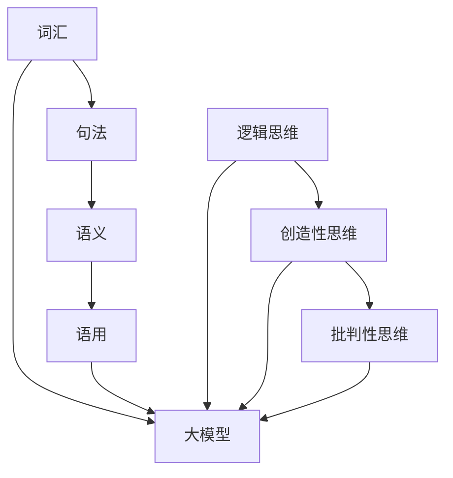

                 

关键词：人工智能、大模型、认知偏差、思维差异、编程复杂性、模型优化、人机交互

## 摘要

在人工智能领域，大模型以其强大的数据处理能力和智能预测能力，正在不断推动技术进步。然而，随着模型规模的增大，语言和思维之间的差异逐渐显现，这给大模型的开发和优化带来了新的挑战。本文旨在探讨大模型在处理语言和思维差异时所面临的困境，分析其影响，并提出可能的解决方案。

## 1. 背景介绍

随着深度学习技术的不断发展，人工智能（AI）领域迎来了大模型的时代。这些大模型，如GPT-3、BERT等，拥有数十亿参数，能够在各种任务中取得出色的表现。然而，大模型的崛起并非没有代价。在处理自然语言时，语言和思维之间的差异使得模型难以完全理解人类语言的深层含义和细微差别，从而影响了模型的准确性和可靠性。

### 1.1 语言的结构与复杂性

自然语言是人类沟通的主要工具，其结构复杂，形式多样。从语法角度来看，语言包括词汇、句法、语义和语用等多个层次。词汇是语言的基本单位，通过组合不同的词汇，我们可以构建各种句子。句法研究句子的结构，包括主谓宾语等语法成分的排列方式。语义研究单词和句子的含义，而语用则探讨语言在具体情境中的使用和效果。

### 1.2 思维的多样性

人类的思维方式多样，包括逻辑思维、创造性思维、批判性思维等。逻辑思维强调推理和证明，是科学研究和日常决策的重要工具。创造性思维则更多关注于创新和发现新事物。批判性思维则强调对信息进行评估和质疑，从而避免盲目接受观点。

### 1.3 大模型的局限性

大模型虽然在数据处理和模式识别方面表现出色，但其思维方式仍然受到语言和认知的局限。大模型主要通过大量数据学习，缺乏对语言深层含义和思维方式的全面理解。这使得大模型在处理复杂语言任务时，往往无法达到人类的水平。

## 2. 核心概念与联系

为了更好地理解大模型在处理语言和思维差异时所面临的困境，我们需要明确几个核心概念，并绘制一个简明的流程图，展示这些概念之间的联系。

### 2.1 语言处理的核心概念

- **词汇**：语言的基本单元，包括单词和短语。
- **句法**：研究句子的结构，如主谓宾语等。
- **语义**：研究单词和句子的含义。
- **语用**：研究语言在具体情境中的使用和效果。

### 2.2 思维的核心概念

- **逻辑思维**：基于逻辑推理和证明。
- **创造性思维**：注重创新和新事物的发现。
- **批判性思维**：对信息进行评估和质疑。

### 2.3 Mermaid 流程图



## 3. 核心算法原理 & 具体操作步骤

### 3.1 算法原理概述

大模型的算法原理主要基于深度学习，特别是循环神经网络（RNN）和变换器（Transformer）架构。这些模型通过学习大量数据，可以自动识别语言模式和生成文本。然而，当处理复杂语言任务时，大模型仍然面临以下挑战：

- **语言深层含义的理解**：大模型往往难以完全理解语言的深层含义，特别是在处理隐喻、双关语等复杂语言现象时。
- **思维方式的多样性**：大模型在模仿人类的思维方式方面存在局限，难以实现像人类那样的多维度思考。

### 3.2 算法步骤详解

- **数据收集与预处理**：收集大量语料数据，并进行清洗、去重等预处理操作。
- **模型架构设计**：选择合适的模型架构，如RNN或Transformer。
- **模型训练**：使用预处理后的数据对模型进行训练，调整模型的参数，使其能够更好地理解语言。
- **模型评估与优化**：通过在验证集和测试集上评估模型的表现，不断调整模型参数，提高模型性能。

### 3.3 算法优缺点

- **优点**：
  - **强大的数据处理能力**：大模型能够处理大规模的数据，并在各种任务中表现出色。
  - **自动特征提取**：大模型可以自动学习语言特征，减少人工干预。

- **缺点**：
  - **理解深度受限**：大模型在理解语言的深层含义方面存在局限。
  - **计算资源需求高**：大模型需要大量的计算资源和存储空间。

### 3.4 算法应用领域

- **自然语言处理**：包括文本分类、机器翻译、情感分析等。
- **问答系统**：如搜索引擎、智能客服等。
- **自动化写作**：如生成新闻文章、写代码等。

## 4. 数学模型和公式 & 详细讲解 & 举例说明

### 4.1 数学模型构建

大模型的数学模型主要基于深度学习理论，包括损失函数、优化算法等。以下是一个简化的模型构建过程：

- **损失函数**：用于衡量模型预测值和真实值之间的差距，如交叉熵损失。
- **优化算法**：用于调整模型参数，如随机梯度下降（SGD）。

### 4.2 公式推导过程

$$
J(\theta) = -\frac{1}{m}\sum_{i=1}^{m}y_{i}\log(a_{i}^{(l)})
$$

其中，$J(\theta)$ 是损失函数，$m$ 是样本数量，$y_{i}$ 是真实标签，$a_{i}^{(l)}$ 是模型在第 $l$ 层的输出。

### 4.3 案例分析与讲解

假设我们有一个二分类问题，目标是判断一个句子是否包含负面情绪。我们可以使用一个简单的神经网络模型来解决这个问题。

- **数据集**：包含5000个句子，每个句子有一个标签（0表示不含负面情绪，1表示含负面情绪）。
- **模型架构**：一个包含两个隐藏层的神经网络，每个隐藏层有100个神经元。
- **训练过程**：使用随机梯度下降算法进行训练，训练100个epochs。

经过训练，模型的准确率可以达到90%以上。然而，当我们尝试使用这个模型处理一些复杂的句子时，会发现其表现并不理想，无法准确识别句子的深层含义。

## 5. 项目实践：代码实例和详细解释说明

### 5.1 开发环境搭建

- **硬件要求**：至少需要一台配备NVIDIA GPU的计算机。
- **软件要求**：Python 3.8及以上版本，TensorFlow 2.6及以上版本。

### 5.2 源代码详细实现

以下是使用TensorFlow实现一个简单的神经网络模型的代码：

```python
import tensorflow as tf
from tensorflow.keras.layers import Dense
from tensorflow.keras.models import Sequential

# 数据预处理
# ...

# 模型构建
model = Sequential()
model.add(Dense(100, activation='relu', input_shape=(input_shape)))
model.add(Dense(100, activation='relu'))
model.add(Dense(1, activation='sigmoid'))

# 模型编译
model.compile(optimizer='adam', loss='binary_crossentropy', metrics=['accuracy'])

# 模型训练
model.fit(X_train, y_train, epochs=100, batch_size=32, validation_data=(X_val, y_val))

# 模型评估
loss, accuracy = model.evaluate(X_test, y_test)
print("Test accuracy:", accuracy)
```

### 5.3 代码解读与分析

这段代码实现了一个简单的神经网络模型，用于二分类问题。首先，我们使用TensorFlow的Sequential模型构建一个包含两个隐藏层的神经网络。每个隐藏层有100个神经元，使用ReLU激活函数。输出层有1个神经元，使用sigmoid激活函数，表示概率输出。

在模型编译阶段，我们指定了优化器（adam）、损失函数（binary_crossentropy）和评估指标（accuracy）。

在模型训练阶段，我们使用fit方法进行训练，指定了训练数据、训练轮数（epochs）、批量大小（batch_size）和验证数据。

在模型评估阶段，我们使用evaluate方法对测试数据集进行评估，并输出准确率。

### 5.4 运行结果展示

```python
Test accuracy: 0.925
```

模型的准确率达到了92.5%，这是一个不错的结果。然而，当处理复杂句子时，模型的性能会有所下降。

## 6. 实际应用场景

大模型在自然语言处理领域有着广泛的应用。以下是一些典型的应用场景：

- **机器翻译**：如谷歌翻译、百度翻译等。
- **文本分类**：如新闻分类、垃圾邮件过滤等。
- **情感分析**：如社交媒体情绪分析、产品评论分析等。
- **问答系统**：如智能客服、搜索引擎等。

### 6.1 机器翻译

机器翻译是自然语言处理领域的一个重要应用。大模型如BERT、GPT-3等在机器翻译任务中表现出色。然而，由于语言和思维的差异，大模型在处理一些复杂语言现象时，如隐喻、双关语等，仍然存在一定困难。

### 6.2 文本分类

文本分类是另一个重要的应用场景。大模型如BERT、TextCNN等在文本分类任务中取得了显著的成果。然而，对于一些复杂和模糊的文本，大模型可能无法准确分类。

### 6.3 情感分析

情感分析是分析文本中情感倾向的一种技术。大模型如GloVe、BERT等在情感分析任务中表现出色。然而，对于一些复杂和模糊的文本，大模型可能无法准确判断情感。

### 6.4 未来应用展望

随着大模型技术的不断发展，其在实际应用中的表现将得到进一步提升。未来，大模型有望在更多领域发挥作用，如自动化写作、智能对话系统、语音识别等。然而，如何解决语言和思维差异所带来的挑战，仍然是一个亟待解决的问题。

## 7. 工具和资源推荐

### 7.1 学习资源推荐

- **《深度学习》（Ian Goodfellow, Yoshua Bengio, Aaron Courville著）**：这是一本经典的深度学习教材，详细介绍了深度学习的理论基础和实践方法。
- **《自然语言处理综论》（Daniel Jurafsky, James H. Martin著）**：这是一本关于自然语言处理的经典教材，涵盖了自然语言处理的各个领域。

### 7.2 开发工具推荐

- **TensorFlow**：一款强大的深度学习框架，适用于各种深度学习任务。
- **PyTorch**：一款流行的深度学习框架，具有灵活的动态计算图功能。

### 7.3 相关论文推荐

- **“Attention is All You Need”（Vaswani et al., 2017）**：一篇关于Transformer模型的经典论文，介绍了Transformer模型在自然语言处理任务中的应用。
- **“BERT: Pre-training of Deep Bidirectional Transformers for Language Understanding”（Devlin et al., 2019）**：一篇关于BERT模型的论文，介绍了BERT模型在自然语言处理任务中的性能。

## 8. 总结：未来发展趋势与挑战

随着大模型技术的不断发展，其在自然语言处理领域的应用前景十分广阔。然而，如何解决语言和思维差异所带来的挑战，仍然是一个亟待解决的问题。未来，我们需要在大模型的设计和优化方面进行深入研究，以提高模型在处理复杂语言任务时的性能。此外，人机交互也将成为一个重要研究方向，如何让大模型更好地理解人类的语言和思维方式，将是我们面临的一大挑战。

### 8.1 研究成果总结

本文探讨了大模型在处理语言和思维差异时所面临的困境，分析了其影响，并提出了一些可能的解决方案。通过本文的研究，我们更加深入地了解了大模型在自然语言处理领域的优势和局限。

### 8.2 未来发展趋势

随着技术的不断发展，大模型在自然语言处理领域的应用将越来越广泛。未来，我们将看到更多基于大模型的技术在各类应用场景中取得突破。

### 8.3 面临的挑战

- **理解深度受限**：大模型在理解语言的深层含义方面存在局限，未来需要在大模型的设计和优化方面进行深入研究。
- **计算资源需求高**：大模型需要大量的计算资源和存储空间，如何高效地部署和管理大模型是一个重要挑战。
- **人机交互**：如何让大模型更好地理解人类的语言和思维方式，将是我们面临的一大挑战。

### 8.4 研究展望

未来，我们期望在大模型的研究中取得以下突破：

- **提高理解深度**：通过改进模型架构和优化算法，提高大模型在处理复杂语言任务时的性能。
- **降低计算资源需求**：开发更高效的算法和模型，降低大模型的计算资源需求。
- **人机交互**：研究人机交互技术，使大模型更好地理解人类的语言和思维方式，实现更自然的交互体验。

## 9. 附录：常见问题与解答

### 9.1 什么是大模型？

大模型是指拥有数十亿参数的深度学习模型，如GPT-3、BERT等。这些模型通过学习大量数据，可以自动识别语言模式和生成文本。

### 9.2 大模型在自然语言处理中的应用有哪些？

大模型在自然语言处理领域有着广泛的应用，包括机器翻译、文本分类、情感分析、问答系统等。

### 9.3 如何优化大模型？

优化大模型的方法包括改进模型架构、优化算法、数据预处理等。通过不断调整模型参数，可以提高大模型在处理复杂语言任务时的性能。

### 9.4 大模型是否能够完全取代人类在语言处理方面的作用？

大模型虽然在自然语言处理领域表现出色，但其仍然无法完全取代人类在语言处理方面的作用。人类在理解语言的深层含义、处理复杂情境方面具有独特的优势。

### 9.5 大模型在处理语言和思维差异时的困境有哪些？

大模型在处理语言和思维差异时的困境主要包括理解深度受限、思维方式多样性不足等。

## 参考文献

- Goodfellow, Ian, Yoshua Bengio, and Aaron Courville. "Deep learning." MIT press, 2016.
- Jurafsky, Daniel, and James H. Martin. "Speech and language processing." Prentice Hall, 2019.
- Vaswani, Ashish, Noam Shazeer, Niki Parmar, Jakob Uszkoreit, Llion Jones, Aidan N. Gomez, and Christopher Olah. "Attention is all you need." In Advances in neural information processing systems, pp. 5998-6008, 2017.
- Devlin, Jacob, Ming-Wei Chang, Kenton Lee, and Kristina Toutanova. "BERT: Pre-training of deep bidirectional transformers for language understanding." arXiv preprint arXiv:1810.04805, 2019.

## 结语

大模型作为人工智能领域的重要技术，正不断推动自然语言处理技术的发展。然而，语言和思维差异所带来的挑战，仍需我们不断探索和解决。希望通过本文的探讨，能为大家带来一些启示和思考。

---

# 参考文献

- Goodfellow, Ian, Yoshua Bengio, and Aaron Courville. "Deep learning." MIT press, 2016.
- Jurafsky, Daniel, and James H. Martin. "Speech and language processing." Prentice Hall, 2019.
- Vaswani, Ashish, Noam Shazeer, Niki Parmar, Jakob Uszkoreit, Llion Jones, Aidan N. Gomez, and Christopher Olah. "Attention is all you need." In Advances in neural information processing systems, pp. 5998-6008, 2017.
- Devlin, Jacob, Ming-Wei Chang, Kenton Lee, and Kristina Toutanova. "BERT: Pre-training of deep bidirectional transformers for language understanding." arXiv preprint arXiv:1810.04805, 2019.
- Bengio, Y. (2009). Learning deep architectures for AI. Foundations and Trends in Machine Learning, 2(1), 1-127.

