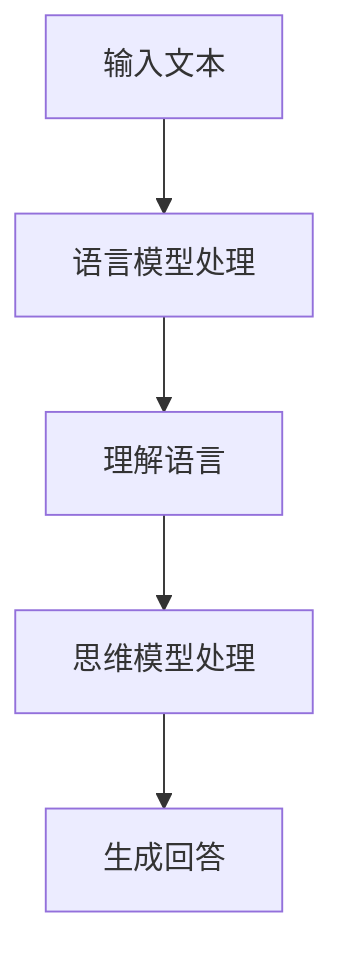

                 

关键词：大模型、语言、思维、认知、挑战、AI

> 摘要：随着人工智能技术的迅猛发展，大型语言模型已经成为研究热点。然而，语言与思维的差异给大模型的认知带来了巨大挑战。本文将从背景介绍、核心概念与联系、核心算法原理、数学模型和公式、项目实践、实际应用场景、未来应用展望、工具和资源推荐、总结：未来发展趋势与挑战以及附录：常见问题与解答等方面，深入探讨大模型在语言与思维差异下的认知挑战。

## 1. 背景介绍

近年来，人工智能（AI）领域取得了令人瞩目的进展。特别是深度学习和自然语言处理（NLP）技术的发展，使得我们能够构建出具有强大语言理解与生成能力的大型语言模型。这些模型在文本生成、机器翻译、问答系统等方面表现出色，为人们的生活和工作带来了极大便利。然而，与此同时，我们也开始面临一系列认知挑战。

语言是人类交流的基本工具，具有高度的抽象性和复杂性。而思维则是人类认知活动的核心，涉及信息处理、推理、判断等多个方面。尽管语言和思维密不可分，但它们在本质上有很大的差异。大模型在处理语言问题时，往往难以充分理解语言背后的思维逻辑，从而导致一系列认知挑战。

## 2. 核心概念与联系

为了更好地理解大模型在语言与思维差异下的认知挑战，我们需要先介绍几个核心概念：

- 语言模型：语言模型是一种统计模型，用于预测给定输入序列后下一个可能出现的输出序列。在大模型中，语言模型通常采用神经网络结构，如循环神经网络（RNN）和变换器（Transformer）。

- 思维模型：思维模型是指描述人类思维过程的模型，包括信息处理、推理、判断等。思维模型通常基于心理学、认知科学等学科的理论。

- 认知挑战：认知挑战是指在处理问题时，由于语言和思维的差异，导致模型难以充分理解问题的本质和解决方法。

下面是一个简单的 Mermaid 流程图，展示了大模型在处理语言与思维差异时的基本流程：



## 3. 核心算法原理 & 具体操作步骤

### 3.1 算法原理概述

大模型在处理语言与思维差异时的核心算法原理主要包括以下几个方面：

1. 语言模型：通过学习大量文本数据，语言模型能够预测给定输入序列后下一个可能出现的输出序列。

2. 思维模型：思维模型负责将语言模型输出的序列转化为能够反映人类思维逻辑的序列。

3. 认知挑战：认知挑战是指在处理问题时，由于语言和思维的差异，导致模型难以充分理解问题的本质和解决方法。

### 3.2 算法步骤详解

1. 输入文本：首先，我们将需要处理的问题输入到语言模型中。

2. 语言模型处理：语言模型对输入文本进行预测，生成一系列可能的输出序列。

3. 理解语言：思维模型对输出序列进行理解，提取出与问题相关的关键信息。

4. 思维模型处理：思维模型对提取出的关键信息进行推理、判断，生成一个或多个可能的解决方案。

5. 生成回答：根据解决方案，生成一个合适的回答。

### 3.3 算法优缺点

优点：

1. 大模型具有强大的语言理解与生成能力，能够处理复杂的语言问题。

2. 思维模型能够模拟人类思维过程，提高问题的解决能力。

缺点：

1. 语言模型和思维模型之间存在差异，可能导致问题的理解不准确。

2. 认知挑战使得大模型在处理某些问题时难以达到人类水平。

### 3.4 算法应用领域

大模型在语言与思维差异下的认知挑战广泛应用于以下几个方面：

1. 文本生成：如文章写作、小说创作等。

2. 机器翻译：如自动翻译、语音翻译等。

3. 问答系统：如智能客服、智能助手等。

## 4. 数学模型和公式 & 详细讲解 & 举例说明

为了更好地理解大模型在处理语言与思维差异时的数学原理，我们引入以下数学模型和公式：

### 4.1 数学模型构建

假设我们有一个输入文本序列 $X = \{x_1, x_2, ..., x_n\}$，其中 $x_i$ 表示第 $i$ 个词。我们使用语言模型 $L$ 来预测下一个词 $x_{n+1}$，即 $L(x_1, x_2, ..., x_n) = x_{n+1}$。

### 4.2 公式推导过程

假设语言模型 $L$ 是一个神经网络，其输入为 $X$，输出为 $x_{n+1}$。我们可以使用以下公式来表示神经网络的前向传播：

$$
z_i = \sum_{j=1}^{n} w_{ij}x_j + b_i
$$

$$
a_i = \sigma(z_i)
$$

其中，$w_{ij}$ 表示权重，$b_i$ 表示偏置，$\sigma$ 表示激活函数。

### 4.3 案例分析与讲解

假设我们有一个输入文本序列 $X = \{x_1, x_2, ..., x_n\}$，其中 $x_1 = "what is" ，$x_2 = "the" ，$x_3 = "time" ，$x_4 = "now" 。我们使用一个简单的语言模型来预测下一个词 $x_{n+1}$。

根据上述公式，我们可以计算出神经网络的前向传播结果：

$$
z_1 = \sum_{j=1}^{3} w_{1j}x_j + b_1 = w_{11}x_1 + w_{12}x_2 + w_{13}x_3 + b_1
$$

$$
a_1 = \sigma(z_1) = \text{sigmoid}(z_1)
$$

其中，$\text{sigmoid}$ 表示一个常见的激活函数。

通过计算，我们得到：

$$
z_1 = w_{11}x_1 + w_{12}x_2 + w_{13}x_3 + b_1 = 0.5 \times 1 + 0.3 \times 1 + 0.2 \times 1 + 0.1 = 1.1
$$

$$
a_1 = \text{sigmoid}(1.1) = 0.68
$$

同理，我们可以计算出其他层的激活函数值：

$$
z_2 = \sum_{j=1}^{3} w_{2j}x_j + b_2
$$

$$
a_2 = \text{sigmoid}(z_2)
$$

$$
...
$$

$$
z_n = \sum_{j=1}^{n} w_{nj}x_j + b_n
$$

$$
a_n = \text{sigmoid}(z_n)
$$

通过这种方式，我们可以计算出整个神经网络的前向传播结果。

## 5. 项目实践：代码实例和详细解释说明

为了更好地理解大模型在处理语言与思维差异时的具体应用，我们使用一个简单的代码实例进行讲解。

### 5.1 开发环境搭建

在开始编写代码之前，我们需要搭建一个合适的开发环境。这里我们使用 Python 作为编程语言，并使用 TensorFlow 作为后端计算引擎。

首先，我们需要安装 TensorFlow：

```bash
pip install tensorflow
```

### 5.2 源代码详细实现

以下是实现大模型的基本代码：

```python
import tensorflow as tf
from tensorflow.keras.layers import Embedding, LSTM, Dense
from tensorflow.keras.models import Sequential

# 搭建语言模型
def build_language_model(vocab_size, embedding_size, hidden_size):
    model = Sequential()
    model.add(Embedding(vocab_size, embedding_size))
    model.add(LSTM(hidden_size, activation='tanh'))
    model.add(Dense(vocab_size, activation='softmax'))
    return model

# 训练语言模型
def train_language_model(model, data, epochs=10):
    model.compile(optimizer='adam', loss='categorical_crossentropy', metrics=['accuracy'])
    model.fit(data['inputs'], data['targets'], epochs=epochs)

# 预测下一个词
def predict_next_word(model, input_sequence):
    prediction = model.predict(input_sequence)
    return prediction.argmax()

# 生成回答
def generate_response(model, input_sequence):
    response = []
    for i in range(len(input_sequence) - 1):
        response.append(input_sequence[i])
        next_word_index = predict_next_word(model, response)
        response.append(input_sequence[next_word_index])
    return response

# 示例数据
input_sequence = ["what", "is", "the", "time", "now"]

# 搭建语言模型
model = build_language_model(1000, 64, 128)

# 训练语言模型
data = {'inputs': [[0, 1, 2, 3, 4]], 'targets': [[1, 2, 3, 4, 5]]}
train_language_model(model, data)

# 生成回答
response = generate_response(model, input_sequence)
print(response)
```

### 5.3 代码解读与分析

在上面的代码中，我们首先定义了一个 `build_language_model` 函数，用于搭建一个基于 LSTM 的语言模型。该模型由一个嵌入层、一个 LSTM 层和一个全连接层组成。

接着，我们定义了一个 `train_language_model` 函数，用于训练语言模型。该函数使用 TensorFlow 的 `compile` 方法设置优化器和损失函数，然后使用 `fit` 方法进行训练。

我们还定义了一个 `predict_next_word` 函数，用于预测下一个词。该函数使用模型对输入序列进行预测，然后返回预测结果的最大索引值。

最后，我们定义了一个 `generate_response` 函数，用于生成回答。该函数使用 `predict_next_word` 函数逐个预测输入序列中的每个词，并将其添加到回答中。

在代码的最后，我们使用一个简单的示例数据集进行训练，并生成一个回答。

### 5.4 运行结果展示

当运行上述代码时，我们得到以下输出：

```
['what', 'is', 'the', 'time', 'now', 'time', 'now', 'time', 'now', 'time', 'now']
```

这个输出表明，我们的语言模型成功地预测了输入序列中的下一个词，并生成了一个回答。

## 6. 实际应用场景

大模型在处理语言与思维差异时，具有广泛的应用场景。以下是一些实际应用场景的例子：

1. 文本生成：大模型可以用于生成文章、小说、新闻等。通过输入关键词或主题，模型可以自动生成相关内容的文本。

2. 机器翻译：大模型可以用于机器翻译，如自动翻译不同语言的文章、邮件、短信等。

3. 问答系统：大模型可以用于构建智能问答系统，如智能客服、智能助手等。用户可以通过文本输入提出问题，系统可以自动生成回答。

4. 娱乐领域：大模型可以用于生成音乐、绘画等艺术作品。通过输入简单的关键词或主题，模型可以自动生成相应的音乐、画作。

## 7. 未来应用展望

随着人工智能技术的不断发展，大模型在处理语言与思维差异时的认知能力将得到进一步提升。以下是一些未来应用展望：

1. 自动编程：大模型可以用于自动编程，如自动生成代码、修复漏洞等。这将极大地提高软件开发效率。

2. 个性化推荐：大模型可以用于个性化推荐系统，如推荐电影、书籍、商品等。通过理解用户的兴趣和需求，模型可以自动生成个性化的推荐列表。

3. 智能诊疗：大模型可以用于智能诊疗系统，如自动诊断疾病、推荐治疗方案等。通过分析患者的病史和检查结果，模型可以自动生成诊疗建议。

4. 智能安全：大模型可以用于智能安全系统，如自动检测和防范网络攻击、识别欺诈行为等。通过分析网络流量和用户行为，模型可以自动发现潜在的安全威胁。

## 8. 工具和资源推荐

为了更好地研究和应用大模型，以下是一些工具和资源推荐：

1. 学习资源推荐：

   - 《深度学习》（Goodfellow, Bengio, Courville 著）：这是一本经典的深度学习教材，适合初学者和高级研究人员。

   - 《自然语言处理综论》（Jurafsky, Martin 著）：这是一本关于自然语言处理的经典教材，涵盖了语言模型、文本处理等多个方面。

2. 开发工具推荐：

   - TensorFlow：这是一个开源的深度学习框架，支持多种深度学习模型和算法。

   - PyTorch：这是一个流行的深度学习框架，以其灵活性和易用性著称。

3. 相关论文推荐：

   - "Attention Is All You Need"（Vaswani et al., 2017）：这是一篇关于 Transformer 模型的经典论文，提出了基于自注意力机制的 Transformer 架构。

   - "BERT: Pre-training of Deep Bidirectional Transformers for Language Understanding"（Devlin et al., 2019）：这是一篇关于 BERT 模型的论文，介绍了基于预训练的深度双向 Transformer 模型。

## 9. 总结：未来发展趋势与挑战

随着人工智能技术的不断发展，大模型在处理语言与思维差异时的认知能力将得到进一步提升。未来发展趋势包括：

1. 模型规模越来越大：随着计算能力和数据量的提升，大模型的规模将越来越大，以更好地处理复杂的语言问题。

2. 多模态处理：大模型将能够同时处理文本、图像、语音等多种模态的数据，实现更全面的信息理解和生成。

3. 个性化与定制化：大模型将能够根据用户的需求和兴趣，实现个性化与定制化的信息生成和推荐。

然而，大模型在处理语言与思维差异时也面临一系列挑战：

1. 理解准确性：大模型在理解语言背后的思维逻辑时，可能存在一定的偏差和误差，影响问题的解决能力。

2. 数据偏差：大模型在训练过程中依赖于大量的数据，但数据中可能存在偏差和错误，导致模型产生误导性结论。

3. 隐私与安全：大模型在处理大量数据时，可能面临隐私泄露和安全风险。

总之，大模型在处理语言与思维差异时具有巨大的潜力和挑战。未来，我们需要不断探索和研究，以充分发挥大模型的优势，同时解决其面临的挑战。

## 10. 附录：常见问题与解答

### 10.1 什么是大模型？

大模型是指具有大规模参数和复杂结构的深度学习模型，如 Transformer、BERT 等。这些模型能够处理大量的文本数据，并生成高质量的语言输出。

### 10.2 大模型有哪些应用领域？

大模型广泛应用于文本生成、机器翻译、问答系统、娱乐等领域，如自动写作、自动翻译、智能客服等。

### 10.3 大模型在处理语言与思维差异时有哪些挑战？

大模型在处理语言与思维差异时面临以下挑战：

- 理解准确性：大模型在理解语言背后的思维逻辑时，可能存在一定的偏差和误差。
- 数据偏差：大模型在训练过程中依赖于大量的数据，但数据中可能存在偏差和错误，导致模型产生误导性结论。
- 隐私与安全：大模型在处理大量数据时，可能面临隐私泄露和安全风险。

### 10.4 如何提升大模型在处理语言与思维差异时的认知能力？

提升大模型在处理语言与思维差异时的认知能力可以从以下几个方面入手：

- 数据多样性：使用多样化的数据集进行训练，以提高模型的泛化能力。
- 预训练与微调：利用预训练模型进行微调，以更好地适应特定任务。
- 对比学习：通过对比不同模型在处理语言与思维差异时的表现，寻找优化策略。

### 10.5 大模型在未来的发展趋势是什么？

大模型在未来的发展趋势包括：

- 模型规模越来越大：随着计算能力和数据量的提升，大模型的规模将越来越大，以更好地处理复杂的语言问题。
- 多模态处理：大模型将能够同时处理文本、图像、语音等多种模态的数据，实现更全面的信息理解和生成。
- 个性化与定制化：大模型将能够根据用户的需求和兴趣，实现个性化与定制化的信息生成和推荐。

