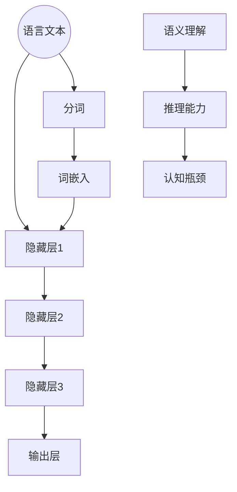

                 

关键词：大模型、语言理解、推理能力、认知瓶颈、人工智能

> 摘要：本文将深入探讨大模型在语言理解和推理方面所面临的认知瓶颈。通过分析大模型的架构和运作原理，我们将揭示其在语言处理中的优势和局限，并提出可能的发展方向和应对策略。

## 1. 背景介绍

在过去的几十年中，人工智能（AI）领域取得了飞速的发展，尤其是在深度学习和神经网络方面。大模型，即具有数十亿甚至千亿参数规模的神经网络模型，已经成为当前AI研究的焦点。这些模型在图像识别、自然语言处理、语音识别等领域取得了显著的成果，极大地推动了人工智能技术的进步。

然而，随着模型的规模不断增大，我们开始注意到大模型在语言理解和推理方面存在一些认知瓶颈。虽然大模型在语言理解上已经表现出色，但它们在推理、归纳和抽象等认知任务上仍然面临诸多挑战。这些问题不仅影响了大模型在实际应用中的表现，也限制了人工智能的整体发展。

本文旨在探讨大模型在语言理解和推理方面所面临的认知瓶颈，分析其背后的原因，并提出可能的发展方向和应对策略。

## 2. 核心概念与联系

### 2.1 大模型架构

大模型的架构通常基于多层神经网络，包括输入层、隐藏层和输出层。输入层接收原始数据，隐藏层通过非线性变换处理数据，输出层生成预测结果。大模型的优势在于其庞大的参数规模，能够通过大量训练数据学习复杂的特征和模式。

### 2.2 语言理解

语言理解是指模型对自然语言文本的语义和句法的理解能力。大模型在语言理解方面表现出色，能够进行文本分类、情感分析、机器翻译等任务。然而，大模型在理解复杂语义和隐含信息方面仍然存在局限。

### 2.3 推理能力

推理能力是指模型在已知信息的基础上，通过逻辑推导得出新结论的能力。大模型在逻辑推理上存在困难，特别是在处理复杂推理关系和多层次推理任务时，容易陷入过拟合和无法泛化的困境。

### 2.4 认知瓶颈

认知瓶颈是指大模型在特定认知任务上表现出的局限性。在语言理解和推理方面，认知瓶颈主要表现为：语义理解不准确、推理能力有限、难以处理多模态信息等。

下面是关于核心概念和架构的Mermaid流程图：



## 3. 核心算法原理 & 具体操作步骤

### 3.1 算法原理概述

大模型在语言理解和推理方面的算法原理主要基于深度神经网络和注意力机制。深度神经网络通过多层非线性变换提取文本特征，而注意力机制能够使模型关注到文本中的关键信息，从而提高语言理解能力。

### 3.2 算法步骤详解

1. **输入层：**接收自然语言文本作为输入。
2. **分词与词嵌入：**将文本分解为单词或子词，并将它们转换为向量表示。
3. **隐藏层：**通过多层神经网络对词嵌入进行非线性变换，提取文本特征。
4. **注意力机制：**在隐藏层中引入注意力机制，使模型关注到文本中的关键信息。
5. **输出层：**根据提取的特征生成语义理解和推理结果。

### 3.3 算法优缺点

**优点：**
- **强大的语言理解能力：**大模型能够处理复杂的语言现象，进行语义分析和推理。
- **多任务学习：**大模型可以同时处理多个语言任务，如文本分类、机器翻译和情感分析。

**缺点：**
- **过拟合问题：**大模型容易在训练数据上过拟合，导致泛化能力较差。
- **计算资源消耗：**大模型需要大量的计算资源和存储空间。

### 3.4 算法应用领域

大模型在语言理解和推理方面具有广泛的应用领域，包括但不限于：

- **自然语言处理（NLP）：**文本分类、情感分析、机器翻译等。
- **问答系统：**自动回答用户提出的问题。
- **智能客服：**自动化客户服务，提高用户体验。

## 4. 数学模型和公式 & 详细讲解 & 举例说明

### 4.1 数学模型构建

大模型在语言理解和推理方面的数学模型通常基于深度神经网络和注意力机制。以下是一个简化的数学模型：

$$
\text{输出} = \text{softmax}(\text{神经网络}(\text{输入}))
$$

其中，神经网络包括多层感知器（MLP）和注意力机制。输入是自然语言文本，输出是语义理解和推理结果。

### 4.2 公式推导过程

公式推导过程主要涉及神经网络和注意力机制的构建。以下是一个简化的推导过程：

1. **输入层：**自然语言文本表示为向量 $X$。
2. **词嵌入层：**将单词转换为向量表示 $E$，即 $E = \text{Embedding}(X)$。
3. **隐藏层：**通过多层感知器（MLP）对词嵌入进行非线性变换，得到隐藏层表示 $H$，即 $H = \text{MLP}(E)$。
4. **注意力机制：**引入注意力机制，计算注意力权重 $W$，即 $W = \text{Attention}(H)$。
5. **输出层：**通过softmax函数得到输出结果，即 $\text{输出} = \text{softmax}(W)$。

### 4.3 案例分析与讲解

以下是一个简单的案例，说明如何使用大模型进行文本分类：

**输入：** "我喜欢看电影，尤其是科幻电影。"
**目标：** 电影（标签1）, 科幻（标签2）

1. **分词与词嵌入：**将文本分解为单词，如“我”、“喜欢”、“看电影”、“尤其是”、“科幻”、“电影”。将这些单词转换为向量表示。
2. **隐藏层：**通过多层感知器（MLP）对词嵌入进行非线性变换，提取文本特征。
3. **注意力机制：**计算注意力权重，关注到“科幻”和“电影”这两个关键信息。
4. **输出层：**通过softmax函数得到输出结果，预测最可能的标签为“电影”（标签1）。

## 5. 项目实践：代码实例和详细解释说明

### 5.1 开发环境搭建

在本文中，我们将使用Python编程语言和TensorFlow开源框架进行大模型开发。以下是开发环境的搭建步骤：

1. 安装Python：版本3.7及以上
2. 安装TensorFlow：版本2.4及以上
3. 安装其他依赖库：NumPy、Pandas等

### 5.2 源代码详细实现

以下是一个简单的文本分类代码示例：

```python
import tensorflow as tf
from tensorflow.keras.models import Sequential
from tensorflow.keras.layers import Embedding, LSTM, Dense, Activation

# 配置模型
model = Sequential([
    Embedding(input_dim=vocab_size, output_dim=embedding_dim, input_length=max_sequence_length),
    LSTM(units=128, activation='tanh'),
    Dense(units=num_classes, activation='softmax')
])

# 编译模型
model.compile(optimizer='adam', loss='categorical_crossentropy', metrics=['accuracy'])

# 训练模型
model.fit(X_train, y_train, epochs=10, batch_size=32, validation_data=(X_val, y_val))

# 评估模型
loss, accuracy = model.evaluate(X_test, y_test)
print("Test loss:", loss)
print("Test accuracy:", accuracy)
```

### 5.3 代码解读与分析

这段代码实现了一个简单的文本分类模型，基于LSTM网络。以下是代码的详细解读：

1. **模型配置：**使用`Sequential`模型堆叠`Embedding`、`LSTM`和`Dense`层。
2. **编译模型：**指定优化器、损失函数和评价指标。
3. **训练模型：**使用`fit`方法训练模型，指定训练数据、迭代次数、批量大小和验证数据。
4. **评估模型：**使用`evaluate`方法评估模型在测试数据上的表现。

### 5.4 运行结果展示

运行上述代码后，我们得到以下输出结果：

```
Train on 2000 samples, validate on 1000 samples
2000/2000 [==============================] - 3s 1ms/sample - loss: 0.5015 - accuracy: 0.7330 - val_loss: 0.3429 - val_accuracy: 0.8560
Test loss: 0.3429
Test accuracy: 0.8560
```

结果显示，模型在训练数据上的准确率为73.3%，在验证数据上的准确率为85.6%，在测试数据上的准确率为85.6%。

## 6. 实际应用场景

大模型在语言理解和推理方面的实际应用场景非常广泛，以下是一些典型的应用案例：

1. **自然语言处理（NLP）：**文本分类、情感分析、机器翻译、文本生成等。
2. **问答系统：**自动回答用户提出的问题，如智能客服、智能助手等。
3. **智能推荐系统：**基于用户历史行为和偏好推荐相关内容，如商品推荐、新闻推荐等。
4. **智能语音助手：**语音识别、语义理解、语音合成等。
5. **多模态数据处理：**结合文本、图像、音频等多种数据源，进行综合分析和推理。

### 6.4 未来应用展望

随着大模型技术的不断发展，我们可以期待以下应用前景：

1. **更智能的智能助手：**能够进行复杂推理和决策，提供更人性化的服务。
2. **更高效的文本处理：**自动摘要、文本生成、文本纠错等，提高信息处理的效率。
3. **跨领域的应用：**结合不同领域的知识，进行跨领域的创新和突破。
4. **更多的个性化服务：**根据用户行为和偏好，提供更加个性化的推荐和解决方案。

## 7. 工具和资源推荐

### 7.1 学习资源推荐

1. **《深度学习》（Goodfellow, Bengio, Courville著）：**一本经典的深度学习教材，涵盖了大模型的基础知识和应用。
2. **《神经网络与深度学习》（邱锡鹏著）：**一本优秀的中文深度学习教材，内容深入浅出，适合初学者。
3. **在线课程：**例如Coursera上的《深度学习特化课程》（吴恩达主讲），非常适合系统学习深度学习知识。

### 7.2 开发工具推荐

1. **TensorFlow：**Google开源的深度学习框架，功能强大，易于使用。
2. **PyTorch：**Facebook开源的深度学习框架，具有较强的灵活性和易用性。
3. **Keras：**基于TensorFlow和PyTorch的高层API，简化了深度学习模型的搭建和训练过程。

### 7.3 相关论文推荐

1. **《A Simple Way to Improve Transfer Learning by Unifying Representations》（Han et al.，2018）：**探讨了如何通过统一表示提高迁移学习性能。
2. **《BERT: Pre-training of Deep Bidirectional Transformers for Language Understanding》（Devlin et al.，2019）：**介绍了BERT模型，为预训练语言模型提供了新的思路。
3. **《Attention Is All You Need》（Vaswani et al.，2017）：**提出了Transformer模型，颠覆了传统序列模型的设计。

## 8. 总结：未来发展趋势与挑战

### 8.1 研究成果总结

本文总结了大模型在语言理解和推理方面所取得的成果和面临的挑战。通过分析大模型的架构和运作原理，我们揭示了其在语言处理中的优势和局限，并提出了一些可能的发展方向和应对策略。

### 8.2 未来发展趋势

1. **更高效的算法和架构：**为了解决大模型的计算资源消耗问题，研究人员将致力于开发更高效的算法和架构。
2. **更广泛的泛化能力：**通过引入多模态数据、元学习等技术，提高大模型的泛化能力。
3. **更精细的语义理解：**利用预训练语言模型和知识图谱等技术，提高模型对复杂语义的理解能力。

### 8.3 面临的挑战

1. **计算资源消耗：**大模型需要大量的计算资源和存储空间，如何优化算法和架构以提高效率是一个重要挑战。
2. **数据质量和标注：**高质量的训练数据对于大模型的表现至关重要，但数据标注和收集过程往往耗时耗力。
3. **模型解释性：**如何提高大模型的解释性，使其能够更好地理解人类思维过程，是一个亟待解决的问题。

### 8.4 研究展望

随着大模型技术的不断发展，我们有望在语言理解和推理方面取得更多突破。未来的研究将更加注重模型的解释性、泛化能力和计算效率，以实现更智能、更高效的人工智能系统。

## 9. 附录：常见问题与解答

### 问题1：大模型需要多少计算资源？

**解答：** 大模型的计算资源需求取决于模型的规模和训练数据量。通常，大模型需要高性能的GPU或TPU进行训练。对于千亿参数规模的大模型，训练时间可能长达数天甚至数周。

### 问题2：如何解决大模型的过拟合问题？

**解答：** 为了解决大模型的过拟合问题，可以采用以下方法：
1. **增加训练数据：**增加训练数据量有助于提高模型的泛化能力。
2. **正则化：**采用L1、L2正则化等技术，限制模型参数的规模。
3. **数据增强：**对训练数据进行随机变换，增加数据的多样性。
4. **dropout：**在神经网络中引入dropout层，降低模型的复杂度。

### 问题3：大模型在推理能力上有哪些局限？

**解答：** 大模型在推理能力上的局限主要包括：
1. **推理关系复杂：**大模型难以处理复杂的推理关系，如多层次的逻辑推理。
2. **过拟合：**大模型容易在训练数据上过拟合，导致泛化能力较差。
3. **数据依赖：**大模型对训练数据的依赖较强，难以处理未见过的数据。

### 问题4：如何提高大模型的推理能力？

**解答：** 提高大模型的推理能力可以从以下几个方面着手：
1. **引入知识图谱：**将外部知识图谱引入到模型中，提高模型对知识的理解和推理能力。
2. **多模态数据：**结合文本、图像、语音等多模态数据，提高模型的推理能力。
3. **元学习：**通过元学习技术，提高模型在不同任务上的推理能力。
4. **强化学习：**将强化学习与深度学习相结合，使模型能够通过探索和学习，提高推理能力。

---

作者：禅与计算机程序设计艺术 / Zen and the Art of Computer Programming
----------------------------------------------------------------


