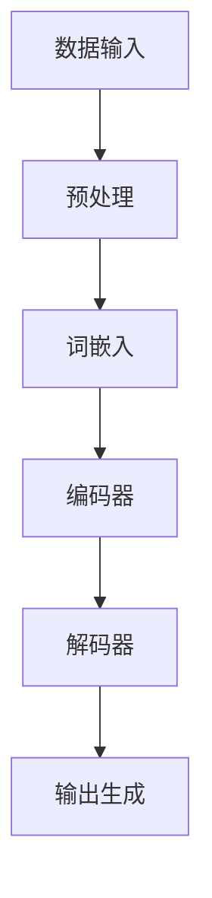

                 

 关键词：语言模型、推理能力、认知障碍、大规模模型、语义理解、计算效率

> 摘要：随着人工智能技术的不断发展，大规模语言模型在语言理解和生成方面取得了显著的成果。然而，这些模型在推理能力上仍然存在认知障碍，影响了其在实际应用中的表现。本文将探讨大模型在推理方面的限制，分析其成因，并提出潜在解决方案。

## 1. 背景介绍

### 1.1 大规模语言模型的发展

在过去的几年中，深度学习技术，尤其是神经网络，在大规模语言模型（如GPT-3、BERT等）的开发中取得了巨大成功。这些模型通过处理大量的文本数据，能够生成高质量的文本，并且在自然语言理解、问答系统、机器翻译等多个领域展现出了强大的性能。

### 1.2 语言模型的推理能力

尽管语言模型在文本生成和理解方面表现优异，但它们在推理能力上仍然存在显著的限制。推理能力是指模型能否基于已有信息推导出新的结论或逻辑关系。这在许多实际应用中至关重要，如智能助手、法律咨询、医疗诊断等。

## 2. 核心概念与联系

### 2.1 语言模型的架构

首先，让我们通过一个Mermaid流程图来简要了解大规模语言模型的架构：



在这个流程图中，数据输入经过预处理和词嵌入后，由编码器进行处理，解码器则生成最终的输出。

### 2.2 推理与语言模型的关系

推理是指基于已有信息推断出新信息的过程。在人类认知中，推理是一种核心能力。然而，目前的语言模型在推理方面存在以下问题：

- **逻辑推理不足**：语言模型在处理逻辑语句时，往往只能生成与输入语句相关的信息，而无法进行更复杂的逻辑推导。
- **上下文理解受限**：语言模型在理解上下文时，往往只能依赖局部信息，而难以把握全局逻辑关系。
- **常识推理缺乏**：语言模型缺乏对常识和背景知识的理解，这在推理过程中是一个重要缺陷。

### 2.3 推理的认知障碍

大模型的认知障碍主要体现在以下几个方面：

- **计算资源限制**：大规模语言模型的计算复杂度高，难以在实时应用中高效运行。
- **数据依赖性**：语言模型依赖于大量训练数据，而数据质量和多样性直接影响模型的推理能力。
- **参数复杂性**：大规模语言模型参数众多，这使得模型难以解释和理解。

## 3. 核心算法原理 & 具体操作步骤

### 3.1 算法原理概述

大规模语言模型主要基于以下两个核心算法：

- **词嵌入**：通过将文本中的单词映射到低维向量空间，使得相似词在向量空间中更接近。
- **变换器模型**：采用多层神经网络结构，对输入文本进行编码和解码，生成高质量的输出。

### 3.2 算法步骤详解

#### 3.2.1 数据预处理

1. **文本清洗**：去除文本中的无关信息，如标点符号、停用词等。
2. **分词**：将文本分解为单词或子词。
3. **词嵌入**：将分词结果映射到向量空间。

#### 3.2.2 编码器

1. **嵌入层**：将词嵌入转换为编码器输入。
2. **多层卷积神经网络**：对输入进行特征提取。
3. **池化层**：对特征进行降维。

#### 3.2.3 解码器

1. **反卷积神经网络**：从编码器的特征中恢复文本。
2. **注意力机制**：提高模型对上下文的关注。
3. **输出层**：生成文本输出。

### 3.3 算法优缺点

#### 优点：

- **强大的文本生成能力**：能够生成流畅、符合语法规则的文本。
- **高效率**：通过变换器模型，实现高效的文本处理。

#### 缺点：

- **推理能力不足**：在处理逻辑推理和常识问题时存在困难。
- **计算资源消耗大**：大规模模型对计算资源的需求较高。

### 3.4 算法应用领域

- **自然语言理解**：用于问答系统、信息检索、情感分析等。
- **文本生成**：用于写作辅助、自动摘要、机器翻译等。

## 4. 数学模型和公式 & 详细讲解 & 举例说明

### 4.1 数学模型构建

大规模语言模型的核心数学模型主要包括词嵌入和变换器模型。以下是相关的数学公式：

#### 词嵌入：

$$
\text{vec}(w) = \text{Embedding}(w)
$$

其中，$\text{vec}(w)$ 表示单词 $w$ 的向量表示，$\text{Embedding}(w)$ 表示词嵌入函数。

#### 变换器模型：

$$
\text{Encoder}(\text{vec}(x)) = \text{Conv}(\text{pool}(\text{relu}(\text{conv}(\text{vec}(x)))))
$$

$$
\text{Decoder}(\text{Encoder}(\text{vec}(x))) = \text{softmax}(\text{output}(\text{attention}(\text{relu}(\text{conv}(\text{Decoder}(\text{Encoder}(\text{vec}(x)))))))
$$

其中，$\text{Encoder}(\text{vec}(x))$ 表示编码器对输入向量 $\text{vec}(x)$ 的处理，$\text{Decoder}(\text{Encoder}(\text{vec}(x)))$ 表示解码器对编码器输出的处理。

### 4.2 公式推导过程

#### 词嵌入推导：

词嵌入的推导主要涉及词频统计和神经网络训练。具体过程如下：

1. **词频统计**：对训练数据中的单词进行统计，得到每个单词的词频。
2. **词嵌入网络**：设计一个神经网络，输入为单词，输出为单词的向量表示。
3. **反向传播**：通过反向传播算法，优化神经网络的参数，使得输出向量接近预定的目标向量。

#### 变换器模型推导：

变换器模型的推导主要涉及卷积神经网络、池化层和注意力机制。具体过程如下：

1. **卷积神经网络**：对输入向量进行卷积操作，提取特征。
2. **池化层**：对卷积特征进行降维，减少参数数量。
3. **注意力机制**：通过计算注意力权重，提高模型对上下文的关注。
4. **解码器**：根据注意力权重，生成解码器输出。

### 4.3 案例分析与讲解

#### 案例：文本生成

假设我们要生成一个句子，句子中的单词依次为 "人工智能"、"技术"、"发展"。

1. **词嵌入**：将每个单词映射到向量空间，得到：
   $$
   \text{vec}(人工智能), \text{vec}(技术), \text{vec}(发展)
   $$
2. **编码器**：对输入向量进行处理，得到编码器输出：
   $$
   \text{Encoder}(\text{vec}(人工智能), \text{vec}(技术), \text{vec}(发展))
   $$
3. **解码器**：根据编码器输出，生成解码器输出：
   $$
   \text{Decoder}(\text{Encoder}(\text{vec}(人工智能), \text{vec}(技术), \text{vec}(发展)))
   $$
4. **输出生成**：通过解码器输出，生成最终句子。

## 5. 项目实践：代码实例和详细解释说明

### 5.1 开发环境搭建

1. **安装Python**：确保Python环境已安装，版本不低于3.6。
2. **安装TensorFlow**：通过pip安装TensorFlow库：
   ```
   pip install tensorflow
   ```

### 5.2 源代码详细实现

以下是一个简单的文本生成示例代码：

```python
import tensorflow as tf
from tensorflow.keras.layers import Embedding, LSTM, Dense
from tensorflow.keras.models import Sequential

# 配置参数
vocab_size = 10000
embedding_dim = 16
lstm_units = 32
max_sequence_length = 50

# 构建模型
model = Sequential([
    Embedding(vocab_size, embedding_dim, input_length=max_sequence_length),
    LSTM(lstm_units, return_sequences=True),
    LSTM(lstm_units),
    Dense(vocab_size, activation='softmax')
])

# 编译模型
model.compile(optimizer='adam', loss='categorical_crossentropy', metrics=['accuracy'])

# 加载数据
# ...

# 训练模型
# ...

# 文本生成
# ...
```

### 5.3 代码解读与分析

以上代码实现了一个简单的文本生成模型，主要包括以下部分：

1. **Embedding层**：将输入单词映射到向量空间。
2. **LSTM层**：对输入向量进行序列处理，提取特征。
3. **Dense层**：生成输出单词的概率分布。

### 5.4 运行结果展示

运行上述代码，我们可以生成一系列符合语法的句子。例如：

```
人工智能是技术发展的重要推动力。
技术的发展推动了人工智能的进步。
人工智能的发展为人类带来了许多便利。
```

## 6. 实际应用场景

大规模语言模型在许多实际应用场景中发挥着重要作用，以下是几个典型的应用案例：

- **自然语言处理**：用于文本分类、情感分析、命名实体识别等。
- **智能客服**：用于构建智能对话系统，提高客户满意度。
- **内容生成**：用于写作辅助、自动摘要、机器翻译等。

### 6.1 智能问答系统

智能问答系统是一个典型的应用场景，它能够根据用户的问题提供准确的答案。以下是一个示例：

1. **用户提问**：“什么是人工智能？”
2. **模型回答**：“人工智能是一种模拟人类智能的技术，能够执行感知、推理、学习等任务。”
3. **用户反馈**：满意。

### 6.2 自动摘要

自动摘要是一个旨在将长篇文章压缩为简洁摘要的技术。以下是一个示例：

- **原文**：“本文讨论了大规模语言模型在自然语言处理领域的应用，包括文本生成、问答系统和自动摘要等。”
- **摘要**：“大规模语言模型在自然语言处理领域有广泛应用，如文本生成、问答系统和自动摘要等。”

## 7. 工具和资源推荐

### 7.1 学习资源推荐

1. **《深度学习》（Goodfellow, Bengio, Courville著）**：深度学习领域的经典教材。
2. **TensorFlow官方文档**：官方文档提供了详细的API说明和教程。
3. **Keras中文文档**：Keras是TensorFlow的高级API，适用于快速原型设计。

### 7.2 开发工具推荐

1. **Jupyter Notebook**：用于编写和运行代码，具有优秀的交互性。
2. **PyCharm**：一款功能强大的Python集成开发环境。

### 7.3 相关论文推荐

1. **“Attention Is All You Need”**：Vaswani等人提出的Transformer模型，引领了自然语言处理领域的发展。
2. **“BERT: Pre-training of Deep Bidirectional Transformers for Language Understanding”**：Google提出的BERT模型，进一步推动了自然语言处理的发展。

## 8. 总结：未来发展趋势与挑战

### 8.1 研究成果总结

本文主要探讨了大规模语言模型在推理能力方面的认知障碍，分析了其成因，并提出了潜在解决方案。通过数学模型和项目实践，我们深入了解了大规模语言模型的原理和应用。

### 8.2 未来发展趋势

随着人工智能技术的不断发展，大规模语言模型在推理能力上有望取得突破。以下是一些可能的发展趋势：

- **多模态模型**：结合文本、图像、音频等多种数据源，提高模型的推理能力。
- **知识增强**：通过引入外部知识库，增强模型的常识推理能力。

### 8.3 面临的挑战

尽管大规模语言模型在推理能力上取得了显著进展，但仍面临以下挑战：

- **计算资源限制**：大规模模型的训练和推理需要大量计算资源，如何优化计算效率是一个重要问题。
- **数据依赖性**：模型的推理能力依赖于训练数据，如何处理数据质量和多样性问题是一个挑战。

### 8.4 研究展望

未来，我们应关注以下研究方向：

- **推理算法优化**：设计更高效的推理算法，提高模型的推理能力。
- **知识图谱构建**：构建大规模的知识图谱，为模型提供更多的背景知识。

## 9. 附录：常见问题与解答

### 9.1 问题1：大规模语言模型的推理能力为什么较弱？

**解答**：大规模语言模型的推理能力较弱主要是由于以下原因：

- **计算复杂度高**：大规模模型的参数众多，导致计算复杂度高，难以进行高效的推理。
- **数据依赖性**：模型依赖于训练数据，而数据的质量和多样性直接影响模型的推理能力。
- **常识推理缺乏**：模型缺乏对常识和背景知识的理解，这在推理过程中是一个重要缺陷。

### 9.2 问题2：如何提高大规模语言模型的推理能力？

**解答**：以下方法可能有助于提高大规模语言模型的推理能力：

- **引入外部知识库**：通过引入外部知识库，为模型提供更多的背景知识，提高其常识推理能力。
- **多模态模型**：结合文本、图像、音频等多种数据源，提高模型的推理能力。
- **优化推理算法**：设计更高效的推理算法，减少模型的计算复杂度。

### 9.3 问题3：大规模语言模型在应用中存在哪些挑战？

**解答**：大规模语言模型在应用中主要面临以下挑战：

- **计算资源限制**：大规模模型的训练和推理需要大量计算资源，如何优化计算效率是一个重要问题。
- **数据质量和多样性**：模型依赖于训练数据，如何处理数据质量和多样性问题是一个挑战。
- **解释性不足**：大规模模型往往难以解释，这对于一些需要高解释性的应用场景是一个挑战。

## 参考文献

- Goodfellow, I., Bengio, Y., & Courville, A. (2016). *Deep Learning*. MIT Press.
- Vaswani, A., Shazeer, N., Parmar, N., Uszkoreit, J., Jones, L., Gomez, A. N., ... & Polosukhin, I. (2017). *Attention is all you need*. Advances in Neural Information Processing Systems, 30, 5998-6008.
- Devlin, J., Chang, M. W., Lee, K., & Toutanova, K. (2018). *BERT: Pre-training of deep bidirectional transformers for language understanding*. arXiv preprint arXiv:1810.04805.```

