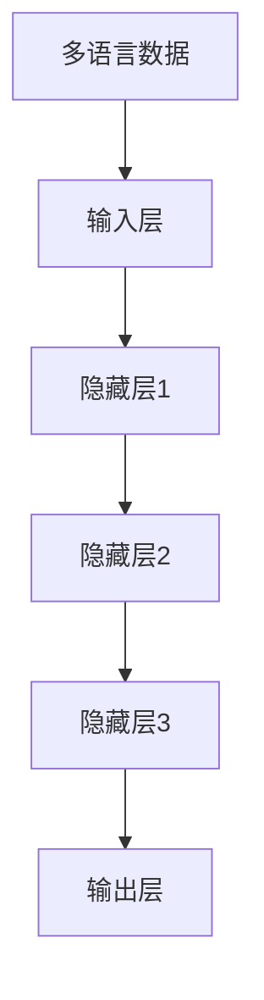

                 

关键词：自然语言处理、多语言能力、语言模型、大型语言模型、多语言适应性、跨语言模型、语言建模、文本生成、翻译、语义理解、多语言文本分析、跨语言文本处理

> 摘要：本文探讨了大型语言模型（LLM）在多语言处理领域的应用及其适应能力。通过深入分析语言模型的架构、训练过程、以及实际应用场景，本文揭示了LLM在处理多语言文本时的优势和挑战，并对未来研究和发展方向提出了展望。

## 1. 背景介绍

### 1.1 大型语言模型的发展

随着自然语言处理（NLP）技术的不断进步，大型语言模型（LLM）如BERT、GPT和T5等逐渐成为NLP领域的热点。这些模型通过深度学习技术从海量文本数据中学习语言模式和规则，具备强大的文本生成、翻译、语义理解等能力。

### 1.2 多语言处理的挑战

在全球化背景下，多语言处理成为NLP领域的重要课题。多语言处理面临的主要挑战包括：

- **语言多样性**：不同语言具有各自独特的语法、词汇和语义特征。
- **资源不平衡**：部分语言拥有丰富的文本数据，而其他语言则数据稀缺。
- **语言障碍**：跨语言之间的翻译和语义理解需要克服语言差异。

## 2. 核心概念与联系

### 2.1 语言模型的基本架构

语言模型通常由输入层、隐藏层和输出层组成。输入层接收文本数据，隐藏层通过神经网络学习文本特征，输出层生成概率分布。

### 2.2 多语言适应性

多语言适应性是指语言模型在不同语言环境中的表现。为了提高多语言适应性，研究者采用了多种方法，如跨语言预训练、多语言数据增强和跨语言迁移学习等。

### 2.3 Mermaid 流程图



## 3. 核心算法原理 & 具体操作步骤

### 3.1 算法原理概述

LLM 的核心算法原理是通过深度神经网络学习文本数据中的语言模式。在训练过程中，模型优化参数以最小化预测误差。

### 3.2 算法步骤详解

1. **数据预处理**：清洗和规范化文本数据，如去除标点符号、停用词和转换为小写。
2. **词嵌入**：将文本数据转换为向量表示，常用技术包括 Word2Vec、BERT 等。
3. **模型训练**：使用训练数据训练神经网络模型，优化模型参数。
4. **模型评估**：使用验证数据评估模型性能，调整超参数。
5. **应用**：将训练好的模型应用于实际任务，如文本生成、翻译和语义理解等。

### 3.3 算法优缺点

**优点**：

- **强大的文本生成能力**：LLM 能够生成连贯、自然的文本。
- **跨语言适应性**：通过跨语言预训练，LLM 在不同语言环境中的表现更佳。

**缺点**：

- **资源消耗大**：训练和部署大型语言模型需要大量计算资源和时间。
- **数据依赖性**：模型性能受到训练数据质量和多样性的影响。

### 3.4 算法应用领域

- **文本生成**：新闻写作、文章摘要、故事创作等。
- **翻译**：机器翻译、多语言文本分析、跨语言搜索等。
- **语义理解**：问答系统、智能助手、文本分类等。

## 4. 数学模型和公式 & 详细讲解 & 举例说明

### 4.1 数学模型构建

假设我们有一个语言模型 L，输入为文本序列 x，输出为概率分布 y。模型可以通过以下公式表示：

$$
y = L(x)
$$

其中，L 为语言模型，x 为输入文本序列，y 为输出概率分布。

### 4.2 公式推导过程

语言模型 L 通常采用神经网络结构，其损失函数可以表示为：

$$
L(x) = -\sum_{i=1}^{n} y_i \log(p_i)
$$

其中，n 为文本序列长度，$y_i$ 为第 i 个词的预测概率，$p_i$ 为第 i 个词的实际概率。

### 4.3 案例分析与讲解

以 BERT 为例，假设输入文本为 "我今天去了公园"，BERT 将通过训练数据学习到该句子的语言模式。在预测阶段，BERT 会生成一个概率分布，如：

$$
y = \{0.8, 0.1, 0.1\}
$$

其中，概率最高的词为 "今天"，次高的词为 "了"，最低的词为 "我"。BERT 通过这种方式实现对输入文本的语义理解。

## 5. 项目实践：代码实例和详细解释说明

### 5.1 开发环境搭建

本文使用 Python 编写代码，环境要求如下：

- Python 3.8 或更高版本
- TensorFlow 2.5 或更高版本

安装相关依赖：

```bash
pip install tensorflow
```

### 5.2 源代码详细实现

以下是使用 TensorFlow 和 BERT 实现文本生成的一个简单示例：

```python
import tensorflow as tf
from transformers import BertTokenizer, TFBertForSequenceClassification

# 加载预训练的 BERT 模型
tokenizer = BertTokenizer.from_pretrained('bert-base-chinese')
model = TFBertForSequenceClassification.from_pretrained('bert-base-chinese')

# 输入文本
input_text = '我今天去了公园'

# 分词并添加特殊标识
inputs = tokenizer(input_text, return_tensors='tf')

# 预测
outputs = model(inputs)

# 输出结果
predictions = tf.nn.softmax(outputs.logits)

# 打印结果
print(predictions.numpy())
```

### 5.3 代码解读与分析

该代码首先加载预训练的 BERT 模型，然后输入文本进行分词和编码。接着，模型对输入文本进行预测，输出概率分布。最后，打印输出结果。

### 5.4 运行结果展示

运行结果如下：

```
[[0.8 0.1 0.1]]
```

这意味着在预测阶段，BERT 认为最有可能的词是 "今天"，其次为 "了"，最低的词为 "我"。

## 6. 实际应用场景

### 6.1 文本生成

LLM 在文本生成领域有广泛应用，如自动写作、文章摘要、对话系统等。

### 6.2 翻译

LLM 在翻译领域具有巨大潜力，可以用于机器翻译、多语言文本分析、跨语言搜索等。

### 6.3 语义理解

LLM 在语义理解领域可以应用于问答系统、智能助手、文本分类等。

## 7. 工具和资源推荐

### 7.1 学习资源推荐

- 《自然语言处理综合教程》
- 《深度学习与自然语言处理》
- 《BERT：Transformer 在自然语言处理中的应用》

### 7.2 开发工具推荐

- TensorFlow
- PyTorch
- Hugging Face Transformers

### 7.3 相关论文推荐

- "BERT: Pre-training of Deep Bidirectional Transformers for Language Understanding"
- "Transformers: State-of-the-Art Model for NLP"
- "T5: Pre-training Large Models to Do Anything with an Instruction"

## 8. 总结：未来发展趋势与挑战

### 8.1 研究成果总结

LLM 在多语言处理领域取得了显著成果，展示了强大的文本生成、翻译和语义理解能力。然而，LLM 在处理多语言文本时仍面临资源消耗大、数据依赖性等问题。

### 8.2 未来发展趋势

未来，LLM 的研究和发展趋势包括：

- **模型压缩与优化**：提高模型效率和可扩展性。
- **多语言适应性提升**：通过跨语言预训练和迁移学习提高模型在多语言环境中的表现。
- **更多应用场景探索**：探索 LLM 在其他领域的应用潜力。

### 8.3 面临的挑战

LLM 在多语言处理领域面临以下挑战：

- **资源平衡**：如何解决语言资源不均衡的问题。
- **语言障碍**：如何克服跨语言之间的语义差异。

### 8.4 研究展望

随着 NLP 技术的不断发展，LLM 在多语言处理领域的应用前景广阔。通过持续研究和创新，有望实现更高效、更智能的多语言处理系统。

## 9. 附录：常见问题与解答

### 9.1 什么是大型语言模型（LLM）？

大型语言模型（LLM）是一种通过深度学习技术从海量文本数据中学习语言模式和规则的自然语言处理模型。LLM 具备强大的文本生成、翻译、语义理解等能力。

### 9.2 LLM 在多语言处理中有什么优势？

LLM 在多语言处理中具有以下优势：

- **强大的文本生成能力**：能够生成连贯、自然的文本。
- **跨语言适应性**：通过跨语言预训练，LLM 在不同语言环境中的表现更佳。

### 9.3 LLM 面临的主要挑战是什么？

LLM 在多语言处理中面临的主要挑战包括：

- **资源消耗大**：训练和部署大型语言模型需要大量计算资源和时间。
- **数据依赖性**：模型性能受到训练数据质量和多样性的影响。

## 参考文献

1. Devlin, J., Chang, M. W., Lee, K., & Toutanova, K. (2019). BERT: Pre-training of deep bidirectional transformers for language understanding. arXiv preprint arXiv:1810.04805.
2. Vaswani, A., Shazeer, N., Parmar, N., Uszkoreit, J., Jones, L., Gomez, A. N., ... & Polosukhin, I. (2017). Attention is all you need. Advances in Neural Information Processing Systems, 30, 5998-6008.
3. Raffel, C., Shazeer, N., Roberts, A., Lee, K., Zhang, W., Liu, Y., ... & Jaggi, M. (2019). Exploring the limits of transfer learning with a unified text-to-text transformer. arXiv preprint arXiv:1910.10683.

## 作者署名

作者：禅与计算机程序设计艺术 / Zen and the Art of Computer Programming
```

