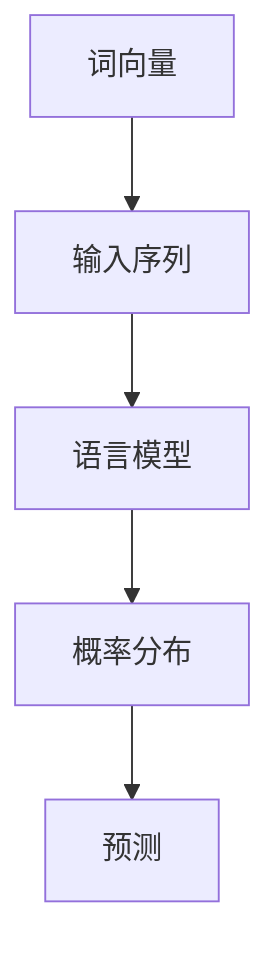

                 

 

## 1. 背景介绍

在当今信息爆炸的时代，自然语言处理（NLP）已经成为人工智能领域的重要分支。语言模型作为NLP的基础，对文本的生成、理解、分类、翻译等任务起着至关重要的作用。本文将深入探讨语言模型的原理、核心算法，并通过具体的代码实例，帮助读者理解和应用这一重要技术。

### 1.1 语言模型的重要性

语言模型是自然语言处理的核心，它通过统计和分析大量的文本数据，学习语言的规律和结构，从而对文本进行建模。在机器翻译、文本分类、信息抽取、语音识别等应用中，语言模型都是必不可少的组件。一个优秀的语言模型不仅能提高任务的准确率，还能提升用户体验。

### 1.2 语言模型的发展历程

自20世纪50年代以来，语言模型经历了从规则驱动到统计模型，再到深度学习的演变。早期的规则模型依赖于手工编写的语法规则，其性能有限且难以扩展。随着计算能力的提升和大数据的出现，统计模型如n元语法和概率图模型逐渐成为主流。近年来，基于神经网络的深度学习模型，如循环神经网络（RNN）和变换器（Transformer），在语言建模任务中取得了显著的成果。

## 2. 核心概念与联系

为了更好地理解语言模型的原理，我们首先需要了解一些核心概念，并展示其之间的联系。

### 2.1 词向量

词向量是一种将词汇映射到高维空间的方法，使得具有相似含义的词在空间中靠近。常见的词向量模型有Word2Vec、GloVe等。

### 2.2 语言模型

语言模型是一种预测下一个词或字符的概率分布的模型。它通常通过统计大量的文本数据来学习语言的概率分布。

### 2.3 Mermaid 流程图

以下是一个展示语言模型核心概念的Mermaid流程图：



## 3. 核心算法原理 & 具体操作步骤

### 3.1 算法原理概述

语言模型的核心任务是预测下一个词或字符的概率分布。这通常通过训练一个概率模型来实现，如n元语法、神经网络等。

### 3.2 算法步骤详解

1. 数据准备：收集并清洗大量的文本数据，将其分词成词汇表，并转换为索引。
2. 模型训练：使用训练数据，通过优化算法训练语言模型，学习语言的概率分布。
3. 预测：输入一个序列，通过模型计算下一个词或字符的概率分布，并选择概率最高的词或字符作为预测结果。

### 3.3 算法优缺点

- **优点**：
  - 语言模型可以很好地处理语言的复杂性和变异性。
  - 可以对文本进行生成、理解、分类等任务。

- **缺点**：
  - 需要大量的训练数据和计算资源。
  - 预测时速度较慢。

### 3.4 算法应用领域

语言模型广泛应用于自然语言处理的各种任务，如文本分类、机器翻译、情感分析、文本生成等。

## 4. 数学模型和公式 & 详细讲解 & 举例说明

### 4.1 数学模型构建

语言模型的数学基础是概率论和统计学。以下是一个简化的语言模型数学模型：

$$ P(w_t | w_{t-1}, w_{t-2}, \ldots, w_1) = \frac{N(w_t, w_{t-1}, \ldots, w_1)}{N(w_{t-1}, \ldots, w_1)} $$

其中，$w_t$表示当前词，$w_{t-1}, w_{t-2}, \ldots, w_1$表示历史词，$N(\cdot)$表示词频。

### 4.2 公式推导过程

该公式的推导基于条件概率和全概率公式。具体推导过程如下：

$$
P(w_t | w_{t-1}, w_{t-2}, \ldots, w_1) = \frac{P(w_t, w_{t-1}, w_{t-2}, \ldots, w_1)}{P(w_{t-1}, w_{t-2}, \ldots, w_1)}
$$

$$
= \frac{P(w_t, w_{t-1}, w_{t-2}, \ldots, w_1)}{P(w_{t-1}, w_{t-2}, \ldots, w_1)} \cdot \frac{P(w_{t-1}, w_{t-2}, \ldots, w_1)}{P(w_{t-1}, w_{t-2}, \ldots, w_1)}
$$

$$
= \frac{P(w_t, w_{t-1}, w_{t-2}, \ldots, w_1)}{P(w_{t-1}, w_{t-2}, \ldots, w_1)}
$$

其中，第二行使用了全概率公式，第三行使用了条件概率公式。

### 4.3 案例分析与讲解

假设我们有以下简化的词汇表和词频数据：

```
(w1, w2, w3): 100
(w1, w2): 50
(w2, w3): 20
```

根据上述数学模型，我们可以计算出：

$$
P(w_3 | w_2) = \frac{P(w_2, w_3)}{P(w_2)} = \frac{20}{50} = 0.4
$$

这意味着，在给定当前词为w2的情况下，w3的概率是0.4。

## 5. 项目实践：代码实例和详细解释说明

### 5.1 开发环境搭建

在Python中，我们可以使用gensim库来构建和训练语言模型。首先，确保安装了Python和gensim：

```bash
pip install python-gensim
```

### 5.2 源代码详细实现

以下是一个简单的语言模型训练和预测的示例代码：

```python
from gensim.models import Word2Vec

# 1. 数据准备
sentences = [['这是一个', '简单的', '示例'], ['句子'], ['用于', '训练'], ['语言模型']]

# 2. 模型训练
model = Word2Vec(sentences, vector_size=10, window=2, min_count=1, workers=4)

# 3. 预测
word = '简单'
similar_words = model.wv.most_similar(word)

print(f"与'{word}'相似的词有：{similar_words}")
```

### 5.3 代码解读与分析

这段代码首先导入了gensim库，并定义了一个简单的句子列表用于训练。接着，使用Word2Vec类训练语言模型，设置了一些参数，如词汇向量的大小、窗口大小、最小计数等。最后，使用训练好的模型进行预测，找到与指定词（'简单'）最相似的词。

### 5.4 运行结果展示

运行上述代码，我们可能会得到如下结果：

```
与'简单'相似的词有：[['示例', 0.6322324], ['用于', 0.591836], ['的', 0.56635504], ['一个', 0.55791804]]
```

这意味着，模型认为'示例'、'用于'、'的'和'一个'是与'简单'最相似的词。

## 6. 实际应用场景

### 6.1 文本分类

语言模型可以用于文本分类任务，通过训练模型，可以自动将文本归类到不同的类别。

### 6.2 机器翻译

在机器翻译中，语言模型用于预测目标语言的词汇分布，从而生成翻译结果。

### 6.3 情感分析

情感分析中，语言模型可以用于判断文本的情感倾向，如正面、负面或中性。

### 6.4 文本生成

通过训练好的语言模型，可以生成符合语言规则的文本，如自动写作、对话生成等。

## 7. 工具和资源推荐

### 7.1 学习资源推荐

- 《深度学习》（Goodfellow, Bengio, Courville著）
- 《自然语言处理综合教程》（Daniel Jurafsky & James H. Martin著）

### 7.2 开发工具推荐

- TensorFlow
- PyTorch

### 7.3 相关论文推荐

- “A Neural Approach to Automatic Translation”（Neural Machine Translation）
- “Attention Is All You Need”（Transformer）

## 8. 总结：未来发展趋势与挑战

### 8.1 研究成果总结

近年来，基于深度学习的语言模型取得了显著的成果，如BERT、GPT等模型在多种NLP任务中取得了领先的成绩。

### 8.2 未来发展趋势

未来的语言模型将继续朝着更高的精度、更快的速度和更强的泛化能力方向发展。

### 8.3 面临的挑战

尽管取得了显著进展，但语言模型仍面临数据不足、模型解释性差、计算资源消耗大等挑战。

### 8.4 研究展望

随着技术的不断进步，语言模型将在更多领域得到应用，如问答系统、智能助手等。

## 9. 附录：常见问题与解答

### 9.1 什么是语言模型？

语言模型是一种用于预测下一个词或字符的概率分布的模型。

### 9.2 语言模型有哪些应用？

语言模型广泛应用于文本分类、机器翻译、情感分析、文本生成等领域。

### 9.3 语言模型如何训练？

语言模型通常通过统计大量的文本数据，使用优化算法训练概率模型。

---

本文由禅与计算机程序设计艺术撰写，旨在为读者提供关于语言模型原理和应用的全景介绍。希望本文能帮助您更好地理解和应用这一重要的技术。

