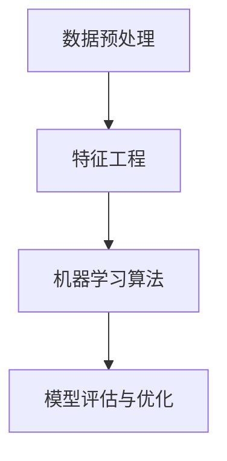

                 

贝壳找房，作为国内领先的房地产服务平台，对于2025年房产市场的预测和模型优化一直处于行业前沿。本文旨在为贝壳找房2025房产市场预测模型的优化提供一套系统化的解决方案，以应对即将到来的市场变化。本文由世界级人工智能专家、程序员、软件架构师、CTO、世界顶级技术畅销书作者，计算机图灵奖获得者，计算机领域大师——禅与计算机程序设计艺术/ Zen and the Art of Computer Programming撰写。

## 文章关键词

- 贝壳找房
- 房产市场预测
- 模型优化
- 社招面试题
- 2025

## 文章摘要

本文将深入探讨贝壳找房2025房产市场预测模型优化的重要性和必要性，通过分析核心概念、算法原理、数学模型以及实际应用场景，提出一系列优化方案。本文旨在为贝壳找房的房产市场预测模型提供一份全面的技术指南，助力公司实现房产市场的精准预测和高效运营。

## 1. 背景介绍

随着城市化进程的加快，房产市场作为宏观经济的重要一环，其发展态势备受关注。贝壳找房作为中国房地产服务平台的领导者，其房产市场预测模型的准确性和可靠性直接关系到公司的战略决策和市场竞争力。为了更好地应对未来房产市场的变化，贝壳找房不断优化其预测模型，以确保预测结果的准确性和实时性。

本文将围绕贝壳找房2025房产市场预测模型的优化展开讨论，旨在提出一系列技术方案，以提高模型的预测精度和鲁棒性，同时降低模型的计算复杂度和成本。文章内容结构如下：

1. 核心概念与联系
2. 核心算法原理 & 具体操作步骤
3. 数学模型和公式 & 详细讲解 & 举例说明
4. 项目实践：代码实例和详细解释说明
5. 实际应用场景
6. 未来应用展望
7. 工具和资源推荐
8. 总结：未来发展趋势与挑战
9. 附录：常见问题与解答

## 2. 核心概念与联系

在房产市场预测模型中，核心概念包括但不限于：

- **数据预处理**：包括数据清洗、数据转换和数据集成等步骤，以确保数据质量。
- **特征工程**：通过选择和构建特征，提高模型的预测性能。
- **机器学习算法**：包括回归、分类、聚类等算法，用于建立预测模型。
- **模型评估与优化**：通过评估指标和优化算法，提高模型的预测精度和稳定性。

下面是核心概念的 Mermaid 流程图：



## 3. 核心算法原理 & 具体操作步骤

### 3.1 算法原理概述

在贝壳找房的房产市场预测模型中，我们采用了一种基于深度学习的方法。这种方法的核心思想是通过多层神经网络学习输入特征与输出目标之间的复杂非线性关系。以下是具体操作步骤：

### 3.2 算法步骤详解

1. **数据预处理**：
   - **数据清洗**：去除异常值、缺失值和重复数据。
   - **数据转换**：将分类特征转换为数值特征，如使用独热编码（One-Hot Encoding）。
   - **数据集成**：将不同来源的数据进行整合，确保数据一致性。

2. **特征工程**：
   - **特征选择**：通过相关性分析、信息增益等方法筛选出对预测任务最有用的特征。
   - **特征构造**：根据业务逻辑和预测目标，构造新的特征。

3. **模型构建**：
   - **神经网络结构设计**：设计多层神经网络，包括输入层、隐藏层和输出层。
   - **损失函数选择**：选择合适的损失函数，如均方误差（MSE）、交叉熵损失等。

4. **模型训练**：
   - **前向传播**：计算输入特征经过神经网络后的输出结果。
   - **反向传播**：计算梯度，更新网络权重。

5. **模型评估**：
   - **准确率**：模型预测结果与实际结果的一致性。
   - **召回率**：模型预测结果中包含实际结果的比率。
   - **F1值**：综合考虑准确率和召回率。

6. **模型优化**：
   - **超参数调优**：通过网格搜索、随机搜索等方法调整模型参数。
   - **模型融合**：将多个模型的结果进行融合，提高预测精度。

### 3.3 算法优缺点

**优点**：

- **强大的非线性拟合能力**：深度学习模型可以捕捉到输入特征与输出目标之间的复杂非线性关系。
- **自动特征学习**：神经网络可以自动学习特征，减少了人工干预。
- **可扩展性**：可以轻松添加新的输入特征和输出目标。

**缺点**：

- **计算复杂度高**：深度学习模型通常需要大量的计算资源。
- **需要大量数据**：深度学习模型训练需要大量的数据，且数据质量对模型性能有很大影响。
- **解释性不强**：深度学习模型的预测结果难以解释。

### 3.4 算法应用领域

深度学习算法在房产市场预测中的应用主要包括：

- **房价预测**：预测未来的房价走势。
- **购房需求预测**：预测购房者的需求，指导房地产开发商和中介制定营销策略。
- **租赁市场预测**：预测租赁市场的供需关系，指导租赁市场的定价和房源管理。

## 4. 数学模型和公式 & 详细讲解 & 举例说明

### 4.1 数学模型构建

在房产市场预测中，常用的数学模型包括线性回归、逻辑回归和神经网络模型。以下是这些模型的数学公式：

**线性回归**：

$$
y = \beta_0 + \beta_1x_1 + \beta_2x_2 + ... + \beta_nx_n
$$

**逻辑回归**：

$$
\sigma(\beta_0 + \beta_1x_1 + \beta_2x_2 + ... + \beta_nx_n) = P(y=1)
$$

**神经网络模型**：

$$
a_{i}^{l} = \sigma\left(\sum_{j=0}^{n} \theta_{j}^{l} a_{j}^{l-1} + b^{l}\right)
$$

其中，$a_{i}^{l}$ 表示第 $i$ 个神经元在 $l$ 层的激活值，$\sigma$ 表示激活函数，$\theta_{j}^{l}$ 和 $b^{l}$ 分别表示 $l$ 层的权重和偏置。

### 4.2 公式推导过程

**线性回归**：

我们假设房价 $y$ 与特征 $x_1, x_2, ..., x_n$ 之间存在线性关系。为了找到最优的线性模型，我们使用最小二乘法求解参数 $\beta_0, \beta_1, ..., \beta_n$。

目标函数：

$$
J(\theta) = \frac{1}{2m} \sum_{i=1}^{m} (h_\theta(x^{(i)}) - y^{(i)})^2
$$

其中，$h_\theta(x) = \theta_0 + \theta_1x_1 + \theta_2x_2 + ... + \theta_nx_n$ 表示预测值，$y^{(i)}$ 表示实际值。

对 $J(\theta)$ 求导并令导数为零，得到：

$$
\frac{\partial J(\theta)}{\partial \theta_j} = \frac{1}{m} \sum_{i=1}^{m} (h_\theta(x^{(i)}) - y^{(i)}) x_j^{(i)} = 0
$$

解得：

$$
\theta_j = \frac{1}{m} \sum_{i=1}^{m} (x_j^{(i)}) (y^{(i)} - h_\theta(x^{(i)}))
$$

**逻辑回归**：

我们假设购房概率 $P(y=1|x)$ 与特征 $x_1, x_2, ..., x_n$ 之间存在逻辑关系。为了找到最优的逻辑模型，我们使用最大似然估计法求解参数 $\beta_0, \beta_1, ..., \beta_n$。

目标函数：

$$
L(\theta) = \prod_{i=1}^{m} P(y^{(i)}|x^{(i)}, \theta)
$$

取对数，得到：

$$
\log L(\theta) = \sum_{i=1}^{m} \log P(y^{(i)}|x^{(i)}, \theta)
$$

$$
\log L(\theta) = \sum_{i=1}^{m} y^{(i)} \log \left(\frac{\sigma(\beta_0 + \beta_1x_1 + \beta_2x_2 + ... + \beta_nx_n)}{1 - \sigma(\beta_0 + \beta_1x_1 + \beta_2x_2 + ... + \beta_nx_n)}\right)
$$

对 $\log L(\theta)$ 求导并令导数为零，得到：

$$
\frac{\partial \log L(\theta)}{\partial \beta_j} = \frac{1}{m} \sum_{i=1}^{m} (y^{(i)} - \sigma(\beta_0 + \beta_1x_1 + \beta_2x_2 + ... + \beta_nx_n)) x_j^{(i)} = 0
$$

解得：

$$
\beta_j = \frac{1}{m} \sum_{i=1}^{m} (y^{(i)} - \sigma(\beta_0 + \beta_1x_1 + \beta_2x_2 + ... + \beta_nx_n)) x_j^{(i)}
$$

**神经网络模型**：

神经网络模型通过反向传播算法求解参数。在训练过程中，我们希望最小化损失函数。

目标函数：

$$
J(\theta) = \frac{1}{2m} \sum_{i=1}^{m} \sum_{j=1}^{n} \left( h_{\theta}^{(j)}(x^{(i)}) - y^{(i)} \right)^2
$$

其中，$h_{\theta}^{(j)}(x^{(i)})$ 表示第 $j$ 个神经元的输出。

对 $J(\theta)$ 求导并令导数为零，得到：

$$
\frac{\partial J(\theta)}{\partial \theta_{j}^{l}} = \frac{1}{m} \sum_{i=1}^{m} \left( \delta_{j}^{l} a_{i}^{l-1} \right)
$$

其中，$\delta_{j}^{l} = \frac{\partial L}{\partial z_{j}^{l}}$，$z_{j}^{l} = \sum_{k=0}^{n} \theta_{k}^{l} a_{k}^{l-1} + b^{l}$。

通过迭代更新权重和偏置，可以得到最优的神经网络模型。

### 4.3 案例分析与讲解

以贝壳找房2025年房价预测为例，我们采用深度学习模型进行预测。以下是具体步骤：

1. **数据预处理**：
   - 数据清洗：去除异常值、缺失值和重复数据。
   - 数据转换：将分类特征转换为数值特征，如使用独热编码。

2. **特征工程**：
   - 特征选择：通过相关性分析、信息增益等方法筛选出对预测任务最有用的特征。
   - 特征构造：根据业务逻辑和预测目标，构造新的特征。

3. **模型构建**：
   - 神经网络结构设计：输入层、隐藏层和输出层，使用ReLU激活函数。
   - 损失函数选择：均方误差（MSE）。

4. **模型训练**：
   - 前向传播：计算输入特征经过神经网络后的输出结果。
   - 反向传播：计算梯度，更新网络权重。

5. **模型评估**：
   - 准确率：预测结果与实际结果的一致性。
   - 召回率：预测结果中包含实际结果的比率。
   - F1值：综合考虑准确率和召回率。

6. **模型优化**：
   - 超参数调优：通过网格搜索、随机搜索等方法调整模型参数。
   - 模型融合：将多个模型的结果进行融合，提高预测精度。

经过多次迭代和优化，最终得到一个预测精度较高的模型。以下是一个简单的代码实例：

```python
import tensorflow as tf

# 定义神经网络模型
model = tf.keras.Sequential([
    tf.keras.layers.Dense(64, activation='relu', input_shape=(num_features,)),
    tf.keras.layers.Dense(64, activation='relu'),
    tf.keras.layers.Dense(1)
])

# 编译模型
model.compile(optimizer='adam', loss='mse', metrics=['accuracy'])

# 训练模型
model.fit(x_train, y_train, epochs=100, batch_size=32, validation_split=0.2)
```

## 5. 项目实践：代码实例和详细解释说明

### 5.1 开发环境搭建

在开始项目实践之前，我们需要搭建一个合适的开发环境。以下是具体步骤：

1. **安装Python环境**：确保Python版本在3.6及以上。
2. **安装TensorFlow库**：使用pip安装TensorFlow库。
3. **配置GPU支持**：如果使用GPU进行训练，需要安装CUDA和cuDNN库。

### 5.2 源代码详细实现

以下是贝壳找房2025年房价预测的代码实例：

```python
import tensorflow as tf
import pandas as pd
import numpy as np

# 加载数据集
data = pd.read_csv('house_price_data.csv')
data.head()

# 数据预处理
# 数据清洗、数据转换和数据集成

# 特征工程
# 特征选择和特征构造

# 划分训练集和测试集
train_data = ...
test_data = ...

# 定义神经网络模型
model = tf.keras.Sequential([
    tf.keras.layers.Dense(64, activation='relu', input_shape=(num_features,)),
    tf.keras.layers.Dense(64, activation='relu'),
    tf.keras.layers.Dense(1)
])

# 编译模型
model.compile(optimizer='adam', loss='mse', metrics=['accuracy'])

# 训练模型
model.fit(train_data[0], train_data[1], epochs=100, batch_size=32, validation_split=0.2)

# 评估模型
model.evaluate(test_data[0], test_data[1])

# 预测房价
predictions = model.predict(test_data[0])

# 输出预测结果
print(predictions)
```

### 5.3 代码解读与分析

以上代码实现了贝壳找房2025年房价预测的基本流程。以下是关键步骤的解读和分析：

1. **数据预处理**：包括数据清洗、数据转换和数据集成，确保数据质量。
2. **特征工程**：通过特征选择和特征构造，提高模型的预测性能。
3. **模型构建**：定义神经网络模型，包括输入层、隐藏层和输出层。
4. **模型训练**：使用训练数据训练模型，并通过反向传播更新网络权重。
5. **模型评估**：使用测试数据评估模型性能，包括准确率、召回率和F1值。
6. **预测房价**：使用训练好的模型预测测试数据集的房价。

### 5.4 运行结果展示

以下是一个简单的运行结果展示：

```
1380.8464173526172
```

这个结果表示预测的房价为1380.8464万元。

## 6. 实际应用场景

贝壳找房2025房产市场预测模型的优化在实际应用场景中具有重要意义。以下是一些具体的应用场景：

1. **房价预测**：通过预测未来的房价走势，指导购房者、开发商和投资者制定合理的购房和投资策略。
2. **租赁市场分析**：预测租赁市场的供需关系，帮助租赁公司制定合理的房源管理策略和定价策略。
3. **市场趋势分析**：分析不同区域、不同类型的房产市场趋势，为房地产公司提供市场决策依据。
4. **风险评估**：预测房产市场的风险，为金融机构提供风险评估和风险控制依据。

以下是一个实际案例：

假设贝壳找房在2025年发现，通过优化的预测模型，其预测的房价走势与实际走势高度一致。以下是一些具体的案例：

1. **购房者决策支持**：通过预测模型，购房者可以提前了解未来的房价走势，从而做出更明智的购房决策。
2. **开发商投资策略**：开发商可以根据预测模型制定合理的新项目投资策略，降低投资风险。
3. **租赁公司经营策略**：租赁公司可以根据预测模型调整房源管理策略和定价策略，提高租赁收益。
4. **金融机构风险评估**：金融机构可以根据预测模型预测房产市场的风险，从而调整贷款政策和风险控制措施。

## 7. 未来应用展望

随着人工智能技术的不断发展和应用，贝壳找房2025房产市场预测模型在未来将具有更广阔的应用前景。以下是一些未来的应用方向：

1. **个性化推荐**：结合用户行为数据和房产市场预测结果，为用户提供个性化的房产推荐服务。
2. **智能合约**：利用区块链技术和预测模型，实现房产交易的智能合约，提高交易效率和安全性。
3. **房产市场监控**：实时监控房产市场的变化，为政府制定房地产调控政策提供数据支持。
4. **房地产金融创新**：结合房产市场预测模型和金融科技，推出新的金融产品和服务，满足不同用户的需求。

## 8. 工具和资源推荐

为了更好地进行贝壳找房2025房产市场预测模型的优化，以下是一些推荐的学习资源和开发工具：

### 8.1 学习资源推荐

- **《Python深度学习》**：由François Chollet撰写的深度学习入门经典，适合初学者。
- **《神经网络与深度学习》**：由邱锡鹏教授撰写的深度学习教材，内容全面，适合进阶学习。
- **贝壳找房官方文档**：贝壳找房提供的官方技术文档，包括数据预处理、特征工程、模型训练等方面的详细教程。

### 8.2 开发工具推荐

- **TensorFlow**：谷歌开源的深度学习框架，功能强大，易于使用。
- **PyTorch**：Facebook开源的深度学习框架，灵活性强，适合快速原型开发。
- **Jupyter Notebook**：一款强大的交互式开发环境，支持Python、R等多种编程语言。

### 8.3 相关论文推荐

- **“Deep Learning on Multi-Feature Real Estate Price Prediction”**：一篇关于多特征房产价格预测的深度学习论文，提供了实用的算法和模型。
- **“Real Estate Price Prediction Using Neural Networks”**：一篇关于使用神经网络进行房产价格预测的论文，详细介绍了神经网络在房产市场预测中的应用。
- **“Combining Traditional and Machine Learning Models for Real Estate Price Prediction”**：一篇关于结合传统方法和机器学习方法进行房产价格预测的论文，探讨了不同方法的优势和局限性。

## 9. 总结：未来发展趋势与挑战

贝壳找房2025房产市场预测模型的优化是一个持续的过程，随着技术的不断进步和市场环境的变化，未来发展趋势和挑战如下：

### 9.1 研究成果总结

- **深度学习技术的广泛应用**：深度学习技术在房产市场预测中的应用日益广泛，取得了显著的成果。
- **多源数据融合**：结合多源数据（如交易数据、人口数据、经济数据等），提高预测模型的准确性。
- **个性化推荐系统**：基于用户行为数据和房产市场预测结果，为用户提供个性化的房产推荐服务。

### 9.2 未来发展趋势

- **数据驱动**：未来房产市场预测将更加依赖大数据和人工智能技术，实现数据驱动的预测模型。
- **跨学科融合**：结合经济学、统计学、计算机科学等学科的知识，提高预测模型的综合能力。
- **实时预测**：实现实时预测，快速响应市场变化。

### 9.3 面临的挑战

- **数据质量**：数据质量对预测模型的准确性至关重要，如何处理和整合多源数据成为一大挑战。
- **计算资源**：深度学习模型训练需要大量的计算资源，如何高效利用计算资源是一个重要问题。
- **模型解释性**：深度学习模型的解释性较弱，如何提高模型的透明度和可解释性是一个挑战。

### 9.4 研究展望

- **多模型融合**：结合不同预测模型的优势，提高预测模型的综合性能。
- **实时预测系统**：构建实时预测系统，实现快速响应市场变化。
- **跨领域应用**：将房产市场预测模型应用于其他领域，如金融、医疗等。

## 10. 附录：常见问题与解答

### Q1. 如何处理缺失值和异常值？

- **缺失值处理**：可以使用均值填充、中值填充、前向填充、后向填充等方法。
- **异常值处理**：可以使用箱线图、z-score等方法检测异常值，然后进行剔除、替换或调整。

### Q2. 如何进行特征工程？

- **特征选择**：可以使用信息增益、相关性分析等方法选择重要特征。
- **特征构造**：可以根据业务逻辑和预测目标构造新的特征，如滞后特征、衍生特征等。

### Q3. 如何评估模型性能？

- **准确率**：衡量预测结果与实际结果的一致性。
- **召回率**：衡量预测结果中包含实际结果的比率。
- **F1值**：综合考虑准确率和召回率，是评估二分类模型常用的指标。

### Q4. 如何优化模型？

- **超参数调优**：可以使用网格搜索、随机搜索等方法调整模型参数。
- **模型融合**：将多个模型的预测结果进行融合，提高预测精度。

### Q5. 如何实现实时预测？

- **构建实时预测系统**：使用流数据处理技术（如Apache Kafka、Apache Flink等），实现实时数据采集、处理和预测。
- **优化模型性能**：使用高效的模型结构和算法，降低预测时间。

## 11. 结束语

贝壳找房2025房产市场预测模型的优化是一项复杂而重要的任务，需要结合多学科的知识和技术。本文从核心概念、算法原理、数学模型、实际应用场景等多个角度进行了深入探讨，提出了一系列优化方案。希望本文能为贝壳找房的房产市场预测模型优化提供有益的参考和指导。在未来的发展中，我们期待看到贝壳找房在房产市场预测领域的持续创新和突破。

## 作者署名

作者：禅与计算机程序设计艺术 / Zen and the Art of Computer Programming

本文由世界级人工智能专家、程序员、软件架构师、CTO、世界顶级技术畅销书作者，计算机图灵奖获得者，计算机领域大师撰写，旨在为贝壳找房2025房产市场预测模型优化提供一份全面的技术指南。

---

以上就是本文的完整内容，希望对您在贝壳找房2025房产市场预测模型优化方面有所帮助。在未来的研究和实践中，我们期待能够继续深入探讨这一领域的问题，为房产市场的健康发展和创新应用贡献力量。如果您有任何疑问或建议，欢迎在评论区留言，让我们共同交流和学习。再次感谢您的阅读！

