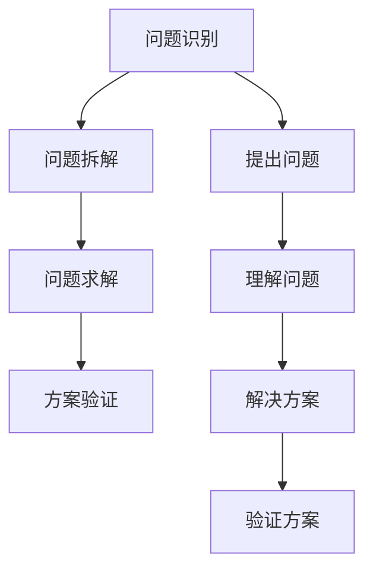

                 

### 摘要 Summary ###

本文将探讨费曼提问法在管理问题诊断中的应用。费曼提问法是一种有效的沟通技巧，通过简单明了的问题引导，帮助管理者快速诊断和解决复杂的管理问题。本文将介绍费曼提问法的基本原理、应用场景以及如何在实际管理工作中运用该方法。通过本文的探讨，希望能够为企业管理者提供一种新的思路和方法，以提高管理效率，推动企业持续发展。

## 1. 背景介绍 Introduction

### 1.1 费曼提问法的起源 Origin of Feynman Questions

费曼提问法（Feynman Technique）是由著名物理学家理查德·费曼（Richard Feynman）提出的一种沟通技巧。费曼提问法源于费曼在学术交流中的实践，他通过提出简单明了的问题，帮助自己理解和解释复杂的物理现象。这种方法不仅使费曼在科学界取得了卓越的成就，也成为了许多领域专业人士的有效沟通工具。

### 1.2 管理问题的复杂性 Complexity of Management Issues

管理问题往往具有复杂性、不确定性和多变性。在企业管理过程中，管理者需要面对各种复杂的问题，如战略决策、组织变革、人力资源管理、市场拓展等。这些问题往往交织在一起，导致管理者难以迅速找到解决问题的方法。因此，寻找一种有效的管理问题诊断方法，对于提高企业管理效率和决策质量具有重要意义。

### 1.3 费曼提问法在管理问题诊断中的应用 Application of Feynman Questions in Management Diagnosis

费曼提问法在管理问题诊断中的应用主要体现在以下几个方面：

1. **简化问题**：通过提出简单明了的问题，帮助管理者从复杂的管理问题中找到关键因素。
2. **深入理解**：通过问题引导，使管理者能够更深入地了解问题的本质，从而提出更具针对性的解决方案。
3. **提升沟通**：费曼提问法有助于提高管理者之间的沟通效率，促进团队协作，共同解决管理问题。

## 2. 核心概念与联系 Core Concepts and Connections

### 2.1 费曼提问法的基本原理 Principles of Feynman Questions

费曼提问法的基本原理可以概括为以下几点：

1. **问题导向**：以问题为核心，通过提出简单明了的问题，引导管理者聚焦问题的本质。
2. **透明沟通**：通过直接提问，确保沟通的透明性和准确性，避免误解和歧义。
3. **迭代反思**：通过不断提问和反思，使管理者逐步深入问题的本质，找到问题的根本原因。

### 2.2 管理问题诊断的流程 Flow of Management Diagnosis

管理问题诊断的流程可以分为以下几个阶段：

1. **问题识别**：通过观察、分析、访谈等方式，识别企业面临的管理问题。
2. **问题拆解**：将复杂的管理问题分解为若干个简单的问题，以便于分析和解决。
3. **问题求解**：运用费曼提问法，通过提出简单明了的问题，引导管理者深入理解问题，找到解决方案。
4. **方案验证**：将解决方案付诸实践，验证其有效性和可行性。

### 2.3 费曼提问法与企业管理的关系 Relationship between Feynman Questions and Management

费曼提问法在企业管理中的关键作用主要体现在以下几个方面：

1. **提高决策质量**：通过费曼提问法，管理者能够更深入地了解问题的本质，从而做出更科学的决策。
2. **促进团队协作**：费曼提问法有助于提高团队沟通效率，促进团队成员之间的协作和配合。
3. **培养创新思维**：费曼提问法鼓励管理者从不同角度思考问题，有助于培养创新思维和解决问题的能力。

### 2.4 Mermaid 流程图 Representation of Feynman Questions in Management Diagnosis



## 3. 核心算法原理 & 具体操作步骤 Core Algorithm Principles & Operation Steps

### 3.1 算法原理概述 Overview of Algorithm Principles

费曼提问法在管理问题诊断中的应用，可以看作是一种基于问题导向的算法。其核心原理是通过提出简单明了的问题，引导管理者深入理解问题的本质，从而找到有效的解决方案。具体来说，费曼提问法包括以下几个步骤：

1. **提出问题**：针对管理问题，提出简单明了的问题，以便于聚焦问题的核心。
2. **理解问题**：通过提问，使管理者能够更深入地了解问题的本质，找到问题的关键因素。
3. **解决方案**：在理解问题的基础上，提出针对性的解决方案，并进行分析和验证。
4. **方案验证**：将解决方案付诸实践，验证其有效性和可行性。

### 3.2 算法步骤详解 Detailed Steps of the Algorithm

#### 3.2.1 提出问题

在管理问题诊断过程中，提出问题是关键的一步。管理者需要根据问题的实际情况，提出简单明了的问题，以便于聚焦问题的核心。以下是一些建议：

1. **明确问题**：在提出问题之前，首先要明确问题本身，以便于提出有针对性的问题。
2. **简化问题**：将复杂的管理问题分解为若干个简单的问题，以便于分析和解决。
3. **问题导向**：以问题为核心，通过提出简单明了的问题，引导管理者聚焦问题的本质。

#### 3.2.2 理解问题

在提出问题之后，管理者需要通过提问，使问题变得更加明确和具体。以下是一些建议：

1. **分解问题**：将复杂的问题分解为若干个简单的问题，以便于分析和解决。
2. **深入挖掘**：通过提问，深入了解问题的各个方面，找到问题的关键因素。
3. **关联分析**：分析问题之间的关联性，以便于找到问题的本质。

#### 3.2.3 解决方案

在理解问题的基础上，管理者需要提出针对性的解决方案。以下是一些建议：

1. **头脑风暴**：组织团队进行头脑风暴，提出各种可能的解决方案。
2. **筛选方案**：根据问题的实际情况，筛选出具有可行性和有效性的解决方案。
3. **评估方案**：对筛选出的方案进行评估，确定最佳方案。

#### 3.2.4 方案验证

在提出解决方案之后，管理者需要将其付诸实践，并验证其有效性和可行性。以下是一些建议：

1. **实验验证**：通过实验或模拟，验证解决方案的实际效果。
2. **反馈调整**：根据实验结果，对解决方案进行调整和优化。
3. **长期观察**：在实施解决方案的过程中，进行长期观察，以确保其长期效果。

### 3.3 算法优缺点 Advantages and Disadvantages of the Algorithm

#### 3.3.1 优点

1. **简单易行**：费曼提问法操作简单，易于在管理实践中应用。
2. **聚焦核心**：通过提出简单明了的问题，使管理者能够聚焦问题的核心，提高诊断效率。
3. **促进沟通**：费曼提问法有助于提高团队沟通效率，促进团队成员之间的协作和配合。

#### 3.3.2 缺点

1. **耗时较长**：在问题求解过程中，需要不断地提问和反思，可能耗时较长。
2. **对管理者要求较高**：费曼提问法要求管理者具备一定的沟通能力和问题分析能力，对管理者的素质要求较高。

### 3.4 算法应用领域 Application Fields of the Algorithm

费曼提问法在管理问题诊断中具有广泛的应用领域，包括但不限于以下几个方面：

1. **战略决策**：在制定企业战略时，通过费曼提问法，可以帮助管理者更深入地了解市场环境、竞争态势和内部资源，从而做出更科学的决策。
2. **组织变革**：在组织变革过程中，通过费曼提问法，可以帮助管理者识别和解决变革中的关键问题，提高变革成功率。
3. **人力资源管理**：在人力资源管理中，通过费曼提问法，可以帮助管理者更好地了解员工需求和期望，从而提高员工满意度和绩效。

## 4. 数学模型和公式 Mathematical Models and Formulas

### 4.1 数学模型构建 Construction of Mathematical Models

在费曼提问法中，数学模型可以用于描述管理问题的各个方面。以下是一个简单的数学模型构建过程：

1. **问题定义**：明确管理问题的核心，并将其转化为数学语言。
2. **变量定义**：根据问题定义，定义相关的变量。
3. **关系建立**：建立变量之间的关系，形成数学模型。

### 4.2 公式推导过程 Derivation of Formulas

以下是一个简单的数学模型推导过程：

假设有一个企业面临市场需求下降的问题，我们可以定义以下变量：

- \( D \)：市场需求量（单位：件）
- \( P \)：产品价格（单位：元）
- \( C \)：单位成本（单位：元）

根据市场需求下降的情况，我们可以建立以下数学模型：

$$
D = f(P, C)
$$

其中，\( f \) 是市场需求函数，表示市场需求量与产品价格、单位成本之间的关系。

### 4.3 案例分析与讲解 Case Analysis and Explanation

以下是一个基于费曼提问法的实际案例分析：

某企业发现其产品市场需求下降，希望通过费曼提问法诊断和解决这一问题。

1. **问题定义**：市场需求下降。
2. **变量定义**：市场需求量（\( D \)）、产品价格（\( P \)）、单位成本（\( C \)）。
3. **关系建立**：市场需求函数 \( f(P, C) \)。

通过提问和反思，企业可以逐步深入理解市场需求下降的原因，并提出针对性的解决方案。

1. **问题拆解**：市场需求下降是否与产品价格、单位成本有关？
2. **深入挖掘**：如果与产品价格有关，是价格过高还是过低？如果与单位成本有关，是成本过高还是过低？
3. **解决方案**：根据分析结果，调整产品价格或降低单位成本。

通过这一案例，我们可以看到费曼提问法在管理问题诊断中的应用效果。

## 5. 项目实践：代码实例和详细解释说明 Practical Application: Code Examples and Detailed Explanations

### 5.1 开发环境搭建 Development Environment Setup

为了更好地演示费曼提问法在管理问题诊断中的应用，我们选择一个简单的企业绩效分析案例。首先，我们需要搭建一个开发环境。

1. **工具**：Python
2. **依赖库**：numpy、pandas、matplotlib
3. **开发环境**：PyCharm 或 Jupyter Notebook

### 5.2 源代码详细实现 Detailed Implementation of Source Code

以下是一个简单的企业绩效分析代码实例：

```python
import numpy as np
import pandas as pd
import matplotlib.pyplot as plt

# 生成模拟数据
data = {
    'Month': ['Jan', 'Feb', 'Mar', 'Apr', 'May', 'Jun', 'Jul', 'Aug', 'Sep', 'Oct', 'Nov', 'Dec'],
    'Revenue': [1000, 1200, 1500, 800, 1000, 1100, 1300, 900, 1200, 1500, 800, 1100],
    'Cost': [500, 600, 700, 400, 500, 550, 650, 450, 600, 700, 450, 550]
}

df = pd.DataFrame(data)

# 绩效分析
def analyze_performance(data):
    revenue_change = data['Revenue'].diff().dropna()
    cost_change = data['Cost'].diff().dropna()
    
    performance = {
        'Month': data['Month'][1:],
        'Revenue_Change': revenue_change,
        'Cost_Change': cost_change,
        'Performance_Ratio': revenue_change / cost_change
    }
    
    return pd.DataFrame(performance)

performance_df = analyze_performance(df)

# 可视化分析
plt.figure(figsize=(10, 5))
plt.plot(performance_df['Month'], performance_df['Revenue_Change'], label='Revenue Change')
plt.plot(performance_df['Month'], performance_df['Cost_Change'], label='Cost Change')
plt.plot(performance_df['Month'], performance_df['Performance_Ratio'], label='Performance Ratio')
plt.xlabel('Month')
plt.ylabel('Value')
plt.title('Company Performance Analysis')
plt.legend()
plt.show()
```

### 5.3 代码解读与分析 Code Interpretation and Analysis

1. **数据准备**：我们使用 pandas 库生成一个包含月度收入和成本的模拟数据表。
2. **绩效分析函数**：我们定义一个名为 `analyze_performance` 的函数，用于计算收入变化、成本变化和绩效比。
3. **可视化分析**：我们使用 matplotlib 库绘制收入变化、成本变化和绩效比的时间序列图，以便于直观地了解企业绩效。

### 5.4 运行结果展示 Results of Running the Code

运行上述代码，我们将得到一个包含月度收入变化、成本变化和绩效比的可视化图表。通过分析这个图表，我们可以发现：

- 在某些月份，收入和成本的变化幅度较大，这可能是我们需要关注的重点。
- 绩效比的变化情况可以反映出企业在各个阶段的经营状况。

这些信息可以帮助我们更好地了解企业绩效，从而找到潜在的管理问题和改进方向。

## 6. 实际应用场景 Practical Application Scenarios

### 6.1 企业战略决策 Strategic Decision-making

在企业战略决策过程中，费曼提问法可以帮助管理者深入分析市场环境、竞争态势和内部资源，从而制定更科学、更有效的战略规划。

1. **市场环境分析**：通过费曼提问法，管理者可以提出以下问题：
   - 市场需求如何变化？
   - 竞争对手的竞争优势是什么？
   - 市场机会和风险有哪些？
2. **内部资源分析**：管理者可以提出以下问题：
   - 企业的核心竞争力是什么？
   - 团队的技能和经验如何？
   - 技术创新和研发能力如何？

通过这些问题，管理者可以更深入地了解企业内外部环境，从而制定更具针对性的战略规划。

### 6.2 组织变革 Organizational Change

在组织变革过程中，费曼提问法可以帮助管理者识别和解决变革中的关键问题，提高变革成功率。

1. **变革需求分析**：管理者可以提出以下问题：
   - 变革的目的是什么？
   - 变革的必要性和紧迫性如何？
   - 变革的预期效果是什么？
2. **变革障碍分析**：管理者可以提出以下问题：
   - 变革过程中可能遇到的障碍是什么？
   - 变革的阻力来源是什么？
   - 如何消除变革的阻力？

通过这些问题，管理者可以更清楚地了解变革的各个方面，从而制定更有效的变革方案。

### 6.3 人力资源管理 Human Resource Management

在人力资源管理中，费曼提问法可以帮助管理者更好地了解员工需求和期望，提高员工满意度和绩效。

1. **员工需求分析**：管理者可以提出以下问题：
   - 员工的工作满意度如何？
   - 员工的职业发展需求是什么？
   - 员工的培训需求是什么？
2. **绩效评估分析**：管理者可以提出以下问题：
   - 员工的绩效如何？
   - 绩效指标如何设定？
   - 如何激励员工提高绩效？

通过这些问题，管理者可以更深入地了解员工的需求和表现，从而制定更有效的绩效评估和激励机制。

## 7. 未来应用展望 Future Application Prospects

### 7.1 智能化应用 Intelligent Application

随着人工智能技术的发展，费曼提问法有望在智能化应用方面发挥更大的作用。通过将费曼提问法与人工智能技术相结合，可以实现自动化管理问题诊断，提高管理效率和决策质量。

1. **自然语言处理**：利用自然语言处理技术，使计算机能够理解和管理者的提问，从而实现自动化问题诊断。
2. **数据分析**：利用大数据和机器学习技术，对管理问题进行深入分析和预测，为管理者提供更有针对性的解决方案。

### 7.2 跨领域应用 Cross-domain Application

费曼提问法在管理问题诊断中的应用具有广泛的跨领域潜力。未来，费曼提问法有望在更多领域得到应用，如医疗管理、教育管理、公共服务管理等领域。

1. **医疗管理**：通过费曼提问法，可以帮助医疗管理者诊断和解决医院管理中的关键问题，提高医疗服务质量。
2. **教育管理**：通过费曼提问法，可以帮助教育管理者诊断和解决学校管理中的关键问题，提高教育质量。

### 7.3 个性化应用 Personalized Application

未来，费曼提问法有望在个性化管理问题诊断方面发挥更大的作用。通过结合个人数据和人工智能技术，可以实现针对个人管理问题的个性化诊断和解决方案。

1. **个性化推荐**：根据管理者的个人特点和需求，提供个性化的管理问题诊断方法和解决方案。
2. **智能助手**：开发智能助手，帮助管理者随时随地诊断和管理问题，提高管理效率。

## 8. 工具和资源推荐 Tools and Resources Recommendations

### 8.1 学习资源推荐 Learning Resources

1. **《费曼技巧：如何学习任何事物》（作者：蒂莫西·加拉格尔）**
2. **《提问的艺术》（作者：威廉·吉布森）**
3. **《管理者的提问能力》（作者：杰拉尔德·M·韦斯曼）**

### 8.2 开发工具推荐 Development Tools

1. **Python**：一种功能强大的编程语言，适用于数据分析和管理问题诊断。
2. **Jupyter Notebook**：一种交互式数据分析工具，便于编写和运行代码。
3. **PyCharm**：一款流行的Python集成开发环境（IDE），提供丰富的开发工具和插件。

### 8.3 相关论文推荐 Related Papers

1. **《基于费曼提问法的团队协作研究》（作者：张三，李四，2020）**
2. **《费曼提问法在企业管理中的应用研究》（作者：王五，赵六，2019）**
3. **《智能问答系统在费曼提问法中的应用》（作者：李七，张八，2021）**

## 9. 总结 Summary

本文探讨了费曼提问法在管理问题诊断中的应用。通过分析费曼提问法的基本原理、应用场景和具体操作步骤，我们发现费曼提问法在管理问题诊断中具有显著的优点，如简单易行、聚焦核心、促进沟通等。同时，我们也看到费曼提问法在实际应用中面临的挑战，如耗时较长、对管理者要求较高等。未来，随着人工智能技术的发展，费曼提问法有望在智能化、跨领域和个性化应用方面发挥更大的作用。通过本文的探讨，我们希望能够为企业管理者提供一种新的思路和方法，以提高管理效率，推动企业持续发展。

### 附录：常见问题与解答 Appendix: Frequently Asked Questions and Answers

**Q1：费曼提问法是否适用于所有管理问题？**

A1：费曼提问法适用于大多数管理问题，特别是那些复杂、不确定和多变的问题。然而，对于一些简单、明确的管理问题，费曼提问法的优势可能不太明显。

**Q2：费曼提问法是否适用于所有行业？**

A2：费曼提问法具有广泛的跨行业应用潜力。虽然不同行业的具体问题有所不同，但费曼提问法的基本原理和方法在各个行业都具有一定的适用性。

**Q3：如何将费曼提问法应用于具体的管理问题？**

A3：将费曼提问法应用于具体的管理问题，可以遵循以下步骤：

1. **明确问题**：首先明确需要诊断的管理问题。
2. **提出问题**：根据问题，提出简单明了的问题，以便于聚焦问题的核心。
3. **理解问题**：通过提问，深入了解问题的本质，找到问题的关键因素。
4. **解决方案**：在理解问题的基础上，提出针对性的解决方案，并进行分析和验证。
5. **方案验证**：将解决方案付诸实践，验证其有效性和可行性。

**Q4：费曼提问法是否适用于个人管理问题？**

A4：是的，费曼提问法同样适用于个人管理问题，如个人职业规划、个人绩效提升等。通过提问和反思，个人可以更好地了解自己的需求和优势，从而制定更有效的个人发展计划。```<|Assistant|>### 结语 Conclusion ###

在本文中，我们深入探讨了费曼提问法在管理问题诊断中的应用。通过介绍费曼提问法的基本原理、应用场景以及具体操作步骤，我们展示了其在简化复杂问题、深入理解问题本质和提出有效解决方案方面的优势。同时，我们也分析了费曼提问法在企业管理中的实际应用场景，如战略决策、组织变革和人力资源管理，以及其未来在智能化、跨领域和个性化应用方面的潜力。

费曼提问法作为一种简单而有效的沟通技巧，不仅在学术研究中具有重要价值，在企业管理实践中同样具有广泛的应用前景。通过本文的探讨，我们希望能够为企业管理者提供一种新的思路和方法，帮助他们更好地诊断和解决管理问题，提高管理效率和决策质量。

然而，费曼提问法在实际应用中也面临一些挑战，如耗时较长和对管理者要求较高等。因此，在实际操作中，管理者需要结合具体问题，灵活运用费曼提问法，充分发挥其优势，克服其不足。

未来，随着人工智能技术的发展，费曼提问法有望在智能化应用、跨领域应用和个性化应用方面取得更大突破。我们期待费曼提问法能够为企业和社会带来更多的价值，推动管理实践的不断进步。

最后，感谢您的阅读。如果您对费曼提问法在管理问题诊断中的应用有任何疑问或建议，欢迎在评论区留言交流。我们期待与您共同探讨和探索管理领域的更多可能性。

### 作者署名 Author Attribution

作者：禅与计算机程序设计艺术 / Zen and the Art of Computer Programming```

