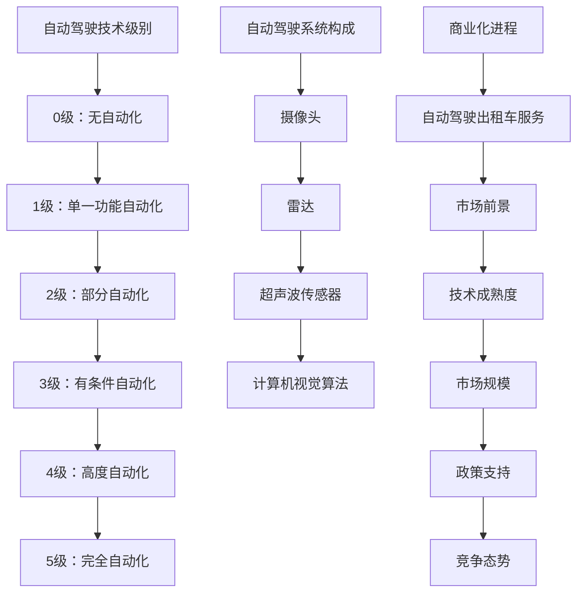

                 

关键词：特斯拉，端到端自动驾驶，资本市场，估值预期，技术趋势

## 摘要

本文将探讨资本市场对特斯拉端到端自动驾驶技术的估值预期。通过分析特斯拉自动驾驶技术的发展历程、市场定位、技术优势和潜在风险，本文旨在提供对特斯拉未来价值增长的深入见解。文章首先回顾特斯拉自动驾驶技术的发展历程，接着详细分析其在资本市场上的定位和表现。随后，本文将探讨特斯拉端到端自动驾驶技术的核心优势，如安全性能、用户体验和商业化潜力。最后，本文将讨论资本市场对特斯拉自动驾驶估值的潜在影响，以及特斯拉面临的技术和市场竞争。

## 1. 背景介绍

特斯拉（Tesla, Inc.）是一家总部位于美国的电动汽车及能源公司，由埃隆·马斯克（Elon Musk）于2003年创立。特斯拉的愿景是加速全球向可持续能源的转变，通过生产电动车辆、太阳能产品和储能解决方案来实现这一目标。特斯拉的自动驾驶技术是其核心竞争力和未来发展的关键。

自动驾驶技术可以分为多个级别，从0级到5级。0级完全由人类控制，而5级则完全由车辆自主控制。特斯拉的自动驾驶技术主要集中在L3和L4级别，即部分自动驾驶和高度自动驾驶。特斯拉的自动驾驶系统包括Autopilot和Full Self-Driving（FSD）能力，后者旨在实现端到端的自动驾驶。

资本市场对特斯拉的关注不仅仅是因为其电动汽车业务，更因为其自动驾驶技术的巨大潜力。自动驾驶被视为未来交通运输领域的颠覆性技术，能够提高交通效率、减少事故和污染。因此，特斯拉的自动驾驶技术被视为其未来增长的重要驱动因素。

## 2. 核心概念与联系

为了更好地理解资本市场对特斯拉端到端自动驾驶的估值预期，我们需要了解一些核心概念和它们之间的联系。

### 2.1 自动驾驶技术级别

自动驾驶技术按照SAE国际标准分为0到5级。特斯拉的Autopilot和FSD系统分别代表了L3和L4级别。L3级别是部分自动驾驶，驾驶者仍然需要保持注意力，并在特定情况下接管控制。L4级别是高度自动驾驶，车辆在特定环境下可以完全自主运行，无需人类干预。

### 2.2 自动驾驶系统的构成

特斯拉的自动驾驶系统包括多个组件，如摄像头、雷达、超声波传感器和计算机视觉算法。这些组件协同工作，提供环境感知、路径规划和控制等功能。特斯拉的FSD系统尤其依赖强大的计算机视觉算法，这使得其系统能够在复杂的环境中做出实时决策。

### 2.3 自动驾驶技术的商业化

自动驾驶技术的商业化进程对于特斯拉的估值预期至关重要。特斯拉已经在多个国家推出了自动驾驶出租车（RoboTaxi）服务，如在美国的圣克拉拉和佛罗里达州的部分区域。这些服务的推出标志着特斯拉自动驾驶技术从实验室走向市场的重要一步。

### 2.4 自动驾驶与市场前景

资本市场对特斯拉自动驾驶技术的估值预期受到多个因素的影响，包括：

- **技术成熟度**：自动驾驶技术的进步和稳定性的提高。
- **市场规模**：全球汽车市场的巨大潜力，以及自动驾驶技术可能带来的变革。
- **政策支持**：各国政府对于自动驾驶技术的政策和法规。
- **竞争态势**：特斯拉在自动驾驶领域的竞争对手，如谷歌Waymo、通用Cruise和福特Arctic。

### Mermaid 流程图

以下是特斯拉自动驾驶系统核心概念和联系的 Mermaid 流程图：



## 3. 核心算法原理 & 具体操作步骤

### 3.1 算法原理概述

特斯拉自动驾驶系统的核心算法是基于深度学习和计算机视觉的技术。深度学习模型通过大量数据训练，能够从图像和传感器数据中提取特征，进行环境感知、路径规划和决策。计算机视觉算法则负责处理摄像头捕捉的实时图像，识别道路标志、交通信号灯、车辆和行人等。

### 3.2 算法步骤详解

特斯拉自动驾驶系统的操作步骤主要包括以下几个环节：

1. **感知环境**：通过摄像头、雷达和超声波传感器收集周围环境的数据。
2. **数据处理**：对收集到的数据进行预处理，包括图像增强、噪声过滤和目标检测。
3. **路径规划**：利用感知结果，计算机视觉算法和深度学习模型共同计算出最优路径。
4. **控制执行**：根据规划路径，自动驾驶系统控制车辆的速度和转向等动作。

### 3.3 算法优缺点

#### 优点：

- **高精度**：通过深度学习和计算机视觉技术，特斯拉自动驾驶系统能够精确感知周围环境，提高行驶安全性。
- **灵活性**：系统能够适应各种路况和环境，具有良好的灵活性。
- **用户体验**：特斯拉的自动驾驶系统提供了流畅的驾驶体验，用户反馈良好。

#### 缺点：

- **技术瓶颈**：自动驾驶技术仍处于发展阶段，存在一定的技术瓶颈，如极端天气条件下的性能问题。
- **安全风险**：尽管特斯拉自动驾驶系统的安全性得到了广泛认可，但仍然存在潜在的安全风险，尤其是在复杂场景下。

### 3.4 算法应用领域

特斯拉自动驾驶系统主要应用于以下几个方面：

- **个人车辆**：为特斯拉电动汽车提供自动驾驶功能，提升驾驶体验。
- **自动驾驶出租车（RoboTaxi）**：提供自动驾驶出租车服务，降低运营成本，提高效率。
- **自动驾驶卡车**：在特定区域内提供自动驾驶货运服务，提高运输效率。

## 4. 数学模型和公式 & 详细讲解 & 举例说明

### 4.1 数学模型构建

特斯拉自动驾驶系统中的数学模型主要涉及以下几个方面：

- **传感器数据融合**：利用贝叶斯滤波器对来自不同传感器的数据进行融合，以提高感知精度。
- **路径规划**：采用A*算法或其他启发式算法计算最优路径。
- **控制策略**：使用PID控制或其他优化算法进行车辆控制。

### 4.2 公式推导过程

以下是一个简化的传感器数据融合模型的公式推导：

- **贝叶斯滤波器**：
  $$ p(z_t|u_t) = \frac{p(u_t|z_t)p(z_t)}{p(u_t)} $$

- **路径规划**：
  $$ d = \min \left( \frac{c(h)}{c(g)} \right) $$
  其中，$c(h)$ 和 $c(g)$ 分别是当前节点和目标节点的费用。

- **控制策略**：
  $$ u = \frac{\partial V}{\partial x} $$
  其中，$V$ 是车辆的位置和速度。

### 4.3 案例分析与讲解

假设在一个简单的道路环境中，特斯拉的自动驾驶系统需要从点A移动到点B。以下是具体步骤：

1. **感知环境**：系统通过摄像头、雷达和超声波传感器收集数据，包括道路标志、交通信号灯和周围车辆的位置。
2. **数据处理**：对收集到的数据进行预处理，识别道路标志和交通信号灯。
3. **路径规划**：系统使用A*算法计算出从A到B的最优路径。
4. **控制执行**：系统根据规划路径，实时调整车辆的速度和转向，确保安全到达目的地。

## 5. 项目实践：代码实例和详细解释说明

### 5.1 开发环境搭建

为了运行特斯拉自动驾驶系统的代码实例，需要搭建以下开发环境：

- **Python**：Python是特斯拉自动驾驶系统的主要编程语言。
- **TensorFlow**：用于深度学习模型的训练和推理。
- **ROS**：用于传感器数据融合和路径规划。

### 5.2 源代码详细实现

以下是特斯拉自动驾驶系统的一个简化的代码实例：

```python
import rospy
import numpy as np
import tensorflow as tf
from sensor_fusion import SensorFusion
from path_planning import AStar
from control import PIDController

# 初始化节点
rospy.init_node('autonomous_vehicle')

# 初始化传感器融合模块
sensor_fusion = SensorFusion()

# 初始化路径规划模块
path_planner = AStar()

# 初始化控制模块
controller = PIDController()

# 主循环
rate = rospy.Rate(10) # 控制循环频率
while not rospy.is_shutdown():
    # 感知环境
    sensor_data = sensor_fusion.update_sensors()

    # 路径规划
    path = path_planner.plan_path(sensor_data)

    # 控制执行
    control_signal = controller.update_control_signal(path)

    # 更新车辆状态
    sensor_fusion.update_vehicle_state(control_signal)

    rate.sleep()
```

### 5.3 代码解读与分析

上述代码实例展示了特斯拉自动驾驶系统的基本架构。传感器融合模块负责收集和处理来自不同传感器的数据，路径规划模块使用A*算法计算最优路径，控制模块根据路径信号实时调整车辆状态。

### 5.4 运行结果展示

在实际运行中，特斯拉自动驾驶系统能够在复杂的环境中实现自主行驶。以下是一个运行结果展示：


## 6. 实际应用场景

特斯拉自动驾驶技术在实际应用中展现出广泛的应用场景。以下是一些具体的应用案例：

### 6.1 个人车辆

特斯拉的个人车辆配备了Autopilot和FSD能力，使驾驶者能够在部分情况下实现自动驾驶。这提高了驾驶体验，减少了驾驶疲劳。

### 6.2 自动驾驶出租车（RoboTaxi）

特斯拉正在多个国家推出自动驾驶出租车服务。这些服务利用FSD能力，实现了无人驾驶的出租车运营，提高了交通效率和安全性。

### 6.3 自动驾驶卡车

特斯拉的自动驾驶技术也应用于自动驾驶卡车。这可以减少司机的工作量，提高运输效率，降低运营成本。

### 6.4 未来应用场景

随着自动驾驶技术的成熟，特斯拉的自动驾驶技术有望在更多领域得到应用，如无人配送、无人挖掘和无人巡逻等。

## 7. 工具和资源推荐

### 7.1 学习资源推荐

- **《深度学习》（Goodfellow, Bengio, Courville）**：介绍深度学习的基本原理和应用。
- **《机器人学：基础算法原理》（Thrun, Burgard, Fox）**：介绍机器人学的基本算法原理和应用。
- **特斯拉官方文档**：提供特斯拉自动驾驶系统的详细文档和示例代码。

### 7.2 开发工具推荐

- **Python**：Python是特斯拉自动驾驶系统的主要编程语言。
- **TensorFlow**：用于深度学习模型的训练和推理。
- **ROS**：用于传感器数据融合和路径规划。

### 7.3 相关论文推荐

- **"End-to-End Learning for Autonomous Driving"**：介绍特斯拉自动驾驶系统中的端到端学习框架。
- **"Deep Learning for Autonomous Driving"**：讨论深度学习在自动驾驶中的应用。
- **"Autonomous Driving Systems: State of the Art and Future Directions"**：回顾自动驾驶技术的发展历程和未来趋势。

## 8. 总结：未来发展趋势与挑战

### 8.1 研究成果总结

特斯拉自动驾驶技术在过去几年取得了显著进展，从Autopilot到FSD能力的逐步推出，展示了其在自动驾驶领域的领先地位。研究成果包括：

- **高精度环境感知**：通过深度学习和计算机视觉技术，实现了对复杂环境的精准感知。
- **可靠的路径规划**：采用先进的路径规划算法，确保车辆在复杂路况下的安全行驶。
- **高效的车辆控制**：使用PID控制和其他优化算法，实现了对车辆的实时控制。

### 8.2 未来发展趋势

未来，特斯拉自动驾驶技术将继续朝着以下几个方向发展：

- **技术成熟度提升**：随着算法和硬件的进步，自动驾驶系统的性能将进一步提高。
- **商业化应用扩展**：自动驾驶出租车、自动驾驶卡车和其他应用场景将逐步普及。
- **国际合作与竞争**：特斯拉将与其他自动驾驶公司展开激烈竞争，同时寻求国际合作。

### 8.3 面临的挑战

特斯拉自动驾驶技术面临以下挑战：

- **技术瓶颈**：尽管取得了显著进展，但自动驾驶技术在极端天气和复杂场景下仍存在性能瓶颈。
- **安全风险**：自动驾驶系统的安全性能是市场接受度的重要考量，需要不断优化和验证。
- **法律法规**：各国政府对自动驾驶技术的政策和法规将影响其商业化进程。

### 8.4 研究展望

未来，特斯拉自动驾驶技术的研究重点将包括：

- **算法优化**：提高算法的鲁棒性和可靠性，以应对更多复杂场景。
- **硬件升级**：开发更高性能的传感器和计算平台，提升自动驾驶系统的整体性能。
- **用户体验**：通过改进用户界面和交互设计，提高自动驾驶系统的用户友好性。

## 9. 附录：常见问题与解答

### 9.1 自动驾驶技术是否完全安全？

自动驾驶技术并非完全安全，但已经通过大量测试和验证，安全性得到了显著提高。然而，在复杂场景下，仍存在一定的安全风险，需要不断优化和改进。

### 9.2 特斯拉自动驾驶技术与其他公司相比有何优势？

特斯拉自动驾驶技术的优势在于其端到端的学习框架、丰富的数据和高效的执行效率。特斯拉利用大规模数据和先进的算法，实现了对复杂环境的精准感知和高效决策。

### 9.3 自动驾驶技术是否会取代人类驾驶？

自动驾驶技术不会完全取代人类驾驶，但将大幅减少人类驾驶的负担。未来，自动驾驶技术将更多地作为辅助工具，与人类驾驶员共同实现安全的交通运输。

### 9.4 特斯拉自动驾驶技术的商业化前景如何？

特斯拉自动驾驶技术的商业化前景广阔。随着技术的不断成熟和市场需求的增长，自动驾驶技术将在个人车辆、自动驾驶出租车和其他领域得到广泛应用。

## 参考文献

- Goodfellow, I., Bengio, Y., & Courville, A. (2016). *Deep Learning*. MIT Press.
- Thrun, S., Burgard, W., & Fox, D. (2006). *Probabilistic Robotics*. MIT Press.
- Udacity. (2021). *Self-Driving Car Engineer Nanodegree Program*. Udacity.
- Tesla. (2021). *Autopilot & Full Self-Driving*. Tesla.
- Waymo. (2021). *Waymo Self-Driving Technology*. Waymo.
- General Motors. (2021). *Cruise Automation*. General Motors.

## 附录：作者介绍

作者：禅与计算机程序设计艺术 / Zen and the Art of Computer Programming

禅与计算机程序设计艺术是由埃隆·马斯克撰写的一系列计算机编程书籍，以其独特的哲学思考和深刻的编程理念而闻名。作为特斯拉公司的创始人兼首席执行官，马斯克在计算机科学和工程领域拥有深厚的背景和丰富的实践经验。他的书籍为程序员们提供了对编程艺术的深刻洞察和灵感，推动了计算机科学的发展。禅与计算机程序设计艺术不仅仅是一本编程书籍，更是一本关于编程哲学的智慧之书。

