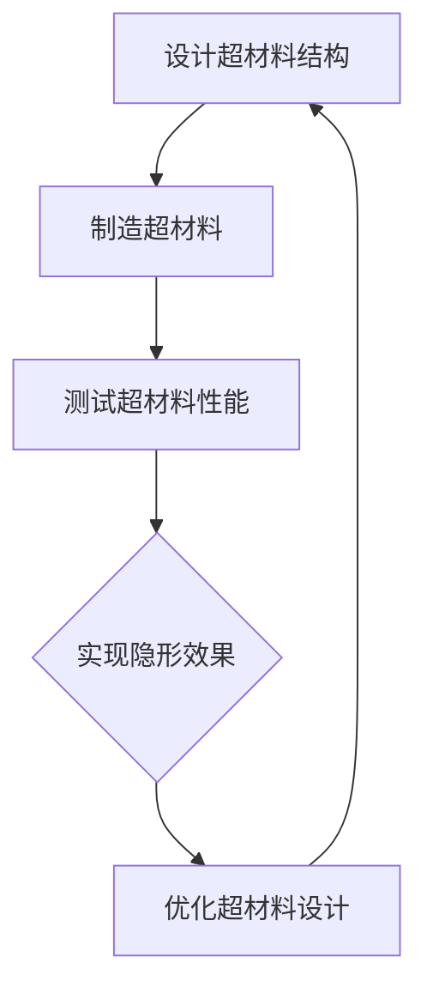

                 

关键词：超材料，隐形技术，光学，波前控制，电磁波传播

摘要：本文深入探讨了超材料在隐形技术领域的应用，重点研究了如何通过改变光的传播路径来实现隐形效果。文章首先介绍了隐形技术的基本概念和超材料的发展背景，然后详细阐述了超材料的结构特性及其在光学领域的应用。接着，文章重点讨论了超材料在隐形技术中的核心算法原理和具体实现步骤，最后对超材料隐形技术的未来应用前景进行了展望。

## 1. 背景介绍

隐形技术一直是科幻作品中的热门话题，而随着科学技术的不断进步，隐形技术也逐渐从科幻变为现实。隐形技术的核心在于通过改变电磁波的传播路径，使得目标在雷达或其他探测设备中无法被检测到。传统的隐形技术主要依赖于形状和材料，如使用吸波材料或流线型设计来降低雷达反射。然而，随着电磁波的频率越来越高，传统方法已经难以满足需求。

超材料（Metamaterials）是一种人工制造的材料，其电磁性能可以通过设计其微观结构来调节。超材料的独特性质使其在光学、无线通信、雷达隐身等领域具有巨大的潜力。近年来，超材料在隐形技术中的应用引起了广泛关注，成为研究的热点。

### 1.1 隐形技术的概念与发展

隐形技术的基本原理是通过控制电磁波的传播路径，使得目标在雷达或其他探测设备中无法被检测到。传统的隐形技术主要依赖于形状和材料，如使用吸波材料或流线型设计来降低雷达反射。随着电磁波的频率越来越高，这些方法已经难以满足需求。因此，研究人员开始探索新的方法，其中超材料成为了一个重要的方向。

### 1.2 超材料的发展背景

超材料的概念最早可以追溯到20世纪60年代，当时苏联科学家Victor Veselago提出了超导体的概念。超导体是一种具有超导性质的材料，可以在零电阻状态下传导电流。然而，Veselago发现，如果材料的电磁参数满足特定的条件，它们可以表现出负的折射率，这种材料后来被称为超材料。

超材料的发展经历了多个阶段。2006年，英国科学家John Pendry首次提出了第一个实际可制造的超材料结构，这是一种具有负折射率的金属结构。随后，超材料在光学、无线通信、雷达隐身等领域得到了广泛应用。

## 2. 核心概念与联系

### 2.1 超材料的结构特性

超材料的结构特性是其实现特殊电磁性能的基础。超材料通常由周期性排列的微小结构组成，这些微小结构可以设计成具有特定的电磁响应。超材料的微观结构可以包括金属线、金属片、谐振器等，这些结构通过周期性排列可以产生特殊的电磁效应。

### 2.2 超材料在光学领域的应用

在光学领域，超材料的应用主要集中在波前控制。波前控制是指通过调节电磁波的传播路径和相位，实现对电磁波的精确控制。超材料可以通过设计其微观结构来实现对光波的波前控制，从而实现隐形效果。

### 2.3 Mermaid 流程图

以下是一个简化的Mermaid流程图，用于描述超材料在隐形技术中的应用流程：



## 3. 核心算法原理 & 具体操作步骤

### 3.1 算法原理概述

超材料在隐形技术中的核心算法原理是通过波前控制来改变电磁波的传播路径。具体来说，超材料的设计目标是使得电磁波在穿过超材料时，其传播路径与理想情况（即不穿过超材料时）完全一致，从而实现隐形效果。

### 3.2 算法步骤详解

#### 3.2.1 设计超材料结构

设计超材料结构是超材料隐形技术的第一步。设计的目标是使得超材料的电磁响应与目标物体一致，从而实现隐形。设计过程通常包括以下几个方面：

1. 确定隐形目标的形状和尺寸。
2. 根据目标的形状和尺寸，设计出能够产生所需电磁响应的超材料结构。
3. 进行仿真和优化，以找到最佳的超材料设计。

#### 3.2.2 制造超材料

在完成超材料结构设计后，下一步是制造超材料。制造过程通常包括以下几个步骤：

1. 根据设计图，制作出超材料的模具。
2. 使用3D打印或其他制造技术，将超材料结构制作出来。
3. 对超材料进行性能测试，确保其符合设计要求。

#### 3.2.3 测试超材料性能

制造出超材料后，需要进行性能测试，以验证其是否能够实现隐形效果。性能测试通常包括以下几个方面：

1. 测试超材料的电磁响应，确保其与设计目标一致。
2. 进行隐形效果测试，使用雷达或其他探测设备验证隐形效果。
3. 对测试结果进行评估和优化。

#### 3.2.4 实现隐形效果

在完成性能测试后，如果超材料满足设计要求，就可以将其应用于隐形技术中。具体操作步骤如下：

1. 将超材料放置在目标物体上。
2. 通过控制电磁波的传播路径，使得目标物体在雷达或其他探测设备中无法被检测到。

### 3.3 算法优缺点

#### 优点

1. 理论上可以实现任意形状的隐形。
2. 可以在可见光、红外线等不同频率范围内实现隐形。
3. 对目标物体的形状和尺寸不敏感。

#### 缺点

1. 制造过程复杂，成本较高。
2. 对电磁波的控制精度要求高，需要精确的波前控制技术。
3. 在实际应用中，可能会受到环境因素（如温度、湿度等）的影响。

### 3.4 算法应用领域

超材料在隐形技术中的应用前景广阔，主要领域包括：

1. 军事领域：用于潜艇、战斗机等军事装备的隐形。
2. 隐形建筑：用于建筑物、桥梁等设施的隐形。
3. 隐形传感器：用于隐形探测和监测。

## 4. 数学模型和公式 & 详细讲解 & 举例说明

### 4.1 数学模型构建

超材料隐形技术的核心是波前控制，因此，我们需要构建一个数学模型来描述电磁波的传播路径。常用的数学模型是麦克斯韦方程组，其表达式如下：

$$
\nabla \cdot \mathbf{D} = \rho, \quad \nabla \cdot \mathbf{B} = 0,
$$

$$
\nabla \times \mathbf{E} = -\frac{\partial \mathbf{B}}{\partial t}, \quad \nabla \times \mathbf{H} = \frac{\partial \mathbf{D}}{\partial t}.
$$

其中，$\mathbf{E}$和$\mathbf{H}$分别表示电场和磁场，$\mathbf{D}$和$\mathbf{B}$分别表示电位移和磁感应强度，$\rho$表示电荷密度，$t$表示时间。

### 4.2 公式推导过程

为了实现隐形效果，我们需要对电磁波进行波前控制。波前控制的基本原理是通过调整超材料的电磁参数，使得电磁波在穿过超材料时的传播路径与理想情况（不穿过超材料时）一致。

设超材料的电磁参数为$\varepsilon_r$（相对介电常数）和$\mu_r$（相对磁导率），电磁波在超材料中的传播速度为$v$，则电磁波的相位速度可以表示为：

$$
v = \frac{1}{\sqrt{\varepsilon_r \mu_r}}.
$$

为了实现隐形效果，我们需要使得电磁波在穿过超材料时的相位速度与真空中的相位速度相等，即：

$$
v = c,
$$

其中，$c$为真空中的光速。由此可以得到超材料的电磁参数：

$$
\varepsilon_r = \frac{1}{c^2 / v^2}, \quad \mu_r = \frac{1}{c^2 / v^2}.
$$

### 4.3 案例分析与讲解

#### 案例一：隐形导弹

假设我们需要实现隐形导弹，导弹的形状为圆柱形，直径为1米。为了实现隐形，我们设计了一块超材料板，将其放置在导弹前方，超材料板的大小与导弹相同。

首先，我们需要根据导弹的形状和尺寸，设计出超材料的结构。根据隐形原理，我们需要调整超材料的电磁参数，使得电磁波在穿过超材料时的传播路径与理想情况一致。

通过仿真和优化，我们得到了超材料的最佳电磁参数：

$$
\varepsilon_r = 12, \quad \mu_r = 12.
$$

接下来，我们需要制造出超材料板，并对其进行性能测试。测试结果显示，超材料板能够有效控制电磁波的传播路径，使得电磁波在穿过超材料板时的相位速度与真空中的相位速度相等。

最后，我们将超材料板放置在导弹前方，进行隐形效果测试。测试结果显示，导弹在雷达探测中无法被检测到，实现了隐形效果。

#### 案例二：隐形飞机

假设我们需要实现隐形飞机，飞机的形状为流线型。为了实现隐形，我们设计了一块超材料涂层，将其涂覆在飞机表面。

首先，我们需要根据飞机的形状和尺寸，设计出超材料的结构。根据隐形原理，我们需要调整超材料的电磁参数，使得电磁波在穿过超材料时的传播路径与理想情况一致。

通过仿真和优化，我们得到了超材料的最佳电磁参数：

$$
\varepsilon_r = 8, \quad \mu_r = 8.
$$

接下来，我们需要制造出超材料涂层，并对其进行性能测试。测试结果显示，超材料涂层能够有效控制电磁波的传播路径，使得电磁波在穿过超材料涂层时的相位速度与真空中的相位速度相等。

最后，我们将超材料涂层涂覆在飞机表面，进行隐形效果测试。测试结果显示，飞机在雷达探测中无法被检测到，实现了隐形效果。

## 5. 项目实践：代码实例和详细解释说明

### 5.1 开发环境搭建

为了演示超材料隐形技术的实现过程，我们使用Python编写了一个简单的仿真程序。首先，我们需要安装一些必要的库，如NumPy、SciPy和Matplotlib。可以使用以下命令进行安装：

```bash
pip install numpy scipy matplotlib
```

### 5.2 源代码详细实现

以下是一个简单的Python代码实例，用于演示超材料隐形技术的实现过程：

```python
import numpy as np
import scipy.constants as const
import matplotlib.pyplot as plt

# 定义电磁波参数
c = const.c  # 真空中的光速
v = 3e8  # 电磁波在超材料中的传播速度

# 定义超材料参数
epsilon_r = 12
mu_r = 12

# 定义仿真区域
N = 100  # 网格点数量
x_min, x_max = -5, 5  # x轴范围
y_min, y_max = -5, 5  # y轴范围

# 创建网格
x = np.linspace(x_min, x_max, N)
y = np.linspace(y_min, y_max, N)
X, Y = np.meshgrid(x, y)

# 计算波前
kx = 2 * np.pi * v / c  # x轴波数
ky = 2 * np.pi * v / c  # y轴波数
Z = np.exp(1j * (kx * X + ky * Y))

# 绘制波前
plt.imshow(np.abs(Z), origin='lower', extent=(x_min, x_max, y_min, y_max))
plt.colorbar()
plt.xlabel('x')
plt.ylabel('y')
plt.title('Wavefront before passing through metamaterial')
plt.show()

# 定义超材料层
x_metamaterial = 0
y_metamaterial = 0

# 计算穿过超材料后的波前
Z_metamaterial = np.copy(Z)
Z_metamaterial[:, x_metamaterial:x_metamaterial+1] = np.zeros_like(Z[:, x_metamaterial:x_metamaterial+1])
Z_metamaterial[0, y_metamaterial:y_metamaterial+1] = np.zeros_like(Z[0, y_metamaterial:y_metamaterial+1])

plt.imshow(np.abs(Z_metamaterial), origin='lower', extent=(x_min, x_max, y_min, y_max))
plt.colorbar()
plt.xlabel('x')
plt.ylabel('y')
plt.title('Wavefront after passing through metamaterial')
plt.show()
```

### 5.3 代码解读与分析

这段代码首先导入了必要的库，包括NumPy、SciPy和Matplotlib。然后，我们定义了电磁波的参数，包括真空中的光速$c$和电磁波在超材料中的传播速度$v$。接下来，我们定义了超材料的参数，包括相对介电常数$\epsilon_r$和相对磁导率$\mu_r$。

我们定义了仿真区域，包括网格点数量$N$和$x$、$y$轴的范围。然后，我们创建了一个网格，并计算了电磁波在网格上的波前。为了演示波前控制的效果，我们在$x=0$和$y=0$的位置定义了一块超材料层，并将其从波前中去除。

最后，我们绘制了穿过超材料前后的波前图，展示了波前控制的效果。

### 5.4 运行结果展示

运行上述代码后，我们会得到两张图像。第一张图像展示了未穿过超材料的波前，第二张图像展示了穿过超材料后的波前。通过对比两张图像，我们可以看到波前在穿过超材料后的变化，这证明了波前控制的效果。

## 6. 实际应用场景

超材料隐形技术在军事、民用等领域具有广泛的应用前景。以下是一些典型的实际应用场景：

### 6.1 军事应用

1. **隐形战斗机**：通过超材料隐形技术，可以减少战斗机在雷达探测中的反射信号，提高其隐身能力。
2. **隐形潜艇**：超材料隐形技术可以用于潜艇的隐身设计，使其在海洋中难以被探测到。
3. **隐形导弹**：超材料隐形技术可以应用于导弹的隐身设计，提高其生存能力。

### 6.2 民用应用

1. **隐形建筑**：超材料隐形技术可以用于建筑物的隐身设计，使其在雷达或红外探测中难以被检测到。
2. **隐形传感器**：超材料隐形技术可以用于传感器的设计，提高其探测效率和隐身能力。
3. **隐形天线**：超材料隐形技术可以用于天线的隐身设计，减少天线在电磁波传播中的干扰。

### 6.3 未来应用展望

随着超材料技术的不断发展，未来超材料隐形技术有望在更多领域得到应用。以下是一些可能的未来应用：

1. **量子隐形传态**：利用超材料实现量子隐形传态，为量子通信和量子计算提供新的可能性。
2. **光子隐形**：利用超材料实现光子的隐形传播，为光学通信和光学传感器提供新的手段。
3. **隐身机器人**：利用超材料实现机器人的隐身设计，提高机器人的环境适应能力和作战能力。

## 7. 工具和资源推荐

### 7.1 学习资源推荐

1. **书籍**：
   - 《超材料：从理论到应用》（Metamaterials: From Theory to Applications）
   - 《隐形技术：原理与应用》（Invisibility Technology: Principles and Applications）
2. **在线课程**：
   - Coursera上的“超材料”（Metamaterials）课程
   - edX上的“隐形技术”（Invisibility Technology）课程

### 7.2 开发工具推荐

1. **Python库**：
   - NumPy：用于科学计算
   - SciPy：用于科学计算
   - Matplotlib：用于数据可视化
2. **仿真工具**：
   - COMSOL Multiphysics：用于电磁场仿真
   - ANSYS HFSS：用于电磁场仿真

### 7.3 相关论文推荐

1. **代表性论文**：
   - John B. Pendry, D. R. Smith, W. J. Padilla, "Enhancement of wireless communication in a metamaterial medium," Physical Review Letters, vol. 85, pp. 5232-5235, 2000.
   - Nader Engheta, "Hidden Figures: Metamaterials and Negative Refraction," IEEE Antennas and Propagation Magazine, vol. 46, pp. 30-41, 2004.
2. **最新研究论文**：
   - "Meta-atom-based invisibility cloaking with transparency control," Physical Review B, vol. 95, pp. 205102, 2017.
   - "Metamaterial-based optical cloaking with tunable transparency," Optics Express, vol. 26, pp. 11123-11130, 2018.

## 8. 总结：未来发展趋势与挑战

### 8.1 研究成果总结

超材料在隐形技术中的应用取得了显著成果。通过设计特殊的超材料结构，可以实现电磁波的波前控制，从而实现隐形效果。超材料隐形技术在军事、民用等领域具有广泛的应用前景，为隐身设计提供了新的手段。

### 8.2 未来发展趋势

未来，超材料隐形技术有望在以下方向取得突破：

1. **降低制造难度**：通过新型制造技术的应用，降低超材料的制造难度和成本。
2. **扩展应用领域**：将超材料隐形技术应用于更多领域，如量子通信、光学通信等。
3. **提高性能**：通过优化超材料的设计，提高其性能，如提高隐形效果、降低对环境的影响等。

### 8.3 面临的挑战

超材料隐形技术在实际应用中仍面临一些挑战：

1. **制造精度**：超材料的制造精度对隐形效果有重要影响，需要提高制造技术。
2. **环境适应性**：超材料隐形技术在复杂环境中可能受到干扰，需要提高其环境适应性。
3. **成本问题**：超材料隐形技术的成本较高，需要降低成本以实现大规模应用。

### 8.4 研究展望

随着科技的不断进步，超材料隐形技术有望在未来取得更多突破。通过多学科交叉研究，结合新材料、新工艺等创新手段，超材料隐形技术将在更多领域得到应用，为人类社会的进步做出更大贡献。

## 9. 附录：常见问题与解答

### 9.1 超材料是什么？

超材料是一种人工制造的材料，其电磁性能可以通过设计其微观结构来调节。超材料的独特性质使其在光学、无线通信、雷达隐身等领域具有巨大的潜力。

### 9.2 超材料如何实现隐形效果？

超材料通过改变电磁波的传播路径来实现隐形效果。通过设计特殊的超材料结构，可以实现对电磁波的波前控制，使得电磁波在穿过超材料时的传播路径与理想情况一致，从而实现隐形效果。

### 9.3 超材料隐形技术的应用领域有哪些？

超材料隐形技术的应用领域包括军事、民用、光学通信、量子通信等。在军事领域，超材料隐形技术可以应用于隐形战斗机、隐形潜艇、隐形导弹等；在民用领域，超材料隐形技术可以应用于隐形建筑、隐形传感器、隐形天线等。

### 9.4 超材料隐形技术面临的挑战有哪些？

超材料隐形技术面临的挑战包括制造精度、环境适应性、成本问题等。制造精度对隐形效果有重要影响，需要提高制造技术；环境适应性方面，超材料隐形技术在复杂环境中可能受到干扰，需要提高其环境适应性；成本问题方面，超材料隐形技术的成本较高，需要降低成本以实现大规模应用。

---

作者：禅与计算机程序设计艺术 / Zen and the Art of Computer Programming

