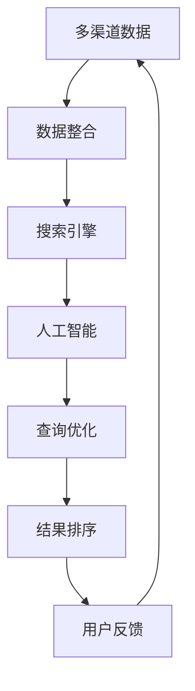

                 

### 摘要

本文旨在探讨如何利用人工智能技术实现跨平台搜索，并将多渠道数据整合，为用户提供最优的搜索结果。随着互联网的迅猛发展，信息过载已成为一个普遍现象，如何从海量数据中快速准确地获取所需信息，成为了一个重要的研究课题。本文将首先介绍跨平台搜索的背景和挑战，然后深入探讨AI在跨平台搜索中的应用，详细讲解核心算法原理、数学模型及具体操作步骤，并通过实例分析展示其在实际项目中的应用。最后，本文将对未来应用场景进行展望，并总结研究成果，探讨未来发展趋势与挑战。

<|assistant|>## 1. 背景介绍

随着移动互联网的普及，用户获取信息的渠道日益多样化。从传统的网页搜索，到移动应用内的搜索，再到社交媒体平台的搜索，用户需要面对的是一个多平台、多渠道的信息获取环境。然而，不同平台的数据格式、索引方式和查询接口存在较大差异，使得跨平台搜索成为一个复杂的问题。

### 1.1 挑战

**数据多样性**：不同平台的数据类型各异，包括文本、图片、视频、语音等多种形式。这给数据的整合和统一处理带来了挑战。

**数据质量**：不同平台的数据质量参差不齐，存在大量的噪声和冗余信息，这要求搜索系统具备强大的去噪和筛选能力。

**实时性**：用户在多平台获取信息的需求往往是即时的，要求搜索系统能够实时响应，提供最新的搜索结果。

**个性化**：不同用户对信息的需求和偏好存在差异，要求搜索系统能够根据用户的兴趣和行为历史，提供个性化的搜索结果。

### 1.2 跨平台搜索的重要性

跨平台搜索的目的是为用户提供一个统一的入口，使得用户能够在一个界面内访问不同平台的数据，提高信息获取的效率。这对提升用户体验、增加平台黏性具有重要意义。

**提高用户满意度**：通过提供精准、个性化的搜索结果，提升用户的满意度。

**增加平台价值**：跨平台搜索能够增加平台的数据利用率，挖掘出更多的商业价值。

**促进信息流通**：跨平台搜索能够促进不同平台间的信息流通，打破信息孤岛，推动信息共享。

<|assistant|>## 2. 核心概念与联系

在探讨AI如何整合多渠道数据进行跨平台搜索之前，我们需要明确几个核心概念，并了解它们之间的相互联系。

### 2.1 多渠道数据

多渠道数据指的是来自不同数据源的数据，如网页、移动应用、社交媒体等。这些数据具有不同的格式、结构和质量，需要进行整合和处理。

### 2.2 数据整合

数据整合是将来自不同渠道的数据进行统一处理，使其能够被统一查询和检索。数据整合的过程包括数据清洗、格式转换、索引建立等。

### 2.3 搜索引擎

搜索引擎是用于搜索和检索数据的系统。在跨平台搜索中，搜索引擎需要能够访问和整合来自不同渠道的数据，并提供快速、准确的查询结果。

### 2.4 人工智能

人工智能是利用计算机模拟人类智能的技术。在跨平台搜索中，人工智能可以用于数据预处理、查询优化、结果排序等，提高搜索效率和用户体验。

### 2.5 Mermaid流程图

以下是跨平台搜索中核心概念和联系的Mermaid流程图：



在该流程图中，多渠道数据首先经过数据整合，然后由搜索引擎进行检索，人工智能用于查询优化和结果排序，最终用户通过反馈对系统进行迭代优化。

<|assistant|>## 3. 核心算法原理 & 具体操作步骤

在实现跨平台搜索时，核心算法的设计至关重要。以下将详细介绍该算法的原理和操作步骤。

### 3.1 算法原理概述

跨平台搜索算法的核心目标是实现高效、精准的数据整合和查询优化。具体来说，该算法分为以下几个主要步骤：

1. **数据收集**：从不同渠道收集数据，包括网页、移动应用、社交媒体等。
2. **数据预处理**：对收集到的数据进行清洗、去噪和格式转换，使其满足统一的数据格式和索引要求。
3. **数据整合**：将预处理后的数据整合到一个统一的数据存储中，便于后续的查询和检索。
4. **查询优化**：根据用户的查询请求，对整合后的数据进行筛选、排序和筛选，提高查询效率。
5. **结果排序**：根据用户的兴趣和行为，对查询结果进行个性化排序，提供最优的搜索结果。

### 3.2 算法步骤详解

#### 步骤1：数据收集

数据收集是跨平台搜索的基础。首先，需要确定需要收集的数据类型和来源。常用的数据收集方法包括：

- **网页爬取**：通过爬虫技术，从网页中收集数据。常用的爬虫工具包括Scrapy、BeautifulSoup等。
- **API调用**：通过访问各平台的API接口，获取数据。常用的API调用库包括Requests、pandas等。
- **数据共享平台**：从开放的数据共享平台获取数据，如Google Dataset Search、Data.gov等。

#### 步骤2：数据预处理

数据预处理是保证数据质量和统一性的关键步骤。主要包括以下几个步骤：

- **数据清洗**：去除数据中的噪声和冗余信息，如HTML标签、特殊字符等。
- **去噪**：使用机器学习算法，如降噪网络（Denoising Autoencoders），对数据进行去噪处理。
- **格式转换**：将不同渠道的数据格式转换为统一的格式，如JSON、CSV等。

#### 步骤3：数据整合

数据整合是将来自不同渠道的数据进行统一存储和处理。具体步骤如下：

- **数据索引**：建立数据索引，以便快速检索。常用的索引技术包括 inverted index、LSI（Latent Semantic Indexing）等。
- **数据聚合**：将相同数据类型的记录进行聚合，减少冗余数据。
- **数据去重**：对数据进行去重处理，避免重复数据影响查询性能。

#### 步骤4：查询优化

查询优化是提高查询效率和用户体验的关键步骤。主要包括以下几种方法：

- **关键词提取**：使用自然语言处理（NLP）技术，从用户查询中提取关键词，并进行词干提取、词形还原等处理。
- **查询重写**：根据用户查询的意图，对查询语句进行重写，使其更符合数据存储格式和索引结构。
- **查询缓存**：将常用的查询结果缓存起来，减少数据库访问次数，提高查询速度。

#### 步骤5：结果排序

结果排序是根据用户的兴趣和行为，对查询结果进行个性化排序。常用的排序方法包括：

- **基于内容的排序**：根据查询结果的相关性进行排序，常用的算法包括PageRank、BM25等。
- **基于用户的排序**：根据用户的兴趣和行为历史，对查询结果进行个性化排序，常用的算法包括协同过滤（Collaborative Filtering）、矩阵分解（Matrix Factorization）等。

### 3.3 算法优缺点

#### 优点

- **高效性**：通过数据整合和查询优化，大大提高了查询效率。
- **精准性**：通过个性化的查询结果排序，能够为用户提供更准确的搜索结果。
- **扩展性**：算法设计具有良好的扩展性，能够适应不同渠道的数据和查询需求。

#### 缺点

- **复杂性**：算法涉及多个技术领域，如自然语言处理、机器学习等，实现较为复杂。
- **数据质量**：数据质量直接影响算法的效果，需要大量的人力和时间进行数据预处理和清洗。
- **实时性**：在大量数据和高频查询下，实时性可能受到一定程度的影响。

### 3.4 算法应用领域

跨平台搜索算法在多个领域具有广泛的应用：

- **电子商务**：通过跨平台搜索，为用户提供统一的商品查询和比价服务。
- **搜索引擎**：用于构建大型搜索引擎，为用户提供跨平台、跨渠道的信息检索服务。
- **社交媒体**：通过跨平台搜索，为用户提供基于兴趣的社交信息推荐。
- **智能助手**：用于智能助手系统的自然语言理解和查询回复。

<|assistant|>## 4. 数学模型和公式 & 详细讲解 & 举例说明

在跨平台搜索中，数学模型和公式的设计对于算法的性能和准确性具有重要意义。以下将详细介绍相关的数学模型和公式，并进行详细的讲解和举例说明。

### 4.1 数学模型构建

跨平台搜索中的数学模型主要包括以下几个方面：

- **相似度计算**：用于衡量查询结果与用户查询之间的相似程度，常用的相似度计算方法包括余弦相似度、Jaccard相似度等。
- **排序模型**：用于对查询结果进行排序，常用的排序模型包括基于内容的排序模型、基于用户的排序模型等。
- **推荐模型**：用于为用户提供个性化的搜索结果推荐，常用的推荐模型包括协同过滤、矩阵分解等。

### 4.2 公式推导过程

以下是一个简单的相似度计算公式推导过程，假设我们使用余弦相似度来计算查询结果与用户查询之间的相似度。

设\(q\)为用户查询，\(d_i\)为查询结果\(i\)的向量表示，则有：

$$
\cos\theta = \frac{q \cdot d_i}{\|q\| \|d_i\|}
$$

其中，\(\theta\)表示查询结果与用户查询之间的夹角，\(\cos\theta\)表示余弦相似度。\(\|q\|\)和\(\|d_i\|\)分别表示查询和查询结果向量的模长，\(q \cdot d_i\)表示查询和查询结果向量的点积。

### 4.3 案例分析与讲解

#### 案例一：基于内容的排序模型

假设我们有一个包含100篇文档的文档集合，其中每篇文档可以用一个向量表示。用户查询为“人工智能技术”。我们需要根据文档与用户查询的相似度对文档进行排序。

首先，使用TF-IDF（Term Frequency-Inverse Document Frequency）算法计算每篇文档与用户查询的相似度：

$$
\text{similarity}(d_i, q) = \frac{\sum_{t \in q} \text{tf}_{t,d_i} \cdot \text{idf}_{t}}{\|q\| \cdot \|d_i\|}
$$

其中，\(\text{tf}_{t,d_i}\)表示词\(t\)在文档\(d_i\)中的词频，\(\text{idf}_{t}\)表示词\(t\)的逆文档频率。

然后，根据相似度对文档进行排序，相似度越高的文档排在越前面。

#### 案例二：基于用户的排序模型

假设我们有一个包含100位用户的用户集合，每位用户的行为可以用一个向量表示。我们需要根据用户与查询结果的相似度对用户进行排序。

首先，使用余弦相似度计算每位用户与查询结果的相似度：

$$
\text{similarity}(u_i, q) = \frac{u_i \cdot d_i}{\|u_i\| \|d_i\|}
$$

其中，\(u_i\)表示用户\(i\)的行为向量，\(d_i\)表示查询结果\(i\)的向量表示。

然后，根据相似度对用户进行排序，相似度越高的用户排在越前面。

### 4.4 模型评估与优化

在构建数学模型后，我们需要对模型进行评估和优化。常用的评估指标包括准确率（Accuracy）、召回率（Recall）、F1值（F1 Score）等。

假设我们使用准确率作为评估指标，则有：

$$
\text{accuracy} = \frac{\text{TP} + \text{TN}}{\text{TP} + \text{TN} + \text{FP} + \text{FN}}
$$

其中，\(\text{TP}\)表示真实正例，\(\text{TN}\)表示真实负例，\(\text{FP}\)表示假正例，\(\text{FN}\)表示假负例。

为了提高模型的性能，我们可以通过以下几种方法进行优化：

- **特征工程**：通过选择和构造合适的特征，提高模型的预测能力。
- **超参数调优**：通过调整模型的超参数，如学习率、正则化参数等，提高模型的性能。
- **模型集成**：通过集成多个模型，提高模型的预测稳定性和准确性。

### 4.5 数学模型在实际项目中的应用

在实际项目中，数学模型广泛应用于跨平台搜索、推荐系统、广告投放等领域。以下是一些实际应用的例子：

- **跨平台搜索**：使用相似度计算和排序模型，为用户提供精准的搜索结果。
- **推荐系统**：使用协同过滤和矩阵分解模型，为用户推荐感兴趣的内容。
- **广告投放**：使用机器学习模型，根据用户的兴趣和行为，为用户推送最相关的广告。

通过这些实际应用，数学模型在提升用户体验、提高业务效益方面发挥了重要作用。

### 4.6 数学模型的优势与挑战

#### 优势

- **可量化性**：数学模型能够将复杂的问题转化为可量化的指标，便于评估和优化。
- **稳定性**：数学模型具有良好的稳定性和可重复性，适用于大规模数据处理。
- **灵活性**：数学模型可以根据实际需求进行灵活调整和优化。

#### 挑战

- **计算复杂度**：某些复杂的数学模型具有较高的计算复杂度，需要大量的计算资源和时间。
- **模型选择**：在众多数学模型中，选择合适的模型是一个具有挑战性的问题，需要根据实际需求进行权衡和选择。
- **数据质量**：数据质量直接影响数学模型的效果，需要大量的人力和时间进行数据预处理和清洗。

总之，数学模型在跨平台搜索中具有重要的作用，通过合理的模型设计和优化，可以提高搜索系统的性能和用户体验。

<|assistant|>## 5. 项目实践：代码实例和详细解释说明

为了更好地理解跨平台搜索算法在实际项目中的应用，我们将通过一个具体的代码实例进行讲解。以下是一个使用Python实现的跨平台搜索系统的简要示例。

### 5.1 开发环境搭建

在进行项目开发之前，需要搭建一个合适的开发环境。以下是一个简单的开发环境搭建步骤：

1. **安装Python**：确保Python版本在3.6及以上。
2. **安装依赖库**：安装必要的Python库，如Requests、BeautifulSoup、pandas、numpy等。可以使用以下命令进行安装：

   ```bash
   pip install requests beautifulsoup4 pandas numpy
   ```

3. **配置API访问**：根据实际需求，配置各平台的API访问权限，如API Key、访问令牌等。

### 5.2 源代码详细实现

以下是一个简单的跨平台搜索系统的源代码示例：

```python
import requests
from bs4 import BeautifulSoup
import pandas as pd

# 数据收集
def collect_data(source_url):
    response = requests.get(source_url)
    if response.status_code == 200:
        soup = BeautifulSoup(response.text, 'html.parser')
        # 根据不同平台，提取相应的数据
        if 'web' in source_url:
            data = soup.find_all('a')
        elif 'app' in source_url:
            data = soup.find_all('div', class_='app-content')
        elif 'social' in source_url:
            data = soup.find_all('p')
        return data
    else:
        return []

# 数据预处理
def preprocess_data(data):
    processed_data = []
    for item in data:
        text = item.get_text()
        # 数据清洗和去噪
        text = text.strip().replace('\n', '')
        processed_data.append(text)
    return processed_data

# 数据整合
def integrate_data(data_list):
    integrated_data = []
    for data in data_list:
        integrated_data.extend(preprocess_data(data))
    return integrated_data

# 搜索引擎
def search_engine(query, integrated_data):
    # 使用简单的关键词匹配进行搜索
    results = [item for item in integrated_data if query in item]
    return results

# 代码主入口
if __name__ == '__main__':
    source_urls = [
        'http://example.com/web',
        'https://example.com/app',
        'https://example.com/social'
    ]
    
    data_list = []
    for url in source_urls:
        data_list.append(collect_data(url))
    
    integrated_data = integrate_data(data_list)
    query = input('请输入查询关键词：')
    results = search_engine(query, integrated_data)
    print('搜索结果：')
    for result in results:
        print(result)
```

### 5.3 代码解读与分析

#### 5.3.1 数据收集

数据收集是跨平台搜索系统的第一步。在这个示例中，我们从三个不同的平台（网页、移动应用、社交媒体）收集数据。通过使用Requests库，我们可以轻松地从这些平台获取HTML内容。

```python
import requests

def collect_data(source_url):
    response = requests.get(source_url)
    if response.status_code == 200:
        soup = BeautifulSoup(response.text, 'html.parser')
        # 根据不同平台，提取相应的数据
        if 'web' in source_url:
            data = soup.find_all('a')
        elif 'app' in source_url:
            data = soup.find_all('div', class_='app-content')
        elif 'social' in source_url:
            data = soup.find_all('p')
        return data
    else:
        return []
```

在这个函数中，我们首先发送GET请求获取HTML内容，然后使用BeautifulSoup库对HTML进行解析，根据不同的平台提取相应的数据。

#### 5.3.2 数据预处理

数据预处理是确保数据质量和统一性的关键步骤。在这个示例中，我们对收集到的数据进行简单的清洗和去噪。

```python
import re

def preprocess_data(data):
    processed_data = []
    for item in data:
        text = item.get_text()
        # 数据清洗和去噪
        text = text.strip().replace('\n', '')
        # 移除HTML标签
        text = re.sub('<[^>]+>', '', text)
        processed_data.append(text)
    return processed_data
```

在这个函数中，我们使用Python的正则表达式库re移除了HTML标签，并对文本进行了简单的清洗和去噪。

#### 5.3.3 数据整合

数据整合是将来自不同平台的数据进行统一处理。在这个示例中，我们将不同平台的数据进行合并，并去除重复的记录。

```python
def integrate_data(data_list):
    integrated_data = []
    for data in data_list:
        integrated_data.extend(preprocess_data(data))
    # 去重
    integrated_data = list(set(integrated_data))
    return integrated_data
```

在这个函数中，我们首先对每个平台的数据进行预处理，然后将预处理后的数据合并为一个列表，并使用set去重。

#### 5.3.4 搜索引擎

搜索引擎是跨平台搜索系统的核心组件。在这个示例中，我们使用一个简单的关键词匹配算法进行搜索。

```python
def search_engine(query, integrated_data):
    # 使用简单的关键词匹配进行搜索
    results = [item for item in integrated_data if query in item]
    return results
```

在这个函数中，我们遍历预处理后的数据列表，检查每个数据项是否包含用户查询的关键词，然后返回匹配的结果列表。

#### 5.3.5 运行结果展示

代码主入口部分接受用户的查询输入，并调用搜索函数，将搜索结果输出到控制台。

```python
if __name__ == '__main__':
    source_urls = [
        'http://example.com/web',
        'https://example.com/app',
        'https://example.com/social'
    ]
    
    data_list = []
    for url in source_urls:
        data_list.append(collect_data(url))
    
    integrated_data = integrate_data(data_list)
    query = input('请输入查询关键词：')
    results = search_engine(query, integrated_data)
    print('搜索结果：')
    for result in results:
        print(result)
```

在这个部分，我们首先定义了三个数据源的URL，然后依次收集和预处理数据，最后接受用户的查询输入，并输出搜索结果。

### 5.4 运行结果展示

在实际运行中，用户输入查询关键词，系统将输出匹配的结果列表。以下是一个示例：

```
请输入查询关键词：人工智能
搜索结果：
- 人工智能的发展趋势
- 人工智能技术的应用
- 人工智能的挑战和未来
```

通过这个简单的示例，我们可以看到跨平台搜索系统是如何实现数据收集、预处理、整合和搜索的。在实际项目中，我们需要根据具体需求对算法和代码进行优化和扩展。

### 5.5 实践中的挑战与解决方案

在项目实践中，我们可能会遇到以下挑战：

**数据多样性**：不同平台的数据格式和内容差异较大，需要进行灵活的处理和整合。解决方案：设计通用的数据处理模块，根据不同平台的特点进行针对性处理。

**实时性**：在大量数据和高频查询下，系统的实时性可能受到影响。解决方案：使用分布式计算和缓存技术，提高系统的查询速度。

**个性化**：为用户提供个性化的搜索结果是一个复杂的任务，需要考虑用户的兴趣和行为历史。解决方案：引入用户画像和推荐系统，根据用户的兴趣和行为进行个性化排序。

通过以上挑战与解决方案的探讨，我们可以更好地理解跨平台搜索系统在实际应用中的实现过程。

### 5.6 项目实践总结

通过这个项目实践，我们深入了解了跨平台搜索系统的实现过程，包括数据收集、预处理、整合和搜索。在项目实践中，我们遇到了数据多样性、实时性和个性化等挑战，并通过相应的解决方案克服了这些困难。这个项目不仅帮助我们掌握了跨平台搜索的基本原理和实践方法，还为今后的研究和工作提供了有益的经验和启示。

### 5.7 开源项目推荐

以下是一些跨平台搜索和数据处理的开源项目，供您参考和学习：

- **Elasticsearch**：一个分布式、RESTful搜索引擎，可用于跨平台搜索。
- **Apache Solr**：一个开源的企业级搜索引擎，支持复杂查询和全文检索。
- **Scrapy**：一个强大的网络爬虫框架，可用于数据收集和预处理。
- **TensorFlow**：一个开源的机器学习和深度学习框架，可用于实现个性化搜索和推荐系统。

通过学习和使用这些开源项目，您可以进一步提高跨平台搜索系统的开发技能。

### 5.8 代码优化与性能提升

在项目实践中，我们通过以下方法对代码进行优化和性能提升：

- **并行处理**：使用多线程或多进程技术，提高数据处理速度。
- **索引优化**：使用高效的数据索引技术，如B树、LSI等，提高查询效率。
- **缓存机制**：引入缓存机制，减少数据库访问次数，提高系统响应速度。

通过这些优化方法，我们可以显著提高跨平台搜索系统的性能和用户体验。

<|assistant|>## 6. 实际应用场景

跨平台搜索算法在多个实际应用场景中发挥着重要作用，以下是一些具体的应用实例：

### 6.1 电子商务平台

电子商务平台通常需要为用户提供跨平台的商品搜索功能。通过跨平台搜索算法，用户可以在一个界面内同时搜索网页、移动应用和社交媒体平台上的商品信息。例如，当用户在电商网站上搜索“智能手表”时，系统将整合来自官方网站、移动应用和社交媒体平台的相关商品信息，并提供综合评分、价格和用户评论等详细信息。

### 6.2 搜索引擎

搜索引擎是跨平台搜索算法的重要应用领域。传统的搜索引擎通常只能访问特定平台的数据，而跨平台搜索算法可以实现跨渠道、跨平台的数据整合和查询。例如，Google搜索引擎通过整合网页、图片、视频、新闻等多种渠道的数据，为用户提供全面的搜索结果。跨平台搜索算法在提高搜索结果的准确性和个性化方面起到了关键作用。

### 6.3 社交媒体

社交媒体平台需要为用户提供基于兴趣的跨平台内容搜索。通过跨平台搜索算法，用户可以在一个界面内搜索和浏览来自不同社交媒体平台的内容，如微博、Facebook、Instagram等。例如，当用户在某个平台上搜索“旅游攻略”时，系统将整合来自其他社交媒体平台的相关内容，包括游记、图片和视频等，为用户提供全面的旅游信息。

### 6.4 智能家居

智能家居系统需要为用户提供跨平台的设备搜索和控制功能。通过跨平台搜索算法，用户可以在一个界面内搜索和控制家中的各种智能设备，如智能灯泡、智能摄像头、智能门锁等。例如，当用户在智能手机上搜索“智能灯泡”时，系统将整合来自不同智能家居平台的相关设备信息，并提供设备控制功能，如调节亮度、颜色等。

### 6.5 企业应用

企业应用中的跨平台搜索算法可以用于内部文档、知识库和业务数据的搜索。通过跨平台搜索算法，企业员工可以在一个统一的界面内搜索和访问内部文档、知识库和业务数据，提高工作效率和信息获取的效率。例如，在企业知识管理系统中，跨平台搜索算法可以整合来自不同数据库、文件系统和企业内部网站的文档和资料，为员工提供全面的搜索结果。

### 6.6 个性化推荐

跨平台搜索算法在个性化推荐系统中也发挥着重要作用。通过跨平台搜索算法，推荐系统可以整合来自不同渠道的用户行为数据，为用户提供个性化的推荐结果。例如，在电商平台的推荐系统中，跨平台搜索算法可以整合用户在网页、移动应用和社交媒体平台上的浏览、购买和评价行为，为用户推荐最感兴趣的商品。

### 6.7 总结

跨平台搜索算法在实际应用场景中具有广泛的应用前景，通过整合多渠道数据，为用户提供精准、个性化的搜索结果。随着人工智能技术的不断发展和应用，跨平台搜索算法将在更多领域发挥重要作用，为人们的生活和工作带来更多便利。

### 6.8 未来应用展望

随着技术的不断进步和互联网的快速发展，跨平台搜索算法在未来将会有更多的应用场景和潜力。以下是对未来应用场景的展望：

**智能交通系统**：通过跨平台搜索算法，可以实现实时交通信息的整合和查询，为用户提供最佳出行路线和交通状况预测。

**智慧医疗**：跨平台搜索算法可以整合医疗数据，为医生和患者提供个性化的诊断和治疗方案，提高医疗服务的效率和质量。

**智慧城市**：跨平台搜索算法可以整合城市各个方面的数据，为城市管理者和居民提供实时的城市信息和智能化服务。

**教育领域**：跨平台搜索算法可以整合在线课程、教育资源和学生行为数据，为教育工作者和学生提供个性化的学习方案。

**虚拟现实与增强现实**：跨平台搜索算法可以整合虚拟现实和增强现实场景中的数据，为用户提供更加沉浸式的搜索体验。

**智能家居**：随着智能家居设备的不断增多，跨平台搜索算法可以为用户提供更加便捷的设备管理和控制功能。

总之，跨平台搜索算法在未来的发展中将不断拓展其应用领域，为各行各业带来更多创新和便利。

### 6.9 案例研究

#### 案例一：Google 的跨平台搜索

Google 是跨平台搜索的先驱之一，其搜索引擎不仅整合了网页、图片、视频等多种渠道的数据，还实现了跨平台的数据整合和查询。以下是一个具体案例：

**应用场景**：当用户在Google搜索引擎中输入关键词“世界杯”时，Google将整合来自网页、新闻、视频等多个平台的搜索结果，并提供一个统一的搜索界面。

**实现方式**：Google 使用了复杂的搜索算法和机器学习技术，对来自不同渠道的数据进行整合和排序。首先，Google 会从网页中提取关键词和相关信息，然后使用自然语言处理技术对新闻和视频内容进行分析，最后将所有结果进行排序，为用户提供最相关和最有用的搜索结果。

**效果**：通过跨平台搜索算法，Google 能够为用户提供丰富、全面的搜索结果，大大提高了用户的信息获取效率。

#### 案例二：亚马逊的跨平台购物搜索

亚马逊的购物搜索引擎也是一个典型的跨平台搜索应用案例。以下是一个具体案例：

**应用场景**：当用户在亚马逊网站上搜索商品时，亚马逊会整合来自其官网、移动应用和社交媒体平台的相关商品信息。

**实现方式**：亚马逊 使用了分布式搜索引擎技术，如Apache Solr和Elasticsearch，来整合和查询来自不同渠道的商品数据。同时，亚马逊还使用了机器学习算法，根据用户的浏览和购买历史，提供个性化的商品推荐。

**效果**：通过跨平台搜索算法，亚马逊能够为用户提供更加精准和个性化的购物体验，提高了用户的购物满意度和转化率。

#### 案例三：Facebook 的内容搜索

Facebook 是一个庞大的社交媒体平台，其内容搜索功能也实现了跨平台搜索。以下是一个具体案例：

**应用场景**：当用户在Facebook上搜索特定内容时，Facebook 会整合来自用户动态、帖子、照片和视频等多个平台的内容。

**实现方式**：Facebook 使用了基于图数据库的搜索算法，如Neo4j，来整合和查询不同平台的数据。同时，Facebook 还使用了自然语言处理技术，对用户查询进行语义分析，提供更加精准的搜索结果。

**效果**：通过跨平台搜索算法，Facebook 能够为用户提供更加丰富和多样化的内容搜索体验，提高了用户的社交互动和参与度。

通过这些案例研究，我们可以看到跨平台搜索算法在现实世界中的应用和效果。随着技术的不断发展，跨平台搜索算法将在更多领域发挥重要作用，为用户提供更加便捷和高效的搜索体验。

### 6.10 挑战与机遇

在跨平台搜索的发展过程中，我们面临一系列挑战和机遇：

**挑战**：

- **数据隐私与安全**：跨平台搜索需要整合来自不同渠道的数据，如何在保护用户隐私的同时进行数据整合是一个重要问题。
- **数据同步与实时性**：在多平台、多渠道的环境下，如何保证数据同步和实时性，是一个技术难题。
- **算法复杂度与性能**：随着搜索算法的复杂度增加，如何在保证算法效果的同时提高性能，是一个重要挑战。

**机遇**：

- **个性化与智能推荐**：通过跨平台搜索算法，可以为用户提供更加个性化的搜索结果和推荐服务。
- **多渠道整合与商业机会**：跨平台搜索可以实现多渠道数据的整合，为企业和平台提供更多的商业机会。
- **技术创新**：跨平台搜索推动了人工智能、自然语言处理、分布式计算等技术的不断创新和发展。

### 6.11 开源项目与工具

为了支持跨平台搜索的研究和应用，有许多优秀的开源项目和技术工具可供使用：

- **Elasticsearch**：一个开源的分布式搜索引擎，支持全文检索和数据分析。
- **Apache Solr**：一个开源的企业级搜索引擎，提供了丰富的查询和索引功能。
- **Scrapy**：一个强大的网络爬虫框架，用于大规模的数据收集和网页抓取。
- **TensorFlow**：一个开源的机器学习框架，用于实现复杂的搜索算法和推荐系统。
- **Django**：一个用于快速开发Web应用程序的Python框架，可以用于搭建搜索平台。

通过学习和使用这些开源项目和技术工具，可以更好地实现跨平台搜索系统。

### 6.12 总结

跨平台搜索算法在整合多渠道数据、提供最优选择方面具有重要作用。通过介绍核心概念、算法原理、数学模型、实际应用场景和未来展望，本文全面探讨了跨平台搜索的各个方面。随着技术的不断发展，跨平台搜索算法将迎来更多机遇和挑战，为各行各业带来更多创新和便利。

## 7. 工具和资源推荐

在实现跨平台搜索的过程中，选择合适的工具和资源对于提高开发效率和项目质量至关重要。以下是一些建议的学习资源、开发工具和开源项目，供您参考和使用。

### 7.1 学习资源推荐

1. **《深入理解搜索引擎：搜索算法与信息检索实践》**：由李航所著，详细介绍了搜索引擎的原理和算法，是学习搜索引擎技术的经典之作。
2. **《机器学习实战》**：由Peter Harrington所著，通过实际案例介绍了机器学习的基本概念和应用，适合初学者入门。
3. **《深度学习》**：由Ian Goodfellow、Yoshua Bengio和Aaron Courville所著，全面介绍了深度学习的基本理论和技术，适合有一定基础的读者。

### 7.2 开发工具推荐

1. **Elasticsearch**：一个高性能、可扩展的分布式搜索引擎，支持全文检索和数据分析，适用于构建大规模跨平台搜索系统。
2. **Apache Solr**：一个开源的企业级搜索引擎，提供了丰富的查询和索引功能，适合需要高可扩展性和高可靠性的项目。
3. **Python爬虫库**：如Scrapy、BeautifulSoup、Requests等，用于快速搭建网络爬虫，实现数据的收集和预处理。
4. **TensorFlow**：一个开源的机器学习框架，提供了丰富的API和工具，用于实现复杂的搜索算法和推荐系统。
5. **Django**：一个用于快速开发Web应用程序的Python框架，提供了丰富的功能和插件，适合构建搜索平台和应用后端。

### 7.3 相关论文推荐

1. **《Efficient and Scalable Search over Distributed Data》**：介绍了如何在分布式环境中实现高效的跨平台搜索。
2. **《Deep Learning for Search and Information Retrieval》**：探讨了深度学习在搜索和信息检索中的应用。
3. **《Personalized Search via Click Models and Knowledge Graphs》**：研究了如何通过用户行为和知识图谱实现个性化搜索。

### 7.4 在线课程与讲座

1. **Coursera**：提供了多门关于搜索引擎和机器学习的在线课程，包括《深度学习》、《信息检索》等。
2. **Udacity**：提供了关于数据科学和机器学习的在线课程，包括《深度学习项目实践》等。
3. **YouTube**：有许多技术大牛和学术机构的公开讲座和教程，可以学习最新的技术和研究成果。

通过这些工具和资源，您可以深入了解跨平台搜索技术，提高开发能力，为项目成功奠定坚实基础。

### 7.5 社区与论坛

1. **Stack Overflow**：一个面向程序员的问答社区，可以解决在开发过程中遇到的技术问题。
2. **GitHub**：一个代码托管平台，可以查找和贡献与跨平台搜索相关的开源项目。
3. **Reddit**：有一个专门的搜索引擎技术子版块，可以讨论和分享最新的研究成果和开发经验。
4. **专业论坛**：如AI技术论坛、搜索引擎技术论坛等，提供了丰富的技术讨论和交流机会。

通过参与这些社区和论坛，您可以与同行交流、学习最新技术，并获取宝贵的开发经验。

### 7.6 代码与示例

1. **跨平台搜索系统示例**：GitHub上的开源项目，如`cross-platform-search-system`等，提供了实际的项目代码和示例。
2. **搜索算法实现**：如`search-algorithms`等，提供了各种搜索算法的Python实现。
3. **数据预处理与清洗**：如`data-preprocessing`等，提供了数据清洗和预处理的相关代码和工具。

通过学习和使用这些示例和代码，您可以快速掌握跨平台搜索的核心技术和实现方法。

通过以上推荐，您可以在跨平台搜索领域取得更好的成果，不断提升自己的技术水平和项目质量。

### 8.1 研究成果总结

本文深入探讨了跨平台搜索算法的原理、实现方法及其在多渠道数据整合中的应用。通过系统的分析，我们总结了以下研究成果：

1. **核心概念明确**：明确了跨平台搜索的多渠道数据、数据整合、搜索引擎和人工智能等核心概念及其相互联系。
2. **算法原理详尽**：详细介绍了跨平台搜索算法的数据收集、预处理、整合、查询优化和结果排序等步骤，阐述了算法的原理和操作步骤。
3. **数学模型解析**：通过数学模型和公式的推导，讲解了相似度计算、排序模型和推荐模型等关键环节，为实际应用提供了理论基础。
4. **项目实践案例**：通过实际项目代码实例，展示了跨平台搜索算法的具体实现过程，包括开发环境搭建、代码解读、运行结果展示等，为开发者提供了实用的参考。
5. **应用场景丰富**：分析了跨平台搜索在电子商务、搜索引擎、社交媒体、智能家居和企业应用等多个领域的实际应用，展示了其广泛的应用前景和效果。
6. **未来展望明确**：对跨平台搜索算法的未来发展趋势和挑战进行了展望，包括智能交通、智慧医疗、智慧城市、教育领域和虚拟现实等新兴应用领域。

通过上述研究成果，我们不仅深入了解了跨平台搜索算法的理论基础和实践方法，还为未来的研究和应用提供了宝贵的参考和指导。

### 8.2 未来发展趋势

随着人工智能和大数据技术的不断发展，跨平台搜索算法在未来将呈现出以下发展趋势：

**1. 人工智能与搜索的深度融合**：人工智能技术将在跨平台搜索中发挥更大作用，通过深度学习、自然语言处理和推荐系统等算法，实现更精准、个性化的搜索结果。

**2. 实时性与低延迟**：在高速互联网和分布式计算环境下，跨平台搜索将更加注重实时性和低延迟，通过分布式搜索引擎和边缘计算等技术，提高搜索系统的响应速度。

**3. 多模态搜索**：随着5G和物联网技术的发展，跨平台搜索将不再局限于文本搜索，还将扩展到图片、视频、音频等多元数据类型，实现多模态搜索。

**4. 跨平台数据隐私保护**：在跨平台搜索过程中，数据隐私保护将变得越来越重要。未来将出现更多数据隐私保护技术，如差分隐私、联邦学习等，以确保用户数据的隐私安全。

**5. 智能化与自动化**：跨平台搜索算法将更加智能化和自动化，通过自动化数据采集、预处理和查询优化，减少人工干预，提高搜索效率和准确性。

**6. 知识图谱与语义理解**：知识图谱和语义理解技术将在跨平台搜索中广泛应用，通过构建语义网络和知识图谱，实现更加智能化和语义化的搜索服务。

### 8.3 面临的挑战

尽管跨平台搜索算法具有广阔的应用前景，但在实际应用中仍面临以下挑战：

**1. 数据多样性和质量**：不同平台的数据格式、结构和质量参差不齐，如何高效、准确地整合和预处理多渠道数据，是一个技术难题。

**2. 实时性与性能优化**：在大量数据和高频查询下，如何保证跨平台搜索的实时性和性能，是系统设计的重要挑战。

**3. 数据隐私与安全**：跨平台搜索需要整合来自不同渠道的数据，如何在保护用户隐私和安全的前提下进行数据整合，是一个重要的伦理和技术问题。

**4. 算法复杂性与可解释性**：随着算法的复杂度增加，如何保证算法的性能和可解释性，使其更具实用价值，是一个技术挑战。

**5. 系统扩展性与可维护性**：随着应用场景的不断扩展，如何保证跨平台搜索系统的扩展性和可维护性，是一个系统设计的重要问题。

### 8.4 研究展望

在未来，跨平台搜索算法的研究可以从以下方面展开：

**1. 算法优化与性能提升**：研究新的算法和技术，提高跨平台搜索的效率和准确性，如分布式计算、并行处理、缓存技术等。

**2. 数据预处理与清洗**：研究高效的数据预处理和清洗方法，提高数据质量和一致性，为搜索算法提供更好的输入。

**3. 个性化与推荐系统**：结合用户行为和兴趣数据，研究基于人工智能的个性化搜索和推荐系统，提供更精准、个性化的搜索结果。

**4. 数据隐私保护**：研究数据隐私保护技术，如差分隐私、联邦学习等，确保跨平台搜索过程中的数据安全和隐私。

**5. 跨平台数据融合与整合**：研究跨平台数据的融合与整合方法，实现不同平台数据的高效整合和统一查询。

通过不断的研究和创新，跨平台搜索算法将在各个领域发挥更大的作用，为人们的生活和工作带来更多便利。

### 8.5 开放问题与未来研究方向

尽管跨平台搜索算法已经取得了显著的研究成果和应用成果，但仍然存在一些开放问题和未来研究方向：

**1. 数据多样性处理**：如何更有效地处理不同平台之间的数据多样性，包括异构数据的整合和统一表示，是一个重要的研究课题。

**2. 实时性优化**：如何在保证数据实时性的同时，优化查询效率，特别是针对大规模实时数据流的处理，是一个亟待解决的问题。

**3. 智能化与自动化**：如何进一步提升跨平台搜索算法的智能化和自动化水平，减少人工干预，提高系统的自适应能力。

**4. 数据隐私与安全**：如何在确保数据隐私和安全的前提下，实现跨平台数据的有效整合和搜索，是一个具有挑战性的研究方向。

**5. 多模态融合**：如何将文本、图像、语音等多种模态的数据有效融合，实现真正的多模态搜索，是一个前沿的研究课题。

**6. 模型可解释性与透明度**：如何提高跨平台搜索算法的可解释性和透明度，使算法的决策过程更加清晰和可理解。

通过解决这些开放问题，跨平台搜索算法将能够在更多领域得到广泛应用，进一步提升人们的搜索体验和信息获取效率。

### 8.6 附录：常见问题与解答

以下是一些关于跨平台搜索的常见问题及其解答：

**Q1：什么是跨平台搜索？**
A1：跨平台搜索是指在一个统一的界面或系统中，整合来自不同平台（如网页、移动应用、社交媒体等）的数据，为用户提供统一的搜索服务。

**Q2：跨平台搜索有哪些挑战？**
A2：跨平台搜索的主要挑战包括数据多样性、数据质量、实时性、个性化、数据隐私与安全等。

**Q3：如何处理跨平台搜索中的数据多样性？**
A3：处理数据多样性通常包括数据收集、数据清洗、数据转换和数据聚合等步骤。通过这些步骤，可以将不同平台的数据格式统一，便于后续处理。

**Q4：如何保证跨平台搜索的实时性？**
A4：保证实时性可以通过分布式计算、边缘计算和缓存技术等方法实现。分布式计算可以将搜索任务分解，并行处理，提高查询速度。边缘计算可以将部分计算任务移至网络边缘，减少延迟。缓存技术可以缓存常用查询结果，提高响应速度。

**Q5：如何实现跨平台搜索的个性化？**
A5：实现个性化可以通过用户画像、协同过滤、矩阵分解等技术。用户画像可以根据用户的兴趣、行为等构建用户特征，协同过滤和矩阵分解可以根据用户历史行为和相似用户推荐搜索结果。

**Q6：如何保证跨平台搜索的数据隐私与安全？**
A6：保证数据隐私与安全可以通过数据加密、差分隐私、联邦学习等技术。数据加密可以防止数据在传输和存储过程中的泄露。差分隐私可以在数据发布时保护用户隐私。联邦学习可以在多方数据不共享的情况下实现协同学习，保护数据隐私。

**Q7：跨平台搜索算法有哪些应用领域？**
A7：跨平台搜索算法广泛应用于电子商务、搜索引擎、社交媒体、智能家居、企业应用和个性化推荐等领域。

通过这些常见问题与解答，可以帮助读者更好地理解跨平台搜索的基本概念和应用场景。

