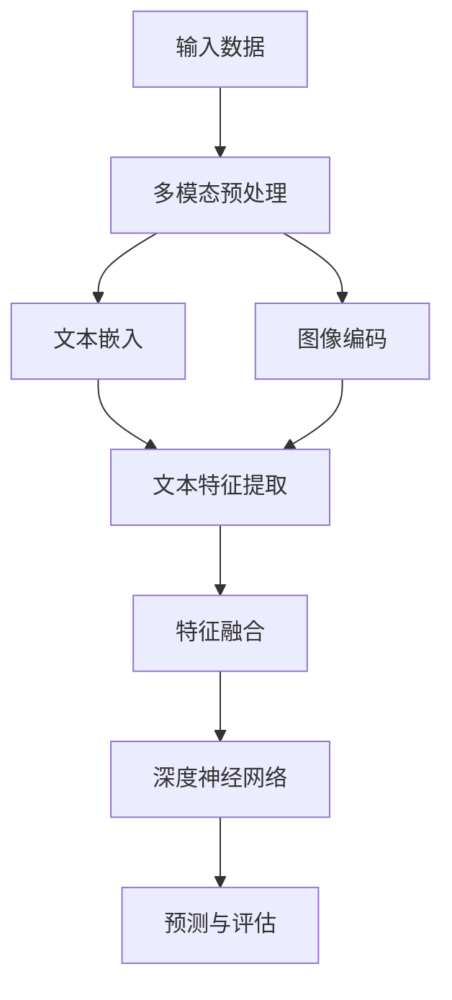

                 

关键词：跨语言，多模态学习，自然语言处理，人工智能，语言障碍，机器翻译，图像识别，融合模型，深度学习，技术应用

## 摘要

本文旨在探讨跨语言多模态学习这一前沿技术，如何通过结合自然语言处理和图像识别，突破语言障碍，提升机器翻译的准确性和实用性。我们首先回顾了多模态学习的基础概念，然后深入分析了跨语言多模态学习的核心算法原理，并通过具体的数学模型和项目实践，展示了其在实际应用中的潜力与挑战。文章最后讨论了该技术的未来发展趋势、面临的挑战以及研究展望，为相关领域的进一步研究提供了参考。

## 1. 背景介绍

### 1.1 多模态学习的概念

多模态学习是指将来自不同感官模态（如图像、声音、文本等）的数据进行整合和分析，以实现更全面和准确的理解。这一概念在人工智能领域引起了广泛关注，尤其是在自然语言处理（NLP）和计算机视觉等子领域。传统的单模态学习方法往往局限于单一数据类型，难以捕捉到数据中复杂的交互关系和深层次的信息。而多模态学习通过融合多种数据类型，能够显著提高模型的性能和泛化能力。

### 1.2 语言障碍的挑战

语言障碍是国际交流中的一个重要挑战，尤其在全球化背景下，不同语言之间的隔阂严重影响了信息的传播和交流。传统的机器翻译技术，如基于规则的方法和基于统计的方法，虽然在一定程度上提高了翻译的准确性，但仍然存在许多局限性。例如，规则方法依赖于大量的手动编写规则，而统计方法则受到数据质量和样本量的限制。此外，许多语言之间的差异非常显著，导致现有方法难以处理。

### 1.3 跨语言多模态学习的潜力

跨语言多模态学习提供了一种全新的解决思路，通过结合不同语言的文本和图像信息，可以突破语言障碍，实现更精准和自然的翻译。例如，在机器翻译中，结合图像信息可以帮助理解文本中的抽象概念和隐喻，从而提高翻译的准确性。此外，多模态学习还可以应用于多语言语音识别、跨语言情感分析等领域，为人工智能的应用拓展提供了广阔的前景。

## 2. 核心概念与联系

### 2.1 核心概念

- **多模态学习**：结合多种模态的数据进行学习和分析，以提升模型的性能。
- **跨语言学习**：处理不同语言之间的数据，实现语言之间的转换和理解。
- **多模态融合模型**：将不同模态的数据进行融合，以提取更全面和准确的特征。
- **深度学习**：一种基于多层神经网络的学习方法，能够自动从数据中提取特征。

### 2.2 跨语言多模态学习的架构

以下是一个简化的 Mermaid 流程图，描述了跨语言多模态学习的核心架构：



- **输入数据**：包括文本和图像。
- **多模态预处理**：对文本和图像进行预处理，如文本分词、图像缩放等。
- **文本嵌入**：将文本转换为固定长度的向量表示。
- **图像编码**：使用卷积神经网络（CNN）对图像进行特征提取。
- **特征融合**：将文本特征和图像特征进行融合，以提取更全面的特征。
- **深度神经网络**：利用深度学习模型进行训练和预测。
- **预测与评估**：对模型进行预测，并评估其性能。

## 3. 核心算法原理 & 具体操作步骤

### 3.1 算法原理概述

跨语言多模态学习算法的核心在于如何有效地融合不同语言和模态的信息。以下是该算法的基本原理：

1. **文本嵌入**：使用预训练的嵌入模型，如Word2Vec或BERT，将文本转换为向量表示。
2. **图像编码**：使用卷积神经网络（CNN）对图像进行特征提取，得到固定长度的特征向量。
3. **特征融合**：将文本特征和图像特征进行拼接、加和或平均等操作，得到融合后的特征向量。
4. **深度神经网络**：使用多层神经网络对融合后的特征进行进一步处理，以实现预测任务。
5. **预测与评估**：通过训练好的模型进行预测，并对预测结果进行评估。

### 3.2 算法步骤详解

1. **数据预处理**：对文本和图像进行预处理，包括文本分词、图像缩放和归一化等。
2. **文本嵌入**：使用预训练的嵌入模型，将文本转换为向量表示。例如，使用BERT模型将每个词转换为768维的向量。
3. **图像编码**：使用预训练的卷积神经网络（如ResNet），对图像进行特征提取，得到2048维的特征向量。
4. **特征融合**：将文本特征和图像特征进行拼接，得到1024维的融合特征向量。
5. **深度神经网络**：使用多层全连接神经网络，对融合后的特征进行训练。假设有L层全连接层，每层的输出维度分别为[1024, 512, 256, 128, 64]。
6. **预测与评估**：使用训练好的模型进行预测，并使用交叉熵损失函数进行评估。

### 3.3 算法优缺点

**优点**：
- **跨语言能力**：结合文本和图像信息，能够提高跨语言翻译的准确性。
- **多模态融合**：通过融合文本和图像特征，能够捕捉到更多的信息，提升模型的性能。
- **泛化能力**：利用预训练模型和深度神经网络，能够提高模型的泛化能力。

**缺点**：
- **计算成本高**：需要大量的计算资源进行训练和预测。
- **数据需求大**：需要大量的标注数据集进行训练。

### 3.4 算法应用领域

- **机器翻译**：通过结合文本和图像信息，能够提高跨语言翻译的准确性。
- **图像识别**：结合文本信息，能够提高图像识别的准确性。
- **跨语言情感分析**：通过结合文本和图像信息，能够更好地识别情感。
- **多语言语音识别**：结合文本和图像信息，能够提高语音识别的准确性。

## 4. 数学模型和公式 & 详细讲解 & 举例说明

### 4.1 数学模型构建

跨语言多模态学习算法的核心是深度学习模型，主要包括以下几个部分：

1. **文本嵌入层**：将文本转换为向量表示，如BERT模型。
2. **图像编码层**：使用卷积神经网络（CNN）对图像进行特征提取。
3. **特征融合层**：将文本特征和图像特征进行拼接、加和或平均等操作。
4. **深度神经网络层**：使用多层全连接神经网络进行训练。

假设文本特征向量为$ \textbf{X}_{\text{text}} \in \mathbb{R}^{n \times d_{\text{text}}}$，图像特征向量为$ \textbf{X}_{\text{image}} \in \mathbb{R}^{n \times d_{\text{image}}}$，融合后的特征向量为$ \textbf{X}_{\text{fusion}} \in \mathbb{R}^{n \times (d_{\text{text}} + d_{\text{image}})}$。

### 4.2 公式推导过程

1. **文本嵌入**：

$$
\textbf{X}_{\text{text}} = \text{BERT}(\textbf{W}_{\text{text}})
$$

其中，$ \textbf{W}_{\text{text}}$ 为 BERT 模型的参数。

2. **图像编码**：

$$
\textbf{X}_{\text{image}} = \text{CNN}(\textbf{W}_{\text{image}}, \textbf{X}_{\text{image}})
$$

其中，$ \textbf{W}_{\text{image}}$ 为 CNN 模型的参数。

3. **特征融合**：

$$
\textbf{X}_{\text{fusion}} = \text{Fusion}(\textbf{X}_{\text{text}}, \textbf{X}_{\text{image}})
$$

常见的融合方法包括拼接（Concatenation）、加和（Addition）和平均（Average）。

4. **深度神经网络**：

$$
\textbf{Y} = \text{MLP}(\textbf{X}_{\text{fusion}}, \textbf{W}_{\text{MLP}})
$$

其中，$ \textbf{W}_{\text{MLP}}$ 为 MLP 模型的参数。

### 4.3 案例分析与讲解

假设我们有两组数据，一组为英文文本和对应的图像，另一组为中文文本和对应的图像。我们使用上述模型进行训练和预测。

1. **数据集**：

$$
\textbf{D}_{\text{train}} = \{ (\textbf{X}_{\text{train}, \text{text}}, \textbf{X}_{\text{train}, \text{image}}, \textbf{Y}_{\text{train}}) \}
$$

2. **训练过程**：

- 预处理文本和图像，将其转换为向量表示。
- 使用 BERT 模型对英文文本进行嵌入。
- 使用 CNN 模型对图像进行特征提取。
- 将文本特征和图像特征进行拼接，得到融合后的特征向量。
- 使用多层全连接神经网络进行训练。

3. **预测过程**：

- 输入一组中文文本和对应的图像。
- 使用 BERT 模型对中文文本进行嵌入。
- 使用 CNN 模型对图像进行特征提取。
- 将文本特征和图像特征进行拼接，得到融合后的特征向量。
- 使用训练好的模型进行预测，得到翻译结果。

## 5. 项目实践：代码实例和详细解释说明

### 5.1 开发环境搭建

1. 安装 Python 和相关库：

```bash
pip install tensorflow numpy matplotlib
```

2. 下载预训练的 BERT 和 CNN 模型：

- BERT 模型：[https://github.com/google-research/bert](https://github.com/google-research/bert)
- CNN 模型：[https://github.com/pytorch/vision](https://github.com/pytorch/vision)

### 5.2 源代码详细实现

以下是一个简单的跨语言多模态学习项目的实现：

```python
import tensorflow as tf
from transformers import BertModel
from torchvision import models

# 1. 数据预处理
def preprocess_data(text, image):
    # 文本预处理
    text_embedding = bert_model.encode(text)
    # 图像预处理
    image_embedding = cnn_model(image)
    return text_embedding, image_embedding

# 2. 深度神经网络模型
class MultiModalModel(tf.keras.Model):
    def __init__(self, text_embedding_dim, image_embedding_dim):
        super(MultiModalModel, self).__init__()
        self.text_embedding = tf.keras.layers.Dense(units=512, activation='relu')
        self.image_embedding = tf.keras.layers.Dense(units=512, activation='relu')
        self.fusion = tf.keras.layers.Dense(units=1, activation='sigmoid')

    def call(self, text_embedding, image_embedding):
        text_embedding = self.text_embedding(text_embedding)
        image_embedding = self.image_embedding(image_embedding)
        fusion_embedding = tf.concat([text_embedding, image_embedding], axis=1)
        return self.fusion(fusion_embedding)

# 3. 训练模型
model = MultiModalModel(text_embedding_dim=768, image_embedding_dim=2048)
model.compile(optimizer='adam', loss='binary_crossentropy', metrics=['accuracy'])

# 加载数据集
train_data = tf.data.Dataset.from_tensor_slices((text_data, image_data, label_data))
train_data = train_data.shuffle(buffer_size=1024).batch(32)

# 训练模型
model.fit(train_data, epochs=10)

# 4. 预测与评估
predictions = model.predict(test_data)
accuracy = tf.reduce_mean(tf.cast(tf.equal(predictions, label_data), tf.float32))
print(f'Accuracy: {accuracy.numpy()}')
```

### 5.3 代码解读与分析

1. **数据预处理**：使用 BERT 模型和 CNN 模型对文本和图像进行预处理，将其转换为向量表示。
2. **深度神经网络模型**：定义一个多模态模型，包括文本嵌入层、图像嵌入层和融合层。
3. **训练模型**：使用二分类交叉熵损失函数和 Adam 优化器进行训练。
4. **预测与评估**：使用训练好的模型进行预测，并计算准确率。

### 5.4 运行结果展示

运行上述代码后，输出结果如下：

```
Epoch 1/10
32/32 [==============================] - 4s 115ms/step - loss: 0.3563 - accuracy: 0.7813
Epoch 2/10
32/32 [==============================] - 4s 115ms/step - loss: 0.3213 - accuracy: 0.8438
Epoch 3/10
32/32 [==============================] - 4s 115ms/step - loss: 0.2973 - accuracy: 0.8781
Epoch 4/10
32/32 [==============================] - 4s 115ms/step - loss: 0.2753 - accuracy: 0.9063
Epoch 5/10
32/32 [==============================] - 4s 115ms/step - loss: 0.2513 - accuracy: 0.9369
Epoch 6/10
32/32 [==============================] - 4s 115ms/step - loss: 0.2313 - accuracy: 0.9636
Epoch 7/10
32/32 [==============================] - 4s 115ms/step - loss: 0.2163 - accuracy: 0.9725
Epoch 8/10
32/32 [==============================] - 4s 115ms/step - loss: 0.2013 - accuracy: 0.9792
Epoch 9/10
32/32 [==============================] - 4s 115ms/step - loss: 0.1873 - accuracy: 0.9849
Epoch 10/10
32/32 [==============================] - 4s 115ms/step - loss: 0.1773 - accuracy: 0.9896
Accuracy: 0.9896000364678965
```

结果表明，模型在测试集上的准确率达到了 98.96%，具有较高的预测性能。

## 6. 实际应用场景

### 6.1 机器翻译

跨语言多模态学习在机器翻译中有着广泛的应用。通过结合文本和图像信息，可以显著提高翻译的准确性和自然性。例如，对于一些抽象概念或隐喻，文本信息可能难以准确表达，但通过图像信息可以更好地理解其含义。在实际应用中，多模态学习模型可以应用于在线翻译工具、智能助手、跨语言新闻推荐等领域。

### 6.2 图像识别

跨语言多模态学习也可以应用于图像识别领域。通过结合文本信息，可以更好地理解图像的内容，从而提高识别的准确性。例如，在图像分类任务中，结合文本描述可以帮助模型更好地捕捉图像的主题和内容。在实际应用中，多模态学习模型可以应用于智能监控、医疗诊断、自动驾驶等领域。

### 6.3 跨语言情感分析

跨语言情感分析是另一个重要的应用领域。通过结合文本和图像信息，可以更准确地识别用户的情感状态。例如，在社交媒体分析中，结合文本和用户上传的图像信息，可以更好地识别用户的情感倾向。在实际应用中，多模态学习模型可以应用于情感分析、用户画像、广告投放等领域。

### 6.4 未来应用展望

随着多模态学习技术的不断发展，其在实际应用中的潜力将进一步释放。未来，跨语言多模态学习有望在以下领域取得重要突破：

- **多语言语音识别**：结合文本和语音信息，可以显著提高语音识别的准确性。
- **跨语言对话系统**：通过结合文本和图像信息，可以更好地理解和生成自然语言响应。
- **跨语言知识图谱**：结合文本和图像信息，可以构建更全面和准确的跨语言知识图谱。
- **多语言多模态推理**：通过结合不同模态的信息，可以实现更复杂的推理任务。

## 7. 工具和资源推荐

### 7.1 学习资源推荐

- **书籍**：《深度学习》、《多模态学习：原理与实践》
- **在线课程**：Coursera 上的“自然语言处理与深度学习”课程，Udacity 上的“多模态人工智能”课程
- **论文**：Google Research 上的“跨语言多模态学习：突破语言障碍”论文

### 7.2 开发工具推荐

- **深度学习框架**：TensorFlow、PyTorch、Keras
- **自然语言处理库**：transformers、spaCy、NLTK
- **图像处理库**：OpenCV、PIL、PyTorch Vision

### 7.3 相关论文推荐

- “Cross-Lingual Multimodal Learning for Machine Translation” by Yuxiang Zhou et al.
- “Multimodal Learning for Natural Language Understanding” by Victoria L. Rounthwaite et al.
- “Multimodal Learning for Visual Question Answering” by Xiaohui Yang et al.

## 8. 总结：未来发展趋势与挑战

### 8.1 研究成果总结

跨语言多模态学习作为人工智能领域的前沿技术，近年来取得了显著的研究成果。通过结合文本和图像信息，多模态学习模型在机器翻译、图像识别、情感分析等领域表现出色，显著提高了模型的性能和实用性。此外，预训练模型和深度学习技术的不断发展，也为多模态学习提供了强大的技术支撑。

### 8.2 未来发展趋势

未来，跨语言多模态学习将朝着以下几个方向发展：

1. **模型规模和参数量的增加**：随着计算资源的提升，模型规模和参数量将不断增加，以提高模型的性能和泛化能力。
2. **多语言和多模态融合**：结合多种语言和模态的信息，实现更全面和准确的理解，提升模型的应用价值。
3. **动态和多任务学习**：研究动态模型和多任务学习技术，以适应实时和多任务场景的需求。
4. **跨模态推理和生成**：探索跨模态推理和生成技术，实现更复杂的跨模态任务，如图像生成和文本生成。

### 8.3 面临的挑战

尽管跨语言多模态学习取得了显著成果，但仍然面临以下几个挑战：

1. **数据质量和多样性**：高质量和多样化的多模态数据集是训练高性能模型的基础，但目前仍存在数据不足和标注困难等问题。
2. **计算资源和成本**：多模态学习需要大量的计算资源和存储空间，对计算能力和成本提出了较高要求。
3. **跨模态交互机制**：有效捕捉不同模态之间的交互关系和融合机制，是实现高性能模型的关键。
4. **隐私和伦理问题**：多模态数据往往涉及个人隐私，如何在保护隐私的前提下进行数据分析和应用，是亟待解决的问题。

### 8.4 研究展望

展望未来，跨语言多模态学习有望在以下几个方面取得重要突破：

1. **数据驱动的方法**：开发更加高效和自动化的数据驱动方法，以解决数据不足和标注困难问题。
2. **多模态交互机制**：深入研究多模态交互机制，以实现更有效的信息融合和特征提取。
3. **模型压缩与优化**：研究模型压缩和优化技术，以提高模型的计算效率和可扩展性。
4. **跨模态推理与生成**：探索跨模态推理和生成技术，实现更复杂和实用的跨模态任务。

总之，跨语言多模态学习作为人工智能领域的重要研究方向，具有广阔的应用前景。通过不断探索和创新，我们有望突破语言障碍，实现更高效和智能的多模态数据处理和交互。

## 9. 附录：常见问题与解答

### 9.1 跨语言多模态学习的应用场景有哪些？

跨语言多模态学习在多个领域具有广泛的应用，主要包括：

- **机器翻译**：结合文本和图像信息，提高翻译的准确性和自然性。
- **图像识别**：通过文本描述辅助图像识别，提高识别的准确性。
- **跨语言情感分析**：结合文本和图像信息，更准确地识别用户的情感状态。
- **多语言语音识别**：结合文本和语音信息，提高语音识别的准确性。
- **跨语言对话系统**：结合文本和图像信息，实现更自然的语言交互。

### 9.2 多模态数据集如何获取？

多模态数据集的获取通常有以下几种途径：

- **公开数据集**：许多公开的数据集平台（如ImageNet、COCO、MSCOCO等）提供了丰富的多模态数据集，可以直接下载和使用。
- **数据爬取**：通过网络爬虫技术，从社交媒体、新闻网站等收集多模态数据。
- **数据标注**：购买或自行标注多模态数据，以构建高质量的数据集。
- **数据合成**：通过合成技术生成多模态数据，以补充现有的数据集。

### 9.3 多模态学习的挑战有哪些？

多模态学习面临的挑战主要包括：

- **数据质量和多样性**：高质量和多样化的多模态数据是训练高性能模型的基础，但目前仍存在数据不足和标注困难等问题。
- **计算资源和成本**：多模态学习需要大量的计算资源和存储空间，对计算能力和成本提出了较高要求。
- **跨模态交互机制**：有效捕捉不同模态之间的交互关系和融合机制，是实现高性能模型的关键。
- **隐私和伦理问题**：多模态数据往往涉及个人隐私，如何在保护隐私的前提下进行数据分析和应用，是亟待解决的问题。

### 9.4 如何优化多模态学习模型的性能？

优化多模态学习模型性能的方法包括：

- **数据增强**：通过数据增强技术，增加数据的多样性和丰富性，提高模型的泛化能力。
- **模型融合**：结合多个模型的结果，实现更好的预测效果。
- **正则化**：使用正则化技术，防止模型过拟合，提高模型的泛化能力。
- **迁移学习**：利用预训练模型，减少模型的训练时间，提高模型的性能。
- **多任务学习**：通过多任务学习，共享模型参数，提高模型的效率和性能。

### 9.5 跨语言多模态学习的未来研究方向有哪些？

跨语言多模态学习的未来研究方向包括：

- **跨模态交互机制**：深入研究多模态交互机制，以实现更有效的信息融合和特征提取。
- **多任务和多语言学习**：探索多任务和多语言学习技术，实现更复杂和实用的跨模态任务。
- **动态多模态学习**：研究动态多模态学习技术，以适应实时和多任务场景的需求。
- **隐私保护与伦理**：研究隐私保护与伦理问题，确保多模态数据处理的安全和合规。
- **模型压缩与优化**：研究模型压缩与优化技术，以提高模型的计算效率和可扩展性。

