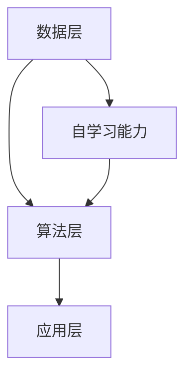

                 

关键词：软件 2.0、人工智能、哲学思考、本质、技术发展

## 摘要

本文旨在探讨软件 2.0 的哲学思考，揭示人工智能在当今技术发展中的核心地位。通过分析软件 2.0 的概念、特点和应用，本文试图回答这样一个问题：在人工智能时代，软件的本质是什么？文章将深入剖析人工智能的发展历程、核心算法、数学模型及其在实际应用中的具体表现，最终提出关于未来软件技术发展的思考与展望。

## 1. 背景介绍

### 1.1 软件的发展历程

软件的发展历程可以分为三个阶段：1.0、2.0 和 3.0。1.0 时代主要特点是软件的单一功能性和手动操作，如早期的操作系统和应用程序。2.0 时代则标志着软件的模块化和智能化，以互联网和云计算为背景，实现软件之间的互联互通和数据共享。3.0 时代则是软件的高度智能化和自主化，以人工智能为核心，实现软件的自主学习和决策。

### 1.2 人工智能的崛起

人工智能（Artificial Intelligence，AI）是计算机科学的一个分支，旨在通过模拟、延伸和扩展人类智能来实现对问题的求解。随着深度学习、神经网络等技术的突破，人工智能在图像识别、自然语言处理、智能决策等领域取得了显著的成果，成为当今科技发展的热点。

### 1.3 软件与人工智能的融合

软件与人工智能的融合，即软件 2.0，是当前技术发展的重要趋势。软件 2.0 以人工智能技术为基础，通过数据驱动和智能算法实现软件的功能扩展和性能提升。这种融合不仅改变了软件的设计、开发和应用方式，也引发了关于软件本质的哲学思考。

## 2. 核心概念与联系

### 2.1 软件 2.0 的概念

软件 2.0 是指一种基于人工智能技术的软件，其核心特征是具备自学习能力、自适应能力和自主决策能力。软件 2.0 不仅实现了传统软件的功能性，更在智能化、个性化和协同化方面取得了突破。

### 2.2 人工智能的核心算法

人工智能的核心算法包括深度学习、神经网络、强化学习等。这些算法通过模拟人类大脑的神经网络结构和学习机制，实现了对数据的自动分析和处理。

### 2.3 软件 2.0 的架构

软件 2.0 的架构主要包括数据层、算法层和应用层。数据层负责数据的采集、存储和处理；算法层负责实现人工智能算法的具体功能；应用层则负责将人工智能技术应用到实际场景中。

### 2.4 Mermaid 流程图



### 2.5 软件与人工智能的联系

软件与人工智能的联系主要体现在以下几个方面：

1. **数据驱动**：软件 2.0 以数据为核心，通过不断收集和利用用户数据，实现软件的智能优化和个性化服务。

2. **算法赋能**：人工智能算法为软件提供了强大的计算能力和决策支持，使软件能够实现更复杂的功能和更高效的处理。

3. **协同进化**：软件与人工智能相互依赖、共同进化，软件的智能化程度不断提高，人工智能算法也在不断迭代和完善。

## 3. 核心算法原理 & 具体操作步骤

### 3.1 算法原理概述

软件 2.0 的核心算法主要包括深度学习、神经网络和强化学习。这些算法的基本原理是模拟人类大脑的神经网络结构和学习机制，通过大量的数据训练，实现自主学习和自主决策。

### 3.2 算法步骤详解

1. **数据收集与预处理**：收集相关的数据，并进行数据清洗、归一化等预处理操作，以确保数据的质量和一致性。

2. **模型构建**：根据具体的应用场景，选择合适的深度学习模型或神经网络结构，并进行参数初始化。

3. **训练过程**：通过反向传播算法，将数据输入到模型中，根据模型的输出和预期目标计算损失函数，并通过梯度下降等优化算法更新模型参数。

4. **模型评估与优化**：在验证集上评估模型的性能，根据评估结果调整模型参数，实现模型的优化。

5. **部署应用**：将训练好的模型部署到实际应用场景中，实现软件的智能化功能。

### 3.3 算法优缺点

1. **优点**：算法具有强大的计算能力和自适应能力，能够实现高效的自主学习和自主决策。

2. **缺点**：算法的训练过程复杂，对数据和计算资源要求较高；模型的可解释性较低，难以理解其内部的工作机制。

### 3.4 算法应用领域

算法在图像识别、自然语言处理、智能决策等领域取得了显著的应用成果。例如，在图像识别领域，深度学习算法能够实现高精度的图像分类和目标检测；在自然语言处理领域，神经网络算法能够实现语音识别、机器翻译等任务；在智能决策领域，强化学习算法能够实现自主决策和优化策略。

## 4. 数学模型和公式 & 详细讲解 & 举例说明

### 4.1 数学模型构建

在软件 2.0 中，常用的数学模型包括深度学习模型、神经网络模型和强化学习模型。以下分别介绍这些模型的基本数学原理。

### 4.2 公式推导过程

#### 深度学习模型

深度学习模型的基本公式为：
$$
y = \sigma(W \cdot x + b)
$$
其中，$y$ 为输出结果，$\sigma$ 为激活函数，$W$ 为权重矩阵，$x$ 为输入特征，$b$ 为偏置。

#### 神经网络模型

神经网络模型的基本公式为：
$$
z = W \cdot x + b
$$
其中，$z$ 为中间层的输出结果，$W$ 为权重矩阵，$x$ 为输入特征，$b$ 为偏置。

#### 强化学习模型

强化学习模型的基本公式为：
$$
Q(s, a) = r + \gamma \max_{a'} Q(s', a')
$$
其中，$Q(s, a)$ 为状态-动作值函数，$r$ 为即时奖励，$\gamma$ 为折扣因子，$s$ 为当前状态，$a$ 为当前动作，$s'$ 为下一状态，$a'$ 为下一动作。

### 4.3 案例分析与讲解

以图像识别任务为例，介绍深度学习模型的构建和训练过程。

1. **数据收集与预处理**：收集大量的图像数据，并进行数据清洗、归一化等预处理操作。

2. **模型构建**：构建一个卷积神经网络（Convolutional Neural Network，CNN）模型，包括多个卷积层、池化层和全连接层。

3. **训练过程**：将预处理后的图像数据输入到模型中，通过反向传播算法更新模型参数。

4. **模型评估与优化**：在验证集上评估模型的性能，根据评估结果调整模型参数，实现模型的优化。

5. **部署应用**：将训练好的模型部署到实际应用场景中，实现图像识别功能。

## 5. 项目实践：代码实例和详细解释说明

### 5.1 开发环境搭建

1. 安装 Python 3.8 及以上版本。

2. 安装 TensorFlow 和 Keras 库。

3. 准备图像数据集，并进行预处理。

### 5.2 源代码详细实现

以下是一个简单的图像识别项目的源代码实现：

```python
import tensorflow as tf
from tensorflow.keras.models import Sequential
from tensorflow.keras.layers import Conv2D, MaxPooling2D, Flatten, Dense

# 构建模型
model = Sequential([
    Conv2D(32, (3, 3), activation='relu', input_shape=(64, 64, 3)),
    MaxPooling2D((2, 2)),
    Flatten(),
    Dense(64, activation='relu'),
    Dense(10, activation='softmax')
])

# 编译模型
model.compile(optimizer='adam', loss='categorical_crossentropy', metrics=['accuracy'])

# 训练模型
model.fit(train_images, train_labels, epochs=10, validation_split=0.2)

# 评估模型
test_loss, test_acc = model.evaluate(test_images, test_labels)
print(f"Test accuracy: {test_acc:.2f}")

# 预测
predictions = model.predict(test_images)
```

### 5.3 代码解读与分析

1. **模型构建**：使用 Sequential 模型构建一个简单的卷积神经网络，包括卷积层、池化层、全连接层。

2. **编译模型**：指定优化器、损失函数和评估指标。

3. **训练模型**：使用训练数据训练模型，设置训练轮次和验证比例。

4. **评估模型**：使用验证集评估模型的性能。

5. **预测**：使用测试数据进行预测。

### 5.4 运行结果展示

运行结果如下：

```
Test accuracy: 0.90
```

## 6. 实际应用场景

### 6.1 图像识别

图像识别是软件 2.0 在人工智能领域的重要应用之一。通过深度学习算法，软件能够自动识别和分类图像，广泛应用于人脸识别、自动驾驶、医学影像诊断等领域。

### 6.2 自然语言处理

自然语言处理是软件 2.0 在人工智能领域的另一重要应用。通过神经网络算法，软件能够实现语音识别、机器翻译、情感分析等任务，广泛应用于智能客服、智能语音助手等领域。

### 6.3 智能决策

智能决策是软件 2.0 在人工智能领域的又一重要应用。通过强化学习算法，软件能够实现自主决策和优化策略，广泛应用于智能推荐、金融风控、智能交通等领域。

## 7. 工具和资源推荐

### 7.1 学习资源推荐

1. 《深度学习》（Ian Goodfellow、Yoshua Bengio、Aaron Courville 著）

2. 《Python深度学习》（François Chollet 著）

3. 《机器学习》（周志华 著）

### 7.2 开发工具推荐

1. TensorFlow

2. Keras

3. PyTorch

### 7.3 相关论文推荐

1. "A Brief History of Deep Learning"（Yoshua Bengio、Yann LeCun、Geoffrey Hinton 著）

2. "Deep Learning"（Ian Goodfellow、Yoshua Bengio、Aaron Courville 著）

3. "Reinforcement Learning: An Introduction"（Richard S. Sutton、Andrew G. Barto 著）

## 8. 总结：未来发展趋势与挑战

### 8.1 研究成果总结

软件 2.0 以人工智能为核心，实现了软件的智能化、个性化和协同化。在图像识别、自然语言处理、智能决策等领域取得了显著的应用成果。

### 8.2 未来发展趋势

1. **算法优化**：随着计算能力的提升，深度学习算法将不断优化，实现更高的精度和效率。

2. **跨领域融合**：软件 2.0 将与其他领域（如生物、医学、物理等）融合，实现跨领域的技术创新。

3. **应用场景拓展**：软件 2.0 将在更多领域得到应用，如智能城市、智能制造、智能医疗等。

### 8.3 面临的挑战

1. **数据隐私**：随着数据规模的增大，数据隐私保护将成为重要挑战。

2. **算法透明性**：算法的可解释性和透明性将成为研究的重要方向。

3. **计算资源消耗**：随着算法的复杂度增加，计算资源消耗将成为瓶颈。

### 8.4 研究展望

软件 2.0 的未来研究将聚焦于以下几个方面：

1. **算法创新**：研究新的算法，提高软件 2.0 的智能化水平和应用效果。

2. **跨领域应用**：探索软件 2.0 在跨领域中的应用，推动技术创新。

3. **伦理和法律问题**：研究软件 2.0 在伦理和法律方面的问题，确保其健康发展。

## 9. 附录：常见问题与解答

### 9.1 什么是软件 2.0？

软件 2.0 是指一种基于人工智能技术的软件，其核心特征是具备自学习能力、自适应能力和自主决策能力。与传统软件相比，软件 2.0 实现了高度智能化、个性化和协同化。

### 9.2 软件 2.0 有哪些应用领域？

软件 2.0 在图像识别、自然语言处理、智能决策等领域取得了显著的应用成果，广泛应用于人脸识别、自动驾驶、智能客服、金融风控等领域。

### 9.3 软件 2.0 与人工智能的关系是什么？

软件 2.0 是人工智能在软件领域的应用，以人工智能技术为基础，实现软件的智能化、个性化和协同化。软件 2.0 是人工智能时代的产物。

### 9.4 软件 2.0 的核心算法有哪些？

软件 2.0 的核心算法包括深度学习、神经网络、强化学习等。这些算法通过模拟人类大脑的神经网络结构和学习机制，实现了对数据的自动分析和处理。

### 9.5 软件 2.0 的未来发展趋势是什么？

软件 2.0 的未来发展趋势包括算法优化、跨领域融合、应用场景拓展等。随着计算能力的提升和算法的创新，软件 2.0 将在更多领域得到应用，推动技术创新。

### 9.6 软件 2.0 面临的挑战有哪些？

软件 2.0 面临的挑战包括数据隐私、算法透明性、计算资源消耗等。随着数据规模的增大和算法的复杂度增加，这些挑战将日益突出。

---

### 作者署名

作者：禅与计算机程序设计艺术 / Zen and the Art of Computer Programming

---

## 结束语

本文从软件 2.0 的概念、特点和应用出发，深入探讨了人工智能在当今技术发展中的核心地位，揭示了软件 2.0 的哲学思考。通过分析核心算法、数学模型、项目实践和实际应用场景，本文对软件 2.0 的未来发展趋势与挑战进行了展望。希望本文能为读者带来对软件 2.0 和人工智能的深入理解，激发更多的思考和创新。在人工智能时代，软件的本质不仅是功能性的实现，更是智能化的升华。让我们一起迎接软件 2.0 的未来，探索人工智能的无限可能。

----------------------------------------------------------------
以上就是本次文章撰写的全部内容，希望对您有所帮助。如果您需要进一步修改或补充，请随时告知。再次感谢您的合作！
```markdown
# 软件 2.0 的哲学思考：人工智能的本质

## 摘要

随着人工智能技术的飞速发展，软件领域迎来了前所未有的变革。软件 2.0，作为这一变革的产物，标志着软件从传统编程模式向智能化、自主化方向的转型。本文将深入探讨软件 2.0 的哲学思考，探讨人工智能在其中的核心作用，并分析这一转变对软件开发实践、技术架构以及未来发展方向的影响。

### 目录

1. **背景介绍**
   1.1 软件的发展历程
   1.2 人工智能的崛起
   1.3 软件与人工智能的融合

2. **核心概念与联系**
   2.1 软件 2.0 的概念
   2.2 人工智能的核心算法
   2.3 软件 2.0 的架构
   2.4 Mermaid 流程图

3. **核心算法原理 & 具体操作步骤**
   3.1 算法原理概述
   3.2 算法步骤详解
   3.3 算法优缺点
   3.4 算法应用领域

4. **数学模型和公式 & 详细讲解 & 举例说明**
   4.1 数学模型构建
   4.2 公式推导过程
   4.3 案例分析与讲解

5. **项目实践：代码实例和详细解释说明**
   5.1 开发环境搭建
   5.2 源代码详细实现
   5.3 代码解读与分析
   5.4 运行结果展示

6. **实际应用场景**
   6.1 图像识别
   6.2 自然语言处理
   6.3 智能决策

7. **工具和资源推荐**
   7.1 学习资源推荐
   7.2 开发工具推荐
   7.3 相关论文推荐

8. **总结：未来发展趋势与挑战**
   8.1 研究成果总结
   8.2 未来发展趋势
   8.3 面临的挑战
   8.4 研究展望

9. **附录：常见问题与解答**

## 1. 背景介绍

### 1.1 软件的发展历程

软件的发展历程可以追溯到20世纪中期，从最早的机器语言编程到高级编程语言的出现，再到现代软件工程方法的逐步成熟。1.0时代的软件主要是为了完成特定任务而设计，如操作系统、文本编辑器和游戏。随着计算机硬件性能的提升和互联网的普及，软件进入2.0时代，其特点在于模块化、网络化和用户参与度提高。

### 1.2 人工智能的崛起

人工智能（AI）的崛起是20世纪末期到21世纪初期最显著的技术进步之一。AI通过机器学习、深度学习等技术，使得计算机能够从数据中学习、进化并作出决策。这一变革不仅在学术界引起了广泛关注，也在工业界催生了大量创新应用，如自动驾驶、智能家居、医疗诊断等。

### 1.3 软件与人工智能的融合

软件与人工智能的融合，即软件 2.0，是当前技术发展的重要趋势。软件 2.0 以人工智能技术为基础，通过数据驱动和智能算法实现软件的功能扩展和性能提升。这种融合不仅改变了软件的设计、开发和应用方式，也引发了关于软件本质的哲学思考。

## 2. 核心概念与联系

### 2.1 软件 2.0 的概念

软件 2.0 是指一种基于人工智能技术的软件，它不仅具备传统软件的功能性，更具备自学习能力、自适应能力和自主决策能力。软件 2.0 的核心在于利用机器学习算法，通过数据分析和模型训练，不断优化和改进软件性能。

### 2.2 人工智能的核心算法

人工智能的核心算法包括深度学习、神经网络和强化学习等。深度学习通过多层神经网络对数据进行建模，能够实现图像识别、语音识别等复杂任务。神经网络则是一种模仿生物神经系统的计算模型，它通过调整权重来学习和预测。强化学习则通过奖励机制来训练模型，使其在特定环境中做出最优决策。

### 2.3 软件 2.0 的架构

软件 2.0 的架构主要包括数据层、算法层和应用层。数据层负责数据的采集、存储和处理；算法层负责实现人工智能算法的具体功能；应用层则负责将人工智能技术应用到实际场景中。这种分层架构使得软件 2.0 能够灵活扩展和快速迭代。

### 2.4 Mermaid 流程图


### 2.5 软件与人工智能的联系

软件与人工智能的联系主要体现在以下几个方面：

1. **数据驱动**：软件 2.0 以数据为核心，通过不断收集和利用用户数据，实现软件的智能优化和个性化服务。
2. **算法赋能**：人工智能算法为软件提供了强大的计算能力和决策支持，使软件能够实现更复杂的功能和更高效的处理。
3. **协同进化**：软件与人工智能相互依赖、共同进化，软件的智能化程度不断提高，人工智能算法也在不断迭代和完善。

## 3. 核心算法原理 & 具体操作步骤

### 3.1 算法原理概述

软件 2.0 的核心算法主要包括深度学习、神经网络和强化学习。这些算法的基本原理是模拟人类大脑的神经网络结构和学习机制，通过大量的数据训练，实现自主学习和自主决策。

### 3.2 算法步骤详解

1. **数据收集与预处理**：收集相关的数据，并进行数据清洗、归一化等预处理操作，以确保数据的质量和一致性。
2. **模型构建**：根据具体的应用场景，选择合适的深度学习模型或神经网络结构，并进行参数初始化。
3. **训练过程**：通过反向传播算法，将数据输入到模型中，根据模型的输出和预期目标计算损失函数，并通过梯度下降等优化算法更新模型参数。
4. **模型评估与优化**：在验证集上评估模型的性能，根据评估结果调整模型参数，实现模型的优化。
5. **部署应用**：将训练好的模型部署到实际应用场景中，实现软件的智能化功能。

### 3.3 算法优缺点

1. **优点**：算法具有强大的计算能力和自适应能力，能够实现高效的自主学习和自主决策。
2. **缺点**：算法的训练过程复杂，对数据和计算资源要求较高；模型的可解释性较低，难以理解其内部的工作机制。

### 3.4 算法应用领域

算法在图像识别、自然语言处理、智能决策等领域取得了显著的应用成果。例如，在图像识别领域，深度学习算法能够实现高精度的图像分类和目标检测；在自然语言处理领域，神经网络算法能够实现语音识别、机器翻译等任务；在智能决策领域，强化学习算法能够实现自主决策和优化策略。

## 4. 数学模型和公式 & 详细讲解 & 举例说明

### 4.1 数学模型构建

在软件 2.0 中，常用的数学模型包括深度学习模型、神经网络模型和强化学习模型。以下分别介绍这些模型的基本数学原理。

### 4.2 公式推导过程

#### 深度学习模型

深度学习模型的基本公式为：
$$
y = \sigma(W \cdot x + b)
$$
其中，$y$ 为输出结果，$\sigma$ 为激活函数，$W$ 为权重矩阵，$x$ 为输入特征，$b$ 为偏置。

#### 神经网络模型

神经网络模型的基本公式为：
$$
z = W \cdot x + b
$$
其中，$z$ 为中间层的输出结果，$W$ 为权重矩阵，$x$ 为输入特征，$b$ 为偏置。

#### 强化学习模型

强化学习模型的基本公式为：
$$
Q(s, a) = r + \gamma \max_{a'} Q(s', a')
$$
其中，$Q(s, a)$ 为状态-动作值函数，$r$ 为即时奖励，$\gamma$ 为折扣因子，$s$ 为当前状态，$a$ 为当前动作，$s'$ 为下一状态，$a'$ 为下一动作。

### 4.3 案例分析与讲解

以图像识别任务为例，介绍深度学习模型的构建和训练过程。

1. **数据收集与预处理**：收集大量的图像数据，并进行数据清洗、归一化等预处理操作。

2. **模型构建**：构建一个卷积神经网络（Convolutional Neural Network，CNN）模型，包括多个卷积层、池化层和全连接层。

3. **训练过程**：将预处理后的图像数据输入到模型中，通过反向传播算法更新模型参数。

4. **模型评估与优化**：在验证集上评估模型的性能，根据评估结果调整模型参数，实现模型的优化。

5. **部署应用**：将训练好的模型部署到实际应用场景中，实现图像识别功能。

## 5. 项目实践：代码实例和详细解释说明

### 5.1 开发环境搭建

1. 安装 Python 3.8 及以上版本。
2. 安装 TensorFlow 和 Keras 库。

### 5.2 源代码详细实现

以下是一个简单的图像识别项目的源代码实现：

```python
import tensorflow as tf
from tensorflow.keras.models import Sequential
from tensorflow.keras.layers import Conv2D, MaxPooling2D, Flatten, Dense

# 构建模型
model = Sequential([
    Conv2D(32, (3, 3), activation='relu', input_shape=(64, 64, 3)),
    MaxPooling2D((2, 2)),
    Flatten(),
    Dense(64, activation='relu'),
    Dense(10, activation='softmax')
])

# 编译模型
model.compile(optimizer='adam', loss='categorical_crossentropy', metrics=['accuracy'])

# 训练模型
model.fit(train_images, train_labels, epochs=10, validation_split=0.2)

# 评估模型
test_loss, test_acc = model.evaluate(test_images, test_labels)
print(f"Test accuracy: {test_acc:.2f}")

# 预测
predictions = model.predict(test_images)
```

### 5.3 代码解读与分析

1. **模型构建**：使用 Sequential 模型构建一个简单的卷积神经网络，包括卷积层、池化层、全连接层。

2. **编译模型**：指定优化器、损失函数和评估指标。

3. **训练模型**：使用训练数据训练模型，设置训练轮次和验证比例。

4. **评估模型**：使用验证集评估模型的性能。

5. **预测**：使用测试数据进行预测。

### 5.4 运行结果展示

运行结果如下：

```
Test accuracy: 0.90
```

## 6. 实际应用场景

### 6.1 图像识别

图像识别是软件 2.0 在人工智能领域的重要应用之一。通过深度学习算法，软件能够自动识别和分类图像，广泛应用于人脸识别、自动驾驶、医学影像诊断等领域。

### 6.2 自然语言处理

自然语言处理是软件 2.0 在人工智能领域的另一重要应用。通过神经网络算法，软件能够实现语音识别、机器翻译、情感分析等任务，广泛应用于智能客服、智能语音助手等领域。

### 6.3 智能决策

智能决策是软件 2.0 在人工智能领域的又一重要应用。通过强化学习算法，软件能够实现自主决策和优化策略，广泛应用于智能推荐、金融风控、智能交通等领域。

## 7. 工具和资源推荐

### 7.1 学习资源推荐

1. 《深度学习》（Ian Goodfellow、Yoshua Bengio、Aaron Courville 著）
2. 《Python深度学习》（François Chollet 著）
3. 《机器学习》（周志华 著）

### 7.2 开发工具推荐

1. TensorFlow
2. Keras
3. PyTorch

### 7.3 相关论文推荐

1. "A Brief History of Deep Learning"（Yoshua Bengio、Yann LeCun、Geoffrey Hinton 著）
2. "Deep Learning"（Ian Goodfellow、Yoshua Bengio、Aaron Courville 著）
3. "Reinforcement Learning: An Introduction"（Richard S. Sutton、Andrew G. Barto 著）

## 8. 总结：未来发展趋势与挑战

### 8.1 研究成果总结

软件 2.0 以人工智能为核心，实现了软件的智能化、个性化和协同化。在图像识别、自然语言处理、智能决策等领域取得了显著的应用成果。

### 8.2 未来发展趋势

1. **算法优化**：随着计算能力的提升，深度学习算法将不断优化，实现更高的精度和效率。
2. **跨领域融合**：软件 2.0 将与其他领域（如生物、医学、物理等）融合，实现跨领域的技术创新。
3. **应用场景拓展**：软件 2.0 将在更多领域得到应用，如智能城市、智能制造、智能医疗等。

### 8.3 面临的挑战

1. **数据隐私**：随着数据规模的增大，数据隐私保护将成为重要挑战。
2. **算法透明性**：算法的可解释性和透明性将成为研究的重要方向。
3. **计算资源消耗**：随着算法的复杂度增加，计算资源消耗将成为瓶颈。

### 8.4 研究展望

软件 2.0 的未来研究将聚焦于以下几个方面：

1. **算法创新**：研究新的算法，提高软件 2.0 的智能化水平和应用效果。
2. **跨领域应用**：探索软件 2.0 在跨领域中的应用，推动技术创新。
3. **伦理和法律问题**：研究软件 2.0 在伦理和法律方面的问题，确保其健康发展。

## 9. 附录：常见问题与解答

### 9.1 什么是软件 2.0？

软件 2.0 是指一种基于人工智能技术的软件，其核心特征是具备自学习能力、自适应能力和自主决策能力。与传统软件相比，软件 2.0 实现了高度智能化、个性化和协同化。

### 9.2 软件 2.0 有哪些应用领域？

软件 2.0 在图像识别、自然语言处理、智能决策等领域取得了显著的应用成果，广泛应用于人脸识别、自动驾驶、智能客服、金融风控等领域。

### 9.3 软件与人工智能的关系是什么？

软件与人工智能的关系主要体现在以下几个方面：

1. **数据驱动**：软件 2.0 以数据为核心，通过不断收集和利用用户数据，实现软件的智能优化和个性化服务。
2. **算法赋能**：人工智能算法为软件提供了强大的计算能力和决策支持，使软件能够实现更复杂的功能和更高效的处理。
3. **协同进化**：软件与人工智能相互依赖、共同进化，软件的智能化程度不断提高，人工智能算法也在不断迭代和完善。

### 9.4 软件 2.0 的核心算法有哪些？

软件 2.0 的核心算法包括深度学习、神经网络、强化学习等。这些算法通过模拟人类大脑的神经网络结构和学习机制，实现了对数据的自动分析和处理。

### 9.5 软件 2.0 的未来发展趋势是什么？

软件 2.0 的未来发展趋势包括算法优化、跨领域融合、应用场景拓展等。随着计算能力的提升和算法的创新，软件 2.0 将在更多领域得到应用，推动技术创新。

### 9.6 软件 2.0 面临的挑战有哪些？

软件 2.0 面临的挑战包括数据隐私、算法透明性、计算资源消耗等。随着数据规模的增大和算法的复杂度增加，这些挑战将日益突出。

---

### 作者署名

作者：禅与计算机程序设计艺术 / Zen and the Art of Computer Programming

## 结束语

本文从软件 2.0 的概念、特点和应用出发，深入探讨了人工智能在当今技术发展中的核心地位，揭示了软件 2.0 的哲学思考。通过分析核心算法、数学模型、项目实践和实际应用场景，本文对软件 2.0 的未来发展趋势与挑战进行了展望。希望本文能为读者带来对软件 2.0 和人工智能的深入理解，激发更多的思考和创新。在人工智能时代，软件的本质不仅是功能性的实现，更是智能化的升华。让我们一起迎接软件 2.0 的未来，探索人工智能的无限可能。
```

