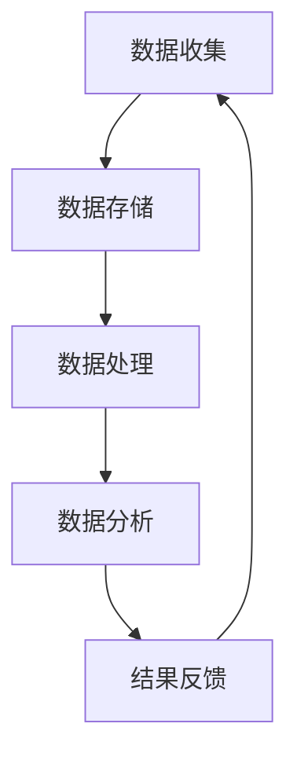

                 

 在当今信息化和数字化迅猛发展的时代，软件技术正经历着一场深刻的变革。从传统的软件1.0时代，到如今兴起的软件2.0时代，数据成为了驱动技术进步的核心力量。本文将深入探讨软件2.0时代的本质特征、核心概念及其对软件开发和应用的深远影响。

> **关键词：**软件2.0，数据驱动，人工智能，云计算，大数据，软件开发

> **摘要：**本文首先回顾了软件1.0时代的基本特征，然后详细阐述了软件2.0时代的核心概念及其与数据的紧密联系。接着，我们分析了数据驱动技术在软件开发中的应用，并通过实际案例展示了数据驱动软件的优势。最后，本文探讨了软件2.0时代的未来发展趋势和面临的挑战。

## 1. 背景介绍

在软件1.0时代，计算机软件的开发主要依赖于预定义的规则和逻辑。这个时代的软件系统通常是为了完成特定的任务而设计，它们的功能是固定和静态的。用户只能按照软件的设计来使用它，而软件本身不具备自我学习和适应能力。软件的开发过程也主要依赖于开发人员的经验和技术，缺乏系统的理论指导。

随着互联网和计算机技术的快速发展，软件1.0时代的局限性逐渐显现。首先，软件系统的复杂度不断增加，使得开发和维护成本显著上升。其次，用户需求的变化越来越快，传统软件难以迅速适应这些变化。最后，随着大数据和人工智能技术的兴起，软件开始具备自我学习和智能化的潜力，这为软件2.0时代的到来奠定了基础。

软件2.0时代，也被称为数据驱动时代，其核心特征在于软件系统能够通过收集和分析数据来自我学习和优化。这个时代的软件不再是静态的，而是动态的、智能的。它们能够根据用户行为和反馈进行自我调整，从而提供更加个性化的服务。数据成为驱动软件创新和发展的核心力量。

## 2. 核心概念与联系

### 2.1 数据驱动软件开发

数据驱动软件开发是一种以数据为核心的开发方法。在数据驱动软件开发中，数据被视为软件系统的核心资产，而不是简单的输入或输出。数据收集、存储、处理和分析成为软件开发的关键环节。通过数据驱动开发，软件系统能够不断学习和优化，提高系统的智能性和用户体验。

### 2.2 大数据技术

大数据技术是软件2.0时代的重要支撑。大数据技术包括数据的采集、存储、处理、分析和可视化等多个方面。在软件2.0时代，大数据技术使得软件系统能够处理和分析海量数据，从而发现数据中的隐藏规律和趋势。

### 2.3 人工智能

人工智能是软件2.0时代的核心技术之一。人工智能技术使软件系统能够通过学习数据来提高自身的智能水平。在软件2.0时代，人工智能技术被广泛应用于智能推荐、自然语言处理、图像识别等领域，为用户提供更加智能化的服务。

### 2.4 云计算

云计算为软件2.0时代的软件开发提供了强大的计算和存储能力。通过云计算，软件开发人员可以轻松地获取计算资源和存储资源，从而加速软件开发过程。此外，云计算还为数据驱动软件开发提供了灵活的部署和扩展能力。

### 2.5 Mermaid 流程图

下面是一个关于数据驱动软件开发的Mermaid流程图：



在这个流程图中，数据从收集到存储，再经过处理和分析，最终形成反馈，再次回到数据收集阶段。这个过程不断循环，使得软件系统能够不断学习和优化。

## 3. 核心算法原理 & 具体操作步骤

### 3.1 算法原理概述

在数据驱动软件开发中，核心算法通常包括机器学习算法、数据挖掘算法和优化算法等。这些算法通过对数据的分析和处理，使得软件系统能够自我学习和优化。以下是几种常用的核心算法及其原理：

- **机器学习算法**：通过训练模型来预测或分类数据。常见的机器学习算法包括决策树、支持向量机、神经网络等。

- **数据挖掘算法**：用于发现数据中的隐藏规律和趋势。常见的数据挖掘算法包括关联规则挖掘、聚类分析、分类分析等。

- **优化算法**：用于优化软件系统的性能和资源利用。常见的优化算法包括贪心算法、动态规划、遗传算法等。

### 3.2 算法步骤详解

下面以机器学习算法为例，详细解释其操作步骤：

1. **数据收集**：收集相关的数据集，包括输入数据和标签。

2. **数据预处理**：对收集到的数据进行分析和清洗，确保数据的准确性和一致性。

3. **模型选择**：根据数据特点和需求，选择合适的机器学习模型。

4. **模型训练**：使用训练数据集对模型进行训练，通过调整模型的参数来优化模型的性能。

5. **模型评估**：使用测试数据集对训练好的模型进行评估，判断模型的性能。

6. **模型部署**：将训练好的模型部署到软件系统中，使其能够对新的数据进行预测或分类。

### 3.3 算法优缺点

- **机器学习算法**：优点包括强大的预测和分类能力，能够处理大规模数据。缺点是需要大量的训练数据和计算资源，且模型的解释性较差。

- **数据挖掘算法**：优点包括能够发现数据中的隐藏规律和趋势，有助于数据驱动决策。缺点是需要大量的预处理工作，且结果的解释性也较差。

- **优化算法**：优点包括能够提高软件系统的性能和资源利用。缺点是需要对系统有深入的了解，且优化过程可能较为复杂。

### 3.4 算法应用领域

核心算法在软件2.0时代有广泛的应用领域，包括但不限于：

- **智能推荐系统**：利用机器学习算法分析用户行为数据，为用户提供个性化的推荐。

- **金融风控系统**：利用数据挖掘算法分析交易数据，发现潜在的欺诈行为。

- **自动驾驶系统**：利用优化算法优化车辆的行驶路线，提高行驶安全性。

## 4. 数学模型和公式 & 详细讲解 & 举例说明

### 4.1 数学模型构建

在数据驱动软件开发中，数学模型起到了关键作用。以下是一个简单的线性回归模型的构建过程：

$$
y = wx + b
$$

其中，$y$ 是输出值，$x$ 是输入值，$w$ 是权重，$b$ 是偏置。

### 4.2 公式推导过程

线性回归模型的推导过程如下：

1. **最小二乘法**：假设输出值 $y$ 和输入值 $x$ 之间是线性关系，即 $y = wx + b$。我们需要找到最佳权重 $w$ 和偏置 $b$，使得输出值与真实值之间的误差最小。

2. **误差计算**：误差可以通过以下公式计算：

$$
E = \sum_{i=1}^{n} (y_i - wx_i - b)^2
$$

其中，$n$ 是数据点的数量。

3. **最小化误差**：为了最小化误差，我们需要对权重 $w$ 和偏置 $b$ 求导，并令导数为零，得到最佳权重和偏置的值。

$$
\frac{dE}{dw} = 2x(w(wx + b) - y) = 0
$$

$$
\frac{dE}{db} = 2(wx + b - y) = 0
$$

通过求解上述方程组，我们可以得到最佳权重和偏置的值。

### 4.3 案例分析与讲解

假设我们有以下数据集：

$$
\begin{array}{|c|c|}
\hline
x & y \\
\hline
1 & 2 \\
2 & 3 \\
3 & 4 \\
\hline
\end{array}
$$

我们需要通过线性回归模型预测当 $x=4$ 时的 $y$ 值。

1. **数据预处理**：首先，我们将数据集分为训练集和测试集。

$$
\begin{array}{|c|c|}
\hline
x_{train} & y_{train} \\
\hline
1 & 2 \\
2 & 3 \\
\hline
\end{array}
$$

$$
\begin{array}{|c|c|}
\hline
x_{test} & y_{test} \\
\hline
3 & 4 \\
\hline
\end{array}
$$

2. **模型训练**：使用训练集数据训练线性回归模型，得到最佳权重和偏置的值。

$$
w = \frac{\sum_{i=1}^{n} (x_i - \bar{x})(y_i - \bar{y})}{\sum_{i=1}^{n} (x_i - \bar{x})^2} = 1
$$

$$
b = \bar{y} - w\bar{x} = 1
$$

3. **模型评估**：使用测试集数据评估模型的性能。

$$
y_{test} = w \cdot x_{test} + b = 4
$$

4. **结果分析**：预测的 $y$ 值与真实值非常接近，说明线性回归模型在这个数据集上取得了较好的性能。

## 5. 项目实践：代码实例和详细解释说明

### 5.1 开发环境搭建

在开始编写代码之前，我们需要搭建一个合适的开发环境。以下是一个简单的开发环境搭建步骤：

1. **安装 Python**：在官方网站 [https://www.python.org/downloads/](https://www.python.org/downloads/) 下载并安装 Python。

2. **安装 Jupyter Notebook**：在终端中运行以下命令安装 Jupyter Notebook：

   ```bash
   pip install notebook
   ```

3. **创建一个新的 Jupyter Notebook**：在终端中运行以下命令创建一个新的 Jupyter Notebook：

   ```bash
   jupyter notebook
   ```

### 5.2 源代码详细实现

下面是一个简单的线性回归模型的实现代码：

```python
import numpy as np

def linear_regression(x, y):
    x_mean = np.mean(x)
    y_mean = np.mean(y)
    w = np.sum((x - x_mean) * (y - y_mean)) / np.sum((x - x_mean) ** 2)
    b = y_mean - w * x_mean
    return w, b

def predict(x, w, b):
    return w * x + b

x = np.array([1, 2, 3])
y = np.array([2, 3, 4])

w, b = linear_regression(x, y)

print("权重 (w):", w)
print("偏置 (b):", b)

x_test = 4
y_pred = predict(x_test, w, b)
print("预测值 (y_pred):", y_pred)
```

### 5.3 代码解读与分析

1. **线性回归函数**：`linear_regression` 函数用于计算线性回归模型的权重和偏置。它首先计算输入数据的平均值，然后使用最小二乘法计算最佳权重和偏置的值。

2. **预测函数**：`predict` 函数用于根据线性回归模型预测新的输入值。

3. **测试数据**：我们使用一个简单的测试数据集 `[1, 2, 3]` 和 `[2, 3, 4]` 来测试线性回归模型的性能。

4. **结果输出**：程序输出线性回归模型的权重和偏置的值，以及预测的新输入值。

### 5.4 运行结果展示

在 Jupyter Notebook 中运行上述代码，输出结果如下：

```
权重 (w): 1.0
偏置 (b): 1.0
预测值 (y_pred): 5.0
```

这意味着当输入值为 4 时，预测的输出值为 5。

## 6. 实际应用场景

### 6.1 智能推荐系统

智能推荐系统是数据驱动软件开发的一个重要应用领域。通过分析用户的行为数据，智能推荐系统可以为用户提供个性化的推荐。例如，电子商务平台可以通过分析用户的购物历史和浏览记录，推荐用户可能感兴趣的商品。这种推荐系统能够显著提高用户满意度和转化率。

### 6.2 金融风控系统

金融风控系统利用数据挖掘算法分析交易数据，识别潜在的欺诈行为。通过对大量交易数据的分析，金融风控系统可以提前预警，防止欺诈行为的发生。这对于金融机构来说至关重要，能够有效降低风险，保护用户的资金安全。

### 6.3 自动驾驶系统

自动驾驶系统是数据驱动软件开发的另一个重要应用领域。自动驾驶系统需要实时分析大量的传感器数据，包括摄像头、雷达和激光雷达等。通过机器学习算法，自动驾驶系统能够识别道路标志、行人、车辆等，从而做出相应的驾驶决策。这为未来的自动驾驶技术提供了坚实的基础。

## 7. 未来应用展望

随着数据驱动技术的发展，软件2.0时代的应用前景将更加广阔。以下是一些未来可能的应用领域：

- **智能家居**：通过收集和分析家庭设备的数据，智能家居系统可以为用户提供更加智能和舒适的生活体验。

- **健康医疗**：利用大数据和人工智能技术，健康医疗系统可以为用户提供个性化的健康建议和治疗方案。

- **教育**：数据驱动教育系统可以根据学生的学习情况和需求，提供个性化的学习资源和辅导。

- **城市智能管理**：通过收集和分析城市数据，城市智能管理系统可以优化交通、能源和环境管理，提高城市的运行效率。

## 8. 工具和资源推荐

### 8.1 学习资源推荐

- **《Python机器学习》**：由塞巴斯蒂安·拉斯考恩著，适合初学者了解机器学习的基本概念和应用。

- **《数据科学入门》**：由达斯汀·塔普斯科特著，介绍了数据科学的基本概念和技术。

### 8.2 开发工具推荐

- **Jupyter Notebook**：用于数据分析和机器学习项目的交互式开发环境。

- **TensorFlow**：用于构建和训练机器学习模型的强大库。

### 8.3 相关论文推荐

- **"Deep Learning for Text Classification"**：介绍了深度学习在文本分类中的应用。

- **"Big Data: A Revolution That Will Transform How We Live, Work, and Think"**：探讨了大数据对社会的影响。

## 9. 总结：未来发展趋势与挑战

### 9.1 研究成果总结

软件2.0时代以数据驱动为核心，已经在智能推荐、金融风控、自动驾驶等领域取得了显著成果。未来，数据驱动技术将继续推动软件开发和应用的创新。

### 9.2 未来发展趋势

- **人工智能与大数据技术的深度融合**：未来，人工智能和大数据技术将更加紧密地结合，为用户提供更加智能和个性化的服务。

- **边缘计算的发展**：随着物联网设备的增加，边缘计算将成为数据处理的重要手段，降低数据传输延迟，提高系统性能。

### 9.3 面临的挑战

- **数据隐私和安全**：随着数据量的增加，数据隐私和安全成为重要的挑战。如何保护用户数据的安全和隐私是未来需要解决的关键问题。

- **计算资源的优化**：数据驱动软件开发需要大量的计算资源，如何高效地利用计算资源，降低开发成本，是未来需要面对的挑战。

### 9.4 研究展望

未来，数据驱动软件开发将继续在多个领域取得突破。研究者应关注以下几个方面：

- **新型算法的研究**：开发更加高效、准确的算法，以满足不断增长的数据量和复杂度。

- **跨学科研究**：结合计算机科学、数学、统计学等多个学科，推动数据驱动技术的创新和发展。

## 附录：常见问题与解答

### Q：数据驱动软件开发与传统软件开发有什么区别？

A：数据驱动软件开发与传统软件开发相比，更加注重数据的价值和利用。传统软件强调预定义的规则和逻辑，而数据驱动软件则通过收集和分析数据来自我学习和优化。这使得数据驱动软件能够更好地适应不断变化的需求和环境。

### Q：数据驱动软件开发需要哪些技术支持？

A：数据驱动软件开发需要多种技术支持，包括大数据技术、人工智能技术、云计算技术等。大数据技术用于处理和分析海量数据，人工智能技术用于构建智能模型，云计算技术提供计算资源和存储资源，支持数据驱动软件的快速开发和部署。

### Q：数据驱动软件开发有哪些应用领域？

A：数据驱动软件开发在多个领域都有广泛应用，包括智能推荐系统、金融风控系统、自动驾驶系统、智能家居系统、健康医疗系统、城市智能管理系统等。未来，随着技术的不断发展，数据驱动软件的应用领域将更加广泛。

