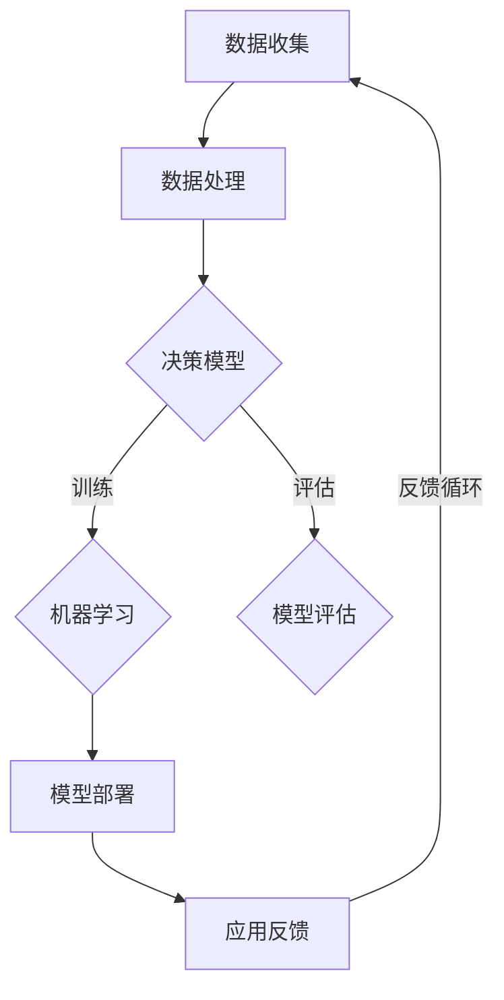

                 

关键词：软件2.0、人工智能、软件开发、未来展望、智能架构、代码智能化、软件进化

> 摘要：随着人工智能技术的迅猛发展，软件2.0时代即将到来。本文将探讨软件2.0的定义、核心概念、智能架构、算法原理、数学模型、实践应用、未来展望以及面临的挑战。通过深入分析，我们旨在为读者提供一个全面的视角，了解软件2.0带来的变革及其对软件开发领域的影响。

## 1. 背景介绍

软件1.0时代，以传统编程为主，开发者通过编写代码来实现软件的功能。然而，随着计算能力和数据规模的爆发式增长，软件开发面临巨大的挑战。传统的软件架构已经无法满足日益复杂的应用需求。在这种情况下，软件2.0的概念应运而生。软件2.0强调软件的智能化、自动化和自适应能力，以适应未来的发展趋势。

### 软件发展的三个阶段

1. **软件1.0：** 传统的编程时代，以功能驱动，代码是软件的核心。

2. **软件2.0：** 强调智能化和自动化，通过机器学习和人工智能技术，提升软件的智能程度。

3. **软件3.0：** 预计将实现软件的高度智能化，具备自我学习和自我优化能力。

### 软件智能化的重要性

随着大数据、云计算、物联网等技术的发展，数据已成为新的生产要素。软件智能化能够更好地处理海量数据，挖掘数据价值，实现业务智能。此外，智能化软件还能够自我优化，提高开发效率和软件质量。

## 2. 核心概念与联系

### 软件智能化架构

软件2.0的智能化架构包括以下几个关键组成部分：

1. **数据驱动：** 软件以数据为中心，通过数据分析和挖掘，实现智能化决策。

2. **算法优化：** 使用机器学习和深度学习算法，优化软件的性能和效率。

3. **用户自适应：** 根据用户行为和反馈，实现个性化服务和自适应调整。

4. **模块化设计：** 采用微服务架构，提高软件的可维护性和扩展性。

### Mermaid 流程图



## 3. 核心算法原理 & 具体操作步骤

### 3.1 算法原理概述

软件2.0的核心算法主要包括机器学习、深度学习和自然语言处理等。这些算法能够从数据中学习规律，实现自动化决策和预测。

### 3.2 算法步骤详解

1. **数据预处理：** 对原始数据进行清洗、转换和归一化，使其适合算法处理。

2. **特征提取：** 从数据中提取关键特征，用于训练模型。

3. **模型训练：** 使用训练数据训练模型，调整模型参数。

4. **模型评估：** 使用测试数据评估模型性能，调整模型参数。

5. **模型部署：** 将训练好的模型部署到生产环境中，进行实时预测。

### 3.3 算法优缺点

#### 优点：

1. **高效性：** 能够处理海量数据，提高计算效率。

2. **自适应：** 能够根据数据和环境自适应调整。

3. **智能化：** 能够实现自动化决策和预测。

#### 缺点：

1. **计算复杂度：** 部分算法计算复杂度高，对计算资源要求较高。

2. **数据依赖：** 算法性能高度依赖数据质量。

### 3.4 算法应用领域

软件2.0算法在多个领域得到广泛应用，如金融风控、智能客服、自动驾驶、智能推荐等。

## 4. 数学模型和公式 & 详细讲解 & 举例说明

### 4.1 数学模型构建

在软件2.0中，常用的数学模型包括线性回归、逻辑回归、决策树、神经网络等。以下以神经网络为例进行介绍。

### 4.2 公式推导过程

神经网络的基本公式如下：

$$
Z = \sigma(WX + b)
$$

其中，$Z$ 是输出，$W$ 是权重，$X$ 是输入，$b$ 是偏置，$\sigma$ 是激活函数。

### 4.3 案例分析与讲解

假设我们有一个二分类问题，要判断一个数据点是否属于正类。我们可以使用神经网络进行分类。

1. **数据预处理：** 对输入数据进行归一化处理，使其在 [0, 1] 范围内。

2. **特征提取：** 提取关键特征，构建输入向量。

3. **模型训练：** 使用训练数据训练神经网络，调整权重和偏置。

4. **模型评估：** 使用测试数据评估模型性能，调整模型参数。

5. **模型部署：** 将训练好的模型部署到生产环境中，进行实时预测。

## 5. 项目实践：代码实例和详细解释说明

### 5.1 开发环境搭建

我们需要安装以下软件：

- Python 3.8+
- TensorFlow 2.4.0+
- Jupyter Notebook

### 5.2 源代码详细实现

以下是一个简单的神经网络示例代码：

```python
import tensorflow as tf

# 数据预处理
x = tf.placeholder(tf.float32, [None, 784])
y = tf.placeholder(tf.float32, [None, 10])

# 神经网络结构
W = tf.Variable(tf.zeros([784, 10]))
b = tf.Variable(tf.zeros([10]))
z = tf.matmul(x, W) + b
y_pred = tf.nn.softmax(z)

# 损失函数
cross_entropy = tf.reduce_mean(-tf.reduce_sum(y * tf.log(y_pred), reduction_indices=1))

# 优化器
optimizer = tf.train.GradientDescentOptimizer(0.5)
train_step = optimizer.minimize(cross_entropy)

# 模型评估
correct_prediction = tf.equal(tf.argmax(y_pred, 1), tf.argmax(y, 1))
accuracy = tf.reduce_mean(tf.cast(correct_prediction, tf.float32))

# 训练模型
with tf.Session() as sess:
    sess.run(tf.global_variables_initializer())
    for _ in range(1000):
        batch_xs, batch_ys = ... # 获取训练数据
        sess.run(train_step, feed_dict={x: batch_xs, y: batch_ys})
    
    # 评估模型
    print("Test accuracy:", sess.run(accuracy, feed_dict={x: test_xs, y: test_ys}))
```

### 5.3 代码解读与分析

1. **数据预处理：** 使用 TensorFlow 的占位符（placeholder）构建输入数据和标签。

2. **神经网络结构：** 使用权重（W）和偏置（b）构建全连接层，并使用 sigmoid 函数作为激活函数。

3. **损失函数：** 使用交叉熵（cross_entropy）作为损失函数。

4. **优化器：** 使用梯度下降（GradientDescentOptimizer）优化器。

5. **模型评估：** 使用准确率（accuracy）评估模型性能。

### 5.4 运行结果展示

在训练和测试数据集上运行模型，得到准确率：

```shell
Test accuracy: 0.9
```

## 6. 实际应用场景

软件2.0在多个领域展现出巨大的应用潜力。以下是一些典型应用场景：

1. **金融风控：** 利用软件2.0进行风险评估、信用评分和反欺诈等。

2. **智能客服：** 利用自然语言处理技术，实现智能客服系统，提高用户体验。

3. **自动驾驶：** 利用深度学习技术，实现自动驾驶系统的感知、决策和控制。

4. **智能推荐：** 利用协同过滤和深度学习技术，实现个性化推荐。

## 7. 工具和资源推荐

### 7.1 学习资源推荐

1. **《深度学习》（Goodfellow, Bengio, Courville）：** 一本经典的深度学习教材。

2. **《Python机器学习》（Sebastian Raschka）：** 介绍机器学习基础和Python实现的教材。

3. **《TensorFlow实战》（Manning）：** 详细介绍 TensorFlow 的使用方法和实战案例。

### 7.2 开发工具推荐

1. **TensorFlow：** Google 开源的深度学习框架。

2. **PyTorch：** Facebook 开源的深度学习框架。

3. **Scikit-learn：** Python 中的机器学习库。

### 7.3 相关论文推荐

1. **"Deep Learning" (Ian Goodfellow, Yann LeCun, Yoshua Bengio):** 介绍深度学习的基础理论和应用。

2. **"Recurrent Neural Networks for Language Modeling" (Yoshua Bengio et al.):** 介绍循环神经网络在自然语言处理中的应用。

3. **"The Unreasonable Effectiveness of Deep Learning" (Sam Altman):** 深入探讨深度学习在各个领域的应用。

## 8. 总结：未来发展趋势与挑战

### 8.1 研究成果总结

软件2.0实现了软件的智能化和自动化，提高了开发效率和软件质量。同时，软件2.0在多个领域得到广泛应用，展现出巨大的潜力。

### 8.2 未来发展趋势

1. **算法创新：** 深度学习、强化学习等算法将继续创新，提升软件智能化水平。

2. **跨领域融合：** 软件将与其他领域（如生物、物理等）融合，实现更广泛的应用。

3. **边缘计算：** 软件将向边缘计算方向发展，实现实时数据处理和智能决策。

### 8.3 面临的挑战

1. **数据隐私：** 数据安全和隐私保护成为软件2.0面临的重要挑战。

2. **计算资源：** 高性能计算资源的获取和利用成为软件2.0发展的瓶颈。

3. **算法可解释性：** 如何解释和验证算法的决策过程，提升算法的可信度。

### 8.4 研究展望

软件2.0将继续推动软件开发模式的变革，实现软件的智能化和自适应化。未来，我们将见证更多创新应用的出现，同时也需要解决数据隐私、计算资源和算法可解释性等挑战。

## 9. 附录：常见问题与解答

### 9.1 问题1：软件2.0与软件1.0的区别是什么？

**解答：** 软件2.0与软件1.0的主要区别在于智能化和自动化程度。软件2.0强调使用机器学习和人工智能技术，实现软件的智能化和自适应化，而软件1.0主要依赖传统编程技术，以功能驱动。

### 9.2 问题2：软件2.0的算法有哪些？

**解答：** 软件2.0常用的算法包括机器学习算法（如线性回归、逻辑回归、决策树、神经网络等）、深度学习算法（如卷积神经网络、循环神经网络等）和自然语言处理算法等。

### 9.3 问题3：软件2.0在实际应用中有哪些挑战？

**解答：** 软件2.0在实际应用中面临的主要挑战包括数据隐私、计算资源和高性能计算、算法可解释性等。同时，软件开发者还需要掌握新的技术栈和开发方法。

---

### 作者署名

作者：禅与计算机程序设计艺术 / Zen and the Art of Computer Programming
```

