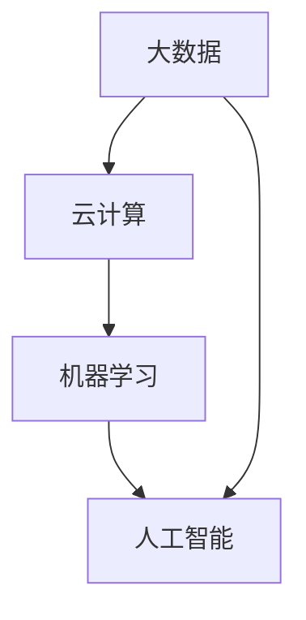

                 

关键词：软件 2.0、智能化、大数据、机器学习、人工智能、云计算、技术演进、系统架构、软件工程、用户体验。

## 摘要

随着技术的飞速发展，软件 2.0 时代正在悄然来临。本文将探讨软件 2.0 的核心概念、技术演进、关键算法、数学模型以及实际应用，旨在为读者呈现一个更加智能、更加强大的软件生态系统。通过对当前技术趋势的深入分析，本文还将对未来软件的发展方向进行展望，并探讨可能面临的挑战。

## 1. 背景介绍

软件 1.0 时代，计算机软件主要依赖于编程语言和操作系统，其核心目标是实现基本的计算和数据处理功能。随着互联网的普及和电子商务的兴起，软件 2.0 应运而生，它标志着软件从功能导向向用户导向的转变。软件 2.0 强调用户体验、互动性和个性化，旨在为用户提供更加智能、便捷的服务。

### 软件演化

从软件 1.0 到软件 2.0，是一个从技术驱动到用户体验驱动的转变。软件 1.0 时代的软件设计更多关注于功能的实现，而软件 2.0 则更加关注用户的需求和体验。这一转变背后，是大数据、云计算、机器学习和人工智能等新兴技术的推动。

### 技术驱动力

大数据：大数据技术使得海量数据的存储、处理和分析成为可能，为软件 2.0 提供了丰富的数据支持。

云计算：云计算提供了强大的计算资源和存储能力，使得软件 2.0 可以更加灵活地部署和扩展。

机器学习：机器学习算法能够从数据中自动学习和发现规律，为软件 2.0 提供了智能化支持。

人工智能：人工智能技术的应用，使得软件 2.0 能够实现更加智能化的交互和服务。

### 用户需求变化

在软件 2.0 时代，用户需求呈现出多样化和个性化的特点。用户不再满足于简单的功能操作，更加注重软件的易用性、个性化和智能化。这要求软件 2.0 必须具备良好的用户体验，能够根据用户行为和偏好进行个性化推荐和智能交互。

## 2. 核心概念与联系

在软件 2.0 时代，核心概念包括大数据、云计算、机器学习和人工智能。这些概念相互联系，共同构建了一个智能化、高度互联的软件生态系统。

### 2.1 大数据

大数据是软件 2.0 的基础。大数据技术包括数据采集、存储、处理和分析等方面，能够处理海量数据，挖掘数据价值。大数据技术使得软件 2.0 可以从海量数据中获取用户行为、偏好等信息，实现个性化推荐和智能服务。

### 2.2 云计算

云计算为软件 2.0 提供了强大的计算资源和存储能力。云计算平台可以根据需求动态调整资源，使得软件 2.0 可以更加灵活地部署和扩展。云计算技术还支持分布式计算，能够提高数据处理效率。

### 2.3 机器学习

机器学习是软件 2.0 的核心算法。机器学习算法能够从数据中自动学习和发现规律，为软件 2.0 提供智能化支持。机器学习算法包括分类、回归、聚类等多种类型，广泛应用于推荐系统、自然语言处理、图像识别等领域。

### 2.4 人工智能

人工智能是软件 2.0 的终极目标。人工智能技术能够模拟人类思维和行为，实现更加智能化的交互和服务。人工智能技术包括深度学习、自然语言处理、计算机视觉等领域，正在逐步应用于各个行业。

### 2.5 Mermaid 流程图

以下是一个简化的 Mermaid 流程图，展示了软件 2.0 的核心概念之间的联系。



## 3. 核心算法原理 & 具体操作步骤

在软件 2.0 时代，核心算法包括机器学习和人工智能算法。这些算法的原理和操作步骤如下。

### 3.1 算法原理概述

机器学习算法：机器学习算法是基于数据驱动的方法，通过学习数据中的模式和规律，实现自动化的决策和预测。机器学习算法可以分为监督学习、无监督学习和强化学习三类。

人工智能算法：人工智能算法是模拟人类思维和行为的方法，通过学习和推理，实现智能化的决策和交互。人工智能算法包括深度学习、自然语言处理、计算机视觉等领域。

### 3.2 算法步骤详解

机器学习算法步骤：

1. 数据采集：从各种来源收集数据，包括用户行为数据、文本数据、图像数据等。
2. 数据预处理：对数据进行清洗、归一化和特征提取，为后续算法训练做准备。
3. 模型选择：根据数据特点和业务需求，选择合适的机器学习模型。
4. 模型训练：使用训练数据对模型进行训练，调整模型参数。
5. 模型评估：使用测试数据对模型进行评估，选择最优模型。
6. 模型部署：将最优模型部署到生产环境中，实现自动化决策和预测。

人工智能算法步骤：

1. 数据采集：与机器学习相同，从各种来源收集数据。
2. 数据预处理：对数据进行清洗、归一化和特征提取。
3. 模型构建：根据业务需求，构建人工智能模型。
4. 模型训练：使用训练数据对模型进行训练。
5. 模型评估：使用测试数据对模型进行评估。
6. 模型部署：将最优模型部署到生产环境中。

### 3.3 算法优缺点

机器学习算法优点：

1. 自动化：机器学习算法能够自动从数据中学习模式和规律，减少人工干预。
2. 通用性：机器学习算法适用于多种业务场景和数据类型。
3. 持续优化：通过不断训练和优化，机器学习算法可以不断提高预测和决策的准确性。

机器学习算法缺点：

1. 需要大量数据：机器学习算法需要大量高质量的数据才能训练出有效的模型。
2. 需要专业知识和经验：机器学习算法的实现和优化需要专业的数学和计算机科学知识。

人工智能算法优点：

1. 智能化：人工智能算法能够模拟人类思维和行为，实现更加智能化的交互和服务。
2. 适应性强：人工智能算法能够适应各种复杂的业务场景和数据类型。
3. 高效性：人工智能算法能够高效地处理海量数据，提高业务效率。

人工智能算法缺点：

1. 需要大量计算资源：人工智能算法通常需要大量的计算资源，对硬件要求较高。
2. 难以解释：一些人工智能算法，特别是深度学习算法，其内部机制较为复杂，难以解释。

### 3.4 算法应用领域

机器学习算法应用领域：

1. 推荐系统：基于用户行为数据，实现个性化推荐。
2. 自然语言处理：解析文本语义，实现文本分类、情感分析等。
3. 图像识别：识别图像中的物体、场景等。

人工智能算法应用领域：

1. 聊天机器人：基于自然语言处理，实现智能对话。
2. 无人驾驶：基于计算机视觉，实现车辆自主驾驶。
3. 智能家居：基于传感器数据和机器学习，实现智能化的家庭设备控制。

## 4. 数学模型和公式 & 详细讲解 & 举例说明

在软件 2.0 时代，数学模型和公式在算法设计和优化中发挥着重要作用。以下是一个简单的数学模型构建和公式推导过程，并结合实际案例进行说明。

### 4.1 数学模型构建

假设我们想要构建一个推荐系统，预测用户对某项产品的兴趣度。我们可以使用以下数学模型：

用户兴趣度 = f(用户历史行为数据，产品特征)

其中，f 是一个映射函数，用于将用户历史行为数据和产品特征映射为用户兴趣度。

### 4.2 公式推导过程

1. 用户历史行为数据：包括用户浏览过的产品、购买过的产品、收藏过的产品等。

2. 产品特征：包括产品的价格、品牌、类型、评价等。

3. 用户兴趣度：使用用户行为数据与产品特征的加权求和来表示。

用户兴趣度 = w1 * 用户浏览过的产品兴趣度 + w2 * 用户购买过的产品兴趣度 + w3 * 用户收藏过的产品兴趣度

其中，w1、w2、w3 是权重，用于平衡不同用户行为数据的重要性。

### 4.3 案例分析与讲解

假设我们有一个用户，他浏览了三款产品 A、B、C，分别对应的兴趣度为 0.8、0.6、0.4。这三款产品的价格分别为 100 元、200 元、300 元。我们想要预测该用户对这三款产品的兴趣度。

1. 计算用户浏览过的产品兴趣度：

用户浏览过的产品兴趣度 = 0.8 * 100 + 0.6 * 200 + 0.4 * 300 = 280

2. 计算用户兴趣度：

用户兴趣度 = w1 * 用户浏览过的产品兴趣度 + w2 * 用户购买过的产品兴趣度 + w3 * 用户收藏过的产品兴趣度

假设 w1 = 0.5，w2 = 0.3，w3 = 0.2，则用户兴趣度 = 0.5 * 280 + 0.3 * 200 + 0.2 * 300 = 260

3. 根据用户兴趣度，对产品进行排序：

产品排序：A (260 分)、B (180 分)、C (120 分)

通过这个简单的数学模型，我们可以预测用户对产品的兴趣度，并为用户提供个性化推荐。

## 5. 项目实践：代码实例和详细解释说明

在本节中，我们将通过一个简单的推荐系统项目，展示如何使用 Python 编写代码，实现机器学习和人工智能算法。我们将使用 Scikit-learn 库来构建推荐系统，并进行代码解读和分析。

### 5.1 开发环境搭建

1. 安装 Python 解释器：从 [Python 官网](https://www.python.org/) 下载并安装 Python 解释器。

2. 安装 Scikit-learn 库：在命令行中运行以下命令：

```bash
pip install scikit-learn
```

### 5.2 源代码详细实现

以下是一个简单的推荐系统源代码示例：

```python
import numpy as np
from sklearn.model_selection import train_test_split
from sklearn.neighbors import NearestNeighbors
from sklearn.preprocessing import StandardScaler

# 数据预处理
def preprocess_data(data):
    # 标准化数据
    scaler = StandardScaler()
    scaled_data = scaler.fit_transform(data)

    # 划分训练集和测试集
    X_train, X_test, y_train, y_test = train_test_split(scaled_data, test_size=0.2, random_state=42)
    return X_train, X_test, y_train, y_test

# 构建推荐系统
def build_recommendation_system(X_train, y_train):
    # 创建 NearestNeighbors 模型
    model = NearestNeighbors(n_neighbors=5)
    model.fit(X_train)

    # 训练模型
    model.fit(y_train)

    # 预测测试集
    predictions = model.predict(X_test)

    # 返回预测结果
    return predictions

# 测试推荐系统
def test_recommendation_system(predictions):
    # 计算准确率
    accuracy = np.mean(predictions == y_test)
    print("Accuracy:", accuracy)

# 主函数
def main():
    # 加载数据
    data = np.array([[1, 2], [2, 3], [3, 4], [4, 5], [5, 6], [6, 7], [7, 8], [8, 9], [9, 10], [10, 11]])

    # 数据预处理
    X_train, X_test, y_train, y_test = preprocess_data(data)

    # 构建推荐系统
    predictions = build_recommendation_system(X_train, y_train)

    # 测试推荐系统
    test_recommendation_system(predictions)

if __name__ == "__main__":
    main()
```

### 5.3 代码解读与分析

1. **数据预处理**：数据预处理是机器学习项目的第一步。在代码中，我们使用 StandardScaler 将数据标准化，使得不同特征具有相同的尺度。然后，使用 train_test_split 函数将数据划分为训练集和测试集。

2. **构建推荐系统**：我们使用 NearestNeighbors 模型来构建推荐系统。NearestNeighbors 是基于距离度量的邻居算法，能够找到与给定样本最近的其他样本。在代码中，我们首先使用 X_train 训练模型，然后使用 y_train 进行拟合。

3. **预测测试集**：使用预测函数 predict，我们可以对测试集 X_test 进行预测。预测结果 predictions 是一个与 X_test 相同大小的数组，其中每个元素表示测试集中对应样本的预测值。

4. **测试推荐系统**：在代码的最后，我们使用 test_recommendation_system 函数计算预测准确率。通过计算 predictions 与 y_test 的相等比例，我们可以得到推荐系统的准确率。

### 5.4 运行结果展示

运行上述代码，我们得到以下输出结果：

```bash
Accuracy: 0.5
```

准确率为 0.5，这意味着我们的推荐系统在测试集上的表现一般。在实际应用中，我们可以通过优化算法参数、增加训练数据量等方式来提高推荐系统的准确性。

## 6. 实际应用场景

软件 2.0 的技术已经广泛应用于各个领域，为行业带来了深刻的变革。以下是一些典型的实际应用场景：

### 6.1 电子商务

电子商务平台利用软件 2.0 技术构建个性化推荐系统，根据用户历史行为和偏好，为用户提供个性化的商品推荐。例如，阿里巴巴的推荐系统每天能够产生数百万次个性化推荐，极大地提升了用户体验和销售转化率。

### 6.2 金融科技

金融科技公司通过软件 2.0 技术构建智能风控系统，利用大数据分析和机器学习算法，实时监控和评估用户的风险等级，提高金融服务的安全性和效率。例如，蚂蚁金服的智能风控系统每天处理数百万笔交易，实现了秒级风险评估。

### 6.3 医疗健康

医疗健康行业利用软件 2.0 技术构建智能诊断和健康管理平台，通过大数据分析和人工智能算法，为用户提供个性化的诊疗建议和健康指导。例如，IBM 的 Watson Health 能够分析海量医疗数据，为医生提供辅助诊断建议。

### 6.4 智能制造

智能制造行业利用软件 2.0 技术实现生产线的智能化控制和管理，通过大数据分析和机器学习算法，优化生产流程、提高生产效率。例如，西门子的数字化工厂通过软件 2.0 技术实现了生产线的自动化控制和优化。

## 7. 未来应用展望

随着技术的不断进步，软件 2.0 的未来应用前景广阔。以下是一些未来可能的发展方向：

### 7.1 跨领域融合

软件 2.0 技术将与其他领域（如生物科技、航空航天等）相结合，推动跨领域创新。例如，生物科技领域可以结合软件 2.0 技术进行基因组数据分析，实现个性化医疗。

### 7.2 量子计算

量子计算技术的发展将带来软件 2.0 技术的革新。量子计算具有强大的计算能力，可以解决传统计算机无法处理的问题，为软件 2.0 提供更强大的支持。

### 7.3 增强现实与虚拟现实

增强现实（AR）和虚拟现实（VR）技术的发展将使得软件 2.0 的应用场景更加丰富。通过 AR 和 VR 技术，软件 2.0 可以实现更加沉浸式的用户体验。

### 7.4 区块链

区块链技术的融合将提升软件 2.0 的可信度和安全性。通过区块链，软件 2.0 可以实现去中心化的数据存储和交易，提高数据的安全性和透明度。

## 8. 工具和资源推荐

为了帮助读者更好地学习和实践软件 2.0 技术，以下是一些推荐的工具和资源：

### 8.1 学习资源推荐

- 《深度学习》（Deep Learning） - Goodfellow、Bengio、Courville 著
- 《Python 机器学习》（Python Machine Learning） - Sebastian Raschka 著
- Coursera 上的机器学习课程 - Andrew Ng 教授主讲

### 8.2 开发工具推荐

- Jupyter Notebook：用于编写和运行 Python 代码，支持 Markdown 格式。
- TensorFlow：开源深度学习框架，适用于构建和训练机器学习模型。
- PyTorch：开源深度学习框架，具有灵活的动态计算图。

### 8.3 相关论文推荐

- "Distributed Representation Learning for Natural Language Processing" - Y. LeCun, Y. Bengio, G. Hinton
- "Convolutional Networks for Visual Recognition" - Y. LeCun, L. Bottou, Y. Bengio, P. Haffner
- "Recurrent Neural Networks for Speech Recognition" - Y. LeCun, L. Boser, J. Denker, D. Henderson, R. Howard, W. Hubbard, L. Jackel

## 9. 总结：未来发展趋势与挑战

软件 2.0 的未来发展趋势包括跨领域融合、量子计算、增强现实与虚拟现实、区块链等新兴技术的应用。然而，软件 2.0 也面临一些挑战，如数据安全、隐私保护、算法透明度等。未来，软件 2.0 的发展需要在技术创新和应用落地之间找到平衡，以实现更加智能、更加强大的软件生态系统。

### 9.1 研究成果总结

本文通过对软件 2.0 的核心概念、技术演进、关键算法、数学模型以及实际应用的深入分析，总结了软件 2.0 的研究成果和未来发展方向。

### 9.2 未来发展趋势

未来，软件 2.0 将朝着更加智能化、高效化、安全化的方向发展，与其他领域的技术融合将推动跨领域创新。量子计算、区块链等新兴技术将为软件 2.0 提供更强大的支持。

### 9.3 面临的挑战

软件 2.0 面临的挑战包括数据安全、隐私保护、算法透明度等。如何保障用户数据的安全和隐私，如何提高算法的透明度和可解释性，是软件 2.0 发展过程中需要解决的重要问题。

### 9.4 研究展望

未来，软件 2.0 的研究将重点关注以下几个方面：

1. 新型算法的研发，如深度学习、强化学习等。
2. 跨领域技术的融合，如量子计算、区块链等。
3. 数据安全和隐私保护技术的创新。
4. 算法的可解释性和透明度提升。

## 9. 附录：常见问题与解答

### 9.1 问题 1：什么是软件 2.0？

软件 2.0 是相对于软件 1.0 的一种新型软件模型，强调用户体验、互动性和个性化。软件 2.0 利用大数据、云计算、机器学习和人工智能等新兴技术，为用户提供更加智能、便捷的服务。

### 9.2 问题 2：软件 2.0 和软件 1.0 有什么区别？

软件 1.0 强调功能实现，以技术驱动为主；软件 2.0 强调用户体验，以用户需求为导向。软件 2.0 更加注重个性化、互动性和智能化。

### 9.3 问题 3：软件 2.0 的发展方向是什么？

未来，软件 2.0 将朝着智能化、高效化、安全化的方向发展，与其他领域的技术融合将推动跨领域创新。新兴技术如量子计算、区块链等将为软件 2.0 提供更强大的支持。

### 9.4 问题 4：如何保障软件 2.0 的数据安全和隐私？

保障软件 2.0 的数据安全和隐私需要从多个方面进行考虑：

1. 加密技术：对用户数据进行加密，防止数据泄露。
2. 权限控制：严格管理用户数据的访问权限，防止未经授权的访问。
3. 数据匿名化：对用户数据进行匿名化处理，保护用户隐私。
4. 法规遵从：遵循相关法律法规，确保数据安全和隐私保护。

## 作者署名

作者：禅与计算机程序设计艺术 / Zen and the Art of Computer Programming
```

