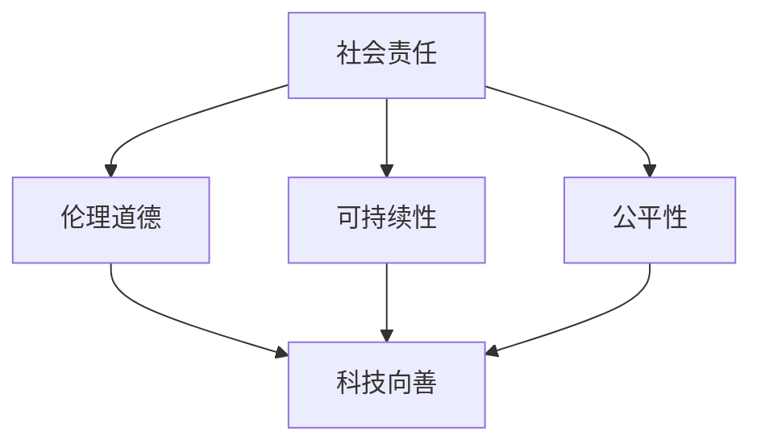

                 

关键词：软件 2.0，社会责任，科技向善，伦理，人工智能，可持续发展

> 摘要：随着科技的飞速发展，软件 2.0 时代已经到来。在这一时代中，软件不再仅仅是工具，而是成为影响社会各个方面的关键因素。本文将探讨软件 2.0 的社会责任，强调科技向善的重要性，并提出一些建议，以期促进科技与社会的和谐发展。

## 1. 背景介绍

### 1.1 软件的发展历程

软件技术的发展历程可以分为几个阶段：从最初的软件 1.0，即简单的程序编写，到软件 2.0，这一阶段软件开始具有更高的复杂性和互联性。软件 2.0 的一个显著特点是它不仅仅是工具，更是一种平台，一个生态系统。

### 1.2 社会责任的重要性

随着软件 2.0 的发展，软件对社会的影响越来越显著。这不仅体现在经济层面，还体现在社会、伦理和环境等多个方面。因此，软件的社会责任成为了一个不可忽视的话题。

### 1.3 科技向善的提出

在探讨软件的社会责任时，我们不得不提到科技向善这一概念。科技向善强调科技发展的同时，要关注其对人类和社会的积极影响，避免科技带来的负面影响。

## 2. 核心概念与联系

### 2.1 社会责任的概念

社会责任是指企业在经营过程中，为了实现可持续发展和长期成功，而采取的对社会和环境负责的行为。对于软件行业来说，社会责任包括但不限于以下几个方面：

- **伦理道德**：软件开发过程中要遵循伦理道德标准，确保软件不会对用户或社会造成负面影响。
- **可持续性**：软件的开发和运营要考虑到其对环境的影响，追求可持续发展。
- **公平性**：软件要为所有人提供公平的机会，避免歧视和排斥。

### 2.2 科技向善的概念

科技向善是指科技发展过程中，以人类和社会的福祉为核心，追求技术进步的同时，减少对人类和社会的负面影响。具体包括以下几个方面：

- **以人为本**：科技发展要以满足人类需求为核心，关注人的尊严和价值。
- **公平公正**：科技发展要促进社会的公平和公正，避免科技带来的贫富差距。
- **环境友好**：科技发展要考虑到对环境的影响，追求环保和可持续发展。

### 2.3 Mermaid 流程图

以下是一个简化的 Mermaid 流程图，展示了社会责任与科技向善之间的联系：



## 3. 核心算法原理 & 具体操作步骤

### 3.1 算法原理概述

在软件 2.0 时代，人工智能（AI）技术发挥了重要作用。为了实现科技向善，我们需要关注 AI 技术在伦理和可持续发展方面的应用。具体来说，我们可以采用以下算法原理：

- **伦理决策算法**：通过机器学习等技术，构建一个能够在开发过程中遵循伦理标准的算法模型。
- **可持续发展评估算法**：结合环境经济学等方法，评估软件产品和服务的环境影响，并提出改进措施。
- **公平性分析算法**：利用数据挖掘和统计分析等方法，分析软件在不同群体中的使用情况，识别并解决潜在的不公平问题。

### 3.2 算法步骤详解

#### 3.2.1 伦理决策算法

1. 数据收集：收集软件开发过程中的相关数据，包括代码、文档、用户反馈等。
2. 数据预处理：清洗和整合数据，为后续分析做准备。
3. 特征提取：从数据中提取与伦理相关的特征，如隐私保护、数据安全等。
4. 模型训练：利用机器学习算法，训练一个能够识别和评估伦理风险的模型。
5. 模型应用：在软件开发过程中，应用训练好的模型，评估潜在的风险，并提出改进建议。

#### 3.2.2 可持续发展评估算法

1. 环境影响评估：收集软件运行过程中产生的各种环境影响数据，如能源消耗、碳排放等。
2. 经济评估：评估软件的经济效益，包括成本、收益等。
3. 社会评估：评估软件对社会的影响，如就业、教育等。
4. 综合评估：结合环境、经济和社会三个方面的评估结果，综合评估软件的可持续发展能力。
5. 改进建议：根据评估结果，提出改进软件产品和服务的方法，以实现可持续发展。

#### 3.2.3 公平性分析算法

1. 数据收集：收集软件在不同群体中的使用数据，如年龄、性别、地域等。
2. 数据预处理：清洗和整合数据，为后续分析做准备。
3. 特征提取：从数据中提取与公平性相关的特征，如使用频率、满意度等。
4. 统计分析：利用统计分析方法，分析不同群体之间的差异，识别潜在的公平性问题。
5. 改进措施：根据分析结果，提出改进软件设计、优化用户体验等措施，以提高公平性。

### 3.3 算法优缺点

#### 3.3.1 伦理决策算法

**优点**：有助于在软件开发过程中遵循伦理标准，减少潜在的风险。

**缺点**：依赖于数据的准确性和模型的性能，可能存在局限性。

#### 3.3.2 可持续发展评估算法

**优点**：有助于评估软件的可持续发展能力，为决策提供科学依据。

**缺点**：评估结果受数据质量和评估方法的限制，可能存在不确定性。

#### 3.3.3 公平性分析算法

**优点**：有助于识别和解决软件中的不公平问题，提高用户体验。

**缺点**：分析结果的准确性受数据质量和分析方法的影响。

### 3.4 算法应用领域

这些算法可以应用于多个领域，如医疗保健、金融科技、教育等。以下是一些具体的例子：

- **医疗保健**：利用伦理决策算法，确保医疗软件的隐私保护和数据安全。
- **金融科技**：利用可持续发展评估算法，评估金融产品的环境影响，促进绿色金融。
- **教育**：利用公平性分析算法，优化教育资源分配，提高教育公平性。

## 4. 数学模型和公式 & 详细讲解 & 举例说明

### 4.1 数学模型构建

为了实现科技向善，我们需要构建一系列数学模型来评估软件的社会责任。以下是一个简化的数学模型示例：

\[ \text{社会责任得分} = f(\text{伦理得分}, \text{可持续性得分}, \text{公平性得分}) \]

其中，每个得分都由相应的数学模型计算得出。

### 4.2 公式推导过程

假设我们有以下三个基本公式来计算伦理得分、可持续性得分和公平性得分：

\[ \text{伦理得分} = \frac{\text{符合伦理标准的次数}}{\text{总次数}} \]

\[ \text{可持续性得分} = \frac{\text{可持续性贡献}}{\text{总贡献}} \]

\[ \text{公平性得分} = \frac{\text{公平性指标}}{\text{总指标}} \]

其中，每个得分都根据具体情况进行调整。

### 4.3 案例分析与讲解

假设我们有一个在线教育平台，需要评估其社会责任得分。我们可以按照以下步骤进行：

1. **伦理得分**：根据平台的使用情况，计算符合伦理标准的次数和总次数。例如，平台在隐私保护和数据安全方面采取了严格的措施，我们可以将其作为符合伦理标准的指标。
2. **可持续性得分**：评估平台在能源消耗、碳排放等方面的可持续性贡献。例如，平台采用了绿色能源和节能减排技术，我们可以将其作为可持续性贡献的指标。
3. **公平性得分**：分析平台在不同群体中的使用情况，如年龄、性别、地域等。例如，平台在优化教育资源分配方面取得了显著成效，我们可以将其作为公平性指标的依据。

根据上述步骤，我们可以得到该在线教育平台的社会责任得分。具体得分取决于具体的数据和分析方法。

## 5. 项目实践：代码实例和详细解释说明

### 5.1 开发环境搭建

为了演示如何实现伦理决策算法、可持续发展评估算法和公平性分析算法，我们将在 Python 环境中搭建一个简单的项目。以下是一个基本的开发环境搭建步骤：

1. 安装 Python：在官网（https://www.python.org/）下载并安装 Python。
2. 安装相关库：使用 pip 命令安装必要的库，如 NumPy、Pandas、Scikit-learn 等。

### 5.2 源代码详细实现

以下是一个简单的伦理决策算法的代码示例：

```python
import numpy as np
import pandas as pd
from sklearn.model_selection import train_test_split
from sklearn.ensemble import RandomForestClassifier

# 数据预处理
def preprocess_data(data):
    # 数据清洗和整合
    # 特征提取
    # 返回预处理后的数据
    pass

# 模型训练
def train_model(X_train, y_train):
    # 训练伦理决策算法模型
    model = RandomForestClassifier()
    model.fit(X_train, y_train)
    return model

# 模型应用
def apply_model(model, X_test):
    # 应用训练好的模型，评估伦理风险
    predictions = model.predict(X_test)
    return predictions

# 主函数
def main():
    # 加载数据
    data = pd.read_csv('data.csv')
    # 数据预处理
    preprocessed_data = preprocess_data(data)
    # 分割数据
    X_train, X_test, y_train, y_test = train_test_split(preprocessed_data['features'], preprocessed_data['label'], test_size=0.2, random_state=42)
    # 模型训练
    model = train_model(X_train, y_train)
    # 模型应用
    predictions = apply_model(model, X_test)
    # 打印预测结果
    print(predictions)

if __name__ == '__main__':
    main()
```

### 5.3 代码解读与分析

这段代码实现了一个简单的伦理决策算法，主要包括以下几个步骤：

1. **数据预处理**：清洗和整合数据，提取与伦理相关的特征。
2. **模型训练**：使用随机森林（Random Forest）算法训练伦理决策模型。
3. **模型应用**：应用训练好的模型，评估测试数据的伦理风险。
4. **主函数**：加载数据、预处理数据、分割数据、训练模型、应用模型，并打印预测结果。

### 5.4 运行结果展示

运行上述代码后，我们将得到一组预测结果。这些结果可以帮助我们评估软件在伦理方面的表现，从而指导改进措施。

## 6. 实际应用场景

### 6.1 医疗保健

在医疗保健领域，伦理决策算法可以用于确保医疗软件的隐私保护和数据安全。例如，医院可以使用这些算法来评估医生和患者之间的沟通记录，确保记录符合伦理标准。

### 6.2 金融科技

在金融科技领域，可持续发展评估算法可以帮助金融机构评估其产品的环境影响，促进绿色金融。例如，银行可以使用这些算法来评估信用卡消费的碳排放量，从而鼓励用户采取环保行为。

### 6.3 教育

在教育领域，公平性分析算法可以用于优化教育资源分配，提高教育公平性。例如，学校可以使用这些算法来分析不同年级、不同学科的资源使用情况，从而调整资源分配策略。

## 7. 未来应用展望

随着科技的不断进步，软件 2.0 的社会责任将越来越受到关注。未来，我们可以预见到以下几个方面的应用：

- **更智能的伦理决策**：利用深度学习等技术，开发更智能的伦理决策算法，提高评估的准确性和效率。
- **更全面的可持续发展评估**：结合多学科知识，构建更全面的可持续发展评估体系，为决策提供更可靠的依据。
- **更公平的软件设计**：利用大数据和机器学习等技术，优化软件设计，提高用户体验，促进社会公平。

## 8. 工具和资源推荐

### 8.1 学习资源推荐

- **书籍**：《人工智能伦理学》、《可持续发展的计算》
- **在线课程**：Coursera 上的“人工智能伦理学”、“可持续发展的计算”

### 8.2 开发工具推荐

- **Python**：Python 是一款广泛应用于人工智能和数据分析的编程语言。
- **Scikit-learn**：Scikit-learn 是一款流行的机器学习库，用于实现伦理决策算法等。

### 8.3 相关论文推荐

- **"Ethical Considerations in Artificial Intelligence Development"**：该论文探讨了人工智能开发过程中的伦理问题。
- **"Sustainable Computing: Designing for Environmental Impact"**：该论文讨论了计算环境对环境的影响。

## 9. 总结：未来发展趋势与挑战

### 9.1 研究成果总结

本文探讨了软件 2.0 的社会责任，强调了科技向善的重要性，并提出了一系列算法和实际应用场景。通过这些研究成果，我们希望能够为软件行业的社会责任提供一些参考和指导。

### 9.2 未来发展趋势

随着科技的不断发展，软件 2.0 的社会责任将越来越受到关注。未来，我们可以预见到以下几个发展趋势：

- **更智能的伦理决策**：利用深度学习等技术，开发更智能的伦理决策算法。
- **更全面的可持续发展评估**：结合多学科知识，构建更全面的可持续发展评估体系。
- **更公平的软件设计**：利用大数据和机器学习等技术，优化软件设计，提高用户体验。

### 9.3 面临的挑战

尽管软件 2.0 的社会责任具有重要意义，但实现这一目标仍面临一些挑战：

- **数据隐私**：在实现伦理决策和可持续发展评估时，如何保护用户隐私是一个重要问题。
- **算法透明性**：如何确保算法的透明性，使其易于理解和解释。
- **跨学科合作**：如何整合不同学科的知识，构建更全面的评估体系。

### 9.4 研究展望

未来，我们期待进一步研究以下方向：

- **伦理决策算法的智能化**：开发更智能的伦理决策算法，提高评估的准确性和效率。
- **可持续发展评估体系的构建**：结合多学科知识，构建更全面的可持续发展评估体系。
- **公平性分析算法的优化**：利用大数据和机器学习等技术，优化公平性分析算法，提高用户体验。

## 附录：常见问题与解答

### 9.1 问题 1：什么是软件 2.0？

软件 2.0 是指相对于软件 1.0 的一个新阶段，它具有更高的复杂性和互联性，不再仅仅是工具，而是成为影响社会各个方面的关键因素。

### 9.2 问题 2：科技向善是什么？

科技向善是指在科技发展过程中，以人类和社会的福祉为核心，追求技术进步的同时，减少对人类和社会的负面影响。

### 9.3 问题 3：如何评估软件的社会责任？

可以通过构建一系列数学模型，评估软件在伦理、可持续性和公平性等方面的表现，从而评估其社会责任。

### 9.4 问题 4：如何实现科技向善？

可以通过开发伦理决策算法、可持续发展评估算法和公平性分析算法，实现科技向善的目标。

### 9.5 问题 5：如何优化软件的设计，提高用户体验？

可以通过利用大数据和机器学习等技术，优化软件设计，提高用户体验，从而实现公平性和可持续性的目标。

作者：禅与计算机程序设计艺术 / Zen and the Art of Computer Programming
----------------------------------------------------------------


