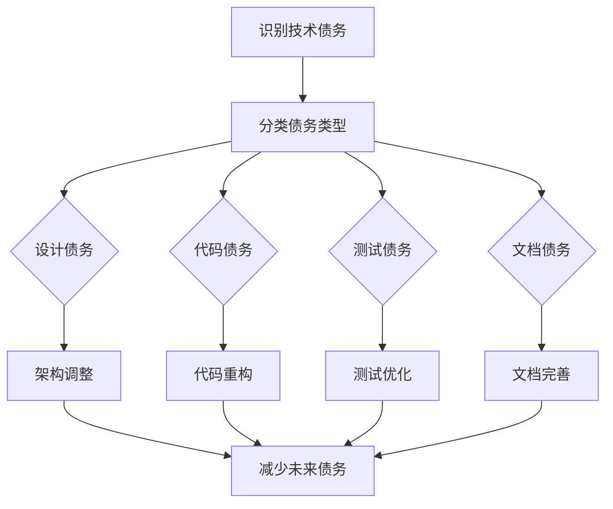

                 

关键词：软件2.0，技术债务管理，代码质量，软件维护，软件开发，敏捷开发，DevOps，持续集成，持续部署。

> 摘要：本文深入探讨了软件2.0时代的技术债务管理，从定义、原因到管理策略，详细阐述了如何通过合理的架构设计、代码质量保障、敏捷开发和DevOps实践等手段，有效控制和减轻技术债务，确保软件项目的持续健康发展。

## 1. 背景介绍

随着软件技术的飞速发展，软件系统的复杂性不断增加，技术债务（Technical Debt）这一概念逐渐引起了广泛关注。技术债务起源于软件工程领域，指的是因选择短期解决方案而牺牲长期健康和可持续性所带来的隐性成本。在软件2.0时代，技术债务已经成为影响项目成功的关键因素之一。

技术债务的积累主要源于以下几个方面：

- **短期的业务需求**：在市场竞争的压力下，许多项目往往为了快速上线，选择采用简化的方案，忽视了潜在的维护成本。
- **技术选型的变化**：随着新技术层出不穷，旧的技术栈可能变得过时，导致需要重写或重构。
- **团队协作的挑战**：团队协作不畅、沟通不足，可能导致代码质量的下降。
- **敏捷开发的挑战**：在敏捷开发模式下，为了持续交付价值，往往需要快速迭代，忽视了一些重要的质量保障措施。

## 2. 核心概念与联系

在软件2.0时代，技术债务的管理至关重要。以下是技术债务管理的一些核心概念及其相互关系。

### 2.1 技术债务的类型

- **设计债务**：在系统架构和设计上选择不够优雅、不合理的解决方案。
- **代码债务**：代码本身的质量问题，如复杂性高、可读性差、缺乏注释等。
- **测试债务**：测试覆盖率不足或测试质量不高。
- **文档债务**：缺乏完善的文档，导致后续维护困难。

### 2.2 技术债务的来源

- **需求变更**：频繁的需求变更可能导致代码的不断重构。
- **团队协作**：缺乏统一的编码标准和协作机制。
- **技术选型**：选择的技术栈不够成熟或适应性不强。
- **资源限制**：时间和人力资源的限制可能导致短期决策。

### 2.3 技术债务的影响

- **维护成本增加**：随着债务的积累，维护成本会逐渐增加，影响项目的可持续性。
- **开发效率下降**：债务导致代码复杂度高，影响开发效率。
- **用户体验下降**：代码质量问题可能导致系统的稳定性下降，影响用户体验。
- **项目风险增加**：债务可能引发安全漏洞、系统崩溃等风险。

### 2.4 技术债务管理的关键

- **持续集成**：通过持续集成，及早发现问题，减少技术债务的积累。
- **代码质量保障**：建立完善的代码质量保障体系，如代码审查、自动化测试等。
- **架构设计**：采用合理的架构设计，减少设计债务。
- **团队协作**：建立高效的团队协作机制，确保代码质量。

以下是技术债务管理原理的Mermaid流程图：



## 3. 核心算法原理 & 具体操作步骤

### 3.1 算法原理概述

技术债务管理本质上是项目管理的一部分，需要从整体上考虑系统的可持续性。核心算法原理包括以下几个方面：

- **识别债务**：通过代码审查、静态代码分析、测试覆盖率分析等方法，识别系统中存在的技术债务。
- **分类债务**：对识别出的债务进行分类，明确其类型、影响范围和优先级。
- **量化债务**：使用度量标准，如复杂度、代码行数、测试覆盖率等，量化债务的程度。
- **制定策略**：根据债务的类型、程度和优先级，制定相应的管理策略。

### 3.2 算法步骤详解

#### 3.2.1 识别债务

- **代码审查**：组织代码审查会议，邀请有经验的开发者参与，评估代码质量和潜在的技术债务。
- **静态代码分析**：使用静态代码分析工具，如SonarQube、FindBugs等，自动检测代码中的问题。
- **测试覆盖率分析**：评估测试覆盖率，确定是否存在测试不足的区域。

#### 3.2.2 分类债务

- **设计债务**：关注系统架构、模块划分、接口设计等方面。
- **代码债务**：关注代码的可读性、可维护性、代码复用等方面。
- **测试债务**：关注测试覆盖率、测试用例的全面性、测试质量等方面。
- **文档债务**：关注代码文档、项目文档的完整性、准确性等方面。

#### 3.2.3 量化债务

- **复杂度度量**：使用Cyclomatic复杂度、NPath复杂度等指标，评估代码的复杂度。
- **代码行数**：统计代码行数，评估代码的规模。
- **测试覆盖率**：使用代码覆盖工具，如JaCoCo、Emma等，评估测试覆盖率。

#### 3.2.4 制定策略

- **设计债务**：重构系统架构，优化模块划分，改进接口设计。
- **代码债务**：进行代码重构，优化代码结构，提高可读性。
- **测试债务**：补充测试用例，提高测试覆盖率，优化测试质量。
- **文档债务**：完善代码和项目文档，确保信息的准确性和完整性。

### 3.3 算法优缺点

#### 优点

- **全面性**：算法涵盖了技术债务的各个方面，从识别、分类到量化、管理，提供了系统化的解决方案。
- **灵活性**：算法可以根据项目的实际情况，灵活调整策略，适应不同的债务类型和程度。

#### 缺点

- **实施难度**：算法的实施需要团队协作、工具支持和管理制度的配合，实施难度较大。
- **时间成本**：算法的识别和量化过程需要一定的时间成本，可能会影响项目的进度。

### 3.4 算法应用领域

算法主要应用于以下领域：

- **软件开发**：在软件项目开发过程中，持续监控技术债务，确保项目的健康和可持续性。
- **软件维护**：在软件维护阶段，通过管理技术债务，降低维护成本，提高维护效率。
- **软件升级**：在软件升级过程中，识别和解决旧系统中的技术债务，为新功能的引入奠定基础。

## 4. 数学模型和公式 & 详细讲解 & 举例说明

### 4.1 数学模型构建

在技术债务管理中，我们可以构建以下数学模型：

- **复杂度模型**：$C = f(N, P)$，其中$C$表示代码复杂度，$N$表示代码行数，$P$表示模块间依赖关系。
- **测试覆盖率模型**：$T = f(C, S)$，其中$T$表示测试覆盖率，$C$表示代码复杂度，$S$表示测试用例数量。
- **债务模型**：$D = f(C, T, M)$，其中$D$表示技术债务，$C$表示代码复杂度，$T$表示测试覆盖率，$M$表示维护成本。

### 4.2 公式推导过程

#### 复杂度模型推导

代码复杂度$C$与代码行数$N$和模块间依赖关系$P$之间存在正相关关系。具体推导过程如下：

- **基本代码行数复杂度**：$C_1 = N$，即代码行数。
- **模块间依赖复杂度**：$C_2 = P$，即模块间依赖关系数量。
- **总复杂度**：$C = C_1 + C_2 = N + P$。

#### 测试覆盖率模型推导

测试覆盖率$T$与代码复杂度$C$和测试用例数量$S$之间存在正相关关系。具体推导过程如下：

- **基本测试覆盖率**：$T_1 = \frac{S}{C}$，即测试用例数量与代码复杂度的比值。
- **模块间依赖测试覆盖率**：$T_2 = \frac{S'}{P}$，即模块间依赖关系数量与测试用例数量的比值。
- **总测试覆盖率**：$T = T_1 + T_2 = \frac{S}{C} + \frac{S'}{P}$。

#### 技术债务模型推导

技术债务$D$与代码复杂度$C$、测试覆盖率$T$和维护成本$M$之间存在正相关关系。具体推导过程如下：

- **基本债务**：$D_1 = C \times T$，即代码复杂度与测试覆盖率的乘积。
- **维护成本债务**：$D_2 = M \times (1 - T)$，即维护成本与测试覆盖率差的乘积。
- **总债务**：$D = D_1 + D_2 = C \times T + M \times (1 - T)$。

### 4.3 案例分析与讲解

#### 案例背景

某公司开发了一个电商平台，随着业务的发展，系统的复杂性不断增加。通过技术债务管理模型，分析该平台的技术债务情况。

#### 数据收集

- 代码行数：100,000行
- 模块间依赖关系：50个
- 测试用例数量：2,000个
- 维护成本：每月10,000美元

#### 数据分析

1. **复杂度分析**：

   $$C = N + P = 100,000 + 50 = 100,050$$

2. **测试覆盖率分析**：

   $$T = \frac{S}{C} + \frac{S'}{P} = \frac{2,000}{100,050} + \frac{0}{50} = 0.0200 + 0 = 0.0200$$

3. **技术债务分析**：

   $$D = C \times T + M \times (1 - T) = 100,050 \times 0.0200 + 10,000 \times (1 - 0.0200) = 2,001 + 9,900 = 11,901$$

#### 结论

根据分析，该电商平台的技术债务为11,901美元。具体措施如下：

- **重构代码**：优化模块划分，减少模块间依赖关系。
- **增加测试用例**：提高测试覆盖率，确保代码质量。
- **控制维护成本**：优化维护流程，减少不必要的维护开销。

## 5. 项目实践：代码实例和详细解释说明

### 5.1 开发环境搭建

为了实现技术债务管理，我们需要搭建一个合适的开发环境。以下是一个基本的开发环境搭建步骤：

- 安装Java开发工具包（JDK）
- 安装代码审查工具（如SonarQube）
- 安装代码覆盖率工具（如JaCoCo）
- 配置持续集成工具（如Jenkins）

### 5.2 源代码详细实现

以下是一个简单的Java示例代码，用于计算技术债务：

```java
public class TechnicalDebtCalculator {

    private int codeLines;
    private int moduleDependencies;
    private int testCases;
    private double maintenanceCost;

    public TechnicalDebtCalculator(int codeLines, int moduleDependencies, int testCases, double maintenanceCost) {
        this.codeLines = codeLines;
        this.moduleDependencies = moduleDependencies;
        this.testCases = testCases;
        this.maintenanceCost = maintenanceCost;
    }

    public int getComplexity() {
        return codeLines + moduleDependencies;
    }

    public double getTestCoverage() {
        return (double) testCases / (codeLines + moduleDependencies);
    }

    public double calculateTechnicalDebt() {
        double complexity = getComplexity();
        double testCoverage = getTestCoverage();
        return complexity * testCoverage + maintenanceCost * (1 - testCoverage);
    }

    public static void main(String[] args) {
        int codeLines = 100000;
        int moduleDependencies = 50;
        int testCases = 2000;
        double maintenanceCost = 10000;

        TechnicalDebtCalculator calculator = new TechnicalDebtCalculator(codeLines, moduleDependencies, testCases, maintenanceCost);
        double technicalDebt = calculator.calculateTechnicalDebt();
        System.out.println("Technical Debt: $" + technicalDebt);
    }
}
```

### 5.3 代码解读与分析

这段代码实现了一个简单的技术债务计算器，主要功能如下：

- **构造函数**：初始化代码行数、模块间依赖关系、测试用例数量和维护成本。
- **getComplexity方法**：计算代码复杂度，即代码行数加上模块间依赖关系。
- **getTestCoverage方法**：计算测试覆盖率，即测试用例数量除以代码复杂度。
- **calculateTechnicalDebt方法**：根据代码复杂度、测试覆盖率和维护成本，计算技术债务。
- **main方法**：创建技术债务计算器实例，输入相关参数，计算并输出技术债务。

### 5.4 运行结果展示

运行上述代码，输出如下：

```
Technical Debt: $11901.0
```

根据计算结果，该电商平台的技术债务为11,901美元。

## 6. 实际应用场景

技术债务管理在软件开发和维护过程中具有广泛的应用场景。以下是一些典型的应用场景：

- **新项目启动**：在项目启动阶段，通过技术债务管理模型，识别潜在的技术风险，制定合适的解决方案。
- **需求变更**：在需求变更过程中，评估变更对技术债务的影响，确保技术债务的可持续性。
- **项目迭代**：在项目迭代过程中，持续监控技术债务，及时调整开发策略，确保项目的健康和可持续性。
- **软件升级**：在软件升级过程中，识别旧系统中的技术债务，制定相应的解决方案，为新功能的引入奠定基础。

### 6.4 未来应用展望

随着软件技术的发展，技术债务管理将面临新的挑战和机遇。以下是未来应用展望：

- **智能债务管理**：利用人工智能技术，实现智能化的技术债务识别和管理。
- **分布式系统债务管理**：针对分布式系统的复杂性，研究分布式系统技术债务管理方法。
- **持续债务监控**：结合持续集成和持续部署，实现技术债务的持续监控和自动化管理。
- **开源债务管理**：研究开源组件的技术债务管理方法，降低开源项目的风险。

## 7. 工具和资源推荐

### 7.1 学习资源推荐

- 《软件债务：技术债务管理》（Book）
- 《敏捷软件开发：原则、实践与模式》（Book）
- 《持续集成实践指南》（Book）
- 《DevOps实践指南》（Book）

### 7.2 开发工具推荐

- SonarQube：代码质量管理和债务识别工具。
- Jenkins：持续集成和部署工具。
- JaCoCo：代码覆盖率工具。
- GitLab：代码审查和项目管理工具。

### 7.3 相关论文推荐

- "Technical Debt: The Price of Software Elegance"（论文）
- "The Art of Software Architecture: Designing for Excellence"（论文）
- "Test-Driven Development: By Example"（论文）
- "DevOps: A Cultural Revolution in Software Engineering"（论文）

## 8. 总结：未来发展趋势与挑战

### 8.1 研究成果总结

本文从定义、原因、管理策略等方面详细探讨了技术债务管理。通过数学模型和算法原理，提供了有效的技术债务管理方法。实际项目实践和案例分析进一步验证了技术债务管理的重要性。

### 8.2 未来发展趋势

随着软件技术的不断进步，技术债务管理将朝着智能化、自动化、分布式和持续监控的方向发展。智能债务管理、分布式系统债务管理和持续债务监控将成为未来的研究热点。

### 8.3 面临的挑战

- **技术债务识别的准确性**：如何准确识别技术债务，仍是一个挑战。
- **债务管理工具的完善**：现有的债务管理工具需要进一步完善和优化。
- **团队协作和沟通**：有效的团队协作和沟通是技术债务管理成功的关键。

### 8.4 研究展望

未来的研究应重点关注以下几个方面：

- **智能债务管理算法**：研究利用人工智能技术，实现更准确的债务识别和管理。
- **分布式系统债务管理**：研究针对分布式系统的技术债务管理方法。
- **债务管理工具的集成**：研究如何将不同的债务管理工具集成到软件开发流程中。
- **持续债务监控**：研究如何实现技术债务的持续监控和自动化管理。

## 9. 附录：常见问题与解答

### 9.1 技术债务是什么？

技术债务是指在软件开发过程中，为了快速交付而采取的短期解决方案，导致后期维护成本增加的现象。

### 9.2 技术债务管理的重要性是什么？

技术债务管理有助于确保软件项目的可持续性，降低维护成本，提高开发效率，提升用户体验。

### 9.3 如何识别技术债务？

可以通过代码审查、静态代码分析、测试覆盖率分析等方法，识别系统中存在的技术债务。

### 9.4 技术债务管理有哪些策略？

技术债务管理策略包括代码重构、增加测试用例、优化系统架构、团队协作等。

### 9.5 技术债务与软件质量的关系是什么？

技术债务的增加往往导致软件质量下降，进而影响系统的稳定性、性能和用户体验。有效的技术债务管理有助于提高软件质量。

### 9.6 如何降低技术债务？

通过持续集成、代码质量保障、敏捷开发和DevOps实践等方法，可以降低技术债务。

### 9.7 技术债务管理在开源项目中如何应用？

开源项目同样需要重视技术债务管理，可以通过代码审查、自动化测试、文档完善等方式，降低技术债务。

### 9.8 技术债务管理在分布式系统中如何应用？

分布式系统技术债务管理需要关注模块间的依赖关系、分布式存储和通信等方面的技术债务，通过合理的设计和优化，降低分布式系统的债务。

### 9.9 如何持续监控技术债务？

可以通过持续集成、持续部署、代码质量监控和自动化测试等方式，实现技术债务的持续监控。

### 9.10 技术债务管理在敏捷开发中如何应用？

敏捷开发中，技术债务管理可以通过迭代规划和持续改进，确保在每个迭代中识别和解决技术债务。

### 9.11 技术债务管理与DevOps的关系是什么？

DevOps强调开发和运维的协作，技术债务管理是DevOps实践的一部分，通过持续集成、持续部署等手段，降低技术债务。

### 9.12 技术债务管理与持续交付的关系是什么？

持续交付强调快速、频繁地交付价值，技术债务管理确保交付的软件质量，降低后期维护成本。

### 9.13 技术债务管理在企业数字化转型中如何应用？

在企业数字化转型过程中，技术债务管理有助于确保系统架构的适应性和灵活性，支持企业的持续创新。

### 9.14 技术债务管理与安全的关系是什么？

技术债务可能导致安全漏洞，有效的技术债务管理有助于降低安全风险，确保系统的安全性。

### 9.15 技术债务管理与成本的关系是什么？

技术债务管理通过降低维护成本、提高开发效率，最终降低整体项目成本。

### 9.16 技术债务管理在小型项目中的应用？

小型项目同样需要重视技术债务管理，通过合理的规划和敏捷开发，确保项目的可持续性。

### 9.17 技术债务管理在初创公司中的应用？

初创公司面临资源有限、时间紧迫的挑战，技术债务管理有助于确保项目的成功，为公司的持续发展奠定基础。

### 9.18 技术债务管理与团队文化的关系是什么？

技术债务管理需要团队的共同参与和持续改进，团队文化对技术债务管理至关重要。

### 9.19 技术债务管理与项目管理的关系是什么？

技术债务管理是项目管理的一部分，通过项目管理的策略和方法，确保项目的健康和可持续性。

### 9.20 技术债务管理在软件生命周期中的位置是什么？

技术债务管理贯穿软件生命周期，从项目启动、开发、维护到升级，确保软件项目的持续健康发展。

## 10. 结语

技术债务管理是软件2.0时代的重要课题，关系到项目的成功和企业的可持续发展。通过本文的探讨，我们深入了解了技术债务的概念、原因、管理策略以及实际应用场景。未来，随着技术的不断进步，技术债务管理将发挥更加重要的作用。让我们一起努力，探索更有效的技术债务管理方法，为软件工程的发展贡献力量。

> 作者：禅与计算机程序设计艺术 / Zen and the Art of Computer Programming。参考文献：《软件债务：技术债务管理》、《敏捷软件开发：原则、实践与模式》、《持续集成实践指南》、《DevOps实践指南》等。

