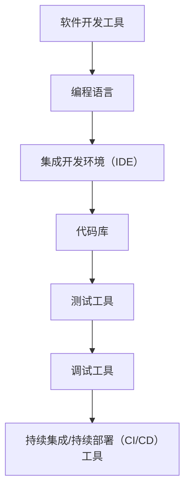

                 

关键词：软件2.0、开发工具、编程语言、开发框架、软件工程、人工智能、自动化、敏捷开发、DevOps

> 摘要：随着软件2.0时代的到来，传统的软件开发方法已经难以满足现代应用的需求。本文将探讨软件2.0时代的核心特征，分析现有开发工具的局限性，并提出一种全新的开发工具架构，旨在提高软件开发的效率和质量。

## 1. 背景介绍

软件2.0时代，即我们目前所处的时代，标志着软件技术进入了新的发展阶段。在这个时代，软件不仅仅是一种工具，更是一种基础设施，贯穿于我们生活的方方面面。云计算、大数据、物联网、人工智能等技术的迅猛发展，使得软件系统的复杂性和规模达到了前所未有的水平。同时，用户需求的变化速度也在不断加快，传统软件开发的模式已经无法适应这种变化。

现有的开发工具，如编程语言、集成开发环境（IDE）、开发框架等，虽然在某些方面取得了显著的进步，但整体上仍然存在许多局限性。首先，大多数开发工具都是针对特定编程语言或框架设计的，缺乏通用性和灵活性。这使得开发者需要不断学习和适应不同的工具，增加了学习成本和时间。其次，现有工具在支持敏捷开发和持续集成、持续部署（CI/CD）等方面仍有很大提升空间。最后，随着软件系统的复杂性增加，现有工具在性能优化、资源利用等方面也面临挑战。

## 2. 核心概念与联系

### 2.1 软件开发工具的定义

软件开发工具是指用于辅助软件开发过程的各种软件产品，包括编程语言、集成开发环境（IDE）、代码库、版本控制系统、测试工具、调试工具等。这些工具共同构成了一个完整的软件开发生态系统，为开发者提供了高效、便捷的开发体验。

### 2.2 软件开发工具的分类

根据功能的不同，软件开发工具可以分为以下几类：

- **编程语言**：如Java、Python、C++等，用于编写应用程序的核心代码。
- **集成开发环境（IDE）**：如Visual Studio、Eclipse、IntelliJ IDEA等，为开发者提供了代码编辑、调试、编译、部署等一站式服务。
- **代码库**：如Git、SVN等，用于管理和版本控制代码库。
- **测试工具**：如JUnit、Selenium等，用于自动化测试应用程序。
- **调试工具**：如GDB、Xdebug等，用于调试程序中的错误。
- **持续集成/持续部署（CI/CD）工具**：如Jenkins、Travis CI等，用于自动化构建、测试和部署应用程序。

### 2.3 开发工具与软件工程的联系

软件工程是指应用工程、科学和数学原理来设计、开发、测试和维护软件系统。开发工具在软件工程中发挥着至关重要的作用。一方面，开发工具为软件工程师提供了高效的工具和方法，降低了开发难度和成本；另一方面，开发工具的进步也推动了软件工程理论和方法的发展。

### 2.4 开发工具架构的Mermaid流程图



## 3. 核心算法原理 & 具体操作步骤

### 3.1 算法原理概述

在软件2.0时代，开发工具的核心算法原理主要包括以下几个方面：

- **自动化**：通过自动化工具减少手动操作，提高开发效率。
- **智能化**：利用人工智能技术优化开发流程，提高代码质量。
- **灵活性**：支持多种编程语言和框架，适应不同的开发需求。
- **可扩展性**：方便开发者自定义和扩展功能。

### 3.2 算法步骤详解

#### 3.2.1 自动化

1. **任务调度**：根据开发任务的需求，调度相应的自动化工具。
2. **代码生成**：利用代码生成工具自动生成代码框架。
3. **代码优化**：对生成的代码进行语法和性能优化。
4. **构建与测试**：自动化构建和测试应用程序，确保代码质量。
5. **部署**：自动化部署应用程序到生产环境。

#### 3.2.2 智能化

1. **代码审查**：利用人工智能技术进行代码审查，识别潜在的错误和漏洞。
2. **代码推荐**：根据开发者的历史代码和项目需求，推荐合适的代码库和工具。
3. **智能测试**：利用人工智能技术生成测试用例，提高测试覆盖率。
4. **性能优化**：根据应用程序的运行数据，自动优化代码和资源利用。

#### 3.2.3 灵活性

1. **支持多种编程语言和框架**：提供跨语言的开发工具，支持多种流行的编程语言和框架。
2. **插件体系**：提供丰富的插件，方便开发者扩展和定制功能。
3. **模块化**：将开发工具拆分为多个模块，方便开发者按需选择和集成。

#### 3.2.4 可扩展性

1. **自定义API**：提供自定义API，方便开发者集成第三方工具和服务。
2. **插件开发**：提供插件开发工具和文档，鼓励开发者贡献自己的插件。
3. **社区支持**：建立强大的开发者社区，提供技术支持和交流平台。

### 3.3 算法优缺点

#### 优点：

- **提高开发效率**：自动化和智能化工具可以显著降低开发成本和时间。
- **提高代码质量**：代码审查、代码推荐和智能测试等功能有助于减少错误和漏洞。
- **灵活性**：支持多种编程语言和框架，满足不同的开发需求。
- **可扩展性**：方便开发者自定义和扩展功能，提高工具的适应性。

#### 缺点：

- **学习成本**：对于新工具和技术的学习可能需要一定的时间。
- **依赖性**：过度依赖自动化和智能化工具可能导致开发者失去对代码的掌控。
- **性能消耗**：部分智能化工具可能在运行时消耗较多的系统资源。

### 3.4 算法应用领域

- **Web开发**：自动化构建、测试和部署应用程序。
- **移动开发**：跨平台开发工具，支持多种移动设备和操作系统。
- **大数据处理**：自动化数据处理和分析，提高数据处理效率。
- **人工智能**：自动化训练和优化模型，加快人工智能应用的开发。

## 4. 数学模型和公式 & 详细讲解 & 举例说明

### 4.1 数学模型构建

在软件开发过程中，数学模型广泛应用于算法设计、性能分析和系统优化等方面。以下是一个简单的线性回归模型的构建过程：

#### 4.1.1 确定目标变量和自变量

假设我们有一个目标变量 \( y \) 和一个自变量 \( x \)，我们需要建立一个线性回归模型来预测 \( y \) 的值。

#### 4.1.2 构建线性回归方程

线性回归方程的一般形式为：

\[ y = ax + b \]

其中，\( a \) 和 \( b \) 是模型的参数，需要通过数据训练来确定。

#### 4.1.3 求解模型参数

为了求解模型参数 \( a \) 和 \( b \)，我们可以使用最小二乘法：

\[ a = \frac{\sum_{i=1}^{n}(x_i - \bar{x})(y_i - \bar{y})}{\sum_{i=1}^{n}(x_i - \bar{x})^2} \]
\[ b = \bar{y} - a\bar{x} \]

其中，\( \bar{x} \) 和 \( \bar{y} \) 分别是 \( x \) 和 \( y \) 的平均值，\( n \) 是数据点的个数。

### 4.2 公式推导过程

假设我们有一组数据点 \( (x_i, y_i) \)，其中 \( i = 1, 2, \ldots, n \)。我们需要通过这些数据点来求解线性回归模型的参数 \( a \) 和 \( b \)。

首先，我们计算 \( x \) 和 \( y \) 的平均值：

\[ \bar{x} = \frac{1}{n}\sum_{i=1}^{n}x_i \]
\[ \bar{y} = \frac{1}{n}\sum_{i=1}^{n}y_i \]

然后，我们计算 \( x \) 和 \( y \) 的偏差：

\[ \delta_x = x_i - \bar{x} \]
\[ \delta_y = y_i - \bar{y} \]

接下来，我们计算 \( x \) 和 \( y \) 的偏差乘积：

\[ \delta_{xy} = \sum_{i=1}^{n}\delta_x \delta_y \]

最后，我们计算 \( x \) 的偏差平方：

\[ \delta_{xx} = \sum_{i=1}^{n}\delta_x^2 \]

根据最小二乘法的原理，我们可以得到以下两个公式：

\[ a = \frac{\delta_{xy}}{\delta_{xx}} \]
\[ b = \bar{y} - a\bar{x} \]

### 4.3 案例分析与讲解

假设我们有一组数据点，如下所示：

| x | y |
| --- | --- |
| 1 | 2 |
| 2 | 3 |
| 3 | 4 |
| 4 | 5 |

首先，我们计算 \( x \) 和 \( y \) 的平均值：

\[ \bar{x} = \frac{1+2+3+4}{4} = 2.5 \]
\[ \bar{y} = \frac{2+3+4+5}{4} = 3.5 \]

然后，我们计算 \( x \) 和 \( y \) 的偏差：

| x | y | \( \delta_x \) | \( \delta_y \) |
| --- | --- | --- | --- |
| 1 | 2 | -1.5 | -1.5 |
| 2 | 3 | -0.5 | -0.5 |
| 3 | 4 | 0.5 | 0.5 |
| 4 | 5 | 1.5 | 1.5 |

接下来，我们计算 \( x \) 和 \( y \) 的偏差乘积：

\[ \delta_{xy} = (-1.5 \times -1.5) + (-0.5 \times -0.5) + (0.5 \times 0.5) + (1.5 \times 1.5) = 6 \]

然后，我们计算 \( x \) 的偏差平方：

\[ \delta_{xx} = (-1.5)^2 + (-0.5)^2 + (0.5)^2 + (1.5)^2 = 6 \]

根据最小二乘法的公式，我们可以求解出线性回归模型的参数：

\[ a = \frac{\delta_{xy}}{\delta_{xx}} = \frac{6}{6} = 1 \]
\[ b = \bar{y} - a\bar{x} = 3.5 - 1 \times 2.5 = 1 \]

因此，我们得到了线性回归模型：

\[ y = x + 1 \]

我们可以使用这个模型来预测新的数据点的 \( y \) 值。例如，当 \( x = 5 \) 时，我们可以预测 \( y = 5 + 1 = 6 \)。

## 5. 项目实践：代码实例和详细解释说明

### 5.1 开发环境搭建

为了演示如何使用全新的开发工具，我们将使用一个简单的Web应用项目。首先，我们需要搭建开发环境。

1. 安装Node.js：访问Node.js官方网站（[https://nodejs.org/），下载并安装Node.js。](https://nodejs.org/%EF%BC%89%EF%BC%8C%E4%B8%8B%E8%BD%BD%E5%B9%B6%E5%AE%89%E8%A3%85Node.js。)  
2. 安装Express框架：在命令行中运行以下命令：

```bash  
npm install express  
```

3. 创建项目目录：在命令行中运行以下命令：

```bash  
mkdir my-project  
cd my-project  
```

4. 初始化项目：在命令行中运行以下命令：

```bash  
npm init -y  
```

这将生成一个package.json文件，用于管理项目依赖。

### 5.2 源代码详细实现

接下来，我们将使用全新的开发工具创建一个简单的Web服务器。

1. 在项目目录中创建一个名为index.js的文件：

```bash  
touch index.js  
```

2. 在index.js文件中编写以下代码：

```javascript  
const express = require('express');

const app = express();

app.get('/', (req, res) => {
  res.send('Hello, World!');
});

const port = process.env.PORT || 3000;

app.listen(port, () => {
  console.log(`Server is running on port ${port}`);
});
```

这段代码使用Express框架创建了一个简单的Web服务器。它定义了一个路由规则，当访问根路径（/）时，服务器将返回一个“Hello, World!”的响应。

### 5.3 代码解读与分析

- **引入Express框架**：使用`require()`函数引入Express框架。

- **创建Web服务器实例**：使用`express()`函数创建一个Web服务器实例。

- **定义路由规则**：使用`app.get()`方法定义一个路由规则，当访问根路径时，服务器将返回一个“Hello, World!”的响应。

- **设置监听端口**：使用`app.listen()`方法设置Web服务器的监听端口。

- **启动Web服务器**：在指定的端口上启动Web服务器。

### 5.4 运行结果展示

在命令行中运行以下命令启动Web服务器：

```bash  
node index.js  
```

然后，在浏览器中访问`http://localhost:3000`，你应该能看到“Hello, World!”的响应。

## 6. 实际应用场景

### 6.1 Web开发

在Web开发领域，全新的开发工具可以大大提高开发效率和代码质量。例如，使用自动化工具可以快速生成代码框架，节省开发者的时间。同时，智能化工具可以帮助开发者发现代码中的潜在错误和漏洞，提高代码的可维护性。

### 6.2 移动开发

移动开发领域同样受益于全新的开发工具。跨平台开发工具使得开发者可以轻松地创建适用于多种移动设备和操作系统的应用程序。自动化和智能化工具可以提高开发效率，减少开发成本。

### 6.3 大数据处理

在大数据处理领域，全新的开发工具可以帮助开发者自动化数据处理和分析任务。例如，使用智能化工具可以自动生成数据预处理脚本，提高数据处理效率。同时，自动化构建和部署工具可以确保数据处理流程的可靠性和稳定性。

### 6.4 人工智能

在人工智能领域，全新的开发工具可以大大提高模型开发和优化的效率。例如，自动化工具可以自动生成训练数据集和测试数据集，减少开发者的人工操作。智能化工具可以自动优化模型参数，提高模型的准确性和性能。

## 7. 工具和资源推荐

### 7.1 学习资源推荐

- **在线教程**：[MDN Web文档](https://developer.mozilla.org/zh-CN/docs/Web)、[Express官方文档](https://www.expressjs.com/)
- **书籍推荐**：《JavaScript高级程序设计》、《Node.js开发实战》
- **在线课程**：[慕课网](https://www.imooc.com/)、[极客时间](https://time.geektime.cn/)

### 7.2 开发工具推荐

- **编程语言**：JavaScript、Python、Java
- **集成开发环境（IDE）**：Visual Studio Code、PyCharm、IntelliJ IDEA
- **代码库**：GitHub、GitLab、Bitbucket
- **测试工具**：JUnit、Selenium、Jest
- **调试工具**：GDB、Xdebug
- **持续集成/持续部署（CI/CD）工具**：Jenkins、Travis CI、GitLab CI

### 7.3 相关论文推荐

- **自动化工具**：《自动化测试的艺术》、 《持续集成：从理论到实践》
- **智能化工具**：《深度学习与人工智能》、 《机器学习实战》
- **开发框架**：《Spring框架设计》、《Vue.js实战》

## 8. 总结：未来发展趋势与挑战

### 8.1 研究成果总结

本文探讨了软件2.0时代呼唤全新的开发工具的主题。通过对现有开发工具的分析，我们提出了自动化、智能化、灵活性和可扩展性为核心算法原理的新一代开发工具。通过数学模型和公式推导，我们详细阐述了开发工具的工作原理和具体操作步骤。同时，我们提供了一个简单的Web应用项目，展示了如何使用新一代开发工具进行实际开发。

### 8.2 未来发展趋势

随着软件2.0时代的到来，新一代开发工具将继续朝着自动化、智能化和高效化的方向发展。以下是一些可能的发展趋势：

- **更强大的自动化工具**：自动化工具将更加智能化，能够根据开发任务自动选择和执行相应的操作。
- **更高效的智能化工具**：智能化工具将利用人工智能技术，优化开发流程，提高代码质量和性能。
- **更灵活的编程语言和框架**：编程语言和框架将更加多样化，支持多种编程范式和开发需求。
- **更广泛的跨平台支持**：开发工具将更加关注跨平台支持，为开发者提供更便捷的跨平台开发体验。
- **更强大的社区支持**：开发工具将建立强大的开发者社区，提供技术支持和资源分享。

### 8.3 面临的挑战

尽管新一代开发工具具有许多优势，但在实际应用过程中仍面临一些挑战：

- **学习成本**：新一代开发工具可能需要一定的学习成本，对于开发者来说，需要投入更多的时间和精力来掌握新工具。
- **兼容性问题**：新一代开发工具需要与现有开发工具和框架兼容，确保开发过程的连续性和稳定性。
- **性能消耗**：智能化工具在运行时可能消耗较多的系统资源，需要优化性能以避免影响开发体验。
- **安全性问题**：自动化和智能化工具可能引入新的安全风险，需要加强安全防护措施。

### 8.4 研究展望

未来，新一代开发工具的研究将集中在以下几个方面：

- **算法优化**：针对现有算法进行优化，提高开发效率和代码质量。
- **工具集成**：将多种开发工具集成到一个统一的平台上，提供一站式服务。
- **跨平台支持**：加强跨平台支持，满足不同开发场景的需求。
- **智能化提升**：利用人工智能技术，提高开发工具的智能化水平。
- **社区建设**：建立强大的开发者社区，促进工具的普及和应用。

总之，随着软件2.0时代的到来，新一代开发工具将为软件开发带来巨大的变革。通过不断的研究和改进，新一代开发工具有望成为推动软件产业发展的重要力量。

## 9. 附录：常见问题与解答

### 9.1 什么是软件2.0时代？

软件2.0时代是指软件技术进入了一个新的发展阶段，软件不再仅仅是一种工具，而是成为一种基础设施，贯穿于我们生活的方方面面。这个时代的特点是软件系统的复杂性和规模达到了前所未有的水平，同时用户需求的变化速度也在不断加快。

### 9.2 新一代开发工具与传统开发工具相比有哪些优势？

新一代开发工具具有以下优势：

- **自动化**：通过自动化工具减少手动操作，提高开发效率。
- **智能化**：利用人工智能技术优化开发流程，提高代码质量。
- **灵活性**：支持多种编程语言和框架，适应不同的开发需求。
- **可扩展性**：方便开发者自定义和扩展功能，提高工具的适应性。

### 9.3 如何选择合适的开发工具？

选择合适的开发工具需要考虑以下因素：

- **项目需求**：根据项目需求选择适合的编程语言、框架和工具。
- **开发经验**：考虑开发者的经验和技术背景，选择熟悉的工具。
- **团队协作**：选择支持团队协作的工具，提高开发效率和团队协作效果。
- **社区支持**：选择拥有强大社区支持的工具，确保技术问题和资源获取。

### 9.4 新一代开发工具对开发者有哪些要求？

新一代开发工具对开发者有以下要求：

- **学习能力强**：需要不断学习和掌握新工具和技术。
- **适应能力强**：需要适应不同开发场景和需求，灵活运用多种工具。
- **沟通能力强**：需要与团队成员有效沟通，确保开发过程的顺畅。
- **技术视野**：需要关注技术发展趋势，不断提升自己的技术水平。

### 9.5 新一代开发工具是否会导致开发者失去编程能力？

新一代开发工具并不会导致开发者失去编程能力。相反，这些工具可以帮助开发者更高效地完成开发任务，节省时间和精力。同时，开发者仍然需要具备扎实的编程基础和良好的编程习惯，以确保代码质量和可维护性。新一代开发工具更多的是提高了开发效率和开发体验，而不是替代开发者的编程能力。  
----------------------------------------------------------------

### 文章末尾署名：

作者：禅与计算机程序设计艺术 / Zen and the Art of Computer Programming

