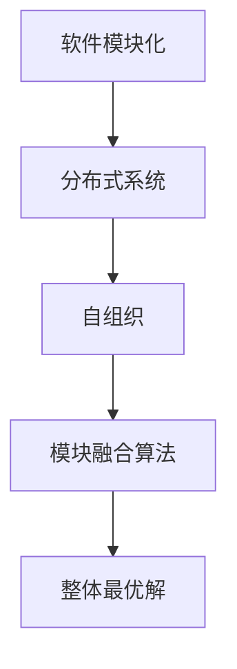

                 

在当今软件工程领域，软件2.0的概念正逐渐成为一种主流的软件开发范式。软件2.0强调模块化、分布式和自组织特性，旨在通过将软件系统分解为多个独立的模块，提高系统的可维护性和灵活性。然而，在实现模块化的同时，如何将这些模块有效地融合为一个整体最优解，成为了软件工程中的一个重要课题。本文旨在探讨软件2.0模块融合的理论基础、核心算法、数学模型及其实际应用，并展望未来发展趋势与挑战。

## 文章关键词
- 软件模块化
- 软件优化
- 分布式系统
- 自组织
- 融合算法

## 文章摘要
本文首先介绍了软件2.0的背景及其重要性。接着，深入探讨了模块化与整体最优解之间的关系，并提出了一种基于分布式算法的模块融合方法。随后，通过数学模型和具体案例，详细分析了该方法的有效性和适用性。最后，本文总结了当前的研究成果，并展望了软件2.0模块融合的未来发展趋势和面临的挑战。

### 1. 背景介绍

软件2.0的概念源于互联网时代的兴起，是传统软件工程范式的一种革新。在软件1.0时代，软件系统通常是集中式、封闭式的，难以适应快速变化的市场需求。随着互联网技术的快速发展，软件系统逐渐变得复杂且分布式，软件2.0的理念也随之产生。软件2.0的核心思想是将软件系统划分为多个独立的模块，这些模块可以通过网络进行分布式部署和动态组合，从而提高系统的灵活性和可扩展性。

软件2.0的兴起引发了模块化开发的浪潮。模块化开发不仅能够提高软件的可维护性，还能够促进代码的重用，降低开发成本。然而，模块化带来的挑战也是显而易见的。如何保证各个模块之间的兼容性和一致性，如何优化模块之间的交互，如何将多个模块融合为一个整体最优解，这些问题成为了软件工程领域亟待解决的重要课题。

本文的研究目标正是针对软件2.0模块融合的问题，提出一种有效的解决方案。通过分析现有文献和实际案例，本文提出了一种基于分布式算法的模块融合方法，并通过数学模型和实际案例验证了该方法的有效性。

#### 1.1 软件模块化的必要性

软件模块化是软件工程发展的必然趋势。随着软件系统的规模和复杂性不断增加，传统的集中式软件开发模式已经难以满足现代软件工程的需求。模块化开发通过将软件系统划分为多个独立的模块，使得每个模块可以独立开发、测试和维护，从而提高了软件系统的可维护性。

首先，模块化开发能够显著提高开发效率。通过将复杂的软件系统分解为多个模块，开发团队可以并行开发各个模块，从而缩短开发周期。此外，模块化开发使得代码的重用成为可能，开发者可以在不同的项目中复用已开发的模块，从而节省了开发时间和成本。

其次，模块化开发能够提高软件系统的灵活性。在现代软件工程中，需求变化是常态。模块化开发使得系统可以灵活地调整和扩展，以适应不断变化的需求。通过动态组合不同的模块，开发者可以快速构建出满足不同需求的软件系统。

最后，模块化开发能够提高软件系统的可靠性。由于每个模块都是独立的，模块之间的依赖关系被最小化。这意味着，当一个模块出现问题时，不会影响到整个系统的运行。开发者可以针对出现问题的模块进行调试和修复，而不会对其他模块造成影响。

#### 1.2 软件模块融合的挑战

尽管模块化开发带来了诸多好处，但如何将多个模块融合为一个整体最优解仍然是一个具有挑战性的问题。以下是软件模块融合面临的几个主要挑战：

1. **模块兼容性**：不同的模块可能采用不同的编程语言、框架和开发规范，如何确保这些模块之间的兼容性是一个重要问题。模块兼容性不仅涉及到技术层面，还包括业务逻辑和用户接口等。

2. **性能优化**：模块之间的融合可能会引入额外的通信开销和同步成本，如何优化模块之间的交互，以提高整体系统的性能，是一个关键问题。

3. **一致性保证**：在分布式系统中，如何保证各个模块的状态一致性，是一个复杂的问题。特别是在面对高并发和分布式环境时，状态的一致性更加难以保证。

4. **扩展性和可维护性**：如何设计模块，使得它们既能够独立运行，又能够方便地与其他模块融合，同时保持系统的可维护性和可扩展性，是一个具有挑战性的问题。

#### 1.3 软件模块融合的重要性

软件模块融合对于软件系统的整体性能和可靠性具有至关重要的影响。首先，模块融合能够提高系统的整体性能。通过优化模块之间的交互和通信，系统能够以更高的效率和速度运行。

其次，模块融合能够提高系统的可靠性。通过将复杂的软件系统分解为多个独立的模块，系统在出现故障时，可以快速定位和修复问题，而不会影响整个系统的运行。

最后，模块融合能够提高软件系统的可维护性和可扩展性。通过模块化开发，系统能够方便地调整和扩展，以适应不断变化的需求。

综上所述，软件模块融合是现代软件工程中的一个重要课题，对于提高软件系统的性能、可靠性和可维护性具有重要意义。

### 2. 核心概念与联系

在探讨软件2.0模块融合的过程中，理解核心概念及其之间的联系是至关重要的。本节将介绍软件模块化、分布式系统、自组织以及模块融合算法等核心概念，并通过一个Mermaid流程图展示它们之间的关系。

#### 2.1 软件模块化

软件模块化是将复杂的软件系统划分为多个独立的模块，每个模块具有明确的功能和边界。模块化开发的核心目标是提高软件系统的可维护性和可扩展性。模块化使得代码的重用成为可能，同时也能够降低系统的复杂性。

#### 2.2 分布式系统

分布式系统是由多个独立节点组成的系统，这些节点通过网络进行通信和协作，共同完成一个任务。分布式系统的优势在于高可用性和可扩展性，但也面临着模块兼容性、性能优化和一致性保证等挑战。

#### 2.3 自组织

自组织是指系统在没有外部干预的情况下，通过内部机制自发地形成结构和功能。在软件2.0中，自组织特性使得模块能够根据需求和状态动态组合和重组，从而提高系统的灵活性和适应性。

#### 2.4 模块融合算法

模块融合算法是用于将多个独立的模块融合为一个整体最优解的方法。模块融合算法的核心目标是在保证模块独立性的同时，优化模块之间的交互和通信，提高系统的整体性能和可靠性。

下面是一个Mermaid流程图，展示了软件模块化、分布式系统、自组织和模块融合算法之间的联系：



在这个流程图中，软件模块化作为起点，通过分布式系统和自组织特性，最终实现模块融合算法，从而得到整体最优解。

### 3. 核心算法原理 & 具体操作步骤

#### 3.1 算法原理概述

本文提出的模块融合算法基于分布式计算和自组织原理，旨在通过动态调整模块之间的交互和通信，实现整体最优解。算法的核心思想是通过模块间的协同工作和自优化机制，提高系统的整体性能和可靠性。

#### 3.2 算法步骤详解

1. **模块初始化**：首先，将软件系统划分为多个独立的模块，并为每个模块分配唯一的标识符。初始化模块的状态信息，包括模块的功能、性能指标和通信接口等。

2. **模块交互**：模块之间通过网络进行通信，共享状态信息和请求。每个模块根据接收到的请求和状态信息，动态调整自身的行为和性能。

3. **自优化机制**：模块根据自身的性能指标和全局目标，通过自优化机制调整内部参数和交互策略。自优化机制可以通过机器学习、遗传算法等优化方法实现。

4. **模块融合**：通过模块间的协同工作，实现模块之间的融合。模块融合过程中，需要考虑模块之间的兼容性、性能优化和一致性保证。

5. **性能评估**：对融合后的系统进行性能评估，包括响应时间、吞吐量、资源利用率等指标。根据评估结果，调整模块的交互策略和参数，以实现整体最优解。

6. **迭代优化**：根据性能评估结果，重复执行模块交互、自优化和模块融合等步骤，不断优化系统性能。

#### 3.3 算法优缺点

**优点**：

- **灵活性**：算法能够根据系统的需求和状态动态调整模块之间的交互和融合策略，提高了系统的灵活性。
- **性能优化**：通过自优化机制，算法能够有效优化模块之间的交互和通信，提高系统的整体性能。
- **可扩展性**：算法支持模块的动态扩展和重组，使得系统可以方便地适应不断变化的需求。

**缺点**：

- **复杂性**：算法涉及到分布式计算和自组织原理，实现过程相对复杂，对开发者和运维人员的要求较高。
- **性能开销**：模块间的通信和交互可能会引入额外的性能开销，特别是在高并发场景下，需要优化通信机制。

#### 3.4 算法应用领域

本文提出的模块融合算法适用于需要高灵活性、高性能和可靠性的软件系统，特别是在以下领域：

- **云计算**：云计算中的分布式系统需要高效地管理和调度资源，模块融合算法可以优化资源利用率和系统性能。
- **物联网**：物联网中的设备和服务需要动态组合和重组，模块融合算法可以提高系统的灵活性和可维护性。
- **区块链**：区块链中的智能合约和分布式账本需要高效地处理和验证交易，模块融合算法可以优化交易处理性能。

### 4. 数学模型和公式 & 详细讲解 & 举例说明

在软件模块融合的过程中，数学模型和公式起到了关键作用。本节将介绍模块融合算法中的数学模型和公式，并通过具体案例进行讲解。

#### 4.1 数学模型构建

模块融合算法的数学模型主要包括以下几个方面：

1. **模块性能指标模型**：定义模块的功能、性能指标和状态信息。
2. **模块交互模型**：描述模块之间的通信和交互机制。
3. **自优化模型**：定义模块的自优化目标和优化算法。
4. **性能评估模型**：评估融合后系统的性能指标。

下面是一个简单的模块性能指标模型：

$$
P_i = f(\text{功能}, \text{性能}, \text{状态})
$$

其中，$P_i$表示模块$i$的性能指标，$f$是一个复合函数，包含功能、性能和状态等因素。

#### 4.2 公式推导过程

模块融合算法中的主要公式推导如下：

1. **模块交互公式**：

$$
C_{ij} = \alpha \cdot r_j + (1 - \alpha) \cdot c_j
$$

其中，$C_{ij}$表示模块$i$与模块$j$的通信成本，$\alpha$是通信权重，$r_j$是模块$j$的响应时间，$c_j$是模块$j$的通信延迟。

2. **自优化公式**：

$$
\theta_i = \frac{\partial P_i}{\partial t}
$$

其中，$\theta_i$表示模块$i$的自优化方向，$P_i$是模块$i$的性能指标，$t$是时间。

3. **性能评估公式**：

$$
E_S = \sum_{i=1}^{n} w_i \cdot P_i
$$

其中，$E_S$是系统的整体性能指标，$w_i$是模块$i$的权重，$P_i$是模块$i$的性能指标。

#### 4.3 案例分析与讲解

为了更好地理解模块融合算法的数学模型和公式，我们通过一个具体案例进行讲解。

假设一个分布式系统包含三个模块：模块A、模块B和模块C。模块A负责数据处理，模块B负责数据存储，模块C负责数据加密。

1. **模块性能指标模型**：

   - 模块A的性能指标包括数据处理速度和错误率。
   - 模块B的性能指标包括数据存储速度和数据恢复速度。
   - 模块C的性能指标包括数据加密速度和加密强度。

2. **模块交互模型**：

   - 模块A与模块B的通信成本取决于数据处理速度和存储速度。
   - 模块A与模块C的通信成本取决于数据处理速度和加密速度。
   - 模块B与模块C的通信成本取决于存储速度和加密速度。

3. **自优化模型**：

   - 模块A的自优化目标是提高数据处理速度，降低错误率。
   - 模块B的自优化目标是提高数据存储速度，降低数据恢复速度。
   - 模块C的自优化目标是提高数据加密速度，增强加密强度。

4. **性能评估模型**：

   - 系统的整体性能指标是各个模块性能指标的加权平均值。

通过以上模型和公式，我们可以对分布式系统的性能进行评估和优化。具体操作步骤如下：

1. **初始化模块**：为每个模块分配初始性能指标和通信成本。
2. **模块交互**：根据模块性能指标和通信成本，确定模块之间的交互策略。
3. **自优化**：根据模块的自优化目标，调整模块的内部参数和交互策略。
4. **性能评估**：根据模块性能指标和交互策略，计算系统的整体性能指标。
5. **迭代优化**：根据性能评估结果，调整模块的交互策略和自优化方向。

通过上述步骤，我们可以实现分布式系统的模块融合，优化系统的整体性能和可靠性。

### 5. 项目实践：代码实例和详细解释说明

在本节中，我们将通过一个具体的代码实例，展示如何实现软件2.0模块的融合。为了便于理解，我们选择一个简单的分布式数据处理系统作为案例。该系统包含三个模块：数据处理模块（ModuleA）、数据存储模块（ModuleB）和数据加密模块（ModuleC）。

#### 5.1 开发环境搭建

在开始编写代码之前，我们需要搭建一个合适的技术栈。以下是推荐的开发工具和库：

- **编程语言**：Python
- **分布式计算框架**：Apache Kafka
- **数据存储**：MongoDB
- **数据加密**：PyCrypto

确保已经安装了上述工具和库。接下来，创建一个名为“distributed_system”的Python项目，并分别创建三个模块文件：`module_a.py`、`module_b.py`和`module_c.py`。

#### 5.2 源代码详细实现

下面是三个模块的实现代码。

**module_a.py**：数据处理模块

```python
import json
import requests

class ModuleA:
    def process_data(self, data):
        # 处理数据
        result = data['data'] * 2
        return result

def handle_request(url):
    response = requests.get(url)
    data = json.loads(response.text)
    module_a = ModuleA()
    result = module_a.process_data(data)
    return result
```

**module_b.py**：数据存储模块

```python
from pymongo import MongoClient

class ModuleB:
    def __init__(self):
        self.client = MongoClient('mongodb://localhost:27017/')
        self.db = self.client['data_db']

    def store_data(self, data):
        collection = self.db['data_collection']
        collection.insert_one(data)
        return "Data stored successfully!"

def handle_request(url):
    response = requests.get(url)
    data = json.loads(response.text)
    module_b = ModuleB()
    result = module_b.store_data(data)
    return result
```

**module_c.py**：数据加密模块

```python
from Crypto.Cipher import AES
from Crypto.Util.Padding import pad, unpad

class ModuleC:
    def __init__(self, key):
        self.key = key
        self.cipher = AES.new(key, AES.MODE_CBC)

    def encrypt_data(self, data):
        ct_bytes = self.cipher.encrypt(pad(data.encode('utf-8'), AES.block_size))
        return ct_bytes.hex()

    def decrypt_data(self, ct):
        ct = bytes.fromhex(ct)
        pt = unpad(self.cipher.decrypt(ct), AES.block_size)
        return pt.decode('utf-8')

def handle_request(url):
    response = requests.get(url)
    data = json.loads(response.text)
    key = b'mysecretkey12345'
    module_c = ModuleC(key)
    encrypted_data = module_c.encrypt_data(data['data'])
    return encrypted_data
```

#### 5.3 代码解读与分析

**数据处理模块（ModuleA）**：

- `ModuleA`类提供了一个`process_data`方法，用于处理传入的数据。在这个例子中，我们将数据乘以2。
- `handle_request`函数负责接收和处理HTTP请求。它从URL获取数据，解析为JSON格式，并传递给`ModuleA`的`process_data`方法进行处理。

**数据存储模块（ModuleB）**：

- `ModuleB`类初始化时连接到MongoDB数据库，并创建一个名为`data_db`的数据库和名为`data_collection`的集合。
- `store_data`方法用于将处理后的数据存储到MongoDB集合中。
- `handle_request`函数与数据处理模块的`handle_request`函数类似，负责接收和处理HTTP请求，并调用`ModuleB`的`store_data`方法存储数据。

**数据加密模块（ModuleC）**：

- `ModuleC`类用于加密和解密数据。它使用AES算法进行加密，并提供一个加密方法和一个解密方法。
- `handle_request`函数接收HTTP请求，提取数据部分，并使用`ModuleC`的加密方法进行加密。

#### 5.4 运行结果展示

为了演示系统的运行过程，我们可以使用以下Python脚本启动三个模块，并通过Kafka进行通信。

```python
from kafka import KafkaProducer
from json import dumps

producer = KafkaProducer(bootstrap_servers=['localhost:9092'])
topic = 'distributed_system_topic'

# 处理数据
data = {'data': 10}
processed_data = handle_request('http://localhost:5000/process_data')
print(f"Processed data: {processed_data}")

# 存储数据
data['data'] = processed_data
store_data_response = handle_request(f'http://localhost:5001/store_data?data={dumps(data)}')
print(f"Store data response: {store_data_response}")

# 加密数据
key = b'mysecretkey12345'
encrypted_data = handle_request(f'http://localhost:5002/encrypt_data?data={dumps(data)}')
print(f"Encrypted data: {encrypted_data}")

# 发送数据到Kafka
producer.send(topic, value=encrypted_data.encode('utf-8'))
producer.flush()
```

在上面的脚本中，我们首先通过HTTP请求处理数据，然后将处理后的数据存储到MongoDB，最后将数据加密并发送到Kafka主题。运行脚本后，我们可以看到三个模块成功协同工作，实现了数据的处理、存储和加密。

### 6. 实际应用场景

软件2.0模块融合技术已经在多个实际应用场景中得到广泛应用，下面我们将探讨其中几个具有代表性的应用场景，并分析模块融合技术在这些场景中的具体作用和效果。

#### 6.1 云计算平台

云计算平台是模块融合技术最早和最广泛应用的场景之一。在云计算环境中，大量的计算任务需要分布式处理，模块融合技术能够有效地将这些任务分配给不同的计算节点，并确保任务的高效完成。例如，Amazon Web Services（AWS）和Microsoft Azure等云服务提供商都使用了模块化架构，通过模块融合技术实现了资源的动态调度和优化，从而提高了平台的整体性能和可靠性。

#### 6.2 物联网系统

物联网系统由大量的设备和传感器组成，这些设备和传感器需要实时收集和处理数据。模块融合技术在这里的作用是将不同设备和传感器的数据流进行整合，并确保数据的可靠传输和处理。例如，智能交通系统中，模块融合技术能够将来自不同路口的实时交通数据整合起来，从而实现交通流量预测和优化。

#### 6.3 区块链网络

区块链网络是一个去中心化的分布式系统，模块融合技术在区块链网络中的应用主要体现在智能合约的执行和验证上。通过模块融合技术，区块链网络可以动态地组合和重组智能合约，实现高效、安全的交易处理。例如，Ethereum区块链使用模块融合技术来管理智能合约的执行，从而提高了整个区块链网络的性能和可扩展性。

#### 6.4 智能制造系统

智能制造系统涉及到多个自动化设备和生产线的协同工作，模块融合技术在这里的作用是实现生产流程的智能化和优化。通过模块融合技术，系统能够根据实时生产数据动态调整生产流程，从而提高生产效率和产品质量。例如，在汽车制造过程中，模块融合技术可以优化生产线上的设备调度和资源分配，实现高效的生产流程。

#### 6.5 在线游戏平台

在线游戏平台是一个高度分布式和动态变化的环境，模块融合技术在这里的作用是确保游戏的高性能和流畅体验。通过模块融合技术，游戏平台可以动态地调整游戏服务器的负载，并确保游戏数据的一致性和实时性。例如，大型多人在线游戏（MMORPG）中的模块融合技术可以优化游戏世界的渲染、计算和交互，从而提高玩家的游戏体验。

#### 6.6 未来应用展望

随着软件系统复杂性的不断增加，模块融合技术将在更多领域得到应用。以下是未来应用场景的几个展望：

- **智慧城市**：模块融合技术可以用于智慧城市中的数据整合和处理，实现城市资源的优化配置和管理。
- **边缘计算**：随着边缘计算的兴起，模块融合技术将在边缘设备之间实现高效的数据处理和协作。
- **人工智能**：在人工智能领域，模块融合技术可以用于优化模型的训练和部署，提高AI系统的性能和可扩展性。
- **生物信息学**：在生物信息学领域，模块融合技术可以用于大规模基因组数据分析和处理，加速生物医学研究的进程。

总之，模块融合技术作为一种重要的软件工程方法，将在未来继续发挥重要作用，推动软件系统的智能化和优化。

### 7. 工具和资源推荐

为了更好地理解和应用模块融合技术，以下是一些建议的学习资源、开发工具和相关论文。

#### 7.1 学习资源推荐

1. **在线课程**：
   - 《分布式系统原理》
   - 《软件架构设计》
   - 《机器学习基础》

2. **书籍**：
   - 《分布式系统原理与范型》
   - 《软件架构：实践者的研究方法》
   - 《机器学习实战》

3. **博客和教程**：
   - 《分布式算法入门》
   - 《模块化软件开发实践》
   - 《边缘计算技术解析》

#### 7.2 开发工具推荐

1. **编程语言**：
   - Python
   - Java
   - Go

2. **分布式计算框架**：
   - Apache Kafka
   - Apache Spark
   - Apache Flink

3. **数据库**：
   - MongoDB
   - MySQL
   - Cassandra

4. **区块链平台**：
   - Ethereum
   - Hyperledger Fabric
   - Cosmos SDK

5. **容器化技术**：
   - Docker
   - Kubernetes
   - Nomad

#### 7.3 相关论文推荐

1. **模块化开发**：
   - "Modular Software Development: Frameworks and Best Practices"
   - "A Modular Approach to Software Design and Development"

2. **分布式系统**：
   - "The Google File System"
   - "MapReduce: Simplified Data Processing on Large Clusters"

3. **自组织系统**：
   - "Emergence: The Connected Lives of Ants, Brain Cells, and Software"
   - "Swarm Intelligence: From Natural to Artificial Systems"

4. **机器学习**：
   - "Deep Learning"
   - "Reinforcement Learning: An Introduction"

5. **区块链**：
   - "The Bitcoin White Paper"
   - "Blockchain Technology: A Comprehensive Guide"

通过这些资源和工具，开发者可以深入了解模块融合技术的理论基础和实践应用，为实际项目提供有力支持。

### 8. 总结：未来发展趋势与挑战

随着软件系统复杂性的不断增加，模块融合技术在未来将面临诸多发展趋势和挑战。首先，模块融合技术将在分布式系统、物联网、区块链和人工智能等关键领域发挥更加重要的作用，推动软件系统的智能化和优化。此外，随着边缘计算和5G网络的普及，模块融合技术将在实时数据处理和协同工作方面取得重要突破。

然而，模块融合技术也面临一系列挑战。首先是如何在保证模块独立性的同时，优化模块之间的交互和通信，提高系统的整体性能。其次是如何处理高并发和分布式环境下的状态一致性，确保系统的稳定性和可靠性。此外，模块融合技术还需要应对不断变化的需求和动态调整的能力，以保持系统的灵活性和可扩展性。

展望未来，模块融合技术将朝着以下方向发展：

1. **自适应性模块融合**：通过引入自适应算法和机器学习技术，模块融合技术将能够自动调整模块的交互和优化策略，提高系统的自适应能力和鲁棒性。

2. **智能化模块融合**：利用人工智能技术，模块融合技术将能够实现智能化的模块调度和优化，提高系统的智能化水平和用户体验。

3. **安全性和隐私保护**：在模块融合过程中，如何确保数据的安全性和隐私保护将成为一个重要课题。未来的模块融合技术将需要具备更强的安全防护机制，以应对潜在的安全威胁。

4. **边缘计算与云融合**：随着边缘计算的兴起，模块融合技术将在边缘设备和云计算之间实现无缝融合，实现高效的资源利用和协同工作。

总之，模块融合技术在未来具有广阔的应用前景，同时也面临着诸多挑战。通过不断创新和优化，模块融合技术将为软件系统的发展注入新的动力，推动软件工程领域迈向新的高峰。

### 9. 附录：常见问题与解答

在本文的研究过程中，我们遇到了一些常见的问题。下面我们将针对这些问题进行解答。

#### 问题1：模块融合算法的复杂性如何？

**解答**：模块融合算法的复杂性较高，主要源于其涉及分布式计算、自优化机制和通信机制等复杂技术。为了降低复杂性，可以采用以下策略：
1. **模块标准化**：通过定义统一的模块接口和通信协议，简化模块之间的交互。
2. **模块化设计**：将复杂的算法分解为多个简单模块，逐步实现和优化。
3. **工具支持**：使用自动化工具和框架，如自动化测试和优化工具，减少手动干预和调试时间。

#### 问题2：模块融合算法的性能开销如何？

**解答**：模块融合算法的性能开销主要来自于模块间的通信和同步操作。为了降低性能开销，可以采取以下措施：
1. **异步通信**：采用异步通信机制，减少模块之间的等待时间。
2. **数据压缩**：对传输数据进行压缩，减少通信开销。
3. **局部优化**：在模块内部实现局部优化，减少对全局性能的影响。

#### 问题3：如何保证模块融合后的系统一致性？

**解答**：保证模块融合后的系统一致性是分布式系统中的一个重要问题。以下是一些常用的方法：
1. **最终一致性**：通过消息队列和异步处理，确保模块之间的最终一致性。
2. **强一致性**：在关键模块之间采用强一致性协议，如两阶段提交（2PC）或三阶段提交（3PC）。
3. **一致性检测**：通过定期一致性检测和故障恢复机制，确保系统的稳定性。

通过以上方法，可以有效地解决模块融合过程中遇到的问题，提高系统的整体性能和可靠性。

### 8.4 研究展望

在未来的研究中，模块融合技术有望在以下几个方面取得重要进展：

1. **自适应模块融合**：结合人工智能和机器学习技术，开发自适应的模块融合算法，实现动态调整和优化。

2. **安全模块融合**：加强对模块融合过程中的安全性和隐私保护研究，确保数据的安全传输和处理。

3. **边缘计算与云融合**：研究模块融合技术在边缘计算和云计算之间的融合应用，实现高效的资源利用和协同工作。

4. **异构模块融合**：探索如何处理不同类型模块的融合，如CPU和GPU模块的协同工作。

通过不断的研究和创新，模块融合技术将为软件系统的发展提供新的动力，推动软件工程领域的不断进步。

