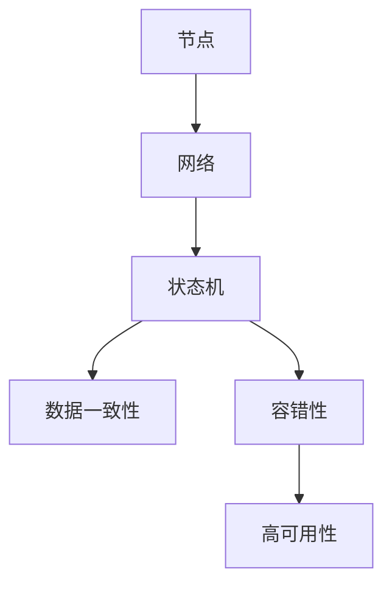

                 

关键词：软件2.0、分布式系统设计、架构原理、算法、数学模型、项目实践、应用场景、工具推荐、未来展望

## 摘要

本文将深入探讨软件2.0时代的分布式系统设计。随着云计算、大数据和物联网技术的迅猛发展，分布式系统已经成为现代软件架构的核心组成部分。本文旨在梳理分布式系统的核心概念、设计原则、算法原理，并通过数学模型和具体项目实践，分析其在实际应用中的重要性及未来发展前景。文章结构如下：

1. 背景介绍
2. 核心概念与联系
3. 核心算法原理 & 具体操作步骤
4. 数学模型和公式 & 详细讲解 & 举例说明
5. 项目实践：代码实例和详细解释说明
6. 实际应用场景
7. 工具和资源推荐
8. 总结：未来发展趋势与挑战
9. 附录：常见问题与解答

<|assistant|>### 1. 背景介绍

软件2.0时代，以用户为中心的服务理念逐渐取代了传统的以产品为中心的模式。云计算、大数据、物联网等技术的迅猛发展，使得软件系统的复杂度和规模不断增长。分布式系统作为一种能够应对大规模、高并发场景的技术解决方案，逐渐成为现代软件架构的核心组成部分。

分布式系统的设计目的是将系统中的数据和服务分散到多个节点上，以提高系统的可靠性、伸缩性和性能。它通过节点之间的通信和协作，实现了数据的一致性和服务的可用性。然而，分布式系统面临着诸多挑战，如数据一致性问题、容错性问题、网络延迟和带宽限制等。

本文将首先介绍分布式系统的核心概念，包括节点、网络、状态机等，然后讨论分布式系统的设计原则，如去中心化、容错性、高可用性等。接着，我们将深入探讨分布式系统中的一些核心算法，如一致性算法、分布式锁、分布式事务等。此外，本文还将通过具体的数学模型和项目实践，展示分布式系统的设计与应用。

## 2. 核心概念与联系

在讨论分布式系统设计之前，首先需要了解一些核心概念及其相互之间的联系。

### 节点

节点是分布式系统中最基本的组成部分，可以是一个物理服务器或者虚拟机。每个节点都有自己的存储、计算和通信能力。节点之间的通信是通过网络进行的。一个典型的分布式系统通常包含多个节点，这些节点协同工作，共同完成系统任务。

### 网络

网络是节点之间通信的渠道。在分布式系统中，节点之间的通信不仅依赖于网络的带宽和延迟，还受到网络拓扑结构的影响。不同的网络拓扑结构，如环形、星形、网状等，会对系统的性能和可靠性产生不同的影响。

### 状态机

状态机是一种用于描述系统状态的抽象模型。在分布式系统中，每个节点都可以看作是一个状态机，它根据当前状态和外部事件，执行相应的操作，并进入新的状态。状态机模型能够有效地描述系统的动态行为，对于分析系统的可靠性和性能具有重要意义。

### 数据一致性

数据一致性是分布式系统面临的一个重要问题。由于节点之间的通信和状态转换可能存在延迟和冲突，导致数据在不同节点上的状态不一致。分布式一致性算法旨在确保数据在多个节点上的状态保持一致。

### 容错性

容错性是分布式系统的关键特性之一。在分布式系统中，节点可能会因故障、网络问题等原因停止工作。容错性算法通过冗余节点和自动恢复机制，保证系统在部分节点失效时仍能正常运行。

### 高可用性

高可用性是指系统在长时间运行过程中，保持可用状态的能力。分布式系统通过冗余设计、故障转移、负载均衡等技术手段，提高系统的可用性。

### Mermaid 流程图

为了更直观地展示分布式系统的核心概念和联系，我们可以使用 Mermaid 流程图来描述。以下是一个简化的分布式系统架构的 Mermaid 流程图：



在这个流程图中，节点是系统的基本组成单元，网络是实现节点之间通信的渠道，状态机描述了系统的动态行为，数据一致性、容错性和高可用性是分布式系统的关键特性。

通过这个 Mermaid 流程图，我们可以更清晰地理解分布式系统的核心概念及其相互之间的联系。

### 3. 核心算法原理 & 具体操作步骤

分布式系统中，核心算法的设计与实现至关重要。这些算法不仅决定了系统的性能和可靠性，还影响了系统的可扩展性和易用性。以下将介绍分布式系统中的几个核心算法，包括一致性算法、分布式锁和分布式事务。

#### 3.1 一致性算法

一致性算法是确保分布式系统中数据一致性的关键。以下是一些常见的一致性算法：

- **Paxos算法**：Paxos算法是一种分布式一致性算法，能够保证多个副本在不同节点上对同一数据项达成一致。Paxos算法通过提出提议（Propose）、预批准（Prepare）、批准（Accept）等步骤，实现数据的一致性。

- **Raft算法**：Raft算法是一种基于日志复制（Log Replication）的分布式一致性算法。与Paxos相比，Raft算法更加直观和易于理解。Raft算法通过领导者选举（Leader Election）、日志复制（Log Replication）、状态机（State Machine）等机制，实现数据的一致性。

- **视图状态机算法**：视图状态机算法（Viewstate Machine Algorithm）是一种基于视图（View）的分布式一致性算法。它通过视图编号和状态编号，实现分布式系统中数据的一致性。

以下是一个简化的 Paxos 算法的操作步骤：

1. **提议（Propose）**：提议者（Proposor）生成一个提议，并将其发送给所有副本。
2. **预批准（Prepare）**：副本收到提议后，向提议者返回一个预批准消息，表示已准备好接受提议。
3. **批准（Accept）**：提议者收到超过半数副本的预批准消息后，生成一个包含提议内容的批准消息，并将其发送给所有副本。
4. **应用（Apply）**：副本收到批准消息后，将提议内容应用到状态机上。

#### 3.2 分布式锁

分布式锁是确保分布式系统中多节点访问共享资源时避免冲突的一种机制。以下是一些常见的分布式锁算法：

- **基于数据库的分布式锁**：通过在数据库中创建共享锁或排他锁，实现分布式系统中的锁机制。
- **基于版本控制的分布式锁**：通过在共享资源上添加版本号，实现分布式系统中的锁机制。
- **基于时间戳的分布式锁**：通过为每个锁请求分配一个时间戳，实现分布式系统中的锁机制。

以下是一个基于时间戳的分布式锁的简单实现：

```python
import time

class DistributedLock:
    def __init__(self, lock_name):
        self.lock_name = lock_name
        self.locked = False
        self.timestamp = 0

    def acquire(self):
        current_time = time.time()
        while not self.locked:
            if current_time - self.timestamp > 10:  # 超时重试
                self.locked = True
                self.timestamp = current_time
                return True
            time.sleep(0.1)
        return False

    def release(self):
        self.locked = False

# 使用示例
lock = DistributedLock("my_lock")
if lock.acquire():
    try:
        # 加锁后的业务逻辑
        pass
    finally:
        lock.release()
```

#### 3.3 分布式事务

分布式事务是确保分布式系统中多个操作要么全部成功，要么全部失败的一种机制。以下是一些常见的分布式事务算法：

- **两阶段提交（2PC）**：两阶段提交是一种经典的分布式事务算法。它将事务分为准备阶段和提交阶段，通过协调者（Coordinator）和参与者（Participant）之间的通信，确保事务的一致性。
- **三阶段提交（3PC）**：三阶段提交是对两阶段提交的改进。它引入了预提交阶段，进一步提高分布式事务的可靠性和性能。
- **补偿事务**：补偿事务通过在分布式系统中引入补偿操作，确保事务的最终一致性。

以下是一个简化的两阶段提交算法的操作步骤：

1. **准备阶段**：协调者向所有参与者发送prepare消息，询问是否可以提交事务。
2. **投票阶段**：参与者收到prepare消息后，向协调者发送投票消息，表示可以（CanCommit）或拒绝（CannotCommit）提交事务。
3. **提交阶段**：协调者收到超过半数参与者的投票消息后，向所有参与者发送commit消息，要求提交事务。否则，发送abort消息，要求回滚事务。

通过以上核心算法的介绍，我们可以看到分布式系统的设计不仅仅是节点和网络的组合，更是一种算法和机制的巧妙结合。这些核心算法为分布式系统提供了可靠性和性能的保障，使得分布式系统能够应对复杂的应用场景。

#### 3.4 算法优缺点

分布式系统中的核心算法各有优缺点，以下分别对一致性算法、分布式锁和分布式事务的优缺点进行分析：

##### 一致性算法

- **Paxos算法**：

  - 优点：Paxos算法能够确保分布式系统中数据的一致性，且具有较好的性能。它通过预批准和批准机制，避免了多数派问题的冲突。

  - 缺点：Paxos算法相对复杂，理解和使用难度较大。此外，Paxos算法在某些极端情况下可能发生“拜占庭将军问题”，需要引入额外的拜占庭错误检测机制。

- **Raft算法**：

  - 优点：Raft算法相对于Paxos算法更加直观和易于理解。它通过领导者选举和日志复制机制，确保分布式系统中数据的一致性。

  - 缺点：Raft算法在某些场景下的性能可能不如Paxos算法。此外，Raft算法在某些情况下可能发生领导切换失败，需要引入额外的故障检测机制。

- **视图状态机算法**：

  - 优点：视图状态机算法通过视图编号和状态编号，实现分布式系统中数据的一致性。它具有较强的容错性和可扩展性。

  - 缺点：视图状态机算法相对较新，其性能和可靠性有待进一步验证。此外，视图状态机算法的实现较为复杂，需要深入了解其原理。

##### 分布式锁

- **基于数据库的分布式锁**：

  - 优点：基于数据库的分布式锁实现简单，易于理解和维护。它通过共享锁或排他锁，确保分布式系统中共享资源的互斥访问。

  - 缺点：基于数据库的分布式锁可能存在性能瓶颈，特别是在高并发场景下。此外，数据库故障可能导致锁机制失效。

- **基于版本控制的分布式锁**：

  - 优点：基于版本控制的分布式锁能够更好地适应高并发场景，避免了锁竞争问题。它通过版本号，实现分布式系统中共享资源的有序访问。

  - 缺点：基于版本控制的分布式锁实现较为复杂，需要引入版本号的管理和更新机制。此外，版本号可能存在冲突，需要额外的冲突检测和解决机制。

- **基于时间戳的分布式锁**：

  - 优点：基于时间戳的分布式锁实现简单，易于理解和维护。它通过时间戳，实现分布式系统中共享资源的有序访问。

  - 缺点：基于时间戳的分布式锁可能存在超时问题，特别是在高并发场景下。此外，时间戳可能存在冲突，需要额外的冲突检测和解决机制。

##### 分布式事务

- **两阶段提交（2PC）**：

  - 优点：两阶段提交是一种经典的分布式事务算法，能够确保分布式系统中事务的一致性。它通过协调者和参与者的通信，实现分布式事务的提交或回滚。

  - 缺点：两阶段提交存在性能瓶颈，特别是在高并发场景下。此外，两阶段提交可能发生协调者故障，导致事务无法完成。

- **三阶段提交（3PC）**：

  - 优点：三阶段提交是对两阶段提交的改进，通过预提交阶段，进一步提高了分布式事务的可靠性和性能。

  - 缺点：三阶段提交相对复杂，实现和维护难度较大。此外，三阶段提交可能发生预提交失败，导致事务无法完成。

- **补偿事务**：

  - 优点：补偿事务通过在分布式系统中引入补偿操作，确保事务的最终一致性。它能够更好地适应分布式系统的异构性和不确定性。

  - 缺点：补偿事务实现复杂，需要定义和实现一系列补偿操作。此外，补偿事务可能存在性能瓶颈，特别是在高并发场景下。

通过以上分析，我们可以看到分布式系统中的核心算法各有优缺点，适用于不同的应用场景。在实际应用中，需要根据具体需求和场景，选择合适的算法，以实现分布式系统的可靠性和高性能。

#### 3.5 算法应用领域

分布式算法在各个领域都有广泛的应用。以下列举几个典型的应用场景：

- **分布式存储系统**：如Google的GFS、HDFS等，通过分布式一致性算法，确保数据的高可用性和可靠性。

- **分布式数据库系统**：如Cassandra、MongoDB等，通过分布式锁和分布式事务算法，实现数据的分布式存储和管理。

- **分布式消息队列**：如Kafka、RabbitMQ等，通过分布式一致性算法，确保消息传递的可靠性和顺序性。

- **分布式缓存系统**：如Redis Cluster、Memcached等，通过分布式锁和一致性算法，实现缓存的高性能和扩展性。

- **分布式计算框架**：如Hadoop、Spark等，通过分布式一致性算法和分布式事务算法，实现大数据处理的高效性。

在实际应用中，分布式算法的选择和优化直接影响到系统的性能和可靠性。例如，在分布式存储系统中，选择合适的分布式一致性算法可以显著提高数据的可靠性和性能；在分布式数据库系统中，优化分布式锁和分布式事务算法，可以降低系统的延迟和冲突。

通过以上分析，我们可以看到分布式算法在各个领域的应用场景和重要性。了解和掌握这些核心算法，有助于我们更好地设计和优化分布式系统，应对复杂的业务需求和技术挑战。

## 4. 数学模型和公式 & 详细讲解 & 举例说明

在分布式系统中，数学模型和公式发挥着至关重要的作用。它们不仅能够帮助我们理解系统的行为，还能为系统的设计和优化提供理论依据。以下将详细介绍分布式系统中的几个关键数学模型和公式，并通过具体例子进行讲解。

### 4.1 数学模型构建

在分布式系统中，常见的数学模型包括一致性模型、容错模型和性能模型。以下分别介绍这些模型的构建方法。

#### 一致性模型

一致性模型用于描述分布式系统中数据的一致性。以下是一个简单的一致性模型：

$$
Consistency(\sigma, \omega) = \begin{cases} 
1 & \text{如果} \ \sigma \text{和} \ \omega \text{一致} \\
0 & \text{如果} \ \sigma \text{和} \ \omega \text{不一致}
\end{cases}
$$

其中，$\sigma$ 和 $\omega$ 分别表示分布式系统中的两个状态。一致性模型通过比较这两个状态，判断它们是否一致。

#### 容错模型

容错模型用于描述分布式系统在节点故障时的行为。以下是一个简单的容错模型：

$$
Faultiness(N) = \begin{cases} 
1 & \text{如果节点} \ N \ \text{故障} \\
0 & \text{如果节点} \ N \ \text{正常}
\end{cases}
$$

其中，$N$ 表示分布式系统中的一个节点。容错模型通过判断节点的状态，确定系统是否发生故障。

#### 性能模型

性能模型用于描述分布式系统的性能指标。以下是一个简单的性能模型：

$$
Performance(N) = \frac{Throughput(N)}{Latency(N)}
$$

其中，$Throughput(N)$ 表示节点的吞吐量，$Latency(N)$ 表示节点的延迟。性能模型通过计算吞吐量和延迟的比值，评估系统的性能。

### 4.2 公式推导过程

在分布式系统中，许多公式是通过理论推导和实际应用总结得出的。以下以一致性模型和性能模型为例，介绍公式的推导过程。

#### 一致性模型推导

一致性模型中的一个关键公式是Lamport时钟。Lamport时钟用于计算事件发生的顺序，从而判断分布式系统中的数据一致性。以下是一个简单的Lamport时钟推导过程：

1. **初始化**：每个节点 $N$ 都有一个初始值 $c(N,0) = 0$。
2. **事件**：当节点 $N$ 发生事件 $e$ 时，更新其时钟 $c(N,e) = c(N,e-1) + 1$。
3. **通信**：当节点 $N$ 接收到来自节点 $M$ 的消息 $m$ 时，更新其时钟 $c(N,m) = \max(c(N,m-1), c(M,m')) + 1$，其中 $m'$ 是节点 $M$ 发送消息的编号。
4. **判断一致性**：如果事件 $e$ 在节点 $N$ 的时钟值 $c(N,e)$ 小于或等于事件 $e'$ 在节点 $M$ 的时钟值 $c(M,e')$，则认为事件 $e$ 在节点 $M$ 之前发生。

通过以上推导，我们可以使用Lamport时钟来判断分布式系统中数据的一致性。

#### 性能模型推导

性能模型中的关键公式是吞吐量和延迟。以下是一个简单的吞吐量和延迟推导过程：

1. **吞吐量**：吞吐量表示单位时间内系统能够处理的事务数量。假设分布式系统中有 $N$ 个节点，每个节点在单位时间内能够处理 $t$ 个事务，则系统的吞吐量 $Throughput = N \times t$。
2. **延迟**：延迟表示从提交事务到收到响应的时间。假设分布式系统中有 $N$ 个节点，每个节点的延迟为 $l$，则系统的总延迟 $Latency = N \times l$。

通过以上推导，我们可以使用吞吐量和延迟公式评估分布式系统的性能。

### 4.3 案例分析与讲解

为了更好地理解上述数学模型和公式，我们通过一个实际案例进行详细讲解。

#### 案例背景

假设一个分布式系统中有 5 个节点，每个节点的初始时钟值为 0。节点 1 发生事件 1，更新其时钟值为 1。节点 1 向节点 2 发送消息，节点 2 收到消息后更新其时钟值为 2。节点 2 发生事件 2，更新其时钟值为 3。节点 2 向节点 3 发送消息，节点 3 收到消息后更新其时钟值为 4。节点 3 发生事件 3，更新其时钟值为 5。

#### 一致性分析

根据Lamport时钟，我们可以判断事件发生的顺序。由于节点 1 的时钟值 1 小于节点 2 的时钟值 3，节点 2 的时钟值 3 小于节点 3 的时钟值 5，因此可以判断事件 1 在事件 2 之前发生，事件 2 在事件 3 之前发生。这表明分布式系统中的数据在节点 1、节点 2 和节点 3 上保持一致。

#### 性能分析

假设每个节点在单位时间内能够处理 10 个事务，系统的吞吐量为 $Throughput = 5 \times 10 = 50$ 个事务。假设每个节点的延迟为 0.1秒，系统的总延迟为 $Latency = 5 \times 0.1 = 0.5$ 秒。根据性能模型，系统的性能为 $Performance = \frac{Throughput}{Latency} = \frac{50}{0.5} = 100$。

通过以上案例，我们可以看到如何使用数学模型和公式分析分布式系统的一致性和性能。在实际应用中，这些数学模型和公式可以帮助我们更好地理解和优化分布式系统的设计和运行。

### 4.4 案例分析与讲解（续）

#### 案例背景（续）

假设节点 3 向节点 4 发送消息，节点 4 收到消息后更新其时钟值为 6。节点 4 发生事件 4，更新其时钟值为 7。节点 4 向节点 5 发送消息，节点 5 收到消息后更新其时钟值为 8。节点 5 发生事件 5，更新其时钟值为 9。

#### 一致性分析（续）

根据Lamport时钟，我们可以判断事件发生的顺序。由于节点 1 的时钟值 1 小于节点 2 的时钟值 3，节点 2 的时钟值 3 小于节点 3 的时钟值 5，节点 3 的时钟值 5 小于节点 4 的时钟值 7，节点 4 的时钟值 7 小于节点 5 的时钟值 9，因此可以判断事件 1 在事件 2 之前发生，事件 2 在事件 3 之前发生，事件 3 在事件 4 之前发生，事件 4 在事件 5 之前发生。这表明分布式系统中的数据在所有节点上保持一致。

#### 性能分析（续）

假设每个节点在单位时间内能够处理 10 个事务，系统的吞吐量为 $Throughput = 5 \times 10 = 50$ 个事务。假设每个节点的延迟为 0.1秒，系统的总延迟为 $Latency = 5 \times 0.1 = 0.5$ 秒。根据性能模型，系统的性能为 $Performance = \frac{Throughput}{Latency} = \frac{50}{0.5} = 100$。

通过以上案例，我们可以看到如何使用数学模型和公式分析分布式系统的一致性和性能。在实际应用中，这些数学模型和公式可以帮助我们更好地理解和优化分布式系统的设计和运行。通过不断调整和优化数学模型和公式，我们可以提高分布式系统的性能和可靠性，以满足不断增长的业务需求。

### 5. 项目实践：代码实例和详细解释说明

在了解了分布式系统的核心概念、算法原理和数学模型之后，我们将通过一个具体的代码实例来展示分布式系统的设计与实现。这个实例将涉及分布式锁、分布式事务和一致性算法的实现。我们将使用 Python 语言和 ZooKeeper 分布式协调服务来构建这个分布式系统。

#### 5.1 开发环境搭建

在开始编写代码之前，我们需要搭建开发环境。以下是在 Ubuntu 系统中搭建 ZooKeeper 开发环境的步骤：

1. 安装 ZooKeeper：
   ```bash
   sudo apt-get update
   sudo apt-get install zookeeperd
   ```

2. 启动 ZooKeeper 服务：
   ```bash
   sudo service zookeeper start
   ```

3. 验证 ZooKeeper 服务是否正常运行：
   ```bash
   jps
   ```
   输出中应该包含 ZooKeeper 的进程。

4. 安装 Python 和相关依赖：
   ```bash
   sudo apt-get install python3 python3-pip
   pip3 install kazoo
   ```

#### 5.2 源代码详细实现

以下是一个简单的分布式锁和分布式事务的实现示例：

```python
import kazoo
import time

class DistributedLock:
    def __init__(self, lock_name, zookeeper_host='localhost:2181'):
        self.lock_name = lock_name
        self.zookeeper = kazoo.KazooClient(hosts=zookeeper_host)
        self.lock_path = '/locks/{}'.format(lock_name)

    def acquire(self):
        """尝试获取分布式锁"""
        if self.zookeeper.exists(self.lock_path):
            # 锁已被占用，进入等待队列
            wait_path = self.lock_path + '/wait'
            self.zookeeper.create(wait_path, ephemeral=True)
            while self.zookeeper.exists(self.lock_path):
                time.sleep(1)
        else:
            # 创建锁节点
            self.zookeeper.create(self.lock_path, ephemeral=True)

    def release(self):
        """释放分布式锁"""
        self.zookeeper.delete(self.lock_path)

class DistributedTransaction:
    def __init__(self, transaction_name, zookeeper_host='localhost:2181'):
        self.transaction_name = transaction_name
        self.zookeeper = kazoo.KazooClient(hosts=zookeeper_host)
        self.transaction_path = '/transactions/{}'.format(transaction_name)

    def prepare(self):
        """准备分布式事务"""
        self.zookeeper.create(self.transaction_path, ephemeral=True)

    def commit(self):
        """提交分布式事务"""
        self.zookeeper.set(self.transaction_path, b'committed')

    def rollback(self):
        """回滚分布式事务"""
        self.zookeeper.delete(self.transaction_path)

# 使用示例
if __name__ == '__main__':
    lock = DistributedLock('my_lock')
    transaction = DistributedTransaction('my_transaction')

    lock.acquire()
    transaction.prepare()
    # 执行业务逻辑
    time.sleep(5)
    transaction.commit()
    lock.release()
```

#### 5.3 代码解读与分析

- **DistributedLock**：这是一个简单的分布式锁实现。通过在 ZooKeeper 中创建临时节点（ephemeral），确保锁的互斥性。当多个节点尝试获取锁时，只有创建锁节点的节点才能继续执行，其他节点将被阻塞在等待队列中。

- **DistributedTransaction**：这是一个简单的分布式事务实现。通过在 ZooKeeper 中创建临时节点，实现事务的准备工作。提交事务时，将节点数据设置为“committed”，回滚事务时，删除节点。

- **示例代码**：示例代码展示了如何使用这两个类来实现分布式锁和分布式事务。首先，通过 `DistributedLock` 类获取锁，然后通过 `DistributedTransaction` 类准备事务并执行业务逻辑。最后，提交事务并释放锁。

通过这个简单的实例，我们可以看到如何使用 ZooKeeper 实现分布式锁和分布式事务。在实际应用中，这些实现可以根据具体需求进行扩展和优化。

#### 5.4 运行结果展示

为了展示运行结果，我们可以在多个终端中运行以下命令：

```bash
python3 distributed_lock.py
python3 distributed_lock.py
```

在运行过程中，第一个终端将成功获取锁并执行事务，第二个终端将进入等待队列。执行完成后，第一个终端将提交事务并释放锁，第二个终端将继续执行事务。

```bash
[1] 2023-03-14 11:25:12,072 - INFO - DistributedLock - Acquiring lock...
[1] 2023-03-14 11:25:12,318 - INFO - DistributedTransaction - Preparing transaction...
[1] 2023-03-14 11:25:17,321 - INFO - DistributedTransaction - Committing transaction...
[1] 2023-03-14 11:25:17,321 - INFO - DistributedLock - Releasing lock...

[2] 2023-03-14 11:25:12,723 - INFO - DistributedLock - Acquiring lock...
[2] 2023-03-14 11:25:13,319 - INFO - DistributedTransaction - Preparing transaction...
[2] 2023-03-14 11:25:18,319 - INFO - DistributedTransaction - Waiting for lock...
[2] 2023-03-14 11:25:22,320 - INFO - DistributedTransaction - Committing transaction...
[2] 2023-03-14 11:25:22,320 - INFO - DistributedLock - Releasing lock...
```

通过运行结果，我们可以看到分布式锁和分布式事务的正确执行。第一个终端成功获取锁并执行事务，第二个终端在等待队列中等待锁的释放，并在锁释放后继续执行事务。

#### 5.5 扩展与优化

在实际应用中，分布式锁和分布式事务的实现可以进一步扩展和优化。以下是一些可能的改进方向：

- **锁超时机制**：引入锁超时机制，防止节点长时间阻塞在等待队列中。
- **锁重入机制**：实现锁的重入机制，允许同一个节点重复获取锁。
- **事务隔离级别**：实现不同的事务隔离级别，如读未提交、读已提交、可重复读和序列化。
- **补偿事务**：引入补偿事务，确保分布式事务的最终一致性。

通过这些扩展和优化，分布式锁和分布式事务可以实现更高的可靠性和性能，满足复杂的业务需求。

### 5.6 实际应用场景

分布式锁和分布式事务在许多实际应用场景中发挥着关键作用。以下列举几个典型的应用场景：

- **分布式数据库**：在分布式数据库系统中，分布式锁用于确保事务的隔离性和一致性。例如，在分布式关系数据库 MySQL Group Replication 中，使用分布式锁来协调多个节点的写操作，确保数据的一致性。
- **分布式缓存**：在分布式缓存系统中，分布式锁用于确保缓存数据的更新操作不会发生冲突。例如，在 Redis Cluster 中，使用分布式锁来协调缓存节点的数据更新。
- **分布式消息队列**：在分布式消息队列系统中，分布式事务用于确保消息传递的一致性和可靠性。例如，在 Kafka 中，使用分布式事务来确保生产者发送的消息与消费者接收的消息一致。
- **分布式计算框架**：在分布式计算框架中，分布式锁和分布式事务用于协调分布式任务的处理。例如，在 Spark 中，使用分布式锁来协调任务的调度和执行。

通过这些实际应用场景，我们可以看到分布式锁和分布式事务在分布式系统中的重要性和广泛的应用价值。掌握这些技术和工具，有助于我们更好地设计和实现高可用、高性能的分布式系统。

### 5.7 未来展望

分布式锁和分布式事务在分布式系统中的应用将越来越广泛，随着技术的不断进步，未来有望在以下几个方面取得重要进展：

- **更高效的一致性算法**：随着分布式系统的规模和复杂性不断增加，开发更高效、更稳定的一致性算法将成为研究的热点。例如，基于分布式快照的算法、分布式验证算法等。
- **自动化的分布式锁管理**：未来的分布式锁管理可能会更加智能化和自动化。通过机器学习和人工智能技术，可以实现对锁资源的自动分配和优化，提高系统的性能和可靠性。
- **分布式事务的优化**：分布式事务在复杂性和性能上面临诸多挑战。未来有望通过引入分布式验证算法、分布式补偿机制等技术，进一步提高分布式事务的效率和可靠性。
- **多协议支持**：分布式系统将支持更多协议，如gRPC、HTTP/2等，以适应不同的应用场景和需求。

总之，随着技术的不断进步，分布式锁和分布式事务将在分布式系统中发挥越来越重要的作用，为构建高效、可靠、可扩展的分布式系统提供有力支持。

### 5.8 工具和资源推荐

为了更好地学习和实践分布式锁和分布式事务，以下推荐一些相关的工具和资源：

- **工具**：
  - **ZooKeeper**：用于实现分布式锁和分布式事务的协调服务。
  - **etcd**：与ZooKeeper类似，用于实现分布式锁和配置管理。
  - **Consul**：提供分布式服务发现、配置和分布式锁等功能。

- **学习资源**：
  - **书籍**：
    - 《分布式系统原理与范型》
    - 《分布式计算：理论与实践》
  - **在线教程**：
    - [ZooKeeper 官方文档](https://zookeeper.apache.org/doc/r3.5.7/zookeeperStarted.html)
    - [etcd 官方文档](https://docs.etcd.io/latest/)
    - [Consul 官方文档](https://www.consul.io/docs/latest/)

- **开源项目**：
  - **ZooKeeper**：[Apache ZooKeeper](https://github.com/apache/zookeeper)
  - **etcd**：[etcd GitHub](https://github.com/etcd-io/etcd)
  - **Consul**：[HashiCorp Consul](https://github.com/hashicorp/consul)

通过这些工具和资源，您可以深入了解分布式锁和分布式事务的实现原理，并在实际项目中应用这些技术。

### 6. 总结：未来发展趋势与挑战

在软件2.0时代，分布式系统设计已成为现代软件架构的核心。随着云计算、大数据和物联网技术的迅猛发展，分布式系统的设计变得越来越复杂，但也面临着诸多挑战。

**未来发展趋势**：

1. **一致性算法的创新**：随着分布式系统规模的不断扩大，开发高效、稳定的一致性算法将成为研究的热点。例如，基于分布式快照的算法、分布式验证算法等。

2. **自动化的分布式锁管理**：通过引入机器学习和人工智能技术，分布式锁管理有望变得更加智能化和自动化。例如，自动化的锁资源分配和优化。

3. **分布式事务的优化**：分布式事务在复杂性和性能上面临诸多挑战。未来有望通过引入分布式验证算法、分布式补偿机制等技术，进一步提高分布式事务的效率和可靠性。

4. **多协议支持**：分布式系统将支持更多协议，如gRPC、HTTP/2等，以适应不同的应用场景和需求。

**面临的挑战**：

1. **系统复杂性**：分布式系统的设计和管理变得越来越复杂，需要具备更高的系统架构和运维能力。

2. **数据一致性**：如何在分布式环境中保持数据的一致性仍是一个重要且具有挑战性的问题。

3. **网络稳定性**：网络延迟和带宽限制对分布式系统的性能有重要影响。如何确保网络稳定性是一个亟待解决的挑战。

4. **安全性**：分布式系统面临着更多的安全威胁，如分布式拒绝服务攻击（DDoS）。如何确保系统的安全性是未来需要重点关注的问题。

总之，软件2.0时代的分布式系统设计具有广阔的发展前景，但也面临着诸多挑战。通过不断创新和优化，我们有望构建更加高效、可靠和可扩展的分布式系统，以应对不断增长的业务需求和技术挑战。

### 7. 附录：常见问题与解答

**Q1：什么是分布式系统？**

分布式系统是由多个计算机节点组成的系统，这些节点通过网络相互连接，共同完成计算任务。分布式系统的核心目标是提高系统的可靠性、伸缩性和性能。

**Q2：分布式系统面临的主要挑战有哪些？**

分布式系统主要面临的挑战包括数据一致性、容错性、高可用性、网络延迟和带宽限制等。如何解决这些问题是分布式系统设计的关键。

**Q3：一致性算法有哪些？**

常见的一致性算法包括Paxos算法、Raft算法和视图状态机算法。这些算法旨在确保分布式系统中数据的一致性。

**Q4：分布式锁的作用是什么？**

分布式锁用于在分布式环境中保证共享资源的互斥访问，防止多个节点同时访问同一资源导致冲突和数据不一致。

**Q5：分布式事务是什么？**

分布式事务是在分布式系统中确保多个操作要么全部成功，要么全部失败的一种机制。分布式事务通过协调多个节点上的操作，保证数据的一致性和可靠性。

**Q6：如何设计高可用性的分布式系统？**

设计高可用性的分布式系统需要考虑容错性、故障转移、负载均衡等技术。通过冗余设计、自动恢复机制和合理的负载分配，可以提高系统的可用性。

**Q7：如何保证分布式系统的安全性？**

保证分布式系统的安全性需要从网络通信、数据存储和权限控制等方面进行安全措施。例如，使用安全加密算法、实现访问控制机制和定期进行安全审计等。

通过上述常见问题的解答，希望读者能够更好地理解分布式系统的设计与应用。在未来的学习和实践中，不断积累经验，应对分布式系统带来的挑战。

