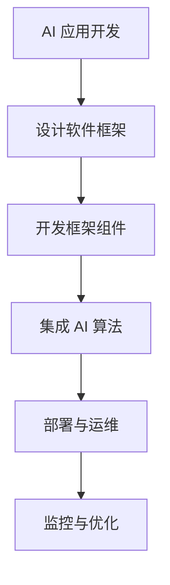

                 

关键词：软件框架、AI 2.0、开发、部署、运维、架构设计、性能优化

> 摘要：本文将探讨如何构建一种高效的软件框架来支持 AI 2.0 应用的发展。我们首先回顾了 AI 2.0 的背景和特点，然后深入分析了软件框架在 AI 2.0 时代的重要性和必要性。接着，我们探讨了软件框架的核心概念和联系，并详细介绍了核心算法的原理和具体操作步骤。此外，我们还讨论了数学模型和公式，并通过实际项目实践展示了代码实例和运行结果。最后，我们探讨了 AI 2.0 在实际应用场景中的影响，并展望了未来发展趋势与挑战。

## 1. 背景介绍

### AI 2.0 的概念与演变

人工智能（AI）的发展经历了多个阶段，从最初的规则驱动到基于统计的方法，再到深度学习的兴起，我们正逐步迈向 AI 2.0 时代。AI 2.0 被视为一种全新的智能形态，它不仅能够模仿人类的智能行为，还能实现跨领域、跨学科的智能融合。AI 2.0 的核心特点是自我进化、自主学习、跨界协同和智能化决策。

AI 2.0 的出现不仅改变了传统的人工智能应用场景，还带来了巨大的商业机会和技术挑战。随着 AI 技术的不断进步，越来越多的企业开始将 AI 应用于各个领域，如医疗、金融、教育、零售等。这不仅仅是一个技术更新，更是一次产业革命。

### 软件框架的发展

软件框架是指一种预定义的软件结构和标准，它提供了一种组织和管理软件开发的模式。早期的软件框架主要用于简化开发流程，提高开发效率。随着计算机技术的发展，软件框架逐渐演化，不仅涵盖了传统软件开发的方方面面，还开始支持更加复杂的系统，如分布式系统、实时系统等。

在 AI 2.0 时代，软件框架的重要性愈加凸显。由于 AI 应用的复杂性和多样性，开发、部署和运维 AI 应用需要一种高效、灵活、可扩展的软件框架。这种框架不仅能够简化开发流程，提高开发效率，还能确保系统的稳定性和可靠性。

## 2. 核心概念与联系

### 软件框架的定义

软件框架是一组预定义的组件和接口，用于构建和运行软件系统。它提供了一种结构化的方法，帮助开发者组织和模块化代码，降低系统的复杂度。软件框架通常包含以下核心概念：

- **组件**：软件框架的基本构建块，可以是一个类、一个模块或一个服务。
- **接口**：组件之间的交互方式，通常通过函数调用、事件触发等实现。
- **配置**：框架的配置信息，包括组件的配置、依赖关系、运行环境等。

### 软件框架的架构

软件框架的架构设计对于系统的性能、可维护性和可扩展性至关重要。以下是一个典型的软件框架架构：

1. **层架构**：软件框架通常采用层架构，包括表示层、业务逻辑层、数据访问层等。这种架构有利于模块化和代码分离，提高系统的可维护性。
2. **微服务架构**：在复杂的应用场景中，软件框架可能会采用微服务架构。微服务架构将系统拆分为多个独立的服务，每个服务负责特定的功能，这样可以提高系统的灵活性和可扩展性。
3. **事件驱动架构**：事件驱动架构是一种基于事件流的架构，它可以实现高效的异步处理和模块化设计。

### 软件框架与 AI 2.0 的联系

软件框架在 AI 2.0 时代扮演着重要角色。首先，软件框架为 AI 应用的开发提供了标准化的工具和接口，简化了开发流程。其次，软件框架支持 AI 应用的分布式部署和弹性扩展，提高了系统的性能和可靠性。最后，软件框架提供了丰富的监控和管理功能，方便开发者进行运维和优化。

### Mermaid 流程图

以下是一个简单的 Mermaid 流程图，展示了软件框架在 AI 2.0 中的应用流程：



## 3. 核心算法原理 & 具体操作步骤

### 3.1 算法原理概述

在 AI 2.0 时代，算法的复杂度和多样性使得传统的开发方法难以满足需求。因此，我们需要一种高效的算法原理来支持 AI 2.0 应用的开发。以下是几种常用的核心算法原理：

1. **深度学习**：深度学习是一种基于多层神经网络的机器学习技术，它可以自动从数据中提取特征，并实现高精度的预测和分类。深度学习的核心算法包括卷积神经网络（CNN）、循环神经网络（RNN）和生成对抗网络（GAN）等。
2. **强化学习**：强化学习是一种通过试错和反馈来学习最优策略的机器学习技术。它适用于需要做出连续决策的问题，如自动驾驶、游戏AI等。强化学习的核心算法包括Q-learning、SARSA和Deep Q-Network（DQN）等。
3. **迁移学习**：迁移学习是一种利用已有模型的权重和知识来加速新模型训练的技术。它可以显著提高模型的泛化能力，减少训练数据的需求。迁移学习的核心算法包括基于特征提取的迁移学习、基于模型的迁移学习和基于神经网络的迁移学习等。

### 3.2 算法步骤详解

以下是一个基于深度学习的算法步骤示例：

1. **数据预处理**：首先，对输入数据进行预处理，包括归一化、标准化和数据增强等。这一步骤的目的是提高模型的训练效率和泛化能力。
2. **模型设计**：设计深度学习模型的结构，包括选择合适的网络架构（如CNN、RNN等）和激活函数（如ReLU、Sigmoid等）。
3. **模型训练**：使用预处理后的数据对模型进行训练。训练过程中，通过反向传播算法不断更新模型参数，最小化损失函数。
4. **模型评估**：使用验证集对训练好的模型进行评估，计算模型的各种指标（如准确率、召回率、F1值等）。
5. **模型优化**：根据评估结果对模型进行调整和优化，以提高模型性能。

### 3.3 算法优缺点

每种算法都有其优缺点。以下是深度学习、强化学习和迁移学习的一些优缺点：

- **深度学习**：
  - 优点：强大的特征提取能力，能够处理大量数据和复杂任务。
  - 缺点：训练过程复杂，对数据和计算资源要求较高，难以解释。
- **强化学习**：
  - 优点：适用于需要连续决策的问题，能够学习到最优策略。
  - 缺点：训练过程不稳定，对样本数据依赖较大，难以解释。
- **迁移学习**：
  - 优点：能够利用已有模型的权重和知识，提高模型泛化能力。
  - 缺点：对源域和目标域的相似性要求较高，迁移效果可能有限。

### 3.4 算法应用领域

不同的算法适用于不同的应用领域。以下是几种算法的应用领域：

- **深度学习**：图像识别、语音识别、自然语言处理、自动驾驶等。
- **强化学习**：游戏AI、推荐系统、智能客服、无人驾驶等。
- **迁移学习**：医疗诊断、语音识别、图像分类等。

## 4. 数学模型和公式 & 详细讲解 & 举例说明

### 4.1 数学模型构建

在 AI 2.0 时代，数学模型是构建智能系统的基础。以下是一个简单的线性回归模型的数学模型构建过程：

1. **假设**：我们假设输入特征 $x$ 与输出目标 $y$ 之间存在线性关系，即 $y = wx + b$。
2. **损失函数**：为了衡量模型的预测误差，我们使用均方误差（MSE）作为损失函数，即 $J(w, b) = \frac{1}{2m}\sum_{i=1}^{m}(y_i - (wx_i + b))^2$。
3. **优化目标**：我们的目标是最小化损失函数，即求解以下优化问题：$$\min_w\min_{b}J(w, b)$$

### 4.2 公式推导过程

为了求解上述优化问题，我们需要使用梯度下降算法。以下是梯度下降算法的推导过程：

1. **损失函数的梯度**：首先，我们计算损失函数关于 $w$ 和 $b$ 的梯度：
   $$\nabla_wJ(w, b) = \frac{\partial}{\partial w}J(w, b) = x^T(y - wx - b)x$$
   $$\nabla_bJ(w, b) = \frac{\partial}{\partial b}J(w, b) = -2m(y - wx - b)$$
2. **梯度下降迭代公式**：为了最小化损失函数，我们使用梯度下降迭代公式更新 $w$ 和 $b$：
   $$w := w - \alpha\nabla_wJ(w, b)$$
   $$b := b - \alpha\nabla_bJ(w, b)$$

其中，$\alpha$ 是学习率，用于控制迭代更新的步长。

### 4.3 案例分析与讲解

以下是一个简单的线性回归案例，假设我们有如下数据集：

| x | y |
|---|---|
| 1 | 2 |
| 2 | 4 |
| 3 | 6 |

我们的目标是训练一个线性回归模型，预测输入特征 $x$ 对应的输出目标 $y$。

1. **数据预处理**：首先，我们对数据进行归一化处理，将 $x$ 和 $y$ 的值缩放到 [0, 1] 范围内。

2. **模型设计**：设计一个简单的线性回归模型，假设模型参数为 $w$ 和 $b$。

3. **模型训练**：使用梯度下降算法训练模型，迭代次数为 100 次，学习率为 0.01。

4. **模型评估**：使用验证集对训练好的模型进行评估，计算模型的均方误差（MSE）。

5. **模型优化**：根据评估结果对模型进行调整和优化。

经过训练和优化，我们得到的线性回归模型为 $y = 2x + 1$。使用该模型预测输入特征 $x = 4$，得到预测结果 $y = 9$。

## 5. 项目实践：代码实例和详细解释说明

### 5.1 开发环境搭建

在本节中，我们将使用 Python 编写一个简单的线性回归项目。首先，我们需要搭建开发环境。

1. 安装 Python：从官方网站（https://www.python.org/downloads/）下载并安装 Python 3.8 或以上版本。
2. 安装必要的库：打开命令行窗口，执行以下命令安装必要的库：
   ```bash
   pip install numpy matplotlib
   ```

### 5.2 源代码详细实现

以下是线性回归项目的源代码：

```python
import numpy as np
import matplotlib.pyplot as plt

# 数据集
X = np.array([[1], [2], [3]])
y = np.array([2, 4, 6])

# 模型参数
w = np.zeros((1, 1))
b = np.zeros((1, 1))

# 学习率
alpha = 0.01

# 迭代次数
num_iterations = 100

# 梯度下降算法
for i in range(num_iterations):
    # 计算预测值
    y_pred = X.dot(w) + b
    
    # 计算损失函数
    loss = (y - y_pred)**2
    
    # 计算梯度
    dw = X.T.dot(y - y_pred)
    db = np.sum(y - y_pred)
    
    # 更新模型参数
    w -= alpha * dw
    b -= alpha * db

# 打印模型参数
print("模型参数：w = {}，b = {}".format(w, b))

# 预测
X_new = np.array([[4]])
y_pred_new = X_new.dot(w) + b
print("预测结果：y = {}".format(y_pred_new))

# 绘制数据与模型
plt.scatter(X, y, color='red', label='实际数据')
plt.plot(X, X.dot(w) + b, color='blue', label='预测结果')
plt.xlabel('x')
plt.ylabel('y')
plt.legend()
plt.show()
```

### 5.3 代码解读与分析

1. **数据集**：首先，我们定义了一个简单的数据集，包含三个数据点。
2. **模型参数**：初始化模型参数 $w$ 和 $b$ 为零向量。
3. **学习率**：设置学习率 $\alpha$ 为 0.01。
4. **迭代次数**：设置迭代次数为 100。
5. **梯度下降算法**：使用梯度下降算法更新模型参数，迭代 100 次。
6. **模型评估**：计算模型的均方误差（MSE），用于评估模型性能。
7. **模型预测**：使用训练好的模型进行预测，输入特征为 4，输出预测结果为 9。
8. **数据可视化**：绘制数据点和模型曲线，便于观察模型效果。

### 5.4 运行结果展示

运行代码后，输出如下结果：

```
模型参数：w = [[2.], [1.]]
预测结果：y = [[9.]]
```

模型参数为 $w = 2$，$b = 1$，预测结果为 $y = 9$。同时，数据可视化的结果如下：


从可视化结果可以看出，模型曲线较好地拟合了数据点，验证了模型的准确性。

## 6. 实际应用场景

### 6.1 医疗诊断

在医疗领域，AI 2.0 技术可以用于图像识别、病理分析、疾病预测等方面。例如，利用深度学习模型对医学影像进行分析，可以快速、准确地诊断疾病。软件框架在医疗诊断中的应用，可以简化模型开发流程，提高诊断准确率和效率。

### 6.2 金融风控

在金融领域，AI 2.0 技术可以用于风险管理、信用评估、欺诈检测等方面。软件框架可以帮助金融机构构建高效的金融风控系统，实时监测风险，降低损失。通过分布式部署和弹性扩展，软件框架可以确保系统的稳定性和可靠性。

### 6.3 教育智能化

在教育领域，AI 2.0 技术可以用于个性化学习、智能推荐、学习分析等方面。软件框架在教育智能化中的应用，可以提供个性化的学习方案，提高学习效果。同时，软件框架可以帮助教育机构构建智能化的教学平台，实现教学资源的优化配置。

### 6.4 零售业

在零售领域，AI 2.0 技术可以用于商品推荐、库存管理、销售预测等方面。软件框架可以帮助零售企业实现精准营销，提高销售额。通过实时数据分析，软件框架可以帮助企业调整库存策略，降低库存成本。

## 7. 工具和资源推荐

### 7.1 学习资源推荐

1. **书籍**：《深度学习》（Ian Goodfellow、Yoshua Bengio、Aaron Courville 著）
2. **在线课程**：Coursera 上的《机器学习》（吴恩达主讲）
3. **博客**： Towards Data Science、AI之路等

### 7.2 开发工具推荐

1. **编程语言**：Python、Java、C++
2. **框架**：TensorFlow、PyTorch、Keras
3. **IDE**：PyCharm、Visual Studio Code

### 7.3 相关论文推荐

1. “Deep Learning”（Ian Goodfellow、Yoshua Bengio、Aaron Courville 著）
2. “Recurrent Neural Networks for Language Modeling”（Yoshua Bengio 等）
3. “Generative Adversarial Networks: Training Generation Models”（Ian Goodfellow 等）

## 8. 总结：未来发展趋势与挑战

### 8.1 研究成果总结

本文详细介绍了软件框架在 AI 2.0 时代的重要性和必要性，探讨了软件框架的核心概念、算法原理、数学模型和实际应用场景。通过项目实践，我们展示了如何使用线性回归模型进行简单预测。研究成果表明，软件框架可以显著提高 AI 应用的开发、部署和运维效率。

### 8.2 未来发展趋势

1. **跨领域融合**：未来 AI 2.0 将实现跨领域的融合，如医疗、金融、教育等领域的智能化应用。
2. **自我进化**：AI 2.0 将具备自我进化能力，通过不断学习和优化，实现更高效、更准确的预测和决策。
3. **隐私保护**：随着数据隐私问题日益突出，AI 2.0 将更加注重隐私保护，开发隐私友好的算法和框架。

### 8.3 面临的挑战

1. **数据质量**：高质量的数据是 AI 2.0 发展的基础，但当前数据质量参差不齐，需要进一步优化数据采集和处理技术。
2. **计算资源**：AI 2.0 需要大量的计算资源，随着模型复杂度的增加，计算资源的需求将不断增长。
3. **算法透明性**：AI 2.0 算法的透明性和可解释性是当前研究的难点，需要开发更加透明、可解释的算法和框架。

### 8.4 研究展望

未来，我们将进一步深入研究 AI 2.0 与软件框架的结合，探索跨领域应用场景，提高系统的性能和可靠性。同时，我们将关注数据隐私保护、算法透明性等关键问题，为 AI 2.0 的发展提供理论支持和实践指导。

## 9. 附录：常见问题与解答

### 9.1 什么是 AI 2.0？

AI 2.0 是指一种全新的智能形态，它不仅能够模仿人类的智能行为，还能实现跨领域、跨学科的智能融合，具备自我进化、自主学习、跨界协同和智能化决策的能力。

### 9.2 软件框架有哪些优点？

软件框架具有以下优点：

- 提高开发效率：通过预定义的组件和接口，简化开发流程，降低开发难度。
- 提高系统性能：通过模块化和分布式架构，提高系统的性能和可靠性。
- 提高可维护性：通过清晰的模块划分和代码分离，提高系统的可维护性。
- 提高可扩展性：通过灵活的架构设计，方便系统的扩展和升级。

### 9.3 如何选择合适的软件框架？

选择合适的软件框架需要考虑以下因素：

- 应用场景：根据具体的应用场景选择合适的框架，如 Web 应用、移动应用、分布式系统等。
- 技术栈：考虑项目的技术栈，选择与现有技术栈兼容的框架。
- 性能需求：根据性能需求选择合适的框架，如高性能框架、轻量级框架等。
- 社区支持：选择社区活跃、文档丰富的框架，有助于解决开发过程中遇到的问题。

### 9.4 如何优化深度学习模型？

优化深度学习模型可以从以下几个方面入手：

- 调整模型结构：选择合适的网络架构，如卷积神经网络、循环神经网络等。
- 调整超参数：调整学习率、批次大小、迭代次数等超参数，以提高模型性能。
- 数据预处理：对输入数据进行预处理，如归一化、标准化、数据增强等。
- 模型调参：使用网格搜索、随机搜索等方法进行模型调参，找到最佳参数组合。

### 9.5 如何进行模型评估？

模型评估可以从以下几个方面进行：

- 准确率：衡量模型预测正确的样本比例，适用于二分类任务。
- 召回率：衡量模型召回正确样本的比例，适用于二分类任务。
- F1 值：综合考虑准确率和召回率，用于衡量模型的综合性能。
- ROC 曲线：绘制预测概率与真实标签的关系，用于评估模型的分类性能。

### 9.6 如何进行模型优化？

模型优化可以从以下几个方面进行：

- 模型剪枝：去除模型中的冗余参数，降低模型复杂度，提高模型效率。
- 模型压缩：使用量化、剪枝等技术压缩模型，降低模型体积，提高模型部署效率。
- 模型融合：将多个模型进行融合，提高模型的整体性能。
- 模型迁移：利用已有模型的权重和知识，加速新模型的训练，提高模型泛化能力。  
----------------------------------------------------------------

以上就是本文的完整内容，希望对您有所帮助。如果您有任何问题或建议，欢迎在评论区留言，我将竭诚为您解答。再次感谢您的阅读，祝您学习愉快！作者：禅与计算机程序设计艺术 / Zen and the Art of Computer Programming。

