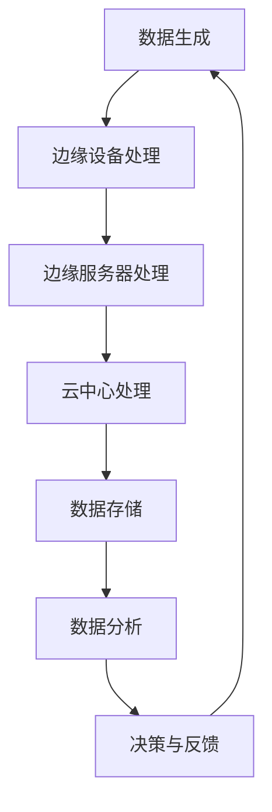

                 

关键词：边缘计算，软件2.0，应用，性能优化，智能化

摘要：边缘计算作为一种新兴的计算架构，正在逐渐改变传统的云计算模式。本文探讨了软件2.0的概念，及其在边缘计算中的应用。通过对边缘计算的核心概念、应用场景、关键技术和挑战的分析，我们旨在为读者提供一幅全面、深入的边缘计算与软件2.0融合发展的蓝图。

## 1. 背景介绍

### 边缘计算的发展背景

边缘计算（Edge Computing）是随着物联网（IoT）、5G通信技术的迅速发展和大数据的爆发而产生的一种新型计算模式。它旨在将计算、存储和网络功能从云中心迁移到网络边缘，即靠近数据生成和消费的地方。这种架构能够显著降低数据传输延迟，提高系统响应速度，满足实时性和低延迟的要求。

### 软件2.0的概念与特点

软件2.0，通常指的是利用现代编程语言、框架和工具，结合云计算、大数据和人工智能技术，构建的可伸缩、可重用和高度自动化的软件系统。其特点包括模块化、服务化、智能化和高性能。

## 2. 核心概念与联系

### 边缘计算与软件2.0的关系

边缘计算与软件2.0有着天然的契合点。软件2.0的模块化和服务化特性，使得其在边缘计算环境中能够灵活部署，提供高效、低延迟的服务。而边缘计算的低延迟和高实时性，则为软件2.0提供了更好的运行环境，使得智能化应用得以实现。

### 边缘计算架构


### 软件2.0架构


### Mermaid 流程图



## 3. 核心算法原理 & 具体操作步骤

### 3.1 算法原理概述

边缘计算中的核心算法主要涉及数据处理、实时分析和智能决策等方面。其基本原理是通过将计算任务分配到边缘设备，利用分布式计算和协同处理技术，实现高效、低延迟的数据处理。

### 3.2 算法步骤详解

#### 数据处理

1. 数据收集：从边缘设备收集实时数据。
2. 数据清洗：去除无效和错误数据。
3. 数据预处理：进行数据标准化、归一化和特征提取。

#### 实时分析

1. 模型加载：从云中心加载预先训练好的模型。
2. 实时预测：使用边缘设备执行模型预测。
3. 预测结果反馈：将预测结果返回给边缘设备。

#### 智能决策

1. 决策模型：基于实时预测结果构建决策模型。
2. 决策执行：执行决策模型，进行实时调整。

### 3.3 算法优缺点

#### 优点

- 低延迟：数据在边缘设备上处理，显著降低传输延迟。
- 高效性：分布式计算，提高数据处理效率。
- 智能化：利用人工智能技术，实现智能化决策。

#### 缺点

- 复杂性：边缘设备资源有限，算法实现复杂。
- 安全性：边缘设备安全性要求高，需要加强数据保护。

### 3.4 算法应用领域

- 物联网：实时监测和控制。
- 自动驾驶：车辆状态实时分析。
- 工业制造：生产过程实时监控与优化。

## 4. 数学模型和公式 & 详细讲解 & 举例说明

### 4.1 数学模型构建

边缘计算中的数学模型主要包括：

- 数据传输模型：$T = f(d, r, b)$，其中$d$为数据量，$r$为网络带宽，$b$为传输速率。
- 预测模型：$P = g(X, \theta)$，其中$X$为输入数据，$\theta$为模型参数。

### 4.2 公式推导过程

#### 数据传输模型推导

假设数据量为$d$，网络带宽为$r$，传输速率为$b$，则有：

$$
T = \frac{d}{b} = f(d, r, b)
$$

#### 预测模型推导

假设输入数据为$X$，模型参数为$\theta$，则有：

$$
P = g(X, \theta)
$$

### 4.3 案例分析与讲解

#### 数据传输模型案例

假设数据量$d=100MB$，网络带宽$r=10Mbps$，传输速率$b=1Mbps$，则：

$$
T = \frac{100MB}{1Mbps} = 100s
$$

#### 预测模型案例

假设输入数据$X$为某个物联网传感器的温度数据，模型参数$\theta$为训练得到的温度预测模型，则有：

$$
P = g(X, \theta)
$$

预测结果为当前温度的预测值。

## 5. 项目实践：代码实例和详细解释说明

### 5.1 开发环境搭建

#### 工具和环境

- Python 3.8
- TensorFlow 2.4
- Keras 2.4

#### 安装步骤

1. 安装Python 3.8
2. 安装TensorFlow 2.4和Keras 2.4

### 5.2 源代码详细实现

```python
import tensorflow as tf
from tensorflow import keras

# 数据处理
def preprocess_data(data):
    # 数据清洗、归一化等操作
    return processed_data

# 模型训练
def train_model(data, labels):
    model = keras.Sequential([
        keras.layers.Dense(64, activation='relu', input_shape=(data.shape[1],)),
        keras.layers.Dense(64, activation='relu'),
        keras.layers.Dense(1)
    ])

    model.compile(optimizer='adam', loss='mse')
    model.fit(data, labels, epochs=100)
    return model

# 模型预测
def predict(model, data):
    predictions = model.predict(data)
    return predictions

# 主函数
def main():
    # 读取数据
    data = preprocess_data(raw_data)

    # 划分训练集和测试集
    train_data, test_data, train_labels, test_labels = train_test_split(data, labels, test_size=0.2)

    # 训练模型
    model = train_model(train_data, train_labels)

    # 预测测试集
    predictions = predict(model, test_data)

    # 输出预测结果
    print(predictions)

if __name__ == '__main__':
    main()
```

### 5.3 代码解读与分析

#### 数据处理

数据预处理是边缘计算中的重要环节，包括数据清洗、归一化等操作。在这个例子中，我们使用了`preprocess_data`函数进行数据处理。

#### 模型训练

模型训练是边缘计算中的核心步骤。在这个例子中，我们使用了Keras框架进行模型训练，定义了一个简单的全连接神经网络。

#### 模型预测

模型预测用于将训练好的模型应用到实际数据中。在这个例子中，我们使用了`predict`函数进行模型预测。

### 5.4 运行结果展示

在运行代码后，我们将得到预测结果。这些结果可以用于进一步分析或决策。

## 6. 实际应用场景

### 6.1 物联网监测

边缘计算可以在物联网环境中实时监测设备状态，如温度、湿度、压力等，实现实时报警和自动化控制。

### 6.2 自动驾驶

边缘计算在自动驾驶中可以实时处理传感器数据，进行路径规划和决策，提高行驶安全性和效率。

### 6.3 工业制造

边缘计算可以实时监控生产过程，优化生产参数，提高生产效率和产品质量。

## 7. 工具和资源推荐

### 7.1 学习资源推荐

- 《边缘计算：从概念到实践》
- 《边缘计算与物联网》
- 《深度学习与边缘计算》

### 7.2 开发工具推荐

- TensorFlow
- Keras
- PyTorch

### 7.3 相关论文推荐

- "Edge Computing: Vision and Challenges"
- "A Survey on Edge Computing"
- "Deep Learning at the Edge: A Taxonomy"

## 8. 总结：未来发展趋势与挑战

### 8.1 研究成果总结

边缘计算与软件2.0的结合，为实时数据处理和智能化应用提供了新的思路。通过分布式计算、协同处理和智能决策，边缘计算在物联网、自动驾驶和工业制造等领域展现了巨大的应用潜力。

### 8.2 未来发展趋势

随着5G和物联网技术的不断发展，边缘计算的应用范围将不断扩大。软件2.0技术将在此基础上进一步优化，实现更高的效率和智能化。

### 8.3 面临的挑战

- 安全性：边缘设备安全性要求高，需要加强数据保护。
- 复杂性：边缘设备资源有限，算法实现复杂。
- 标准化：边缘计算缺乏统一的标准和规范。

### 8.4 研究展望

未来，边缘计算与软件2.0的结合将有望实现更高效、更智能的实时数据处理和智能决策，为各行业带来巨大的变革。

## 9. 附录：常见问题与解答

### Q：边缘计算和云计算的区别是什么？

A：边缘计算和云计算的主要区别在于数据处理的位置。边缘计算将计算任务迁移到网络边缘，即靠近数据生成和消费的地方，以降低传输延迟。而云计算则将计算任务集中在云中心，通过远程服务器进行数据处理。

### Q：软件2.0与传统的软件开发有什么区别？

A：软件2.0强调模块化、服务化和智能化，通过现代编程语言、框架和工具，结合云计算、大数据和人工智能技术，构建可伸缩、可重用和高度自动化的软件系统。与传统软件开发相比，软件2.0更注重效率、灵活性和可维护性。

### Q：边缘计算中的算法有哪些？

A：边缘计算中的算法主要包括数据处理算法、实时分析算法和智能决策算法。数据处理算法用于数据清洗、预处理和特征提取；实时分析算法用于实时预测和模型加载；智能决策算法用于基于实时预测结果进行决策和调整。

### Q：边缘计算的安全问题如何解决？

A：边缘计算的安全问题可以通过以下方法解决：

1. 数据加密：对数据进行加密，确保数据传输和存储过程中的安全性。
2. 隔离机制：通过虚拟化技术，实现边缘设备之间的隔离，防止恶意攻击。
3. 安全协议：采用安全协议，确保数据传输过程中的完整性、可靠性和认证性。

### Q：边缘计算中的能耗问题如何解决？

A：边缘计算中的能耗问题可以通过以下方法解决：

1. 节能硬件：选择低功耗的边缘设备，减少能耗。
2. 算法优化：优化算法，降低计算和传输过程中的能耗。
3. 动态调度：根据任务需求和资源状况，动态调整计算任务的执行，降低能耗。

### Q：边缘计算与云计算的协同工作机制是什么？

A：边缘计算与云计算的协同工作机制主要包括：

1. 数据共享：边缘设备和云中心之间共享数据，实现数据协同处理。
2. 资源调度：根据任务需求和资源状况，动态调整计算任务在边缘设备和云中心的执行。
3. 服务协同：边缘设备和云中心共同提供服务，实现高效、低延迟的实时数据处理和智能决策。

---

**作者：禅与计算机程序设计艺术 / Zen and the Art of Computer Programming**

